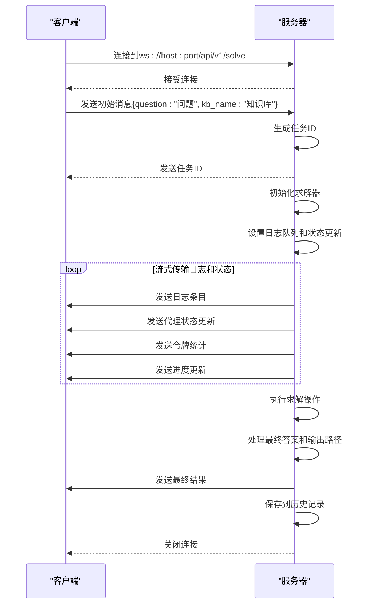
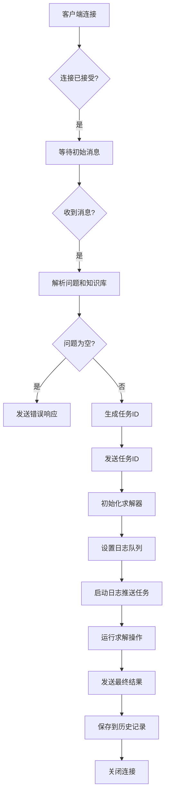
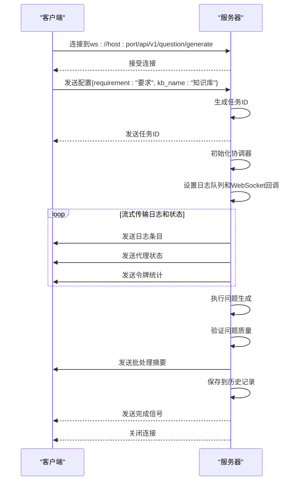
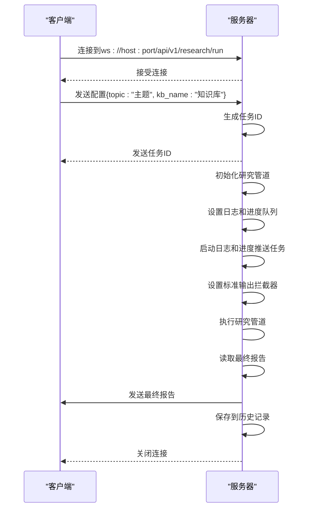
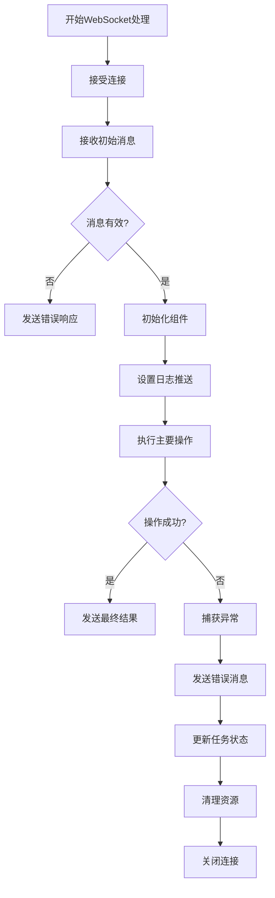
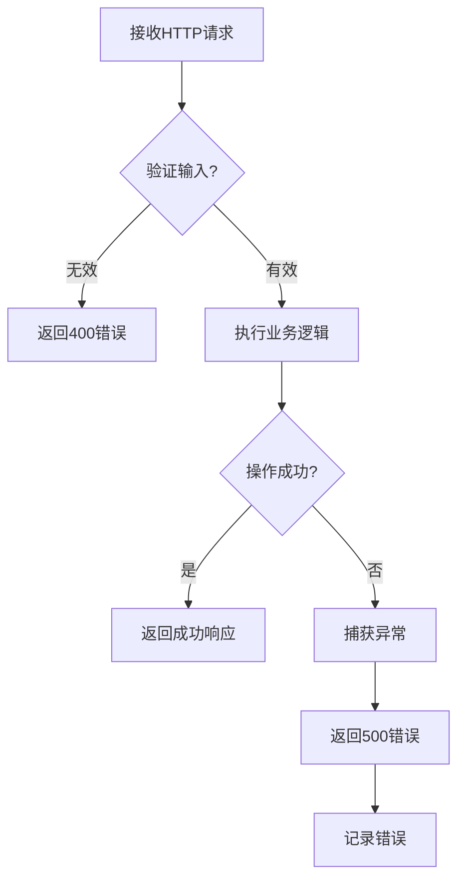
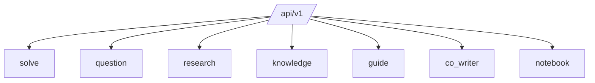

# API文档

<cite>
**本文档引用的文件**   
- [main.py](file://src/api/main.py)
- [solve.py](file://src/api/routers/solve.py)
- [question.py](file://src/api/routers/question.py)
- [research.py](file://src/api/routers/research.py)
- [knowledge.py](file://src/api/routers/knowledge.py)
- [guide.py](file://src/api/routers/guide.py)
- [co_writer.py](file://src/api/routers/co_writer.py)
- [notebook.py](file://src/api/routers/notebook.py)
- [log_interceptor.py](file://src/api/utils/log_interceptor.py)
- [main.yaml](file://config/main.yaml)
</cite>

## 目录
1. [简介](#简介)
2. [RESTful API端点](#restful-api端点)
3. [WebSocket API端点](#websocket-api端点)
4. [身份验证方法](#身份验证方法)
5. [错误处理策略](#错误处理策略)
6. [安全考虑](#安全考虑)
7. [速率限制](#速率限制)
8. [版本控制](#版本控制)
9. [客户端实现指南](#客户端实现指南)
10. [性能优化技巧](#性能优化技巧)

## 简介

DeepTutor API提供了一套全面的RESTful和WebSocket端点，用于支持各种智能学习功能。API基于FastAPI构建，提供了实时流式传输、静态文件服务和跨源资源共享（CORS）等功能。系统通过模块化的路由器设计，将不同的功能领域（如问题解决、研究、知识库管理等）分离，确保了良好的可维护性和扩展性。

API服务器在启动时会初始化用户目录结构，并通过`/api/outputs/`路径提供静态文件服务，允许前端访问生成的工件（如图像、PDF等）。CORS中间件配置为允许所有来源，但在生产环境中应配置为特定的前端来源。

**Section sources**
- [main.py](file://src/api/main.py#L1-L129)
- [README.md](file://src/api/README.md#L1-L276)

## RESTful API端点

### 知识库端点

知识库API提供对知识库的CRUD操作和文件上传功能。

| HTTP方法 | URL模式 | 描述 |
|---------|--------|------|
| GET | /api/v1/knowledge/list | 列出所有可用的知识库 |
| GET | /api/v1/knowledge/{kb_name} | 获取特定知识库的详细信息 |
| POST | /api/v1/knowledge/create | 创建新的知识库 |
| POST | /api/v1/knowledge/{kb_name}/upload | 上传文档到知识库 |
| DELETE | /api/v1/knowledge/{kb_name} | 删除知识库 |
| GET | /api/v1/knowledge/{kb_name}/progress | 获取知识库初始化进度 |
| POST | /api/v1/knowledge/{kb_name}/progress/clear | 清除进度文件（用于卡住的状态） |

**Section sources**
- [knowledge.py](file://src/api/routers/knowledge.py#L1-L535)

### 指导学习端点

指导学习API提供会话创建、学习进度管理和聊天交互功能。

| HTTP方法 | URL模式 | 描述 |
|---------|--------|------|
| POST | /api/v1/guide/create_session | 创建新的指导学习会话 |
| POST | /api/v1/guide/start | 开始学习（获取第一个知识点） |
| POST | /api/v1/guide/next | 移动到下一个知识点 |
| POST | /api/v1/guide/chat | 发送聊天消息 |
| POST | /api/v1/guide/fix_html | 修复HTML页面错误 |
| GET | /api/v1/guide/session/{session_id} | 获取会话信息 |
| GET | /api/v1/guide/session/{session_id}/html | 获取当前HTML页面 |

**Section sources**
- [guide.py](file://src/api/routers/guide.py#L1-L337)

### 协同写作端点

协同写作API提供文本编辑、自动标注和叙述生成功能。

| HTTP方法 | URL模式 | 描述 |
|---------|--------|------|
| POST | /api/v1/co_writer/edit | 编辑文本 |
| POST | /api/v1/co_writer/automark | AI自动标注文本 |
| GET | /api/v1/co_writer/history | 获取所有操作历史 |
| GET | /api/v1/co_writer/history/{operation_id} | 获取单个操作详情 |
| GET | /api/v1/co_writer/tool_calls/{operation_id} | 获取工具调用详情 |
| POST | /api/v1/co_writer/export/markdown | 导出为Markdown文件 |
| POST | /api/v1/co_writer/narrate | 生成笔记叙述脚本并可选生成TTS音频 |
| POST | /api/v1/co_writer/narrate/script | 仅生成脚本（无音频生成） |
| GET | /api/v1/co_writer/tts/status | 检查TTS服务状态 |
| GET | /api/v1/co_writer/tts/voices | 获取可用的TTS语音角色列表 |

**Section sources**
- [co_writer.py](file://src/api/routers/co_writer.py#L1-L313)

### 笔记本端点

笔记本API提供笔记本的创建、查询、更新、删除和记录管理功能。

| HTTP方法 | URL模式 | 描述 |
|---------|--------|------|
| GET | /api/v1/notebook/list | 获取所有笔记本列表 |
| GET | /api/v1/notebook/statistics | 获取笔记本统计信息 |
| POST | /api/v1/notebook/create | 创建新笔记本 |
| GET | /api/v1/notebook/{notebook_id} | 获取笔记本详细信息 |
| PUT | /api/v1/notebook/{notebook_id} | 更新笔记本信息 |
| DELETE | /api/v1/notebook/{notebook_id} | 删除笔记本 |
| POST | /api/v1/notebook/add_record | 向笔记本添加记录 |
| DELETE | /api/v1/notebook/{notebook_id}/records/{record_id} | 从笔记本中移除记录 |

**Section sources**
- [notebook.py](file://src/api/routers/notebook.py#L1-L248)

## WebSocket API端点

### 问题解决端点

`/api/v1/solve`是主要的WebSocket端点，用于实时问题解决和流式日志。



**Diagram sources **
- [solve.py](file://src/api/routers/solve.py#L1-L294)

#### 连接处理

客户端通过WebSocket连接到`/api/v1/solve`端点。连接建立后，客户端必须发送包含问题和知识库名称的初始JSON消息。服务器会验证输入并生成唯一的任务ID，然后通过WebSocket发送回客户端。



**Diagram sources **
- [solve.py](file://src/api/routers/solve.py#L1-L294)

#### 消息格式

WebSocket通信使用JSON格式的消息。主要消息类型包括：

- **初始消息**：客户端发送，包含问题和知识库信息
- **任务ID消息**：服务器发送，包含生成的任务ID
- **日志消息**：服务器发送，包含流式日志条目
- **状态消息**：服务器发送，包含操作状态
- **代理状态消息**：服务器发送，包含各个代理的状态
- **令牌统计消息**：服务器发送，包含令牌使用统计
- **进度消息**：服务器发送，包含操作进度
- **结果消息**：服务器发送，包含最终结果
- **错误消息**：服务器发送，包含错误信息

**Section sources**
- [solve.py](file://src/api/routers/solve.py#L1-L294)

#### 事件类型

服务器通过WebSocket发送多种事件类型，客户端可以据此更新UI：

- **task_id**: 包含任务ID，用于跟踪操作
- **status**: 操作状态（如"started"）
- **agent_status**: 代理状态更新，显示各个代理的活动状态
- **token_stats**: 令牌使用统计，包括模型、调用次数和成本
- **progress**: 操作进度更新
- **log**: 日志条目，用于实时显示处理过程
- **result**: 最终结果，包含最终答案和元数据
- **error**: 错误信息，当操作失败时发送

**Section sources**
- [solve.py](file://src/api/routers/solve.py#L1-L294)

### 问题生成端点

`/api/v1/question/generate`端点用于实时问题生成。



**Diagram sources **
- [question.py](file://src/api/routers/question.py#L1-L465)

### 研究执行端点

`/api/v1/research/run`端点用于实时研究执行。



**Diagram sources **
- [research.py](file://src/api/routers/research.py#L1-L407)

## 身份验证方法

DeepTutor API目前没有实现复杂的身份验证机制。系统依赖于环境变量中的API密钥进行LLM配置。API密钥通过`src.core.core.get_llm_config()`函数从配置中获取，并在需要时注入到各个组件中。

对于生产部署，建议在反向代理层（如Nginx）或API网关中实现适当的身份验证机制，如API密钥、JWT令牌或OAuth2。

**Section sources**
- [main.yaml](file://config/main.yaml#L1-L142)
- [core.py](file://src/core/core.py)

## 错误处理策略

API实现了全面的错误处理策略，确保客户端能够获得有意义的错误信息。

### WebSocket错误处理

WebSocket端点使用try-catch块捕获异常，并通过WebSocket发送结构化的错误消息。连接断开时会优雅地清理资源。



**Section sources**
- [solve.py](file://src/api/routers/solve.py#L1-L294)
- [question.py](file://src/api/routers/question.py#L1-L465)
- [research.py](file://src/api/routers/research.py#L1-L407)

### REST API错误处理

REST端点使用FastAPI的HTTPException来处理错误情况，返回适当的HTTP状态码和错误消息。



**Section sources**
- [knowledge.py](file://src/api/routers/knowledge.py#L1-L535)
- [guide.py](file://src/api/routers/guide.py#L1-L337)

## 安全考虑

### CORS配置

API配置了CORS中间件，当前允许所有来源。在生产环境中，应将`allow_origins`配置为特定的前端URL。

```python
app.add_middleware(
    CORSMiddleware,
    allow_origins=["http://localhost:3000"],  # 特定前端URL
    allow_credentials=True,
    allow_methods=["*"],
    allow_headers=["*"],
)
```

**Section sources**
- [main.py](file://src/api/main.py#L41-L48)

### 输入验证

所有端点都实现了输入验证，防止恶意输入。例如，知识库名称在访问前会进行验证。

### 文件上传安全

文件上传功能将文件保存到受控目录中，并使用安全的文件操作来防止路径遍历攻击。

**Section sources**
- [knowledge.py](file://src/api/routers/knowledge.py#L1-L535)

## 速率限制

当前API实现中没有内置的速率限制机制。建议在部署时使用外部工具（如Nginx、Traefik或专门的API网关）来实现速率限制，以防止滥用。

**Section sources**
- [main.py](file://src/api/main.py)

## 版本控制

API使用简单的版本控制，所有端点都位于`/api/v1/`前缀下。这允许未来进行非破坏性更新，同时保持向后兼容性。



**Diagram sources **
- [main.py](file://src/api/main.py#L69-L80)

## 客户端实现指南

### WebSocket连接

客户端应使用`wsUrl`函数构建WebSocket URL，该函数会根据环境配置自动处理协议转换。

```typescript
export function wsUrl(path: string): string {
  const base = API_BASE_URL.replace(/^http:/, "ws:").replace(/^https:/, "wss:");
  const normalizedPath = path.startsWith("/") ? path : `/${path}`;
  const normalizedBase = base.endsWith("/") ? base.slice(0, -1) : base;
  return `${normalizedBase}${normalizedPath}`;
}
```

**Section sources**
- [api.ts](file://web/lib/api.ts#L47-L58)

### 问题解决客户端示例

```javascript
const ws = new WebSocket(wsUrl('/api/v1/solve'));
ws.onopen = () => {
  ws.send(JSON.stringify({
    question: "您的问题",
    kb_name: "ai_textbook"
  }));
};
ws.onmessage = (event) => {
  const data = JSON.parse(event.data);
  console.log(data);
  // 根据消息类型更新UI
  switch(data.type) {
    case 'task_id':
      console.log('任务ID:', data.task_id);
      break;
    case 'status':
      console.log('状态:', data.content);
      break;
    case 'agent_status':
      console.log('代理状态:', data.all_agents);
      break;
    case 'token_stats':
      console.log('令牌统计:', data.stats);
      break;
    case 'result':
      console.log('最终答案:', data.final_answer);
      break;
    case 'error':
      console.error('错误:', data.content);
      break;
  }
};
```

**Section sources**
- [solve.py](file://src/api/routers/solve.py#L1-L294)
- [README.md](file://src/api/README.md#L135-L148)

## 性能优化技巧

### 连接管理

- 保持WebSocket连接打开以进行长时间操作
- 实现心跳机制以防止连接超时
- 在连接断开时优雅地重试

### 批量操作

- 对于多个相关操作，考虑实现批量端点以减少网络开销
- 使用流式传输而不是单个大响应

### 缓存策略

- 对于频繁访问的静态资源，使用适当的HTTP缓存头
- 考虑在客户端实现结果缓存

### 错误恢复

- 实现重试逻辑以处理临时故障
- 使用任务ID跟踪操作，以便在连接丢失后恢复

**Section sources**
- [solve.py](file://src/api/routers/solve.py#L1-L294)
- [README.md](file://src/api/README.md#L270-L276)