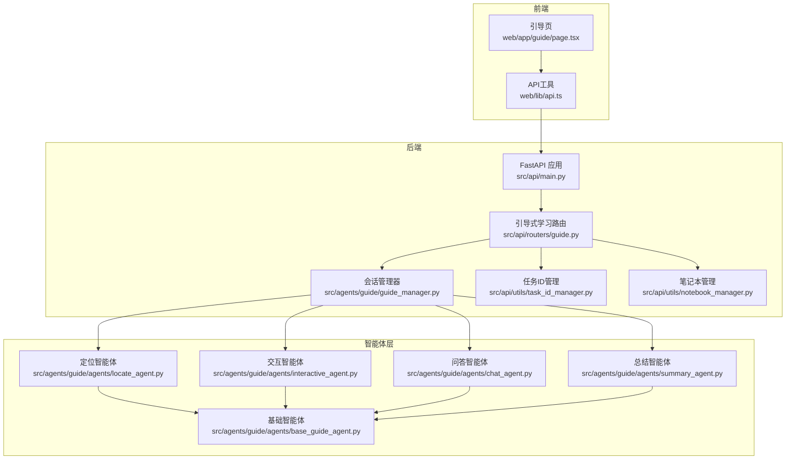
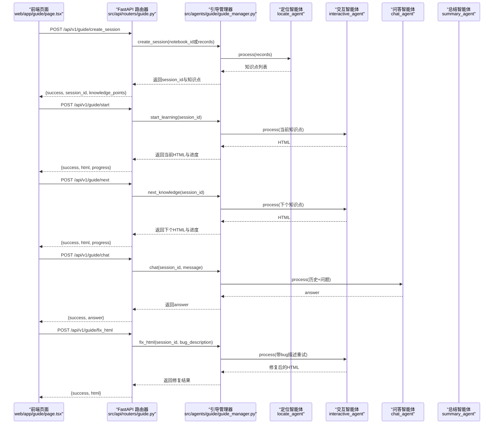
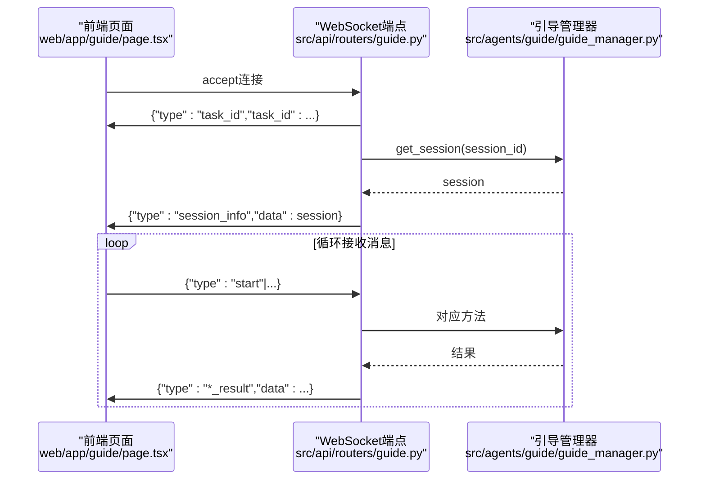
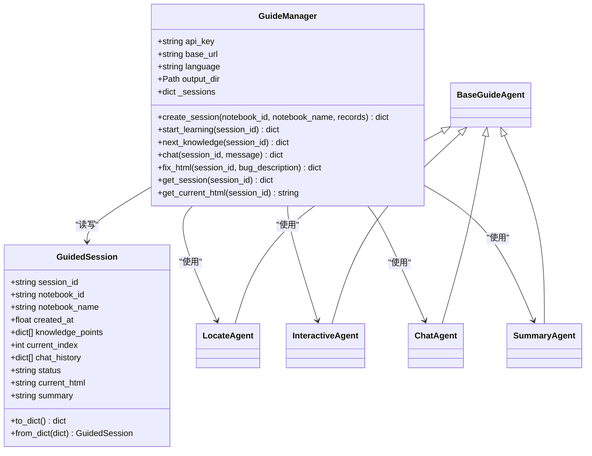
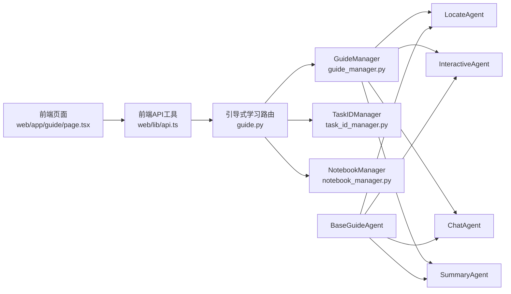

# 引导式学习API

<cite>
**本文引用的文件列表**
- [src/api/main.py](file://src/api/main.py)
- [src/api/routers/guide.py](file://src/api/routers/guide.py)
- [src/agents/guide/guide_manager.py](file://src/agents/guide/guide_manager.py)
- [src/agents/guide/agents/base_guide_agent.py](file://src/agents/guide/agents/base_guide_agent.py)
- [src/agents/guide/agents/interactive_agent.py](file://src/agents/guide/agents/interactive_agent.py)
- [src/agents/guide/agents/chat_agent.py](file://src/agents/guide/agents/chat_agent.py)
- [src/agents/guide/agents/locate_agent.py](file://src/agents/guide/agents/locate_agent.py)
- [src/agents/guide/agents/summary_agent.py](file://src/agents/guide/agents/summary_agent.py)
- [src/api/utils/task_id_manager.py](file://src/api/utils/task_id_manager.py)
- [src/api/utils/notebook_manager.py](file://src/api/utils/notebook_manager.py)
- [src/api/utils/history.py](file://src/api/utils/history.py)
- [web/lib/api.ts](file://web/lib/api.ts)
- [web/app/guide/page.tsx](file://web/app/guide/page.tsx)
</cite>

## 目录
1. [简介](#简介)
2. [项目结构](#项目结构)
3. [核心组件](#核心组件)
4. [架构总览](#架构总览)
5. [详细组件分析](#详细组件分析)
6. [依赖关系分析](#依赖关系分析)
7. [性能与可扩展性](#性能与可扩展性)
8. [故障排查指南](#故障排查指南)
9. [结论](#结论)
10. [附录：客户端交互示例与最佳实践](#附录客户端交互示例与最佳实践)

## 简介
本文件面向DeepTutor引导式学习API，系统性记录REST端点与WebSocket端点，解释Pydantic请求模型、会话管理机制、任务ID生成、引导管理器(GuideManager)初始化流程，以及HTML修复与跨笔记本模式的实现细节。同时提供客户端交互示例与健康检查、错误处理策略，帮助开发者快速集成与调试。

## 项目结构
引导式学习API位于后端FastAPI应用中，路由集中在guide路由器；前端通过Next.js页面与API交互，并使用WebSocket实现实时状态推送。

图表来源
- [src/api/main.py](file://src/api/main.py#L1-L129)
- [src/api/routers/guide.py](file://src/api/routers/guide.py#L1-L337)
- [src/agents/guide/guide_manager.py](file://src/agents/guide/guide_manager.py#L1-L475)
- [src/agents/guide/agents/base_guide_agent.py](file://src/agents/guide/agents/base_guide_agent.py#L1-L176)
- [src/agents/guide/agents/interactive_agent.py](file://src/agents/guide/agents/interactive_agent.py#L1-L211)
- [src/agents/guide/agents/chat_agent.py](file://src/agents/guide/agents/chat_agent.py#L1-L92)
- [src/agents/guide/agents/locate_agent.py](file://src/agents/guide/agents/locate_agent.py#L1-L137)
- [src/agents/guide/agents/summary_agent.py](file://src/agents/guide/agents/summary_agent.py#L1-L138)
- [src/api/utils/task_id_manager.py](file://src/api/utils/task_id_manager.py#L1-L103)
- [src/api/utils/notebook_manager.py](file://src/api/utils/notebook_manager.py#L1-L416)
- [web/lib/api.ts](file://web/lib/api.ts#L1-L59)
- [web/app/guide/page.tsx](file://web/app/guide/page.tsx#L1-L800)

章节来源
- [src/api/main.py](file://src/api/main.py#L1-L129)
- [src/api/routers/guide.py](file://src/api/routers/guide.py#L1-L337)

## 核心组件
- FastAPI应用与路由挂载：在主应用中注册所有模块路由，包含引导式学习模块。
- 引导式学习路由器：定义REST端点与WebSocket端点，封装请求模型与业务调用。
- 引导管理器：负责会话生命周期、知识点规划、交互页面生成、问答与总结。
- 智能体层：定位、交互、问答、总结等子智能体，统一继承基础智能体。
- 工具类：任务ID管理、笔记本管理、历史记录管理。

章节来源
- [src/api/main.py](file://src/api/main.py#L1-L129)
- [src/api/routers/guide.py](file://src/api/routers/guide.py#L1-L337)
- [src/agents/guide/guide_manager.py](file://src/agents/guide/guide_manager.py#L1-L475)
- [src/agents/guide/agents/base_guide_agent.py](file://src/agents/guide/agents/base_guide_agent.py#L1-L176)

## 架构总览
引导式学习API采用“路由器-管理器-智能体”三层结构：
- 路由器接收HTTP/WebSocket请求，解析Pydantic模型，调用引导管理器执行业务逻辑。
- 引导管理器维护会话状态，协调多个智能体完成知识点定位、交互页面生成、问答与总结。
- 基础智能体封装LLM调用、提示词加载、统计追踪等通用能力。

图表来源
- [src/api/routers/guide.py](file://src/api/routers/guide.py#L86-L203)
- [src/agents/guide/guide_manager.py](file://src/agents/guide/guide_manager.py#L149-L475)
- [src/agents/guide/agents/locate_agent.py](file://src/agents/guide/agents/locate_agent.py#L48-L137)
- [src/agents/guide/agents/interactive_agent.py](file://src/agents/guide/agents/interactive_agent.py#L143-L211)
- [src/agents/guide/agents/chat_agent.py](file://src/agents/guide/agents/chat_agent.py#L39-L92)
- [src/agents/guide/agents/summary_agent.py](file://src/agents/guide/agents/summary_agent.py#L61-L138)

## 详细组件分析

### REST端点与请求模型
- /api/v1/guide/create_session
  - 方法：POST
  - 请求模型：CreateSessionRequest
    - 字段：notebook_id: 可选字符串；records: 可选数组字典
    - 用途：单笔记本模式或跨笔记本模式直接传入records
  - 行为：根据输入选择模式，调用引导管理器创建会话，返回session_id与知识清单
  - 错误：未提供必要参数、无可用记录、内部异常均转为HTTP 4xx/5xx

- /api/v1/guide/start
  - 方法：POST
  - 请求模型：NextKnowledgeRequest
    - 字段：session_id: 必填
  - 行为：启动学习，生成第一个知识点的交互HTML，更新会话状态

- /api/v1/guide/next
  - 方法：POST
  - 请求模型：NextKnowledgeRequest
  - 行为：进入下一个知识点，生成对应HTML；若全部完成则生成总结

- /api/v1/guide/chat
  - 方法：POST
  - 请求模型：ChatRequest
    - 字段：session_id, message
  - 行为：基于当前知识点与历史对话生成回答

- /api/v1/guide/fix_html
  - 方法：POST
  - 请求模型：FixHtmlRequest
    - 字段：session_id, bug_description
  - 行为：对当前HTML进行修复，支持带bug描述的重试生成

- /api/v1/guide/session/{session_id}
  - 方法：GET
  - 行为：获取会话信息（知识清单、进度、状态等）

- /api/v1/guide/session/{session_id}/html
  - 方法：GET
  - 行为：获取当前HTML内容

- /api/v1/guide/health
  - 方法：GET
  - 行为：健康检查，返回服务状态

章节来源
- [src/api/routers/guide.py](file://src/api/routers/guide.py#L37-L203)
- [src/api/routers/guide.py](file://src/api/routers/guide.py#L205-L239)
- [src/api/routers/guide.py](file://src/api/routers/guide.py#L333-L337)

### WebSocket端点
- /api/v1/guide/ws/{session_id}
  - 支持消息类型：
    - start：开始学习
    - next：下一个知识点
    - chat：发送聊天消息
    - fix_html：修复HTML
    - get_session：获取会话状态
  - 连接建立后先下发task_id，随后下发session_info；按消息类型分发到对应处理逻辑，返回结果或错误

图表来源
- [src/api/routers/guide.py](file://src/api/routers/guide.py#L244-L332)
- [src/agents/guide/guide_manager.py](file://src/agents/guide/guide_manager.py#L462-L475)

章节来源
- [src/api/routers/guide.py](file://src/api/routers/guide.py#L244-L332)

### 会话管理机制与数据模型
- GuidedSession数据模型
  - 字段：session_id, notebook_id, notebook_name, created_at, knowledge_points, current_index, chat_history, status, current_html, summary
  - 作用：持久化保存会话状态，支持读取与写入

- 引导管理器
  - 初始化：从配置加载语言、输出目录、日志目录；实例化各智能体
  - 会话存储：以JSON文件形式保存在输出目录，键为session_id
  - 生命周期：
    - create_session：调用定位智能体生成知识清单，创建会话并保存
    - start_learning：生成首个知识点HTML，设置状态为learning
    - next_knowledge：推进到下一个知识点，生成HTML；完成后生成总结并标记completed
    - chat：基于当前知识点与历史对话生成回答
    - fix_html：带bug描述重试生成HTML
    - get_session/get_current_html：查询会话与当前HTML

图表来源
- [src/agents/guide/guide_manager.py](file://src/agents/guide/guide_manager.py#L21-L123)
- [src/agents/guide/guide_manager.py](file://src/agents/guide/guide_manager.py#L149-L475)
- [src/agents/guide/agents/base_guide_agent.py](file://src/agents/guide/agents/base_guide_agent.py#L21-L176)

章节来源
- [src/agents/guide/guide_manager.py](file://src/agents/guide/guide_manager.py#L21-L123)
- [src/agents/guide/guide_manager.py](file://src/agents/guide/guide_manager.py#L149-L475)

### 任务ID生成与追踪
- TaskIDManager
  - 单例：线程安全，全局唯一实例
  - 生成规则：格式为“{task_type}_{时间戳}_{UUID前缀}”，并缓存task_key到task_id映射
  - 元数据：记录task_type、task_key、创建时间、状态、结束时间等
  - 清理策略：定期清理超过阈值小时的已完成任务

章节来源
- [src/api/utils/task_id_manager.py](file://src/api/utils/task_id_manager.py#L1-L103)
- [src/api/routers/guide.py](file://src/api/routers/guide.py#L258-L267)

### HTML修复与跨笔记本模式
- HTML修复
  - 交互智能体支持带bug描述的重试生成，若解析失败或校验不通过，回退到内置模板
  - 修复成功后更新会话current_html并持久化

- 跨笔记本模式
  - create_session支持直接传入records数组，无需指定notebook_id
  - 前端页面支持多笔记本选择并合并records作为输入

章节来源
- [src/agents/guide/agents/interactive_agent.py](file://src/agents/guide/agents/interactive_agent.py#L143-L211)
- [src/api/routers/guide.py](file://src/api/routers/guide.py#L96-L136)
- [web/app/guide/page.tsx](file://web/app/guide/page.tsx#L391-L481)

### 智能体与提示词加载
- 基础智能体
  - 统一LLM调用接口、提示词加载、统计追踪
  - 提示词目录按语言区分（zh/en），自动加载对应文件

- 定位智能体
  - 将笔记本records格式化为长文本，调用LLM生成知识清单（JSON对象或数组）

- 交互智能体
  - 从LLM响应中提取HTML片段，若无效则回退到内置模板

- 问答智能体
  - 基于历史对话与当前知识点生成回答

- 总结智能体
  - 汇总学习历程与问答历史，生成总结报告

章节来源
- [src/agents/guide/agents/base_guide_agent.py](file://src/agents/guide/agents/base_guide_agent.py#L78-L176)
- [src/agents/guide/agents/locate_agent.py](file://src/agents/guide/agents/locate_agent.py#L48-L137)
- [src/agents/guide/agents/interactive_agent.py](file://src/agents/guide/agents/interactive_agent.py#L143-L211)
- [src/agents/guide/agents/chat_agent.py](file://src/agents/guide/agents/chat_agent.py#L39-L92)
- [src/agents/guide/agents/summary_agent.py](file://src/agents/guide/agents/summary_agent.py#L61-L138)

## 依赖关系分析
- 路由器依赖引导管理器与工具类
- 引导管理器依赖各智能体与配置加载
- 智能体依赖基础智能体提供的LLM调用与提示词加载
- 前端通过API工具构造URL，页面发起HTTP与WebSocket请求

图表来源
- [src/api/routers/guide.py](file://src/api/routers/guide.py#L1-L337)
- [src/agents/guide/guide_manager.py](file://src/agents/guide/guide_manager.py#L1-L475)
- [src/agents/guide/agents/base_guide_agent.py](file://src/agents/guide/agents/base_guide_agent.py#L1-L176)
- [web/lib/api.ts](file://web/lib/api.ts#L1-L59)
- [web/app/guide/page.tsx](file://web/app/guide/page.tsx#L1-L800)

章节来源
- [src/api/routers/guide.py](file://src/api/routers/guide.py#L1-L337)
- [src/agents/guide/guide_manager.py](file://src/agents/guide/guide_manager.py#L1-L475)
- [src/agents/guide/agents/base_guide_agent.py](file://src/agents/guide/agents/base_guide_agent.py#L1-L176)
- [web/lib/api.ts](file://web/lib/api.ts#L1-L59)
- [web/app/guide/page.tsx](file://web/app/guide/page.tsx#L1-L800)

## 性能与可扩展性
- 并发与线程安全：TaskIDManager使用锁保证并发安全；建议在高并发场景下限制同时创建的会话数量。
- LLM调用：基础智能体统一管理温度、最大token等参数，避免重复初始化；建议在生产环境配置合适的模型参数。
- 存储与IO：会话以JSON文件存储，注意磁盘空间与文件系统性能；可考虑定期清理旧会话或压缩历史数据。
- 前端渲染：iframe注入KaTeX提升数学公式渲染体验，但需关注HTML大小与渲染性能。

[本节为通用指导，不直接分析具体文件]

## 故障排查指南
- 健康检查
  - GET /api/v1/guide/health：确认服务运行正常
- 常见错误
  - 会话不存在：start/next/chat/fix_html等操作需确保session_id有效
  - 未在学习态：chat仅在learning状态下允许
  - 无可用记录：create_session必须提供有效的notebook_id或records
  - LLM配置错误：get_guide_manager会从配置读取api_key与base_url，缺失将导致500
- 日志与统计
  - 各智能体与基础智能体记录日志；学习统计可在完成时打印
- 前端调试
  - 使用调试弹窗输入bug描述触发fix_html；查看控制台网络面板确认请求与响应

章节来源
- [src/api/routers/guide.py](file://src/api/routers/guide.py#L144-L203)
- [src/api/routers/guide.py](file://src/api/routers/guide.py#L233-L239)
- [src/agents/guide/guide_manager.py](file://src/agents/guide/guide_manager.py#L381-L475)
- [src/agents/guide/agents/base_guide_agent.py](file://src/agents/guide/agents/base_guide_agent.py#L60-L77)

## 结论
引导式学习API通过清晰的REST与WebSocket接口、完善的会话管理与智能体协作，实现了从知识点规划到交互学习、问答与总结的完整闭环。结合任务ID追踪与前端实时交互，能够为用户提供流畅的学习体验。建议在生产环境中完善监控、日志与资源配额管理，确保稳定性与可扩展性。

[本节为总结性内容，不直接分析具体文件]

## 附录：客户端交互示例与最佳实践

### 客户端交互示例（基于前端页面）
- 创建会话（跨笔记本模式）
  - 步骤：选择若干笔记本记录，点击创建会话
  - 请求：POST /api/v1/guide/create_session，Body包含records数组
  - 成功后：返回session_id与知识清单，前端显示学习计划
- 开始学习
  - 请求：POST /api/v1/guide/start，Body包含session_id
  - 成功后：返回首个HTML与进度，前端iframe加载
- 下一个知识点
  - 请求：POST /api/v1/guide/next，Body包含session_id
  - 成功后：返回下个HTML与进度；若完成则返回总结
- 聊天
  - 请求：POST /api/v1/guide/chat，Body包含session_id与message
  - 成功后：返回answer，前端显示问答历史
- 修复HTML
  - 请求：POST /api/v1/guide/fix_html，Body包含session_id与bug_description
  - 成功后：返回修复后的HTML，前端刷新iframe
- 获取当前HTML
  - 请求：GET /api/v1/guide/session/{session_id}/html
  - 用途：用于外部集成或调试

章节来源
- [web/app/guide/page.tsx](file://web/app/guide/page.tsx#L391-L774)
- [src/api/routers/guide.py](file://src/api/routers/guide.py#L86-L203)
- [src/api/routers/guide.py](file://src/api/routers/guide.py#L223-L239)

### 最佳实践
- 参数校验：前端在提交前校验必填字段，减少无效请求
- 错误处理：捕获HTTP错误与WebSocket异常，向用户反馈明确信息
- 任务追踪：利用task_id关联后台任务，便于问题定位
- 资源管理：合理设置LLM参数与超时，避免长时间阻塞
- 前端优化：iframe加载完成后注入必要的样式与脚本，确保渲染一致性

[本节为通用指导，不直接分析具体文件]