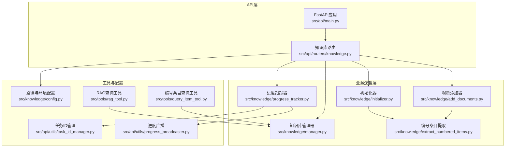
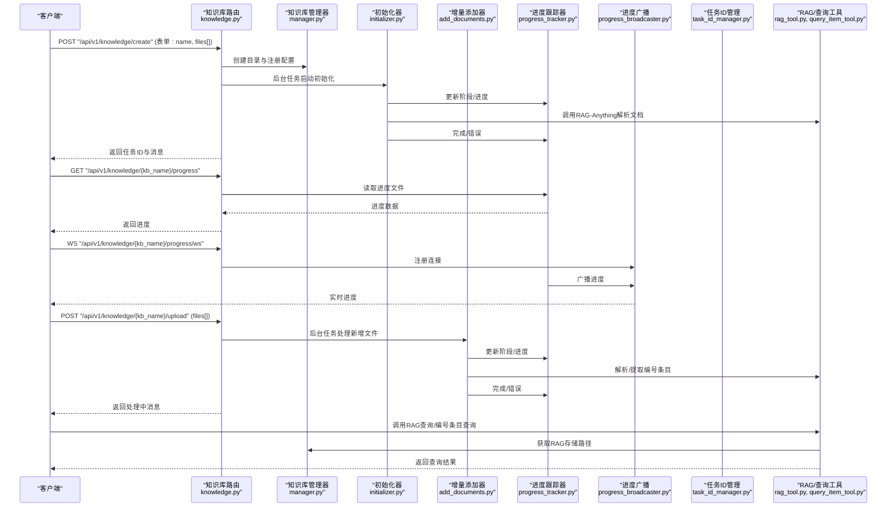
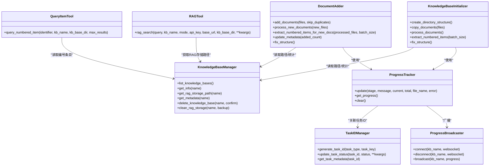

# 知识库API

<cite>
**本文引用的文件列表**
- [src/api/main.py](file://src/api/main.py)
- [src/api/routers/knowledge.py](file://src/api/routers/knowledge.py)
- [src/knowledge/manager.py](file://src/knowledge/manager.py)
- [src/knowledge/initializer.py](file://src/knowledge/initializer.py)
- [src/knowledge/add_documents.py](file://src/knowledge/add_documents.py)
- [src/knowledge/progress_tracker.py](file://src/knowledge/progress_tracker.py)
- [src/knowledge/extract_numbered_items.py](file://src/knowledge/extract_numbered_items.py)
- [src/knowledge/config.py](file://src/knowledge/config.py)
- [src/knowledge/example_add_documents.py](file://src/knowledge/example_add_documents.py)
- [src/tools/rag_tool.py](file://src/tools/rag_tool.py)
- [src/tools/query_item_tool.py](file://src/tools/query_item_tool.py)
- [src/api/utils/task_id_manager.py](file://src/api/utils/task_id_manager.py)
- [src/api/utils/progress_broadcaster.py](file://src/api/utils/progress_broadcaster.py)
</cite>

## 目录
1. [简介](#简介)
2. [项目结构](#项目结构)
3. [核心组件](#核心组件)
4. [架构总览](#架构总览)
5. [详细组件分析](#详细组件分析)
6. [依赖关系分析](#依赖关系分析)
7. [性能考量](#性能考量)
8. [故障排查指南](#故障排查指南)
9. [结论](#结论)
10. [附录](#附录)

## 简介
本文件为 DeepTutor 知识库API的权威文档，覆盖知识库管理相关端点，包括：
- 文档添加与增量更新
- 索引构建与知识图谱初始化
- 知识检索与RAG集成
- 进度跟踪与状态查询
- 错误处理、文件上传限制与性能建议

目标是帮助开发者与使用者以API方式高效地完成知识库的创建、维护与检索，并在前端或自动化流程中稳定集成。

## 项目结构
知识库API位于后端 FastAPI 应用中，路由集中在知识库模块；底层由知识库管理器、初始化器、增量添加器、进度跟踪器与工具函数共同支撑。

图表来源
- [src/api/main.py](file://src/api/main.py#L1-L129)
- [src/api/routers/knowledge.py](file://src/api/routers/knowledge.py#L1-L535)
- [src/knowledge/manager.py](file://src/knowledge/manager.py#L1-L458)
- [src/knowledge/initializer.py](file://src/knowledge/initializer.py#L1-L684)
- [src/knowledge/add_documents.py](file://src/knowledge/add_documents.py#L1-L622)
- [src/knowledge/progress_tracker.py](file://src/knowledge/progress_tracker.py#L1-L192)
- [src/knowledge/extract_numbered_items.py](file://src/knowledge/extract_numbered_items.py#L1-L800)
- [src/knowledge/config.py](file://src/knowledge/config.py#L1-L66)
- [src/api/utils/task_id_manager.py](file://src/api/utils/task_id_manager.py#L1-L103)
- [src/api/utils/progress_broadcaster.py](file://src/api/utils/progress_broadcaster.py#L1-L73)
- [src/tools/rag_tool.py](file://src/tools/rag_tool.py#L1-L263)
- [src/tools/query_item_tool.py](file://src/tools/query_item_tool.py#L1-L310)

章节来源
- [src/api/main.py](file://src/api/main.py#L1-L129)
- [src/api/routers/knowledge.py](file://src/api/routers/knowledge.py#L1-L535)

## 核心组件
- 知识库管理器：负责知识库目录结构、元数据读取、统计信息汇总、默认知识库设置、RAG存储清理等。
- 初始化器：创建知识库目录结构、复制文档、调用RAG-Anything进行解析与入库、提取编号条目、修正嵌套结构。
- 增量添加器：向已有知识库追加新文档，仅处理新增文件，不重建整个知识图谱。
- 进度跟踪器：统一记录初始化/处理阶段、百分比、当前文件、错误信息，并持久化至进度文件，同时通过广播器推送WebSocket。
- 编号条目提取：基于LLM批量抽取定义、定理、公式、图像、表格等编号内容，形成可检索的“编号条目”清单。
- 工具与配置：RAG查询工具、编号条目查询工具、任务ID管理、进度广播、路径与环境配置。

章节来源
- [src/knowledge/manager.py](file://src/knowledge/manager.py#L1-L458)
- [src/knowledge/initializer.py](file://src/knowledge/initializer.py#L1-L684)
- [src/knowledge/add_documents.py](file://src/knowledge/add_documents.py#L1-L622)
- [src/knowledge/progress_tracker.py](file://src/knowledge/progress_tracker.py#L1-L192)
- [src/knowledge/extract_numbered_items.py](file://src/knowledge/extract_numbered_items.py#L1-L800)
- [src/knowledge/config.py](file://src/knowledge/config.py#L1-L66)
- [src/tools/rag_tool.py](file://src/tools/rag_tool.py#L1-L263)
- [src/tools/query_item_tool.py](file://src/tools/query_item_tool.py#L1-L310)
- [src/api/utils/task_id_manager.py](file://src/api/utils/task_id_manager.py#L1-L103)
- [src/api/utils/progress_broadcaster.py](file://src/api/utils/progress_broadcaster.py#L1-L73)

## 架构总览
知识库API采用“路由-服务-工具”的分层设计：
- 路由层：提供HTTP端点与WebSocket端点，负责参数校验、异常捕获、后台任务调度。
- 服务层：封装知识库管理、初始化、增量添加、进度跟踪等核心逻辑。
- 工具层：RAG查询、编号条目查询、任务ID与进度广播等通用能力。

图表来源
- [src/api/routers/knowledge.py](file://src/api/routers/knowledge.py#L1-L535)
- [src/knowledge/manager.py](file://src/knowledge/manager.py#L1-L458)
- [src/knowledge/initializer.py](file://src/knowledge/initializer.py#L1-L684)
- [src/knowledge/add_documents.py](file://src/knowledge/add_documents.py#L1-L622)
- [src/knowledge/progress_tracker.py](file://src/knowledge/progress_tracker.py#L1-L192)
- [src/api/utils/progress_broadcaster.py](file://src/api/utils/progress_broadcaster.py#L1-L73)
- [src/api/utils/task_id_manager.py](file://src/api/utils/task_id_manager.py#L1-L103)
- [src/tools/rag_tool.py](file://src/tools/rag_tool.py#L1-L263)
- [src/tools/query_item_tool.py](file://src/tools/query_item_tool.py#L1-L310)

## 详细组件分析

### 知识库路由与端点
- 健康检查：GET /api/v1/knowledge/health
- 列出知识库：GET /api/v1/knowledge/list
- 查询知识库详情：GET /api/v1/knowledge/{kb_name}
- 删除知识库：DELETE /api/v1/knowledge/{kb_name}
- 创建并初始化知识库：POST /api/v1/knowledge/create (表单: name, files[])
- 上传并处理新文档：POST /api/v1/knowledge/{kb_name}/upload (files[])
- 获取进度：GET /api/v1/knowledge/{kb_name}/progress
- 清除进度：POST /api/v1/knowledge/{kb_name}/progress/clear
- 实时进度WebSocket：WS /api/v1/knowledge/{kb_name}/progress/ws

章节来源
- [src/api/routers/knowledge.py](file://src/api/routers/knowledge.py#L1-L535)

### 知识库管理器
- 提供知识库目录结构、元数据读取、统计信息汇总、默认知识库设置、删除与RAG存储清理。
- 统一从配置文件与目录扫描中识别知识库，保证兼容性。

章节来源
- [src/knowledge/manager.py](file://src/knowledge/manager.py#L1-L458)

### 初始化器
- 创建目录结构、复制文档、调用RAG-Anything解析并写入知识图谱、提取编号条目、修正嵌套结构。
- 支持批量处理、进度跟踪、错误回退与日志输出。

章节来源
- [src/knowledge/initializer.py](file://src/knowledge/initializer.py#L1-L684)

### 增量添加器
- 仅对新增文件执行解析与入库，保留既有知识图谱不变。
- 支持复制文件、逐个处理、提取编号条目、更新元数据。

章节来源
- [src/knowledge/add_documents.py](file://src/knowledge/add_documents.py#L1-L622)

### 进度跟踪器与广播
- 统一阶段枚举：初始化、处理文档、处理单文件、提取编号条目、完成、错误。
- 持久化进度文件，WebSocket广播实时进度，回调通知。

章节来源
- [src/knowledge/progress_tracker.py](file://src/knowledge/progress_tracker.py#L1-L192)
- [src/api/utils/progress_broadcaster.py](file://src/api/utils/progress_broadcaster.py#L1-L73)
- [src/api/utils/task_id_manager.py](file://src/api/utils/task_id_manager.py#L1-L103)

### 编号条目提取
- 使用LLM批量抽取定义、定理、公式、图像、表格等编号内容，合并到统一JSON文件。
- 支持并发批处理、边界判定、图片路径收集与结果统计。

章节来源
- [src/knowledge/extract_numbered_items.py](file://src/knowledge/extract_numbered_items.py#L1-L800)

### RAG与查询工具
- RAG查询工具：支持本地/全局/混合/朴素模式，自动定位RAG存储路径，封装LLM与嵌入函数。
- 编号条目查询工具：按标识符精确/前缀/包含匹配，返回多条结果与合并内容。

章节来源
- [src/tools/rag_tool.py](file://src/tools/rag_tool.py#L1-L263)
- [src/tools/query_item_tool.py](file://src/tools/query_item_tool.py#L1-L310)

### 配置与路径
- 统一知识库根目录、RAG-Anything模块路径检测、环境变量读取。
- 为工具与路由提供一致的路径与配置入口。

章节来源
- [src/knowledge/config.py](file://src/knowledge/config.py#L1-L66)

### 示例与最佳实践
- 增量添加示例脚本展示了添加单/多文档、从目录批量添加、仅添加不处理、检查现有文件与错误处理。
- 建议：使用后台任务与进度查询/WebSocket，避免阻塞请求；合理设置批大小与并发；确保API密钥与基础URL可用。

章节来源
- [src/knowledge/example_add_documents.py](file://src/knowledge/example_add_documents.py#L1-L236)

## 依赖关系分析

图表来源
- [src/knowledge/manager.py](file://src/knowledge/manager.py#L1-L458)
- [src/knowledge/initializer.py](file://src/knowledge/initializer.py#L1-L684)
- [src/knowledge/add_documents.py](file://src/knowledge/add_documents.py#L1-L622)
- [src/knowledge/progress_tracker.py](file://src/knowledge/progress_tracker.py#L1-L192)
- [src/api/utils/progress_broadcaster.py](file://src/api/utils/progress_broadcaster.py#L1-L73)
- [src/api/utils/task_id_manager.py](file://src/api/utils/task_id_manager.py#L1-L103)
- [src/tools/rag_tool.py](file://src/tools/rag_tool.py#L1-L263)
- [src/tools/query_item_tool.py](file://src/tools/query_item_tool.py#L1-L310)

## 性能考量
- 批处理与并发
  - 编号条目提取支持批大小与并发控制，建议根据文档规模与资源情况调整批大小与最大并发数。
- I/O与磁盘
  - 大量PDF/图片解析会占用磁盘与内存，建议在专用存储上运行并预留足够空间。
- LLM调用
  - 初始化与增量处理均需调用LLM，建议合理设置温度与最大token，避免超时。
- WebSocket与广播
  - 进度广播在高并发下可能产生大量消息，建议客户端按需订阅并节流接收。
- 清理策略
  - RAG存储损坏时可备份后清理，减少后续重试成本。

[本节为通用指导，无需列出具体文件来源]

## 故障排查指南
- 常见错误类型
  - 知识库不存在/未初始化：检查知识库名称与RAG存储是否存在。
  - LLM配置缺失：确认环境变量或配置文件中的API密钥与基础URL。
  - 文件上传失败：检查文件大小、格式与服务器磁盘配额。
  - 进度卡住：使用清除进度端点清理进度文件，重新触发任务。
- 排查步骤
  - 使用健康检查端点确认服务与配置状态。
  - 通过进度端点与WebSocket实时查看阶段与错误信息。
  - 查看日志目录与进度文件，定位具体阶段与文件名。
  - 对损坏的RAG存储执行清理并重新初始化。
- 参考实现位置
  - 健康检查与进度端点、WebSocket端点、后台任务调度与错误处理均在知识库路由中实现。
  - 进度持久化与广播、任务ID管理在工具模块中实现。

章节来源
- [src/api/routers/knowledge.py](file://src/api/routers/knowledge.py#L1-L535)
- [src/knowledge/progress_tracker.py](file://src/knowledge/progress_tracker.py#L1-L192)
- [src/api/utils/progress_broadcaster.py](file://src/api/utils/progress_broadcaster.py#L1-L73)
- [src/api/utils/task_id_manager.py](file://src/api/utils/task_id_manager.py#L1-L103)

## 结论
DeepTutor 的知识库API提供了从“创建-增量更新-索引构建-检索查询”的完整链路，配合进度跟踪与WebSocket广播，能够满足生产级的异步处理与可观测性需求。通过RAG工具与编号条目工具，系统实现了面向学术内容的结构化检索与引用能力。建议在实际部署中结合资源规划与监控策略，确保稳定性与性能。

[本节为总结性内容，无需列出具体文件来源]

## 附录

### API端点一览（HTTP）
- GET /api/v1/knowledge/health
  - 功能：健康检查，返回配置与知识库状态概览
  - 返回：状态、配置文件路径、基础目录存在性、知识库数量
- GET /api/v1/knowledge/list
  - 功能：列出所有知识库及其统计信息
  - 返回：知识库列表（名称、是否默认、统计）
- GET /api/v1/knowledge/{kb_name}
  - 功能：获取指定知识库的详细信息（含统计与RAG状态）
  - 返回：名称、路径、是否默认、元数据、统计
- DELETE /api/v1/knowledge/{kb_name}
  - 功能：删除知识库（谨慎操作）
  - 返回：成功消息或错误
- POST /api/v1/knowledge/create
  - 功能：创建并初始化知识库（后台任务）
  - 表单字段：name（知识库名称）、files[]（文件数组）
  - 返回：任务提示与已保存文件数
- POST /api/v1/knowledge/{kb_name}/upload
  - 功能：上传并处理新增文件（后台任务）
  - 表单字段：files[]（文件数组）
  - 返回：上传文件列表与处理中提示
- GET /api/v1/knowledge/{kb_name}/progress
  - 功能：查询初始化/处理进度
  - 返回：阶段、消息、百分比、当前/总数、时间戳、错误（如有）
- POST /api/v1/knowledge/{kb_name}/progress/clear
  - 功能：清除进度文件（用于修复卡住状态）
  - 返回：清除结果
- WS /api/v1/knowledge/{kb_name}/progress/ws
  - 功能：实时进度推送（JSON消息）
  - 消息类型：progress（包含进度数据）

章节来源
- [src/api/routers/knowledge.py](file://src/api/routers/knowledge.py#L1-L535)

### RAG与查询工具API
- RAG查询
  - 入口：rag_search(query, kb_name, mode, api_key, base_url, kb_base_dir, **kwargs)
  - 模式：local/global/hybrid/naive
  - 返回：查询、答案、模式
- 编号条目查询
  - 入口：query_numbered_item(identifier, kb_name, kb_base_dir, max_results)
  - 匹配：精确/大小写不敏感/前缀/包含
  - 返回：状态、计数、条目列表、合并内容或错误

章节来源
- [src/tools/rag_tool.py](file://src/tools/rag_tool.py#L1-L263)
- [src/tools/query_item_tool.py](file://src/tools/query_item_tool.py#L1-L310)

### 文件格式与处理流程
- 支持格式：PDF、DOCX、DOC、TXT、MD
- 处理流程（初始化）：创建目录结构 → 复制文档 → RAG解析 → 提取编号条目 → 修正嵌套结构 → 记录统计
- 处理流程（增量）：复制新增文件 → RAG解析 → 提取编号条目 → 更新元数据

章节来源
- [src/knowledge/initializer.py](file://src/knowledge/initializer.py#L1-L684)
- [src/knowledge/add_documents.py](file://src/knowledge/add_documents.py#L1-L622)
- [src/knowledge/extract_numbered_items.py](file://src/knowledge/extract_numbered_items.py#L1-L800)

### 错误处理与文件上传限制
- 错误处理
  - 路由层捕获异常并返回HTTP错误码
  - 进度跟踪器记录错误阶段与消息
  - 清除进度端点用于修复卡住状态
- 文件上传限制
  - 服务器端未显式限制文件大小与数量，建议在网关/反向代理层设置上限，避免资源耗尽
  - 建议对文件类型与扩展名进行白名单校验

章节来源
- [src/api/routers/knowledge.py](file://src/api/routers/knowledge.py#L1-L535)
- [src/knowledge/progress_tracker.py](file://src/knowledge/progress_tracker.py#L1-L192)

### 触发知识库更新与验证索引状态的示例路径
- 创建并初始化知识库
  - POST /api/v1/knowledge/create
  - 参考：[src/api/routers/knowledge.py](file://src/api/routers/knowledge.py#L346-L422)
- 上传并处理新增文件
  - POST /api/v1/knowledge/{kb_name}/upload
  - 参考：[src/api/routers/knowledge.py](file://src/api/routers/knowledge.py#L296-L344)
- 查询进度
  - GET /api/v1/knowledge/{kb_name}/progress
  - 参考：[src/api/routers/knowledge.py](file://src/api/routers/knowledge.py#L424-L437)
- 清除进度
  - POST /api/v1/knowledge/{kb_name}/progress/clear
  - 参考：[src/api/routers/knowledge.py](file://src/api/routers/knowledge.py#L439-L448)
- 实时进度
  - WS /api/v1/knowledge/{kb_name}/progress/ws
  - 参考：[src/api/routers/knowledge.py](file://src/api/routers/knowledge.py#L450-L535)
- RAG查询
  - rag_search(...) 或调用工具
  - 参考：[src/tools/rag_tool.py](file://src/tools/rag_tool.py#L1-L263)
- 编号条目查询
  - query_numbered_item(...)
  - 参考：[src/tools/query_item_tool.py](file://src/tools/query_item_tool.py#L1-L310)