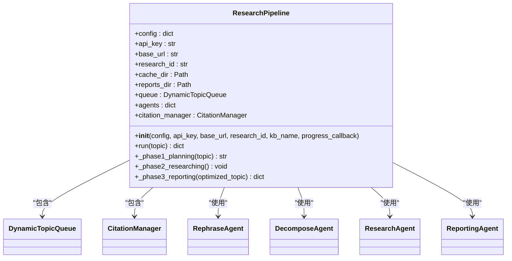
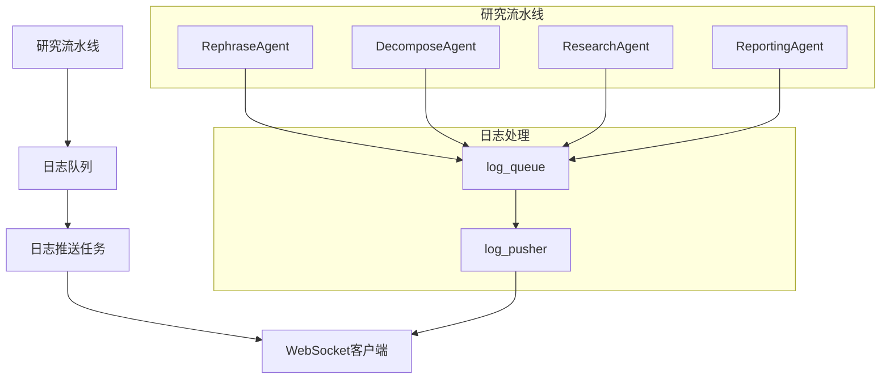
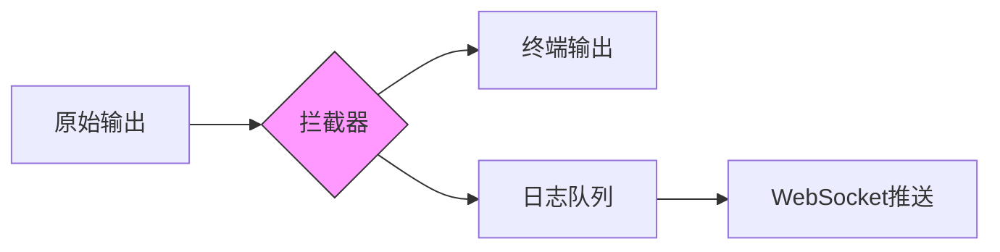
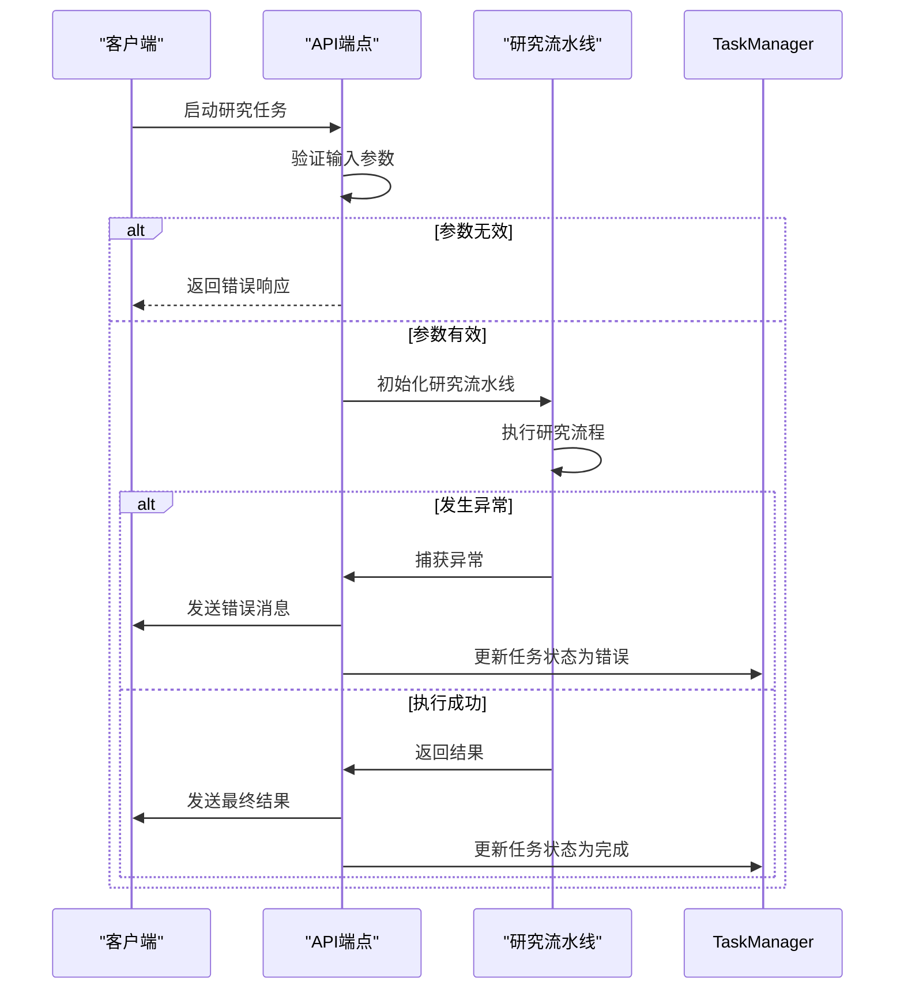
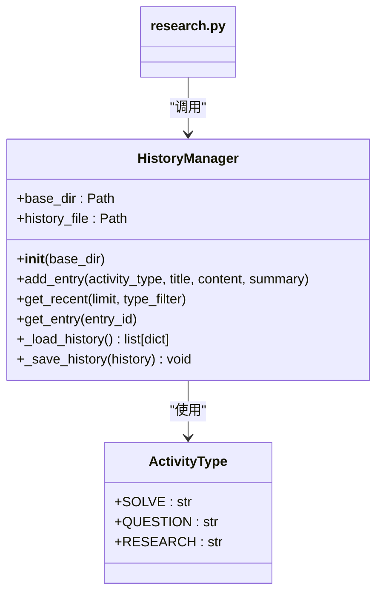

# 研究API

<cite>
**本文档引用的文件**   
- [research.py](file://src/api/routers/research.py)
- [task_id_manager.py](file://src/api/utils/task_id_manager.py)
- [log_interceptor.py](file://src/api/utils/log_interceptor.py)
- [progress_broadcaster.py](file://src/api/utils/progress_broadcaster.py)
- [research_pipeline.py](file://src/agents/research/research_pipeline.py)
- [data_structures.py](file://src/agents/research/data_structures.py)
- [history.py](file://src/api/utils/history.py)
- [logger.py](file://src/core/logging/logger.py)
</cite>

## 目录
1. [简介](#简介)
2. [RESTful端点](#restful端点)
3. [WebSocket端点](#websocket端点)
4. [研究管道初始化与配置](#研究管道初始化与配置)
5. [实时更新机制](#实时更新机制)
6. [输出目录管理](#输出目录管理)
7. [错误处理与资源清理](#错误处理与资源清理)
8. [历史记录集成](#历史记录集成)
9. [代码示例](#代码示例)

## 简介

DeepTutor研究API提供了一套完整的异步研究系统，支持通过RESTful和WebSocket接口启动和管理深度研究任务。该系统采用三阶段流水线架构：规划（Planning）、研究（Researching）和报告（Reporting），能够动态分解复杂主题并生成高质量的研究报告。

API的核心功能包括主题优化、任务ID管理、实时进度更新、日志流式传输和历史记录保存。系统通过配置合并逻辑支持灵活的参数定制，并通过WebSocket实现分阶段响应和实时交互。

**Section sources**
- [research.py](file://src/api/routers/research.py#L1-L407)

## RESTful端点

### `/api/v1/research/optimize_topic`

该端点用于优化研究主题，通过RephraseAgent对输入主题进行重述和优化。

**请求模型**

```json
{
  "topic": "研究主题",
  "iteration": 0,
  "previous_result": {},
  "kb_name": "ai_textbook"
}
```

**参数说明**

- `topic`: 要优化的研究主题（字符串，必需）
- `iteration`: 当前迭代次数（整数，默认0）
- `previous_result`: 上一次优化结果（对象，可选）
- `kb_name`: 知识库名称（字符串，默认"ai_textbook"）

**响应示例**

```json
{
  "topic": "优化后的研究主题",
  "reasoning": "优化理由"
}
```

当`iteration`为0时，系统将对原始主题进行首次优化；当`iteration`大于0时，输入的`topic`将被视为用户反馈，系统将基于反馈和`previous_result`进行进一步优化。

**Section sources**
- [research.py](file://src/api/routers/research.py#L38-L78)

## WebSocket端点

### `/api/v1/research/run`

该WebSocket端点用于启动和管理完整的研究任务，支持实时进度更新和分阶段响应。

**连接流程**

1. 客户端建立WebSocket连接
2. 发送包含研究配置的JSON消息
3. 服务器返回任务ID
4. 启动研究流水线
5. 实时推送日志、进度和最终结果

**配置参数**

```json
{
  "topic": "研究主题",
  "kb_name": "ai_textbook",
  "plan_mode": "medium",
  "enabled_tools": ["RAG"],
  "skip_rephrase": false
}
```

**参数说明**

- `topic`: 研究主题（字符串，必需）
- `kb_name`: 知识库名称（字符串，默认"ai_textbook"）
- `plan_mode`: 计划模式（字符串，可选值：quick, medium, deep, auto）
- `enabled_tools`: 启用的工具列表（数组，可选值：RAG, Paper, Web）
- `skip_rephrase`: 是否跳过主题重述步骤（布尔值，默认false）

**响应类型**

系统通过WebSocket推送多种类型的消息：

- `task_id`: 返回生成的任务ID
- `status`: 研究状态更新
- `log`: 日志消息
- `progress`: 进度更新
- `result`: 最终研究结果
- `error`: 错误信息

**Section sources**
- [research.py](file://src/api/routers/research.py#L81-L407)

## 研究管道初始化与配置

### 研究管道初始化

`ResearchPipeline`类是研究系统的核心，负责协调规划、研究和报告三个阶段。当通过WebSocket端点启动研究任务时，系统会初始化`ResearchPipeline`实例。



**Diagram sources**
- [research_pipeline.py](file://src/agents/research/research_pipeline.py#L65-L800)

### 配置合并逻辑

系统采用分层配置合并策略，确保配置的一致性和灵活性。配置来源包括：

1. `main.yaml`: 主配置文件，包含全局设置
2. 模块特定配置: 如`research_config.yaml`
3. API参数: 通过WebSocket传递的运行时参数
4. 预设配置: 通过`preset`参数指定的预设模式

配置合并优先级从低到高为：`main.yaml` < 模块配置 < 预设配置 < API参数。系统通过`load_config_with_main`函数实现配置合并，确保所有研究模块的配置都能正确继承自`main.yaml`。

**plan_mode配置**

`plan_mode`参数统一影响规划和研究阶段的配置：

| 模式 | 规划配置 | 研究配置 |
|------|---------|---------|
| quick | 初始子主题: 2<br>模式: manual | 最大迭代: 2<br>迭代模式: fixed |
| medium | 初始子主题: 5<br>模式: manual | 最大迭代: 4<br>迭代模式: fixed |
| deep | 初始子主题: 8<br>模式: manual | 最大迭代: 7<br>迭代模式: fixed |
| auto | 模式: auto<br>最大子主题: 8 | 最大迭代: 6<br>迭代模式: flexible |

**enabled_tools配置**

`enabled_tools`参数控制研究阶段可用的工具：

- `RAG`: 启用`rag_naive`、`rag_hybrid`和`query_item`工具
- `Paper`: 启用`paper_search`工具
- `Web`: 启用`web_search`工具
- `run_code`: 始终启用

**Section sources**
- [research.py](file://src/api/routers/research.py#L131-L244)
- [research_pipeline.py](file://src/agents/research/research_pipeline.py#L68-L800)

## 实时更新机制

### 日志队列

系统使用`asyncio.Queue`实现日志队列，将研究过程中的日志消息异步推送到前端。



**Diagram sources**
- [research.py](file://src/api/routers/research.py#L269-L301)

### 进度回调

系统通过`progress_callback`函数实现进度回调机制。每个研究阶段都会调用此回调函数，将进度事件放入`progress_queue`。

```python
def progress_callback(event: dict[str, Any]):
    """进度回调函数，将进度事件放入队列"""
    try:
        asyncio.get_event_loop().call_soon_threadsafe(progress_queue.put_nowait, event)
    except Exception as e:
        logger.error(f"进度回调错误: {e}")
```

进度事件包含类型、时间戳和具体数据，前端可以根据事件类型更新UI状态。

### stdout拦截

系统通过自定义的`ResearchStdoutInterceptor`类拦截`stdout`，实现终端输出和前端显示的同步。



**Diagram sources**
- [research.py](file://src/api/routers/research.py#L319-L340)

**Section sources**
- [research.py](file://src/api/routers/research.py#L269-L340)

## 输出目录管理

系统采用统一的输出目录结构，确保研究结果的组织和管理一致性。

**目录结构**

```
data/
└── user/
    └── research/
        ├── cache/
        │   └── {research_id}/        # 缓存目录
        │       ├── planning_progress.json
        │       ├── reporting_progress.json
        │       ├── queue_progress.json
        │       ├── step1_planning.json
        │       └── queue.json
        └── reports/                  # 报告目录
            ├── {research_id}.md
            └── {research_id}_metadata.json
```

**目录配置**

系统通过以下代码定义输出目录：

```python
# 定义统一输出目录
root_dir = Path(__file__).parent.parent.parent.parent
output_base = root_dir / "data" / "user" / "research"

# 更新配置
config["system"]["output_base_dir"] = str(output_base / "cache")
config["system"]["reports_dir"] = str(output_base / "reports")
```

所有研究任务的缓存文件和最终报告都存储在相应的子目录中，目录名使用`research_id`确保唯一性。

**Section sources**
- [research.py](file://src/api/routers/research.py#L245-L256)

## 错误处理与资源清理

### 错误处理

系统采用多层次的错误处理机制，确保研究任务的稳定性和可靠性。



**Diagram sources**
- [research.py](file://src/api/routers/research.py#L386-L402)

### 资源清理

系统在任务完成或发生错误时自动清理相关资源：

1. 取消日志推送和进度推送任务
2. 恢复原始的`stdout`引用
3. 更新任务管理器中的任务状态

```python
finally:
    if pusher_task:
        pusher_task.cancel()
    if progress_pusher_task:
        progress_pusher_task.cancel()
    sys.stdout = original_stdout  # 安全恢复原始引用
```

**Section sources**
- [research.py](file://src/api/routers/research.py#L402-L407)

## 历史记录集成

系统通过`HistoryManager`类实现历史记录功能，自动保存完成的研究任务。



**Diagram sources**
- [history.py](file://src/api/utils/history.py#L13-L172)

当研究任务完成后，系统会自动调用`history_manager.add_entry()`方法保存研究结果：

```python
history_manager.add_entry(
    activity_type=ActivityType.RESEARCH,
    title=topic,
    content={
        "topic": topic,
        "report": report_content,
        "kb_name": kb_name
    },
    summary=f"研究ID: {result['research_id']}"
)
```

历史记录存储在`data/user/user_history.json`文件中，采用JSON格式，包含时间戳、类型、标题、摘要和完整内容。

**Section sources**
- [research.py](file://src/api/routers/research.py#L353-L359)
- [history.py](file://src/api/utils/history.py#L1-L172)

## 代码示例

### 启动研究任务

```javascript
// 连接到WebSocket
const socket = new WebSocket('ws://localhost:8000/api/v1/research/run');

// 发送研究配置
socket.onopen = function(event) {
    socket.send(JSON.stringify({
        topic: "人工智能在教育中的应用",
        plan_mode: "medium",
        enabled_tools: ["RAG", "Web"]
    }));
};

// 处理响应
socket.onmessage = function(event) {
    const data = JSON.parse(event.data);
    
    switch(data.type) {
        case 'task_id':
            console.log('任务ID:', data.task_id);
            break;
        case 'status':
            console.log('状态:', data.content);
            break;
        case 'log':
            console.log('日志:', data.content);
            break;
        case 'progress':
            console.log('进度:', data);
            break;
        case 'result':
            console.log('研究报告:', data.report);
            console.log('元数据:', data.metadata);
            break;
        case 'error':
            console.error('错误:', data.content);
            break;
    }
};
```

### 处理分阶段响应

```javascript
// 前端状态管理
const researchState = {
    global: {
        stage: 'idle',
        startTime: null,
        totalBlocks: 0,
        completedBlocks: 0
    },
    planning: {
        originalTopic: '',
        optimizedTopic: '',
        subTopics: []
    },
    tasks: {},
    reporting: {
        outline: null,
        generatedReport: ''
    },
    logs: []
};

// 更新状态的函数
function updateState(event) {
    switch(event.type) {
        case 'planning_started':
            researchState.global.stage = 'planning';
            researchState.global.startTime = Date.now();
            break;
        case 'rephrase_completed':
            researchState.planning.optimizedTopic = event.optimized_topic;
            break;
        case 'decompose_completed':
            researchState.planning.subTopics = event.generated_subtopics;
            break;
        case 'planning_completed':
            researchState.global.totalBlocks = event.total_blocks;
            break;
        case 'researching_started':
            researchState.global.stage = 'researching';
            break;
        case 'block_completed':
            researchState.global.completedBlocks = event.current_block;
            break;
        case 'reporting_completed':
            researchState.global.stage = 'completed';
            break;
        case 'log':
            researchState.logs.push({
                id: Date.now(),
                timestamp: Date.now(),
                type: 'info',
                message: event.content
            });
            break;
    }
}
```

**Section sources**
- [research.py](file://src/api/routers/research.py#L81-L407)
- [research.ts](file://web/types/research.ts#L1-L162)