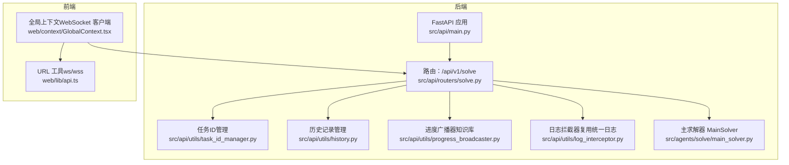
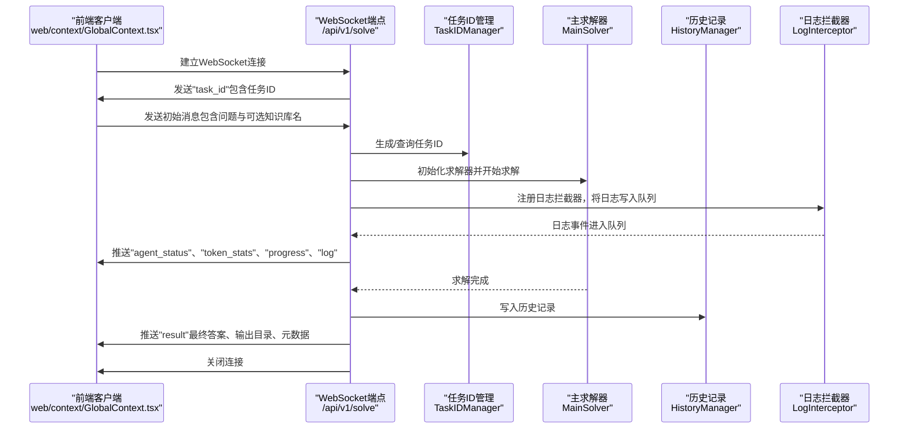
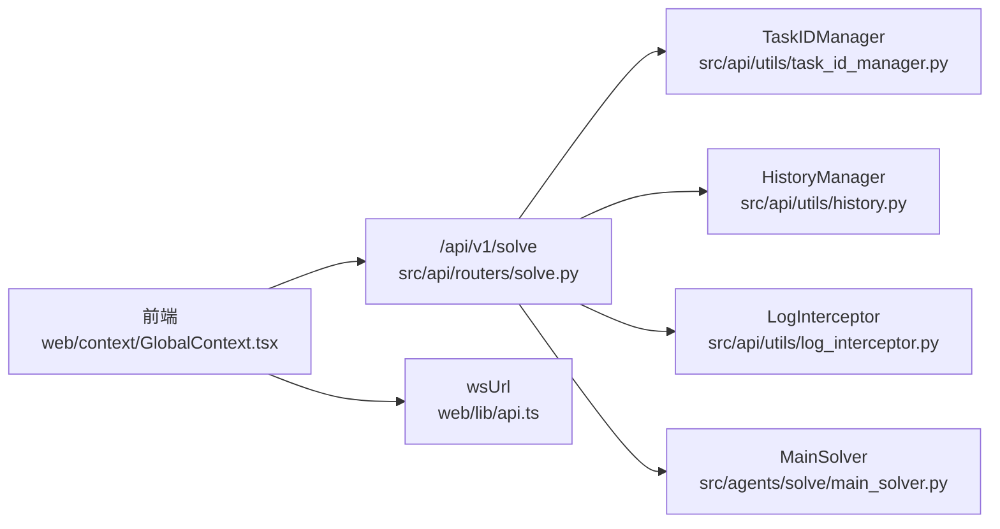

# 解题API

<cite>
**本文引用的文件**
- [src/api/routers/solve.py](file://src/api/routers/solve.py)
- [src/api/utils/task_id_manager.py](file://src/api/utils/task_id_manager.py)
- [src/api/utils/history.py](file://src/api/utils/history.py)
- [src/api/utils/progress_broadcaster.py](file://src/api/utils/progress_broadcaster.py)
- [src/api/utils/log_interceptor.py](file://src/api/utils/log_interceptor.py)
- [src/agents/solve/main_solver.py](file://src/agents/solve/main_solver.py)
- [src/api/main.py](file://src/api/main.py)
- [web/context/GlobalContext.tsx](file://web/context/GlobalContext.tsx)
- [web/lib/api.ts](file://web/lib/api.ts)
- [config/main.yaml](file://config/main.yaml)
</cite>

## 目录
1. [简介](#简介)
2. [项目结构](#项目结构)
3. [核心组件](#核心组件)
4. [架构总览](#架构总览)
5. [详细组件分析](#详细组件分析)
6. [依赖关系分析](#依赖关系分析)
7. [性能与优化](#性能与优化)
8. [故障排查指南](#故障排查指南)
9. [结论](#结论)
10. [附录](#附录)

## 简介
本文件面向DeepTutor的“解题API”，聚焦WebSocket端点/api/v1/solve，系统性说明：
- 连接建立流程与握手
- 请求/响应消息格式与实时交互模式
- 任务ID生成机制、日志流推送、状态更新与进度报告
- 错误处理策略、连接关闭机制与历史记录保存
- 前端WebSocket客户端示例路径（不直接展示代码）
- 性能优化建议（连接超时、消息队列管理等）

该API为实时解题提供流式日志、代理状态、Token统计、阶段进度与最终结果推送，支持多阶段可视化与产物访问。

## 项目结构
后端通过FastAPI挂载路由，WebSocket在solve路由器中实现；前端通过全局上下文建立WebSocket并消费流式事件。

图表来源
- [src/api/main.py](file://src/api/main.py#L69-L81)
- [src/api/routers/solve.py](file://src/api/routers/solve.py#L34-L294)
- [src/api/utils/task_id_manager.py](file://src/api/utils/task_id_manager.py#L1-L103)
- [src/api/utils/history.py](file://src/api/utils/history.py#L1-L172)
- [src/api/utils/progress_broadcaster.py](file://src/api/utils/progress_broadcaster.py#L1-L73)
- [src/api/utils/log_interceptor.py](file://src/api/utils/log_interceptor.py#L1-L31)
- [src/agents/solve/main_solver.py](file://src/agents/solve/main_solver.py#L1-L779)
- [web/context/GlobalContext.tsx](file://web/context/GlobalContext.tsx#L358-L447)
- [web/lib/api.ts](file://web/lib/api.ts#L38-L58)

章节来源
- [src/api/main.py](file://src/api/main.py#L69-L81)
- [src/api/routers/solve.py](file://src/api/routers/solve.py#L34-L294)

## 核心组件
- WebSocket端点：/api/v1/solve，接收初始请求，返回任务ID，并以流式消息推送日志、状态、进度与最终结果。
- 任务ID管理：基于任务键生成唯一任务ID，支持状态更新与清理。
- 历史记录：解题完成后写入用户历史，便于回溯。
- 日志与进度：通过日志拦截器与显示管理器，将阶段、代理状态、Token统计与进度推送到前端。
- 主求解器：执行双循环（分析+求解）管线，产出最终答案与中间产物。

章节来源
- [src/api/routers/solve.py](file://src/api/routers/solve.py#L34-L294)
- [src/api/utils/task_id_manager.py](file://src/api/utils/task_id_manager.py#L1-L103)
- [src/api/utils/history.py](file://src/api/utils/history.py#L1-L172)
- [src/agents/solve/main_solver.py](file://src/agents/solve/main_solver.py#L225-L743)

## 架构总览
WebSocket解题流程概览如下：

图表来源
- [src/api/routers/solve.py](file://src/api/routers/solve.py#L34-L294)
- [src/api/utils/task_id_manager.py](file://src/api/utils/task_id_manager.py#L28-L59)
- [src/api/utils/history.py](file://src/api/utils/history.py#L127-L155)
- [src/api/utils/log_interceptor.py](file://src/api/utils/log_interceptor.py#L17-L31)
- [src/agents/solve/main_solver.py](file://src/agents/solve/main_solver.py#L225-L743)
- [web/context/GlobalContext.tsx](file://web/context/GlobalContext.tsx#L358-L447)

## 详细组件分析

### WebSocket端点 /api/v1/solve
- 连接建立：接受WebSocket连接，等待客户端发送初始消息。
- 初始消息字段：
  - question：必填，问题文本
  - kb_name：可选，默认"ai_textbook"
- 任务ID生成：
  - 使用任务键拼接"解决类型+知识库名+问题哈希"，生成稳定且唯一的任务ID
  - 通过单例TaskIDManager进行生成与状态维护
- 日志流推送：
  - 使用异步队列承载日志条目，后台任务周期性从队列取值并发送
  - 超时轮询避免阻塞，异常时优雅停止
- 状态与进度：
  - 代理状态：当显示管理器存在时，包装set_agent_status与update_token_stats回调，向前端推送agent_status与token_stats
  - 阶段进度：通过主求解器内部回调注入，推送progress消息
- 最终结果：
  - 处理Markdown中的图片路径，修正为静态资源访问URL
  - 推送result消息（最终答案、输出目录、元数据）
  - 写入历史记录
- 错误处理与关闭：
  - 捕获异常，标记连接关闭事件，发送error消息
  - 取消后台推送任务，关闭WebSocket连接

章节来源
- [src/api/routers/solve.py](file://src/api/routers/solve.py#L34-L294)

#### 消息格式与实时交互
- 任务ID
  - 类型："task_id"
  - 字段：task_id
- 状态
  - 类型："status"
  - 字段：content（例如"started"）
- 代理状态
  - 类型："agent_status"
  - 字段：agent（代理名或"all"）、status、all_agents（所有代理状态映射）
- Token统计
  - 类型："token_stats"
  - 字段：stats（模型、调用次数、Token数、费用等）
- 阶段进度
  - 类型："progress"
  - 字段：stage（investigate/solve/response）、progress（轮次、步骤、目标等）
- 日志
  - 类型："log"
  - 字段：content（日志内容）
- 结果
  - 类型："result"
  - 字段：final_answer、output_dir、metadata
- 错误
  - 类型："error"
  - 字段：content（错误信息）

章节来源
- [src/api/routers/solve.py](file://src/api/routers/solve.py#L125-L240)
- [web/context/GlobalContext.tsx](file://web/context/GlobalContext.tsx#L358-L447)

#### 任务ID生成机制
- 任务键：solve_{kb_name}_{hash(str(question))}
- 生成规则：
  - 若已存在相同任务键，复用已有任务ID
  - 否则生成形如solve_YYYYMMDD_HHMMSS_{uuid}的任务ID
  - 记录任务类型、键、创建时间、状态等元数据
- 状态更新与清理：
  - 支持更新状态（running/completed/error/cancelled），记录结束时间
  - 提供按小时清理过期任务的接口

章节来源
- [src/api/utils/task_id_manager.py](file://src/api/utils/task_id_manager.py#L28-L103)

#### 日志流推送、状态更新与进度报告
- 日志拦截：
  - 通过日志拦截器将日志写入队列，由后台推送任务定时拉取并发送
- 代理状态与Token统计：
  - 包装显示管理器回调，推送agent_status与token_stats
- 阶段进度：
  - 主求解器在关键阶段触发回调，推送progress消息

章节来源
- [src/api/routers/solve.py](file://src/api/routers/solve.py#L74-L124)
- [src/agents/solve/main_solver.py](file://src/agents/solve/main_solver.py#L348-L580)

#### 历史记录保存
- 解题完成后，将活动类型、标题、内容与摘要写入用户历史文件
- 历史文件采用固定目录，确保跨工作目录一致性

章节来源
- [src/api/utils/history.py](file://src/api/utils/history.py#L127-L155)
- [src/api/routers/solve.py](file://src/api/routers/solve.py#L241-L256)

#### 连接关闭机制
- 后台推送任务使用事件标志检测连接是否关闭
- 异常捕获后设置关闭事件，取消推送任务并关闭WebSocket
- 前端收到result后主动关闭连接

章节来源
- [src/api/routers/solve.py](file://src/api/routers/solve.py#L125-L168)
- [web/context/GlobalContext.tsx](file://web/context/GlobalContext.tsx#L384-L407)

### 前端WebSocket客户端示例
- WebSocket URL构造：根据API基础地址自动转换为ws/wss协议
- 消息处理：根据type分发到日志、代理状态、Token统计、进度与结果
- 连接关闭：收到result后关闭连接

章节来源
- [web/lib/api.ts](file://web/lib/api.ts#L38-L58)
- [web/context/GlobalContext.tsx](file://web/context/GlobalContext.tsx#L358-L447)

## 依赖关系分析
- WebSocket端点依赖：
  - 任务ID管理：生成/查询任务ID与状态
  - 历史记录：解题完成后写入
  - 日志拦截器：统一日志输出至队列
  - 显示管理器：代理状态与Token统计推送
  - 主求解器：执行双循环管线并产出结果
- 前端依赖：
  - API工具：构造ws/wss URL
  - 全局上下文：维护WebSocket连接与状态

图表来源
- [src/api/routers/solve.py](file://src/api/routers/solve.py#L34-L294)
- [src/api/utils/task_id_manager.py](file://src/api/utils/task_id_manager.py#L1-L103)
- [src/api/utils/history.py](file://src/api/utils/history.py#L1-L172)
- [src/api/utils/log_interceptor.py](file://src/api/utils/log_interceptor.py#L17-L31)
- [src/agents/solve/main_solver.py](file://src/agents/solve/main_solver.py#L1-L779)
- [web/context/GlobalContext.tsx](file://web/context/GlobalContext.tsx#L358-L447)
- [web/lib/api.ts](file://web/lib/api.ts#L38-L58)

## 性能与优化
- 连接超时与队列管理
  - 后台推送任务使用超时轮询，避免长时间阻塞；异常时及时退出
  - 使用异步队列承载日志，降低主线程压力
- 日志与进度推送
  - 仅在显示管理器存在时包装回调，减少无用开销
  - 进度推送在关键阶段触发，避免高频消息
- 输出目录与静态资源
  - 后端将输出目录挂载为静态资源，前端通过/api/outputs访问产物
- 配置与端口
  - 后端端口与路径在配置文件中集中管理，便于部署与调试

章节来源
- [src/api/routers/solve.py](file://src/api/routers/solve.py#L125-L168)
- [src/api/main.py](file://src/api/main.py#L50-L68)
- [config/main.yaml](file://config/main.yaml#L1-L20)

## 故障排查指南
- 前端无法连接后端
  - 检查后端服务是否运行、端口是否正确
  - 确认CORS允许前端源
  - 确认API基础地址与WebSocket协议匹配
- WebSocket连接异常
  - 查看后端日志，确认连接建立与消息发送
  - 检查异常分支是否触发（任务ID生成、求解器异常、连接关闭）
- 日志未到达前端
  - 确认日志拦截器是否注册
  - 检查后台推送任务是否被取消或异常
- 结果未显示或资源不可访问
  - 确认输出目录挂载与URL路径一致
  - 检查最终答案中的图片链接是否被替换为/api/outputs前缀

章节来源
- [src/api/routers/solve.py](file://src/api/routers/solve.py#L125-L294)
- [src/api/main.py](file://src/api/main.py#L50-L68)
- [web/context/GlobalContext.tsx](file://web/context/GlobalContext.tsx#L358-L447)

## 结论
/api/v1/solve提供了一条完整的实时解题通道：从连接建立、任务ID生成、日志与状态推送，到最终结果与历史记录保存。通过异步队列与回调包装，系统实现了低耦合、高扩展的消息推送机制；配合前端对不同类型消息的处理，能够为用户提供清晰的解题过程可视化与产物访问能力。

## 附录

### 端点与消息规范速查
- 端点：/api/v1/solve
- 初始请求（客户端发送）：
  - question：必填
  - kb_name：可选
- 服务器推送（客户端接收）：
  - task_id：任务ID
  - status：启动状态
  - agent_status：代理状态
  - token_stats：Token统计
  - progress：阶段进度
  - log：日志
  - result：最终答案与元数据
  - error：错误信息

章节来源
- [src/api/routers/solve.py](file://src/api/routers/solve.py#L34-L294)
- [web/context/GlobalContext.tsx](file://web/context/GlobalContext.tsx#L358-L447)