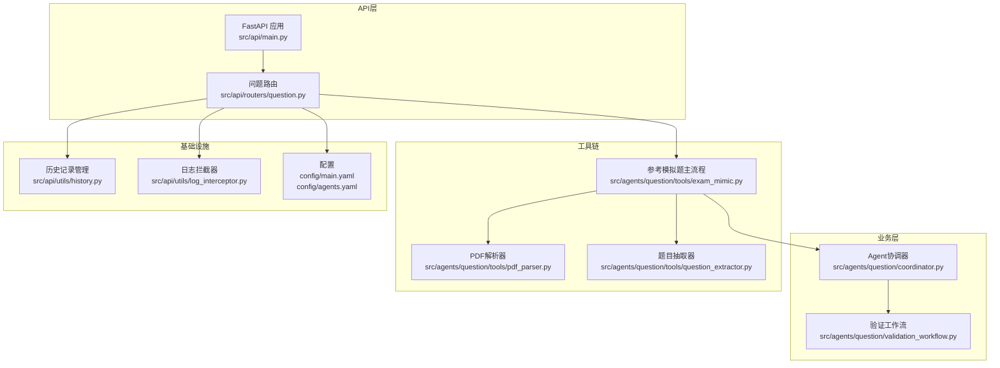
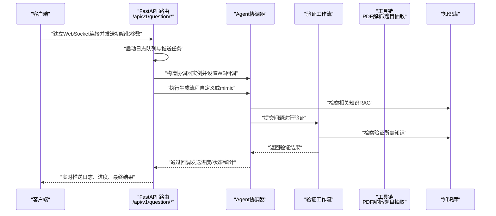
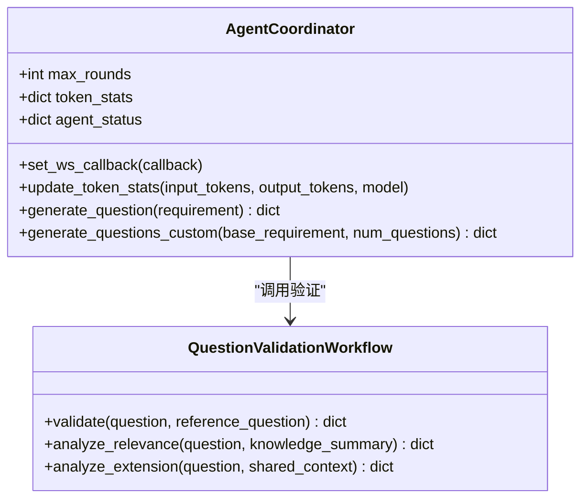
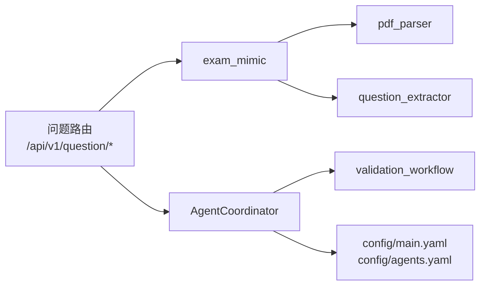

# 问题生成API

<cite>
**本文引用的文件列表**
- [src/api/routers/question.py](file://src/api/routers/question.py)
- [src/agents/question/coordinator.py](file://src/agents/question/coordinator.py)
- [src/agents/question/tools/exam_mimic.py](file://src/agents/question/tools/exam_mimic.py)
- [src/agents/question/tools/pdf_parser.py](file://src/agents/question/tools/pdf_parser.py)
- [src/agents/question/tools/question_extractor.py](file://src/agents/question/tools/question_extractor.py)
- [src/api/utils/log_interceptor.py](file://src/api/utils/log_interceptor.py)
- [src/api/utils/history.py](file://src/api/utils/history.py)
- [src/agents/question/validation_workflow.py](file://src/agents/question/validation_workflow.py)
- [src/api/main.py](file://src/api/main.py)
- [config/main.yaml](file://config/main.yaml)
- [config/agents.yaml](file://config/agents.yaml)
</cite>

## 目录
1. [简介](#简介)
2. [项目结构](#项目结构)
3. [核心组件](#核心组件)
4. [架构总览](#架构总览)
5. [详细组件分析](#详细组件分析)
6. [依赖关系分析](#依赖关系分析)
7. [性能与并发特性](#性能与并发特性)
8. [故障排查指南](#故障排查指南)
9. [结论](#结论)
10. [附录：消息格式与示例](#附录消息格式与示例)

## 简介
本文件面向前端与集成开发者，系统性说明DeepTutor问题生成API的两个WebSocket端点：
- /api/v1/question/mimic：参考模拟题（mimic）生成，支持“直接上传PDF”和“使用已解析目录”两种模式
- /api/v1/question/generate：自定义需求生成，基于Agent协调器实现多轮迭代与验证

文档覆盖以下关键主题：
- PDF上传模式与预解析模式的差异、base64编码要求与目录结构
- 消息格式、进度回调机制与状态更新
- 协调器（AgentCoordinator）与WebSocket的集成方式
- 日志拦截与token统计功能
- 实际示例：如何通过WebSocket发送请求并处理分步结果
- 错误处理、连接管理与历史记录保存

## 项目结构
问题生成API位于后端FastAPI应用中，路由注册在统一入口处，核心逻辑由Agent协调器与工具链协作完成。

图表来源
- [src/api/main.py](file://src/api/main.py#L69-L81)
- [src/api/routers/question.py](file://src/api/routers/question.py#L33-L465)
- [src/agents/question/coordinator.py](file://src/agents/question/coordinator.py#L1-L220)
- [src/agents/question/validation_workflow.py](file://src/agents/question/validation_workflow.py#L1-L140)
- [src/agents/question/tools/exam_mimic.py](file://src/agents/question/tools/exam_mimic.py#L71-L120)
- [src/agents/question/tools/pdf_parser.py](file://src/agents/question/tools/pdf_parser.py#L37-L120)
- [src/agents/question/tools/question_extractor.py](file://src/agents/question/tools/question_extractor.py#L229-L287)
- [src/api/utils/history.py](file://src/api/utils/history.py#L1-L172)
- [src/api/utils/log_interceptor.py](file://src/api/utils/log_interceptor.py#L1-L31)
- [config/main.yaml](file://config/main.yaml#L1-L60)
- [config/agents.yaml](file://config/agents.yaml#L22-L30)

章节来源
- [src/api/main.py](file://src/api/main.py#L69-L81)
- [src/api/routers/question.py](file://src/api/routers/question.py#L33-L465)

## 核心组件
- WebSocket端点
  - /api/v1/question/mimic：参考模拟题生成，支持两种模式
  - /api/v1/question/generate：自定义需求生成
- Agent协调器（AgentCoordinator）
  - 负责生成与验证的编排、状态跟踪、日志与token统计
- 工具链
  - 参考模拟题主流程（exam_mimic）：PDF解析、题目抽取、并行生成
  - PDF解析器（pdf_parser）：MinerU封装
  - 题目抽取器（question_extractor）：基于LLM抽取题目信息
- 历史记录与日志
  - 历史记录管理（history）：持久化用户活动
  - 日志拦截器（log_interceptor）：捕获并转发日志到WebSocket

章节来源
- [src/api/routers/question.py](file://src/api/routers/question.py#L33-L465)
- [src/agents/question/coordinator.py](file://src/agents/question/coordinator.py#L1-L220)
- [src/agents/question/tools/exam_mimic.py](file://src/agents/question/tools/exam_mimic.py#L71-L120)
- [src/agents/question/tools/pdf_parser.py](file://src/agents/question/tools/pdf_parser.py#L37-L120)
- [src/agents/question/tools/question_extractor.py](file://src/agents/question/tools/question_extractor.py#L229-L287)
- [src/api/utils/history.py](file://src/api/utils/history.py#L1-L172)
- [src/api/utils/log_interceptor.py](file://src/api/utils/log_interceptor.py#L1-L31)

## 架构总览
下图展示了从客户端到服务端、再到工具链与知识库的完整调用链路。

图表来源
- [src/api/routers/question.py](file://src/api/routers/question.py#L260-L465)
- [src/agents/question/coordinator.py](file://src/agents/question/coordinator.py#L1-L220)
- [src/agents/question/validation_workflow.py](file://src/agents/question/validation_workflow.py#L91-L138)
- [src/agents/question/tools/exam_mimic.py](file://src/agents/question/tools/exam_mimic.py#L71-L120)

## 详细组件分析

### WebSocket端点：/api/v1/question/mimic（参考模拟题）
- 支持两种模式
  - 上传PDF：客户端以base64编码发送PDF内容，服务端解码并保存到会话目录，随后解析并抽取题目
  - 预解析目录：客户端提供已解析的目录名，服务端在多个候选路径中定位该目录并使用其内容
- 关键行为
  - 初始化日志队列并通过后台任务持续推送日志到前端
  - 接收初始化参数（模式、知识库名、最大题数等），根据模式分支处理
  - 使用工具链完成PDF解析、题目抽取、并行生成与汇总
  - 通过回调向前端发送阶段进度、单题结果、汇总统计与完成信号
- 目录结构与输出
  - 上传模式：在data/user/question/mimic_papers下按时间戳创建会话子目录，保存PDF与中间产物
  - 预解析模式：在data/user/question/mimic_papers或旧位置（legacy）查找目录，要求包含auto子目录
- 进度与状态
  - 阶段类型：init、upload、parsing、processing、complete
  - 事件类型：log、status、progress、question_update、result、summary、error、token_stats、batch_summary

章节来源
- [src/api/routers/question.py](file://src/api/routers/question.py#L33-L258)
- [src/agents/question/tools/exam_mimic.py](file://src/agents/question/tools/exam_mimic.py#L119-L180)
- [src/agents/question/tools/pdf_parser.py](file://src/agents/question/tools/pdf_parser.py#L37-L120)
- [src/agents/question/tools/question_extractor.py](file://src/agents/question/tools/question_extractor.py#L229-L287)

### WebSocket端点：/api/v1/question/generate（自定义需求）
- 客户端发送需求参数（requirement、kb_name、count）
- 服务端
  - 生成任务ID并回传给前端
  - 构造Agent协调器，设置WebSocket回调与日志拦截器
  - 执行自定义生成流程，协调器内部进行检索、生成、验证与扩展分析
  - 将批次结果写入历史记录；推送token统计与批次摘要
  - 发送complete信号并关闭连接
- 事件与状态
  - 初始：task_id
  - 运行中：agent_status、progress、log、token_stats、batch_summary
  - 结束：complete

章节来源
- [src/api/routers/question.py](file://src/api/routers/question.py#L260-L465)
- [src/agents/question/coordinator.py](file://src/agents/question/coordinator.py#L1-L220)
- [src/api/utils/history.py](file://src/api/utils/history.py#L127-L155)

### Agent协调器（AgentCoordinator）
- 职责
  - 组织生成与验证流程，维护代理状态，追踪token使用并统计成本
  - 通过回调向WebSocket推送实时状态与统计
  - 提供检索、查询生成、子需求拆分、结果保存等能力
- 关键接口
  - set_ws_callback：设置WebSocket回调
  - update_token_stats：更新token统计并广播
  - generate_question：单题生成主流程
  - generate_questions_custom：自定义批量生成（新流程）
- 并发与配置
  - 通过配置控制最大并行数与检索数量
  - 内部使用消息队列传递生成代理的消息

图表来源
- [src/agents/question/coordinator.py](file://src/agents/question/coordinator.py#L1-L220)
- [src/agents/question/validation_workflow.py](file://src/agents/question/validation_workflow.py#L91-L138)

章节来源
- [src/agents/question/coordinator.py](file://src/agents/question/coordinator.py#L1-L220)
- [src/agents/question/validation_workflow.py](file://src/agents/question/validation_workflow.py#L91-L138)
- [config/main.yaml](file://config/main.yaml#L43-L54)
- [config/agents.yaml](file://config/agents.yaml#L22-L30)

### 工具链：参考模拟题主流程（exam_mimic）
- 流程
  - 解析PDF（MinerU）或定位已解析目录
  - 抽取题目（LLM+解析器）
  - 并行生成新题（每个参考题独立协调器）
  - 汇总结果并保存为JSON
- 关键点
  - 并发控制：通过信号量限制同时生成的题数
  - 进度回调：逐题开始、成功/失败、汇总
  - 输出：每题结果与汇总文件

章节来源
- [src/agents/question/tools/exam_mimic.py](file://src/agents/question/tools/exam_mimic.py#L71-L120)
- [src/agents/question/tools/pdf_parser.py](file://src/agents/question/tools/pdf_parser.py#L37-L120)
- [src/agents/question/tools/question_extractor.py](file://src/agents/question/tools/question_extractor.py#L229-L287)

### 日志拦截与token统计
- 日志拦截
  - 通过LogInterceptor将协调器的日志注入WebSocket队列，再由后台推送任务发送到前端
  - stdout拦截：将print输出清洗ANSI颜色后推送到前端
- token统计
  - 协调器与验证工作流在每次LLM调用后更新token统计，并通过回调广播
  - 成本估算：基于输入/输出token单价

章节来源
- [src/api/routers/question.py](file://src/api/routers/question.py#L87-L118)
- [src/api/utils/log_interceptor.py](file://src/api/utils/log_interceptor.py#L1-L31)
- [src/agents/question/coordinator.py](file://src/agents/question/coordinator.py#L190-L216)
- [src/agents/question/validation_workflow.py](file://src/agents/question/validation_workflow.py#L182-L209)

### 历史记录保存
- 生成完成后，将本次批次结果写入历史记录（标题、摘要、内容）
- 历史文件采用固定结构，支持版本化与迁移

章节来源
- [src/api/routers/question.py](file://src/api/routers/question.py#L366-L378)
- [src/api/utils/history.py](file://src/api/utils/history.py#L1-L172)

## 依赖关系分析
- 路由依赖
  - question路由挂载于/api/v1/question前缀，包含mimic与generate两个端点
- 协调器依赖
  - 读取统一配置（main.yaml、agents.yaml）决定最大轮次、并行数、检索参数等
  - 依赖RAG工具进行检索
- 工具链依赖
  - MinerU命令行工具（magic-pdf或mineru）用于PDF解析
  - LLM客户端用于抽取题目与验证

图表来源
- [src/api/routers/question.py](file://src/api/routers/question.py#L33-L465)
- [src/agents/question/tools/exam_mimic.py](file://src/agents/question/tools/exam_mimic.py#L71-L120)
- [src/agents/question/tools/pdf_parser.py](file://src/agents/question/tools/pdf_parser.py#L37-L120)
- [src/agents/question/tools/question_extractor.py](file://src/agents/question/tools/question_extractor.py#L229-L287)
- [src/agents/question/coordinator.py](file://src/agents/question/coordinator.py#L1-L120)
- [src/agents/question/validation_workflow.py](file://src/agents/question/validation_workflow.py#L1-L60)
- [config/main.yaml](file://config/main.yaml#L43-L54)
- [config/agents.yaml](file://config/agents.yaml#L22-L30)

章节来源
- [src/api/main.py](file://src/api/main.py#L69-L81)
- [config/main.yaml](file://config/main.yaml#L43-L54)
- [config/agents.yaml](file://config/agents.yaml#L22-L30)

## 性能与并发特性
- 并发控制
  - 参考模拟题：通过信号量限制同时生成的题数，默认来自配置
  - 自定义生成：协调器内部可并行检索与生成（受配置约束）
- 日志与推送
  - 使用异步队列与后台任务推送日志，避免阻塞主流程
- token统计
  - 每次LLM调用后增量更新，便于成本控制与监控

章节来源
- [src/agents/question/tools/exam_mimic.py](file://src/agents/question/tools/exam_mimic.py#L338-L346)
- [src/agents/question/coordinator.py](file://src/agents/question/coordinator.py#L1-L120)
- [config/main.yaml](file://config/main.yaml#L43-L54)

## 故障排查指南
- 常见错误类型
  - 参数缺失：缺少模式、知识库名、最大题数、requirement等
  - 资源不存在：PDF路径无效、预解析目录不存在或缺少auto子目录
  - 外部工具异常：MinerU未安装或解析失败
  - LLM调用异常：提示格式不正确或解析失败
- 客户端应答
  - 服务端会在运行期间发送error事件；连接断开时需重连并重新发送初始化参数
  - 建议在前端监听complete或error后清理资源并关闭连接
- 日志与诊断
  - 启用日志拦截后，前端可实时看到服务端日志
  - token_stats可用于监控成本与调用次数

章节来源
- [src/api/routers/question.py](file://src/api/routers/question.py#L127-L186)
- [src/agents/question/tools/exam_mimic.py](file://src/agents/question/tools/exam_mimic.py#L106-L116)
- [src/agents/question/tools/pdf_parser.py](file://src/agents/question/tools/pdf_parser.py#L14-L35)

## 结论
问题生成API通过两个WebSocket端点分别满足“参考模拟题”和“自定义需求”的生成场景。其核心在于：
- 明确的模式与消息协议
- 可靠的进度与状态推送
- 与Agent协调器、验证工作流及工具链的紧密集成
- 完备的日志拦截与token统计
- 历史记录的持久化

建议在生产环境中：
- 严格校验客户端输入参数
- 对长耗时任务设置超时与重试策略
- 在前端实现断线重连与进度恢复
- 使用token_stats进行成本预算与告警

## 附录：消息格式与示例

### 端点与URL
- 参考模拟题：/api/v1/question/mimic
- 自定义生成：/api/v1/question/generate

章节来源
- [src/api/main.py](file://src/api/main.py#L69-L81)
- [src/api/routers/question.py](file://src/api/routers/question.py#L33-L465)

### 模式与参数
- 参考模拟题（/api/v1/question/mimic）
  - 模式：upload 或 parsed
  - upload模式参数
    - mode: "upload"
    - pdf_data: "base64编码的PDF字节串"
    - pdf_name: "exam.pdf"
    - kb_name: "知识库名称"
    - max_questions: "可选，限制处理的参考题数量"
  - parsed模式参数
    - mode: "parsed"
    - paper_path: "已解析目录名或绝对路径"
    - kb_name: "知识库名称"
    - max_questions: "可选，限制处理的参考题数量"
- 自定义生成（/api/v1/question/generate）
  - requirement: "自然语言需求对象（包含知识点、难度、题型等）"
  - kb_name: "知识库名称"
  - count: "生成数量（默认1）"

章节来源
- [src/api/routers/question.py](file://src/api/routers/question.py#L33-L118)
- [src/api/routers/question.py](file://src/api/routers/question.py#L260-L293)

### 消息类型与字段
- 初始化与状态
  - type: "status"
  - stage: "init/upload/parsing/processing/complete"
  - content: "文本描述"
- 日志
  - type: "log"
  - content: "日志文本"
  - timestamp: "浮点时间戳"
- 进度
  - type: "progress"
  - stage: "generating/validating"
  - progress: "包含round/max_rounds等"
- 单题更新（mimic）
  - type: "question_update"
  - index/current/total: "序号/当前/总数"
  - status: "generating/failed"
  - reference_number/reference_preview: "参考题编号与预览"
- 结果（mimic）
  - type: "result"
  - index/current/total: "序号/当前/总数"
  - success: "布尔"
  - question/validation/rounds: "生成结果与验证信息"
  - reference_question: "参考题原文"
- 摘要（mimic）
  - type: "summary"
  - total_reference/successful/failed/output_file: "统计与输出文件路径"
- 任务ID（自定义）
  - type: "task_id"
  - task_id: "任务唯一标识"
- 代理状态（自定义）
  - type: "agent_status"
  - all_agents: "各代理状态映射"
- 批次摘要（自定义）
  - type: "batch_summary"
  - requested/completed/failed: "请求数/完成数/失败数"
  - plan: "生成计划"
- 错误
  - type: "error"
  - content: "错误信息"
- 完成
  - type: "complete"
- token统计
  - type: "token_stats"
  - stats: "包含model/calls/tokens/input_tokens/output_tokens/cost"

章节来源
- [src/api/routers/question.py](file://src/api/routers/question.py#L119-L258)
- [src/api/routers/question.py](file://src/api/routers/question.py#L294-L465)
- [src/agents/question/coordinator.py](file://src/agents/question/coordinator.py#L190-L216)

### 目录结构与base64编码要求
- PDF上传模式
  - 客户端需将PDF文件转换为base64字符串，服务端解码并保存到data/user/question/mimic_papers下的会话目录
  - 会话目录命名包含时间戳与原始PDF名
- 预解析模式
  - 客户端提供paper_path，服务端在以下路径中查找（优先级从高到低）：
    - data/user/question/mimic_papers/<paper_path>
    - question_agents/reference_papers/<paper_path>（旧位置）
    - reference_papers/<paper_path>
    - 绝对路径
  - 目录必须包含auto子目录，否则视为无效
- MinerU依赖
  - 需要安装magic-pdf或mineru命令行工具，否则解析失败

章节来源
- [src/api/routers/question.py](file://src/api/routers/question.py#L127-L186)
- [src/agents/question/tools/exam_mimic.py](file://src/agents/question/tools/exam_mimic.py#L119-L180)
- [src/agents/question/tools/pdf_parser.py](file://src/agents/question/tools/pdf_parser.py#L14-L35)

### 连接管理与历史记录
- 连接管理
  - 客户端应在收到complete或error后主动关闭连接；服务端在finally中确保关闭
  - 断线重连时需重新发送初始化参数
- 历史记录
  - 自定义生成完成后，将本次批次结果写入历史记录文件，保留标题、摘要与内容

章节来源
- [src/api/routers/question.py](file://src/api/routers/question.py#L420-L465)
- [src/api/utils/history.py](file://src/api/utils/history.py#L127-L155)