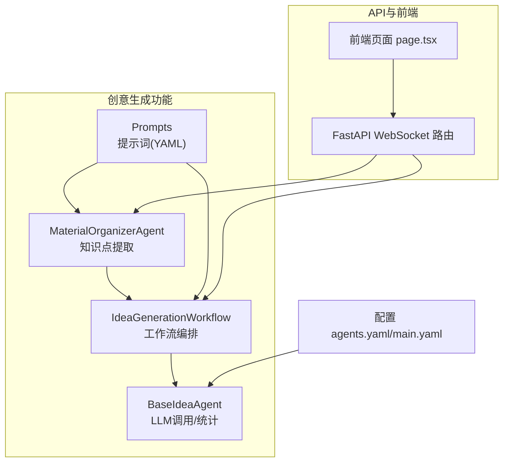
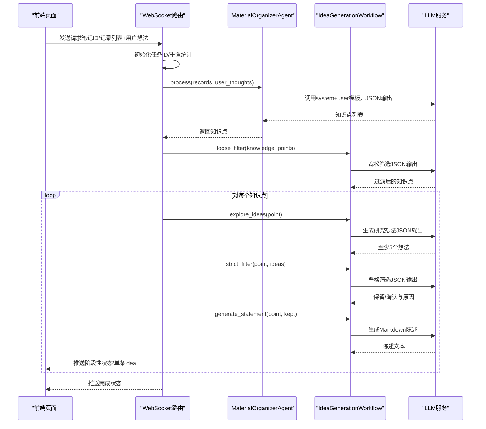
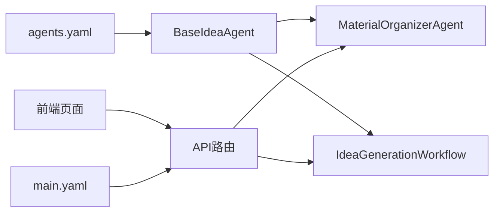
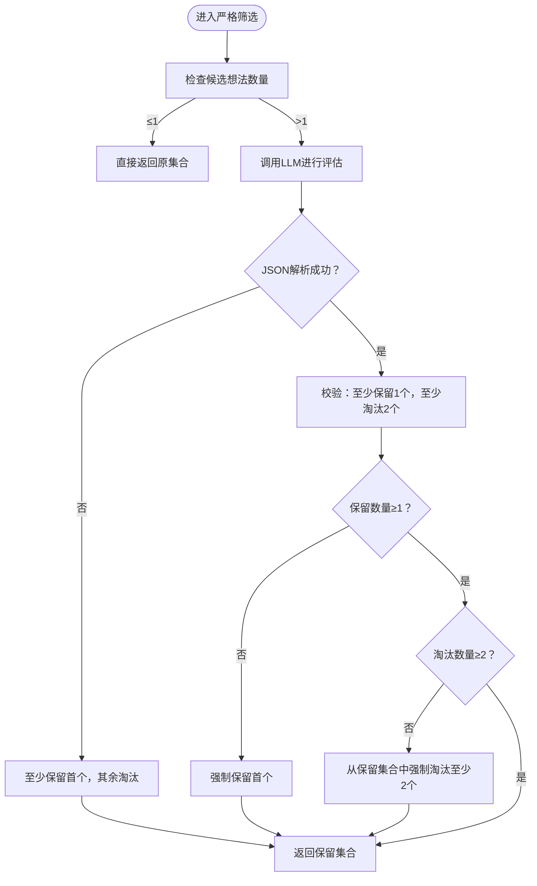

# 创意生成

<cite>
**本文引用的文件列表**
- [src/agents/ideagen/idea_generation_workflow.py](file://src/agents/ideagen/idea_generation_workflow.py)
- [src/agents/ideagen/base_idea_agent.py](file://src/agents/ideagen/base_idea_agent.py)
- [src/agents/ideagen/material_organizer_agent.py](file://src/agents/ideagen/material_organizer_agent.py)
- [src/agents/ideagen/prompts/zh/idea_generation.yaml](file://src/agents/ideagen/prompts/zh/idea_generation.yaml)
- [src/agents/ideagen/prompts/zh/material_organizer.yaml](file://src/agents/ideagen/prompts/zh/material_organizer.yaml)
- [src/api/routers/ideagen.py](file://src/api/routers/ideagen.py)
- [web/app/ideagen/page.tsx](file://web/app/ideagen/page.tsx)
- [config/agents.yaml](file://config/agents.yaml)
- [config/main.yaml](file://config/main.yaml)
- [src/agents/ideagen/README.md](file://src/agents/ideagen/README.md)
</cite>

## 目录
1. [简介](#简介)
2. [项目结构](#项目结构)
3. [核心组件](#核心组件)
4. [架构总览](#架构总览)
5. [详细组件分析](#详细组件分析)
6. [依赖关系分析](#依赖关系分析)
7. [性能与资源特性](#性能与资源特性)
8. [故障排查指南](#故障排查指南)
9. [结论](#结论)
10. [附录](#附录)

## 简介
本章节面向“创意生成”能力，系统性阐述从笔记材料中抽取“知识点”，再通过“宽松筛选—知识探索—严格筛选—陈述生成”的多阶段流程，最终产出结构化研究想法与陈述的完整实现。文档覆盖：
- 知识点提取与概念合成
- 多阶段过滤与创意生成策略
- 配置项、参数与返回值
- 与API、前端的集成关系
- 常见问题与排障建议
- 对初学者友好、对资深开发者具备技术深度的说明

## 项目结构
创意生成功能主要由以下模块构成：
- 基础抽象层：统一LLM调用接口与统计追踪
- 知识点提取器：从笔记记录中抽取“知识点”
- 工作流编排器：执行多阶段筛选与创意生成
- 提示词管理：中英文提示词（YAML）
- API路由：WebSocket端点，驱动全流程并推送状态
- 前端页面：选择笔记/记录、发起生成、展示结果

图表来源
- [src/agents/ideagen/material_organizer_agent.py](file://src/agents/ideagen/material_organizer_agent.py#L1-L168)
- [src/agents/ideagen/idea_generation_workflow.py](file://src/agents/ideagen/idea_generation_workflow.py#L1-L424)
- [src/agents/ideagen/base_idea_agent.py](file://src/agents/ideagen/base_idea_agent.py#L1-L142)
- [src/api/routers/ideagen.py](file://src/api/routers/ideagen.py#L1-L414)
- [web/app/ideagen/page.tsx](file://web/app/ideagen/page.tsx#L1-L754)
- [config/agents.yaml](file://config/agents.yaml#L1-L55)
- [config/main.yaml](file://config/main.yaml#L1-L142)

章节来源
- [src/agents/ideagen/README.md](file://src/agents/ideagen/README.md#L1-L296)

## 核心组件
- 基类 BaseIdeaAgent
  - 统一加载LLM配置（模型、温度、最大token），封装异步LLM调用，并共享统计追踪
  - 提供共享统计实例，支持打印统计摘要
- MaterialOrganizerAgent
  - 输入：笔记记录列表（含类型、标题、用户查询、系统输出）
  - 输出：知识点列表（每个包含“知识点名”和“描述”）
  - 支持回退策略，保证至少产出一个知识点
- IdeaGenerationWorkflow
  - 多阶段工作流：宽松筛选 → 探索创意 → 严格筛选 → 生成陈述
  - 支持进度回调、中间结果持久化、错误兜底
- API路由与前端
  - WebSocket端点驱动全流程，按阶段推送状态
  - 前端页面负责选择记录、发起生成、展示结果与保存

章节来源
- [src/agents/ideagen/base_idea_agent.py](file://src/agents/ideagen/base_idea_agent.py#L1-L142)
- [src/agents/ideagen/material_organizer_agent.py](file://src/agents/ideagen/material_organizer_agent.py#L1-L168)
- [src/agents/ideagen/idea_generation_workflow.py](file://src/agents/ideagen/idea_generation_workflow.py#L1-L424)
- [src/api/routers/ideagen.py](file://src/api/routers/ideagen.py#L1-L414)
- [web/app/ideagen/page.tsx](file://web/app/ideagen/page.tsx#L1-L754)

## 架构总览
创意生成的端到端流程如下：
- 前端选择笔记/记录，发送至WebSocket端点
- 后端加载LLM配置，调用知识点提取器
- 提取完成后进入工作流：宽松筛选 → 探索创意（每点至少5个）→ 严格筛选（至少保留1个，至少淘汰2个）→ 生成陈述
- 中间阶段持续推送状态，最终汇总并完成

图表来源
- [src/api/routers/ideagen.py](file://src/api/routers/ideagen.py#L1-L414)
- [src/agents/ideagen/material_organizer_agent.py](file://src/agents/ideagen/material_organizer_agent.py#L1-L168)
- [src/agents/ideagen/idea_generation_workflow.py](file://src/agents/ideagen/idea_generation_workflow.py#L1-L424)

## 详细组件分析

### 基类 BaseIdeaAgent
- 统一LLM配置来源：从agents.yaml读取温度与最大token，从环境变量读取API密钥、基地址与模型名
- 统一LLM调用：封装openai风格的异步调用，支持响应格式（如JSON对象）、温度与最大token覆盖
- 统计追踪：共享LLMStats实例，记录每次调用的模型、提示词与响应，支持打印统计摘要

章节来源
- [src/agents/ideagen/base_idea_agent.py](file://src/agents/ideagen/base_idea_agent.py#L1-L142)
- [config/agents.yaml](file://config/agents.yaml#L1-L55)

### 知识点提取器 MaterialOrganizerAgent
- 输入字段：type、title、user_query、output
- 提示词要点：
  - 从系统回答中提取“相对独立且有深度”的知识点
  - 每个知识点需有简洁名称与至少50字符的详细描述
  - 若解析失败，启用回退策略，仍保证至少产出一个知识点
- 输出结构：列表，元素为字典，包含“knowledge_point”和“description”

章节来源
- [src/agents/ideagen/material_organizer_agent.py](file://src/agents/ideagen/material_organizer_agent.py#L1-L168)
- [src/agents/ideagen/prompts/zh/material_organizer.yaml](file://src/agents/ideagen/prompts/zh/material_organizer.yaml#L1-L70)

### 工作流编排器 IdeaGenerationWorkflow
- 多阶段职责
  - 宽松筛选（loose_filter）：移除明显不适合的知识点，保留具有一定深度或潜力的点；若解析失败则回退为原列表
  - 探索创意（explore_ideas）：为每个知识点生成至少5个研究想法，最多10个；若不足则记录警告
  - 严格筛选（strict_filter）：至少保留1个，至少淘汰2个；若解析失败则至少保留首个
  - 生成陈述（generate_statement）：将知识点与保留想法组织为Markdown陈述
- 进度回调与中间结果
  - 支持外部进度回调（可为同步或异步），内部也通过路由层推送状态
  - 可选输出目录，保存各阶段中间结果（如过滤后知识点、每点生成的创意、严格筛选结果、工作流汇总）

章节来源
- [src/agents/ideagen/idea_generation_workflow.py](file://src/agents/ideagen/idea_generation_workflow.py#L1-L424)
- [src/agents/ideagen/prompts/zh/idea_generation.yaml](file://src/agents/ideagen/prompts/zh/idea_generation.yaml#L1-L188)

### 提示词与语言支持
- 提示词采用YAML管理，支持中文与英文两套
- 提示词涵盖：
  - 宽松筛选：筛选原则、保留/淘汰标准、输出格式
  - 探索创意：生成原则、创新维度、数量要求、输出格式
  - 严格筛选：评估维度、保留/淘汰标准、理由输出
  - 生成陈述：陈述结构、写作要求、输出格式
- 加载逻辑：按语言加载对应文件，缺失时回退到英文

章节来源
- [src/agents/ideagen/prompts/zh/idea_generation.yaml](file://src/agents/ideagen/prompts/zh/idea_generation.yaml#L1-L188)
- [src/agents/ideagen/prompts/zh/material_organizer.yaml](file://src/agents/ideagen/prompts/zh/material_organizer.yaml#L1-L70)

### API与前端集成
- WebSocket端点
  - 请求：支持通过笔记ID加载记录，或直接传入记录数组；可附加用户想法
  - 状态：按阶段推送init→extracting→knowledge_extracted→filtering→filtered→exploring→explored→strict_filtering→generating→idea_ready→complete
  - 结果：逐条推送idea消息，最后complete汇总
- 前端页面
  - 支持跨笔记选择记录，实时显示生成进度与状态
  - 展示每条研究想法的标题、描述与预览，支持展开查看Markdown陈述
  - 支持保存到笔记本

章节来源
- [src/api/routers/ideagen.py](file://src/api/routers/ideagen.py#L1-L414)
- [web/app/ideagen/page.tsx](file://web/app/ideagen/page.tsx#L1-L754)

## 依赖关系分析
- 组件耦合
  - IdeaGenerationWorkflow依赖BaseIdeaAgent进行LLM调用
  - MaterialOrganizerAgent同样依赖BaseIdeaAgent
  - API路由同时依赖两者，负责编排与状态推送
- 外部依赖
  - LLM服务：通过统一的openai风格异步调用接口
  - 配置：agents.yaml提供温度与最大token；main.yaml提供日志路径等系统级配置
- 潜在风险
  - JSON解析失败时的回退策略需一致（已内置）
  - 多阶段严格筛选的“至少保留1个、至少淘汰2个”约束需在提示词与业务逻辑中共同保障

图表来源
- [src/agents/ideagen/base_idea_agent.py](file://src/agents/ideagen/base_idea_agent.py#L1-L142)
- [src/agents/ideagen/idea_generation_workflow.py](file://src/agents/ideagen/idea_generation_workflow.py#L1-L424)
- [src/agents/ideagen/material_organizer_agent.py](file://src/agents/ideagen/material_organizer_agent.py#L1-L168)
- [src/api/routers/ideagen.py](file://src/api/routers/ideagen.py#L1-L414)
- [config/agents.yaml](file://config/agents.yaml#L1-L55)
- [config/main.yaml](file://config/main.yaml#L1-L142)

## 性能与资源特性
- LLM调用统计
  - 统一统计追踪，便于成本控制与性能分析
- 并发与流式
  - WebSocket端点支持边生成边推送，前端可实时感知进度
- 资源消耗
  - 温度与最大token由agents.yaml集中配置，避免硬编码
  - 建议在高并发场景下限制同时任务数，或分批处理

章节来源
- [src/agents/ideagen/base_idea_agent.py](file://src/agents/ideagen/base_idea_agent.py#L1-L142)
- [config/agents.yaml](file://config/agents.yaml#L1-L55)
- [src/api/routers/ideagen.py](file://src/api/routers/ideagen.py#L1-L414)

## 故障排查指南
- 常见问题
  - JSON解析失败：宽松筛选、探索创意、严格筛选均存在JSON解析失败的回退逻辑
  - 知识点为空：当提取失败或被全部过滤时，路由会返回相应错误状态
  - 记录为空：未提供笔记ID或记录列表时，路由会返回错误并关闭连接
  - LLM配置缺失：agents.yaml中缺少必要键会导致初始化异常
- 排查步骤
  - 检查agents.yaml与环境变量是否正确
  - 查看API日志（由main.yaml配置的日志路径）
  - 在前端观察WebSocket状态消息，定位卡顿阶段
  - 使用BaseIdeaAgent.print_stats()打印LLM使用统计
- 建议
  - 为每个阶段增加更细粒度的超时与重试
  - 对提示词进行A/B测试，优化生成质量与稳定性

章节来源
- [src/agents/ideagen/idea_generation_workflow.py](file://src/agents/ideagen/idea_generation_workflow.py#L1-L424)
- [src/agents/ideagen/material_organizer_agent.py](file://src/agents/ideagen/material_organizer_agent.py#L1-L168)
- [src/api/routers/ideagen.py](file://src/api/routers/ideagen.py#L1-L414)
- [config/agents.yaml](file://config/agents.yaml#L1-L55)
- [config/main.yaml](file://config/main.yaml#L1-L142)

## 结论
创意生成功能通过“知识点提取—多阶段筛选—创意探索—严格筛选—陈述生成”的闭环，将笔记材料转化为可落地的研究想法。其优势在于：
- 统一的LLM调用与统计追踪
- 清晰的多阶段流程与提示词管理
- WebSocket端到端流式体验与前端可视化
- 完善的错误回退与可观测性

建议在生产环境中结合提示词优化、任务限流与缓存策略，持续提升稳定性与用户体验。

## 附录

### 配置与参数总览
- LLM配置（agents.yaml）
  - ideagen模块：temperature、max_tokens
- 日志与路径（main.yaml）
  - 日志目录、性能日志目录、工具路径等
- API路由
  - WebSocket端点：/api/v1/ideagen/generate
  - 请求：notebook_id 或 records（二者二选一或直接传records）
  - 响应：status消息（阶段性状态）、idea消息（单条研究想法）、complete消息（汇总完成）

章节来源
- [config/agents.yaml](file://config/agents.yaml#L1-L55)
- [config/main.yaml](file://config/main.yaml#L1-L142)
- [src/api/routers/ideagen.py](file://src/api/routers/ideagen.py#L1-L414)

### 数据结构与返回值
- 知识点提取输出
  - 列表，元素为字典，包含“knowledge_point”、“description”
- 宽松筛选输出
  - 过滤后的知识点列表（JSON解析失败时回退为原列表）
- 探索创意输出
  - 每个知识点对应至少5个研究想法（最多10个）
- 严格筛选输出
  - 至少保留1个，至少淘汰2个；JSON解析失败时至少保留首个
- 陈述生成输出
  - Markdown格式文本，包含知识点回顾与保留想法的详细描述与保留原因

章节来源
- [src/agents/ideagen/material_organizer_agent.py](file://src/agents/ideagen/material_organizer_agent.py#L1-L168)
- [src/agents/ideagen/idea_generation_workflow.py](file://src/agents/ideagen/idea_generation_workflow.py#L1-L424)
- [src/agents/ideagen/prompts/zh/idea_generation.yaml](file://src/agents/ideagen/prompts/zh/idea_generation.yaml#L1-L188)

### 流程图：严格筛选决策

图表来源
- [src/agents/ideagen/idea_generation_workflow.py](file://src/agents/ideagen/idea_generation_workflow.py#L217-L314)