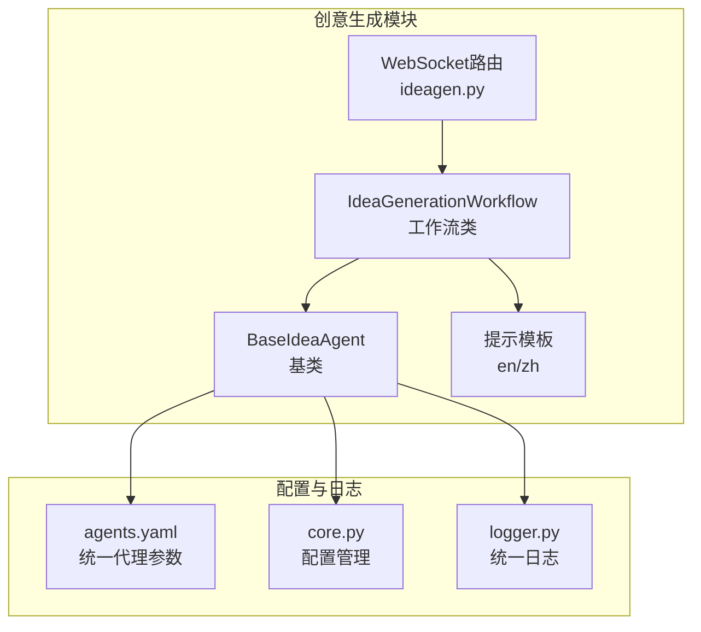
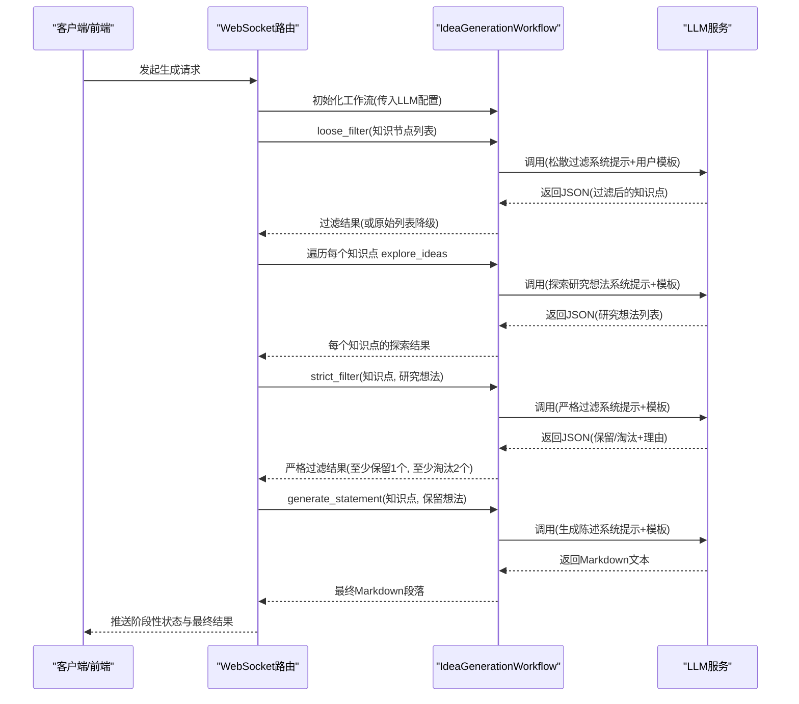
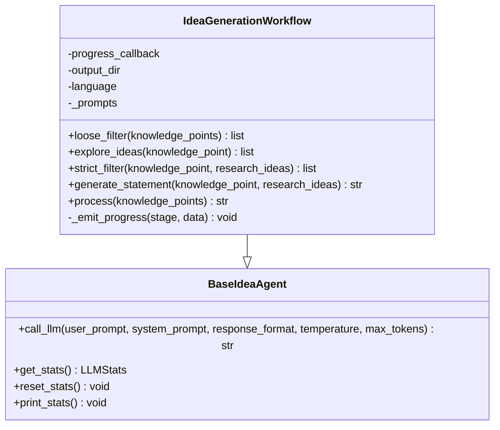
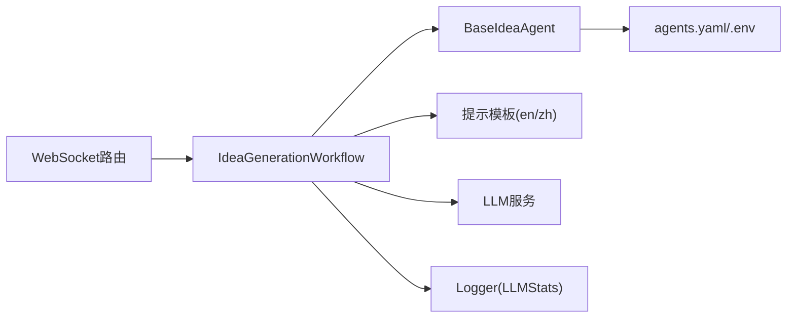

# 创意生成工作流

<cite>
**本文引用的文件列表**
- [idea_generation_workflow.py](file://src/agents/ideagen/idea_generation_workflow.py)
- [base_idea_agent.py](file://src/agents/ideagen/base_idea_agent.py)
- [idea_generation.yaml（英文）](file://src/agents/ideagen/prompts/en/idea_generation.yaml)
- [idea_generation.yaml（中文）](file://src/agents/ideagen/prompts/zh/idea_generation.yaml)
- [ideagen.py（WebSocket路由）](file://src/api/routers/ideagen.py)
- [agents.yaml（统一代理参数）](file://config/agents.yaml)
- [logger.py（统一日志）](file://src/core/logging/logger.py)
- [core.py（配置管理）](file://src/core/core.py)
</cite>

## 目录
1. [简介](#简介)
2. [项目结构](#项目结构)
3. [核心组件](#核心组件)
4. [架构总览](#架构总览)
5. [详细组件分析](#详细组件分析)
6. [依赖关系分析](#依赖关系分析)
7. [性能与可扩展性](#性能与可扩展性)
8. [故障排查指南](#故障排查指南)
9. [结论](#结论)
10. [附录：调用示例与参数说明](#附录调用示例与参数说明)

## 简介
本文件围绕创意生成工作流展开，系统性阐述 IdeaGenerationWorkflow 的实现细节与运行机制。该工作流以“松散过滤—知识点探索—严格过滤—最终Markdown生成”为主线，通过多语言提示模板（英文/中文）驱动LLM完成知识节点的筛选、研究想法的生成与评估，并最终输出结构化的Markdown陈述。文档覆盖输入输出格式、配置参数、异常处理与容错策略、性能优化建议以及扩展点，既面向初学者，也为高级开发者提供深入的技术洞察。

## 项目结构
创意生成工作流位于 src/agents/ideagen 目录下，核心文件包括：
- 工作流类：IdeaGenerationWorkflow（继承自 BaseIdeaAgent）
- 基类：BaseIdeaAgent（统一LLM调用接口与日志统计）
- 提示模板：prompts/en/idea_generation.yaml 与 prompts/zh/idea_generation.yaml
- API集成：WebSocket路由 ideagen.py 中对工作流的调用与状态推送
- 统一配置：agents.yaml 定义温度与最大token等参数来源

图表来源
- [idea_generation_workflow.py](file://src/agents/ideagen/idea_generation_workflow.py#L1-L424)
- [base_idea_agent.py](file://src/agents/ideagen/base_idea_agent.py#L1-L142)
- [idea_generation.yaml（英文）](file://src/agents/ideagen/prompts/en/idea_generation.yaml#L1-L188)
- [idea_generation.yaml（中文）](file://src/agents/ideagen/prompts/zh/idea_generation.yaml#L1-L188)
- [ideagen.py（WebSocket路由）](file://src/api/routers/ideagen.py#L39-L389)
- [agents.yaml（统一代理参数）](file://config/agents.yaml#L1-L55)
- [core.py（配置管理）](file://src/core/core.py#L1-L200)
- [logger.py（统一日志）](file://src/core/logging/logger.py#L1-L712)

章节来源
- [idea_generation_workflow.py](file://src/agents/ideagen/idea_generation_workflow.py#L1-L424)
- [base_idea_agent.py](file://src/agents/ideagen/base_idea_agent.py#L1-L142)
- [ideagen.py（WebSocket路由）](file://src/api/routers/ideagen.py#L39-L389)

## 核心组件
- IdeaGenerationWorkflow：负责串联四个阶段，提供异步进度回调、中间结果持久化与错误降级策略。
- BaseIdeaAgent：封装统一LLM调用接口（call_llm），读取agents.yaml参数，集成日志与LLM统计。
- 提示模板：包含松散过滤、探索研究想法、严格过滤、生成陈述四类系统提示与用户模板，支持英文/中文双语。
- WebSocket路由：在API层对工作流进行编排，手动推送各阶段状态，便于前端实时反馈。

章节来源
- [idea_generation_workflow.py](file://src/agents/ideagen/idea_generation_workflow.py#L33-L120)
- [base_idea_agent.py](file://src/agents/ideagen/base_idea_agent.py#L22-L138)
- [idea_generation.yaml（英文）](file://src/agents/ideagen/prompts/en/idea_generation.yaml#L1-L188)
- [idea_generation.yaml（中文）](file://src/agents/ideagen/prompts/zh/idea_generation.yaml#L1-L188)
- [ideagen.py（WebSocket路由）](file://src/api/routers/ideagen.py#L39-L120)

## 架构总览
创意生成工作流采用“阶段化流水线”设计，每个阶段均通过LLM完成特定任务，并在必要时保存中间结果。整体控制流如下：

图表来源
- [ideagen.py（WebSocket路由）](file://src/api/routers/ideagen.py#L224-L389)
- [idea_generation_workflow.py](file://src/agents/ideagen/idea_generation_workflow.py#L345-L424)

## 详细组件分析

### IdeaGenerationWorkflow 类
- 继承关系：IdeaGenerationWorkflow 继承自 BaseIdeaAgent，复用统一LLM调用与日志统计能力。
- 关键字段与初始化
  - progress_callback：异步进度回调，支持同步或协程函数；内部通过 _emit_progress 触发。
  - output_dir：中间结果输出目录，用于保存过滤后知识点、每轮研究想法、严格过滤结果与工作流汇总。
  - language：提示模板语言选择（默认英文，自动回退到英文）。
  - _prompts：按语言加载提示模板字典。
- 主要阶段方法
  - loose_filter：使用“宽松标准”筛选知识节点，返回过滤后的列表；若JSON解析失败或全部被过滤，则回退到原始列表。
  - explore_ideas：为单个知识节点生成至少5条研究想法（最多返回10条），并保存中间结果。
  - strict_filter：对研究想法进行“严格评估”，保证至少保留1条、至少淘汰2条；若解析失败则至少保留第一条。
  - generate_statement：将知识节点与保留的研究想法整合为Markdown陈述。
  - process：串联上述阶段，构建最终Markdown文档，并保存工作流汇总。
- 异常与容错
  - JSON解析失败：分别在松散过滤与严格过滤阶段进行降级，确保流程不中断。
  - 过滤后为空：在松散过滤阶段回退到原始列表；在严格过滤阶段至少保留1条。
  - 中间结果持久化：在每个阶段结束后写入对应JSON文件，便于调试与重放。

图表来源
- [base_idea_agent.py](file://src/agents/ideagen/base_idea_agent.py#L22-L138)
- [idea_generation_workflow.py](file://src/agents/ideagen/idea_generation_workflow.py#L33-L120)

章节来源
- [idea_generation_workflow.py](file://src/agents/ideagen/idea_generation_workflow.py#L33-L424)

### BaseIdeaAgent 基类
- 统一LLM调用接口：call_llm 封装 openai_complete_if_cache，自动注入模型、API密钥、基础URL、温度与最大token等参数。
- 参数来源：从 agents.yaml 读取模块级默认参数（temperature、max_tokens），未显式传参时使用这些默认值。
- 日志与统计：通过 get_logger 获取模块化日志器；调用LLM后更新共享LLMStats，便于全局统计与成本追踪。

章节来源
- [base_idea_agent.py](file://src/agents/ideagen/base_idea_agent.py#L22-L138)
- [agents.yaml（统一代理参数）](file://config/agents.yaml#L34-L39)
- [core.py（配置管理）](file://src/core/core.py#L114-L168)
- [logger.py（统一日志）](file://src/core/logging/logger.py#L1-L200)

### 提示模板（多语言）
- 松散过滤（loose_filter）
  - 系统提示：宽松筛选原则与保留原则，强调“宁可多留，不要过度筛选”。
  - 用户模板：接收知识节点列表文本，输出JSON结构的 filtered_points。
- 研究想法探索（explore_ideas）
  - 系统提示：生成至少5条具体、可行、有研究价值的思路，鼓励多维度创新。
  - 用户模板：接收知识节点名称与描述，输出JSON结构的 research_ideas。
- 严格过滤（strict_filter）
  - 系统提示：从研究价值、深度、可行性、扩展潜力、具体性五个维度评估，要求至少保留1条、至少淘汰2条。
  - 用户模板：接收知识节点与研究想法列表，输出JSON结构的 kept_ideas/rejected_ideas/reasons。
- 最终陈述生成（generate_statement）
  - 系统提示：生成专业的Markdown陈述，包含知识点回顾与逐条研究想法的详细说明与保留原因。
  - 用户模板：接收知识节点与保留研究想法，输出Markdown文本。

章节来源
- [idea_generation.yaml（英文）](file://src/agents/ideagen/prompts/en/idea_generation.yaml#L1-L188)
- [idea_generation.yaml（中文）](file://src/agents/ideagen/prompts/zh/idea_generation.yaml#L1-L188)

### API集成（WebSocket路由）
- 路由端点：/ideagen/generate（WebSocket）。
- 控制流：手动推送阶段状态（INIT、EXTRACTING、FILTERING、EXPLORING、STRICT_FILTERING、GENERATING、COMPLETE、ERROR），并在每个阶段发送数据包。
- 工作流调用：在路由中实例化 IdeaGenerationWorkflow，直接调用 loose_filter、explore_ideas、strict_filter、generate_statement，最后汇总并返回。

章节来源
- [ideagen.py（WebSocket路由）](file://src/api/routers/ideagen.py#L39-L120)
- [ideagen.py（WebSocket路由）](file://src/api/routers/ideagen.py#L224-L389)

## 依赖关系分析
- 组件耦合
  - IdeaGenerationWorkflow 依赖 BaseIdeaAgent 的LLM调用与日志统计。
  - 提示模板通过语言参数动态加载，降低硬编码耦合。
  - WebSocket路由与工作流解耦，仅通过方法调用与状态推送交互。
- 外部依赖
  - LLM服务：通过 openai_complete_if_cache 统一调用。
  - 配置系统：agents.yaml 提供统一参数来源；.env 提供LLM环境变量。
  - 日志系统：统一Logger与LLMStats，便于追踪与可视化。

图表来源
- [idea_generation_workflow.py](file://src/agents/ideagen/idea_generation_workflow.py#L33-L120)
- [base_idea_agent.py](file://src/agents/ideagen/base_idea_agent.py#L86-L138)
- [idea_generation.yaml（英文）](file://src/agents/ideagen/prompts/en/idea_generation.yaml#L1-L188)
- [idea_generation.yaml（中文）](file://src/agents/ideagen/prompts/zh/idea_generation.yaml#L1-L188)
- [ideagen.py（WebSocket路由）](file://src/api/routers/ideagen.py#L224-L389)
- [agents.yaml（统一代理参数）](file://config/agents.yaml#L34-L39)
- [core.py（配置管理）](file://src/core/core.py#L40-L72)
- [logger.py（统一日志）](file://src/core/logging/logger.py#L1-L200)

## 性能与可扩展性
- 异步与并发
  - 工作流方法均为异步，适合在WebSocket或后台任务中并行处理多个知识点。
  - 建议：在路由层对每个知识点的 explore_ideas/strict_filter/generate_statement 并行执行，以缩短总耗时。
- 日志与统计
  - 使用 BaseIdeaAgent 的 LLMStats 共享统计，便于监控token消耗与成本。
  - 建议：在生产环境中开启文件日志，以便审计与性能分析。
- 提示模板扩展
  - 新增语言：在 prompts/<lang>/ 下新增同名yaml文件，IdeaGenerationWorkflow 会自动加载。
  - 自定义阶段：可在工作流中增加新的阶段方法，并在路由中推送相应状态。
- 缓存与重试
  - LLM调用已通过 openai_complete_if_cache 支持缓存；可根据需要增加重试逻辑与超时设置。

章节来源
- [base_idea_agent.py](file://src/agents/ideagen/base_idea_agent.py#L86-L138)
- [logger.py（统一日志）](file://src/core/logging/logger.py#L364-L580)
- [idea_generation_workflow.py](file://src/agents/ideagen/idea_generation_workflow.py#L33-L120)

## 故障排查指南
- JSON解析失败
  - 现象：LLM返回非JSON或格式不符合预期。
  - 处理：松散过滤与严格过滤阶段均包含 try-except 捕获 JSONDecodeError，并进行降级：
    - 松散过滤：返回原始知识节点列表。
    - 严格过滤：至少保留第一条研究想法。
  - 建议：检查提示模板输出格式是否与JSON结构一致；必要时在系统提示中强调输出格式约束。
- 过滤后结果为空
  - 现象：松散过滤后无可用知识点。
  - 处理：process 直接返回提示性Markdown。
  - 建议：调整提示模板的宽松度或输入数据质量。
- 研究想法数量不足
  - 现象：探索阶段生成少于5条。
  - 处理：日志会记录警告；可考虑二次调用或补充生成。
  - 建议：在系统提示中强化“至少5条”的要求，并提供更具体的引导。
- LLM配置缺失
  - 现象：初始化时缺少模型、API密钥或基础URL。
  - 处理：get_llm_config 会抛出异常，需检查 .env 文件。
  - 建议：在部署前校验环境变量与agents.yaml配置。

章节来源
- [idea_generation_workflow.py](file://src/agents/ideagen/idea_generation_workflow.py#L104-L144)
- [idea_generation_workflow.py](file://src/agents/ideagen/idea_generation_workflow.py#L212-L314)
- [idea_generation_workflow.py](file://src/agents/ideagen/idea_generation_workflow.py#L355-L395)
- [core.py（配置管理）](file://src/core/core.py#L40-L72)

## 结论
IdeaGenerationWorkflow 通过“松散过滤—探索—严格过滤—生成陈述”的四阶段流水线，结合多语言提示模板与统一LLM调用接口，实现了从知识节点到高质量研究想法陈述的自动化生成。其异步设计、中间结果持久化与完善的异常降级策略，使其在复杂场景下仍具备良好的鲁棒性与可观测性。建议在生产环境中配合并行处理、日志审计与缓存策略，以获得更优的性能与用户体验。

## 附录：调用示例与参数说明

### 启动流程（示例路径）
- 在WebSocket路由中调用工作流的典型流程参考：
  - [路由中工作流调用与状态推送](file://src/api/routers/ideagen.py#L224-L389)

### 关键方法与参数
- IdeaGenerationWorkflow.__init__
  - 参数
    - api_key：LLM API密钥（可选，优先使用agents.yaml）
    - base_url：LLM基础URL（可选，优先使用agents.yaml）
    - model：模型名称（可选，优先使用agents.yaml）
    - progress_callback：进度回调（可为同步或异步函数）
    - output_dir：中间结果输出目录（可选）
    - language：提示模板语言（默认"en"，自动回退到"en"）
  - 返回：无（初始化对象）
  - 参考路径：[初始化与字段](file://src/agents/ideagen/idea_generation_workflow.py#L36-L61)

- loose_filter
  - 输入：知识节点列表（每项包含 knowledge_point 与 description）
  - 输出：过滤后的知识节点列表（JSON解析失败时回退为原始列表）
  - 参考路径：[松散过滤实现](file://src/agents/ideagen/idea_generation_workflow.py#L69-L144)

- explore_ideas
  - 输入：单个知识节点（knowledge_point、description）
  - 输出：研究想法列表（JSON解析失败时返回空列表）
  - 参考路径：[探索研究想法实现](file://src/agents/ideagen/idea_generation_workflow.py#L145-L216)

- strict_filter
  - 输入：知识节点、研究想法列表
  - 输出：严格过滤后的保留想法列表（JSON解析失败时至少保留1条）
  - 参考路径：[严格过滤实现](file://src/agents/ideagen/idea_generation_workflow.py#L217-L314)

- generate_statement
  - 输入：知识节点、保留研究想法列表
  - 输出：Markdown文本
  - 参考路径：[生成陈述实现](file://src/agents/ideagen/idea_generation_workflow.py#L315-L344)

- process
  - 输入：知识节点列表
  - 输出：最终Markdown文档（若过滤后为空，返回提示性Markdown）
  - 参考路径：[完整流程实现](file://src/agents/ideagen/idea_generation_workflow.py#L345-L424)

### 提示模板字段（节选）
- 松散过滤
  - loose_filter_system：系统提示
  - loose_filter_user_template：用户模板
  - 参考路径：[英文模板](file://src/agents/ideagen/prompts/en/idea_generation.yaml#L1-L34)、[中文模板](file://src/agents/ideagen/prompts/zh/idea_generation.yaml#L1-L34)
- 研究想法探索
  - explore_ideas_system：系统提示
  - explore_ideas_user_template：用户模板
  - 参考路径：[英文模板](file://src/agents/ideagen/prompts/en/idea_generation.yaml#L35-L74)、[中文模板](file://src/agents/ideagen/prompts/zh/idea_generation.yaml#L35-L74)
- 严格过滤
  - strict_filter_system：系统提示
  - strict_filter_user_template：用户模板
  - 参考路径：[英文模板](file://src/agents/ideagen/prompts/en/idea_generation.yaml#L75-L136)、[中文模板](file://src/agents/ideagen/prompts/zh/idea_generation.yaml#L75-L136)
- 生成陈述
  - generate_statement_system：系统提示
  - generate_statement_user_template：用户模板
  - 参考路径：[英文模板](file://src/agents/ideagen/prompts/en/idea_generation.yaml#L137-L188)、[中文模板](file://src/agents/ideagen/prompts/zh/idea_generation.yaml#L137-L188)

### 统一参数与配置
- agents.yaml
  - ideagen 模块的 temperature 与 max_tokens 作为统一默认参数来源
  - 参考路径：[统一代理参数](file://config/agents.yaml#L34-L39)
- .env
  - LLM_MODEL、LLM_BINDING_API_KEY、LLM_BINDING_HOST 等
  - 参考路径：[LLM配置加载](file://src/core/core.py#L40-L72)