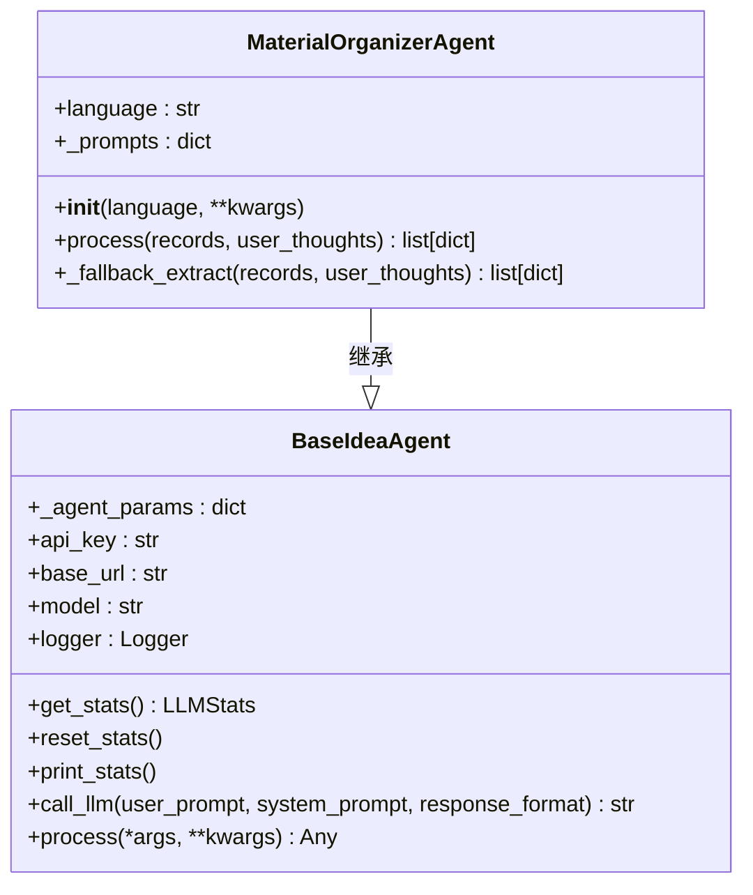
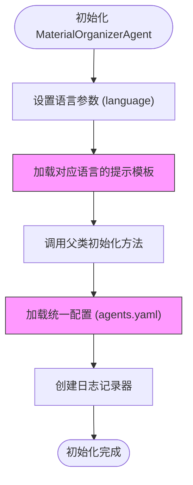
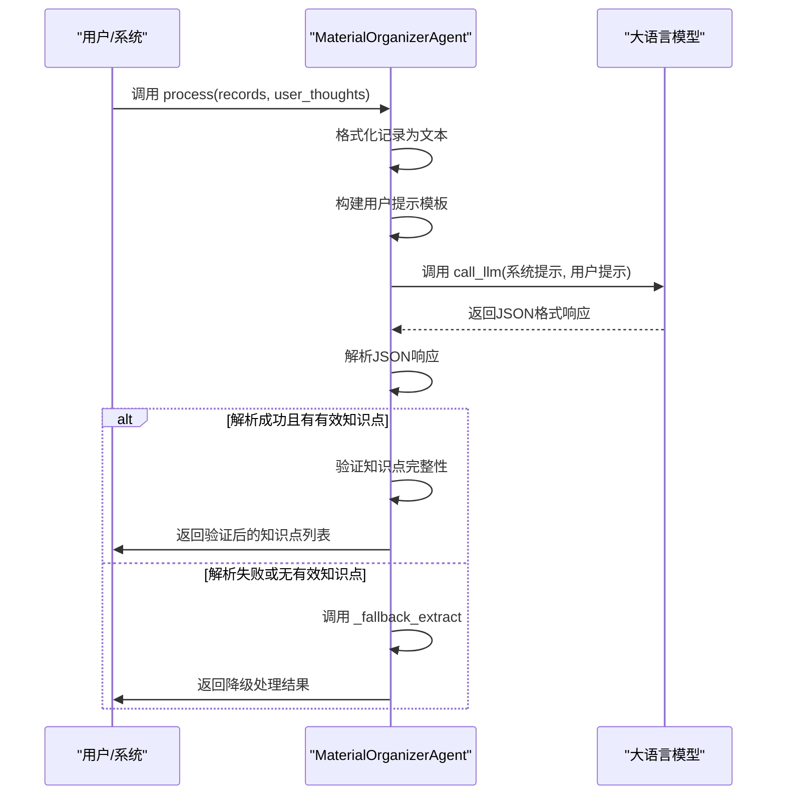
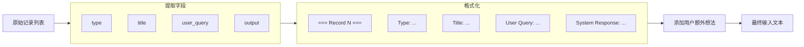
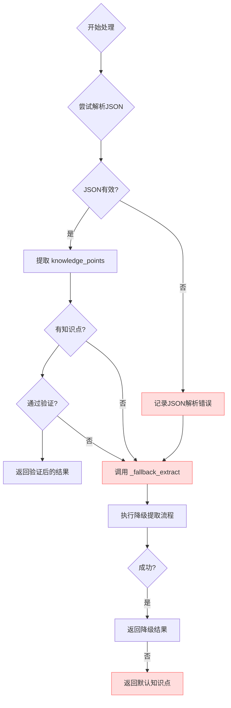
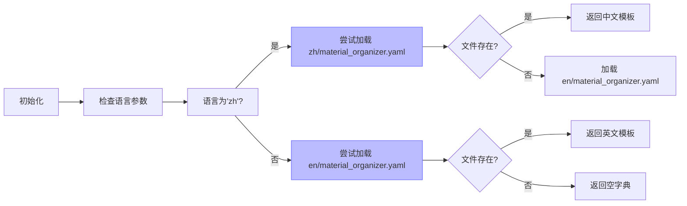
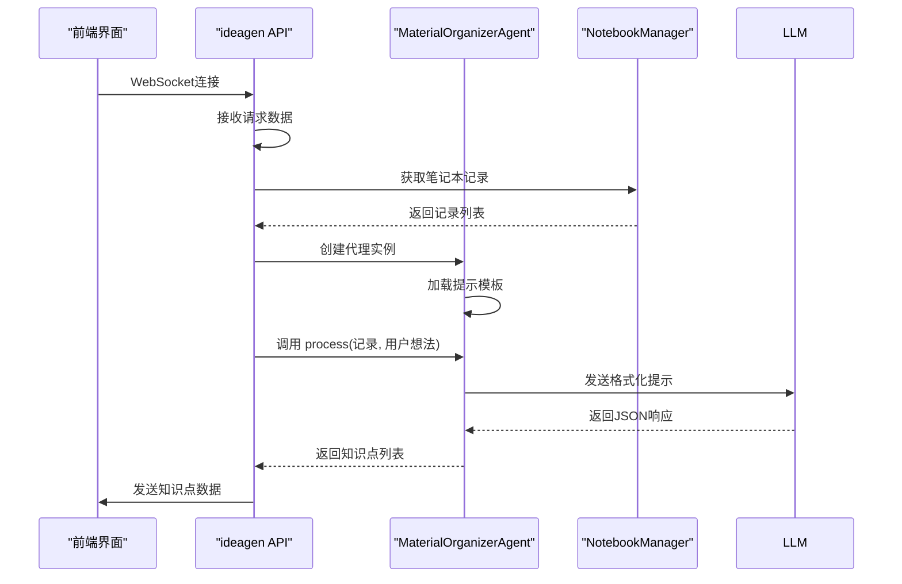

# 材料组织代理

<cite>
**本文档中引用的文件**  
- [material_organizer_agent.py](file://src/agents/ideagen/material_organizer_agent.py)
- [base_idea_agent.py](file://src/agents/ideagen/base_idea_agent.py)
- [material_organizer.yaml](file://src/agents/ideagen/prompts/en/material_organizer.yaml)
- [material_organizer.yaml](file://src/agents/ideagen/prompts/zh/material_organizer.yaml)
- [agents.yaml](file://config/agents.yaml)
- [notebook_manager.py](file://src/api/utils/notebook_manager.py)
- [ideagen.py](file://src/api/routers/ideagen.py)
</cite>

## 目录
1. [简介](#简介)
2. [核心架构与继承关系](#核心架构与继承关系)
3. [参数配置与初始化](#参数配置与初始化)
4. [知识节点提取流程](#知识节点提取流程)
5. [输入数据格式化机制](#输入数据格式化机制)
6. [容错与降级处理策略](#容错与降级处理策略)
7. [返回值结构与数据验证](#返回值结构与数据验证)
8. [多语言提示模板系统](#多语言提示模板系统)
9. [实际使用示例](#实际使用示例)
10. [常见问题与调试技巧](#常见问题与调试技巧)
11. [与创意生成工作流的集成](#与创意生成工作流的集成)

## 简介

材料组织代理（MaterialOrganizerAgent）是DeepTutor系统中用于从笔记本记录中提取结构化知识节点的核心组件。该代理作为创意生成工作流的第一步，负责将非结构化的用户查询和系统响应转化为具有研究价值的独立知识点。其主要功能包括：深入分析学习记录、识别隐含知识、提取核心描述，并输出标准化的知识点列表。该代理设计注重鲁棒性和多语言支持，能够处理各种边缘情况并提供降级方案。

## 核心架构与继承关系

材料组织代理基于统一的智能体架构设计，通过继承`BaseIdeaAgent`类获得基础能力。这种设计模式实现了功能复用和配置统一。



**图示来源**  
- [base_idea_agent.py](file://src/agents/ideagen/base_idea_agent.py#L22-L141)
- [material_organizer_agent.py](file://src/agents/ideagen/material_organizer_agent.py#L30-L167)

**本节来源**  
- [material_organizer_agent.py](file://src/agents/ideagen/material_organizer_agent.py#L30-L37)
- [base_idea_agent.py](file://src/agents/ideagen/base_idea_agent.py#L22-L33)

## 参数配置与初始化

材料组织代理在初始化时接受多个参数，其中`language`参数用于指定提示模板的语言版本，其他参数继承自基类。



代理从`config/agents.yaml`文件中读取统一的LLM参数配置，包括温度（temperature）和最大令牌数（max_tokens）。对于`ideagen`模块，这些值被设置为`temperature: 0.7`和`max_tokens: 4096`，这表明该代理被配置为产生更具创造性和多样性的输出。

**本节来源**  
- [material_organizer_agent.py](file://src/agents/ideagen/material_organizer_agent.py#L33-L37)
- [base_idea_agent.py](file://src/agents/ideagen/base_idea_agent.py#L28-L66)
- [agents.yaml](file://config/agents.yaml#L34-L38)

## 知识节点提取流程

材料组织代理的核心功能由`process`方法实现，该方法遵循一个清晰的处理流程来提取知识节点。



**图示来源**  
- [material_organizer_agent.py](file://src/agents/ideagen/material_organizer_agent.py#L38-L114)
- [base_idea_agent.py](file://src/agents/ideagen/base_idea_agent.py#L86-L137)

**本节来源**  
- [material_organizer_agent.py](file://src/agents/ideagen/material_organizer_agent.py#L38-L114)

## 输入数据格式化机制

代理在处理前会将输入的笔记本记录列表格式化为特定结构的文本，以便LLM更好地理解和分析。



每个记录被转换为包含类型、标题、用户查询和系统响应的块状结构，这种格式化方式确保了信息的完整性和可读性，便于LLM进行深度分析。

**本节来源**  
- [material_organizer_agent.py](file://src/agents/ideagen/material_organizer_agent.py#L53-L75)

## 容错与降级处理策略

材料组织代理实现了多层次的容错机制，确保在主流程失败时仍能提供有价值的结果。



当主流程因JSON解析错误或未提取到有效知识点而失败时，代理会自动调用`_fallback_extract`方法。该降级方法使用更宽松的策略和简化的提示模板，确保即使在不利条件下也能生成至少一个知识点。

**图示来源**  
- [material_organizer_agent.py](file://src/agents/ideagen/material_organizer_agent.py#L93-L114)
- [material_organizer_agent.py](file://src/agents/ideagen/material_organizer_agent.py#L116-L167)

**本节来源**  
- [material_organizer_agent.py](file://src/agents/ideagen/material_organizer_agent.py#L93-L167)

## 返回值结构与数据验证

代理返回的知识点列表具有严格的结构要求，并经过多层验证以确保数据质量。

```mermaid
erDiagram
KNOWLEDGE_POINT {
string knowledge_point PK
string description
}
KNOWLEDGE_POINT ||--o{ KNOWLEDGE_POINTS : "包含"
class KNOWLEDGE_POINTS {
list[dict] 返回值
}
```

每个知识点必须包含`knowledge_point`和`description`两个字段。代理会对提取的结果进行验证：知识点名称不能为空，描述不能为空且长度至少为10个字符。只有通过验证的知识点才会被包含在最终返回的列表中。

**本节来源**  
- [material_organizer_agent.py](file://src/agents/ideagen/material_organizer_agent.py#L98-L105)
- [material_organizer.yaml](file://src/agents/ideagen/prompts/en/material_organizer.yaml#L18-L30)

## 多语言提示模板系统

材料组织代理支持多语言提示模板，能够根据配置加载不同语言的指导指令。



系统优先尝试加载指定语言的模板文件，如果不存在则回退到英文模板。这种设计确保了系统的可用性，即使某种语言的模板文件缺失，也能使用默认的英文模板继续工作。

**本节来源**  
- [material_organizer_agent.py](file://src/agents/ideagen/material_organizer_agent.py#L15-L27)
- [material_organizer.yaml](file://src/agents/ideagen/prompts/en/material_organizer.yaml)
- [material_organizer.yaml](file://src/agents/ideagen/prompts/zh/material_organizer.yaml)

## 实际使用示例

以下是材料组织代理在API路由中的实际使用示例，展示了其如何与其他系统组件集成。



在`src/api/routers/ideagen.py`中，代理被用于WebSocket端点，接收笔记本ID和记录ID，从`NotebookManager`获取相应记录，然后调用`MaterialOrganizerAgent`进行处理，并将结果实时发送回前端。

**图示来源**  
- [ideagen.py](file://src/api/routers/ideagen.py#L193-L201)
- [notebook_manager.py](file://src/api/utils/notebook_manager.py#L159-L168)

**本节来源**  
- [ideagen.py](file://src/api/routers/ideagen.py#L193-L202)

## 常见问题与调试技巧

### 输入数据缺失
当输入记录列表为空时，代理会直接返回空列表。建议在调用前检查记录是否存在。

### 描述过短
主流程要求描述至少10个字符，降级流程要求至少30个字符。如果描述过短，知识点将被过滤掉。

### JSON解析错误
当LLM返回的响应无法解析为JSON时，代理会记录错误详情（前500个字符）并触发降级流程。可通过查看日志中的`Raw response`来调试此问题。

### 调试建议
1. 启用DEBUG日志级别以查看详细的LLM响应
2. 检查`agents.yaml`中的LLM配置是否正确
3. 验证提示模板文件是否存在且格式正确
4. 使用`BaseIdeaAgent.print_stats()`监控LLM调用统计

**本节来源**  
- [material_organizer_agent.py](file://src/agents/ideagen/material_organizer_agent.py#L112-L113)
- [material_organizer.yaml](file://src/agents/ideagen/prompts/en/material_organizer.yaml#L21)
- [material_organizer.yaml](file://src/agents/ideagen/prompts/en/material_organizer.yaml#L55)

## 与创意生成工作流的集成

材料组织代理是完整创意生成工作流的起点，与其他组件紧密协作。

```mermaid
flowchart LR
Organizer["MaterialOrganizerAgent"] --> |知识点| LooserFilter["Loose Filter"]
LooserFilter --> |过滤后知识点| Explorer["Idea Explorer"]
Explorer --> |研究想法| StricterFilter["Strict Filter"]
StricterFilter --> |保留的想法| Generator["Statement Generator"]
Generator --> |最终创意| Output["输出结果"]
style Organizer fill:#f96,stroke:#c63
style LooserFilter fill:#69f,stroke:#36c
style Explorer fill:#69f,stroke:#36c
style StricterFilter fill:#69f,stroke:#36c
style Generator fill:#69f,stroke:#36c
classDef primary fill:#f96,stroke:#c63,stroke-width:2px;
classDef secondary fill:#69f,stroke:#36c,stroke-width:2px;
class Organizer primary
class LooserFilter,Explorer,StricterFilter,Generator secondary
```



在`IdeaGenerationWorkflow`中，材料组织代理提取的知识点作为后续步骤的输入，经过宽松过滤、创意探索、严格过滤和陈述生成等阶段，最终形成高质量的研究创意。

**图示来源**  
- [ideagen.py](file://src/api/routers/ideagen.py#L199-L201)
- [idea_generation_workflow.py](file://src/agents/ideagen/idea_generation_workflow.py#L69-L138)

**本节来源**  
- [ideagen.py](file://src/api/routers/ideagen.py#L199-L240)
- [idea_generation_workflow.py](file://src/agents/ideagen/idea_generation_workflow.py#L69-L138)