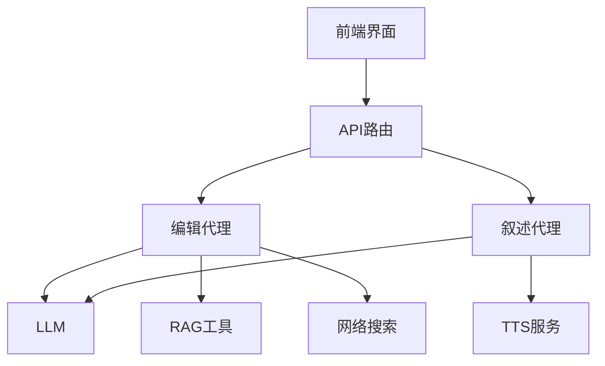
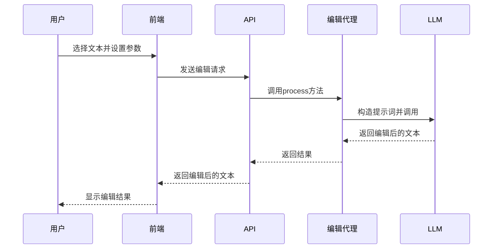
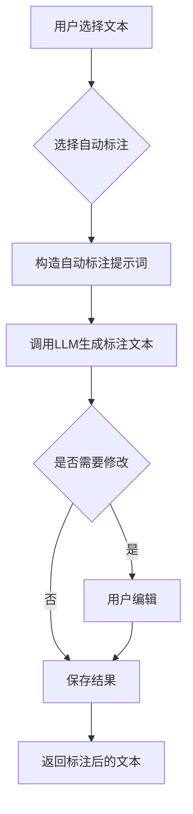
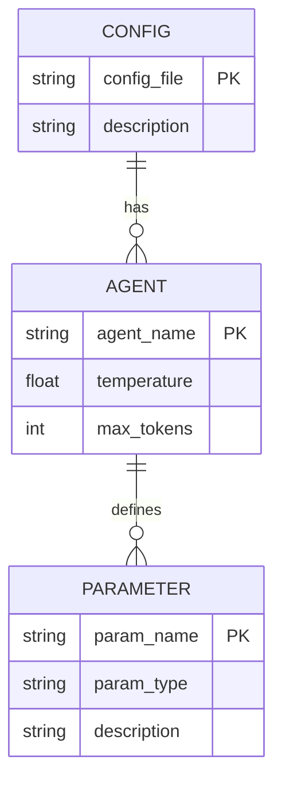
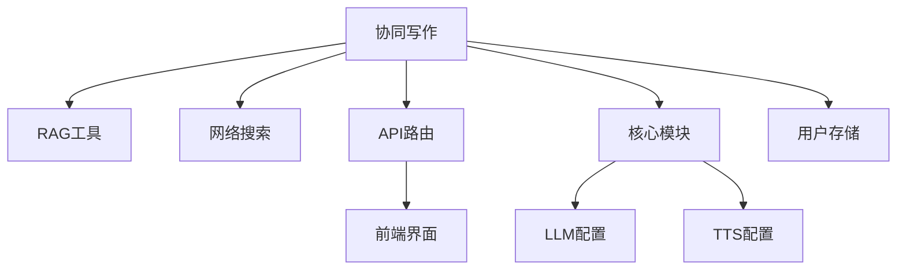
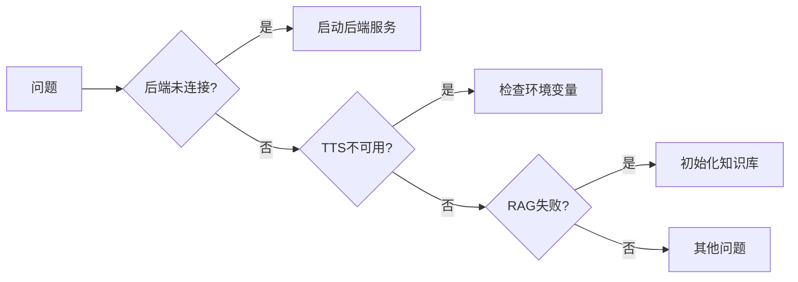

# 协同写作

<cite>
**本文档中引用的文件**   
- [edit_agent.py](file://src/agents/co_writer/edit_agent.py)
- [narrator_agent.py](file://src/agents/co_writer/narrator_agent.py)
- [co_writer.py](file://src/api/routers/co_writer.py)
- [CoWriterEditor.tsx](file://web/components/CoWriterEditor.tsx)
- [CoMarkerEditor.tsx](file://web/components/CoMarkerEditor.tsx)
- [edit_agent.yaml](file://src/agents/co_writer/prompts/en/edit_agent.yaml)
- [narrator_agent.yaml](file://src/agents/co_writer/prompts/en/narrator_agent.yaml)
- [agents.yaml](file://config/agents.yaml)
</cite>

## 目录
1. [简介](#简介)
2. [核心组件](#核心组件)
3. [文本编辑功能](#文本编辑功能)
4. [自动标注功能](#自动标注功能)
5. [配置选项与参数](#配置选项与参数)
6. [与其他组件的关系](#与其他组件的关系)
7. [常见问题及解决方案](#常见问题及解决方案)
8. [结论](#结论)

## 简介
协同写作功能是DeepTutor系统中的核心模块之一，旨在通过AI技术辅助用户进行文本编辑和内容标注。该功能主要由两个核心代理组成：编辑代理（EditAgent）和叙述代理（NarratorAgent）。编辑代理负责文本的重写、缩短和扩展等操作，同时支持基于RAG（检索增强生成）和网络搜索的上下文增强。叙述代理则专注于将笔记内容转换为适合口头叙述的脚本，并支持文本转语音（TTS）功能。整个系统通过前后端分离架构实现，前端提供直观的用户界面，后端通过FastAPI提供RESTful API接口。

**Section sources**
- [edit_agent.py](file://src/agents/co_writer/edit_agent.py#L1-L329)
- [narrator_agent.py](file://src/agents/co_writer/narrator_agent.py#L1-L441)

## 核心组件

协同写作功能的核心组件包括编辑代理、叙述代理和API路由。编辑代理（EditAgent）是主要的文本处理引擎，负责执行各种编辑操作。它通过加载配置文件中的参数来控制LLM的行为，如温度和最大令牌数。叙述代理（NarratorAgent）则专注于生成适合口头叙述的脚本，并支持TTS功能。API路由（co_writer.py）将这些功能暴露为RESTful接口，供前端调用。

**Diagram sources **
- [edit_agent.py](file://src/agents/co_writer/edit_agent.py#L119-L329)
- [narrator_agent.py](file://src/agents/co_writer/narrator_agent.py#L74-L441)
- [co_writer.py](file://src/api/routers/co_writer.py#L1-L313)

**Section sources**
- [edit_agent.py](file://src/agents/co_writer/edit_agent.py#L1-L329)
- [narrator_agent.py](file://src/agents/co_writer/narrator_agent.py#L1-L441)
- [co_writer.py](file://src/api/routers/co_writer.py#L1-L313)

## 文本编辑功能

文本编辑功能是协同写作的核心，允许用户对选中的文本进行重写、缩短或扩展。用户可以通过前端界面选择文本并指定操作类型和指令。编辑代理会根据用户指令构造提示词，并调用LLM生成编辑后的文本。此外，用户还可以选择使用RAG或网络搜索来获取上下文信息，以增强编辑效果。

**Diagram sources **
- [edit_agent.py](file://src/agents/co_writer/edit_agent.py#L132-L270)
- [co_writer.py](file://src/api/routers/co_writer.py#L70-L85)
- [CoWriterEditor.tsx](file://web/components/CoWriterEditor.tsx#L702-L799)

**Section sources**
- [edit_agent.py](file://src/agents/co_writer/edit_agent.py#L132-L270)
- [co_writer.py](file://src/api/routers/co_writer.py#L70-L85)
- [CoWriterEditor.tsx](file://web/components/CoWriterEditor.tsx#L702-L799)

## 自动标注功能

自动标注功能允许AI自动为文本添加注释标签，帮助用户快速识别关键信息。该功能通过`auto_mark`方法实现，使用专门的系统提示词指导LLM选择最重要的信息进行标注。支持的标签类型包括圈注（circle）、高亮（highlight）、方框（box）、下划线（underline）和括号（bracket），每种标签都有特定的使用场景和限制。

**Diagram sources **
- [edit_agent.py](file://src/agents/co_writer/edit_agent.py#L272-L328)
- [co_writer.py](file://src/api/routers/co_writer.py#L93-L103)
- [CoMarkerEditor.tsx](file://web/components/CoMarkerEditor.tsx#L733-L755)

**Section sources**
- [edit_agent.py](file://src/agents/co_writer/edit_agent.py#L272-L328)
- [co_writer.py](file://src/api/routers/co_writer.py#L93-L103)
- [CoMarkerEditor.tsx](file://web/components/CoMarkerEditor.tsx#L733-L755)

## 配置选项与参数

协同写作功能的配置主要通过`agents.yaml`文件管理，该文件定义了所有代理模块的统一参数。对于编辑代理，关键配置参数包括`temperature`（温度）和`max_tokens`（最大令牌数）。温度参数控制生成文本的随机性，值越高越随机；最大令牌数限制了LLM输出的最大长度。此外，系统还支持通过环境变量配置LLM和TTS服务的API密钥和端点。

**Diagram sources **
- [agents.yaml](file://config/agents.yaml#L1-L55)
- [core.py](file://src/core/core.py#L114-L167)

**Section sources**
- [agents.yaml](file://config/agents.yaml#L1-L55)
- [core.py](file://src/core/core.py#L114-L167)

## 与其他组件的关系

协同写作功能与系统的其他组件有紧密的集成关系。它依赖于RAG工具和网络搜索工具来获取外部知识，通过API路由与前端界面通信，并使用核心模块提供的LLM和TTS配置。此外，操作历史记录和工具调用结果被持久化存储在用户目录中，便于后续查询和分析。

**Diagram sources **
- [edit_agent.py](file://src/agents/co_writer/edit_agent.py#L13-L14)
- [co_writer.py](file://src/api/routers/co_writer.py#L16-L23)
- [core.py](file://src/core/core.py#L40-L111)

**Section sources**
- [edit_agent.py](file://src/agents/co_writer/edit_agent.py#L13-L14)
- [co_writer.py](file://src/api/routers/co_writer.py#L16-L23)
- [core.py](file://src/core/core.py#L40-L111)

## 常见问题及解决方案

在使用协同写作功能时，用户可能会遇到一些常见问题。例如，后端服务未连接时，前端会显示连接错误并提示用户启动后端服务。TTS功能不可用通常是由于缺少必要的环境变量配置。此外，如果知识库未初始化，RAG搜索将无法正常工作。针对这些问题，系统提供了详细的错误信息和解决方案提示。

**Diagram sources **
- [CoWriterEditor.tsx](file://web/components/CoWriterEditor.tsx#L711-L718)
- [co_writer.py](file://src/api/routers/co_writer.py#L248-L273)
- [rag_tool.py](file://src/tools/rag_tool.py#L118-L120)

**Section sources**
- [CoWriterEditor.tsx](file://web/components/CoWriterEditor.tsx#L711-L718)
- [co_writer.py](file://src/api/routers/co_writer.py#L248-L273)
- [rag_tool.py](file://src/tools/rag_tool.py#L118-L120)

## 结论
协同写作功能通过集成先进的AI技术，为用户提供了一个强大的文本编辑和内容标注工具。其模块化设计和清晰的API接口使得功能扩展和维护变得简单。通过合理的配置和使用，用户可以显著提高写作效率和质量。未来的工作可以集中在优化标注算法、增强多语言支持和改进用户体验上。