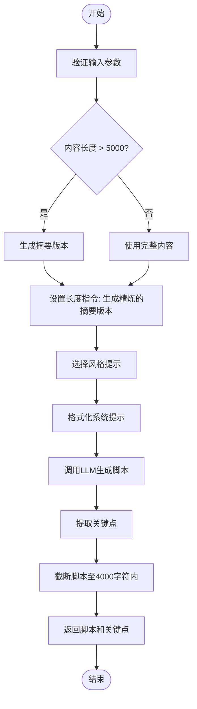
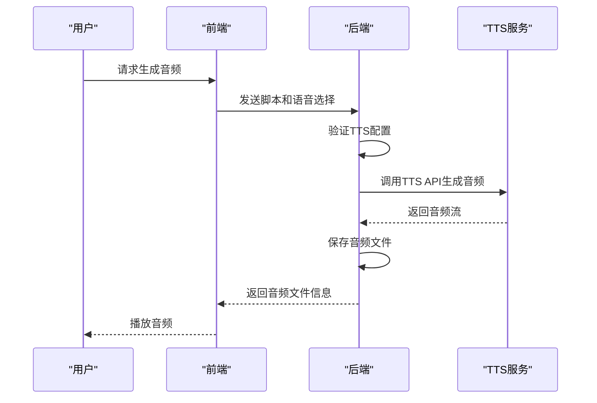

# 叙述代理

<cite>
**本文档引用的文件**
- [narrator_agent.py](file://src/agents/co_writer/narrator_agent.py)
- [narrator_agent.yaml](file://src/agents/co_writer/prompts/zh/narrator_agent.yaml)
- [co_writer.py](file://src/api/routers/co_writer.py)
- [core.py](file://src/core/core.py)
- [main.yaml](file://config/main.yaml)
- [CoWriterEditor.tsx](file://web/components/CoWriterEditor.tsx)
</cite>

## 目录
1. [简介](#简介)
2. [核心功能实现](#核心功能实现)
3. [配置与参数](#配置与参数)
4. [与其他组件的集成](#与其他组件的集成)
5. [常见问题与解决方案](#常见问题与解决方案)
6. [总结](#总结)

## 简介

叙述代理（NarratorAgent）是DeepTutor系统中的一个关键组件，负责将笔记内容转换为叙述脚本，并使用OpenAI的TTS（文本转语音）API生成音频。该代理提供了三种叙述风格：友好型、学术型和简洁型，允许用户根据需要选择最适合的叙述方式。通过与前端CoWriterEditor的集成，用户可以轻松地将笔记内容转换为可听的音频内容，从而增强学习体验。

**Section sources**
- [narrator_agent.py](file://src/agents/co_writer/narrator_agent.py#L1-L441)

## 核心功能实现

### 生成叙述脚本

叙述代理的核心功能之一是生成叙述脚本。`generate_script`方法接收笔记内容和叙述风格作为输入，然后利用预定义的提示模板生成适合口头叙述的脚本。该方法首先根据内容长度判断是否需要生成摘要版本，以确保生成的脚本不超过4000个字符的限制。接着，它会调用LLM（大语言模型）来生成脚本，并通过`_extract_key_points`方法提取关键点，以便用户快速了解主要内容。

**Diagram sources**
- [narrator_agent.py](file://src/agents/co_writer/narrator_agent.py#L161-L254)

### 提取关键点

`_extract_key_points`方法用于从笔记内容中提取3-5个关键点。这些关键点以JSON数组的形式返回，每个元素都是一个字符串，代表一个关键信息。此方法同样依赖于LLM，通过特定的系统提示和用户提示来指导模型提取关键信息。提取的关键点有助于用户快速把握笔记的核心内容，特别是在处理长篇笔记时。

**Section sources**
- [narrator_agent.py](file://src/agents/co_writer/narrator_agent.py#L256-L293)

### 生成TTS音频

`generate_audio`方法负责将生成的叙述脚本转换为音频文件。该方法首先检查TTS配置是否可用，然后创建一个OpenAI客户端，调用TTS API生成音频。生成的音频文件会被保存到指定的目录中，并返回音频文件的路径、访问URL、唯一标识符以及使用的语音角色。如果脚本长度超过4096个字符，方法会自动进行截断，以符合OpenAI TTS API的限制。

**Diagram sources**
- [narrator_agent.py](file://src/agents/co_writer/narrator_agent.py#L295-L382)

## 配置与参数

### TTS配置验证

`_validate_tts_config`方法用于验证TTS配置的完整性和格式。该方法检查配置中是否包含必需的键（如`model`、`api_key`、`base_url`），并验证`base_url`的格式是否正确。此外，它还会检查API密钥是否为空或无效。如果配置不完整或格式错误，方法会抛出相应的异常，确保在调用TTS API之前配置是正确的。

**Section sources**
- [narrator_agent.py](file://src/agents/co_writer/narrator_agent.py#L108-L159)

### 默认语音设置

TTS配置中的`default_voice`字段定义了默认的语音角色。用户可以在前端界面中选择不同的语音角色（如alloy、echo、fable、onyx、nova、shimmer），如果没有指定，则使用默认值。`main.yaml`文件中的`tts`部分定义了默认的语音设置，用户可以通过修改此文件来更改默认语音。

**Section sources**
- [main.yaml](file://config/main.yaml#L41-L42)
- [narrator_agent.py](file://src/agents/co_writer/narrator_agent.py#L94-L98)

## 与其他组件的集成

### 与前端CoWriterEditor的集成

叙述代理通过API与前端CoWriterEditor紧密集成。当用户在CoWriterEditor中选择一段文本并点击“生成叙述”按钮时，前端会向后端发送一个包含笔记内容、叙述风格和语音选择的请求。后端接收到请求后，调用`narrate`方法生成叙述脚本和音频，然后将结果返回给前端。前端接收到结果后，显示生成的脚本和关键点，并提供音频播放功能。

**Section sources**
- [co_writer.py](file://src/api/routers/co_writer.py#L200-L228)
- [CoWriterEditor.tsx](file://web/components/CoWriterEditor.tsx#L102-L122)

### 音频文件的存储路径

生成的音频文件被存储在`data/user/co-writer/audio`目录下。每个音频文件都有一个唯一的文件名，由时间戳和UUID组成，确保文件名的唯一性。音频文件的访问URL通过`/api/outputs/co-writer/audio/`路径提供，用户可以通过该URL直接访问和播放音频文件。

**Section sources**
- [narrator_agent.py](file://src/agents/co_writer/narrator_agent.py#L66-L67)
- [narrator_agent.py](file://src/agents/co_writer/narrator_agent.py#L369-L370)

## 常见问题与解决方案

### TTS配置错误

如果TTS配置不正确或缺失，`generate_audio`方法会抛出`ValueError`异常，提示用户检查`.env`文件中的`TTS_MODEL`、`TTS_API_KEY`和`TTS_URL`配置。用户应确保这些配置项已正确设置，并且API密钥有效。

**Section sources**
- [narrator_agent.py](file://src/agents/co_writer/narrator_agent.py#L311-L313)
- [core.py](file://src/core/core.py#L95-L104)

### 音频生成失败

如果音频生成过程中发生错误，`generate_audio`方法会捕获异常并记录错误信息，然后抛出`ValueError`异常，提示用户音频生成失败。常见的原因包括网络问题、API调用超时或TTS服务不可用。用户可以尝试重新生成音频，或者检查网络连接和TTS服务状态。

**Section sources**
- [narrator_agent.py](file://src/agents/co_writer/narrator_agent.py#L379-L381)

## 总结

叙述代理是DeepTutor系统中的一个重要组件，通过将笔记内容转换为叙述脚本和音频，极大地提升了用户的学习体验。本文详细介绍了叙述代理的实现细节，包括生成叙述脚本、提取关键点和生成TTS音频的方法。同时，还讨论了配置选项、参数和返回值，特别是TTS配置的验证和默认语音设置。通过与前端CoWriterEditor的集成，用户可以方便地使用这些功能。对于开发者来说，了解这些实现细节有助于更好地维护和扩展叙述代理的功能。

**Section sources**
- [narrator_agent.py](file://src/agents/co_writer/narrator_agent.py#L1-L441)
- [co_writer.py](file://src/api/routers/co_writer.py#L200-L228)
- [main.yaml](file://config/main.yaml#L41-L42)
- [CoWriterEditor.tsx](file://web/components/CoWriterEditor.tsx#L102-L122)