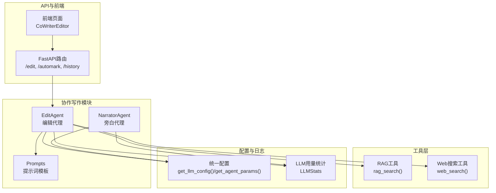
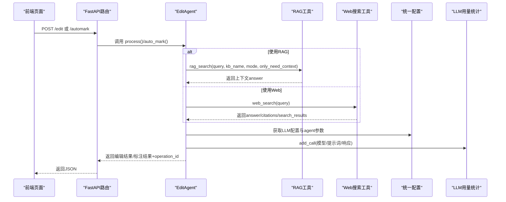
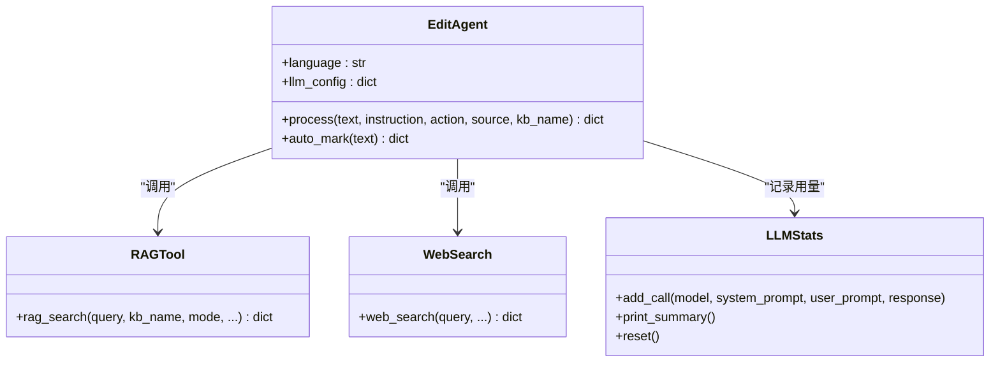
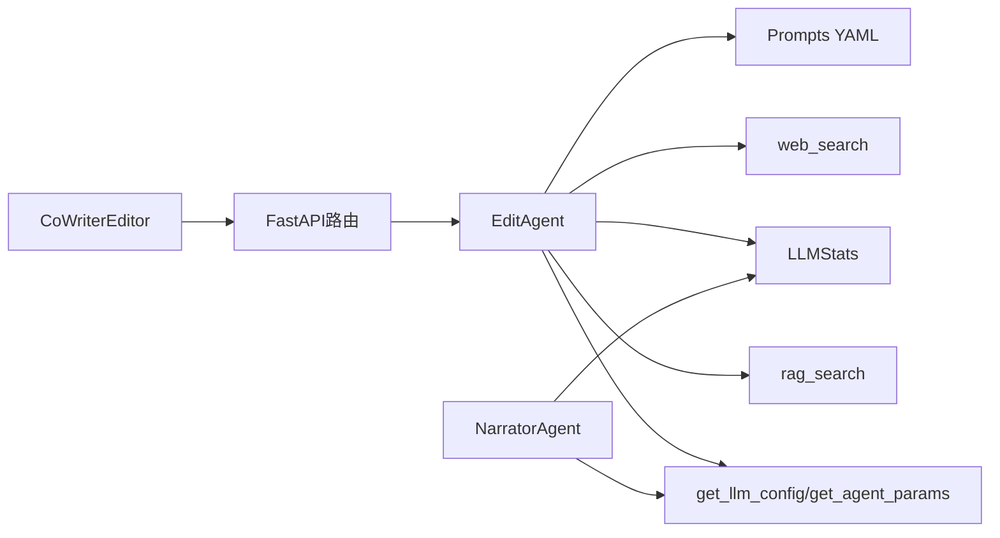
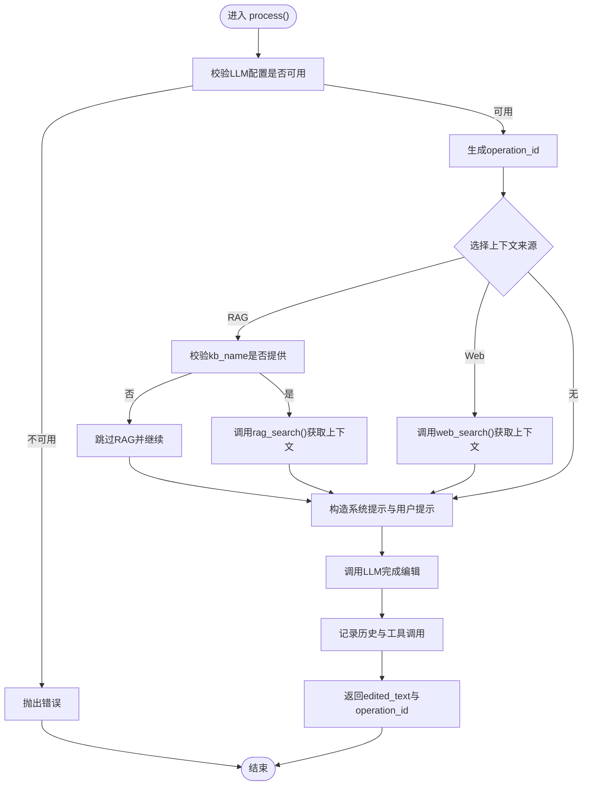

# 编辑代理

<cite>
**本文引用的文件列表**
- [edit_agent.py](file://src/agents/co_writer/edit_agent.py)
- [edit_agent.yaml（中文）](file://src/agents/co_writer/prompts/zh/edit_agent.yaml)
- [edit_agent.yaml（英文）](file://src/agents/co_writer/prompts/en/edit_agent.yaml)
- [rag_tool.py](file://src/tools/rag_tool.py)
- [web_search.py](file://src/tools/web_search.py)
- [core.py](file://src/core/core.py)
- [agents.yaml](file://config/agents.yaml)
- [co_writer.py（FastAPI路由）](file://src/api/routers/co_writer.py)
- [llm_stats.py](file://src/core/logging/llm_stats.py)
- [narrator_agent.py](file://src/agents/co_writer/narrator_agent.py)
- [page.tsx（前端页面入口）](file://web/app/co_writer/page.tsx)
</cite>

## 目录
1. [简介](#简介)
2. [项目结构](#项目结构)
3. [核心组件](#核心组件)
4. [架构总览](#架构总览)
5. [详细组件分析](#详细组件分析)
6. [依赖关系分析](#依赖关系分析)
7. [性能考量](#性能考量)
8. [故障排查指南](#故障排查指南)
9. [结论](#结论)
10. [附录](#附录)

## 简介
编辑代理（EditAgent）是协作写作模块的核心组件，负责对用户提供的文本执行“重写”“缩短”“扩展”等编辑操作。它支持两种上下文增强来源：基于知识库的检索增强（RAG）和网络搜索（Web），并将编辑过程与历史记录、工具调用记录、LLM用量统计打通，便于追踪与审计。编辑代理还提供“AI自动标注”能力，帮助读者快速定位关键信息。

该文档面向初学者与资深开发者，既给出清晰的功能说明与流程图，也深入到实现细节、配置项、参数与返回值定义、错误处理策略以及与RAG与Web搜索工具的集成方式。

## 项目结构
编辑代理位于协作写作模块中，配合FastAPI路由对外提供HTTP接口，前端通过页面入口调用编辑代理与旁白（Narrator）代理完成写作与朗读流程。

图表来源
- [edit_agent.py](file://src/agents/co_writer/edit_agent.py#L120-L329)
- [co_writer.py（FastAPI路由）](file://src/api/routers/co_writer.py#L70-L118)
- [rag_tool.py](file://src/tools/rag_tool.py#L31-L241)
- [web_search.py](file://src/tools/web_search.py#L19-L155)
- [core.py](file://src/core/core.py#L40-L168)
- [llm_stats.py](file://src/core/logging/llm_stats.py#L65-L177)
- [narrator_agent.py](file://src/agents/co_writer/narrator_agent.py#L74-L160)
- [edit_agent.yaml（中文）](file://src/agents/co_writer/prompts/zh/edit_agent.yaml#L1-L114)

章节来源
- [edit_agent.py](file://src/agents/co_writer/edit_agent.py#L120-L329)
- [co_writer.py（FastAPI路由）](file://src/api/routers/co_writer.py#L70-L118)

## 核心组件
- 编辑代理（EditAgent）
  - 提供文本编辑主流程：重写、缩短、扩展
  - 支持上下文增强：RAG检索与Web搜索
  - 记录操作历史与工具调用
  - 统计LLM用量并打印汇总
- 提示词模板（Prompts）
  - 中文/英文两套提示词，覆盖系统提示、动作模板、上下文模板、用户模板、自动标注系统提示与用户模板
- 工具层
  - RAG工具：封装LightRAG查询，支持多种模式与知识库路径解析
  - Web搜索工具：基于Perplexity API的网络搜索
- 统一配置与日志
  - 统一读取LLM/TTS/嵌入配置，加载agents.yaml中的温度与最大token参数
  - LLM用量统计器，估算token与费用
- API路由
  - 对外暴露编辑、自动标注、历史查询、工具调用查询、导出Markdown等接口
- 前端页面
  - 页面入口引入编辑器组件，驱动编辑代理与旁白代理

章节来源
- [edit_agent.py](file://src/agents/co_writer/edit_agent.py#L120-L329)
- [edit_agent.yaml（中文）](file://src/agents/co_writer/prompts/zh/edit_agent.yaml#L1-L114)
- [edit_agent.yaml（英文）](file://src/agents/co_writer/prompts/en/edit_agent.yaml#L1-L114)
- [rag_tool.py](file://src/tools/rag_tool.py#L31-L241)
- [web_search.py](file://src/tools/web_search.py#L19-L155)
- [core.py](file://src/core/core.py#L40-L168)
- [llm_stats.py](file://src/core/logging/llm_stats.py#L65-L177)
- [co_writer.py（FastAPI路由）](file://src/api/routers/co_writer.py#L70-L118)
- [page.tsx（前端页面入口）](file://web/app/co_writer/page.tsx#L1-L27)

## 架构总览
编辑代理的调用链路如下：前端发起请求 -> FastAPI路由 -> EditAgent.process/auto_mark -> 选择上下文来源（RAG/Web）-> 构造提示词 -> 调用LLM -> 记录历史与工具调用 -> 返回结果。

图表来源
- [co_writer.py（FastAPI路由）](file://src/api/routers/co_writer.py#L70-L118)
- [edit_agent.py](file://src/agents/co_writer/edit_agent.py#L132-L271)
- [rag_tool.py](file://src/tools/rag_tool.py#L31-L241)
- [web_search.py](file://src/tools/web_search.py#L19-L155)
- [core.py](file://src/core/core.py#L40-L168)
- [llm_stats.py](file://src/core/logging/llm_stats.py#L65-L177)

## 详细组件分析

### 编辑代理（EditAgent）类
- 角色与职责
  - 加载统一配置与提示词
  - 执行文本编辑（重写/缩短/扩展）
  - 可选地从RAG或Web获取上下文
  - 记录操作历史与工具调用
  - 统计LLM用量并打印汇总
  - 提供“AI自动标注”能力
- 关键方法
  - process(text, instruction, action, source, kb_name)
    - 参数
      - text: 目标文本
      - instruction: 用户指令
      - action: 动作类型，枚举值为 "rewrite"|"shorten"|"expand"
      - source: 上下文来源，可选 "rag"|"web"|None
      - kb_name: 知识库名称（当source="rag"时必填）
    - 返回
      - 字典，包含 edited_text 与 operation_id
    - 行为
      - 校验LLM配置可用性
      - 若source为"rag"且kb_name为空则跳过RAG
      - 若source为"web"则直接调用web_search
      - 构造系统提示与用户提示（含上下文模板）
      - 调用LLM完成编辑
      - 记录历史与工具调用
      - 返回结果
  - auto_mark(text)
    - 自动标注文本，不依赖外部上下文
    - 返回 marked_text 与 operation_id
- 提示词加载
  - 支持按语言加载提示词（中文/英文），缺失时回退至英文
- 历史与工具调用
  - 历史文件：data/user/co-writer/history.json
  - 工具调用文件：data/user/co-writer/tool_calls/<operation_id>_<type>.json
- LLM用量统计
  - 使用共享的LLMStats实例，记录每次调用的模型、prompt与completion token数，估算成本

图表来源
- [edit_agent.py](file://src/agents/co_writer/edit_agent.py#L120-L329)
- [rag_tool.py](file://src/tools/rag_tool.py#L31-L241)
- [web_search.py](file://src/tools/web_search.py#L19-L155)
- [llm_stats.py](file://src/core/logging/llm_stats.py#L65-L177)

章节来源
- [edit_agent.py](file://src/agents/co_writer/edit_agent.py#L120-L329)

### 提示词模板（Prompts）
- 中文/英文两套模板，分别位于 prompts/zh 与 prompts/en
- 主要键位
  - system: 系统提示
  - action_template: 动作模板（根据action渲染）
  - context_template: 上下文模板（当有context时拼接）
  - user_template: 目标文本模板（最终拼接）
  - auto_mark_system: 自动标注系统提示
  - auto_mark_user_template: 自动标注用户模板
- 作用
  - 通过模板化提示词，确保不同语言环境下的行为一致
  - 自动标注模板包含严格的标注规则与示例，约束标签数量与密度

章节来源
- [edit_agent.yaml（中文）](file://src/agents/co_writer/prompts/zh/edit_agent.yaml#L1-L114)
- [edit_agent.yaml（英文）](file://src/agents/co_writer/prompts/en/edit_agent.yaml#L1-L114)

### RAG工具（rag_search）
- 功能
  - 从指定知识库检索上下文，支持多种查询模式（local/global/hybrid/naive）
  - 自动解析知识库工作目录，若未初始化会给出友好提示
  - 封装LLM与嵌入函数，统一调用LightRAG
- 关键参数
  - query: 查询语句
  - kb_name: 知识库名称
  - mode: 查询模式
  - api_key/base_url: 可选覆盖
  - kb_base_dir: 知识库基础目录
- 返回
  - 包含 query、answer、mode 的字典；当仅需上下文时可设置 only_need_context

章节来源
- [rag_tool.py](file://src/tools/rag_tool.py#L31-L241)

### Web搜索工具（web_search）
- 功能
  - 使用Perplexity API进行网络搜索，返回答案、引用链接与搜索结果元数据
  - 可选保存结果到文件
- 关键参数
  - query: 搜索关键词
  - output_dir: 输出目录（可选）
  - verbose: 是否打印详细信息
- 返回
  - 包含时间戳、模型名、答案、引用列表、搜索结果列表、用量统计等字段的字典

章节来源
- [web_search.py](file://src/tools/web_search.py#L19-L155)

### 统一配置与日志
- 统一配置
  - get_llm_config(): 返回LLM模型、API Key、Base URL
  - get_agent_params(module_name): 从agents.yaml读取温度与最大token
  - get_embedding_config(): 嵌入模型配置
- 日志与用量统计
  - LLMStats: 记录每次LLM调用，估算token与成本，支持打印汇总与重置

章节来源
- [core.py](file://src/core/core.py#L40-L168)
- [agents.yaml](file://config/agents.yaml#L40-L55)
- [llm_stats.py](file://src/core/logging/llm_stats.py#L65-L177)

### API路由（编辑代理）
- 接口
  - POST /edit
    - 请求体：text, instruction, action, source, kb_name
    - 响应体：edited_text, operation_id
  - POST /automark
    - 请求体：text
    - 响应体：marked_text, operation_id
  - GET /history
    - 返回历史列表与总数
  - GET /history/{operation_id}
    - 返回单次操作详情
  - GET /tool_calls/{operation_id}
    - 返回对应工具调用记录
  - POST /export/markdown
    - 导出Markdown文件
- 错误处理
  - 统一捕获异常并返回500
  - 编辑代理内部抛出的配置错误会在路由层转换为HTTP 400/500

章节来源
- [co_writer.py（FastAPI路由）](file://src/api/routers/co_writer.py#L70-L118)
- [co_writer.py（FastAPI路由）](file://src/api/routers/co_writer.py#L150-L313)

### 前端页面与编辑器
- 页面入口
  - 引入 CoWriterEditor 组件，承载编辑代理与旁白代理的交互
- 与编辑代理的协作
  - 前端通过API路由调用 /edit 与 /automark
  - 可通过 /history 与 /tool_calls 查看历史与工具调用详情

章节来源
- [page.tsx（前端页面入口）](file://web/app/co_writer/page.tsx#L1-L27)
- [co_writer.py（FastAPI路由）](file://src/api/routers/co_writer.py#L70-L118)

## 依赖关系分析
- 编辑代理依赖
  - 统一配置：get_llm_config(), get_agent_params()
  - 工具：rag_search(), web_search()
  - 日志：LLMStats
  - 提示词：本地YAML
- API路由依赖
  - EditAgent 实例
  - 统一配置加载
- 旁白代理（NarratorAgent）与编辑代理共享LLM用量统计
- 前端依赖
  - 页面入口组件 CoWriterEditor
  - API路由接口

图表来源
- [edit_agent.py](file://src/agents/co_writer/edit_agent.py#L120-L329)
- [co_writer.py（FastAPI路由）](file://src/api/routers/co_writer.py#L70-L118)
- [narrator_agent.py](file://src/agents/co_writer/narrator_agent.py#L74-L160)
- [page.tsx（前端页面入口）](file://web/app/co_writer/page.tsx#L1-L27)

## 性能考量
- Token与成本估算
  - LLMStats会基于模型定价表估算成本，建议结合 agents.yaml 中的 max_tokens 控制输入长度，避免超限
- 上下文来源选择
  - RAG与Web均可能增加延迟，建议在需要时再启用，避免不必要的网络开销
- 历史与工具调用持久化
  - 历史与工具调用文件存储在用户目录，注意磁盘空间与IO开销
- 并发与重入
  - EditAgent为无状态类，可在多并发场景下复用同一实例；但注意共享的LLMStats实例在多协程下需谨慎使用

[本节为通用指导，不直接分析具体文件]

## 故障排查指南
- LLM配置不可用
  - 现象：编辑代理抛出“LLM配置不可用”
  - 原因：.env中缺少 LLM_MODEL/LLM_BINDING_API_KEY/LLM_BINDING_HOST
  - 处理：检查 .env 并重新加载配置；确认 get_llm_config() 返回有效配置
- RAG搜索失败
  - 现象：RAG调用异常或返回空上下文
  - 原因：知识库未初始化、kb_name为空、配置路径错误
  - 处理：运行知识库初始化脚本；确认 kb_base_dir 与 kb_name 正确；查看工具返回的错误提示
- Web搜索失败
  - 现象：web_search 抛出 ImportError 或 ValueError
  - 原因：未安装perplexity包、未设置PERPLEXITY_API_KEY
  - 处理：安装perplexity依赖；设置PERPLEXITY_API_KEY；检查API可用性
- API返回500
  - 现象：编辑或自动标注接口返回500
  - 原因：编辑代理内部异常、路由层捕获异常
  - 处理：查看服务端日志；检查EditAgent.process/auto_mark的参数与上下文来源
- 历史与工具调用无法读取
  - 现象：/history 或 /tool_calls 返回404
  - 原因：operation_id不存在或文件被清理
  - 处理：确认operation_id正确；检查 data/user/co-writer 目录是否存在

章节来源
- [core.py](file://src/core/core.py#L40-L168)
- [rag_tool.py](file://src/tools/rag_tool.py#L31-L241)
- [web_search.py](file://src/tools/web_search.py#L19-L155)
- [co_writer.py（FastAPI路由）](file://src/api/routers/co_writer.py#L70-L118)
- [edit_agent.py](file://src/agents/co_writer/edit_agent.py#L132-L271)

## 结论
编辑代理通过统一的提示词模板、灵活的上下文来源选择、完善的日志与用量统计，为用户提供稳定可靠的文本编辑能力。配合FastAPI路由与前端页面，形成从输入到输出的完整闭环。在生产环境中，建议：
- 明确配置项与agents.yaml参数，避免默认值导致的意外行为
- 合理选择上下文来源，平衡质量与性能
- 定期查看LLM用量统计，控制成本
- 建立完善的错误监控与日志留存机制

[本节为总结性内容，不直接分析具体文件]

## 附录

### API定义与参数说明
- POST /edit
  - 请求体字段
    - text: 目标文本
    - instruction: 用户指令
    - action: "rewrite"|"shorten"|"expand"
    - source: "rag"|"web"|None
    - kb_name: 当source="rag"时必填
  - 响应体字段
    - edited_text: 编辑后的文本
    - operation_id: 操作唯一标识
- POST /automark
  - 请求体字段
    - text: 目标文本
  - 响应体字段
    - marked_text: 自动标注后的文本
    - operation_id: 操作唯一标识
- GET /history
  - 响应体字段
    - history: 操作历史列表
    - total: 历史总数
- GET /history/{operation_id}
  - 响应体字段
    - 单次操作详情（包含输入、输出、工具调用文件路径等）
- GET /tool_calls/{operation_id}
  - 响应体字段
    - 工具调用详情（RAG或Web的结果）
- POST /export/markdown
  - 请求体字段
    - content: Markdown内容
    - filename: 文件名
  - 响应
    - 下载附件

章节来源
- [co_writer.py（FastAPI路由）](file://src/api/routers/co_writer.py#L70-L118)
- [co_writer.py（FastAPI路由）](file://src/api/routers/co_writer.py#L150-L313)

### 编辑流程与决策逻辑

图表来源
- [edit_agent.py](file://src/agents/co_writer/edit_agent.py#L132-L271)
- [rag_tool.py](file://src/tools/rag_tool.py#L31-L241)
- [web_search.py](file://src/tools/web_search.py#L19-L155)