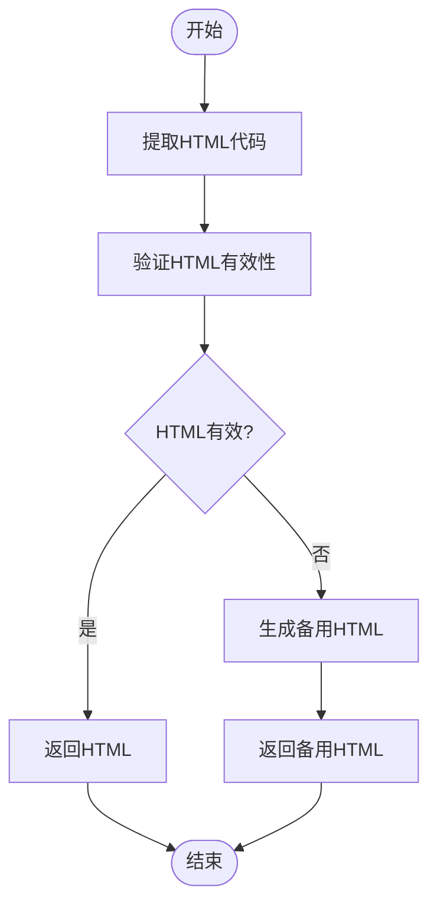
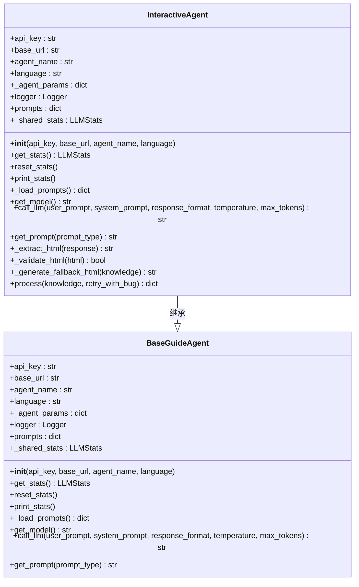
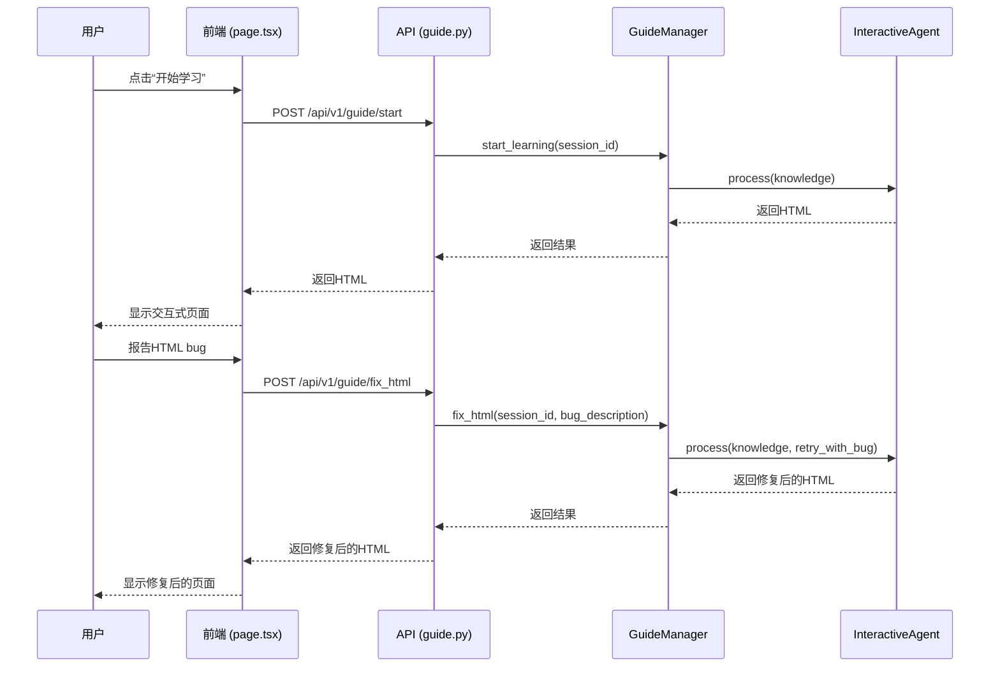

# 交互式页面代理

<cite>
**本文档引用的文件**   
- [interactive_agent.py](file://src/agents/guide/agents/interactive_agent.py)
- [base_guide_agent.py](file://src/agents/guide/agents/base_guide_agent.py)
- [guide_manager.py](file://src/agents/guide/guide_manager.py)
- [guide.py](file://src/api/routers/guide.py)
- [page.tsx](file://web/app/guide/page.tsx)
- [locate_agent.py](file://src/agents/guide/agents/locate_agent.py)
- [main.yaml](file://config/main.yaml)
- [agents.yaml](file://config/agents.yaml)
- [interactive_agent.yaml](file://src/agents/guide/prompts/zh/interactive_agent.yaml)
</cite>

## 目录
1. [简介](#简介)
2. [核心实现细节](#核心实现细节)
3. [配置选项与参数](#配置选项与参数)
4. [与其他组件的关系](#与其他组件的关系)
5. [常见问题及解决方案](#常见问题及解决方案)
6. [总结](#总结)

## 简介

交互式页面代理是DeepTutor系统中的一个关键组件，其主要职责是将知识要点转换为可视化、可交互的学习页面。该代理通过调用大语言模型（LLM）生成包含HTML、CSS和JavaScript的完整网页，使用户能够通过与页面的交互来理解和掌握知识。整个流程从用户选择笔记记录开始，经过知识要点提取、交互式页面生成，最终在前端展示给用户。

**Section sources**
- [interactive_agent.py](file://src/agents/guide/agents/interactive_agent.py#L1-L211)
- [guide_manager.py](file://src/agents/guide/guide_manager.py#L1-L475)

## 核心实现细节

交互式页面代理的核心功能由`InteractiveAgent`类实现，该类继承自`BaseGuideAgent`。其主要方法包括`_extract_html`、`_validate_html`和`_generate_fallback_html`，这些方法共同确保生成的HTML页面既有效又美观。

### HTML提取与验证

`_extract_html`方法负责从LLM的响应中提取HTML代码。它使用正则表达式匹配包含在```html```代码块中的内容，如果未找到，则尝试匹配普通的代码块，并检查内容是否以`<!DOCTYPE`或`<html`开头。如果这些条件都不满足，则返回原始响应的去空格版本。

`_validate_html`方法用于验证提取的HTML是否基本有效。它检查HTML内容中是否包含`<html`、`<!doctype`、`<body`或`<div`等标签，以确保生成的页面具有基本的HTML结构。



**Diagram sources**
- [interactive_agent.py](file://src/agents/guide/agents/interactive_agent.py#L21-L47)

### 备用HTML生成

当HTML验证失败或发生异常时，`_generate_fallback_html`方法会生成一个备用的HTML页面。该页面包含知识要点的标题、摘要和用户可能遇到的困难点，并使用现代化的设计风格确保页面美观且易于理解。

**Section sources**
- [interactive_agent.py](file://src/agents/guide/agents/interactive_agent.py#L49-L141)

## 配置选项与参数

交互式页面代理的配置选项和参数主要通过`agents.yaml`和`main.yaml`文件进行管理。`agents.yaml`文件定义了不同模块的统一参数，如温度（temperature）和最大令牌数（max_tokens）。对于`guide`模块，温度设置为0.5，最大令牌数设置为8192。

`main.yaml`文件则包含了系统的全局配置，如语言设置、数据目录路径等。例如，`system.language`字段定义了系统的默认语言，而`paths.guide_output_dir`字段指定了引导学习模块的输出目录。

`InteractiveAgent`的`process`方法接受两个主要参数：`knowledge`和`retry_with_bug`。`knowledge`参数是一个字典，包含知识要点的标题、摘要和用户可能遇到的困难点。`retry_with_bug`参数用于处理前端的bug修复请求，当该参数提供时，代理会根据描述的bug重新生成HTML页面。



**Diagram sources**
- [interactive_agent.py](file://src/agents/guide/agents/interactive_agent.py#L13-L211)
- [base_guide_agent.py](file://src/agents/guide/agents/base_guide_agent.py#L21-L176)

## 与其他组件的关系

交互式页面代理与其他组件的关系主要体现在其与前端和后端API的交互上。前端通过`page.tsx`文件中的React组件与用户进行交互，当用户点击“开始学习”按钮时，前端会调用`/api/v1/guide/start` API端点，触发`InteractiveAgent`生成交互式页面。

后端API通过`guide.py`文件中的FastAPI路由处理这些请求。`GuideManager`类负责管理学习会话的生命周期，包括创建会话、启动学习、获取下一个知识点、聊天交互和修复HTML页面。当用户报告HTML页面存在bug时，前端会调用`/api/v1/guide/fix_html` API端点，`GuideManager`会调用`InteractiveAgent`的`process`方法，并传入`retry_with_bug`参数，以重新生成修复后的HTML页面。



**Diagram sources**
- [page.tsx](file://web/app/guide/page.tsx#L1-L1444)
- [guide.py](file://src/api/routers/guide.py#L1-L337)
- [guide_manager.py](file://src/agents/guide/guide_manager.py#L1-L475)

## 常见问题及解决方案

在使用交互式页面代理时，可能会遇到一些常见问题，如HTML提取失败或验证失败。以下是一些常见问题及其解决方案：

### HTML提取失败

**问题描述**：LLM的响应中没有包含有效的HTML代码块，导致`_extract_html`方法无法提取HTML。

**解决方案**：
1. 检查LLM的提示模板，确保其明确要求生成HTML代码。
2. 在`interactive_agent.yaml`文件中，确认`system`和`user_template`提示是否正确配置。
3. 如果问题持续存在，可以考虑增加日志记录，以便更好地调试问题。

### HTML验证失败

**问题描述**：提取的HTML代码缺少必要的标签，导致`_validate_html`方法返回`False`。

**解决方案**：
1. 确保LLM生成的HTML包含`<html`、`<!doctype`、`<body`或`<div`等基本标签。
2. 使用`_generate_fallback_html`方法作为备用方案，确保即使主HTML生成失败，用户仍能看到一个基本的页面。
3. 在前端增加错误处理逻辑，当接收到备用HTML时，提示用户页面可能不完整。

### 前端交互失败

**问题描述**：生成的HTML页面中的JavaScript代码无法正常工作，导致交互功能失效。

**解决方案**：
1. 确保JavaScript代码在`DOMContentLoaded`事件后执行，避免DOM未加载完成就尝试绑定事件监听器。
2. 在`interactive_agent.yaml`文件中，确认交互功能实现要求是否正确配置。
3. 使用浏览器的开发者工具检查JavaScript错误，并根据错误信息进行修复。

**Section sources**
- [interactive_agent.py](file://src/agents/guide/agents/interactive_agent.py#L21-L141)
- [interactive_agent.yaml](file://src/agents/guide/prompts/zh/interactive_agent.yaml#L1-L627)

## 总结

交互式页面代理是DeepTutor系统中实现知识可视化和交互式学习的关键组件。通过深入分析其核心实现细节、配置选项、与其他组件的关系以及常见问题的解决方案，我们可以更好地理解其工作原理，并为用户提供更加高效和直观的学习体验。无论是初学者还是经验丰富的开发者，都可以通过本文档获得足够的技术深度和实用指导。

**Section sources**
- [interactive_agent.py](file://src/agents/guide/agents/interactive_agent.py#L1-L211)
- [guide_manager.py](file://src/agents/guide/guide_manager.py#L1-L475)
- [guide.py](file://src/api/routers/guide.py#L1-L337)