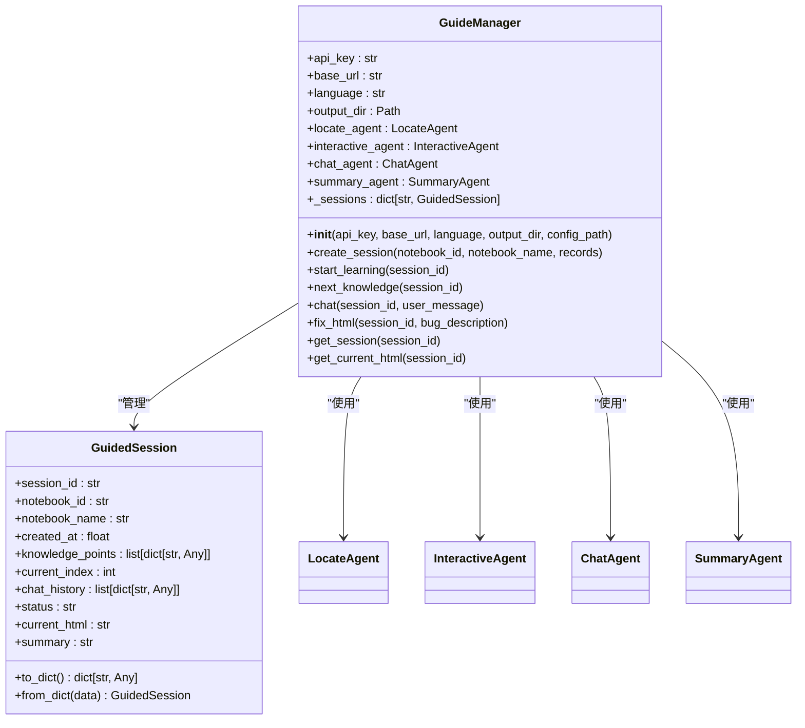
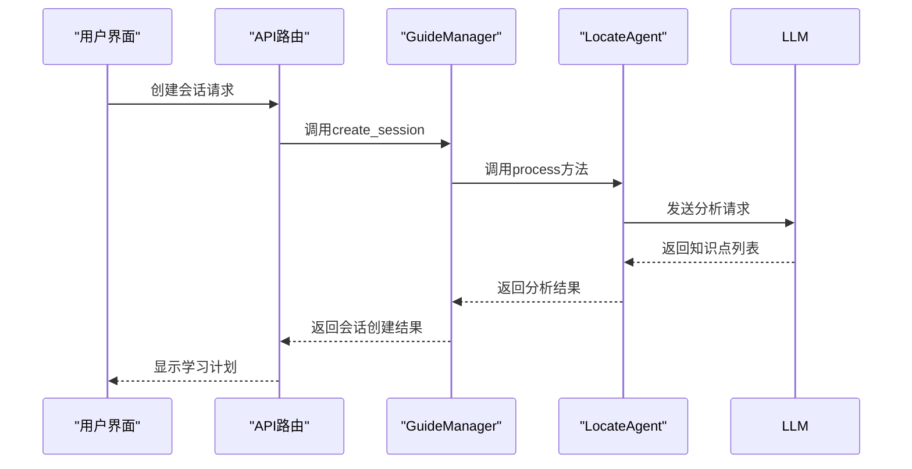
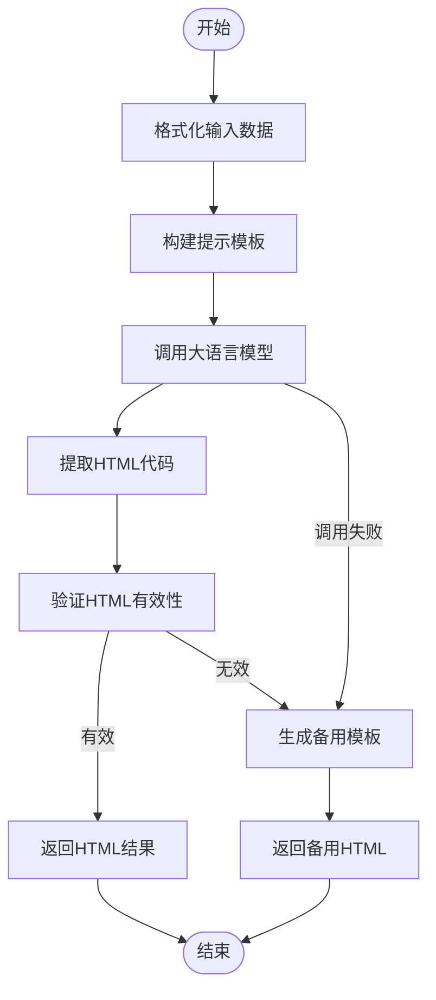
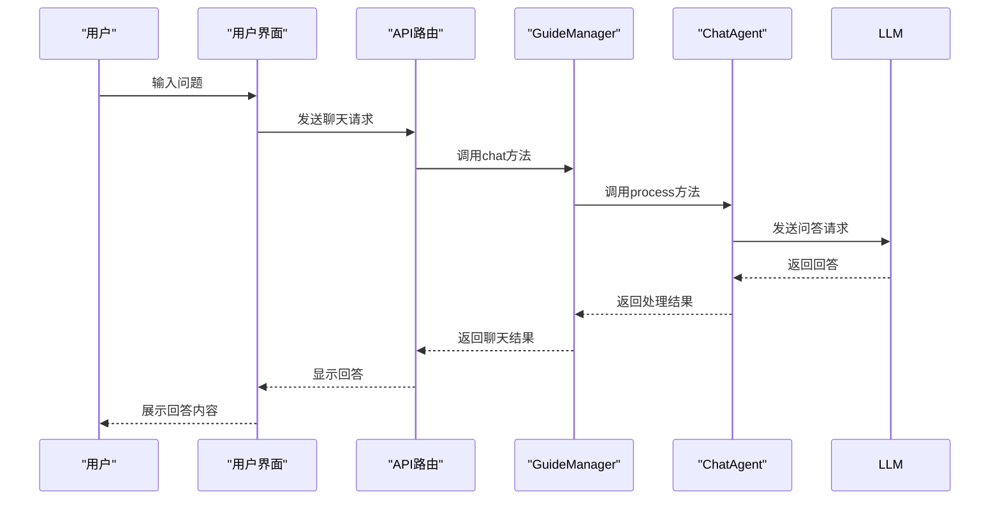
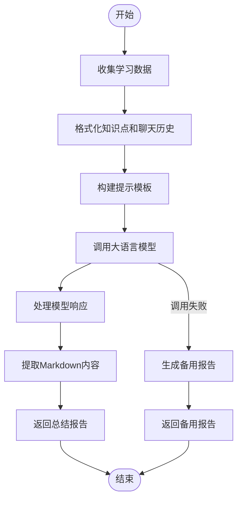
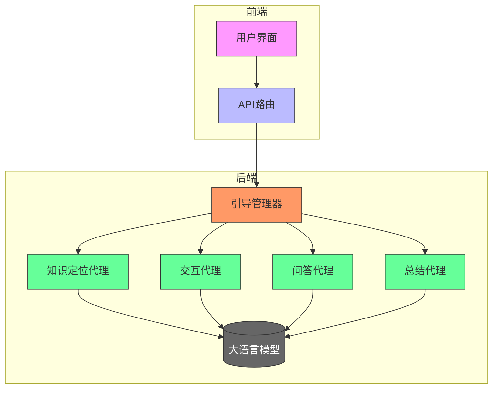

# 引导式学习

<cite>
**本文档中引用的文件**  
- [guide_manager.py](file://src/agents/guide/guide_manager.py)
- [base_guide_agent.py](file://src/agents/guide/agents/base_guide_agent.py)
- [locate_agent.py](file://src/agents/guide/agents/locate_agent.py)
- [interactive_agent.py](file://src/agents/guide/agents/interactive_agent.py)
- [chat_agent.py](file://src/agents/guide/agents/chat_agent.py)
- [summary_agent.py](file://src/agents/guide/agents/summary_agent.py)
- [guide.py](file://src/api/routers/guide.py)
- [page.tsx](file://web/app/guide/page.tsx)
- [locate_agent.yaml](file://src/agents/guide/prompts/zh/locate_agent.yaml)
- [interactive_agent.yaml](file://src/agents/guide/prompts/zh/interactive_agent.yaml)
- [chat_agent.yaml](file://src/agents/guide/prompts/zh/chat_agent.yaml)
- [summary_agent.yaml](file://src/agents/guide/prompts/zh/summary_agent.yaml)
</cite>

## 目录
1. [简介](#简介)
2. [核心组件](#核心组件)
3. [引导管理器](#引导管理器)
4. [知识定位](#知识定位)
5. [交互页面](#交互页面)
6. [问答系统](#问答系统)
7. [学习总结](#学习总结)
8. [配置选项](#配置选项)
9. [常见问题与解决方案](#常见问题与解决方案)
10. [系统架构](#系统架构)

## 简介
引导式学习功能是DeepTutor系统中的核心教学模块，旨在为用户提供个性化的、循序渐进的学习体验。该功能通过分析用户笔记内容，自动识别关键知识点，生成结构化的学习计划，并提供交互式的学习页面和实时问答支持。系统采用模块化设计，由多个专业化的智能代理协同工作，包括知识定位代理、交互页面生成代理、问答代理和总结代理。整个学习流程从创建会话开始，经过知识点学习、交互问答，最终生成个性化的学习总结报告。该功能支持跨笔记学习，能够整合多个笔记中的相关内容，为用户提供全面的知识体系学习路径。

## 核心组件
引导式学习功能由多个核心组件构成，这些组件协同工作以提供完整的教学体验。主要组件包括引导管理器（GuideManager），负责管理学习会话的完整生命周期；知识定位代理（LocateAgent），负责分析笔记内容并识别关键知识点；交互代理（InteractiveAgent），负责将知识点转化为可视化、交互式的学习页面；聊天代理（ChatAgent），负责在学习过程中回答用户问题；以及总结代理（SummaryAgent），负责在学习完成后生成个性化的学习总结报告。这些组件通过清晰的接口进行通信，形成了一个高效的学习支持系统。

**本节来源**
- [guide_manager.py](file://src/agents/guide/guide_manager.py#L1-L475)
- [base_guide_agent.py](file://src/agents/guide/agents/base_guide_agent.py#L1-L176)

## 引导管理器
引导管理器（GuideManager）是引导式学习功能的核心控制器，负责管理学习会话的完整生命周期。它通过`GuidedSession`数据类来表示和管理每个学习会话的状态，包括会话ID、笔记ID、创建时间、知识点列表、当前学习索引、聊天历史、状态和当前HTML页面等内容。引导管理器提供了创建会话、开始学习、进入下一个知识点、聊天交互和修复HTML页面等主要功能。

会话创建过程首先通过`create_session`方法实现，该方法接收笔记ID、笔记名称和记录列表作为参数。管理器会调用知识定位代理分析笔记内容，识别出关键知识点，并创建一个新的`GuidedSession`实例。会话信息会被持久化存储在JSON文件中，以便后续恢复。学习过程通过`start_learning`和`next_knowledge`方法控制，前者启动第一个知识点的学习，后者移动到下一个知识点。当所有知识点学习完成后，系统会自动调用总结代理生成学习总结报告。

**图表来源**
- [guide_manager.py](file://src/agents/guide/guide_manager.py#L21-L475)

**本节来源**
- [guide_manager.py](file://src/agents/guide/guide_manager.py#L44-L475)

## 知识定位
知识定位功能由`LocateAgent`类实现，其主要职责是分析用户笔记内容，识别出关键知识点，并生成结构化的学习计划。该代理继承自`BaseGuideAgent`，利用大语言模型的强大分析能力来理解笔记中的知识体系。`LocateAgent`通过`process`方法接收笔记ID、笔记名称和记录列表作为输入，然后调用预定义的提示模板来指导模型分析内容。

在处理过程中，代理首先将笔记记录格式化为易于理解的文本格式，包括记录序号、类型、标题、用户问题和系统输出等内容。然后，它使用系统提示和用户提示模板构建完整的请求，发送给大语言模型。系统提示中定义了代理的角色定位、核心原则、知识点数量决策规则、分析维度和输出格式等关键信息。模型返回的响应会被解析为JSON格式，提取出知识点标题、内容摘要和用户可能遇到的困难等信息。为了确保数据质量，代理会对提取的知识点进行验证和规范化处理。

**图表来源**
- [locate_agent.py](file://src/agents/guide/agents/locate_agent.py#L13-L137)
- [guide_manager.py](file://src/agents/guide/guide_manager.py#L149-L203)

**本节来源**
- [locate_agent.py](file://src/agents/guide/agents/locate_agent.py#L13-L137)
- [locate_agent.yaml](file://src/agents/guide/prompts/zh/locate_agent.yaml#L1-L69)

## 交互页面
交互页面功能由`InteractiveAgent`类实现，其主要职责是将抽象的知识点转化为可视化、交互式的学习页面。该代理继承自`BaseGuideAgent`，利用大语言模型的代码生成能力来创建完整的HTML页面。`InteractiveAgent`通过`process`方法接收知识点信息作为输入，然后生成相应的HTML代码。

在生成过程中，代理首先构建系统提示和用户提示，指导模型创建符合要求的HTML页面。系统提示中详细定义了设计原则、容器约束、技术要求、交互功能实现规则、设计风格和LaTeX公式支持等关键信息。生成的HTML页面必须是完整的、可独立运行的文件，包含内联的CSS样式和JavaScript代码，不依赖任何外部资源。为了确保页面在不同尺寸的容器中都能正常显示，提示中特别强调了响应式设计的要求，包括使用相对单位、最大宽度限制和盒模型设置等。

当用户报告页面存在bug时，代理可以通过`retry_with_bug`参数接收bug描述，并重新生成修复后的页面。为了应对可能的生成失败情况，代理还实现了备用HTML模板生成机制。该模板包含基本的CSS样式和KaTeX数学公式支持，确保即使在主生成过程失败时，用户也能获得一个可用的学习页面。

**图表来源**
- [interactive_agent.py](file://src/agents/guide/agents/interactive_agent.py#L13-L211)
- [interactive_agent.yaml](file://src/agents/guide/prompts/zh/interactive_agent.yaml#L1-L203)

**本节来源**
- [interactive_agent.py](file://src/agents/guide/agents/interactive_agent.py#L13-L211)
- [interactive_agent.yaml](file://src/agents/guide/prompts/zh/interactive_agent.yaml#L1-L203)

## 问答系统
问答系统由`ChatAgent`类实现，其主要职责是在学习过程中回答用户的问题，解决用户的疑惑。该代理继承自`BaseGuideAgent`，专注于特定知识点的深入解释和答疑。`ChatAgent`通过`process`方法接收当前知识点信息、聊天历史和用户问题作为输入，然后生成相应的回答。

在处理过程中，代理首先将聊天历史格式化为易于理解的文本格式，仅保留最近的10条消息以控制上下文长度。然后，它使用系统提示和用户提示模板构建完整的请求，发送给大语言模型。系统提示中定义了代理的角色定位、核心原则、回答风格和输出格式等关键信息。模型返回的响应会直接作为回答返回给用户。

问答系统的设计原则包括：聚焦当前知识点，确保回答与当前学习内容相关；采用渐进式解释，根据用户问题的深度提供相应层次的解释；鼓励思考，不仅提供答案，还引导用户进行深入思考；针对用户可能遇到的困难，主动提供相关的澄清和解释。这些原则确保了问答系统能够有效地支持用户的学习过程。

**图表来源**
- [chat_agent.py](file://src/agents/guide/agents/chat_agent.py#L12-L92)
- [guide_manager.py](file://src/agents/guide/guide_manager.py#L381-L434)

**本节来源**
- [chat_agent.py](file://src/agents/guide/agents/chat_agent.py#L12-L92)
- [chat_agent.yaml](file://src/agents/guide/prompts/zh/chat_agent.yaml#L1-L42)

## 学习总结
学习总结功能由`SummaryAgent`类实现，其主要职责是在用户完成所有知识点学习后，生成个性化的学习总结报告。该代理继承自`BaseGuideAgent`，利用大语言模型的分析能力来综合评估用户的学习过程和成果。`SummaryAgent`通过`process`方法接收笔记名称、知识点列表和聊天历史作为输入，然后生成相应的总结报告。

总结报告的内容包括学习内容回顾、学习过程分析、掌握程度评估和后续学习建议等维度。报告强调具体化、数据驱动、个性化和可操作性，避免使用模糊的评价。例如，在学习内容回顾部分，必须具体列出每个知识点的标题和核心内容；在学习过程分析部分，必须引用用户的具体问题内容；在掌握程度评估部分，必须基于实际的交互情况提供具体证据；在后续学习建议部分，必须提供具体、可执行的建议。

系统提示中详细定义了报告的结构和内容要求，包括学习概述、知识点回顾、学习互动分析、掌握评估和后续学习建议等部分。报告采用Markdown格式输出，具有清晰的结构和重点突出的排版。这种个性化的总结报告不仅帮助用户回顾学习成果，还为后续的学习提供了明确的方向和建议。

**图表来源**
- [summary_agent.py](file://src/agents/guide/agents/summary_agent.py#L12-L138)
- [summary_agent.yaml](file://src/agents/guide/prompts/zh/summary_agent.yaml#L1-L158)

**本节来源**
- [summary_agent.py](file://src/agents/guide/agents/summary_agent.py#L12-L138)
- [summary_agent.yaml](file://src/agents/guide/prompts/zh/summary_agent.yaml#L1-L158)

## 配置选项
引导式学习功能提供了多种配置选项，以支持不同场景下的使用需求。主要配置通过`config/main.yaml`和`config/agents.yaml`两个配置文件进行管理。在`guide_manager.py`的初始化方法中，用户可以指定API密钥、API基础URL、语言设置、输出目录和配置文件路径等参数。

语言设置可以通过`language`参数指定，支持中文（zh）和英文（en）两种语言。如果未指定，系统会从主配置文件中读取默认语言设置。输出目录可以通过`output_dir`参数指定，用于存储学习会话的持久化数据。如果未指定，系统会使用配置文件中的默认路径或回退到项目根目录下的默认路径。

代理的参数配置主要在`agents.yaml`文件中定义，包括温度（temperature）和最大令牌数（max_tokens）等LLM参数。这些参数会被`BaseGuideAgent`类读取并应用于所有引导式学习代理。此外，每个代理的提示模板存储在`src/agents/guide/prompts/`目录下，按语言和代理类型组织，允许用户根据需要自定义提示内容。

**本节来源**
- [guide_manager.py](file://src/agents/guide/guide_manager.py#L47-L115)
- [base_guide_agent.py](file://src/agents/guide/agents/base_guide_agent.py#L42-L44)

## 常见问题与解决方案
在使用引导式学习功能时，用户可能会遇到一些常见问题。以下是这些问题及其解决方案：

**问题1：创建会话失败，提示"Failed to analyze knowledge points"**
- **原因**：知识定位代理未能成功分析笔记内容。
- **解决方案**：检查笔记内容是否为空或过于简单；确保API连接正常；检查`locate_agent.yaml`提示文件是否存在且格式正确。

**问题2：交互页面无法显示或显示异常**
- **原因**：生成的HTML代码存在语法错误或不符合容器约束。
- **解决方案**：使用"修复HTML"功能，提供具体的bug描述；检查HTML代码是否包含外部资源引用；确保HTML代码符合响应式设计要求。

**问题3：问答功能无响应或回答质量差**
- **原因**：聊天代理的提示模板配置不当或LLM调用失败。
- **解决方案**：检查`chat_agent.yaml`提示文件是否正确配置；确保API密钥和基础URL设置正确；检查网络连接是否正常。

**问题4：学习总结报告内容模糊或不具体**
- **原因**：总结代理的提示模板要求不够严格或模型理解偏差。
- **解决方案**：检查`summary_agent.yaml`提示文件中的具体化要求；确保聊天历史和知识点信息完整；考虑调整LLM参数以提高输出质量。

**问题5：跨笔记学习功能无法使用**
- **原因**：前端界面未正确传递多个笔记的记录数据。
- **解决方案**：检查前端`page.tsx`文件中的多笔记选择逻辑；确保API路由正确处理`records`参数；验证后端`create_session`方法是否支持跨笔记模式。

**本节来源**
- [guide_manager.py](file://src/agents/guide/guide_manager.py#L169-L183)
- [interactive_agent.py](file://src/agents/guide/agents/interactive_agent.py#L191-L210)
- [chat_agent.py](file://src/agents/guide/agents/chat_agent.py#L86-L91)
- [summary_agent.py](file://src/agents/guide/agents/summary_agent.py#L123-L137)
- [page.tsx](file://web/app/guide/page.tsx#L391-L481)

## 系统架构
引导式学习功能的系统架构采用分层设计，由前端界面、API路由、引导管理器和多个专业代理组成。前端界面使用React构建，通过API与后端通信。API路由提供RESTful接口和WebSocket接口，处理各种学习操作请求。引导管理器作为核心控制器，协调各个代理的工作流程。各个代理则专注于特定任务，如知识定位、交互页面生成、问答和总结。

系统采用模块化设计，各组件之间通过清晰的接口进行通信。数据流从用户界面开始，经过API路由传递到引导管理器，再由管理器调用相应的代理处理。处理结果沿相反路径返回，最终展示给用户。这种架构设计使得系统具有良好的可维护性和可扩展性，每个组件都可以独立开发和测试。

**图表来源**
- [guide.py](file://src/api/routers/guide.py#L25-L337)
- [guide_manager.py](file://src/agents/guide/guide_manager.py#L44-L475)
- [page.tsx](file://web/app/guide/page.tsx#L77-L800)

**本节来源**
- [guide.py](file://src/api/routers/guide.py#L25-L337)
- [guide_manager.py](file://src/agents/guide/guide_manager.py#L44-L475)
- [page.tsx](file://web/app/guide/page.tsx#L77-L800)