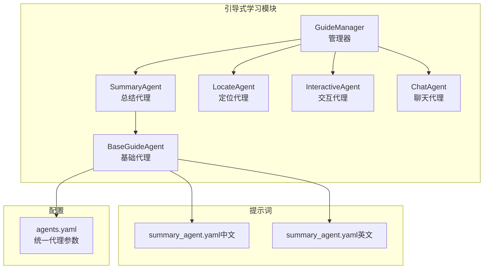
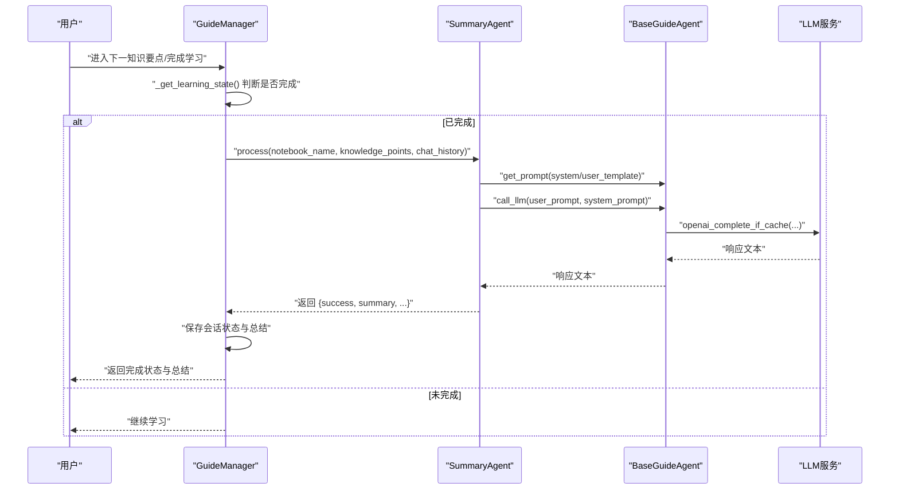
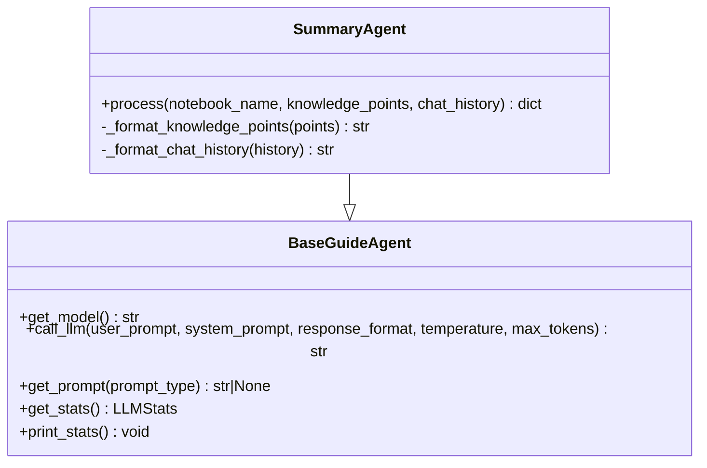
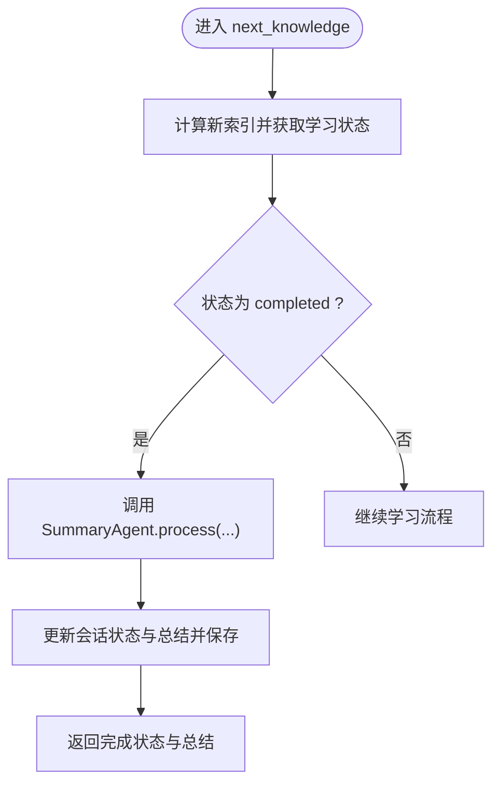
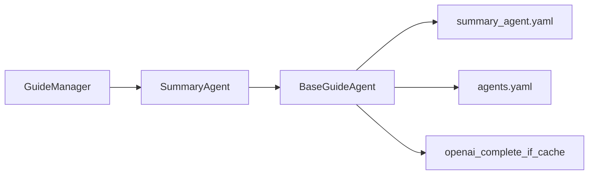

# 总结代理

<cite>
**本文引用的文件列表**
- [summary_agent.py](file://src/agents/guide/agents/summary_agent.py)
- [guide_manager.py](file://src/agents/guide/guide_manager.py)
- [base_guide_agent.py](file://src/agents/guide/agents/base_guide_agent.py)
- [summary_agent.yaml（中文）](file://src/agents/guide/prompts/zh/summary_agent.yaml)
- [summary_agent.yaml（英文）](file://src/agents/guide/prompts/en/summary_agent.yaml)
- [agents.yaml](file://config/agents.yaml)
</cite>

## 目录
1. [简介](#简介)
2. [项目结构](#项目结构)
3. [核心组件](#核心组件)
4. [架构总览](#架构总览)
5. [详细组件分析](#详细组件分析)
6. [依赖关系分析](#依赖关系分析)
7. [性能考量](#性能考量)
8. [故障排查指南](#故障排查指南)
9. [结论](#结论)

## 简介
本节介绍“总结代理”的目标与价值：在学习会话结束后，基于用户的学习笔记名、知识要点列表与完整对话历史，生成一份结构化、可读性强且具备个性化洞察的学习总结报告。该报告面向初学者友好，同时为有经验的开发者提供足够的技术细节与扩展路径。

## 项目结构
“总结代理”属于“引导式学习”模块，位于 guide 子模块下，与“定位代理”“交互代理”“聊天代理”共同构成完整的引导式学习流水线。其核心文件与关系如下图所示：

图表来源
- [guide_manager.py](file://src/agents/guide/guide_manager.py#L1-L120)
- [summary_agent.py](file://src/agents/guide/agents/summary_agent.py#L1-L40)
- [base_guide_agent.py](file://src/agents/guide/agents/base_guide_agent.py#L1-L60)
- [summary_agent.yaml（中文）](file://src/agents/guide/prompts/zh/summary_agent.yaml#L1-L40)
- [summary_agent.yaml（英文）](file://src/agents/guide/prompts/en/summary_agent.yaml#L1-L40)
- [agents.yaml](file://config/agents.yaml#L28-L33)

章节来源
- [guide_manager.py](file://src/agents/guide/guide_manager.py#L1-L120)
- [summary_agent.py](file://src/agents/guide/agents/summary_agent.py#L1-L40)
- [base_guide_agent.py](file://src/agents/guide/agents/base_guide_agent.py#L1-L60)

## 核心组件
- SummaryAgent：负责将知识要点与对话历史转化为可读的总结报告。其 process 方法接收 notebook_name、knowledge_points、chat_history 三个参数，返回包含 success、summary、notebook_name、total_points、total_interactions 的字典；若异常则回退到一个结构化的“概览式”总结。
- GuideManager：在学习会话完成时调用 SummaryAgent 生成最终总结，并更新会话状态与持久化存储。
- BaseGuideAgent：提供统一的提示词加载、LLM 调用接口与日志统计能力，SummaryAgent 继承自该基类。
- 提示词文件：包含 system 与 user_template，定义总结维度、输出格式与结构要求。
- 统一代理参数：agents.yaml 中的 temperature 与 max_tokens 影响 LLM 调用行为。

章节来源
- [summary_agent.py](file://src/agents/guide/agents/summary_agent.py#L61-L138)
- [guide_manager.py](file://src/agents/guide/guide_manager.py#L314-L348)
- [base_guide_agent.py](file://src/agents/guide/agents/base_guide_agent.py#L78-L176)
- [summary_agent.yaml（中文）](file://src/agents/guide/prompts/zh/summary_agent.yaml#L1-L158)
- [summary_agent.yaml（英文）](file://src/agents/guide/prompts/en/summary_agent.yaml#L1-L158)
- [agents.yaml](file://config/agents.yaml#L28-L33)

## 架构总览
下图展示了从会话完成到生成总结的关键流程，以及各组件间的调用关系：

图表来源
- [guide_manager.py](file://src/agents/guide/guide_manager.py#L314-L348)
- [summary_agent.py](file://src/agents/guide/agents/summary_agent.py#L61-L138)
- [base_guide_agent.py](file://src/agents/guide/agents/base_guide_agent.py#L113-L166)

章节来源
- [guide_manager.py](file://src/agents/guide/guide_manager.py#L314-L348)
- [summary_agent.py](file://src/agents/guide/agents/summary_agent.py#L61-L138)
- [base_guide_agent.py](file://src/agents/guide/agents/base_guide_agent.py#L113-L166)

## 详细组件分析

### SummaryAgent 类与 process 方法
- 继承关系：SummaryAgent 继承自 BaseGuideAgent，复用统一的提示词加载与 LLM 调用能力。
- 参数与返回值：
  - 输入参数
    - notebook_name: 字符串，学习笔记名称
    - knowledge_points: 列表，元素为字典，包含 knowledge_title、knowledge_summary、user_difficulty 等字段
    - chat_history: 列表，元素为字典，包含 role、content、knowledge_index、timestamp 等字段
  - 返回值：字典，包含 success、summary、notebook_name、total_points、total_interactions；异常时返回 success=False 并附带 error，同时提供一个“概览式”总结作为兜底
- 关键处理逻辑
  - 提示词加载：通过 get_prompt 获取 system 与 user_template；若缺失则抛出异常
  - 数据格式化
    - _format_knowledge_points：将知识要点列表格式化为 Markdown 片段
    - _format_chat_history：按知识要点索引分段展示用户问题与助手回答，无历史时返回提示语
  - LLM 调用：使用 call_llm 发送 user_prompt 与 system_prompt，得到响应文本
  - 响应清洗：去除可能的 Markdown 包裹标记，确保输出为纯 Markdown 文本
  - 错误回退：捕获异常后返回包含概览信息的兜底总结

图表来源
- [base_guide_agent.py](file://src/agents/guide/agents/base_guide_agent.py#L106-L176)
- [summary_agent.py](file://src/agents/guide/agents/summary_agent.py#L1-L60)

章节来源
- [summary_agent.py](file://src/agents/guide/agents/summary_agent.py#L61-L138)

### 提示词与输出规范
- system：定义角色定位、核心原则、总结维度、报告风格与结构要求，强调“具体化优先”“数据驱动”“个性化”“可操作性”，并明确输出为可直接渲染的 Markdown 文本。
- user_template：包含学习计划概览、所有知识点、完整对话历史与任务要求，约束输出格式与内容具体性。
- 输出格式：直接输出 Markdown 文本，不包裹代码块；所有分析必须基于实际数据，避免空泛表述。

章节来源
- [summary_agent.yaml（中文）](file://src/agents/guide/prompts/zh/summary_agent.yaml#L1-L158)
- [summary_agent.yaml（英文）](file://src/agents/guide/prompts/en/summary_agent.yaml#L1-L158)

### 与 GuideManager 的集成
- 会话完成判定：next_knowledge 中根据当前索引与知识要点总数判断是否完成
- 生成总结：当状态为 completed 时，调用 SummaryAgent.process(notebook_name, knowledge_points, chat_history)
- 更新会话：写入 summary、更新状态为 completed，并追加一条系统消息
- 持久化：保存会话至文件，便于后续查询

图表来源
- [guide_manager.py](file://src/agents/guide/guide_manager.py#L314-L348)

章节来源
- [guide_manager.py](file://src/agents/guide/guide_manager.py#L314-L348)

### 统一代理参数与 LLM 调用
- 统一参数：agents.yaml 中 guide 模块的 temperature 与 max_tokens 用于控制 LLM 行为
- LLM 调用：BaseGuideAgent.call_llm 封装 openai_complete_if_cache，自动注入模型名、温度、最大 token 数等参数，并记录统计信息

章节来源
- [agents.yaml](file://config/agents.yaml#L28-L33)
- [base_guide_agent.py](file://src/agents/guide/agents/base_guide_agent.py#L113-L166)

## 依赖关系分析
- 组件耦合
  - SummaryAgent 依赖 BaseGuideAgent 的提示词加载与 LLM 调用能力
  - GuideManager 依赖 SummaryAgent 生成最终总结，并将其写入会话对象
  - 提示词文件与 agents.yaml 为外部依赖，影响输出质量与行为
- 外部依赖
  - LLM 服务：通过 openai_complete_if_cache 调用
  - 日志与统计：LLMStats 记录调用次数、输入/输出 token 与成本
- 循环依赖
  - 无循环依赖，组件间单向调用

图表来源
- [summary_agent.py](file://src/agents/guide/agents/summary_agent.py#L1-L40)
- [base_guide_agent.py](file://src/agents/guide/agents/base_guide_agent.py#L113-L166)
- [guide_manager.py](file://src/agents/guide/guide_manager.py#L314-L348)
- [summary_agent.yaml（中文）](file://src/agents/guide/prompts/zh/summary_agent.yaml#L1-L40)
- [agents.yaml](file://config/agents.yaml#L28-L33)

章节来源
- [summary_agent.py](file://src/agents/guide/agents/summary_agent.py#L1-L40)
- [base_guide_agent.py](file://src/agents/guide/agents/base_guide_agent.py#L113-L166)
- [guide_manager.py](file://src/agents/guide/guide_manager.py#L314-L348)

## 性能考量
- 温度与最大 token
  - guide 模块默认 temperature=0.5、max_tokens=8192，适合生成结构化、可读性强的总结
  - 如需更稳定输出，可降低 temperature；如需更长上下文，可适当提高 max_tokens
- Token 统计
  - BaseGuideAgent 内置 LLMStats，可追踪调用次数、输入/输出 token 与成本，便于优化与成本控制
- 响应清洗
  - 自动去除可能的 Markdown 包裹标记，减少前端渲染负担

章节来源
- [agents.yaml](file://config/agents.yaml#L28-L33)
- [base_guide_agent.py](file://src/agents/guide/agents/base_guide_agent.py#L113-L166)

## 故障排查指南
- 缺少提示词
  - 现象：抛出异常，提示缺少 system 或 user_template
  - 处理：确认提示词文件存在且命名正确，语言目录映射正常
  - 参考路径
    - [summary_agent.yaml（中文）](file://src/agents/guide/prompts/zh/summary_agent.yaml#L1-L40)
    - [summary_agent.yaml（英文）](file://src/agents/guide/prompts/en/summary_agent.yaml#L1-L40)
- LLM 调用失败
  - 现象：process 捕获异常并返回兜底总结
  - 处理：检查环境变量 LLM_MODEL 是否设置；查看日志与统计信息；必要时调整 temperature 与 max_tokens
  - 参考路径
    - [base_guide_agent.py](file://src/agents/guide/agents/base_guide_agent.py#L106-L120)
    - [base_guide_agent.py](file://src/agents/guide/agents/base_guide_agent.py#L113-L166)
- 总结内容不完整或格式错误
  - 现象：输出被包裹在代码块中或缺少结构化内容
  - 处理：确认提示词要求输出纯 Markdown 文本；检查知识要点与对话历史是否为空；必要时在上游补全数据
  - 参考路径
    - [summary_agent.py](file://src/agents/guide/agents/summary_agent.py#L90-L138)
    - [summary_agent.yaml（中文）](file://src/agents/guide/prompts/zh/summary_agent.yaml#L40-L98)
    - [summary_agent.yaml（英文）](file://src/agents/guide/prompts/en/summary_agent.yaml#L37-L99)
- 会话未完成即生成总结
  - 现象：next_knowledge 未触发 completed 分支
  - 处理：确保当前索引等于知识要点总数减一后再调用；检查会话状态与持久化逻辑
  - 参考路径
    - [guide_manager.py](file://src/agents/guide/guide_manager.py#L205-L249)
    - [guide_manager.py](file://src/agents/guide/guide_manager.py#L314-L348)

## 结论
“总结代理”通过标准化的提示词与统一的 LLM 调用接口，将学习笔记名、知识要点与对话历史转化为高质量的个性化总结报告。其与 GuideManager 的紧密集成确保在会话完成时自动产出总结并持久化。对于初学者，报告结构清晰、语言友好；对于开发者，提供了可配置的参数、完善的错误回退与可观测性支持，便于扩展与优化。