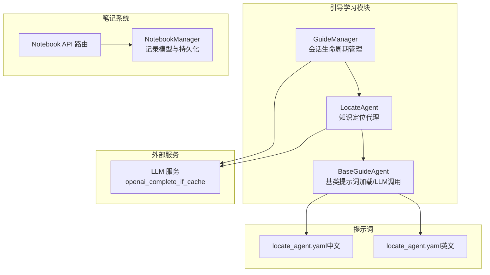
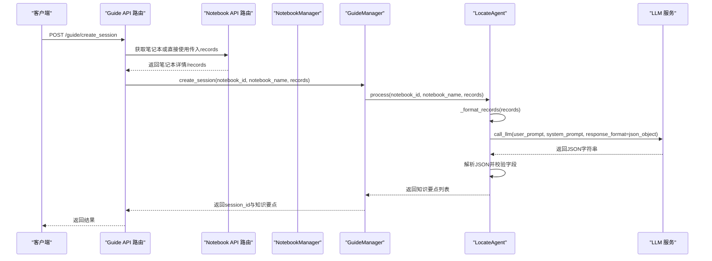
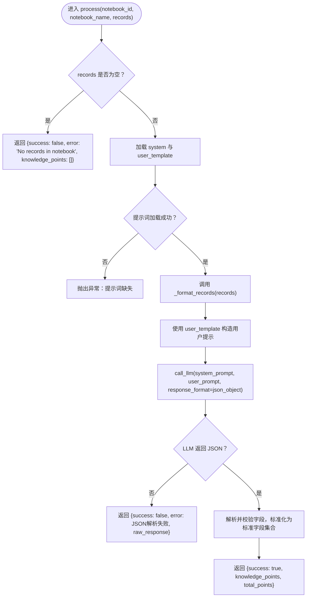
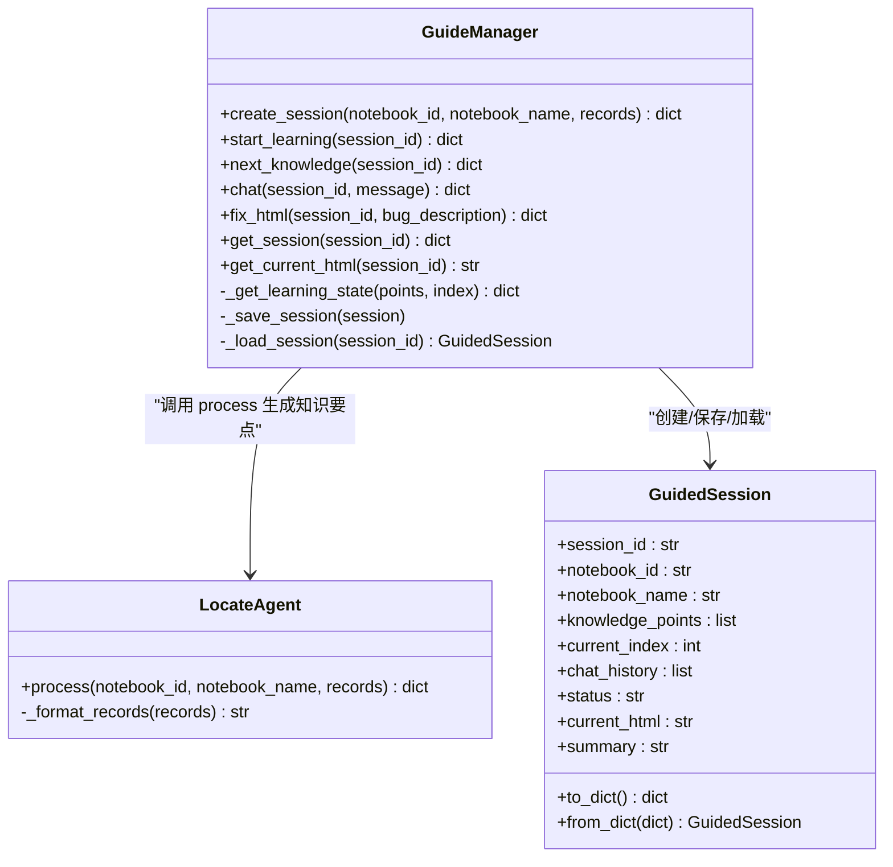
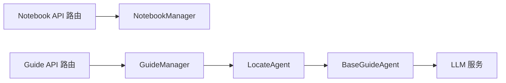

# 知识定位代理

<cite>
**本文引用的文件列表**
- [locate_agent.py](file://src/agents/guide/agents/locate_agent.py)
- [guide_manager.py](file://src/agents/guide/guide_manager.py)
- [base_guide_agent.py](file://src/agents/guide/agents/base_guide_agent.py)
- [locate_agent.yaml（中文）](file://src/agents/guide/prompts/zh/locate_agent.yaml)
- [locate_agent.yaml（英文）](file://src/agents/guide/prompts/en/locate_agent.yaml)
- [notebook_manager.py](file://src/api/utils/notebook_manager.py)
- [notebook.py](file://src/api/routers/notebook.py)
- [guide.py](file://src/api/routers/guide.py)
</cite>

## 目录
1. [简介](#简介)
2. [项目结构](#项目结构)
3. [核心组件](#核心组件)
4. [架构总览](#架构总览)
5. [详细组件分析](#详细组件分析)
6. [依赖关系分析](#依赖关系分析)
7. [性能考量](#性能考量)
8. [故障排查指南](#故障排查指南)
9. [结论](#结论)
10. [附录](#附录)

## 简介
知识定位代理（LocateAgent）负责分析用户笔记本中的学习记录，生成“渐进式知识学习计划”。它通过统一的提示词模板和LLM调用，将原始记录转换为结构化的知识要点列表，供后续交互式学习与总结环节使用。本文将深入解析其实现细节，包括输入数据结构、处理流程、错误处理、与GuideManager的协作关系，以及常见问题的诊断与修复建议。

## 项目结构
知识定位代理位于引导学习模块中，与笔记管理、API路由、提示词配置共同构成完整的“从笔记到学习计划”的流水线。

图表来源
- [guide_manager.py](file://src/agents/guide/guide_manager.py#L1-L120)
- [locate_agent.py](file://src/agents/guide/agents/locate_agent.py#L1-L137)
- [base_guide_agent.py](file://src/agents/guide/agents/base_guide_agent.py#L1-L176)
- [notebook_manager.py](file://src/api/utils/notebook_manager.py#L1-L120)
- [notebook.py](file://src/api/routers/notebook.py#L1-L120)
- [locate_agent.yaml（中文）](file://src/agents/guide/prompts/zh/locate_agent.yaml#L1-L69)
- [locate_agent.yaml（英文）](file://src/agents/guide/prompts/en/locate_agent.yaml#L1-L69)

章节来源
- [guide_manager.py](file://src/agents/guide/guide_manager.py#L1-L120)
- [locate_agent.py](file://src/agents/guide/agents/locate_agent.py#L1-L137)
- [base_guide_agent.py](file://src/agents/guide/agents/base_guide_agent.py#L1-L176)
- [notebook_manager.py](file://src/api/utils/notebook_manager.py#L1-L120)
- [notebook.py](file://src/api/routers/notebook.py#L1-L120)
- [locate_agent.yaml（中文）](file://src/agents/guide/prompts/zh/locate_agent.yaml#L1-L69)
- [locate_agent.yaml（英文）](file://src/agents/guide/prompts/en/locate_agent.yaml#L1-L69)

## 核心组件
- 知识定位代理（LocateAgent）
  - 负责将笔记本记录格式化为可读文本，并构造用户提示词，调用LLM生成知识要点列表。
  - 提供process方法，接收notebook_id、notebook_name、records三个参数，返回包含success、error、knowledge_points等字段的结果。
- 引导学习管理器（GuideManager）
  - 负责创建学习会话、推进学习进度、维护会话状态与持久化。
  - 在创建会话时调用LocateAgent的process以生成知识要点列表。
- 基类（BaseGuideAgent）
  - 统一加载提示词、封装LLM调用接口、统计Token用量。
- 笔记本管理器（NotebookManager）
  - 定义记录模型NotebookRecord，提供增删查改与统计功能。
- API路由
  - Notebook API：提供笔记本与记录的CRUD能力。
  - Guide API：提供创建会话、开始学习、下一知识点、聊天、修复HTML、查询会话等端点。

章节来源
- [locate_agent.py](file://src/agents/guide/agents/locate_agent.py#L1-L137)
- [guide_manager.py](file://src/agents/guide/guide_manager.py#L1-L200)
- [base_guide_agent.py](file://src/agents/guide/agents/base_guide_agent.py#L1-L176)
- [notebook_manager.py](file://src/api/utils/notebook_manager.py#L1-L120)
- [notebook.py](file://src/api/routers/notebook.py#L1-L120)
- [guide.py](file://src/api/routers/guide.py#L80-L140)

## 架构总览
下面的序列图展示了从API请求到生成知识学习计划的整体流程，重点体现LocateAgent与GuideManager的协作。

图表来源
- [guide.py](file://src/api/routers/guide.py#L86-L140)
- [notebook.py](file://src/api/routers/notebook.py#L118-L138)
- [guide_manager.py](file://src/agents/guide/guide_manager.py#L149-L203)
- [locate_agent.py](file://src/agents/guide/agents/locate_agent.py#L48-L137)
- [base_guide_agent.py](file://src/agents/guide/agents/base_guide_agent.py#L113-L166)

## 详细组件分析

### LocateAgent 类与处理流程
- 初始化
  - 继承自BaseGuideAgent，自动加载对应语言的提示词文件（locate_agent.yaml），并具备统一的LLM调用接口。
- 输入参数
  - notebook_id: 笔记本标识符（字符串）
  - notebook_name: 笔记本名称（字符串）
  - records: 笔记本记录列表，每条记录包含以下键：
    - type: 记录类型（如solve、question、research、co_writer）
    - title: 记录标题（字符串）
    - user_query: 用户问题/输入（字符串）
    - output: 系统输出（字符串）
    - 其他元数据（如metadata、kb_name、created_at等）
- 处理流程
  - 参数校验：若records为空，直接返回错误信息。
  - 加载提示词：获取system与user_template；若缺失则抛出异常。
  - 格式化记录：调用_format_records将records转为可读文本，限制单条输出长度，避免LLM上下文溢出。
  - 构造用户提示：使用user_template填充notebook_id、notebook_name、record_count、records_content。
  - LLM调用：以json_object响应格式请求LLM，期望返回JSON数组或对象。
  - 结果解析与校验：支持多种返回结构（数组、含knowledge_points/points/data字段的对象），提取并规范化为标准字段集合。
  - 返回值：包含success、knowledge_points、total_points（可选）、error（可选）等字段。
- 错误处理
  - 记录为空：返回错误与空列表。
  - 提示词缺失：抛出异常，提示缺少system或user_template。
  - JSON解析失败：返回错误并附带原始响应文本。
  - 其他异常：捕获并返回错误信息。

图表来源
- [locate_agent.py](file://src/agents/guide/agents/locate_agent.py#L48-L137)
- [base_guide_agent.py](file://src/agents/guide/agents/base_guide_agent.py#L113-L166)

章节来源
- [locate_agent.py](file://src/agents/guide/agents/locate_agent.py#L1-L137)
- [base_guide_agent.py](file://src/agents/guide/agents/base_guide_agent.py#L78-L176)
- [locate_agent.yaml（中文）](file://src/agents/guide/prompts/zh/locate_agent.yaml#L1-L69)
- [locate_agent.yaml（英文）](file://src/agents/guide/prompts/en/locate_agent.yaml#L1-L69)

### GuideManager 与 LocateAgent 的集成
- 创建会话
  - GuideManager.create_session接收notebook_id、notebook_name、records，内部调用LocateAgent.process生成知识要点。
  - 若LocateAgent返回失败或未识别到知识要点，则返回错误信息。
  - 成功后创建GuidedSession并持久化。
- 学习推进
  - start_learning/next_knowledge等方法基于知识要点列表推进学习进度，与LocateAgent生成的知识点顺序保持一致。
- 会话状态
  - 会话包含当前索引、知识要点列表、聊天历史、HTML页面等，便于前端展示与交互。

图表来源
- [guide_manager.py](file://src/agents/guide/guide_manager.py#L1-L200)
- [locate_agent.py](file://src/agents/guide/agents/locate_agent.py#L1-L137)

章节来源
- [guide_manager.py](file://src/agents/guide/guide_manager.py#L149-L203)
- [guide_manager.py](file://src/agents/guide/guide_manager.py#L205-L380)

### 提示词与输出规范
- 提示词来源
  - locate_agent.yaml（中文/英文）分别定义system与user_template。
  - BaseGuideAgent按语言自动加载对应文件。
- 输出格式
  - system强调“内容驱动”“递进设计”“聚焦难点”“动态粒度”，并给出决策流程与分析维度。
  - user_template包含笔记本信息与记录内容，要求输出JSON数组，包含knowledge_title、knowledge_summary、user_difficulty等字段。
- 字段说明
  - knowledge_title：知识点标题
  - knowledge_summary：知识点摘要（需详尽，包含定义、原理、公式、应用等）
  - user_difficulty：用户可能存在的理解困难（应具体、可操作）

章节来源
- [locate_agent.yaml（中文）](file://src/agents/guide/prompts/zh/locate_agent.yaml#L1-L69)
- [locate_agent.yaml（英文）](file://src/agents/guide/prompts/en/locate_agent.yaml#L1-L69)
- [base_guide_agent.py](file://src/agents/guide/agents/base_guide_agent.py#L78-L105)

### 数据模型与API对接
- 笔记本记录模型
  - NotebookRecord包含id、type、title、user_query、output、metadata、created_at、kb_name等字段。
- API端点
  - Notebook API：提供创建、查询、更新、删除笔记本，以及添加/删除记录等。
  - Guide API：提供创建会话、开始学习、下一知识点、聊天、修复HTML、查询会话等端点。
- 会话创建流程
  - Guide API根据请求选择“跨笔记本模式”（直接传入records）或“单笔记本模式”（通过notebook_id获取records），随后调用GuideManager.create_session。

章节来源
- [notebook_manager.py](file://src/api/utils/notebook_manager.py#L1-L120)
- [notebook.py](file://src/api/routers/notebook.py#L1-L120)
- [guide.py](file://src/api/routers/guide.py#L86-L140)

## 依赖关系分析
- 组件耦合
  - LocateAgent依赖BaseGuideAgent提供的提示词加载与LLM调用接口。
  - GuideManager聚合LocateAgent，并将其作为知识生成阶段的核心。
  - Notebook API与NotebookManager为LocateAgent提供数据输入。
- 外部依赖
  - LLM服务通过openai_complete_if_cache统一调用。
  - 日志与统计通过BaseGuideAgent共享的LLMStats进行追踪。
- 潜在循环依赖
  - 当前结构为单向依赖（GuideManager -> LocateAgent -> BaseGuideAgent），无循环依赖风险。

图表来源
- [guide.py](file://src/api/routers/guide.py#L86-L140)
- [notebook.py](file://src/api/routers/notebook.py#L118-L138)
- [guide_manager.py](file://src/agents/guide/guide_manager.py#L149-L203)
- [locate_agent.py](file://src/agents/guide/agents/locate_agent.py#L48-L137)
- [base_guide_agent.py](file://src/agents/guide/agents/base_guide_agent.py#L113-L166)

章节来源
- [guide_manager.py](file://src/agents/guide/guide_manager.py#L1-L120)
- [locate_agent.py](file://src/agents/guide/agents/locate_agent.py#L1-L137)
- [base_guide_agent.py](file://src/agents/guide/agents/base_guide_agent.py#L1-L176)

## 性能考量
- 上下文长度控制
  - _format_records对单条output进行截断，避免过长内容导致LLM上下文溢出。
- LLM调用参数
  - BaseGuideAgent从统一配置读取temperature与max_tokens，确保调用一致性与成本可控。
- Token统计
  - 统一统计LLM调用次数与Token用量，便于监控与优化。
- 并发与会话持久化
  - GuideManager通过文件系统保存会话，适合轻量并发；若需要高并发，建议引入数据库与锁机制。

[本节为通用指导，无需列出章节来源]

## 故障排查指南
- JSON解析失败
  - 现象：返回success为false，error包含JSON解析失败信息，raw_response包含LLM原始响应。
  - 排查：检查提示词是否正确输出JSON数组或对象；确认LLM模型支持json_object响应格式。
  - 参考路径：[locate_agent.py](file://src/agents/guide/agents/locate_agent.py#L93-L133)
- 记录为空
  - 现象：返回No records in notebook错误。
  - 排查：确认Notebook API已正确添加记录；或检查跨笔记本模式是否传入了records。
  - 参考路径：[guide.py](file://src/api/routers/guide.py#L96-L119)
- 提示词缺失
  - 现象：初始化LocateAgent时报错，提示缺少system或user_template。
  - 排查：确认locate_agent.yaml存在于对应语言目录；检查文件名与键名是否匹配。
  - 参考路径：[locate_agent.py](file://src/agents/guide/agents/locate_agent.py#L62-L75)
  - 参考路径：[base_guide_agent.py](file://src/agents/guide/agents/base_guide_agent.py#L78-L105)
- LLM配置错误
  - 现象：Guide API在获取LLM配置时抛出异常。
  - 排查：确认环境变量与配置文件中存在api_key与base_url；检查配置文件路径与权限。
  - 参考路径：[guide.py](file://src/api/routers/guide.py#L67-L81)
- 会话不存在
  - 现象：start/next/chat/fix_html等端点返回会话不存在。
  - 排查：确认session_id有效；检查会话文件是否存在或被清理。
  - 参考路径：[guide_manager.py](file://src/agents/guide/guide_manager.py#L250-L380)

章节来源
- [locate_agent.py](file://src/agents/guide/agents/locate_agent.py#L62-L133)
- [base_guide_agent.py](file://src/agents/guide/agents/base_guide_agent.py#L78-L105)
- [guide.py](file://src/api/routers/guide.py#L67-L81)
- [guide_manager.py](file://src/agents/guide/guide_manager.py#L250-L380)

## 结论
知识定位代理通过统一的提示词与LLM调用，将复杂的笔记本记录转化为结构化的知识要点列表，为后续的交互式学习与总结提供了高质量的输入。其与GuideManager的紧密协作，使得从“笔记内容”到“渐进式学习计划”的闭环得以顺畅运行。在实践中，建议关注提示词质量、LLM响应稳定性与上下文长度控制，以获得更稳定的输出与更好的用户体验。

[本节为总结性内容，无需列出章节来源]

## 附录

### API定义与参数说明
- 创建会话
  - 方法：POST /guide/create_session
  - 请求体：notebook_id 或 records（二者二选一）
  - 返回：success、session_id、knowledge_points、total_points、message（可选）
  - 参考路径：[guide.py](file://src/api/routers/guide.py#L86-L140)
- 开始学习
  - 方法：POST /guide/start
  - 请求体：session_id
  - 返回：current_index、current_knowledge、html、progress、total_points、message
  - 参考路径：[guide.py](file://src/api/routers/guide.py#L144-L175)
- 下一知识点
  - 方法：POST /guide/next
  - 请求体：session_id
  - 返回：current_index、current_knowledge、html、progress、remaining_points、message，或completed时返回summary
  - 参考路径：[guide.py](file://src/api/routers/guide.py#L158-L175)
- 聊天
  - 方法：POST /guide/chat
  - 请求体：session_id、message
  - 返回：answer、knowledge_index
  - 参考路径：[guide.py](file://src/api/routers/guide.py#L177-L203)
- 修复HTML
  - 方法：POST /guide/fix_html
  - 请求体：session_id、bug_description
  - 返回：success、html（成功时）
  - 参考路径：[guide.py](file://src/api/routers/guide.py#L191-L203)
- 查询会话
  - 方法：GET /guide/session/{session_id}
  - 返回：会话完整状态
  - 参考路径：[guide.py](file://src/api/routers/guide.py#L205-L221)
- 获取当前HTML
  - 方法：GET /guide/session/{session_id}/html
  - 返回：html
  - 参考路径：[guide.py](file://src/api/routers/guide.py#L223-L239)

### 关键实现路径参考
- LocateAgent.process
  - [locate_agent.py](file://src/agents/guide/agents/locate_agent.py#L48-L137)
- LocateAgent._format_records
  - [locate_agent.py](file://src/agents/guide/agents/locate_agent.py#L21-L47)
- BaseGuideAgent.call_llm
  - [base_guide_agent.py](file://src/agents/guide/agents/base_guide_agent.py#L113-L166)
- GuideManager.create_session
  - [guide_manager.py](file://src/agents/guide/guide_manager.py#L149-L203)
- NotebookRecord 数据模型
  - [notebook_manager.py](file://src/api/utils/notebook_manager.py#L24-L35)