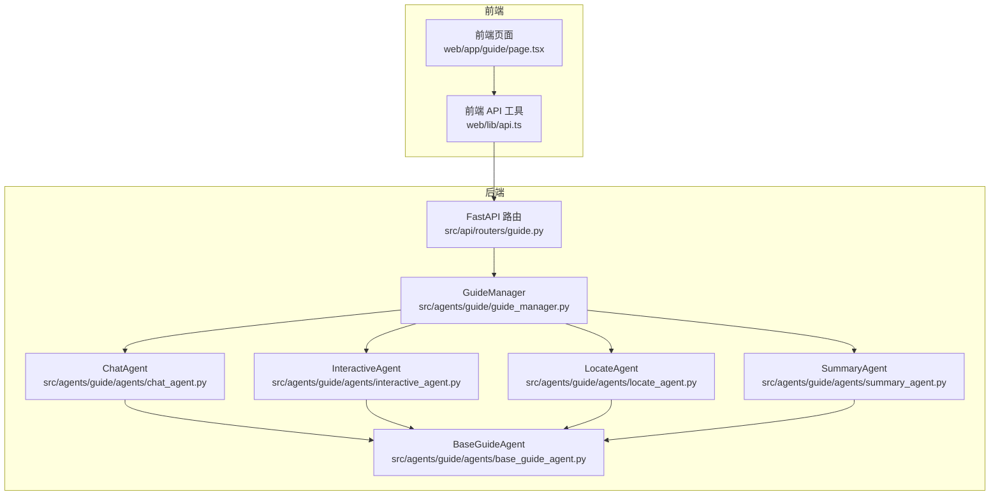
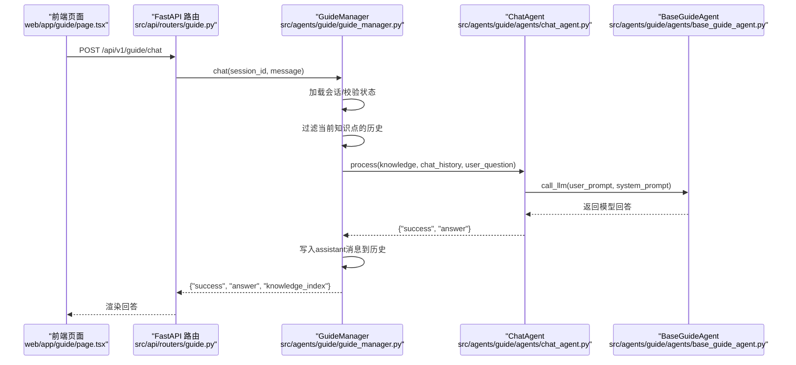
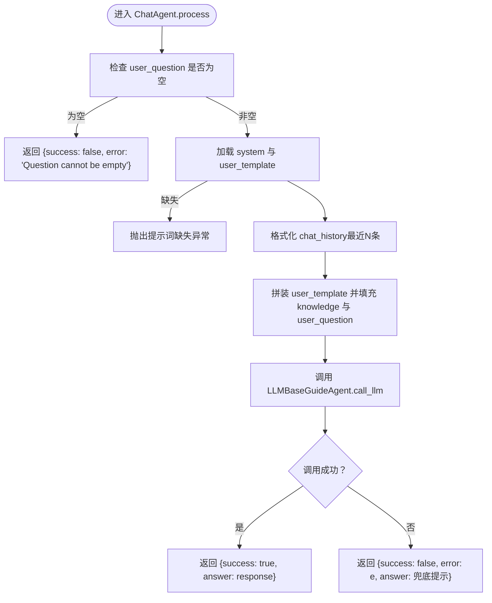
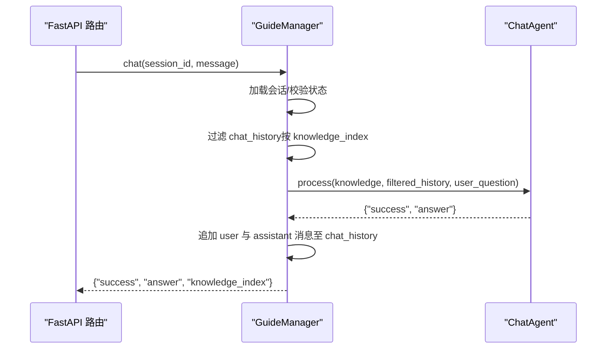
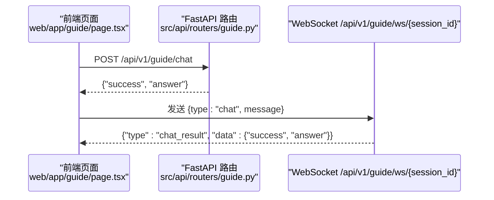
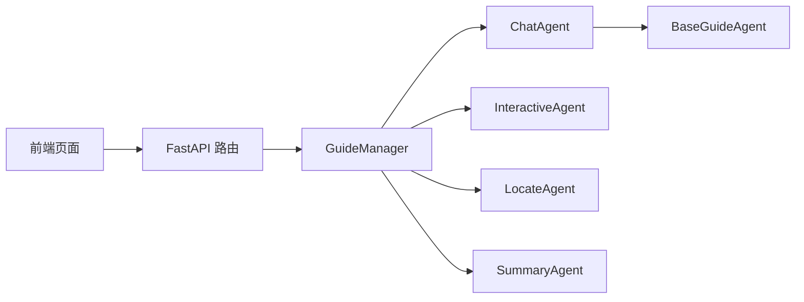

# 问答代理

<cite>
**本文引用的文件列表**
- [chat_agent.py](file://src/agents/guide/agents/chat_agent.py)
- [guide_manager.py](file://src/agents/guide/guide_manager.py)
- [base_guide_agent.py](file://src/agents/guide/agents/base_guide_agent.py)
- [interactive_agent.py](file://src/agents/guide/agents/interactive_agent.py)
- [locate_agent.py](file://src/agents/guide/agents/locate_agent.py)
- [summary_agent.py](file://src/agents/guide/agents/summary_agent.py)
- [chat_agent.yaml（中文）](file://src/agents/guide/prompts/zh/chat_agent.yaml)
- [chat_agent.yaml（英文）](file://src/agents/guide/prompts/en/chat_agent.yaml)
- [agents.yaml](file://config/agents.yaml)
- [guide.py（FastAPI 路由）](file://src/api/routers/guide.py)
- [page.tsx（前端聊天界面）](file://web/app/guide/page.tsx)
- [api.ts（前端 API 工具）](file://web/lib/api.ts)
</cite>

## 目录
1. [简介](#简介)
2. [项目结构](#项目结构)
3. [核心组件](#核心组件)
4. [架构总览](#架构总览)
5. [详细组件分析](#详细组件分析)
6. [依赖关系分析](#依赖关系分析)
7. [性能考量](#性能考量)
8. [故障排查指南](#故障排查指南)
9. [结论](#结论)
10. [附录](#附录)

## 简介
本节面向“问答代理”（ChatAgent），系统阐述其在引导式学习流程中的职责与实现细节。问答代理负责在用户学习某个具体知识点时，基于当前知识点、对话历史与用户问题生成有针对性的回答。文档将深入解析其处理流程、参数与返回值、提示词模板、与 GuideManager 的协作关系，以及与前端聊天界面的集成方式，并提供常见问题的诊断与修复建议。

## 项目结构
问答代理位于引导式学习模块中，与定位、交互页面生成、总结等其他代理共同构成完整的“引导式学习流水线”。前端通过 REST API 与 WebSocket 与后端交互，后端再调用 GuideManager 协调各代理完成会话管理与问答处理。

图表来源
- [guide.py（FastAPI 路由）](file://src/api/routers/guide.py#L1-L337)
- [guide_manager.py](file://src/agents/guide/guide_manager.py#L1-L475)
- [chat_agent.py](file://src/agents/guide/agents/chat_agent.py#L1-L92)
- [interactive_agent.py](file://src/agents/guide/agents/interactive_agent.py#L1-L211)
- [locate_agent.py](file://src/agents/guide/agents/locate_agent.py#L1-L137)
- [summary_agent.py](file://src/agents/guide/agents/summary_agent.py#L1-L138)
- [base_guide_agent.py](file://src/agents/guide/agents/base_guide_agent.py#L1-L176)
- [page.tsx（前端聊天界面）](file://web/app/guide/page.tsx#L650-L710)
- [api.ts（前端 API 工具）](file://web/lib/api.ts#L1-L59)

章节来源
- [guide.py（FastAPI 路由）](file://src/api/routers/guide.py#L1-L337)
- [guide_manager.py](file://src/agents/guide/guide_manager.py#L1-L475)

## 核心组件
- ChatAgent：问答代理，接收当前知识点、对话历史与用户问题，返回结构化回答。
- GuideManager：会话生命周期管理器，协调各代理、维护会话状态与对话历史。
- BaseGuideAgent：通用代理基类，封装统一的提示词加载、LLM 调用与统计。
- 其他代理：LocateAgent（知识定位）、InteractiveAgent（交互页生成）、SummaryAgent（学习总结）。
- 前端：通过 REST API 与 WebSocket 与后端交互，发送聊天消息并渲染回答。

章节来源
- [chat_agent.py](file://src/agents/guide/agents/chat_agent.py#L1-L92)
- [guide_manager.py](file://src/agents/guide/guide_manager.py#L1-L475)
- [base_guide_agent.py](file://src/agents/guide/agents/base_guide_agent.py#L1-L176)

## 架构总览
问答代理在整体架构中的位置如下：前端发起聊天请求，后端 FastAPI 路由层解析请求并调用 GuideManager；GuideManager 加载当前知识点与该知识点下的对话历史，调用 ChatAgent 处理用户问题；ChatAgent 通过 BaseGuideAgent 统一接口调用大模型，返回结构化回答；最终由 GuideManager 将回答写入会话历史并返回给前端。

图表来源
- [guide.py（FastAPI 路由）](file://src/api/routers/guide.py#L177-L189)
- [guide_manager.py](file://src/agents/guide/guide_manager.py#L381-L434)
- [chat_agent.py](file://src/agents/guide/agents/chat_agent.py#L39-L92)
- [base_guide_agent.py](file://src/agents/guide/agents/base_guide_agent.py#L113-L166)
- [page.tsx（前端聊天界面）](file://web/app/guide/page.tsx#L650-L710)

## 详细组件分析

### ChatAgent：问答代理
- 角色与职责
  - 在用户学习当前知识点时，针对用户问题生成结构化、可读性强的回答。
  - 严格遵循提示词模板，确保回答与当前知识点相关、循序渐进且鼓励思考。
- 关键方法
  - process(knowledge, chat_history, user_question)：主处理入口，返回 {"success": bool, "answer": str, "error": str?}
  - _format_chat_history(history)：格式化最近若干条对话历史，用于注入到用户提示词。
- 参数与返回值
  - knowledge：包含当前知识点的关键字段，如 knowledge_title、knowledge_summary、user_difficulty。
  - chat_history：当前知识点下的历史消息列表，每条消息含 role、content、knowledge_index、timestamp 等。
  - user_question：用户当前问题文本。
  - 返回：{"success": bool, "answer": str, "error": str?}，其中 answer 为 Markdown 格式回答。
- 提示词与语言
  - 通过 BaseGuideAgent 自动加载 prompts/{lang}/chat_agent.yaml 中的 system 与 user_template。
  - 支持中文与英文两种语言，语言设置由 GuideManager 初始化时确定。
- 错误处理
  - 空问题直接返回错误；
  - 提示词缺失抛出异常；
  - LLM 调用异常捕获并返回兜底错误信息。

图表来源
- [chat_agent.py](file://src/agents/guide/agents/chat_agent.py#L39-L92)
- [base_guide_agent.py](file://src/agents/guide/agents/base_guide_agent.py#L113-L166)
- [chat_agent.yaml（中文）](file://src/agents/guide/prompts/zh/chat_agent.yaml#L1-L42)
- [chat_agent.yaml（英文）](file://src/agents/guide/prompts/en/chat_agent.yaml#L1-L42)

章节来源
- [chat_agent.py](file://src/agents/guide/agents/chat_agent.py#L1-L92)
- [chat_agent.yaml（中文）](file://src/agents/guide/prompts/zh/chat_agent.yaml#L1-L42)
- [chat_agent.yaml（英文）](file://src/agents/guide/prompts/en/chat_agent.yaml#L1-L42)

### GuideManager：会话与问答编排
- 会话状态与数据结构
  - GuidedSession：包含 session_id、notebook_id、notebook_name、knowledge_points、current_index、chat_history、status、current_html、summary 等字段。
- 问答流程
  - chat(session_id, user_message)：加载会话，过滤当前知识点的历史，调用 ChatAgent.process，将用户与助手消息写回历史并保存会话。
  - start_learning/next_knowledge：驱动学习进度，生成交互页并写入 system 消息到历史。
- 对话历史管理
  - 以 knowledge_index 为粒度区分不同知识点的消息；
  - 仅向 ChatAgent 传递当前知识点的历史，避免跨知识点干扰。

图表来源
- [guide_manager.py](file://src/agents/guide/guide_manager.py#L381-L434)
- [chat_agent.py](file://src/agents/guide/agents/chat_agent.py#L39-L92)

章节来源
- [guide_manager.py](file://src/agents/guide/guide_manager.py#L1-L475)

### BaseGuideAgent：统一提示词与 LLM 调用
- 提示词加载
  - 自动从 prompts/{lang}/{agent_name}.yaml 加载 system 与 user_template；
  - 语言映射：'en'/'english' -> 'en'，否则 -> 'zh'。
- LLM 调用
  - 统一接口 call_llm(user_prompt, system_prompt, ...)；
  - 从 agents.yaml 读取温度与最大 token 配置；
  - 统计 token 使用量并支持打印汇总。
- 统一错误处理
  - 提示词缺失时抛出明确异常；
  - LLM 调用异常时返回结构化错误。

章节来源
- [base_guide_agent.py](file://src/agents/guide/agents/base_guide_agent.py#L1-L176)
- [agents.yaml](file://config/agents.yaml#L1-L55)

### 与其他组件的关系
- 与 LocateAgent：先由 LocateAgent 分析笔记内容，生成知识点列表，再由 GuideManager 创建会话。
- 与 InteractiveAgent：在进入新知识点或修复页面时生成交互页，作为学习载体。
- 与 SummaryAgent：学习完成后生成总结报告，包含完整对话历史与知识点概览。

章节来源
- [locate_agent.py](file://src/agents/guide/agents/locate_agent.py#L1-L137)
- [interactive_agent.py](file://src/agents/guide/agents/interactive_agent.py#L1-L211)
- [summary_agent.py](file://src/agents/guide/agents/summary_agent.py#L1-L138)

### 与前端聊天界面的集成
- REST API
  - 前端通过 POST /api/v1/guide/chat 发送聊天消息；
  - 后端 FastAPI 路由解析请求并调用 GuideManager.chat；
  - 前端收到 {"success", "answer", "knowledge_index"} 后更新聊天消息列表。
- WebSocket
  - 前端可通过 WebSocket /api/v1/guide/ws/{session_id} 实时收发消息；
  - 支持 start/next/chat/fix_html/get_session 等消息类型。
- API 工具
  - 前端使用 web/lib/api.ts 的 apiUrl/wsUrl 构造请求 URL；
  - NEXT_PUBLIC_API_BASE 由启动脚本自动配置，确保前后端端口一致。

图表来源
- [page.tsx（前端聊天界面）](file://web/app/guide/page.tsx#L650-L710)
- [guide.py（FastAPI 路由）](file://src/api/routers/guide.py#L177-L203)
- [api.ts（前端 API 工具）](file://web/lib/api.ts#L1-L59)

章节来源
- [page.tsx（前端聊天界面）](file://web/app/guide/page.tsx#L650-L710)
- [guide.py（FastAPI 路由）](file://src/api/routers/guide.py#L177-L203)
- [api.ts（前端 API 工具）](file://web/lib/api.ts#L1-L59)

## 依赖关系分析
- 组件耦合
  - ChatAgent 依赖 BaseGuideAgent 的提示词加载与 LLM 调用能力；
  - GuideManager 聚合多个代理，承担会话状态与历史管理；
  - 前端通过 REST 与 WebSocket 与后端解耦。
- 外部依赖
  - LLM 接口：通过 BaseGuideAgent 的 openai_complete_if_cache 统一调用；
  - 配置：agents.yaml 提供统一的温度与最大 token 设置；
  - 提示词：prompts/{lang}/chat_agent.yaml 定义回答风格与结构。

图表来源
- [chat_agent.py](file://src/agents/guide/agents/chat_agent.py#L1-L92)
- [guide_manager.py](file://src/agents/guide/guide_manager.py#L1-L475)
- [base_guide_agent.py](file://src/agents/guide/agents/base_guide_agent.py#L1-L176)
- [guide.py（FastAPI 路由）](file://src/api/routers/guide.py#L1-L337)

章节来源
- [chat_agent.py](file://src/agents/guide/agents/chat_agent.py#L1-L92)
- [guide_manager.py](file://src/agents/guide/guide_manager.py#L1-L475)
- [base_guide_agent.py](file://src/agents/guide/agents/base_guide_agent.py#L1-L176)
- [agents.yaml](file://config/agents.yaml#L1-L55)

## 性能考量
- 提示词与历史长度
  - ChatAgent 仅保留最近若干条历史，避免上下文过长导致 token 消耗过高；
  - 可根据 agents.yaml 的 max_tokens 调整上限，平衡回答质量与成本。
- LLM 调用统计
  - BaseGuideAgent 统计每次调用的输入输出 token，便于监控与优化；
  - 建议在高并发场景下限制单次问答的最大 token，避免超限。
- 前端渲染
  - 前端以 Markdown 渲染回答，注意长回答的滚动与可读性；
  - WebSocket 适合实时反馈，REST 适合简单问答。

[本节为通用指导，无需列出具体文件来源]

## 故障排查指南
- 会话不存在或状态不正确
  - 现象：后端返回 “Session does not exist” 或 “Not currently in learning state”
  - 排查：确认 session_id 正确、已执行 /start 或处于 learning 状态
  - 相关路径
    - [guide_manager.py](file://src/agents/guide/guide_manager.py#L381-L434)
    - [guide.py（FastAPI 路由）](file://src/api/routers/guide.py#L144-L175)
- 提示词缺失
  - 现象：抛出 “missing system/user_template” 异常
  - 排查：确认 prompts/{lang}/chat_agent.yaml 存在且包含 system 与 user_template
  - 相关路径
    - [chat_agent.py](file://src/agents/guide/agents/chat_agent.py#L56-L76)
    - [chat_agent.yaml（中文）](file://src/agents/guide/prompts/zh/chat_agent.yaml#L1-L42)
    - [chat_agent.yaml（英文）](file://src/agents/guide/prompts/en/chat_agent.yaml#L1-L42)
- LLM 调用失败
  - 现象：返回 {"success": false, "error": "...", "answer": "兜底提示"}
  - 排查：检查 LLM 配置（api_key、base_url、LLM_MODEL）、网络连通性
  - 相关路径
    - [base_guide_agent.py](file://src/agents/guide/agents/base_guide_agent.py#L113-L166)
    - [agents.yaml](file://config/agents.yaml#L1-L55)
- 前端无法连接后端
  - 现象：前端报错或 404/500
  - 排查：确认 NEXT_PUBLIC_API_BASE 与后端端口一致，后端服务已启动
  - 相关路径
    - [api.ts（前端 API 工具）](file://web/lib/api.ts#L1-L59)
    - [README（前端连接说明）](file://README.md#L1127-L1141)

章节来源
- [guide_manager.py](file://src/agents/guide/guide_manager.py#L381-L434)
- [guide.py（FastAPI 路由）](file://src/api/routers/guide.py#L144-L203)
- [chat_agent.py](file://src/agents/guide/agents/chat_agent.py#L56-L92)
- [chat_agent.yaml（中文）](file://src/agents/guide/prompts/zh/chat_agent.yaml#L1-L42)
- [chat_agent.yaml（英文）](file://src/agents/guide/prompts/en/chat_agent.yaml#L1-L42)
- [base_guide_agent.py](file://src/agents/guide/agents/base_guide_agent.py#L113-L166)
- [agents.yaml](file://config/agents.yaml#L1-L55)
- [api.ts（前端 API 工具）](file://web/lib/api.ts#L1-L59)

## 结论
问答代理通过严格的提示词约束与会话历史管理，确保回答与当前知识点高度相关且结构清晰。在引导式学习体系中，它与 GuideManager、LocateAgent、InteractiveAgent、SummaryAgent 协同工作，形成从知识定位、交互学习到问答与总结的完整闭环。前端通过 REST 与 WebSocket 与后端无缝对接，用户体验流畅。建议在生产环境中持续监控 LLM 调用统计、优化提示词与历史长度，并确保提示词文件与环境变量配置正确。

[本节为总结性内容，无需列出具体文件来源]

## 附录

### API 定义（与问答代理相关）
- POST /api/v1/guide/chat
  - 请求体：{"session_id": str, "message": str}
  - 返回：{"success": bool, "answer": str, "knowledge_index": int}
  - 相关路径
    - [guide.py（FastAPI 路由）](file://src/api/routers/guide.py#L177-L189)
    - [guide_manager.py](file://src/agents/guide/guide_manager.py#L381-L434)
- WebSocket /api/v1/guide/ws/{session_id}
  - 支持消息类型：start、next、chat、fix_html、get_session
  - 相关路径
    - [guide.py（FastAPI 路由）](file://src/api/routers/guide.py#L244-L331)
    - [page.tsx（前端聊天界面）](file://web/app/guide/page.tsx#L650-L710)

章节来源
- [guide.py（FastAPI 路由）](file://src/api/routers/guide.py#L177-L203)
- [guide_manager.py](file://src/agents/guide/guide_manager.py#L381-L434)
- [page.tsx（前端聊天界面）](file://web/app/guide/page.tsx#L650-L710)