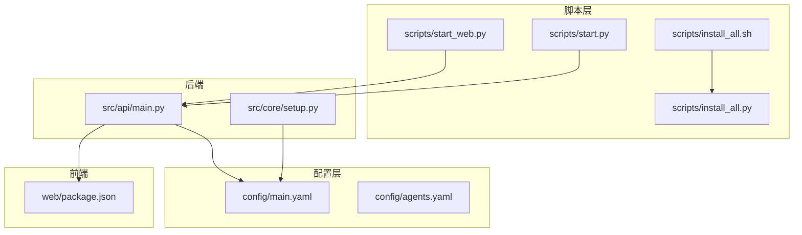
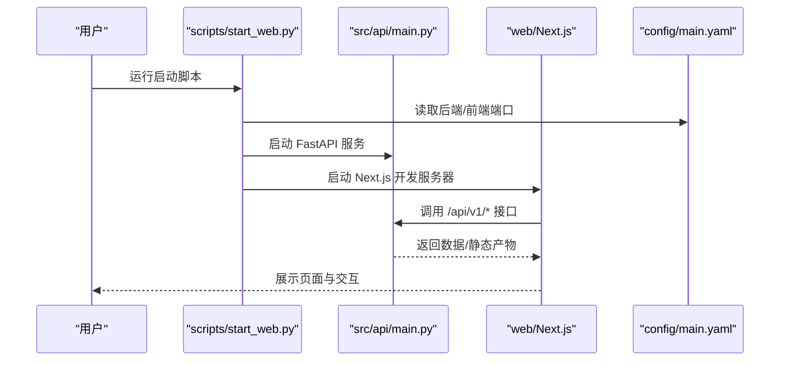
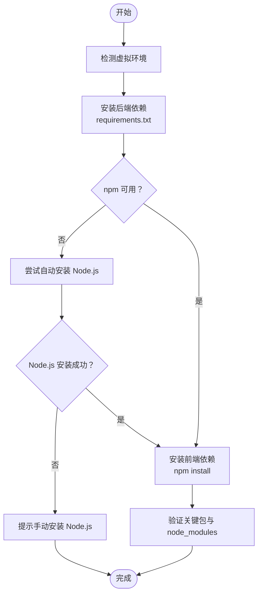
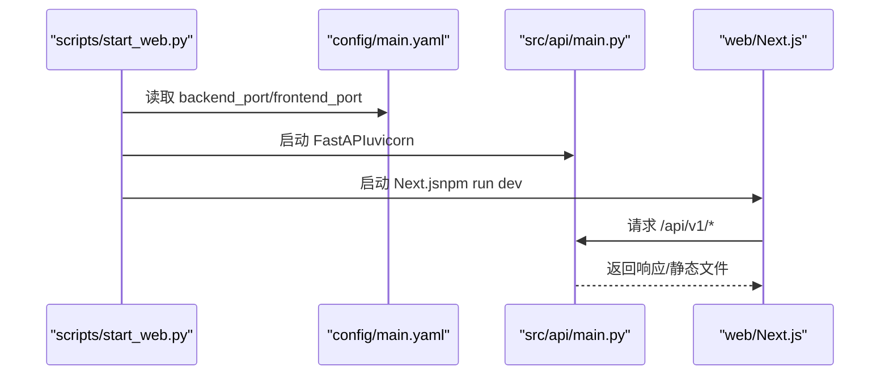
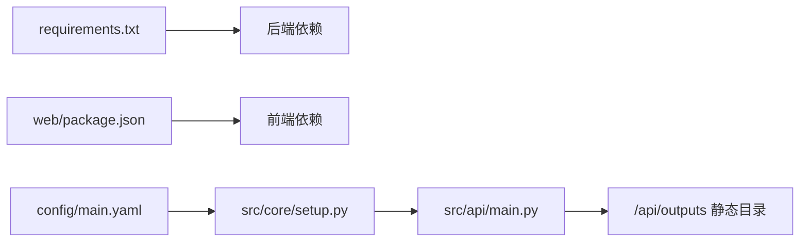

# 快速入门

<cite>
**本文引用的文件列表**
- [README.md](file://README.md)
- [scripts/install_all.sh](file://scripts/install_all.sh)
- [scripts/install_all.py](file://scripts/install_all.py)
- [scripts/start.py](file://scripts/start.py)
- [scripts/start_web.py](file://scripts/start_web.py)
- [requirements.txt](file://requirements.txt)
- [config/main.yaml](file://config/main.yaml)
- [config/agents.yaml](file://config/agents.yaml)
- [src/core/setup.py](file://src/core/setup.py)
- [src/api/main.py](file://src/api/main.py)
- [.env.example](file://.env.example)
- [web/package.json](file://web/package.json)
</cite>

## 目录
1. [简介](#简介)
2. [项目结构](#项目结构)
3. [核心组件](#核心组件)
4. [架构总览](#架构总览)
5. [详细组件解析](#详细组件解析)
6. [依赖关系分析](#依赖关系分析)
7. [性能与资源建议](#性能与资源建议)
8. [故障排除指南](#故障排除指南)
9. [结论](#结论)
10. [附录](#附录)

## 简介
本指南面向首次接触 DeepTutor 的用户，帮助你在本地完成环境准备、依赖安装、配置与启动，并提供常见问题排查方法。你将学会：
- 使用自动化脚本一键安装前后端依赖
- 配置 LLM/Embedding/TTS 等关键环境变量
- 通过启动脚本运行后端 API 与前端 Next.js 开发服务器
- 自定义端口与模型参数
- 常见端口冲突、网络与证书等故障处理

## 项目结构
DeepTutor 采用“后端 FastAPI + 前端 Next.js”的全栈架构，核心目录与职责如下：
- scripts：安装与启动脚本（自动安装、一键启动）
- config：系统与代理参数配置（main.yaml、agents.yaml）
- src：后端核心代码（API、工具、知识库、日志、核心初始化）
- web：前端 Next.js 应用（页面、组件、样式、类型）
- data：用户数据与知识库存储（自动创建）

图表来源
- [scripts/start_web.py](file://scripts/start_web.py#L1-L120)
- [src/api/main.py](file://src/api/main.py#L1-L129)
- [src/core/setup.py](file://src/core/setup.py#L243-L345)
- [config/main.yaml](file://config/main.yaml#L1-L40)
- [web/package.json](file://web/package.json#L1-L41)

章节来源
- [README.md](file://README.md#L216-L345)

## 核心组件
- 安装脚本
  - 自动化安装后端依赖（requirements.txt）与前端依赖（web/package.json），并进行校验
  - 提供 Bash 与 Python 两种实现，便于不同平台使用
- 启动脚本
  - start_web.py：统一启动后端 API 与前端 Next.js 开发服务器，自动读取配置端口并实时输出日志
  - start.py：命令行交互式入口，支持 Solver、Question、Research、IdeaGen、Web、Settings 等功能
- 配置系统
  - main.yaml：统一管理 server 端口、路径、工具开关、日志级别等
  - agents.yaml：集中管理各模块温度与最大 token 参数
  - setup.py：负责用户目录初始化与端口读取
- API 服务
  - FastAPI 主程序，挂载多路由模块，静态暴露 data/user 输出目录，便于前端访问产物

章节来源
- [scripts/install_all.sh](file://scripts/install_all.sh#L1-L120)
- [scripts/install_all.py](file://scripts/install_all.py#L1-L120)
- [scripts/start_web.py](file://scripts/start_web.py#L1-L120)
- [scripts/start.py](file://scripts/start.py#L1-L120)
- [config/main.yaml](file://config/main.yaml#L1-L40)
- [config/agents.yaml](file://config/agents.yaml#L1-L40)
- [src/core/setup.py](file://src/core/setup.py#L243-L345)
- [src/api/main.py](file://src/api/main.py#L1-L129)

## 架构总览
下图展示了从启动到访问的完整链路：启动脚本读取配置，后端 API 挂载路由并提供接口，前端 Next.js 通过环境变量或 .env.local 指向后端地址，浏览器访问前端页面。

图表来源
- [scripts/start_web.py](file://scripts/start_web.py#L200-L374)
- [src/api/main.py](file://src/api/main.py#L60-L129)
- [config/main.yaml](file://config/main.yaml#L1-L10)

## 详细组件解析

### 安装与依赖
- 自动化安装流程
  - 后端：读取 requirements.txt 并通过 pip 安装
  - 前端：检测 npm 是否存在，若缺失则尝试 Homebrew/conda/apt/yum/Chocolatey 等方式自动安装 Node.js，再执行 npm install
  - 校验：检查关键 Python 包与 node_modules 存在性
- 手动安装
  - 后端：pip install -r requirements.txt
  - 前端：npm install（位于 web/ 目录）

图表来源
- [scripts/install_all.sh](file://scripts/install_all.sh#L100-L220)
- [scripts/install_all.py](file://scripts/install_all.py#L110-L200)

章节来源
- [scripts/install_all.sh](file://scripts/install_all.sh#L1-L220)
- [scripts/install_all.py](file://scripts/install_all.py#L1-L200)
- [requirements.txt](file://requirements.txt#L1-L62)
- [web/package.json](file://web/package.json#L1-L41)

### 环境变量与配置
- 环境变量模板
  - 复制 .env.example 为 .env，填写 LLM/Embedding/TTS/WebSearch 等密钥与端点
- 系统配置
  - main.yaml：server.backend_port、server.frontend_port、paths、tools、logging 等
  - agents.yaml：各模块 temperature 与 max_tokens 统一管理
- 端口读取
  - setup.py 提供 get_backend_port/get_frontend_port/get_ports，未配置时会打印教程并退出

章节来源
- [.env.example](file://.env.example#L1-L88)
- [config/main.yaml](file://config/main.yaml#L1-L40)
- [config/agents.yaml](file://config/agents.yaml#L1-L40)
- [src/core/setup.py](file://src/core/setup.py#L243-L345)

### 启动后端 API 与前端
- 启动后端 API
  - scripts/start_web.py 读取 config/main.yaml 获取端口，调用 src/api/run_server.py（或直接运行 src/api/main.py）启动 FastAPI
  - 后端会初始化 data/user 目录并挂载静态输出目录 /api/outputs
- 启动前端 Next.js
  - scripts/start_web.py 读取 config/main.yaml 获取前端端口，生成 .env.local 写入 NEXT_PUBLIC_API_BASE=http://localhost:{backend_port}，然后 npm run dev
- CLI 启动
  - scripts/start.py 提供命令行菜单，可选择 Solver/Question/Research/IdeaGen/Web/Settings 等模式；Web 模式支持仅启动后端、仅启动前端或同时启动

图表来源
- [scripts/start_web.py](file://scripts/start_web.py#L1-L120)
- [src/api/main.py](file://src/api/main.py#L60-L129)
- [config/main.yaml](file://config/main.yaml#L1-L10)

章节来源
- [scripts/start_web.py](file://scripts/start_web.py#L1-L120)
- [src/api/main.py](file://src/api/main.py#L60-L129)
- [scripts/start.py](file://scripts/start.py#L648-L768)

## 依赖关系分析
- 后端依赖
  - FastAPI、Uvicorn、OpenAI、LightRAG、RAGAnything、Requests、PyYAML、tiktoken 等
- 前端依赖
  - Next.js、React、Tailwind、Mermaid、Math 等
- 配置依赖
  - setup.py 依赖 config/main.yaml 读取端口与路径
  - API 服务依赖 setup.py 初始化用户目录并挂载静态输出

图表来源
- [requirements.txt](file://requirements.txt#L1-L62)
- [web/package.json](file://web/package.json#L1-L41)
- [config/main.yaml](file://config/main.yaml#L1-L40)
- [src/core/setup.py](file://src/core/setup.py#L243-L345)
- [src/api/main.py](file://src/api/main.py#L60-L129)

章节来源
- [requirements.txt](file://requirements.txt#L1-L62)
- [web/package.json](file://web/package.json#L1-L41)
- [src/core/setup.py](file://src/core/setup.py#L243-L345)
- [src/api/main.py](file://src/api/main.py#L60-L129)

## 性能与资源建议
- 端口占用
  - 默认后端端口 8001、前端端口 3782；如被占用请修改 config/main.yaml 对应字段
- 模型与 Token
  - agents.yaml 统一控制各模块 temperature 与 max_tokens，避免单模块硬编码导致不一致
- 日志与输出
  - data/user 下的输出目录由 API 挂载为 /api/outputs，便于前端直接访问生成的图片/PDF/音频等产物
- 代码执行工作区
  - 后端启动时排除了 data/user/run_code_workspace 以避免临时文件触发热重载

章节来源
- [config/main.yaml](file://config/main.yaml#L1-L40)
- [config/agents.yaml](file://config/agents.yaml#L1-L40)
- [src/api/main.py](file://src/api/main.py#L100-L129)

## 故障排除指南
- 端口冲突
  - 现象：启动后端或前端时报端口已被占用
  - 处理：修改 config/main.yaml 中 server.backend_port 或 server.frontend_port，重启服务
- npm 未找到
  - 现象：安装脚本报错找不到 npm
  - 处理：自动尝试 Homebrew/conda/apt/yum/Chocolatey 安装 Node.js；失败时按提示手动安装并更新 PATH
- LLM/Embedding/TTS 未配置
  - 现象：运行时提示未配置 API Key 或端点
  - 处理：复制 .env.example 为 .env，填写 LLM_BINDING、LLM_MODEL、LLM_BINDING_HOST、LLM_BINDING_API_KEY、EMBEDDING_*、TTS_* 等
- SSL 证书问题
  - 现象：连接第三方 API 时出现证书错误
  - 处理：根据需要设置 DISABLE_SSL_VERIFY=false（默认关闭），或正确配置证书
- 启动后端失败
  - 现象：scripts/start_web.py 显示后端进程提前退出
  - 处理：查看终端输出定位异常；确认 config/main.yaml 端口无冲突；检查 .env 中密钥是否正确
- 前端无法访问后端
  - 现象：前端报跨域或 404
  - 处理：确认 scripts/start_web.py 已生成 .env.local 并写入 NEXT_PUBLIC_API_BASE；或在环境中设置 NEXT_PUBLIC_API_BASE=http://localhost:{backend_port}

章节来源
- [scripts/start_web.py](file://scripts/start_web.py#L120-L220)
- [src/core/setup.py](file://src/core/setup.py#L211-L241)
- [.env.example](file://.env.example#L1-L88)

## 结论
通过本指南，你可以：
- 使用自动化脚本完成一键安装与启动
- 正确配置 LLM/Embedding/TTS 等关键参数
- 自定义端口与模型参数，满足不同使用场景
- 在遇到常见问题时快速定位并解决

## 附录
- 快速步骤清单
  - 克隆仓库并创建虚拟环境
  - 运行 scripts/install_all.sh 或 scripts/install_all.py 安装依赖
  - 复制 .env.example 为 .env 并填写密钥
  - 修改 config/main.yaml 的 server 端口（如需）
  - 运行 python scripts/start_web.py 启动前后端
  - 访问 http://localhost:{frontend_port} 与后端文档 http://localhost:{backend_port}/docs

章节来源
- [README.md](file://README.md#L216-L345)