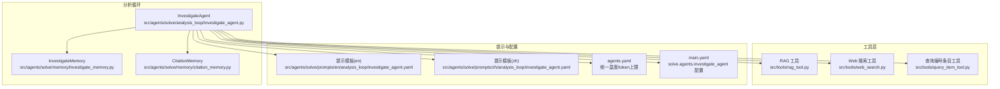
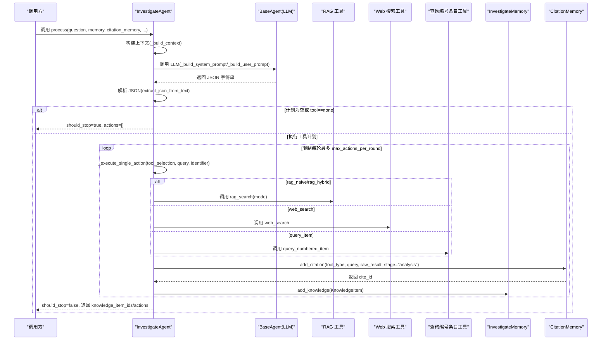
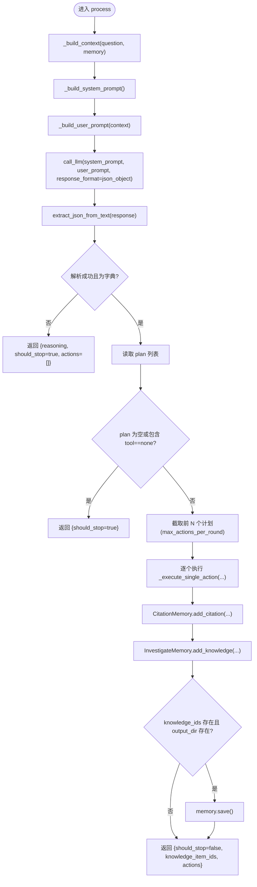
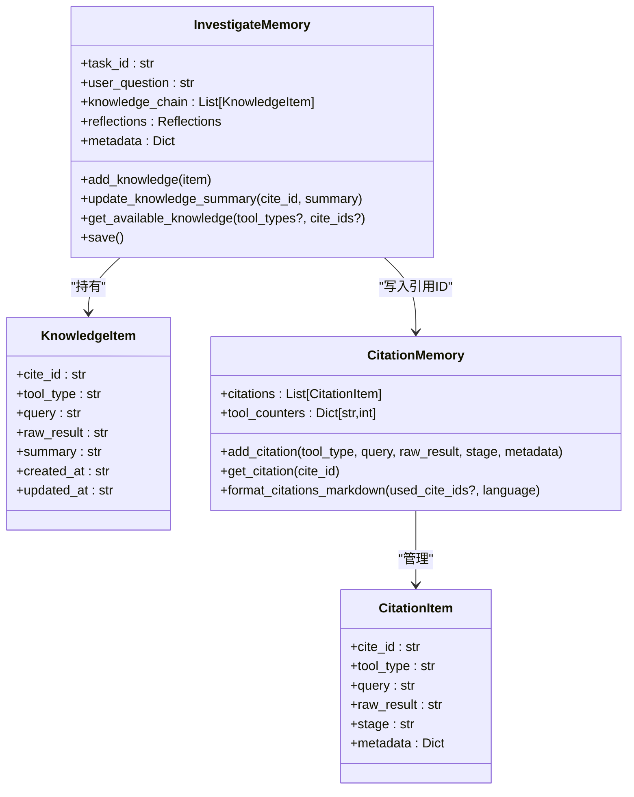
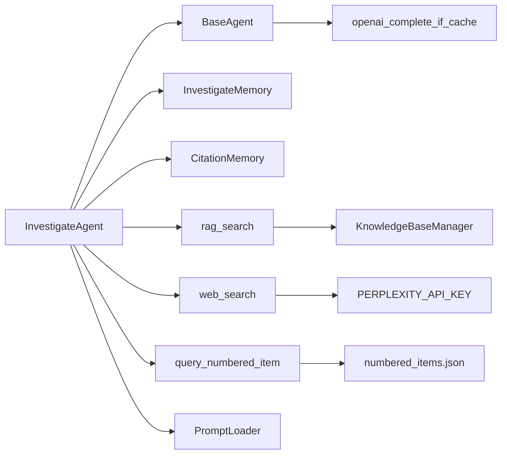

# InvestigateAgent

<cite>
**本文引用的文件列表**
- [investigate_agent.py](file://src/agents/solve/analysis_loop/investigate_agent.py)
- [investigate_memory.py](file://src/agents/solve/memory/investigate_memory.py)
- [citation_memory.py](file://src/agents/solve/memory/citation_memory.py)
- [investigate_agent.yaml（英文）](file://src/agents/solve/prompts/en/analysis_loop/investigate_agent.yaml)
- [investigate_agent.yaml（中文）](file://src/agents/solve/prompts/zh/analysis_loop/investigate_agent.yaml)
- [base_agent.py](file://src/agents/solve/base_agent.py)
- [rag_tool.py](file://src/tools/rag_tool.py)
- [web_search.py](file://src/tools/web_search.py)
- [query_item_tool.py](file://src/tools/query_item_tool.py)
- [json_utils.py](file://src/agents/solve/utils/json_utils.py)
- [agents.yaml](file://config/agents.yaml)
- [main.yaml](file://config/main.yaml)
</cite>

## 目录
1. [简介](#简介)
2. [项目结构](#项目结构)
3. [核心组件](#核心组件)
4. [架构总览](#架构总览)
5. [详细组件分析](#详细组件分析)
6. [依赖关系分析](#依赖关系分析)
7. [性能考量](#性能考量)
8. [故障排查指南](#故障排查指南)
9. [结论](#结论)
10. [附录](#附录)

## 简介
InvestigateAgent 是“分析循环”中的查询生成器与工具调用协调器。它负责：
- 基于当前记忆与反思构建上下文
- 调用 LLM 生成工具执行计划（JSON）
- 并发/串行地执行多个工具调用（如 rag_naive、rag_hybrid、web_search、query_item）
- 将新获取的知识项写入 InvestigateMemory，并在 CitationMemory 中注册引用
- 根据配置动态调整系统提示（如禁用 web_search 时移除相关描述）

本文件将深入解析其实现细节、数据流、错误处理与性能优化策略，并提供来自代码的实际示例与最佳实践。

## 项目结构
InvestigateAgent 所属模块位于 solve 分支的 analysis_loop 下，配合内存管理与工具层共同完成检索与知识整合。

图表来源
- [investigate_agent.py](file://src/agents/solve/analysis_loop/investigate_agent.py#L1-L120)
- [investigate_memory.py](file://src/agents/solve/memory/investigate_memory.py#L1-L120)
- [citation_memory.py](file://src/agents/solve/memory/citation_memory.py#L1-L120)
- [rag_tool.py](file://src/tools/rag_tool.py#L1-L120)
- [web_search.py](file://src/tools/web_search.py#L1-L120)
- [query_item_tool.py](file://src/tools/query_item_tool.py#L1-L120)
- [investigate_agent.yaml（英文）](file://src/agents/solve/prompts/en/analysis_loop/investigate_agent.yaml#L1-L56)
- [investigate_agent.yaml（中文）](file://src/agents/solve/prompts/zh/analysis_loop/investigate_agent.yaml#L1-L54)
- [agents.yaml](file://config/agents.yaml#L1-L55)
- [main.yaml](file://config/main.yaml#L55-L62)

章节来源
- [investigate_agent.py](file://src/agents/solve/analysis_loop/investigate_agent.py#L1-L120)
- [investigate_memory.py](file://src/agents/solve/memory/investigate_memory.py#L1-L120)
- [citation_memory.py](file://src/agents/solve/memory/citation_memory.py#L1-L120)
- [agents.yaml](file://config/agents.yaml#L1-L55)
- [main.yaml](file://config/main.yaml#L55-L62)

## 核心组件
- InvestigateAgent：继承自 BaseAgent，负责构建上下文、调用 LLM、解析 JSON 计划、执行工具调用、登记引用与更新记忆。
- InvestigateMemory：分析循环的记忆载体，保存知识链与反思。
- CitationMemory：全局引用管理，按工具类型生成 cite_id，支持格式化引用清单。

章节来源
- [investigate_agent.py](file://src/agents/solve/analysis_loop/investigate_agent.py#L24-L120)
- [investigate_memory.py](file://src/agents/solve/memory/investigate_memory.py#L13-L120)
- [citation_memory.py](file://src/agents/solve/memory/citation_memory.py#L14-L120)

## 架构总览
InvestigateAgent 的处理流程如下：

图表来源
- [investigate_agent.py](file://src/agents/solve/analysis_loop/investigate_agent.py#L44-L187)
- [rag_tool.py](file://src/tools/rag_tool.py#L31-L120)
- [web_search.py](file://src/tools/web_search.py#L19-L120)
- [query_item_tool.py](file://src/tools/query_item_tool.py#L15-L120)
- [investigate_memory.py](file://src/agents/solve/memory/investigate_memory.py#L169-L183)
- [citation_memory.py](file://src/agents/solve/memory/citation_memory.py#L101-L149)

## 详细组件分析

### InvestigateAgent 类与处理流程
- 初始化与配置
  - 读取 tools.web_search.enabled 决定是否启用 web_search
  - 从 solve.agents.investigate_agent 读取 max_actions_per_round 与 max_iterations
- process 方法
  - 构建上下文（传递完整知识链与反思摘要）
  - 构建系统提示与用户提示
  - 调用 LLM，要求 JSON 输出
  - 解析 JSON，容错处理（非数组/字典、空计划、tool==none）
  - 限制每轮动作数量（max_actions_per_round）
  - 并发/串行执行工具调用，登记引用，更新 InvestigateMemory
  - 返回结构化结果（reasoning、should_stop、knowledge_item_ids、actions）

图表来源
- [investigate_agent.py](file://src/agents/solve/analysis_loop/investigate_agent.py#L44-L187)
- [json_utils.py](file://src/agents/solve/utils/json_utils.py#L12-L99)

章节来源
- [investigate_agent.py](file://src/agents/solve/analysis_loop/investigate_agent.py#L24-L187)
- [json_utils.py](file://src/agents/solve/utils/json_utils.py#L12-L99)

### 上下文构建与提示动态调整
- 上下文包含：
  - 问题、知识链条目（cite_id、tool_type、query、raw_result、summary）
  - 知识链摘要与剩余问题摘要
- 提示动态调整：
  - 若 web_search 禁用，则替换或过滤提示中关于 web_search 的描述与输出格式

章节来源
- [investigate_agent.py](file://src/agents/solve/analysis_loop/investigate_agent.py#L189-L273)
- [investigate_agent.yaml（英文）](file://src/agents/solve/prompts/en/analysis_loop/investigate_agent.yaml#L1-L56)
- [investigate_agent.yaml（中文）](file://src/agents/solve/prompts/zh/analysis_loop/investigate_agent.yaml#L1-L54)

### 工具调用与引用登记
- 支持工具：
  - rag_naive、rag_hybrid：调用 rag_search
  - web_search：受 tools.web_search.enabled 控制
  - query_item：校验 identifier 后调用 query_numbered_item
- 引用登记：
  - 使用 CitationMemory.add_citation 生成 cite_id，写入 stage="analysis"
  - 记录工具调用日志（耗时、输入输出、错误等）

章节来源
- [investigate_agent.py](file://src/agents/solve/analysis_loop/investigate_agent.py#L283-L405)
- [rag_tool.py](file://src/tools/rag_tool.py#L31-L120)
- [web_search.py](file://src/tools/web_search.py#L19-L120)
- [query_item_tool.py](file://src/tools/query_item_tool.py#L15-L120)
- [citation_memory.py](file://src/agents/solve/memory/citation_memory.py#L101-L149)

### InvestigateMemory 与 CitationMemory 的交互
- InvestigateMemory
  - 保存知识链（KnowledgeItem）、反思（remaining_questions）
  - 提供 add_knowledge/update_knowledge_summary/get_available_knowledge/save 等
- CitationMemory
  - 统一 cite_id 生成（按工具前缀计数）
  - add_citation/get_citation/format_citations_markdown 等

图表来源
- [investigate_memory.py](file://src/agents/solve/memory/investigate_memory.py#L13-L227)
- [citation_memory.py](file://src/agents/solve/memory/citation_memory.py#L14-L222)

章节来源
- [investigate_memory.py](file://src/agents/solve/memory/investigate_memory.py#L13-L227)
- [citation_memory.py](file://src/agents/solve/memory/citation_memory.py#L14-L222)

### 公共接口、参数与返回值
- 接口
  - process(question, memory, citation_memory, kb_name="ai_textbook", output_dir=None, verbose=True)
- 参数
  - question：用户问题
  - memory：InvestigateMemory 实例
  - citation_memory：CitationMemory 实例（不可为 None）
  - kb_name：知识库名称
  - output_dir：输出目录（用于保存 memory）
  - verbose：是否打印详细日志
- 返回值
  - 字典，包含：
    - reasoning：推理说明
    - should_stop：是否应停止
    - knowledge_item_ids：新增知识项的 cite_id 列表
    - actions：本轮执行的动作列表（包含 tool_type、query、identifier、cite_id）

章节来源
- [investigate_agent.py](file://src/agents/solve/analysis_loop/investigate_agent.py#L44-L187)

### 配置参数与动态提示
- 配置来源
  - tools.web_search.enabled：控制 web_search 是否可用
  - solve.agents.investigate_agent.max_actions_per_round：每轮最多执行的动作数
  - solve.agents.investigate_agent.max_iterations：最大迭代次数
- 动态提示
  - 当 web_search 禁用时，系统提示会移除 web_search 描述或替换为禁用说明

章节来源
- [investigate_agent.py](file://src/agents/solve/analysis_loop/investigate_agent.py#L36-L43)
- [investigate_agent.py](file://src/agents/solve/analysis_loop/investigate_agent.py#L230-L273)
- [main.yaml](file://config/main.yaml#L55-L62)

## 依赖关系分析
InvestigateAgent 与各模块的依赖关系如下：

图表来源
- [investigate_agent.py](file://src/agents/solve/analysis_loop/investigate_agent.py#L1-L120)
- [base_agent.py](file://src/agents/solve/base_agent.py#L161-L278)
- [rag_tool.py](file://src/tools/rag_tool.py#L31-L120)
- [web_search.py](file://src/tools/web_search.py#L19-L120)
- [query_item_tool.py](file://src/tools/query_item_tool.py#L15-L120)

章节来源
- [investigate_agent.py](file://src/agents/solve/analysis_loop/investigate_agent.py#L1-L120)
- [base_agent.py](file://src/agents/solve/base_agent.py#L161-L278)

## 性能考量
- 合理设置 max_actions_per_round
  - 作用：限制每轮工具调用数量，避免上下文过长与成本过高
  - 建议：结合 LLM 上下文长度与 token 预估，逐步调优
- 合理设置 max_iterations
  - 作用：限制总迭代次数，防止无限循环
  - 建议：根据问题复杂度与知识库覆盖度设定
- 提示动态裁剪
  - 禁用 web_search 时移除相关描述，减少无关工具选项，降低 LLM 输出复杂度
- 日志与追踪
  - 使用 TokenTracker 与日志统计工具调用耗时与 token 使用情况

章节来源
- [investigate_agent.py](file://src/agents/solve/analysis_loop/investigate_agent.py#L36-L43)
- [investigate_agent.py](file://src/agents/solve/analysis_loop/investigate_agent.py#L230-L273)
- [base_agent.py](file://src/agents/solve/base_agent.py#L161-L278)
- [agents.yaml](file://config/agents.yaml#L10-L15)
- [main.yaml](file://config/main.yaml#L55-L62)

## 故障排查指南
- LLM 输出 JSON 解析失败
  - 现象：返回 {reasoning: "Parse failed: invalid JSON", should_stop: true}
  - 处理：检查提示模板是否强制 JSON；确认 LLM 输出未被包裹在 Markdown 代码块中；必要时放宽响应格式要求
- 工具调用异常
  - web_search 未启用：会记录警告并跳过；检查 tools.web_search.enabled
  - query_item identifier 为空或无效：记录警告并跳过
  - 其他工具异常：捕获异常并记录错误日志，返回 None
- 引用登记失败
  - 检查 CitationMemory 的保存路径与权限
- 迭代与动作数过多导致上下文过长
  - 降低 max_actions_per_round 或 max_iterations；优化提示模板

章节来源
- [investigate_agent.py](file://src/agents/solve/analysis_loop/investigate_agent.py#L93-L137)
- [investigate_agent.py](file://src/agents/solve/analysis_loop/investigate_agent.py#L307-L385)
- [investigate_agent.py](file://src/agents/solve/analysis_loop/investigate_agent.py#L360-L385)
- [main.yaml](file://config/main.yaml#L55-L62)

## 结论
InvestigateAgent 通过“查询生成 + 工具协调 + 引用登记 + 记忆更新”的闭环，高效地在分析阶段为后续求解阶段提供高质量的知识基础。其配置灵活、提示可裁剪、错误处理完善，并通过 InvestigateMemory 与 CitationMemory 实现知识与引用的统一管理。合理设置 max_actions_per_round 与 max_iterations，可在保证效率的同时控制上下文长度与成本。

## 附录
- 关键配置参考
  - solve.agents.investigate_agent.max_actions_per_round
  - solve.agents.investigate_agent.max_iterations
  - tools.web_search.enabled
- 提示模板位置
  - 英文：src/agents/solve/prompts/en/analysis_loop/investigate_agent.yaml
  - 中文：src/agents/solve/prompts/zh/analysis_loop/investigate_agent.yaml