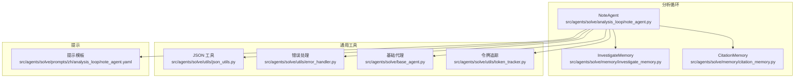
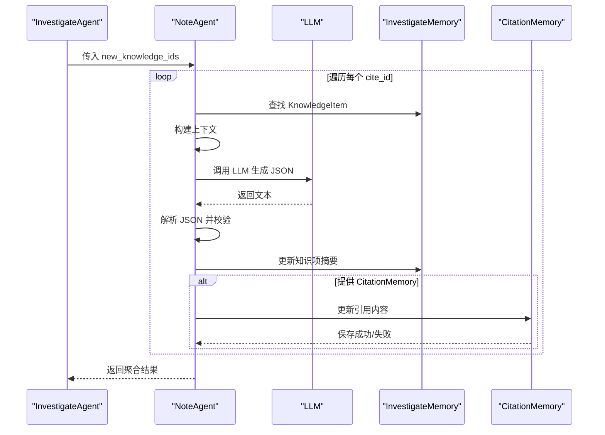
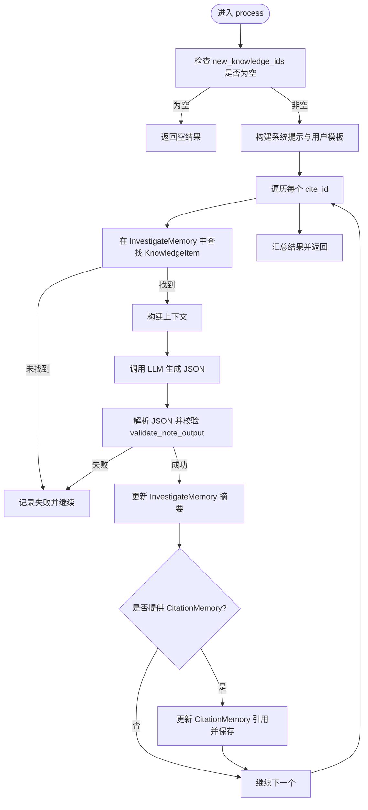
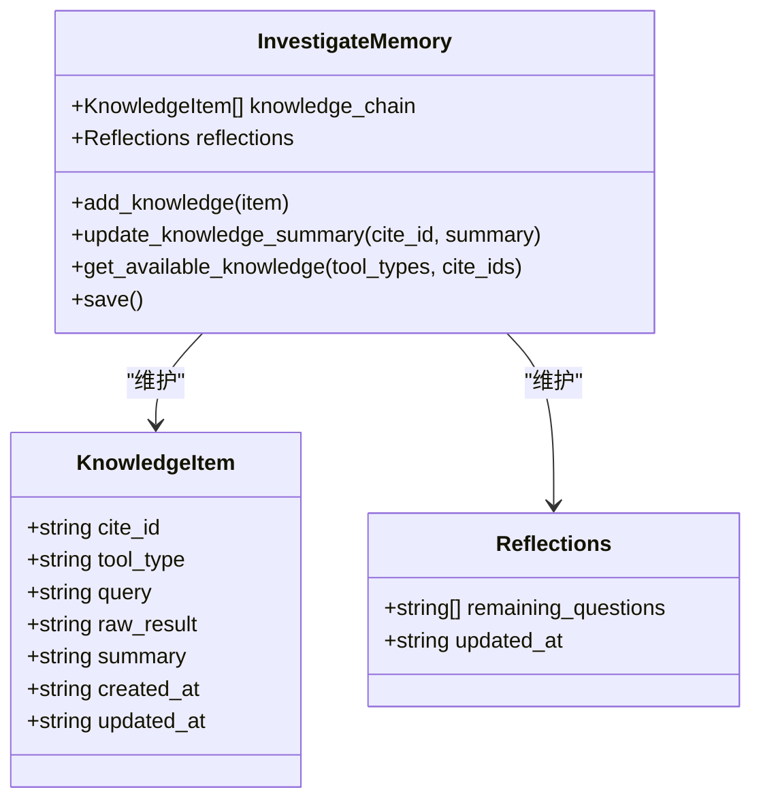
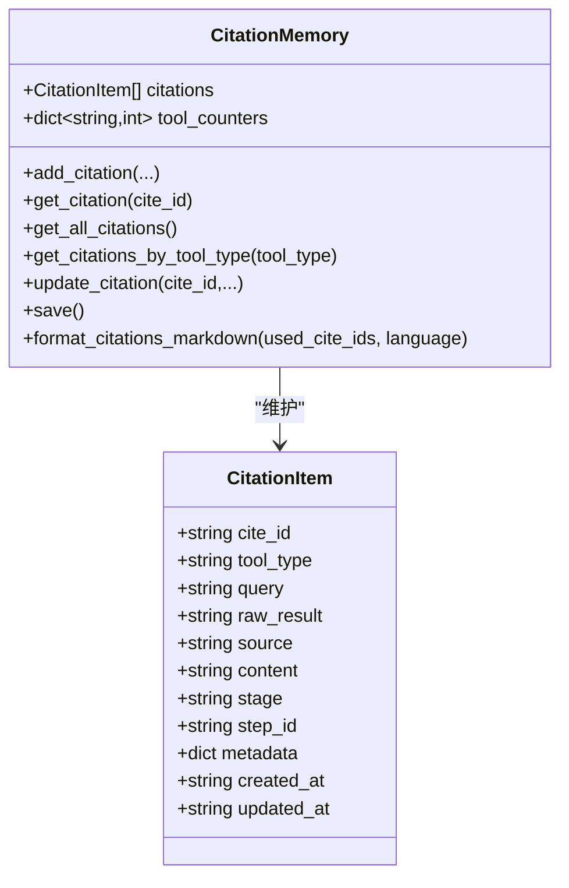
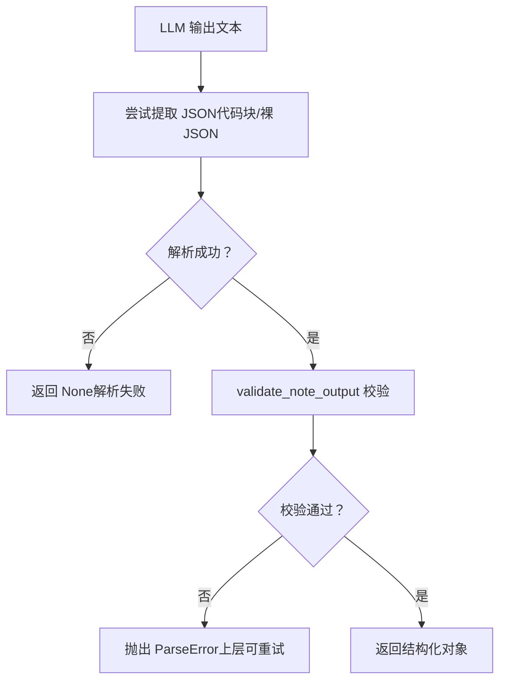
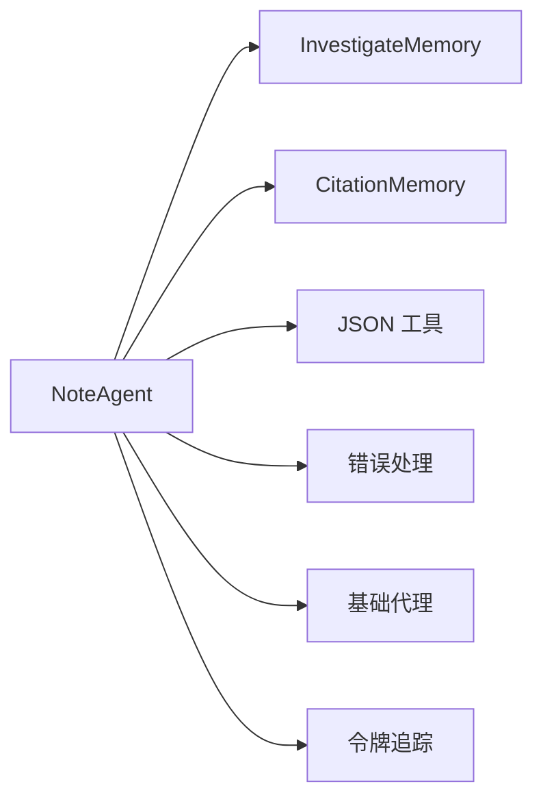

# NoteAgent

<cite>
**本文引用的文件**
- [note_agent.py](file://src/agents/solve/analysis_loop/note_agent.py)
- [investigate_memory.py](file://src/agents/solve/memory/investigate_memory.py)
- [citation_memory.py](file://src/agents/solve/memory/citation_memory.py)
- [json_utils.py](file://src/agents/solve/utils/json_utils.py)
- [error_handler.py](file://src/agents/solve/utils/error_handler.py)
- [base_agent.py](file://src/agents/solve/base_agent.py)
- [note_agent.yaml](file://src/agents/solve/prompts/zh/analysis_loop/note_agent.yaml)
- [token_tracker.py](file://src/agents/solve/utils/token_tracker.py)
</cite>

## 目录
1. [简介](#简介)
2. [项目结构](#项目结构)
3. [核心组件](#核心组件)
4. [架构总览](#架构总览)
5. [详细组件分析](#详细组件分析)
6. [依赖关系分析](#依赖关系分析)
7. [性能考量](#性能考量)
8. [故障排查指南](#故障排查指南)
9. [结论](#结论)

## 简介
NoteAgent 是“知识速记员”，在分析循环中扮演“知识整合者”的角色。它的职责是：
- 接收 InvestigateAgent 获取的新知识项（通过 cite_id 指定）
- 为每个知识项构建上下文（包含问题、工具类型、查询语句与原始结果）
- 调用 LLM 生成结构化的笔记（包含摘要与引用列表）
- 验证输出 JSON 的合法性与字段完整性
- 更新 InvestigateMemory 中对应知识项的摘要
- 同步更新 CitationMemory 中的引用内容（若提供 CitationMemory）

该实现支持批量处理多个新知识项，具备完善的错误处理与日志记录能力，并通过统一的提示模板与 JSON 解析工具保证输出稳定性。

## 项目结构
NoteAgent 所属模块位于分析循环（analysis loop）中，与记忆系统（InvestigateMemory、CitationMemory）、通用工具（JSON 解析、错误处理、提示加载）紧密协作。

图表来源
- [note_agent.py](file://src/agents/solve/analysis_loop/note_agent.py#L1-L179)
- [investigate_memory.py](file://src/agents/solve/memory/investigate_memory.py#L1-L227)
- [citation_memory.py](file://src/agents/solve/memory/citation_memory.py#L1-L354)
- [json_utils.py](file://src/agents/solve/utils/json_utils.py#L1-L99)
- [error_handler.py](file://src/agents/solve/utils/error_handler.py#L1-L253)
- [base_agent.py](file://src/agents/solve/base_agent.py#L1-L323)
- [note_agent.yaml](file://src/agents/solve/prompts/zh/analysis_loop/note_agent.yaml#L1-L55)

章节来源
- [note_agent.py](file://src/agents/solve/analysis_loop/note_agent.py#L1-L179)
- [investigate_memory.py](file://src/agents/solve/memory/investigate_memory.py#L1-L227)
- [citation_memory.py](file://src/agents/solve/memory/citation_memory.py#L1-L354)
- [json_utils.py](file://src/agents/solve/utils/json_utils.py#L1-L99)
- [error_handler.py](file://src/agents/solve/utils/error_handler.py#L1-L253)
- [base_agent.py](file://src/agents/solve/base_agent.py#L1-L323)
- [note_agent.yaml](file://src/agents/solve/prompts/zh/analysis_loop/note_agent.yaml#L1-L55)

## 核心组件
- NoteAgent（分析循环）
  - 负责遍历 new_knowledge_ids，为每个知识项构建上下文，调用 LLM 生成摘要与引用，校验 JSON 并更新 InvestigateMemory/CitationMemory
  - 关键方法：process、_build_context、_build_system_prompt、_build_user_prompt
- InvestigateMemory
  - 维护知识链（KnowledgeItem 列表），提供添加、查询、更新摘要、保存等能力
- CitationMemory
  - 全局引用管理，提供新增、查询、更新引用、保存等能力
- JSON 工具
  - 提供从 LLM 输出中提取 JSON 的能力（支持代码块与裸 JSON）
- 错误处理
  - 定义 ParseError 与 validate_note_output，确保输出结构正确
- 基础代理
  - 统一的 LLM 调用接口、提示加载、日志与令牌统计

章节来源
- [note_agent.py](file://src/agents/solve/analysis_loop/note_agent.py#L1-L179)
- [investigate_memory.py](file://src/agents/solve/memory/investigate_memory.py#L1-L227)
- [citation_memory.py](file://src/agents/solve/memory/citation_memory.py#L1-L354)
- [json_utils.py](file://src/agents/solve/utils/json_utils.py#L1-L99)
- [error_handler.py](file://src/agents/solve/utils/error_handler.py#L1-L253)
- [base_agent.py](file://src/agents/solve/base_agent.py#L1-L323)

## 架构总览
NoteAgent 在分析循环中作为“知识整合者”，串联 InvestigateMemory 与 CitationMemory，形成“检索—生成—归档”的闭环。

图表来源
- [note_agent.py](file://src/agents/solve/analysis_loop/note_agent.py#L34-L179)
- [investigate_memory.py](file://src/agents/solve/memory/investigate_memory.py#L174-L182)
- [citation_memory.py](file://src/agents/solve/memory/citation_memory.py#L166-L194)

## 详细组件分析

### NoteAgent（分析循环）
- 角色定位
  - “知识速记员”，负责将原始检索结果整理为结构化摘要与引用，便于后续推理与报告阶段使用
- 主要职责
  - 遍历 new_knowledge_ids
  - 从 InvestigateMemory 中查找对应 KnowledgeItem
  - 构建上下文（问题、工具类型、查询语句、原始结果）
  - 调用 LLM 生成 JSON（要求 JSON 输出）
  - 解析并校验 JSON（validate_note_output），确保包含 summary 与 citations
  - 更新 InvestigateMemory 的摘要
  - 可选更新 CitationMemory 的引用内容
  - 返回处理结果（成功/失败明细）
- 关键方法
  - process：主流程控制，含错误收集与聚合
  - _build_context/_build_system_prompt/_build_user_prompt：提示构造
- 错误处理
  - 空输入 new_knowledge_ids
  - 知识项未找到
  - LLM 输出解析失败（非 JSON 或格式不合法）
  - 引用更新失败（cite_id 不存在）
- 性能与可观测性
  - 支持 verbose 日志与令牌追踪（TokenTracker）
  - 统一的 LLM 调用接口（BaseAgent.call_llm）

图表来源
- [note_agent.py](file://src/agents/solve/analysis_loop/note_agent.py#L34-L179)
- [error_handler.py](file://src/agents/solve/utils/error_handler.py#L156-L174)
- [investigate_memory.py](file://src/agents/solve/memory/investigate_memory.py#L174-L182)
- [citation_memory.py](file://src/agents/solve/memory/citation_memory.py#L166-L194)

章节来源
- [note_agent.py](file://src/agents/solve/analysis_loop/note_agent.py#L1-L179)
- [note_agent.yaml](file://src/agents/solve/prompts/zh/analysis_loop/note_agent.yaml#L1-L55)
- [base_agent.py](file://src/agents/solve/base_agent.py#L161-L278)
- [token_tracker.py](file://src/agents/solve/utils/token_tracker.py#L234-L363)

### InvestigateMemory（知识链）
- 数据结构
  - KnowledgeItem：包含 cite_id、tool_type、query、raw_result、summary、时间戳等
  - Reflections：反思与剩余问题集合
- 核心能力
  - 添加知识项、按工具类型/ID 过滤
  - 更新知识项摘要（update_knowledge_summary）
  - 保存/加载 JSON 文件（向后兼容旧版本）
- 与 NoteAgent 的交互
  - NoteAgent 通过 update_knowledge_summary 写入摘要
  - NoteAgent 通过知识链查找原始内容用于上下文

图表来源
- [investigate_memory.py](file://src/agents/solve/memory/investigate_memory.py#L1-L227)

章节来源
- [investigate_memory.py](file://src/agents/solve/memory/investigate_memory.py#L1-L227)

### CitationMemory（引用管理）
- 数据结构
  - CitationItem：包含 cite_id、tool_type、query、raw_result、source、content、stage、step_id、metadata、时间戳
- 核心能力
  - 新增/查询/按工具类型过滤
  - 更新引用（update_citation），支持增量更新字段
  - 保存/加载 JSON 文件
  - 格式化为 Markdown 引用清单
- 与 NoteAgent 的交互
  - NoteAgent 在生成摘要后可选更新引用内容（stage="analysis"）
  - 若 cite_id 不存在则忽略（不影响整体流程）

图表来源
- [citation_memory.py](file://src/agents/solve/memory/citation_memory.py#L1-L354)

章节来源
- [citation_memory.py](file://src/agents/solve/memory/citation_memory.py#L1-L354)

### JSON 解析与校验
- JSON 工具
  - extract_json_from_text：从 LLM 输出中提取 JSON（支持代码块与裸 JSON）
- 错误处理
  - validate_note_output：校验输出包含 summary；citations 为列表；每条引用至少包含 reference_id 或 source
  - ParseError：统一异常类型，便于上层捕获与重试

图表来源
- [json_utils.py](file://src/agents/solve/utils/json_utils.py#L12-L90)
- [error_handler.py](file://src/agents/solve/utils/error_handler.py#L156-L174)

章节来源
- [json_utils.py](file://src/agents/solve/utils/json_utils.py#L1-L99)
- [error_handler.py](file://src/agents/solve/utils/error_handler.py#L1-L253)

### 提示与 LLM 调用
- 提示模板
  - NoteAgent 使用 system 与 user_template，限定输出为合法 JSON，强调摘要纯文本、避免 LaTeX 公式
- LLM 调用
  - BaseAgent 提供统一接口，支持响应格式约束（如 JSON）、温度、最大 token 数、令牌追踪
  - TokenTracker 支持多种计数方法（API、tiktoken、litellm、估算），并可回调实时更新

章节来源
- [note_agent.yaml](file://src/agents/solve/prompts/zh/analysis_loop/note_agent.yaml#L1-L55)
- [base_agent.py](file://src/agents/solve/base_agent.py#L161-L278)
- [token_tracker.py](file://src/agents/solve/utils/token_tracker.py#L234-L363)

## 依赖关系分析
- NoteAgent 依赖
  - InvestigateMemory：读取/更新知识项摘要
  - CitationMemory：可选更新引用内容
  - JSON 工具：解析 LLM 输出
  - 错误处理：校验输出结构
  - 基础代理：统一 LLM 调用与提示加载
  - 令牌追踪：统计成本与令牌消耗
- 耦合与内聚
  - NoteAgent 与 InvestigateMemory/CitationMemory 通过 cite_id 强耦合，保证知识链完整性
  - 与 JSON 工具、错误处理解耦，便于扩展与替换
- 循环依赖
  - 未发现循环依赖

图表来源
- [note_agent.py](file://src/agents/solve/analysis_loop/note_agent.py#L1-L179)
- [investigate_memory.py](file://src/agents/solve/memory/investigate_memory.py#L1-L227)
- [citation_memory.py](file://src/agents/solve/memory/citation_memory.py#L1-L354)
- [json_utils.py](file://src/agents/solve/utils/json_utils.py#L1-L99)
- [error_handler.py](file://src/agents/solve/utils/error_handler.py#L1-L253)
- [base_agent.py](file://src/agents/solve/base_agent.py#L1-L323)
- [token_tracker.py](file://src/agents/solve/utils/token_tracker.py#L234-L363)

## 性能考量
- 批量处理效率
  - process 支持一次性传入多个 new_knowledge_ids，逐个迭代处理，适合批量生成与更新
- LLM 调用开销
  - BaseAgent.call_llm 支持响应格式约束与令牌追踪，便于评估成本
  - TokenTracker 可选择精确计数（tiktoken/litellm）或估算，平衡准确性与性能
- JSON 解析与校验
  - extract_json_from_text 采用多策略提取，减少因格式问题导致的失败重试
  - validate_note_output 在解析后进行严格校验，避免后续环节出现数据不一致
- I/O 成本
  - InvestigateMemory/CitationMemory 的 save 在有 output_dir 时才执行，避免不必要的磁盘写入
  - NoteAgent 在存在 processed_items 且 output_dir 存在时才保存 InvestigateMemory

章节来源
- [note_agent.py](file://src/agents/solve/analysis_loop/note_agent.py#L130-L149)
- [base_agent.py](file://src/agents/solve/base_agent.py#L161-L278)
- [token_tracker.py](file://src/agents/solve/utils/token_tracker.py#L234-L363)
- [investigate_memory.py](file://src/agents/solve/memory/investigate_memory.py#L198-L214)
- [citation_memory.py](file://src/agents/solve/memory/citation_memory.py#L196-L212)

## 故障排查指南
- 常见错误与处理
  - new_knowledge_ids 为空：process 直接返回失败原因
  - 知识项未找到：记录失败并继续处理其他项
  - LLM 输出非 JSON 或格式不合法：触发 ParseError，NoteAgent 记录失败原因并跳过该项
  - 引用更新失败（cite_id 不存在）：打印警告并继续
- 诊断建议
  - 开启 verbose 输出，查看 LLM 输出长度与尾部片段，辅助定位格式问题
  - 检查提示模板是否正确加载（NoteAgent 缺少 system/user_template 会报错）
  - 校验 validate_note_output 的字段要求（summary 必填，citations 为列表）
- 重试与稳定性
  - 可结合 ParseError 与 retry 机制（参见 error_handler.retry_on_parse_error）对解析失败进行重试
  - 使用 TokenTracker 观察调用次数与成本，定位高开销调用

章节来源
- [note_agent.py](file://src/agents/solve/analysis_loop/note_agent.py#L62-L110)
- [error_handler.py](file://src/agents/solve/utils/error_handler.py#L12-L51)
- [error_handler.py](file://src/agents/solve/utils/error_handler.py#L156-L174)
- [note_agent.yaml](file://src/agents/solve/prompts/zh/analysis_loop/note_agent.yaml#L1-L55)

## 结论
NoteAgent 作为分析循环中的“知识整合者”，通过严格的提示约束、稳健的 JSON 解析与校验、以及对 InvestigateMemory/CitationMemory 的一致性更新，有效保障了知识链的完整性与可追溯性。其批处理能力与令牌追踪功能使其在大规模知识处理场景中具备良好的可扩展性与可观测性。建议在生产环境中：
- 明确提示模板配置，确保 LLM 输出符合 JSON 约束
- 对解析失败启用重试策略
- 合理设置 output_dir，避免频繁 I/O
- 使用 TokenTracker 控制成本与资源消耗