# 智能解题

<cite>
**本文档引用的文件**   
- [main_solver.py](file://src/agents/solve/main_solver.py)
- [base_agent.py](file://src/agents/solve/base_agent.py)
- [investigate_agent.py](file://src/agents/solve/analysis_loop/investigate_agent.py)
- [note_agent.py](file://src/agents/solve/analysis_loop/note_agent.py)
- [manager_agent.py](file://src/agents/solve/solve_loop/manager_agent.py)
- [solve_agent.py](file://src/agents/solve/solve_loop/solve_agent.py)
- [tool_agent.py](file://src/agents/solve/solve_loop/tool_agent.py)
- [response_agent.py](file://src/agents/solve/solve_loop/response_agent.py)
- [precision_answer_agent.py](file://src/agents/solve/solve_loop/precision_answer_agent.py)
- [investigate_memory.py](file://src/agents/solve/memory/investigate_memory.py)
- [solve_memory.py](file://src/agents/solve/memory/solve_memory.py)
- [citation_memory.py](file://src/agents/solve/memory/citation_memory.py)
- [config_validator.py](file://src/agents/solve/utils/config_validator.py)
- [display_manager.py](file://src/agents/solve/utils/display_manager.py)
- [main.yaml](file://config/main.yaml)
</cite>

## 目录
1. [简介](#简介)
2. [项目结构](#项目结构)
3. [核心组件](#核心组件)
4. [架构概述](#架构概述)
5. [详细组件分析](#详细组件分析)
6. [依赖分析](#依赖分析)
7. [性能考虑](#性能考虑)
8. [故障排除指南](#故障排除指南)
9. [结论](#结论)

## 简介
智能解题功能是DeepTutor系统的核心组件，采用双循环架构（分析循环 + 求解循环）来系统性地解决用户提出的问题。该系统通过多个智能体协同工作，首先在分析循环中深入理解问题并收集相关信息，然后在求解循环中制定解决方案、执行步骤并生成最终答案。整个过程高度自动化，支持多种工具集成，如RAG检索、网络搜索和代码执行，确保了问题解决的全面性和准确性。

## 项目结构
智能解题功能的代码主要位于`src/agents/solve/`目录下，采用模块化设计，各组件职责分明。系统通过双循环架构组织工作流程，其中分析循环负责问题理解和信息收集，求解循环负责方案制定和答案生成。配置文件`config/main.yaml`统一管理全局设置，包括路径、工具启用状态和智能体参数。

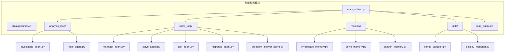

**Diagram sources**
- [main_solver.py](file://src/agents/solve/main_solver.py)
- [analysis_loop](file://src/agents/solve/analysis_loop/)
- [solve_loop](file://src/agents/solve/solve_loop/)
- [memory](file://src/agents/solve/memory/)
- [utils](file://src/agents/solve/utils/)

**Section sources**
- [main_solver.py](file://src/agents/solve/main_solver.py)
- [project_structure](file://project_structure)

## 核心组件
智能解题系统的核心组件包括主控制器`MainSolver`、双循环架构中的各个智能体（如`InvestigateAgent`、`SolveAgent`等）以及内存管理系统。`MainSolver`作为系统的入口点，负责初始化所有组件、管理配置和协调整个求解流程。双循环架构确保了问题解决过程的系统性和完整性，而内存管理系统则保证了信息在各组件间的有效传递和持久化。

**Section sources**
- [main_solver.py](file://src/agents/solve/main_solver.py)
- [base_agent.py](file://src/agents/solve/base_agent.py)

## 架构概述
智能解题系统采用双循环架构，分为分析循环和求解循环。分析循环通过`InvestigateAgent`和`NoteAgent`协作，深入理解用户问题并收集相关信息。求解循环则由`ManagerAgent`、`SolveAgent`、`ToolAgent`和`ResponseAgent`等组成，负责制定解决方案、执行具体操作并生成最终答案。整个流程通过内存系统（`InvestigateMemory`、`SolveMemory`、`CitationMemory`）进行状态管理和信息传递。

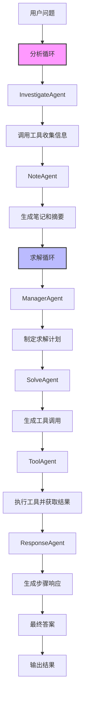

**Diagram sources**
- [main_solver.py](file://src/agents/solve/main_solver.py)
- [investigate_agent.py](file://src/agents/solve/analysis_loop/investigate_agent.py)
- [note_agent.py](file://src/agents/solve/analysis_loop/note_agent.py)
- [manager_agent.py](file://src/agents/solve/solve_loop/manager_agent.py)
- [solve_agent.py](file://src/agents/solve/solve_loop/solve_agent.py)
- [tool_agent.py](file://src/agents/solve/solve_loop/tool_agent.py)
- [response_agent.py](file://src/agents/solve/solve_loop/response_agent.py)

## 详细组件分析

### 主控制器分析
`MainSolver`是智能解题系统的主控制器，负责协调整个求解流程。它通过`_run_dual_loop_pipeline`方法执行双循环流程，首先在分析循环中收集信息，然后在求解循环中生成答案。该类还负责配置验证、日志记录和性能监控。

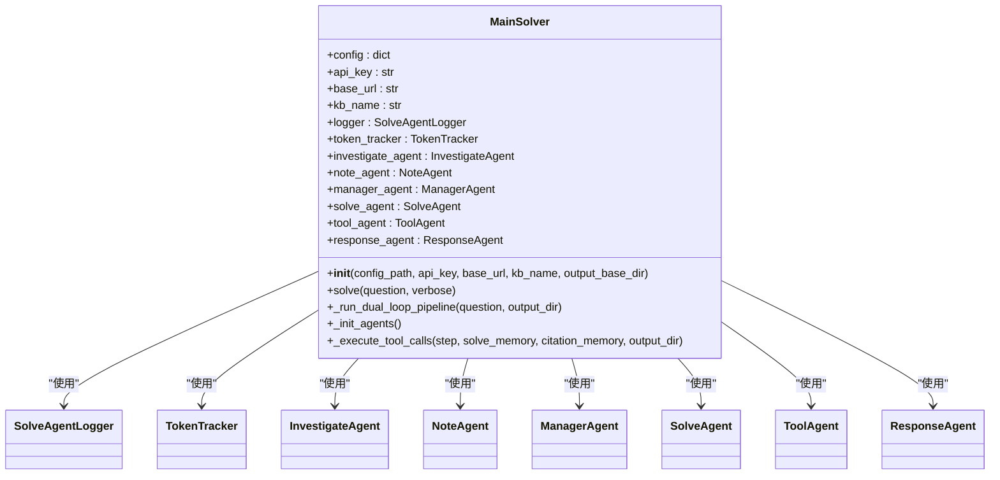

**Diagram sources**
- [main_solver.py](file://src/agents/solve/main_solver.py)

**Section sources**
- [main_solver.py](file://src/agents/solve/main_solver.py)

### 分析循环分析
分析循环由`InvestigateAgent`和`NoteAgent`组成，负责深入理解用户问题并收集相关信息。`InvestigateAgent`生成查询并调用各种工具（如RAG检索、网络搜索等）来获取知识，而`NoteAgent`则对获取的知识进行总结和注释。

#### InvestigateAgent分析
`InvestigateAgent`是分析循环的核心，负责生成查询并调用工具。它通过`process`方法接收用户问题和内存状态，构建上下文，调用LLM生成查询计划，并执行工具调用。

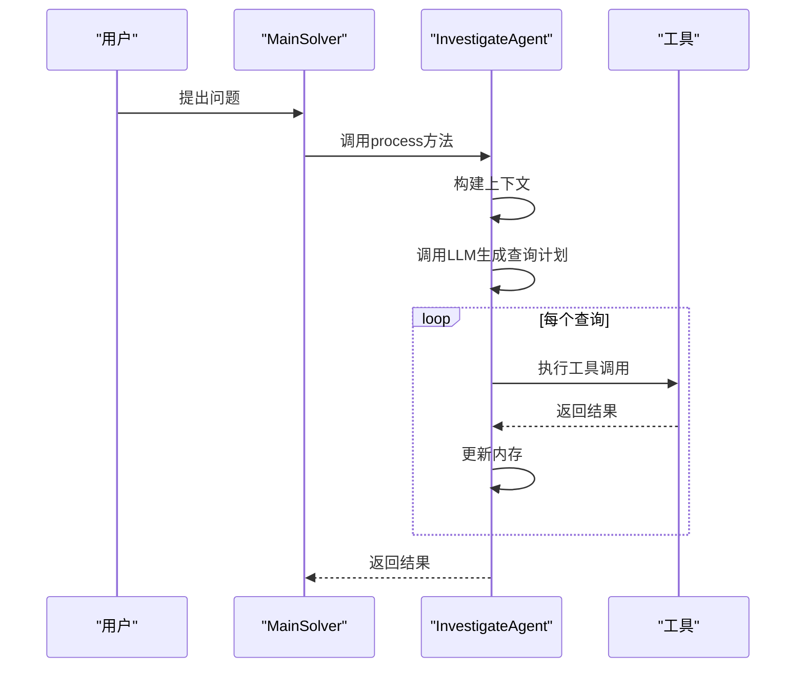

**Diagram sources**
- [investigate_agent.py](file://src/agents/solve/analysis_loop/investigate_agent.py)

#### NoteAgent分析
`NoteAgent`负责对`InvestigateAgent`获取的知识进行总结和注释。它通过`process`方法接收新的知识项，调用LLM生成摘要，并更新内存中的知识条目。

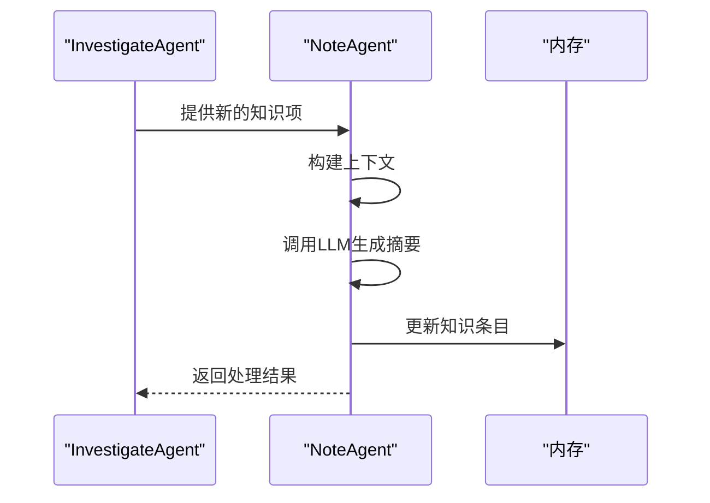

**Diagram sources**
- [note_agent.py](file://src/agents/solve/analysis_loop/note_agent.py)

### 求解循环分析
求解循环负责制定解决方案、执行具体操作并生成最终答案。它由多个智能体组成，每个智能体负责特定的任务，如计划制定、工具调用、结果执行和响应生成。

#### ManagerAgent分析
`ManagerAgent`负责制定求解计划。它基于用户问题和分析循环收集的知识，生成一个详细的求解步骤列表。

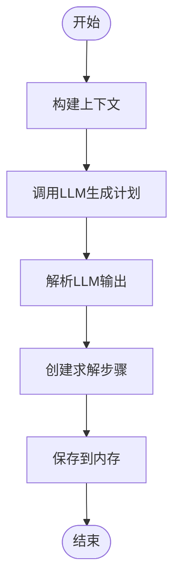

**Diagram sources**
- [manager_agent.py](file://src/agents/solve/solve_loop/manager_agent.py)

#### SolveAgent分析
`SolveAgent`负责生成工具调用计划。它基于当前求解步骤和可用知识，决定需要调用哪些工具来获取更多信息。

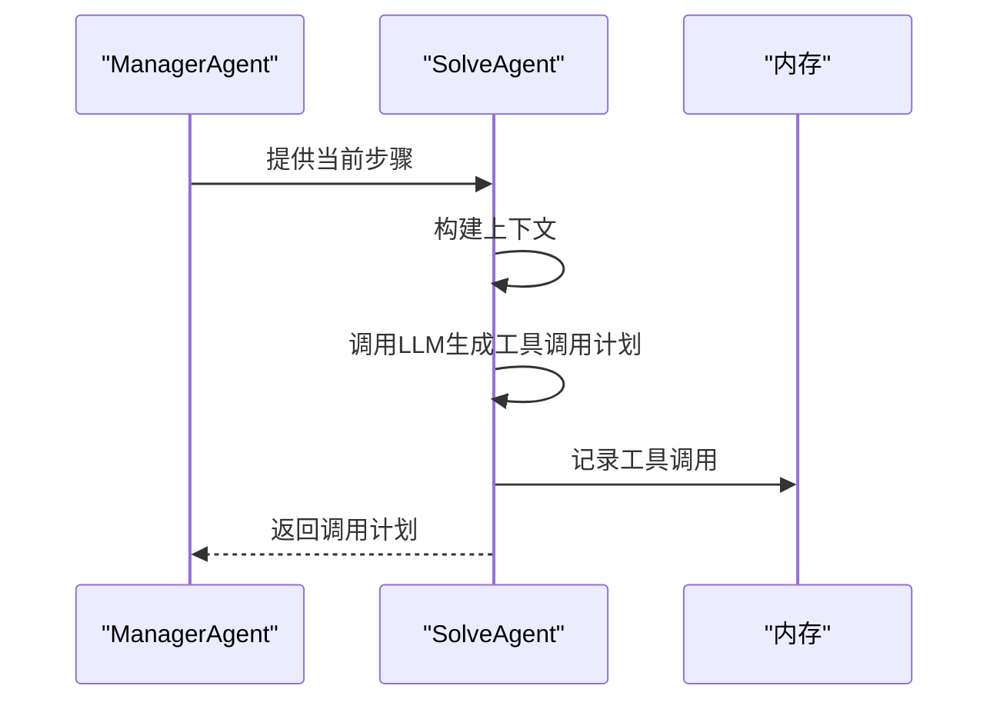

**Diagram sources**
- [solve_agent.py](file://src/agents/solve/solve_loop/solve_agent.py)

#### ToolAgent分析
`ToolAgent`负责执行`SolveAgent`生成的工具调用。它调用具体的工具（如RAG检索、代码执行等）并处理返回结果。

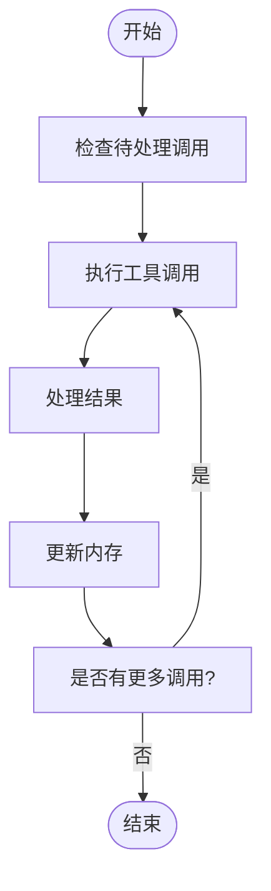

**Diagram sources**
- [tool_agent.py](file://src/agents/solve/solve_loop/tool_agent.py)

#### ResponseAgent分析
`ResponseAgent`负责生成每个求解步骤的正式响应。它基于工具调用结果和可用知识，生成易于理解的答案。

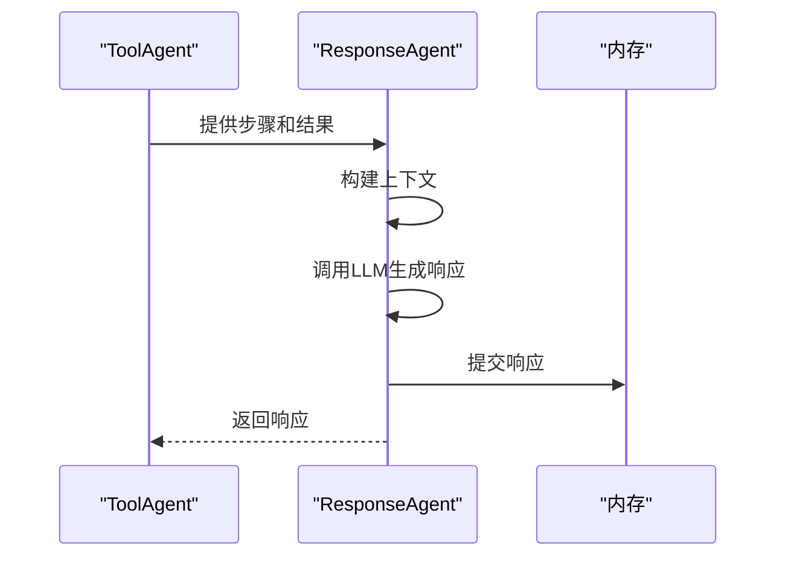

**Diagram sources**
- [response_agent.py](file://src/agents/solve/solve_loop/response_agent.py)

### 内存系统分析
智能解题系统使用三个内存组件来管理不同阶段的信息：`InvestigateMemory`用于分析循环，`SolveMemory`用于求解循环，`CitationMemory`用于全局引用管理。

#### 内存关系图
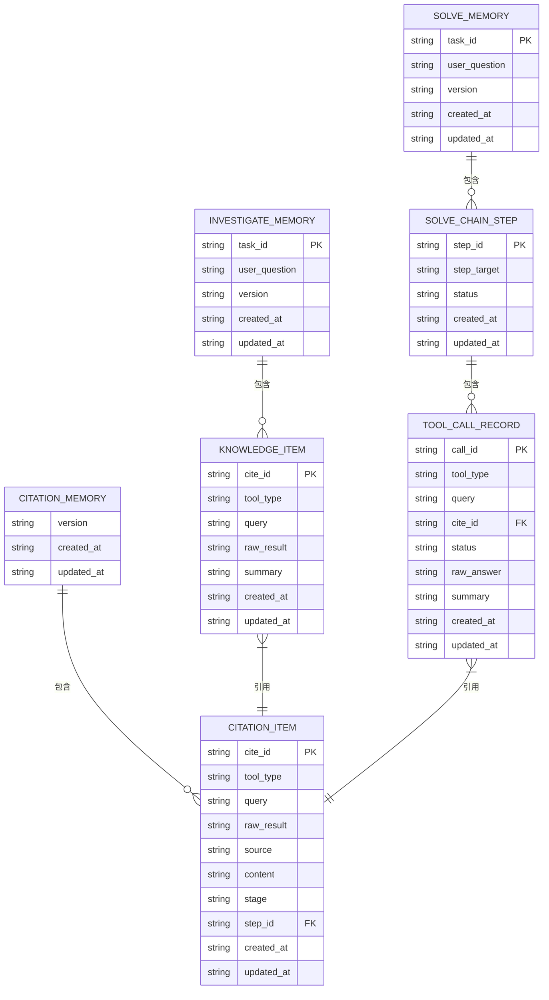

**Diagram sources**
- [investigate_memory.py](file://src/agents/solve/memory/investigate_memory.py)
- [solve_memory.py](file://src/agents/solve/memory/solve_memory.py)
- [citation_memory.py](file://src/agents/solve/memory/citation_memory.py)

## 依赖分析
智能解题系统依赖于多个外部组件和配置文件。系统通过`config/main.yaml`进行全局配置，包括路径、工具启用状态和智能体参数。各个智能体依赖于`BaseAgent`提供的统一接口，而内存系统则负责在各组件间传递信息。

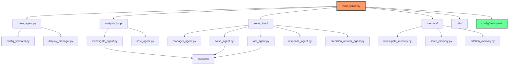

**Diagram sources**
- [main_solver.py](file://src/agents/solve/main_solver.py)
- [config_validator.py](file://src/agents/solve/utils/config_validator.py)
- [display_manager.py](file://src/agents/solve/utils/display_manager.py)
- [main.yaml](file://config/main.yaml)

**Section sources**
- [main_solver.py](file://src/agents/solve/main_solver.py)
- [config_validator.py](file://src/agents/solve/utils/config_validator.py)
- [display_manager.py](file://src/agents/solve/utils/display_manager.py)
- [main.yaml](file://config/main.yaml)

## 性能考虑
智能解题系统在设计时考虑了性能和成本因素。系统通过`TokenTracker`跟踪LLM调用的Token使用情况，并在最终报告中提供成本摘要。`PerformanceMonitor`虽然已弃用，但系统仍保留了性能监控的框架。配置文件中的`max_solve_correction_iterations`等参数限制了求解循环的最大迭代次数，防止无限循环。

## 故障排除指南
### 常见问题及解决方案
1. **问题：LLM模型未配置**
   - **症状**：系统启动时报错"Environment variable LLM_MODEL is not set"
   - **解决方案**：在`.env`文件中设置`LLM_MODEL`环境变量，例如`LLM_MODEL=gpt-4o-mini`

2. **问题：网络搜索被禁用**
   - **症状**：`InvestigateAgent`无法执行网络搜索
   - **解决方案**：检查`config/main.yaml`中的`tools.web_search.enabled`设置，确保其为`true`

3. **问题：代码执行失败**
   - **症状**：`ToolAgent`执行代码时返回路径错误
   - **解决方案**：确保代码中引用的文件路径正确，工作目录为`artifacts`，应直接使用文件名而非`artifacts/xxx.png`

4. **问题：引用生成失败**
   - **症状**：最终答案中缺少引用或引用格式错误
   - **解决方案**：检查`config/main.yaml`中的`solve.enable_citations`设置，确保其为`true`

**Section sources**
- [base_agent.py](file://src/agents/solve/base_agent.py)
- [main.yaml](file://config/main.yaml)
- [tool_agent.py](file://src/agents/solve/solve_loop/tool_agent.py)
- [citation_memory.py](file://src/agents/solve/memory/citation_memory.py)

## 结论
智能解题系统通过双循环架构实现了复杂问题的系统性解决。分析循环深入理解问题并收集相关信息，求解循环则制定详细计划并生成最终答案。系统设计模块化，各组件职责分明，通过内存系统进行状态管理和信息传递。配置文件提供了灵活的参数调整能力，使得系统可以根据不同需求进行定制。整体架构既保证了问题解决的全面性，又通过性能和成本监控确保了系统的实用性。