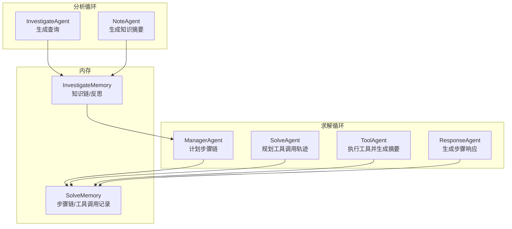
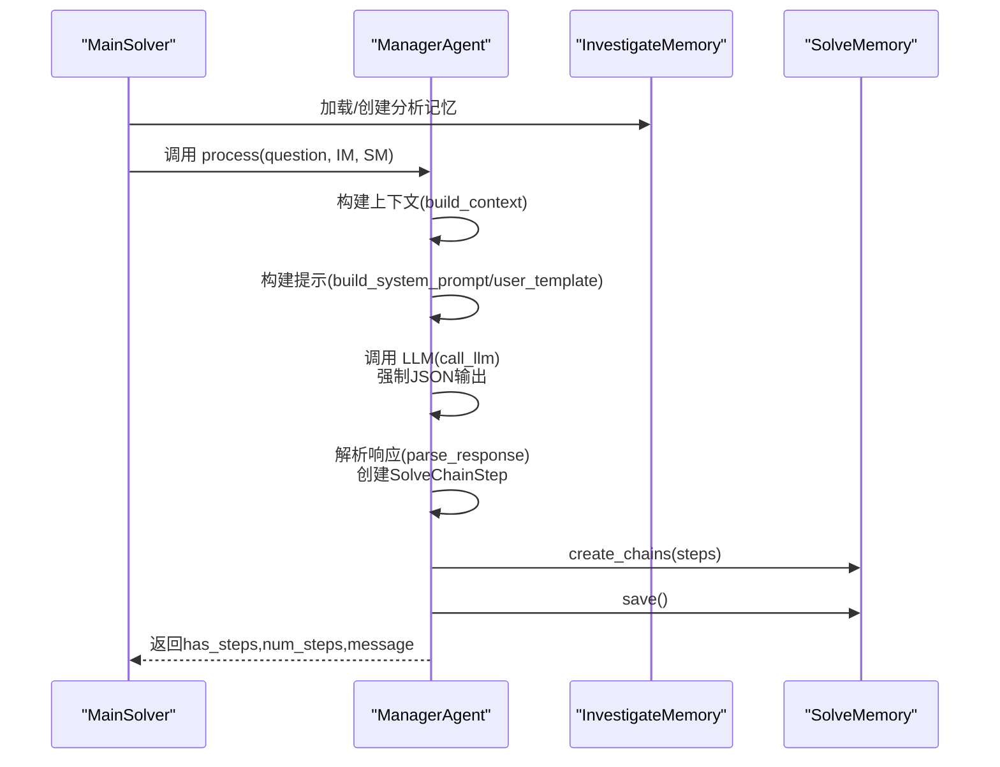
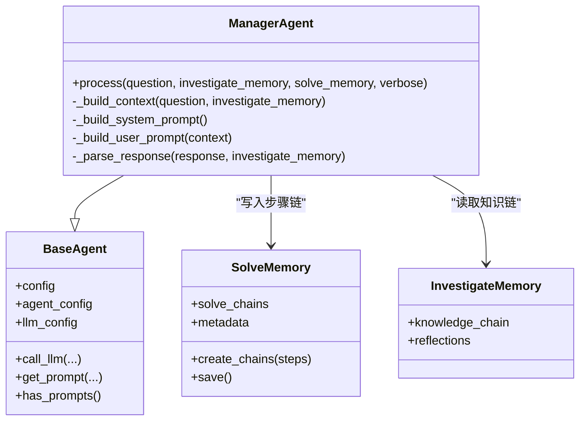
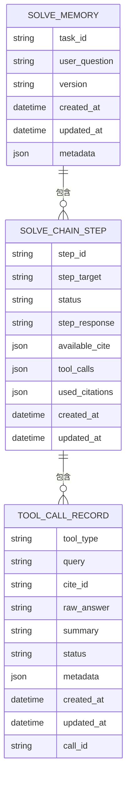
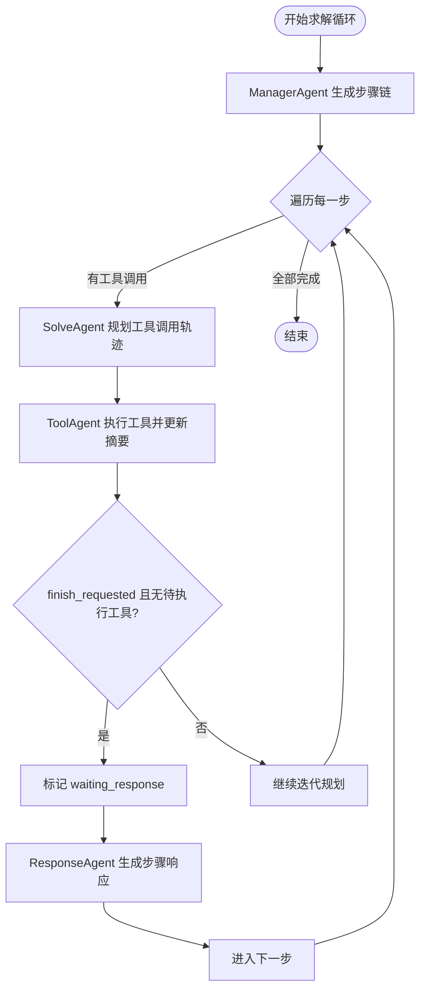
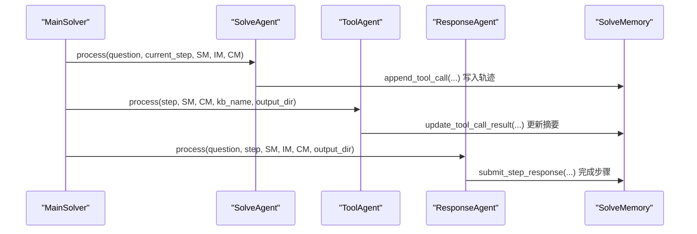
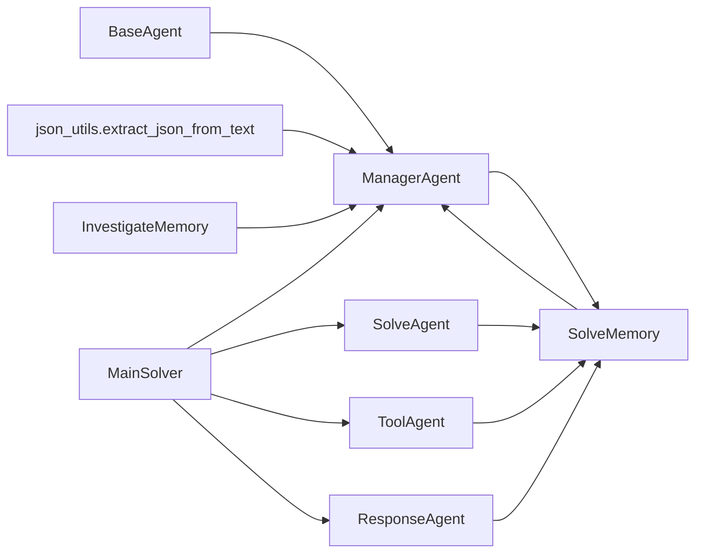

# ManagerAgent

<cite>
**本文引用的文件**
- [src/agents/solve/solve_loop/manager_agent.py](file://src/agents/solve/solve_loop/manager_agent.py)
- [src/agents/solve/memory/solve_memory.py](file://src/agents/solve/memory/solve_memory.py)
- [src/agents/solve/memory/investigate_memory.py](file://src/agents/solve/memory/investigate_memory.py)
- [src/agents/solve/base_agent.py](file://src/agents/solve/base_agent.py)
- [src/agents/solve/solve_loop/solve_agent.py](file://src/agents/solve/solve_loop/solve_agent.py)
- [src/agents/solve/solve_loop/tool_agent.py](file://src/agents/solve/solve_loop/tool_agent.py)
- [src/agents/solve/solve_loop/response_agent.py](file://src/agents/solve/solve_loop/response_agent.py)
- [src/agents/solve/main_solver.py](file://src/agents/solve/main_solver.py)
- [src/agents/solve/utils/json_utils.py](file://src/agents/solve/utils/json_utils.py)
- [src/agents/solve/prompts/zh/solve_loop/manager_agent.yaml](file://src/agents/solve/prompts/zh/solve_loop/manager_agent.yaml)
- [config/agents.yaml](file://config/agents.yaml)
- [config/main.yaml](file://config/main.yaml)
</cite>

## 目录
1. [简介](#简介)
2. [项目结构](#项目结构)
3. [核心组件](#核心组件)
4. [架构总览](#架构总览)
5. [详细组件分析](#详细组件分析)
6. [依赖分析](#依赖分析)
7. [性能考虑](#性能考虑)
8. [故障排查指南](#故障排查指南)
9. [结论](#结论)
10. [附录](#附录)

## 简介
本文件系统化阐述 ManagerAgent 的职责、接口、数据结构、状态流转与异常处理机制，并结合其与 SolveAgent、ToolAgent、ResponseAgent 的协作关系，解释其在“求解循环”中的核心地位：接收初始问题、基于分析阶段的知识链进行任务分解、制定可执行的“解答步骤链”，并在后续循环中协调工具调用与响应生成，最终形成完整答案。文档还涵盖与 solve_memory 的集成方式、配置参数来源、典型使用场景与性能优化建议。

## 项目结构
ManagerAgent 所属的“求解循环”位于 solve 子模块，采用双环架构：先进行“分析循环”（Investigate → Note），再进入“求解循环”（Plan → Manager → Solve → Tool → Response）。ManagerAgent 位于求解循环的起点，负责“计划”阶段的任务分解与步骤创建。

图表来源
- [src/agents/solve/main_solver.py](file://src/agents/solve/main_solver.py#L300-L743)
- [src/agents/solve/solve_loop/manager_agent.py](file://src/agents/solve/solve_loop/manager_agent.py#L33-L98)
- [src/agents/solve/solve_loop/solve_agent.py](file://src/agents/solve/solve_loop/solve_agent.py#L44-L163)
- [src/agents/solve/solve_loop/tool_agent.py](file://src/agents/solve/solve_loop/tool_agent.py#L39-L184)
- [src/agents/solve/solve_loop/response_agent.py](file://src/agents/solve/solve_loop/response_agent.py#L35-L79)
- [src/agents/solve/memory/investigate_memory.py](file://src/agents/solve/memory/investigate_memory.py#L63-L227)
- [src/agents/solve/memory/solve_memory.py](file://src/agents/solve/memory/solve_memory.py#L124-L341)

章节来源
- [src/agents/solve/main_solver.py](file://src/agents/solve/main_solver.py#L300-L743)

## 核心组件
- ManagerAgent：负责将用户问题与分析阶段的知识链结合，生成“解答步骤链”。其 process 接口接收 question、investigate_memory、solve_memory，返回是否已有步骤、步骤数量等元信息。
- SolveMemory：承载“解答步骤链”的持久化存储，包含步骤对象、工具调用记录、引用使用情况与统计元数据。
- InvestigateMemory：承载分析阶段的知识链与反思信息，为 ManagerAgent 提供上下文。
- SolveAgent：在每一步中评估材料并规划工具调用轨迹，写入 SolveMemory 的工具调用记录。
- ToolAgent：执行工具调用，更新工具调用记录的状态与摘要，并同步 CitationMemory。
- ResponseAgent：基于步骤材料与引用生成正式的步骤响应，写回 SolveMemory 的 step_response 并标记完成。
- BaseAgent：统一的 LLM 调用接口、提示词加载、日志与令牌追踪能力。

章节来源
- [src/agents/solve/solve_loop/manager_agent.py](file://src/agents/solve/solve_loop/manager_agent.py#L20-L98)
- [src/agents/solve/memory/solve_memory.py](file://src/agents/solve/memory/solve_memory.py#L124-L341)
- [src/agents/solve/memory/investigate_memory.py](file://src/agents/solve/memory/investigate_memory.py#L63-L227)
- [src/agents/solve/solve_loop/solve_agent.py](file://src/agents/solve/solve_loop/solve_agent.py#L44-L163)
- [src/agents/solve/solve_loop/tool_agent.py](file://src/agents/solve/solve_loop/tool_agent.py#L39-L184)
- [src/agents/solve/solve_loop/response_agent.py](file://src/agents/solve/solve_loop/response_agent.py#L35-L79)
- [src/agents/solve/base_agent.py](file://src/agents/solve/base_agent.py#L109-L278)

## 架构总览
ManagerAgent 在 MainSolver 的“求解循环”中扮演“计划者”角色，其调用链如下：

图表来源
- [src/agents/solve/main_solver.py](file://src/agents/solve/main_solver.py#L465-L491)
- [src/agents/solve/solve_loop/manager_agent.py](file://src/agents/solve/solve_loop/manager_agent.py#L33-L98)
- [src/agents/solve/base_agent.py](file://src/agents/solve/base_agent.py#L161-L278)

章节来源
- [src/agents/solve/main_solver.py](file://src/agents/solve/main_solver.py#L465-L491)
- [src/agents/solve/solve_loop/manager_agent.py](file://src/agents/solve/solve_loop/manager_agent.py#L33-L98)

## 详细组件分析

### ManagerAgent 类与接口
- 继承自 BaseAgent，具备统一的 LLM 调用、提示词加载、日志与令牌追踪能力。
- 主要接口：
  - process(question, investigate_memory, solve_memory, verbose=True) -> dict
    - 输入：用户问题、分析阶段知识链、求解阶段内存
    - 行为：若已存在步骤则跳过；否则构建上下文、构建提示、调用 LLM、解析 JSON、创建步骤并写入 SolveMemory
    - 输出：包含 has_steps、steps_count、message 等键的结果字典
- 关键内部方法：
  - _build_context：从 InvestigateMemory 中提取知识链摘要、反思剩余问题等
  - _build_system_prompt/_build_user_prompt：从 YAML 提示词加载系统提示与模板
  - _parse_response：解析 LLM JSON 输出，校验字段，规范化 cite_ids，构造 SolveChainStep 列表

图表来源
- [src/agents/solve/solve_loop/manager_agent.py](file://src/agents/solve/solve_loop/manager_agent.py#L20-L263)
- [src/agents/solve/base_agent.py](file://src/agents/solve/base_agent.py#L25-L323)
- [src/agents/solve/memory/solve_memory.py](file://src/agents/solve/memory/solve_memory.py#L124-L219)
- [src/agents/solve/memory/investigate_memory.py](file://src/agents/solve/memory/investigate_memory.py#L63-L168)

章节来源
- [src/agents/solve/solve_loop/manager_agent.py](file://src/agents/solve/solve_loop/manager_agent.py#L20-L263)
- [src/agents/solve/prompts/zh/solve_loop/manager_agent.yaml](file://src/agents/solve/prompts/zh/solve_loop/manager_agent.yaml#L1-L67)

### 数据结构与状态管理
- SolveChainStep：单个步骤的数据结构，包含 step_id、step_target、available_cite、tool_calls、step_response、status、used_citations 等字段，并提供 to_dict/from_dict 序列化与状态变更方法（append_tool_call、update_response、mark_waiting_response）。
- SolveMemory：维护 solve_chains 列表与 metadata（总数、完成数、工具调用总数），提供 create_chains、get_step、get_current_step、append_tool_call、update_tool_call_result、mark_step_waiting_response、submit_step_response、get_summary 等方法。
- InvestigateMemory：维护知识链 knowledge_chain 与反思 Reflections，提供 to_dict/load_or_create/save 等方法。

图表来源
- [src/agents/solve/memory/solve_memory.py](file://src/agents/solve/memory/solve_memory.py#L67-L123)
- [src/agents/solve/memory/solve_memory.py](file://src/agents/solve/memory/solve_memory.py#L124-L341)

章节来源
- [src/agents/solve/memory/solve_memory.py](file://src/agents/solve/memory/solve_memory.py#L67-L123)
- [src/agents/solve/memory/solve_memory.py](file://src/agents/solve/memory/solve_memory.py#L124-L341)

### 步骤调度与循环控制
- MainSolver 在“求解循环”中按顺序执行：
  1) 计划：ManagerAgent.process 创建步骤链
  2) 执行：SolveAgent 为每一步规划工具调用轨迹，ToolAgent 执行工具并更新摘要
  3) 响应：ResponseAgent 生成步骤响应，写回 SolveMemory
- 循环控制要点：
  - 若某步 finish_requested 且无待执行工具，则标记为 waiting_response，等待 ResponseAgent 处理
  - 最大修正迭代次数由配置项控制，防止无限循环
  - 每步完成后更新 SolveMemory.metadata 并保存

图表来源
- [src/agents/solve/main_solver.py](file://src/agents/solve/main_solver.py#L495-L641)
- [src/agents/solve/solve_loop/solve_agent.py](file://src/agents/solve/solve_loop/solve_agent.py#L44-L163)
- [src/agents/solve/solve_loop/tool_agent.py](file://src/agents/solve/solve_loop/tool_agent.py#L39-L184)
- [src/agents/solve/solve_loop/response_agent.py](file://src/agents/solve/solve_loop/response_agent.py#L35-L79)

章节来源
- [src/agents/solve/main_solver.py](file://src/agents/solve/main_solver.py#L495-L641)

### 与 SolveAgent、ToolAgent、ResponseAgent 的调用关系
- ManagerAgent 仅负责“计划”，不直接执行工具或生成响应。
- SolveAgent：接收当前步骤、SolveMemory、InvestigateMemory、CitationMemory，构建工具调用轨迹并写入 SolveMemory。
- ToolAgent：读取待执行工具调用，执行后更新摘要与状态，并同步 CitationMemory。
- ResponseAgent：汇总步骤材料与引用，生成正式响应并写回 SolveMemory。

图表来源
- [src/agents/solve/main_solver.py](file://src/agents/solve/main_solver.py#L524-L641)
- [src/agents/solve/solve_loop/solve_agent.py](file://src/agents/solve/solve_loop/solve_agent.py#L44-L163)
- [src/agents/solve/solve_loop/tool_agent.py](file://src/agents/solve/solve_loop/tool_agent.py#L39-L184)
- [src/agents/solve/solve_loop/response_agent.py](file://src/agents/solve/solve_loop/response_agent.py#L35-L79)

章节来源
- [src/agents/solve/main_solver.py](file://src/agents/solve/main_solver.py#L524-L641)
- [src/agents/solve/solve_loop/solve_agent.py](file://src/agents/solve/solve_loop/solve_agent.py#L44-L163)
- [src/agents/solve/solve_loop/tool_agent.py](file://src/agents/solve/solve_loop/tool_agent.py#L39-L184)
- [src/agents/solve/solve_loop/response_agent.py](file://src/agents/solve/solve_loop/response_agent.py#L35-L79)

### 输入输出数据结构与配置参数
- 输入
  - question: 用户问题字符串
  - investigate_memory: InvestigateMemory（包含 knowledge_chain、reflections）
  - solve_memory: SolveMemory（用于创建/保存步骤链）
- 输出
  - has_steps: 是否已有步骤
  - steps_count/num_steps: 步骤数量
  - message: 描述性信息
- 配置参数来源
  - 温度与最大 token：agents.yaml 中 solve 模块统一参数
  - LLM 模型：BaseAgent 从环境变量读取
  - 求解循环最大修正迭代次数：main.yaml 中 system.max_solve_correction_iterations
  - 工具执行超时：ToolAgent 从 agent_config 读取 code_timeout

章节来源
- [src/agents/solve/solve_loop/manager_agent.py](file://src/agents/solve/solve_loop/manager_agent.py#L23-L31)
- [src/agents/solve/base_agent.py](file://src/agents/solve/base_agent.py#L109-L160)
- [config/agents.yaml](file://config/agents.yaml#L10-L15)
- [config/main.yaml](file://config/main.yaml#L54-L56)
- [src/agents/solve/solve_loop/tool_agent.py](file://src/agents/solve/solve_loop/tool_agent.py#L236-L241)

### 实际使用场景示例：复杂数学题的分步求解流程控制
- 场景：用户提交“求解线性卷积”的问题
- 流程：
  1) 分析循环：InvestigateAgent 生成若干查询，NoteAgent 生成知识摘要，InvestigateMemory 保存知识链
  2) 求解循环：
     - ManagerAgent 基于知识链生成步骤链（如“推导卷积定义”、“计算具体表达式”、“验证结果”）
     - SolveAgent 为每一步规划工具调用（如“代码执行”、“检索资料”）
     - ToolAgent 执行工具并更新摘要
     - ResponseAgent 生成每一步的正式响应
  3) MainSolver 汇总各步骤响应，生成最终答案并保存

章节来源
- [src/agents/solve/main_solver.py](file://src/agents/solve/main_solver.py#L300-L743)

## 依赖分析
- ManagerAgent 依赖 BaseAgent 的 LLM 调用封装、提示词加载与日志系统
- ManagerAgent 依赖 JSON 解析工具以从 LLM 输出中提取结构化数据
- ManagerAgent 与 SolveMemory、InvestigateMemory 紧密耦合，前者写入后者，后者被其他 Agent 读取与更新
- MainSolver 协调 ManagerAgent 与其他 Agent 的生命周期与调用顺序

图表来源
- [src/agents/solve/base_agent.py](file://src/agents/solve/base_agent.py#L161-L278)
- [src/agents/solve/utils/json_utils.py](file://src/agents/solve/utils/json_utils.py#L12-L99)
- [src/agents/solve/solve_loop/manager_agent.py](file://src/agents/solve/solve_loop/manager_agent.py#L161-L263)
- [src/agents/solve/memory/investigate_memory.py](file://src/agents/solve/memory/investigate_memory.py#L63-L227)
- [src/agents/solve/memory/solve_memory.py](file://src/agents/solve/memory/solve_memory.py#L124-L341)
- [src/agents/solve/solve_loop/solve_agent.py](file://src/agents/solve/solve_loop/solve_agent.py#L44-L163)
- [src/agents/solve/solve_loop/tool_agent.py](file://src/agents/solve/solve_loop/tool_agent.py#L39-L184)
- [src/agents/solve/solve_loop/response_agent.py](file://src/agents/solve/solve_loop/response_agent.py#L35-L79)
- [src/agents/solve/main_solver.py](file://src/agents/solve/main_solver.py#L465-L641)

章节来源
- [src/agents/solve/base_agent.py](file://src/agents/solve/base_agent.py#L161-L278)
- [src/agents/solve/utils/json_utils.py](file://src/agents/solve/utils/json_utils.py#L12-L99)
- [src/agents/solve/solve_loop/manager_agent.py](file://src/agents/solve/solve_loop/manager_agent.py#L161-L263)
- [src/agents/solve/main_solver.py](file://src/agents/solve/main_solver.py#L465-L641)

## 性能考虑
- 减少不必要的状态轮询：MainSolver 在每步执行前检查是否有待执行工具，避免重复调用 ToolAgent
- 控制最大修正迭代次数：通过配置项限制 SolveAgent 的迭代上限，防止长时间卡顿
- 合理设置 LLM 参数：温度与最大 token 在 agents.yaml 中集中配置，避免不同 Agent 的硬编码差异导致资源浪费
- 令牌追踪与成本控制：BaseAgent 支持令牌追踪回调，MainSolver 在完成后输出成本报告并保存

章节来源
- [src/agents/solve/main_solver.py](file://src/agents/solve/main_solver.py#L495-L641)
- [config/agents.yaml](file://config/agents.yaml#L10-L15)
- [src/agents/solve/base_agent.py](file://src/agents/solve/base_agent.py#L161-L278)

## 故障排查指南
- 计划卡死或步骤为空
  - 现象：ManagerAgent 返回“已有步骤”或“空步骤”
  - 排查：确认 InvestigateMemory 中是否存在有效知识链；检查提示词是否正确加载；确认 LLM 输出符合 JSON 结构要求
  - 参考路径：
    - [src/agents/solve/solve_loop/manager_agent.py](file://src/agents/solve/solve_loop/manager_agent.py#L57-L66)
    - [src/agents/solve/solve_loop/manager_agent.py](file://src/agents/solve/solve_loop/manager_agent.py#L161-L263)
    - [src/agents/solve/prompts/zh/solve_loop/manager_agent.yaml](file://src/agents/solve/prompts/zh/solve_loop/manager_agent.yaml#L1-L67)
- 任务分配失败
  - 现象：SolveAgent 无法解析工具调用轨迹或返回空
  - 排查：检查 LLM 输出是否为合法 JSON；确认工具类型在支持集合内；查看 JSON 解析工具的容错策略
  - 参考路径：
    - [src/agents/solve/solve_loop/solve_agent.py](file://src/agents/solve/solve_loop/solve_agent.py#L75-L86)
    - [src/agents/solve/solve_loop/solve_agent.py](file://src/agents/solve/solve_loop/solve_agent.py#L254-L285)
    - [src/agents/solve/utils/json_utils.py](file://src/agents/solve/utils/json_utils.py#L12-L99)
- 工具执行异常
  - 现象：ToolAgent 抛出异常或状态标记为 failed
  - 排查：检查工具类型与查询预处理；查看代码执行超时与工作目录；确认引用 ID 与摘要一致性
  - 参考路径：
    - [src/agents/solve/solve_loop/tool_agent.py](file://src/agents/solve/solve_loop/tool_agent.py#L133-L167)
    - [src/agents/solve/solve_loop/tool_agent.py](file://src/agents/solve/solve_loop/tool_agent.py#L197-L272)
- 响应生成缺失
  - 现象：步骤未标记完成或缺少 step_response
  - 排查：确认 ResponseAgent 是否被调用；检查引用提取是否正确；核对 SolveMemory 的状态更新
  - 参考路径：
    - [src/agents/solve/solve_loop/response_agent.py](file://src/agents/solve/solve_loop/response_agent.py#L66-L79)
    - [src/agents/solve/memory/solve_memory.py](file://src/agents/solve/memory/solve_memory.py#L276-L288)

## 结论
ManagerAgent 在“求解循环”中承担“计划者”的核心职责，通过与分析阶段知识链的衔接，将抽象问题转化为可执行的步骤链，并为后续 SolveAgent、ToolAgent、ResponseAgent 的协作奠定基础。其接口简洁、状态管理清晰、错误处理完备，配合 MainSolver 的循环控制与配置体系，能够稳定地支撑复杂问题的分步求解流程。

## 附录
- 提示词配置位置：src/agents/solve/prompts/zh/solve_loop/manager_agent.yaml
- 统一温度与最大 token：config/agents.yaml
- 求解循环相关配置：config/main.yaml