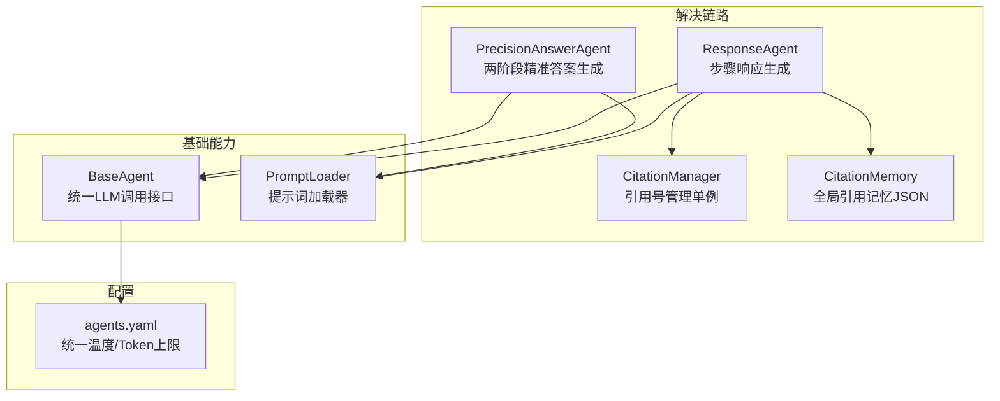
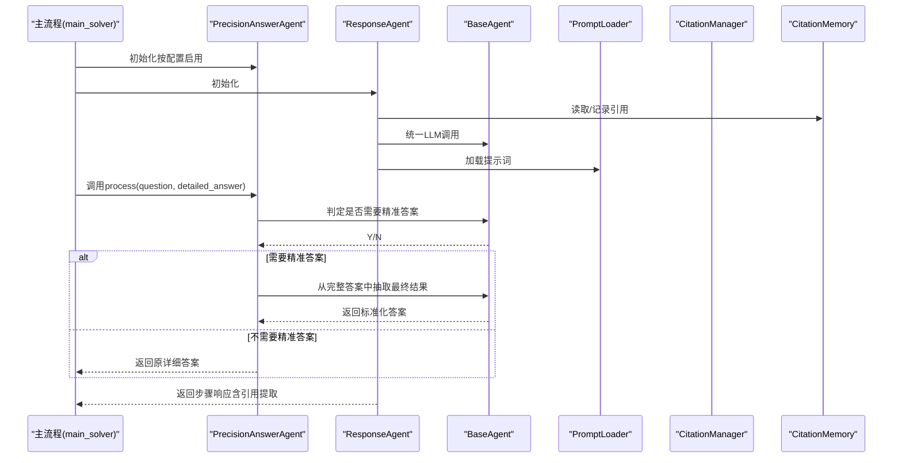
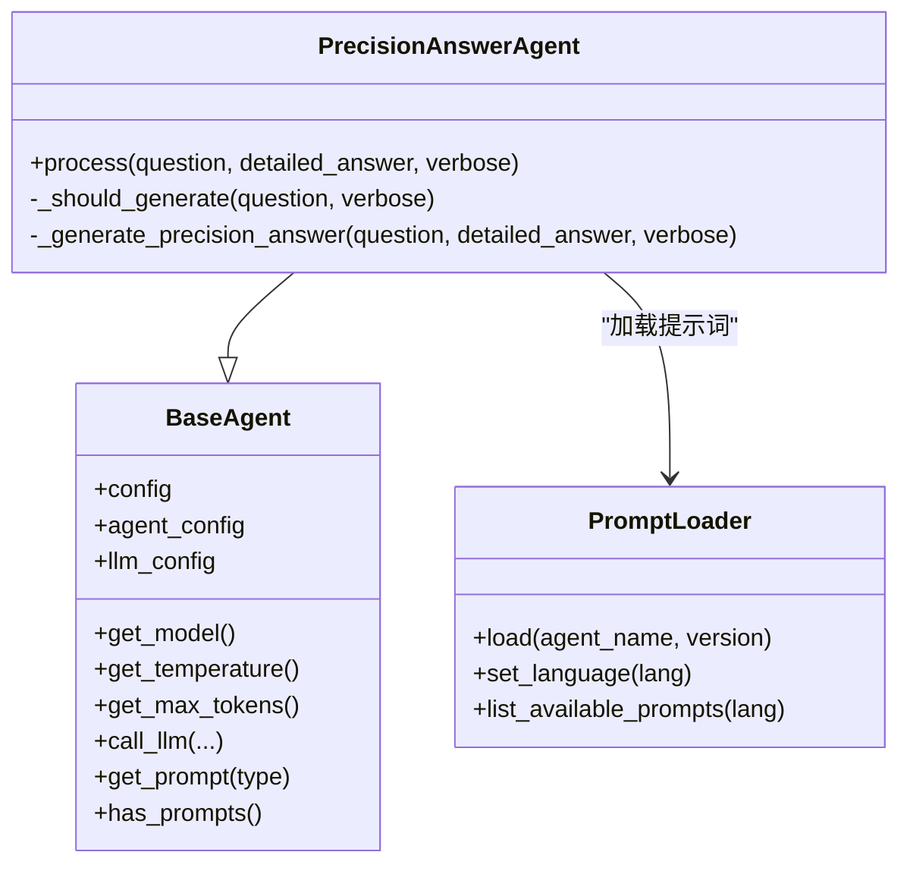
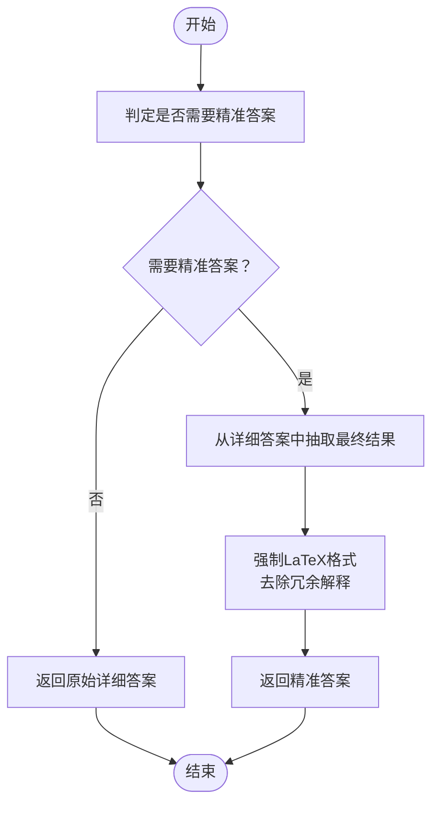
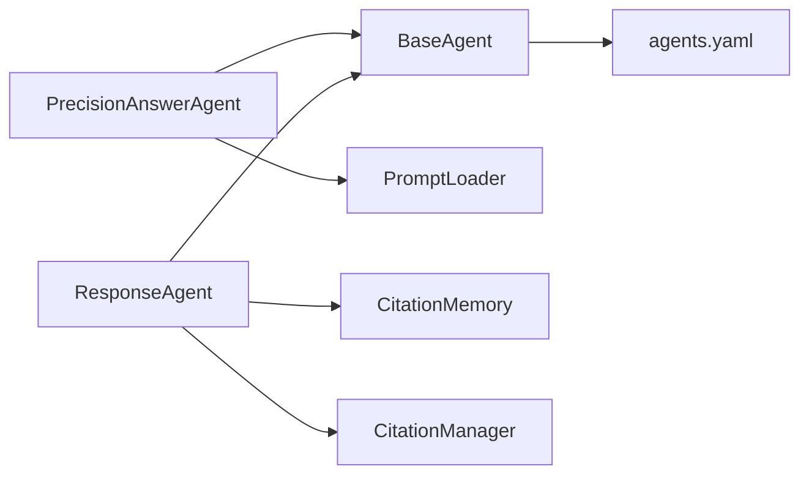

# PrecisionAnswerAgent

<cite>
**本文引用的文件列表**
- [precision_answer_agent.py](file://src/agents/solve/solve_loop/precision_answer_agent.py)
- [precision_answer_agent.yaml](file://src/agents/solve/prompts/zh/solve_loop/precision_answer_agent.yaml)
- [precision_answer_agent.yaml](file://src/agents/solve/prompts/en/solve_loop/precision_answer_agent.yaml)
- [response_agent.py](file://src/agents/solve/solve_loop/response_agent.py)
- [citation_manager.py](file://src/agents/solve/solve_loop/citation_manager.py)
- [citation_memory.py](file://src/agents/solve/memory/citation_memory.py)
- [base_agent.py](file://src/agents/solve/base_agent.py)
- [prompt_loader.py](file://src/agents/solve/utils/prompt_loader.py)
- [agents.yaml](file://config/agents.yaml)
- [main_solver.py](file://src/agents/solve/main_solver.py)
- [README.md](file://src/agents/solve/solve_loop/README.md)
</cite>

## 目录
1. [简介](#简介)
2. [项目结构](#项目结构)
3. [核心组件](#核心组件)
4. [架构总览](#架构总览)
5. [详细组件分析](#详细组件分析)
6. [依赖关系分析](#依赖关系分析)
7. [性能与精度特性](#性能与精度特性)
8. [故障排查指南](#故障排查指南)
9. [结论](#结论)
10. [附录](#附录)

## 简介
PrecisionAnswerAgent 是“高精度答案生成器”，专为需要严格、可验证、格式规范的最终答案场景设计，例如数学证明、科学计算、填空题、选择题等。它通过两阶段流程：
- 阶段一：判断是否需要“精准答案”（基于题型与问题性质）。
- 阶段二：从完整解题过程中抽取“最终结果”，并强制使用 LaTeX 格式，去除冗余解释，确保答案简洁、准确、可复核。

与常规 ResponseAgent 的区别在于：
- ResponseAgent 聚焦于“当前步骤”的详细响应，强调证据链、引用与格式规范，适合逐步展示推理过程；
- PrecisionAnswerAgent 聚焦于“最终答案”的提炼与标准化，强调可验证性与可读性，适合快速定位关键结论。

本节不直接分析具体文件，故无“章节来源”。

## 项目结构
PrecisionAnswerAgent 所在模块位于 solve 解决链路中，与 PromptLoader、BaseAgent、CitationMemory/CitationManager 等组件协同工作；其提示词位于 prompts 目录下，按语言分层组织。

图表来源
- [precision_answer_agent.py](file://src/agents/solve/solve_loop/precision_answer_agent.py#L1-L87)
- [response_agent.py](file://src/agents/solve/solve_loop/response_agent.py#L1-L290)
- [citation_manager.py](file://src/agents/solve/solve_loop/citation_manager.py#L1-L75)
- [citation_memory.py](file://src/agents/solve/memory/citation_memory.py#L1-L354)
- [base_agent.py](file://src/agents/solve/base_agent.py#L1-L323)
- [prompt_loader.py](file://src/agents/solve/utils/prompt_loader.py#L1-L325)
- [agents.yaml](file://config/agents.yaml#L1-L55)

章节来源
- [precision_answer_agent.py](file://src/agents/solve/solve_loop/precision_answer_agent.py#L1-L87)
- [response_agent.py](file://src/agents/solve/solve_loop/response_agent.py#L1-L290)
- [base_agent.py](file://src/agents/solve/base_agent.py#L1-L323)
- [prompt_loader.py](file://src/agents/solve/utils/prompt_loader.py#L1-L325)
- [agents.yaml](file://config/agents.yaml#L1-L55)

## 核心组件
- PrecisionAnswerAgent：实现两阶段流程，先判定是否需要精准答案，再从完整答案中抽取最终结果，并强制 LaTeX 格式。
- PromptLoader：按语言加载 YAML 提示词，支持缓存与版本控制。
- BaseAgent：统一 LLM 调用、日志、令牌统计与参数来源。
- CitationManager：全局单例，维护引用号分配与映射。
- CitationMemory：持久化存储引用条目，支持 Markdown 格式化输出。

章节来源
- [precision_answer_agent.py](file://src/agents/solve/solve_loop/precision_answer_agent.py#L1-L87)
- [prompt_loader.py](file://src/agents/solve/utils/prompt_loader.py#L1-L325)
- [base_agent.py](file://src/agents/solve/base_agent.py#L1-L323)
- [citation_manager.py](file://src/agents/solve/solve_loop/citation_manager.py#L1-L75)
- [citation_memory.py](file://src/agents/solve/memory/citation_memory.py#L1-L354)

## 架构总览
PrecisionAnswerAgent 在 solve 循环中作为可选环节被初始化与调用。其与 ResponseAgent 的职责边界清晰：前者负责“最终答案提炼”，后者负责“步骤响应生成”。二者均依赖 BaseAgent 的统一 LLM 接口与 PromptLoader 的提示词加载。

图表来源
- [main_solver.py](file://src/agents/solve/main_solver.py#L440-L556)
- [precision_answer_agent.py](file://src/agents/solve/solve_loop/precision_answer_agent.py#L1-L87)
- [response_agent.py](file://src/agents/solve/solve_loop/response_agent.py#L1-L290)
- [base_agent.py](file://src/agents/solve/base_agent.py#L1-L323)
- [prompt_loader.py](file://src/agents/solve/utils/prompt_loader.py#L1-L325)
- [citation_manager.py](file://src/agents/solve/solve_loop/citation_manager.py#L1-L75)
- [citation_memory.py](file://src/agents/solve/memory/citation_memory.py#L1-L354)

## 详细组件分析

### PrecisionAnswerAgent 类图
PrecisionAnswerAgent 继承自 BaseAgent，使用 PromptLoader 加载提示词，通过两次 LLM 调用完成“是否需要精准答案”的判定与“精准答案”的抽取。

图表来源
- [precision_answer_agent.py](file://src/agents/solve/solve_loop/precision_answer_agent.py#L1-L87)
- [base_agent.py](file://src/agents/solve/base_agent.py#L1-L323)
- [prompt_loader.py](file://src/agents/solve/utils/prompt_loader.py#L1-L325)

章节来源
- [precision_answer_agent.py](file://src/agents/solve/solve_loop/precision_answer_agent.py#L1-L87)
- [base_agent.py](file://src/agents/solve/base_agent.py#L1-L323)
- [prompt_loader.py](file://src/agents/solve/utils/prompt_loader.py#L1-L325)

### 处理流程与触发条件
- 触发条件：由 PrecisionAnswerAgent 自身的“是否需要精准答案”判定决定。该判定基于问题类型与问题性质，提示词明确列举了“需要精准答案”的场景（如选择题、填空题、计算题、判断题，以及能用一个词/一句话/一个公式回答的问题）。
- 流程：
  1) 判定阶段：根据问题构造用户提示，调用 LLM 判定是否需要精准答案。
  2) 抽取阶段：若需要，则从“详细答案”中抽取最终结果，强制使用 LaTeX 格式，去除冗余解释。
- 默认关闭：在默认配置中未启用，需在 agents.yaml 中显式开启。

图表来源
- [precision_answer_agent.py](file://src/agents/solve/solve_loop/precision_answer_agent.py#L31-L87)
- [precision_answer_agent.yaml](file://src/agents/solve/prompts/zh/solve_loop/precision_answer_agent.yaml#L1-L63)
- [precision_answer_agent.yaml](file://src/agents/solve/prompts/en/solve_loop/precision_answer_agent.yaml#L1-L63)

章节来源
- [precision_answer_agent.py](file://src/agents/solve/solve_loop/precision_answer_agent.py#L31-L87)
- [precision_answer_agent.yaml](file://src/agents/solve/prompts/zh/solve_loop/precision_answer_agent.yaml#L1-L63)
- [precision_answer_agent.yaml](file://src/agents/solve/prompts/en/solve_loop/precision_answer_agent.yaml#L1-L63)

### 与 ResponseAgent 的差异与协作
- 差异：
  - ResponseAgent：面向“当前步骤”的详细响应，强调证据链、引用与格式规范，适合逐步展示推理过程。
  - PrecisionAnswerAgent：面向“最终答案”的提炼与标准化，强调可验证性与可读性，适合快速定位关键结论。
- 协作：
  - 两者均依赖 BaseAgent 的统一 LLM 调用接口与 PromptLoader 的提示词加载。
  - ResponseAgent 内置引用提取与 CitationMemory/CitationManager 的协作，用于标注证据来源；PrecisionAnswerAgent 不直接参与引用提取，但其输出遵循 LaTeX 格式，便于后续统一排版与溯源。

章节来源
- [response_agent.py](file://src/agents/solve/solve_loop/response_agent.py#L1-L290)
- [base_agent.py](file://src/agents/solve/base_agent.py#L1-L323)
- [prompt_loader.py](file://src/agents/solve/utils/prompt_loader.py#L1-L325)

### 与 CitationManager 的协作方式
- PrecisionAnswerAgent 本身不直接管理引用号，也不直接读写 CitationMemory。
- 引用号分配与管理由 CitationManager（单例）负责，CitationMemory 负责持久化与格式化输出。
- 在 ResponseAgent 的步骤响应中会进行引用提取与标注，PrecisionAnswerAgent 的输出可与这些引用保持一致（通过 LaTeX 格式与引用标记约定）。

章节来源
- [citation_manager.py](file://src/agents/solve/solve_loop/citation_manager.py#L1-L75)
- [citation_memory.py](file://src/agents/solve/memory/citation_memory.py#L1-L354)
- [response_agent.py](file://src/agents/solve/solve_loop/response_agent.py#L1-L290)

### 触发条件配置与精度等级设置
- 触发条件配置：在 agents.yaml 中对 precision_answer_agent 设置 enabled 字段以启用。
- 精度等级设置：通过统一的 solve 模块参数 temperature 与 max_tokens 控制（agents.yaml 中已为 solve 模块设定）。此外，BaseAgent 支持按 agent 级别覆盖 max_retries 等参数。
- PromptLoader 会根据系统语言自动加载对应语言的提示词文件。

章节来源
- [agents.yaml](file://config/agents.yaml#L1-L55)
- [base_agent.py](file://src/agents/solve/base_agent.py#L1-L323)
- [prompt_loader.py](file://src/agents/solve/utils/prompt_loader.py#L1-L325)
- [main_solver.py](file://src/agents/solve/main_solver.py#L440-L556)

### 典型应用场景
- 数学证明：从完整证明过程抽取最终结论，使用 LaTeX 表达式，避免冗长推导。
- 科学计算：从复杂计算步骤中提取最终数值或公式，确保单位与有效数字符合要求。
- 选择题/填空题：仅输出选项字母或最终数值，严格遵守“去脂存肉”的原则。
- 快速参考：生成 1-2 段精炼总结，便于复习与查阅。

本节为概念性说明，不直接分析具体文件，故无“章节来源”。

### 结果校验、单位转换、有效数字控制与公式标准化
- 结果校验：PrecisionAnswerAgent 通过“是否需要精准答案”的判定与“最终结果抽取”两个阶段，减少冗余信息，提升可验证性。
- 单位转换与有效数字控制：建议在上游工具（如代码执行、公式解析）阶段完成，PrecisionAnswerAgent 仅负责抽取与格式化，确保最终输出符合 LaTeX 标准。
- 公式标准化：提示词明确规定所有数学表达式必须使用 LaTeX 包裹，禁止裸露数学符号，保证跨平台一致性与可渲染性。

章节来源
- [precision_answer_agent.yaml](file://src/agents/solve/prompts/zh/solve_loop/precision_answer_agent.yaml#L1-L63)
- [precision_answer_agent.yaml](file://src/agents/solve/prompts/en/solve_loop/precision_answer_agent.yaml#L1-L63)

## 依赖关系分析
- 组件耦合：
  - PrecisionAnswerAgent 与 BaseAgent 强耦合（统一 LLM 调用、参数来源、日志与令牌统计）。
  - 与 PromptLoader 弱耦合（仅在需要时加载提示词）。
  - 与 CitationManager/CitationMemory 无直接耦合，但通过 ResponseAgent 的引用机制间接关联。
- 外部依赖：
  - LLM 调用封装来自 openai_complete_if_cache（BaseAgent 内部），受环境变量 LLM_MODEL 影响。
  - agents.yaml 提供统一温度与最大 Token 上限，影响所有 solve 模块 Agent。

图表来源
- [precision_answer_agent.py](file://src/agents/solve/solve_loop/precision_answer_agent.py#L1-L87)
- [response_agent.py](file://src/agents/solve/solve_loop/response_agent.py#L1-L290)
- [base_agent.py](file://src/agents/solve/base_agent.py#L1-L323)
- [prompt_loader.py](file://src/agents/solve/utils/prompt_loader.py#L1-L325)
- [citation_manager.py](file://src/agents/solve/solve_loop/citation_manager.py#L1-L75)
- [citation_memory.py](file://src/agents/solve/memory/citation_memory.py#L1-L354)
- [agents.yaml](file://config/agents.yaml#L1-L55)

章节来源
- [precision_answer_agent.py](file://src/agents/solve/solve_loop/precision_answer_agent.py#L1-L87)
- [response_agent.py](file://src/agents/solve/solve_loop/response_agent.py#L1-L290)
- [base_agent.py](file://src/agents/solve/base_agent.py#L1-L323)
- [prompt_loader.py](file://src/agents/solve/utils/prompt_loader.py#L1-L325)
- [citation_manager.py](file://src/agents/solve/solve_loop/citation_manager.py#L1-L75)
- [citation_memory.py](file://src/agents/solve/memory/citation_memory.py#L1-L354)
- [agents.yaml](file://config/agents.yaml#L1-L55)

## 性能与精度特性
- 温度与 Token 上限：solve 模块统一设置 temperature 与 max_tokens，有助于稳定输出长度与风格；PrecisionAnswerAgent 的“精准答案”抽取阶段通常较短，可进一步降低 max_tokens 以节省成本。
- 重试机制：BaseAgent 支持按 agent 级别覆盖 max_retries，可在 LLM 输出不稳定时提高成功率。
- 日志与统计：BaseAgent 提供统一的日志与令牌统计接口，便于监控与优化。

章节来源
- [agents.yaml](file://config/agents.yaml#L1-L55)
- [base_agent.py](file://src/agents/solve/base_agent.py#L1-L323)

## 故障排查指南
- 提示词缺失：
  - 现象：运行时报错提示缺少 decision_system/decision_user_template/precision_system/precision_user_template。
  - 处理：确认 prompts/zh/solve_loop/precision_answer_agent.yaml 或 prompts/en/solve_loop/precision_answer_agent.yaml 是否存在且结构正确。
- LLM 模型未配置：
  - 现象：报错提示未设置 LLM_MODEL。
  - 处理：在环境变量中设置 LLM_MODEL。
- 引用提取异常：
  - 现象：ResponseAgent 的引用提取结果异常。
  - 处理：检查引用标记格式（如 [cite] 或全角【cite】），确保与提示词约定一致；必要时调整正则匹配逻辑。
- 精度偏差问题：
  - 浮点数误差累积：在上游工具（如代码执行）中进行数值收敛与舍入；PrecisionAnswerAgent 仅负责抽取与格式化。
  - 公式解析错误：确保上游工具输出的 LaTeX 符号与语法正确；PrecisionAnswerAgent 对最终输出进行格式约束，不承担解析责任。

章节来源
- [precision_answer_agent.py](file://src/agents/solve/solve_loop/precision_answer_agent.py#L51-L87)
- [base_agent.py](file://src/agents/solve/base_agent.py#L120-L132)
- [response_agent.py](file://src/agents/solve/solve_loop/response_agent.py#L268-L290)

## 结论
PrecisionAnswerAgent 通过“是否需要精准答案”的两阶段判定与抽取，显著提升了最终答案的可验证性与可读性，适用于数学证明、科学计算、填空/选择题等高精度场景。其与 ResponseAgent 的职责互补：前者聚焦“最终结果”，后者聚焦“步骤响应”。通过 PromptLoader、BaseAgent、CitationManager/CitationMemory 的协同，系统实现了统一的提示词管理、LLM 调用与引用标注。建议在需要快速定位关键结论与生成可复核答案时启用该组件，并配合上游工具的数值与公式规范化，确保整体输出质量。

本节为总结性内容，不直接分析具体文件，故无“章节来源”。

## 附录
- 启用方式：在 agents.yaml 中设置 precision_answer_agent.enabled 为 true。
- 提示词位置：prompts/zh/solve_loop/precision_answer_agent.yaml 与 prompts/en/solve_loop/precision_answer_agent.yaml。
- 相关文档：solve_loop/README.md 中对 PrecisionAnswerAgent 的功能与配置有简要说明。

章节来源
- [main_solver.py](file://src/agents/solve/main_solver.py#L440-L556)
- [README.md](file://src/agents/solve/solve_loop/README.md#L118-L379)