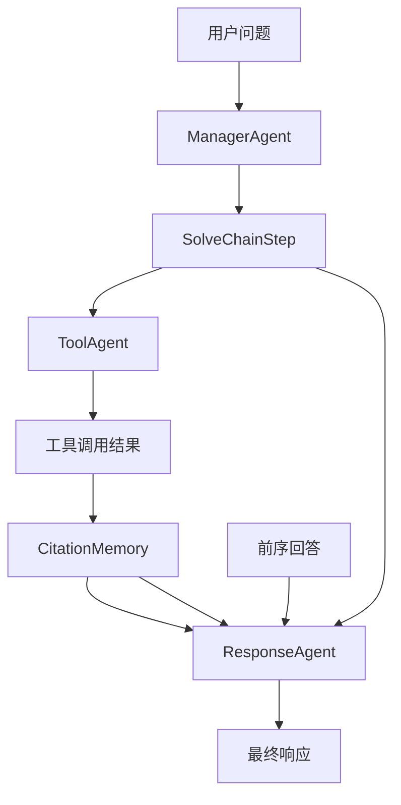
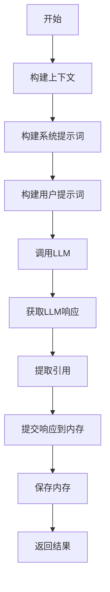
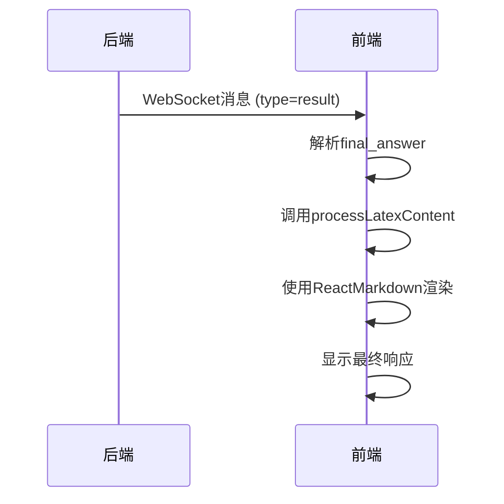

# ResponseAgent

<cite>
**本文档中引用的文件**   
- [response_agent.py](file://src/agents/solve/solve_loop/response_agent.py)
- [response_agent.yaml](file://src/agents/solve/prompts/zh/solve_loop/response_agent.yaml)
- [solve_memory.py](file://src/agents/solve/memory/solve_memory.py)
- [citation_memory.py](file://src/agents/solve/memory/citation_memory.py)
- [base_agent.py](file://src/agents/solve/base_agent.py)
- [main_solver.py](file://src/agents/solve/main_solver.py)
- [page.tsx](file://web/app/solver/page.tsx)
- [latex.ts](file://web/lib/latex.ts)
</cite>

## 目录
1. [引言](#引言)
2. [核心功能与角色](#核心功能与角色)
3. [输入数据来源](#输入数据来源)
4. [内容组织逻辑](#内容组织逻辑)
5. [响应生成策略](#响应生成策略)
6. [引用信息处理](#引用信息处理)
7. [响应模板与多语言支持](#响应模板与多语言支持)
8. [输出格式化与前端集成](#输出格式化与前端集成)
9. [常见问题与修复方法](#常见问题与修复方法)
10. [结论](#结论)

## 引言

ResponseAgent是DeepTutor求解系统中的关键组件，负责在求解循环的末期整合所有中间结果和引用信息，生成最终的自然语言响应。作为求解流程的最终输出者，它扮演着将零散的知识点、工具执行结果和代码输出编织成连贯、高质量答案的资深助教角色。本文档将深入解析其工作原理、数据流、配置选项以及与前端的对接方式，为开发者和用户提供全面的技术参考。

## 核心功能与角色

ResponseAgent的核心功能是作为求解流程的最终响应生成器。它在求解循环中处于关键的收尾位置，其主要职责是接收来自前序步骤的中间结果，包括问题分解、知识检索、工具调用等产生的所有数据，并将这些数据整合成一个结构清晰、逻辑连贯的最终答案。

该Agent的运作遵循“承上启下”的原则，其生成的每一步响应都必须紧接在前序步骤的上下文之后，确保整个回答的语流顺畅。它严格对齐当前步骤的目标，不回答与目标无关的内容，从而保证了求解过程的精准性。其输出建议遵循教科书质量，通常包含小标题、概念阐述、逻辑推导、多模态元素融合和小结等结构，旨在深入浅出地讲解问题。

**Section sources**
- [response_agent.py](file://src/agents/solve/solve_loop/response_agent.py#L19-L288)

## 输入数据来源

ResponseAgent的输入数据来源于求解流程中积累的多种内存和上下文信息。这些数据是生成高质量响应的基础。

### 求解步骤记录 (SolveChainStep)

`SolveChainStep`对象是ResponseAgent的核心输入之一，它代表了求解流程中的一个具体步骤。该对象包含了步骤的ID、目标、可用的引用ID列表以及工具调用记录。这些信息定义了当前步骤需要完成的任务和可以使用的资源。

### 引用内存 (CitationMemory)

`CitationMemory`是一个全局的引用管理系统，统一管理由所有工具调用生成的引用信息。它存储了每个引用的ID、工具类型、查询内容、原始结果和摘要。ResponseAgent通过`citation_memory`参数访问这个内存，以获取每个引用的详细信息，确保在生成响应时能够正确标注来源。

### 其他内存与上下文

除了上述核心内存，ResponseAgent还接收`investigate_memory`（调查内存，包含知识链）和`solve_memory`（求解内存，包含整个求解链的状态）。此外，`accumulated_response`参数提供了前序步骤已生成的完整回答内容，使ResponseAgent能够在此基础上进行续写，保持回答的连贯性。

**Diagram sources**
- [response_agent.py](file://src/agents/solve/solve_loop/response_agent.py#L34-L78)
- [solve_memory.py](file://src/agents/solve/memory/solve_memory.py#L68-L105)
- [citation_memory.py](file://src/agents/solve/memory/citation_memory.py#L45-L200)

**Section sources**
- [response_agent.py](file://src/agents/solve/solve_loop/response_agent.py#L34-L78)
- [solve_memory.py](file://src/agents/solve/memory/solve_memory.py#L68-L105)
- [citation_memory.py](file://src/agents/solve/memory/citation_memory.py#L45-L200)

## 内容组织逻辑

ResponseAgent的内容组织逻辑是其生成高质量响应的关键。它通过一系列内部方法，将原始数据转化为结构化的上下文，为LLM提供清晰的输入。

### 上下文构建 (_build_context)

`_build_context`方法是内容组织的起点。它将来自`question`、`step`、`solve_memory`等多个来源的数据整合成一个统一的字典。这个字典包含了用户问题、步骤ID、步骤目标、可用引用详情、工具材料、引用详情、图片材料和前序上下文等关键信息。其中，`previous_context`字段尤为重要，它直接决定了新生成内容的起点，确保了回答的连续性。

### 材料格式化

在构建上下文的过程中，ResponseAgent会调用多个辅助方法来格式化不同类型的材料：
- `_format_available_cite`：将可用的引用ID转换为包含工具类型、查询和摘要的详细文本。
- `_format_tool_materials`：将工具调用记录格式化为可读的文本，并提取出需要插入的图片路径。
- `_format_citation_details`：为LLM提供所有相关引用的详细信息，包括查询和内容摘要。

这些格式化后的材料被直接注入到提示词中，为LLM提供了丰富的背景知识。

**Section sources**
- [response_agent.py](file://src/agents/solve/solve_loop/response_agent.py#L83-L107)
- [response_agent.py](file://src/agents/solve/solve_loop/response_agent.py#L159-L262)

## 响应生成策略

ResponseAgent的响应生成策略依赖于精心设计的提示词工程和对LLM的强大调用能力。

### 提示词构建

ResponseAgent使用`_build_system_prompt`和`_build_user_prompt`两个方法来构建发送给LLM的提示词。
- **系统提示词 (System Prompt)**：定义了Agent的角色、核心原则和关键规范。它强调了“承上启下”、“目标对齐”、“证据为王”和“专业格式”四大原则，并详细规定了引用标注、LaTeX公式和多模态融合的格式要求。
- **用户提示词 (User Prompt)**：基于`_build_context`生成的上下文，通过模板填充形成。它清晰地列出了用户问题、前序内容、当前步骤目标以及所有可用的素材，为LLM提供了明确的任务指令。

### LLM调用与结果处理

`process`方法通过`call_llm`接口调用LLM。它将构建好的系统提示词和用户提示词发送给LLM，并等待返回。LLM的原始输出被直接用作`step_response`，不进行额外的解析。生成的响应会被提交到`solve_memory`中，并保存到磁盘，确保了状态的持久化。

**Diagram sources**
- [response_agent.py](file://src/agents/solve/solve_loop/response_agent.py#L58-L78)
- [response_agent.py](file://src/agents/solve/solve_loop/response_agent.py#L109-L154)

**Section sources**
- [response_agent.py](file://src/agents/solve/solve_loop/response_agent.py#L34-L78)

## 引用信息处理

引用信息的正确处理是保证回答可信度和学术严谨性的核心。

### 引用启用配置

引用功能的启用由配置文件中的`system.enable_citations`参数控制。在`__init__`方法中，该参数被读取并存储在`self.enable_citations`中。如果该功能被禁用，系统提示词中会插入一条禁用指令，明确告知LLM不要使用引用格式。

### 引用提取 (_extract_used_citations)

`_extract_used_citations`方法负责从LLM生成的响应文本中提取出实际使用的引用ID。它使用正则表达式匹配标准的英文方括号`[cite]`或中文全角方括号`【cite】`格式，并将它们统一归一化。提取出的引用ID会与当前步骤允许使用的引用ID列表进行比对，确保只保留有效的引用，并保持其在文本中出现的顺序。

### 引用提交

提取出的引用列表`used_citations`会与`step_response`一起，通过`solve_memory.submit_step_response`方法提交到求解内存中。这为后续生成最终答案的引用列表提供了依据。

**Section sources**
- [response_agent.py](file://src/agents/solve/solve_loop/response_agent.py#L32-L32)
- [response_agent.py](file://src/agents/solve/solve_loop/response_agent.py#L267-L288)
- [solve_memory.py](file://src/agents/solve/memory/solve_memory.py#L113-L117)

## 响应模板与多语言支持

ResponseAgent通过灵活的模板系统和多语言配置，实现了响应的可定制化和国际化。

### 响应模板机制

响应模板定义在`prompts/zh/solve_loop/response_agent.yaml`文件中。该文件包含`system`（系统提示词）、`user_template`（用户提示词模板）以及`image_instruction`（图片插入指令）等多个模板片段。这种分离的设计使得系统提示词和用户提示词可以独立维护和修改，提高了配置的灵活性。

### 多语言支持配置

多语言支持通过`base_agent.py`中的`PromptLoader`实现。在初始化时，Agent会从主配置`main.yaml`中读取`system.language`设置（如`zh`、`en`），并据此加载对应语言目录（`zh/`或`en/`）下的YAML模板文件。例如，当语言设置为中文时，系统会优先加载`zh/solve_loop/response_agent.yaml`中的模板，从而实现界面和提示词的本地化。

**Section sources**
- [response_agent.yaml](file://src/agents/solve/prompts/zh/solve_loop/response_agent.yaml#L1-L91)
- [base_agent.py](file://src/agents/solve/base_agent.py#L74-L84)

## 输出格式化与前端集成

ResponseAgent生成的响应需要经过格式化处理才能在前端正确展示，特别是对于LaTeX公式和图片等多模态内容。

### LaTeX渲染

LLM生成的响应中包含使用`$...$`和`$$...$$`语法的LaTeX公式。前端使用`remark-math`和`rehype-katex`库来解析和渲染这些公式。`web/lib/latex.ts`中的`convertLatexDelimiters`函数负责将LLM可能输出的`\(...\)`和`\[...\]`格式转换为前端库支持的`$...$`和`$$...$$`格式，确保了公式的正确显示。

### 前端展示组件对接

前端的`SolverPage`组件（`page.tsx`）通过WebSocket接收来自后端的`result`消息。当收到消息时，它会将`data.final_answer`（即ResponseAgent生成的最终答案）添加到聊天消息列表中。`ReactMarkdown`组件负责将包含Markdown和LaTeX的`final_answer`字符串渲染为富文本。图片路径通过`resolveArtifactUrl`函数解析为正确的API URL，确保了图片的正确加载。

**Diagram sources**
- [page.tsx](file://web/app/solver/page.tsx#L54-L200)
- [latex.ts](file://web/lib/latex.ts#L16-L37)

**Section sources**
- [page.tsx](file://web/app/solver/page.tsx#L54-L200)
- [latex.ts](file://web/lib/latex.ts#L16-L37)

## 常见问题与修复方法

在使用ResponseAgent时，可能会遇到一些常见问题，了解其成因和修复方法至关重要。

### 响应不完整

**成因**：最常见的原因是LLM的上下文窗口（context window）限制。当累积的上下文（包括前序回答、知识材料和工具结果）过长时，新的内容可能会被截断，导致响应不完整。

**修复方法**：
1.  **优化提示词**：精简系统提示词和用户提示词中的冗余信息。
2.  **压缩上下文**：在`_build_context`中，对`raw_result`等长文本进行更严格的截断。
3.  **调整模型**：使用具有更长上下文窗口的LLM模型。

### 逻辑混乱或引用缺失

**成因**：这通常与提示词设计或LLM的稳定性有关。如果系统提示词中的“承上启下”原则不够明确，LLM可能会忽略`previous_context`，导致逻辑跳跃。引用缺失则可能是因为`_extract_used_citations`方法未能正确识别非标准格式的引用。

**修复方法**：
1.  **强化提示词**：在系统提示词中更加强调“必须紧接在`previous_context`之后”和“所有结论都必须标注引用ID”。
2.  **改进正则表达式**：增强`_extract_used_citations`中的正则表达式，以识别更多变体的引用格式。
3.  **后处理验证**：在提交响应前，增加一个验证步骤，检查响应中提到的关键事实是否都有对应的引用。

**Section sources**
- [response_agent.py](file://src/agents/solve/solve_loop/response_agent.py#L83-L107)
- [response_agent.py](file://src/agents/solve/solve_loop/response_agent.py#L267-L288)

## 结论

ResponseAgent是DeepTutor求解系统中不可或缺的最终环节。它通过整合求解链中的所有中间状态和引用信息，利用强大的提示词工程调用LLM，生成结构化、专业化的自然语言响应。其设计体现了模块化、可配置和可扩展的特点，通过与`SolveMemory`和`CitationMemory`的紧密协作，确保了求解过程的完整性和可追溯性。同时，通过前端的LaTeX渲染和WebSocket实时通信，为用户提供了流畅、直观的交互体验。深入理解其工作原理，有助于更好地利用和优化这一强大的AI助教功能。