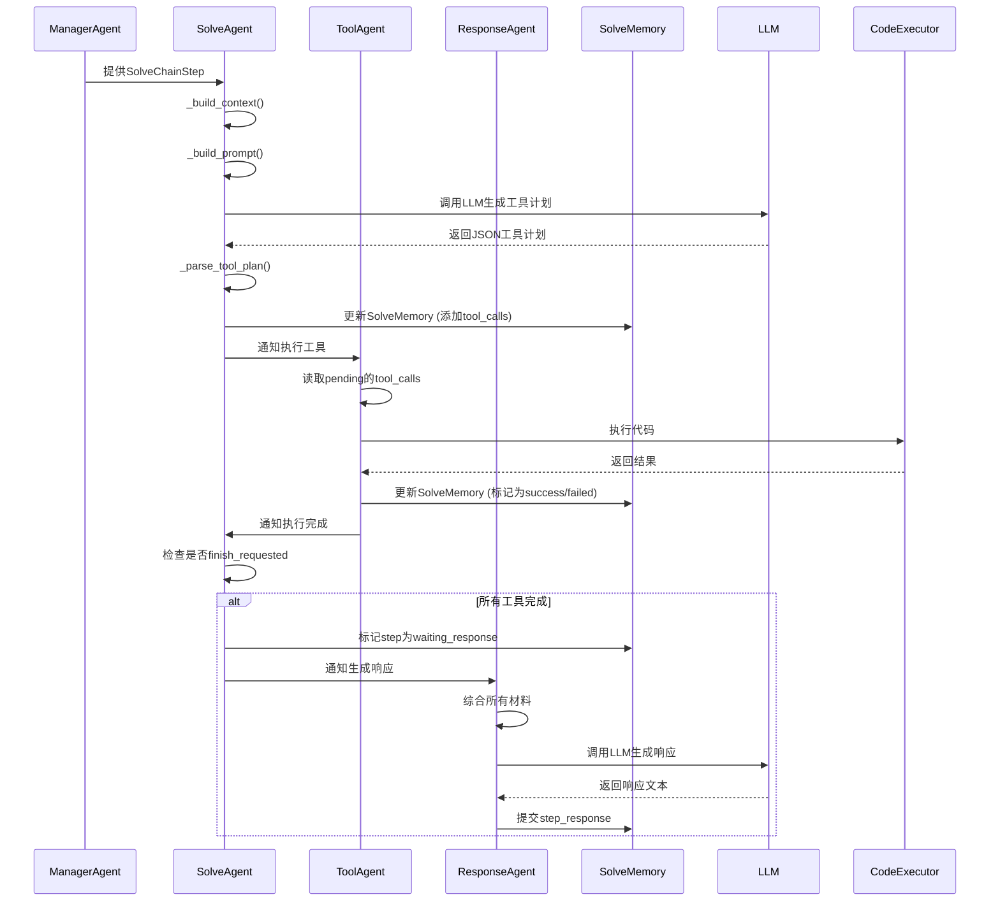

# SolveAgent

<cite>
**本文档引用的文件**
- [solve_agent.py](file://src/agents/solve/solve_loop/solve_agent.py)
- [tool_agent.py](file://src/agents/solve/solve_loop/tool_agent.py)
- [main_solver.py](file://src/agents/solve/main_solver.py)
- [solve_memory.py](file://src/agents/solve/memory/solve_memory.py)
- [token_tracker.py](file://src/agents/solve/utils/token_tracker.py)
- [code_executor.py](file://src/tools/code_executor.py)
- [web_search.py](file://src/tools/web_search.py)
- [solve_agent.yaml](file://src/agents/solve/prompts/zh/solve_loop/solve_agent.yaml)
- [tool_agent.yaml](file://src/agents/solve/prompts/zh/solve_loop/tool_agent.yaml)
- [agents.yaml](file://config/agents.yaml)
</cite>

## 目录
1. [引言](#引言)
2. [核心方法与执行流程](#核心方法与执行流程)
3. [参数配置与执行策略](#参数配置与执行策略)
4. [错误处理与回滚机制](#错误处理与回滚机制)
5. [性能监控与Token追踪](#性能监控与token追踪)
6. [协作流程与数据流](#协作流程与数据流)
7. [具体执行示例](#具体执行示例)
8. [常见异常与调试技巧](#常见异常与调试技巧)
9. [结论](#结论)

## 引言

SolveAgent是DeepTutor系统中的核心执行引擎，作为“工具策略家”（Tool Strategist），其主要职责是根据ManagerAgent制定的求解计划，逐个执行具体的求解步骤。它不直接执行工具，而是负责规划每个步骤所需的工具调用序列，并将这些计划传递给ToolAgent进行实际执行。SolveAgent通过解析任务指令、调用内部工具或外部API、处理中间结果并更新上下文状态，确保求解过程的高效与准确。它与ManagerAgent、ToolAgent和ResponseAgent紧密协作，共同完成从问题分析到最终答案生成的完整闭环。

**本文档引用的文件**
- [solve_agent.py](file://src/agents/solve/solve_loop/solve_agent.py)
- [main_solver.py](file://src/agents/solve/main_solver.py)

## 核心方法与执行流程

SolveAgent的核心功能由`process`方法实现，该方法负责解析当前求解步骤的目标，并生成相应的工具调用计划。其执行流程如下：

1.  **上下文构建**：`_build_context`方法收集当前问题、步骤目标、可用的知识链（来自分析环）以及之前的工具调用历史，为LLM提供全面的决策依据。
2.  **提示词生成**：`_build_system_prompt`和`_build_user_prompt`方法分别从YAML配置文件中加载系统指令和用户模板，并将上下文信息填充进去，形成最终发送给LLM的提示词。
3.  **LLM调用与计划生成**：`call_llm`方法调用大语言模型，并强制要求返回JSON格式的响应，以确保输出的结构化。
4.  **计划解析**：`_parse_tool_plan`方法使用`json_utils.extract_json_from_text`从LLM的响应中提取JSON数据，并解析成工具调用列表。它会验证工具类型的有效性，并过滤掉不支持的类型。
5.  **状态更新与记录**：根据解析出的工具计划，SolveAgent会更新`SolveMemory`中的工具调用记录。如果计划中包含`none`类型，表示当前步骤无需外部工具，可以直接生成答案，此时会将步骤标记为“等待响应”。
6.  **结果反馈**：最终，SolveAgent将生成的工具调用列表、是否请求结束等信息返回给主控制器（MainSolver），由其决定下一步是执行工具还是生成响应。

**本文档引用的文件**
- [solve_agent.py](file://src/agents/solve/solve_loop/solve_agent.py#L44-L163)
- [solve_memory.py](file://src/agents/solve/memory/solve_memory.py)

## 参数配置与执行策略

SolveAgent的行为受到多种参数和策略的控制，确保其执行的灵活性和鲁棒性。

### 支持的工具类型
SolveAgent支持以下五种工具类型，每种类型对应不同的求解策略：
- `none`：无需外部工具，直接进行逻辑推理或总结。
- `rag_naive`：用于检索精准的定义、公式或事实。
- `rag_hybrid`：用于理解复杂的机制或进行对比分析。
- `web_search`：用于获取最新的信息或课外知识。
- `code_execution`：用于执行计算、数据处理或绘制图表。

### 代码执行规范
当选择`code_execution`时，SolveAgent必须遵守严格的代码规范：
- **全英文环境**：代码中的变量名、函数名、注释、字符串数据、图表标题/标签/图例必须全部使用英文。
- **无GUI**：禁止使用`plt.show()`，必须使用`plt.savefig('filename.png')`保存图像。
- **路径简洁**：保存文件时直接写文件名（如`plot.png`），不要加`artifacts/`前缀。
- **自包含**：代码必须包含所有必要的import和变量定义，能够独立运行。

### 重试与超时策略
虽然SolveAgent本身不直接处理重试，但其依赖的底层机制提供了保障：
- **LLM调用重试**：通过`BaseAgent`继承的`get_max_retries`方法，从配置中获取最大重试次数（默认为3次），在LLM调用失败时自动重试。
- **代码执行超时**：在`code_executor.py`中配置了代码执行的超时时间（默认20秒），防止无限循环或长时间运行的代码阻塞整个流程。

**本文档引用的文件**
- [solve_agent.py](file://src/agents/solve/solve_loop/solve_agent.py#L25-L32)
- [solve_agent.yaml](file://src/agents/solve/prompts/zh/solve_loop/solve_agent.yaml)
- [code_executor.py](file://src/tools/code_executor.py#L233)
- [agents.yaml](file://config/agents.yaml)

## 错误处理与回滚机制

SolveAgent具备完善的错误处理能力，确保在异常情况下系统能够稳定运行。

### 解析错误处理
当LLM返回的响应无法解析为有效JSON时，SolveAgent会记录警告日志，并抛出`ValueError`异常。这会触发主控制器（MainSolver）的重试逻辑，重新生成计划。

### 工具调用错误处理
SolveAgent本身不执行工具，因此不直接处理工具调用的错误。这些错误由`ToolAgent`在执行时捕获。当`ToolAgent`执行失败（如代码报错、网络搜索失败）时，它会将错误信息记录到`SolveMemory`和`CitationMemory`中，并将调用状态标记为“failed”。SolveAgent在后续步骤中会看到这些失败记录，并可能规划新的工具调用来纠正错误。

### 回滚机制
系统没有显式的“回滚”操作，而是采用“纠正”（correction）策略。在`main_solver.py`中，每个求解步骤都允许进行多次迭代（默认最多3次）。如果一个步骤的工具调用失败或结果不理想，SolveAgent会在下一次迭代中重新规划工具调用，尝试不同的策略来完成该步骤，从而实现逻辑上的“回滚”与重试。

**本文档引用的文件**
- [solve_agent.py](file://src/agents/solve/solve_loop/solve_agent.py#L75-L85)
- [tool_agent.py](file://src/agents/solve/solve_loop/tool_agent.py#L133-L175)
- [main_solver.py](file://src/agents/solve/main_solver.py#L497-L573)

## 性能监控与Token追踪

SolveAgent集成了强大的性能监控和Token追踪功能，用于量化和优化系统资源消耗。

### TokenTracker集成
SolveAgent通过`token_tracker`参数接收一个`TokenTracker`实例。在每次调用LLM时，`BaseAgent.call_llm`方法会尝试从API响应中获取精确的Token使用量。如果API未返回此信息，`TokenTracker`会使用`tiktoken`库（如果已安装）对系统提示和用户提示进行精确计数，或使用`litellm`库进行计算，最后作为兜底方案进行估算。

### 成本计算
`TokenTracker`根据预设的模型定价表（如gpt-4o, gpt-4o-mini等）和实际使用的Token数量，自动计算每次调用的成本（单位：美元）。这使得用户可以清晰地了解整个求解过程的资源开销。

### 实时监控
`TokenTracker`通过回调函数（`set_on_usage_added_callback`）与前端显示管理器（`display_manager`）连接，能够实时更新和展示Token使用统计，为用户提供透明的性能反馈。

```mermaid
graph TD
A[SolveAgent] --> |调用| B[LLM]
B --> |返回| C[响应文本]
D[TokenTracker] --> |监听| B
D --> |计算| E[Token用量]
E --> |包含| F[输入Tokens]
E --> |包含| G[输出Tokens]
E --> |包含| H[总Tokens]
E --> |包含| I[成本USD]
J[DisplayManager] <--|实时更新| D
```

**Diagram sources**
- [solve_agent.py](file://src/agents/solve/solve_loop/solve_agent.py#L168-L174)
- [token_tracker.py](file://src/agents/solve/utils/token_tracker.py)
- [base_agent.py](file://src/agents/solve/base_agent.py#L161-L277)

**本文档引用的文件**
- [solve_agent.py](file://src/agents/solve/solve_loop/solve_agent.py#L34)
- [token_tracker.py](file://src/agents/solve/utils/token_tracker.py)
- [base_agent.py](file://src/agents/solve/base_agent.py#L214-L267)

## 协作流程与数据流

SolveAgent是求解环（Solve Loop）中的关键一环，与多个组件协同工作。

### 与ManagerAgent的协作
`ManagerAgent`首先根据问题和知识链生成一个高层次的求解计划，将整个问题分解为一系列有序的`SolveChainStep`。`SolveAgent`接收这个计划，并负责为每个步骤制定具体的、可执行的工具调用轨迹。

### 与ToolAgent的协作
`SolveAgent`将生成的工具调用计划传递给`ToolAgent`。`ToolAgent`读取`SolveMemory`中的待执行调用，调用相应的工具（如`code_executor`或`web_search`），执行后将原始结果和摘要写回`SolveMemory`和`CitationMemory`。

### 与ResponseAgent的协作
当一个步骤的所有工具调用都成功完成（或被标记为`none`）后，`SolveAgent`会将该步骤标记为“等待响应”。随后，`ResponseAgent`被激活，它会综合该步骤的工具执行结果、知识链摘要等信息，生成一个正式、连贯的自然语言响应。



**Diagram sources**
- [main_solver.py](file://src/agents/solve/main_solver.py#L524-L568)
- [solve_agent.py](file://src/agents/solve/solve_loop/solve_agent.py)
- [tool_agent.py](file://src/agents/solve/solve_loop/tool_agent.py)
- [response_agent.py](file://src/agents/solve/solve_loop/response_agent.py)

**本文档引用的文件**
- [main_solver.py](file://src/agents/solve/main_solver.py)
- [solve_agent.py](file://src/agents/solve/solve_loop/solve_agent.py)
- [tool_agent.py](file://src/agents/solve/solve_loop/tool_agent.py)
- [response_agent.py](file://src/agents/solve/solve_loop/response_agent.py)

## 具体执行示例

### 执行代码片段
当求解步骤需要计算或绘图时，SolveAgent会生成`code_execution`类型的调用。例如，对于“绘制正弦波”的步骤，SolveAgent会生成如下代码：
```python
import numpy as np
import matplotlib.pyplot as plt

x = np.linspace(0, 2*np.pi, 100)
y = np.sin(x)
plt.plot(x, y)
plt.title('Sine Wave')
plt.savefig('sine_wave.png')
```
`ToolAgent`执行此代码后，会生成`sine_wave.png`文件，并将文件路径和结果摘要记录下来。

### 调用web_search进行信息验证
当需要验证一个事实（如“2024年诺贝尔物理学奖得主是谁？”）时，SolveAgent会生成`web_search`类型的调用。`ToolAgent`会调用`web_search.py`，通过Perplexity API进行网络搜索，获取答案和引用链接，并将结果摘要存入内存，供后续生成响应使用。

**本文档引用的文件**
- [solve_agent.yaml](file://src/agents/solve/prompts/zh/solve_loop/solve_agent.yaml)
- [tool_agent.yaml](file://src/agents/solve/prompts/zh/solve_loop/tool_agent.yaml)
- [code_executor.py](file://src/tools/code_executor.py)
- [web_search.py](file://src/tools/web_search.py)

## 常见异常与调试技巧

### 常见执行异常
1.  **JSON解析失败**：LLM输出格式错误，无法解析为JSON。**解决方案**：检查`solve_agent.yaml`中的系统提示，确保明确要求JSON输出。
2.  **代码执行失败**：代码语法错误或路径错误。**解决方案**：检查错误信息，确保代码全英文、无`plt.show()`、保存路径正确。
3.  **工具调用无限循环**：SolveAgent反复规划相同的工具调用。**解决方案**：检查`已有轨迹`，确保SolveAgent的提示词中有“避免重复执行相同操作”的指令。
4.  **Token超限**：上下文过长导致超出模型Token限制。**解决方案**：优化提示词，或在`agents.yaml`中调整`max_tokens`。

### 调试技巧
- **查看日志文件**：检查`data/user/solve/`目录下的`task.log`，其中记录了详细的执行流程和错误信息。
- **检查内存文件**：查看`solve_chain.json`和`citation_memory.json`，确认工具调用和引用记录是否正确。
- **启用详细输出**：在调用`solve`方法时设置`verbose=True`，以获取更详细的中间信息。
- **检查环境变量**：确保`LLM_MODEL`、`LLM_API_KEY`和`PERPLEXITY_API_KEY`等环境变量已正确配置。

**本文档引用的文件**
- [solve_agent.py](file://src/agents/solve/solve_loop/solve_agent.py#L79-L85)
- [tool_agent.py](file://src/agents/solve/solve_loop/tool_agent.py#L224-L254)
- [solve_agent.yaml](file://src/agents/solve/prompts/zh/solve_loop/solve_agent.yaml#L64-L65)
- [main_solver.py](file://src/agents/solve/main_solver.py#L225)

## 结论

SolveAgent作为DeepTutor系统的执行引擎，扮演着至关重要的角色。它通过智能化的工具规划、严格的执行规范、健壮的错误处理和全面的性能监控，确保了求解过程的高效、准确和透明。其与ManagerAgent、ToolAgent和ResponseAgent的紧密协作，构成了一个完整的、闭环的自动化问题求解工作流。通过深入理解其核心机制和配置参数，开发者可以更好地利用和优化这一强大的工具，以应对复杂的学术和研究挑战。