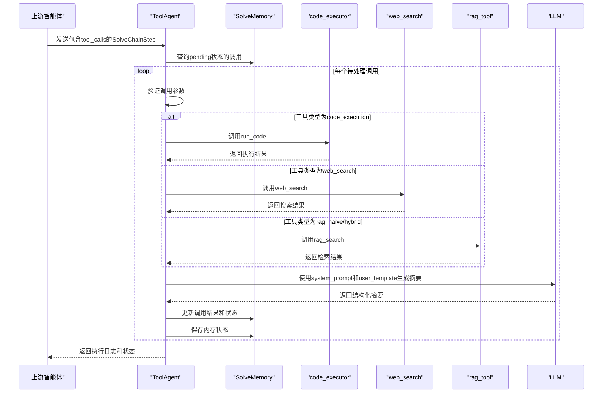
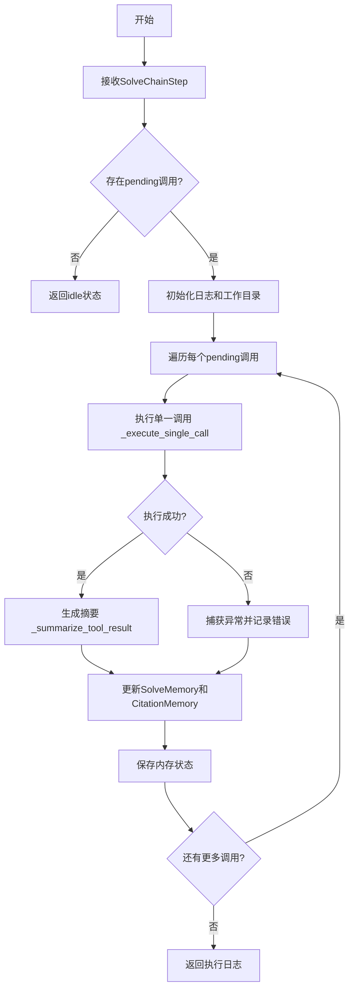

# ToolAgent

<cite>
**本文档中引用的文件**   
- [tool_agent.py](file://src/agents/solve/solve_loop/tool_agent.py)
- [code_executor.py](file://src/tools/code_executor.py)
- [web_search.py](file://src/tools/web_search.py)
- [rag_tool.py](file://src/tools/rag_tool.py)
- [main.yaml](file://config/main.yaml)
- [tool_agent.yaml](file://src/agents/solve/prompts/en/solve_loop/tool_agent.yaml)
- [solve_memory.py](file://src/agents/solve/memory/solve_memory.py)
</cite>

## 目录
1. [简介](#简介)
2. [核心功能](#核心功能)
3. [接口设计模式](#接口设计模式)
4. [支持的工具列表](#支持的工具列表)
5. [调用协议与执行流程](#调用协议与执行流程)
6. [错误码定义](#错误码定义)
7. [安全限制与沙箱执行](#安全限制与沙箱执行)
8. [异步调用处理机制](#异步调用处理机制)
9. [配置选项](#配置选项)
10. [开发者扩展指南](#开发者扩展指南)
11. [常见问题与应对策略](#常见问题与应对策略)
12. [总结](#总结)

## 简介

ToolAgent 是 DeepTutor 系统中的核心工具调用中枢，负责封装和执行各类外部工具。作为系统中连接不同功能模块的桥梁，ToolAgent 实现了代码执行、网页搜索、RAG（检索增强生成）检索等关键功能的统一管理。其设计目标是为上层智能体提供一个安全、可靠、高效的工具调用接口，确保复杂任务能够被分解并由合适的工具协同完成。

该组件采用模块化架构，通过统一的接口规范与各类工具进行交互，实现了功能的高内聚与低耦合。ToolAgent 不仅负责工具的调用和结果的获取，还承担着结果的结构化处理和摘要生成任务，为后续的决策和报告生成提供高质量的输入。其在整个系统中的角色类似于一个“实验记录员”，客观、准确地记录每一次工具调用的输入、输出和执行状态。

**Section sources**
- [tool_agent.py](file://src/agents/solve/solve_loop/tool_agent.py#L1-L428)

## 核心功能

ToolAgent 的核心功能是作为工具调用的中央调度器，负责接收来自其他智能体的工具调用请求，验证参数，执行具体的工具函数，并返回结构化的结果。它通过继承 `BaseAgent` 类，获得了与 LLM（大语言模型）交互的能力，能够根据上下文动态地选择和执行工具。

其主要功能包括：
- **工具调用分发**：根据 `tool_type` 字段，将调用请求分发给 `code_executor`、`web_search` 或 `rag_search` 等具体工具模块。
- **执行结果摘要**：利用 LLM 对工具的原始输出进行处理，生成符合特定格式的结构化摘要，确保信息的客观性和可读性。
- **状态管理与持久化**：与 `SolveMemory` 和 `CitationMemory` 组件协同工作，实时更新工具调用的状态（如 pending、running、success、failed），并将结果持久化到磁盘，保证任务的可追溯性和容错性。
- **日志记录**：通过 `logger` 记录详细的调用日志，包括调用耗时、输入输出等，为系统调试和性能分析提供支持。

**Section sources**
- [tool_agent.py](file://src/agents/solve/solve_loop/tool_agent.py#L26-L184)

## 接口设计模式

ToolAgent 采用了清晰的接口设计模式，确保了调用的标准化和可维护性。其核心接口是 `process` 方法，该方法定义了处理工具调用的标准流程。

**Diagram sources**
- [tool_agent.py](file://src/agents/solve/solve_loop/tool_agent.py#L39-L184)

## 支持的工具列表

ToolAgent 支持以下几种核心工具，每种工具都通过特定的 `tool_type` 进行标识：

- **`code_execution`**: 通过 `src.tools.code_executor` 模块执行 Python 代码。该工具在隔离的沙箱环境中运行，确保系统安全。
- **`rag_naive`**: 通过 `src.tools.rag_tool` 模块执行 RAG 检索，使用 "naive" 模式进行查询。
- **`rag_hybrid`**: 通过 `src.tools.rag_tool` 模块执行 RAG 检索，使用 "hybrid" 模式进行查询。
- **`web_search`**: 通过 `src.tools.web_search` 模块执行网络搜索，利用 Perplexity API 获取最新信息。

这些工具的调用均通过 `__init__.py` 文件中的统一导入进行管理，确保了接口的一致性。

**Section sources**
- [tool_agent.py](file://src/agents/solve/solve_loop/tool_agent.py#L17-L20)
- [__init__.py](file://src/tools/__init__.py#L55-L58)

## 调用协议与执行流程

ToolAgent 的调用协议基于 `SolveChainStep` 数据结构，该结构定义了单个解决步骤中包含的所有信息。执行流程如下：

1.  **接收请求**：ToolAgent 接收一个 `SolveChainStep` 对象，该对象包含一个 `tool_calls` 列表。
2.  **筛选待处理调用**：遍历 `tool_calls`，筛选出状态为 `pending` 或 `running` 且 `tool_type` 有效的调用。
3.  **执行调用**：对每个待处理调用，调用 `_execute_single_call` 方法，根据 `tool_type` 分发到具体的工具函数。
4.  **生成摘要**：调用 `_summarize_tool_result` 方法，使用预定义的 prompt 模板（`tool_agent.yaml`）让 LLM 对原始结果进行摘要。
5.  **更新状态**：将原始结果、摘要和元数据更新到 `SolveMemory` 和 `CitationMemory` 中，并持久化到磁盘。
6.  **返回结果**：返回一个包含执行日志和状态的字典。

**Diagram sources**
- [tool_agent.py](file://src/agents/solve/solve_loop/tool_agent.py#L39-L184)
- [solve_memory.py](file://src/agents/solve/memory/solve_memory.py#L67-L123)

## 错误码定义

ToolAgent 通过 `status` 字段来定义调用状态，主要包含以下几种：

- **`pending`**: 调用已创建，等待执行。
- **`running`**: 调用正在执行中。
- **`success`**: 调用成功完成。
- **`failed`**: 调用执行失败。
- **`idle`**: 当前步骤无待处理调用。
- **`completed`**: 当前步骤的所有调用均已处理完毕。

当调用失败时，错误信息会通过 `raw_answer` 字段返回，并在日志中详细记录。例如，代码执行失败时，`stderr` 中的错误信息会被捕获并返回。

**Section sources**
- [tool_agent.py](file://src/agents/solve/solve_loop/tool_agent.py#L50-L55)
- [tool_agent.py](file://src/agents/solve/solve_loop/tool_agent.py#L94-L102)

## 安全限制与沙箱执行

ToolAgent 通过 `code_executor` 模块实现了严格的安全限制，确保代码在沙箱环境中执行。

- **工作空间隔离**：所有代码在 `run_code_workspace` 目录下执行，该目录由 `RUN_CODE_WORKSPACE_ENV` 环境变量或 `main.yaml` 配置文件中的 `tools.run_code.workspace` 指定。
- **路径访问控制**：通过 `allowed_roots` 配置项（在 `main.yaml` 中定义）限制代码可以访问的根路径，防止越权访问系统文件。默认允许访问 `./data/user` 和 `./src/tools`。
- **超时机制**：代码执行有默认的超时时间（20秒），可通过 `code_timeout` 配置项调整，防止无限循环或长时间阻塞。
- **导入限制**：`ImportGuard` 类会解析代码的 AST，检查导入的模块是否在允许列表中，阻止危险模块的加载。

**Section sources**
- [code_executor.py](file://src/tools/code_executor.py#L115-L244)
- [main.yaml](file://config/main.yaml#L20-L24)

## 异步调用处理机制

ToolAgent 完全基于异步编程模型（`async/await`），能够高效地处理并发请求。

- **异步执行**：`process` 和 `_execute_single_call` 方法均为 `async` 函数，允许在等待 I/O 操作（如网络请求、文件读写）时释放控制权，提高整体吞吐量。
- **同步兼容**：`code_executor` 模块提供了 `run_code_sync` 函数，通过 `asyncio.run()` 在同步环境中调用异步的 `run_code` 函数，实现了异步与同步的兼容。
- **事件循环集成**：代码执行通过 `loop.run_in_executor(None, _execute)` 在线程池中运行，避免阻塞主事件循环。

**Section sources**
- [tool_agent.py](file://src/agents/solve/solve_loop/tool_agent.py#L39-L184)
- [code_executor.py](file://src/tools/code_executor.py#L320-L441)

## 配置选项

ToolAgent 的行为可以通过配置文件进行灵活调整，主要配置项位于 `config/main.yaml` 和 `config/agents.yaml`。

- **工具启用开关**：
  - `tools.web_search.enabled`: 全局开关，控制 `web_search` 工具是否可用。
  - `tools.query_item.enabled`: 控制 `query_item` 工具是否可用。
- **访问控制**：
  - `tools.run_code.allowed_roots`: 定义代码执行时可访问的根路径列表。
- **性能与资源**：
  - `tools.run_code.workspace`: 指定代码执行的工作空间目录。
  - `research.tool_timeout`: 研究模块中工具调用的超时时间（60秒）。
  - `solve.agents.tool_agent` (在 `agents.yaml` 中): 可以配置 ToolAgent 自身的 `temperature` 和 `max_tokens`。

**Section sources**
- [main.yaml](file://config/main.yaml#L16-L30)
- [agents.yaml](file://config/agents.yaml#L12-L14)

## 开发者扩展指南

开发者可以通过以下步骤为系统扩展新的工具：

1.  **创建工具模块**：在 `src/tools/` 目录下创建新的 Python 文件（如 `new_tool.py`），实现具体的工具功能，并确保其返回结构化的字典结果。
2.  **导出工具函数**：在 `src/tools/__init__.py` 中导入新工具并添加到 `__all__` 列表中。
3.  **扩展 ToolAgent**：在 `tool_agent.py` 的 `_execute_single_call` 方法中添加对新 `tool_type` 的判断和调用逻辑。
4.  **配置 Prompt**：在 `src/agents/solve/prompts/{lang}/solve_loop/` 目录下，为新工具创建或修改 `tool_agent.yaml`，定义 `system` 和 `user_template` 提示词，以指导 LLM 如何生成摘要。
5.  **更新内存结构**（可选）：如果新工具需要特殊的元数据存储，可以扩展 `ToolCallRecord` 的 `metadata` 字段。

**Section sources**
- [tool_agent.py](file://src/agents/solve/solve_loop/tool_agent.py#L186-L272)
- [__init__.py](file://src/tools/__init__.py#L55-L86)

## 常见问题与应对策略

### 工具调用超时
- **问题**：`web_search` 或 `rag_search` 调用耗时过长，导致任务阻塞。
- **策略**：系统已内置超时机制（`research.tool_timeout: 60`）。开发者应确保网络连接稳定，并在必要时调整超时配置。在 `research_pipeline.py` 中，`_call_tool_with_timeout` 方法提供了超时处理。

### 权限不足
- **问题**：代码执行时尝试访问受限目录，抛出 `ValueError`。
- **策略**：检查 `main.yaml` 中的 `allowed_roots` 配置，确保所需路径已被包含。避免在代码中使用绝对路径或超出允许范围的相对路径。

### 代码执行失败
- **问题**：Python 代码因语法错误或运行时异常而失败。
- **策略**：ToolAgent 会捕获异常并返回详细的 `stderr` 信息。开发者应检查返回的错误日志，特别是 `【⚠️ Code execution failed】` 前缀的提示，以快速定位问题。

### 环境变量缺失
- **问题**：`web_search` 工具因缺少 `PERPLEXITY_API_KEY` 而无法使用。
- **策略**：确保在 `.env` 或 `DeepTutor.env` 文件中正确配置了所需的 API 密钥。

**Section sources**
- [tool_agent.py](file://src/agents/solve/solve_loop/tool_agent.py#L133-L176)
- [code_executor.py](file://src/tools/code_executor.py#L370-L396)
- [web_search.py](file://src/tools/web_search.py#L48-L51)

## 总结

ToolAgent 是 DeepTutor 系统中不可或缺的工具调用中枢，它通过统一、安全、高效的接口，将代码执行、网络搜索和知识检索等能力整合在一起。其模块化的设计、严格的沙箱机制和异步处理能力，确保了系统的稳定性、安全性和高性能。通过清晰的配置和易于扩展的架构，ToolAgent 为开发者提供了一个强大的基础，能够轻松集成新工具，满足不断变化的应用需求。理解 ToolAgent 的工作原理，对于开发和维护基于 DeepTutor 的智能应用至关重要。