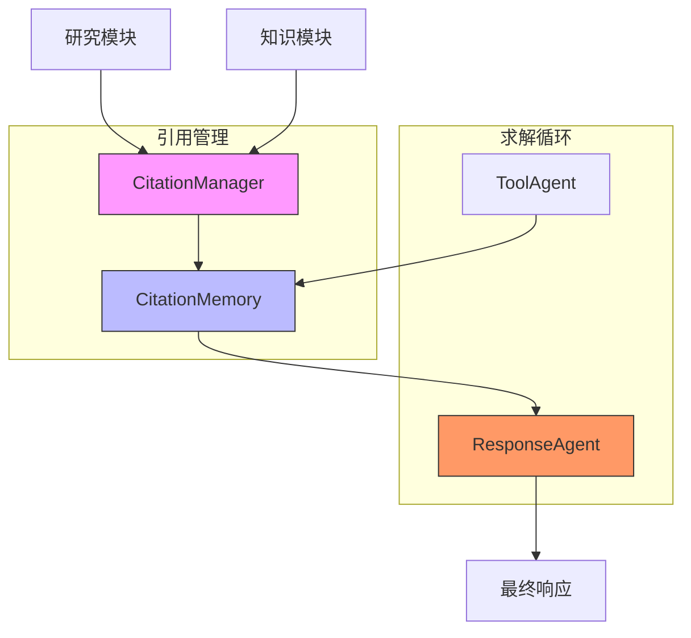
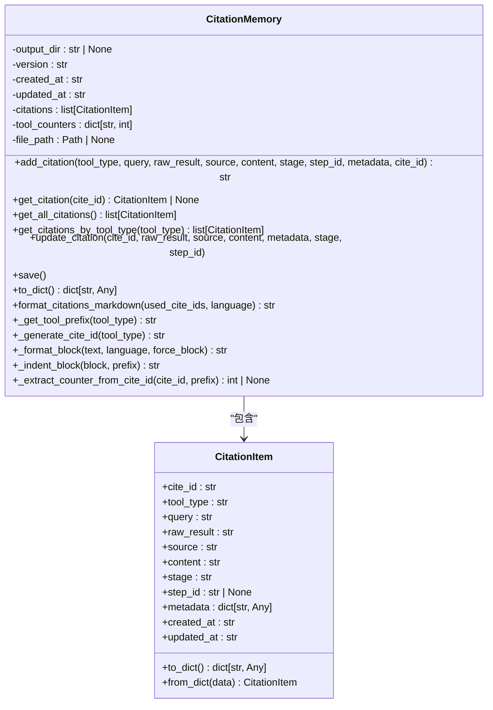
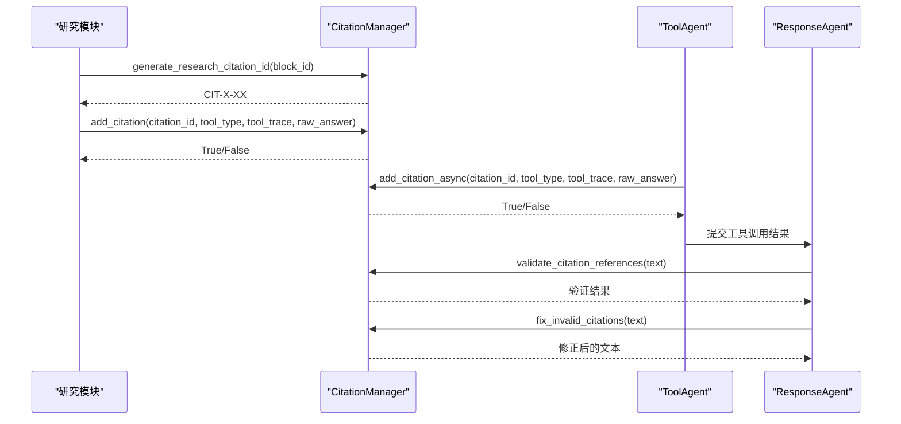
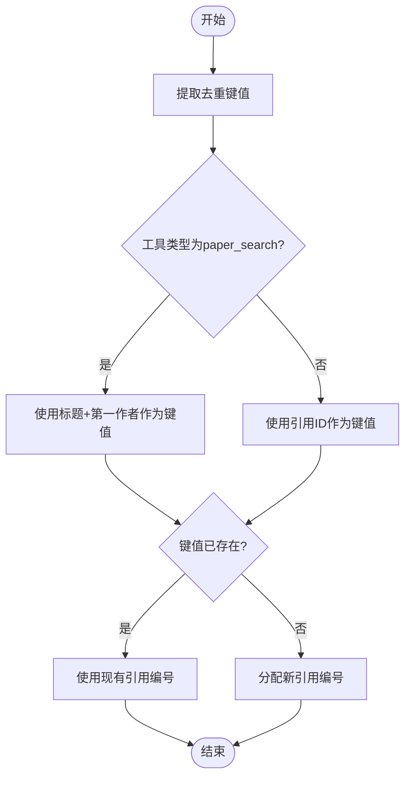
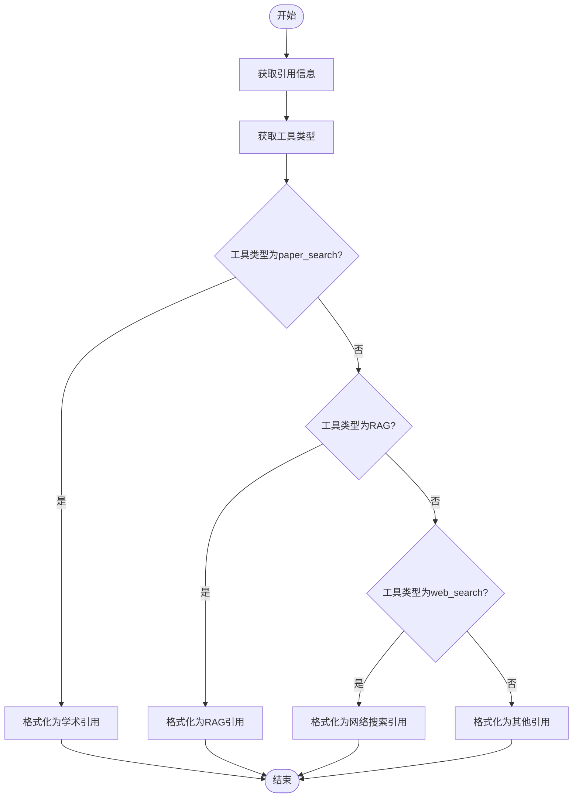
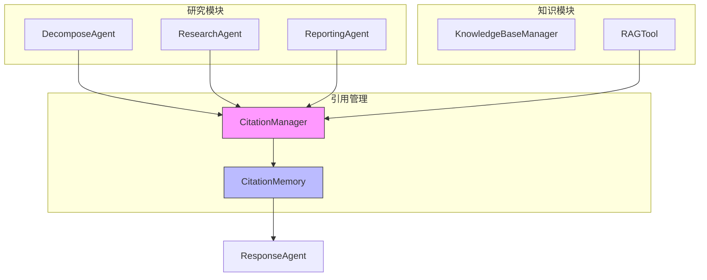
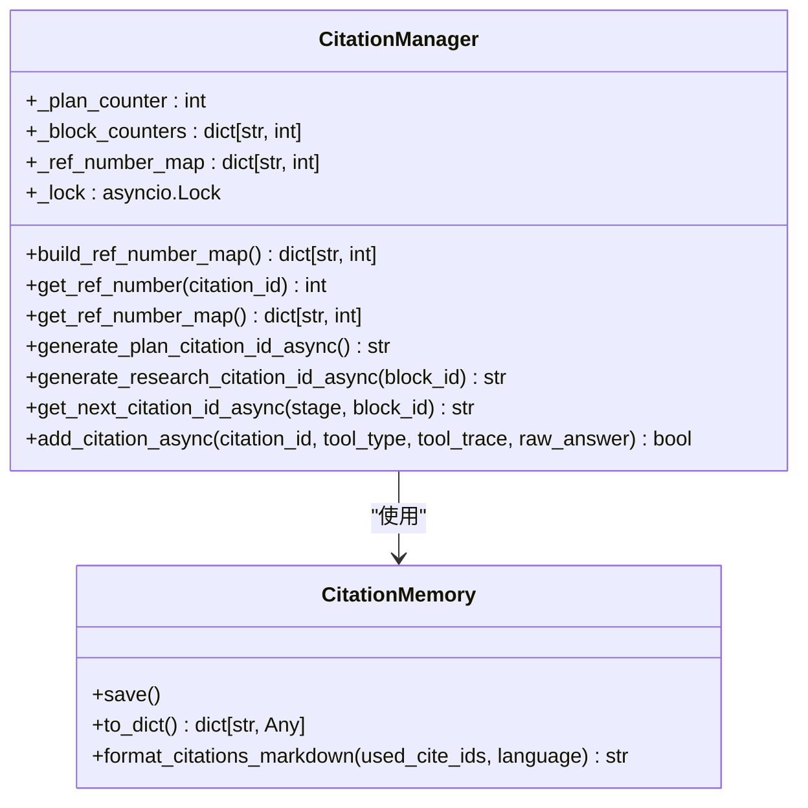
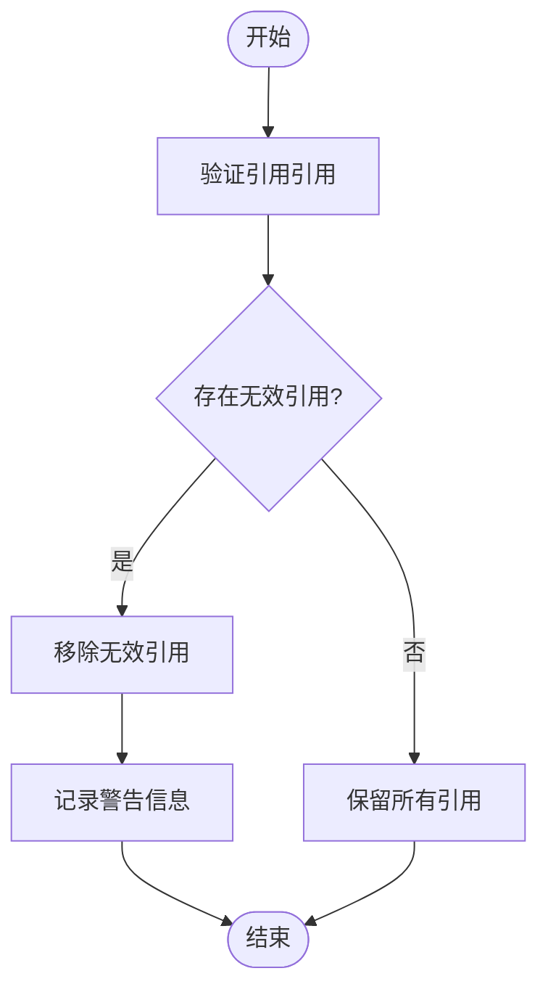

# 引用管理

<cite>
**本文档引用文件**  
- [citation_manager.py](file://src/agents/research/utils/citation_manager.py)
- [citation_manager.py](file://src/agents/solve/solve_loop/citation_manager.py)
- [citation_memory.py](file://src/agents/solve/memory/citation_memory.py)
- [response_agent.py](file://src/agents/solve/solve_loop/response_agent.py)
- [tool_agent.py](file://src/agents/solve/solve_loop/tool_agent.py)
- [web_search.py](file://src/tools/web_search.py)
- [paper_search_tool.py](file://src/tools/paper_search_tool.py)
- [manager.py](file://src/knowledge/manager.py)
- [response_agent.yaml](file://src/agents/solve/prompts/zh/solve_loop/response_agent.yaml)
</cite>

## 目录
1. [引言](#引言)
2. [引用管理架构](#引用管理架构)
3. [核心数据结构设计](#核心数据结构设计)
4. [引用生成与追踪机制](#引用生成与追踪机制)
5. [引用去重与排序策略](#引用去重与排序策略)
6. [引用格式化与输出](#引用格式化与输出)
7. [与研究模块和知识模块的集成](#与研究模块和知识模块的集成)
8. [引用配置与性能优化](#引用配置与性能优化)
9. [常见问题处理](#常见问题处理)
10. [总结](#总结)

## 引言

引用管理功能是DeepTutor系统中确保生成内容可追溯性的核心组件。该系统在求解循环中追踪和管理所有信息来源，通过统一的引用标识、元数据存储和格式化机制，确保每个答案段落都能准确关联到其原始信息来源。本文档详细阐述引用管理系统的实现原理、数据结构设计、与各模块的集成方式以及实际应用中的配置和优化策略。

**Section sources**
- [citation_manager.py](file://src/agents/research/utils/citation_manager.py#L1-L799)
- [citation_memory.py](file://src/agents/solve/memory/citation_memory.py#L1-L354)

## 引用管理架构

引用管理系统采用分层架构设计，包含三个核心组件：`CitationManager`、`CitationMemory`和`ResponseAgent`。`CitationManager`负责生成和管理引用标识，`CitationMemory`作为全局引用存储中心，而`ResponseAgent`则负责在最终响应中插入标准化引用标记。

**Diagram sources**
- [citation_manager.py](file://src/agents/research/utils/citation_manager.py#L18-L798)
- [citation_memory.py](file://src/agents/solve/memory/citation_memory.py#L45-L354)
- [response_agent.py](file://src/agents/solve/solve_loop/response_agent.py#L20-L290)

**Section sources**
- [citation_manager.py](file://src/agents/research/utils/citation_manager.py#L1-L799)
- [citation_memory.py](file://src/agents/solve/memory/citation_memory.py#L1-L354)
- [response_agent.py](file://src/agents/solve/solve_loop/response_agent.py#L1-L290)

## 核心数据结构设计

引用管理系统的核心数据结构设计围绕`CitationItem`和`CitationMemory`类展开。`CitationItem`类定义了引用条目的数据结构，包含引用标识、工具类型、查询内容、原始结果、来源信息、内容摘要等关键字段。

**Diagram sources**
- [citation_memory.py](file://src/agents/solve/memory/citation_memory.py#L14-L354)

**Section sources**
- [citation_memory.py](file://src/agents/solve/memory/citation_memory.py#L1-L354)

## 引用生成与追踪机制

引用生成与追踪机制是引用管理系统的核心功能。系统通过`CitationManager`类实现引用标识的生成和管理，支持两种引用ID格式：`PLAN-XX`用于规划阶段，`CIT-X-XX`用于研究阶段。

**Diagram sources**
- [citation_manager.py](file://src/agents/research/utils/citation_manager.py#L18-L798)
- [tool_agent.py](file://src/agents/solve/solve_loop/tool_agent.py#L26-L428)
- [response_agent.py](file://src/agents/solve/solve_loop/response_agent.py#L20-L290)

**Section sources**
- [citation_manager.py](file://src/agents/research/utils/citation_manager.py#L1-L799)
- [tool_agent.py](file://src/agents/solve/solve_loop/tool_agent.py#L1-L428)
- [response_agent.py](file://src/agents/solve/solve_loop/response_agent.py#L1-L290)

## 引用去重与排序策略

引用管理系统实现了智能的引用去重与排序策略。对于`paper_search`类型的引用，系统基于论文标题和第一作者进行去重；对于其他类型的引用，则确保每个引用都有唯一的引用编号。

**Diagram sources**
- [citation_manager.py](file://src/agents/research/utils/citation_manager.py#L575-L707)

**Section sources**
- [citation_manager.py](file://src/agents/research/utils/citation_manager.py#L1-L799)

## 引用格式化与输出

引用格式化与输出功能由`CitationManager`的`format_citation_for_report`方法实现。系统根据不同的工具类型采用相应的格式化策略，确保引用信息的清晰和专业。

**Diagram sources**
- [citation_manager.py](file://src/agents/research/utils/citation_manager.py#L485-L572)

**Section sources**
- [citation_manager.py](file://src/agents/research/utils/citation_manager.py#L1-L799)

## 与研究模块和知识模块的集成

引用管理系统与研究模块和知识模块深度集成，通过统一的接口实现信息来源的追踪和管理。研究模块使用`CitationManager`生成和存储引用信息，而知识模块则通过`KnowledgeBaseManager`提供知识库查询功能。

**Diagram sources**
- [citation_manager.py](file://src/agents/research/utils/citation_manager.py#L18-L798)
- [citation_memory.py](file://src/agents/solve/memory/citation_memory.py#L45-L354)
- [manager.py](file://src/knowledge/manager.py#L12-L458)
- [response_agent.py](file://src/agents/solve/solve_loop/response_agent.py#L20-L290)

**Section sources**
- [citation_manager.py](file://src/agents/research/utils/citation_manager.py#L1-L799)
- [citation_memory.py](file://src/agents/solve/memory/citation_memory.py#L1-L354)
- [manager.py](file://src/knowledge/manager.py#L1-L458)
- [response_agent.py](file://src/agents/solve/solve_loop/response_agent.py#L1-L290)

## 引用配置与性能优化

引用管理系统支持通过配置文件进行引用格式的定制，包括APA、MLA等学术引用格式。系统还实现了性能优化策略，如引用元数据缓存和异步操作支持。

**Diagram sources**
- [citation_manager.py](file://src/agents/research/utils/citation_manager.py#L18-L798)
- [citation_memory.py](file://src/agents/solve/memory/citation_memory.py#L45-L354)

**Section sources**
- [citation_manager.py](file://src/agents/research/utils/citation_manager.py#L1-L799)
- [citation_memory.py](file://src/agents/solve/memory/citation_memory.py#L1-L354)

## 常见问题处理

引用管理系统提供了完善的错误处理机制，能够有效应对引用丢失、格式错误等常见问题。系统通过`validate_citation_references`和`fix_invalid_citations`方法实现引用验证和修正。

**Diagram sources**
- [citation_manager.py](file://src/agents/research/utils/citation_manager.py#L175-L232)

**Section sources**
- [citation_manager.py](file://src/agents/research/utils/citation_manager.py#L1-L799)

## 总结

引用管理系统通过精心设计的数据结构和算法，实现了对信息来源的全面追踪和管理。系统不仅支持多种引用格式和去重策略，还与研究模块、知识模块深度集成，确保了生成内容的可追溯性和可靠性。通过配置化和性能优化，系统能够满足不同场景下的引用管理需求，为用户提供高质量、可信赖的解答。

**Section sources**
- [citation_manager.py](file://src/agents/research/utils/citation_manager.py#L1-L799)
- [citation_memory.py](file://src/agents/solve/memory/citation_memory.py#L1-L354)
- [response_agent.py](file://src/agents/solve/solve_loop/response_agent.py#L1-L290)