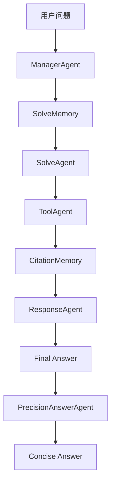
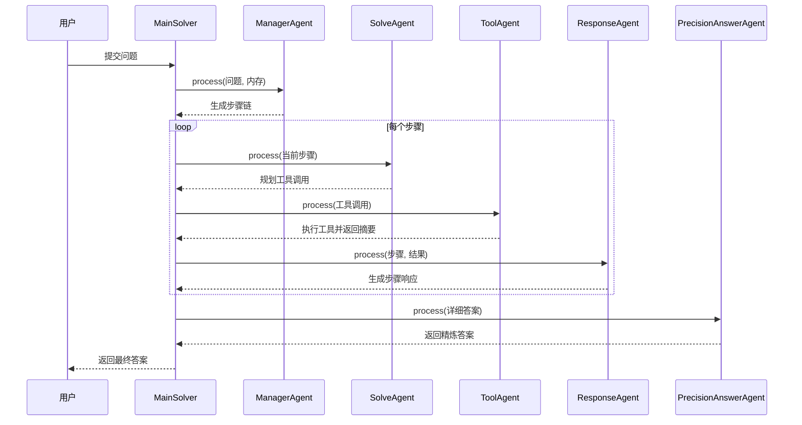

# 求解循环

<cite>
**本文档引用文件**   
- [manager_agent.py](file://src/agents/solve/solve_loop/manager_agent.py)
- [solve_agent.py](file://src/agents/solve/solve_loop/solve_agent.py)
- [tool_agent.py](file://src/agents/solve/solve_loop/tool_agent.py)
- [response_agent.py](file://src/agents/solve/solve_loop/response_agent.py)
- [precision_answer_agent.py](file://src/agents/solve/solve_loop/precision_answer_agent.py)
- [solve_memory.py](file://src/agents/solve/memory/solve_memory.py)
- [citation_memory.py](file://src/agents/solve/memory/citation_memory.py)
- [base_agent.py](file://src/agents/solve/base_agent.py)
- [main_solver.py](file://src/agents/solve/main_solver.py)
- [manager_agent.yaml](file://src/agents/solve/prompts/zh/solve_loop/manager_agent.yaml)
- [solve_agent.yaml](file://src/agents/solve/prompts/zh/solve_loop/solve_agent.yaml)
- [tool_agent.yaml](file://src/agents/solve/prompts/zh/solve_loop/tool_agent.yaml)
- [response_agent.yaml](file://src/agents/solve/prompts/zh/solve_loop/response_agent.yaml)
- [precision_answer_agent.yaml](file://src/agents/solve/prompts/zh/solve_loop/precision_answer_agent.yaml)
- [agents.yaml](file://config/agents.yaml)
- [main.yaml](file://config/main.yaml)
</cite>

## 目录
1. [引言](#引言)
2. [求解循环架构](#求解循环架构)
3. [核心组件分析](#核心组件分析)
4. [调用关系与工作流](#调用关系与工作流)
5. [领域模型与内存系统](#领域模型与内存系统)
6. [配置选项与参数](#配置选项与参数)
7. [常见问题与解决方案](#常见问题与解决方案)
8. [结论](#结论)

## 引言
求解循环是DeepTutor系统中的核心问题解决机制，采用双循环架构（分析循环+求解循环）来系统性地解决用户提出的问题。该系统通过多个专业代理（Agent）的协作，将复杂问题分解为可执行的步骤，利用工具获取信息，并最终生成结构化的答案。本文档将深入解析求解循环的实现细节、组件交互、配置选项以及常见问题的解决方案。

## 求解循环架构

求解循环是一个由多个代理组成的流水线系统，每个代理负责特定的任务。整个流程始于`ManagerAgent`对问题进行战略规划，生成一个步骤链（Solve Chain），然后由`SolveAgent`、`ToolAgent`、`ResponseAgent`依次执行每个步骤，最后由`PrecisionAnswerAgent`生成精炼的答案。



**Diagram sources**
- [main_solver.py](file://src/agents/solve/main_solver.py#L225-L779)
- [solve_memory.py](file://src/agents/solve/memory/solve_memory.py#L1-L341)

## 核心组件分析

### ManagerAgent：求解计划制定者

`ManagerAgent`是求解循环的起点，负责将用户问题分解为一系列逻辑严密的求解步骤。

**功能与实现**
- **输入**：用户问题、研究内存（包含知识链）
- **输出**：一个JSON格式的步骤链，每个步骤包含ID、角色、目标和引用ID
- **实现细节**：该代理通过构建上下文（包括用户问题、知识链摘要和反思摘要），调用大语言模型（LLM）生成求解计划。它会检查是否已存在步骤，避免重复规划。

**Section sources**
- [manager_agent.py](file://src/agents/solve/solve_loop/manager_agent.py#L1-L263)
- [manager_agent.yaml](file://src/agents/solve/prompts/zh/solve_loop/manager_agent.yaml#L1-L67)

### SolveAgent：步骤执行规划者

`SolveAgent`负责为`ManagerAgent`生成的每个步骤规划具体的工具调用轨迹。

**功能与实现**
- **输入**：当前步骤目标、可用知识、历史工具调用
- **输出**：一个JSON格式的工具调用列表，指定工具类型和查询内容
- **实现细节**：该代理根据步骤角色（如计算、分析、画图）决定使用何种工具。它支持多种工具类型，包括`rag_naive`、`rag_hybrid`、`web_search`、`code_execution`和`none`。对于代码执行，有严格的规范，如变量名必须使用英文、禁止使用`plt.show()`等。

**Section sources**
- [solve_agent.py](file://src/agents/solve/solve_loop/solve_agent.py#L1-L341)
- [solve_agent.yaml](file://src/agents/solve/prompts/zh/solve_loop/solve_agent.yaml#L1-L69)

### ToolAgent：工具调用处理器

`ToolAgent`负责实际执行`SolveAgent`规划的工具调用，并生成执行结果的摘要。

**功能与实现**
- **输入**：工具调用记录（类型、查询）
- **输出**：工具执行的原始结果和结构化摘要
- **实现细节**：该代理会根据工具类型调用相应的工具函数，如`rag_search`、`web_search`或`run_code`。执行成功后，它会调用LLM将原始结果（如代码输出或搜索结果）总结为简洁的摘要。对于生成的图片文件，它会特别标注并描述其内容。

**Section sources**
- [tool_agent.py](file://src/agents/solve/solve_loop/tool_agent.py#L1-L428)
- [tool_agent.yaml](file://src/agents/solve/prompts/zh/solve_loop/tool_agent.yaml#L1-L38)

### ResponseAgent：响应生成器

`ResponseAgent`负责将工具执行的结果整合成正式的、高质量的步骤响应。

**功能与实现**
- **输入**：当前步骤、工具执行结果、引用信息
- **输出**：针对当前步骤目标的正式回答
- **实现细节**：该代理遵循严格的格式规范，包括使用LaTeX格式化数学公式、正确插入图片、标注引用等。它会确保回答内容与前序步骤连贯，并且只响应当前步骤的目标。

**Section sources**
- [response_agent.py](file://src/agents/solve/solve_loop/response_agent.py#L1-L290)
- [response_agent.yaml](file://src/agents/solve/prompts/zh/solve_loop/response_agent.yaml#L1-L91)

### PrecisionAnswerAgent：精确答案生成器

`PrecisionAnswerAgent`是一个可选的两阶段代理，用于从详细的解答中提取出最核心的最终答案。

**功能与实现**
- **输入**：用户问题、详细的解答
- **输出**：一个精炼的、短小的最终答案
- **实现细节**：该代理首先判断问题类型（如选择题、计算题），如果需要精确答案，则调用LLM从详细解答中提取出最终结果。例如，对于选择题，只提取选项字母；对于计算题，只提取最终数值。

**Section sources**
- [precision_answer_agent.py](file://src/agents/solve/solve_loop/precision_answer_agent.py#L1-L87)
- [precision_answer_agent.yaml](file://src/agents/solve/prompts/zh/solve_loop/precision_answer_agent.yaml#L1-L63)

## 调用关系与工作流

求解循环的工作流是一个精心编排的序列，各组件之间通过内存系统进行数据交换。



**Diagram sources**
- [main_solver.py](file://src/agents/solve/main_solver.py#L225-L779)
- [solve_agent.py](file://src/agents/solve/solve_loop/solve_agent.py#L1-L341)

## 领域模型与内存系统

求解循环依赖于两个关键的内存系统来管理状态和数据。

### SolveMemory：求解链内存

`SolveMemory`是求解循环的核心数据存储，它以“求解链”（Solve Chain）的形式组织数据。

**数据结构**
- **SolveChainStep**：表示一个求解步骤，包含步骤ID、目标、可用引用、工具调用列表、步骤响应和状态。
- **ToolCallRecord**：表示一次工具调用，包含工具类型、查询、原始结果、摘要和状态。

**功能**
- `create_chains`：创建新的求解步骤链。
- `append_tool_call`：为指定步骤添加工具调用。
- `submit_step_response`：提交步骤的最终响应。
- `save` 和 `load_or_create`：持久化和加载内存数据。

**Section sources**
- [solve_memory.py](file://src/agents/solve/memory/solve_memory.py#L1-L341)

### CitationMemory：引用内存

`CitationMemory`是一个全局的引用管理系统，用于统一管理所有工具调用产生的引用信息。

**数据结构**
- **CitationItem**：表示一个引用条目，包含引用ID（如`[rag-1]`）、工具类型、查询、原始结果、来源和内容摘要。

**功能**
- `add_citation`：添加新的引用条目，并自动生成唯一的引用ID。
- `get_citation`：根据引用ID获取引用信息。
- `format_citations_markdown`：将引用列表格式化为Markdown格式，用于最终答案的引用部分。

**Section sources**
- [citation_memory.py](file://src/agents/solve/memory/citation_memory.py#L1-L354)

## 配置选项与参数

求解循环的行为可以通过配置文件进行精细控制。

### agents.yaml：统一代理参数

该文件是所有代理模块的单一可信源，定义了`temperature`和`max_tokens`等关键参数。

```yaml
solve:
  temperature: 0.3
  max_tokens: 8192
```

- **temperature**: 控制LLM输出的随机性，值越低越确定。
- **max_tokens**: 限制LLM响应的最大token数。

**Section sources**
- [agents.yaml](file://config/agents.yaml#L1-L55)

### main.yaml：系统级配置

该文件包含求解模块的系统级配置。

```yaml
solve:
  max_solve_correction_iterations: 3
  enable_citations: true
  save_intermediate_results: true
  agents:
    investigate_agent:
      max_iterations: 3
    precision_answer_agent:
      enabled: true
```

- **max_solve_correction_iterations**: 每个步骤的最大修正迭代次数。
- **enable_citations**: 是否启用引用功能。
- **precision_answer_agent.enabled**: 是否启用精确答案生成。

**Section sources**
- [main.yaml](file://config/main.yaml#L54-L64)

## 常见问题与解决方案

### 步骤执行失败

**问题**：`ToolAgent`在执行代码时失败，例如文件路径错误。

**解决方案**：
1. **路径错误**：确保代码中保存图片时使用相对路径，如`plt.savefig('plot.png')`，而不是`plt.savefig('artifacts/plot.png')`。
2. **代码错误**：检查代码语法和逻辑，确保所有必要的库都已导入。
3. **超时**：如果代码执行时间过长，可以增加`code_timeout`配置。

### 响应生成不完整

**问题**：`ResponseAgent`生成的响应缺少图片或引用。

**解决方案**：
1. **检查图片路径**：确保`ToolAgent`生成的图片路径正确，并且`ResponseAgent`的提示模板中正确引用了这些路径。
2. **验证引用ID**：确保`SolveAgent`规划的步骤中引用的ID在知识链中存在。
3. **查看日志**：检查系统日志，确认`ResponseAgent`是否收到了正确的上下文信息。

**Section sources**
- [tool_agent.py](file://src/agents/solve/solve_loop/tool_agent.py#L223-L234)
- [response_agent.py](file://src/agents/solve/solve_loop/response_agent.py#L144-L154)

## 结论

求解循环是一个复杂而强大的问题解决系统，它通过将任务分解为多个专业代理的协作，实现了对复杂问题的系统性求解。通过深入理解`ManagerAgent`、`SolveAgent`、`ToolAgent`、`ResponseAgent`和`PrecisionAnswerAgent`的职责，以及`SolveMemory`和`CitationMemory`的协同工作，开发者可以有效地利用和扩展这一系统。合理的配置和对常见问题的了解，是确保求解循环稳定高效运行的关键。