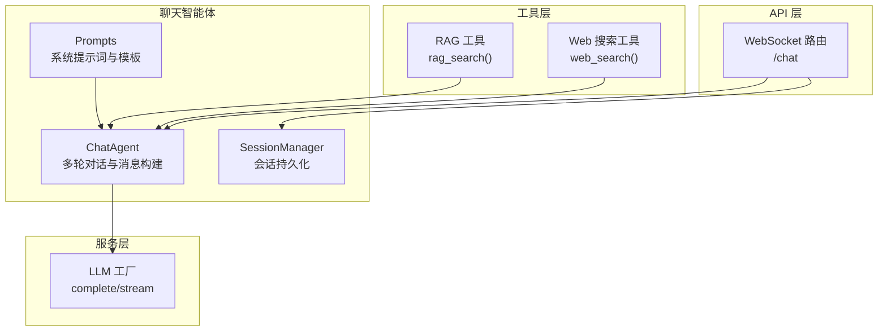
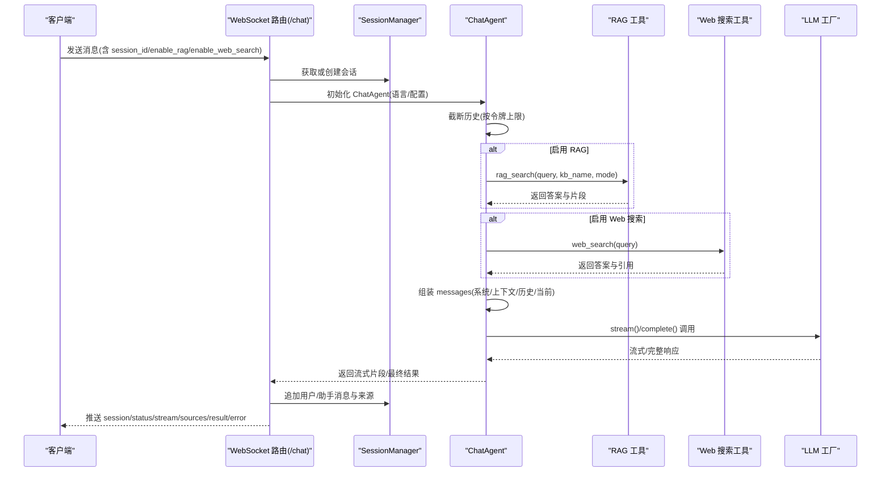
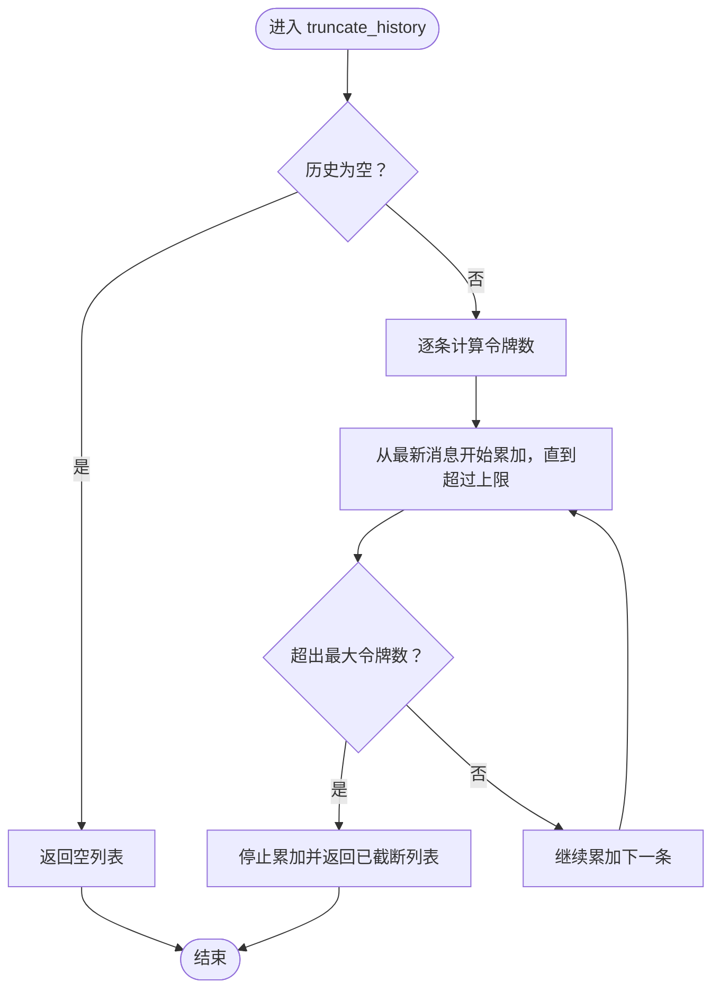
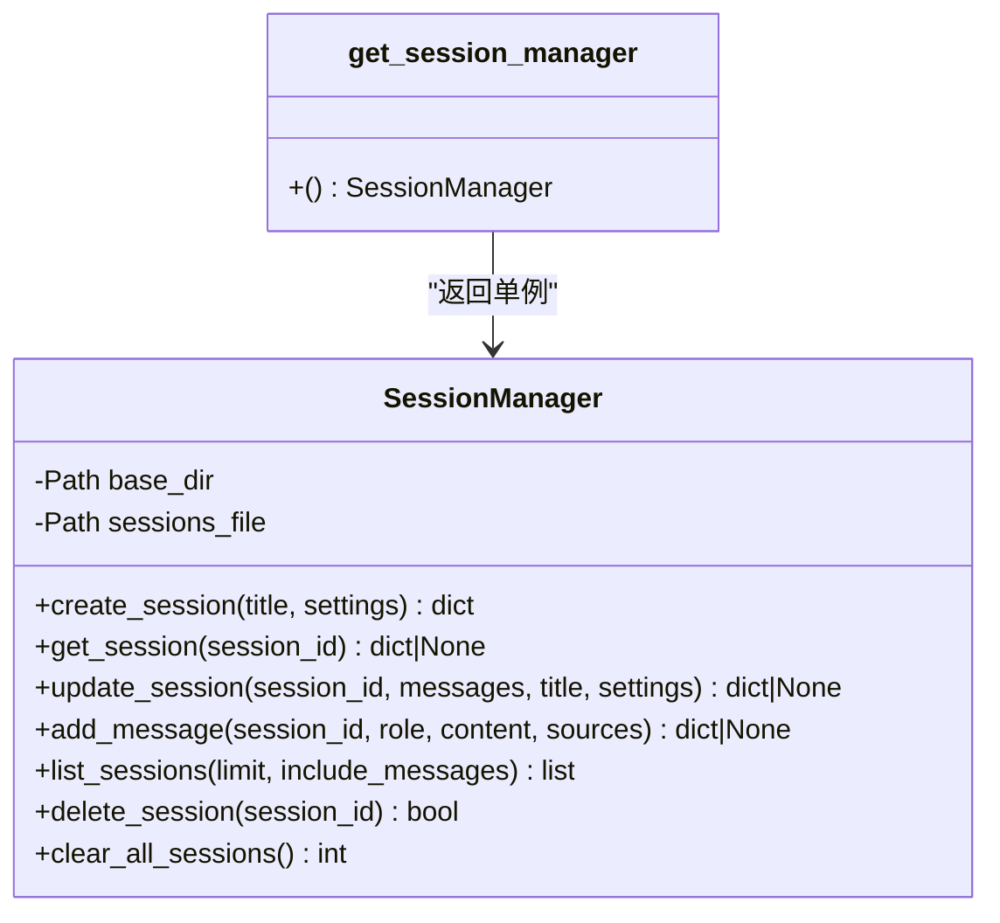
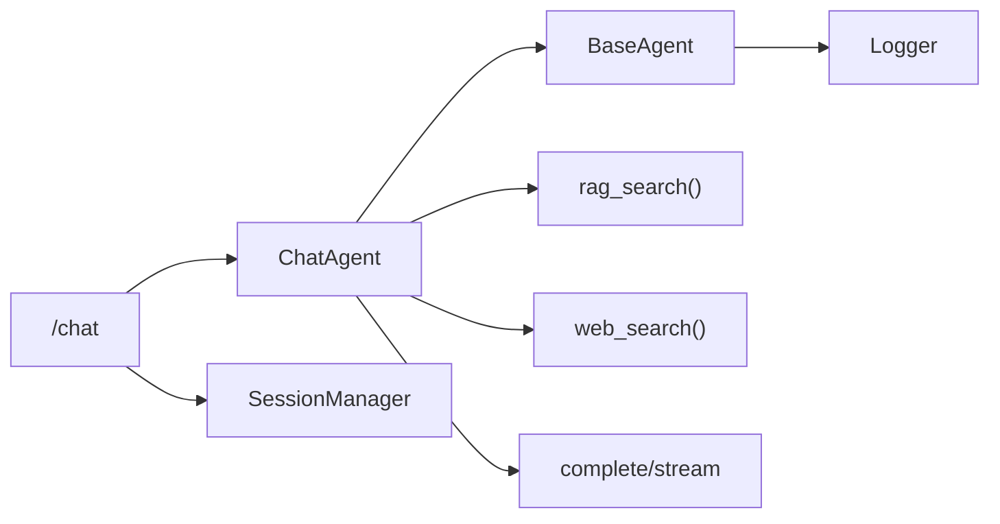

# 聊天智能体

<cite>
**本文引用的文件**
- [src/agents/chat/chat_agent.py](file://src/agents/chat/chat_agent.py)
- [src/agents/chat/session_manager.py](file://src/agents/chat/session_manager.py)
- [src/agents/chat/__init__.py](file://src/agents/chat/__init__.py)
- [src/agents/chat/prompts/zh/chat_agent.yaml](file://src/agents/chat/prompts/zh/chat_agent.yaml)
- [src/agents/chat/prompts/en/chat_agent.yaml](file://src/agents/chat/prompts/en/chat_agent.yaml)
- [src/agents/base_agent.py](file://src/agents/base_agent.py)
- [src/api/routers/chat.py](file://src/api/routers/chat.py)
- [src/services/llm/factory.py](file://src/services/llm/factory.py)
- [src/tools/rag_tool.py](file://src/tools/rag_tool.py)
- [src/tools/web_search.py](file://src/tools/web_search.py)
- [config/agents.yaml](file://config/agents.yaml)
- [src/services/config/loader.py](file://src/services/config/loader.py)
- [src/logging/logger.py](file://src/logging/logger.py)
</cite>

## 目录
1. [简介](#简介)
2. [项目结构](#项目结构)
3. [核心组件](#核心组件)
4. [架构总览](#架构总览)
5. [详细组件分析](#详细组件分析)
6. [依赖关系分析](#依赖关系分析)
7. [性能与可扩展性](#性能与可扩展性)
8. [故障排查指南](#故障排查指南)
9. [结论](#结论)

## 简介
本文件面向“聊天智能体”子系统，系统化梳理其代码结构、运行机制与集成方式，帮助开发者与使用者快速理解如何在 DeepTutor 中启用多轮对话、会话持久化、检索增强生成（RAG）与网络搜索增强，并通过统一的 LLM 工厂实现云/本地模型的无缝切换。文档同时提供可视化图示与分层说明，兼顾技术深度与可读性。

## 项目结构
聊天智能体位于 src/agents/chat 下，围绕 ChatAgent 与 SessionManager 两大核心模块构建，配合工具层的 RAG 与 Web Search，以及 API 层的 WebSocket 路由，形成端到端的聊天体验。

图表来源
- [src/agents/chat/chat_agent.py](file://src/agents/chat/chat_agent.py#L1-L436)
- [src/agents/chat/session_manager.py](file://src/agents/chat/session_manager.py#L1-L312)
- [src/tools/rag_tool.py](file://src/tools/rag_tool.py#L1-L174)
- [src/tools/web_search.py](file://src/tools/web_search.py#L1-L443)
- [src/services/llm/factory.py](file://src/services/llm/factory.py#L1-L391)
- [src/api/routers/chat.py](file://src/api/routers/chat.py#L1-L280)

章节来源
- [src/agents/chat/__init__.py](file://src/agents/chat/__init__.py#L1-L25)

## 核心组件
- ChatAgent：负责多轮对话、历史截断、上下文检索（RAG/Web）、消息格式化与 LLM 调用（同步/流式），并进行令牌统计与日志记录。
- SessionManager：负责会话创建、更新、查询、删除、列表展示与消息追加，持久化至 data/user/chat_sessions.json。
- Prompts：按语言加载系统提示词、上下文模板与历史格式化模板。
- LLM 工厂：统一路由到云/本地模型提供方，支持模式切换与预设提供商。
- 工具层：RAG 工具封装知识库检索；Web 搜索工具封装 Perplexity 或百度 AI 搜索。
- API 路由：WebSocket 提供实时聊天，REST 提供会话管理接口。

章节来源
- [src/agents/chat/chat_agent.py](file://src/agents/chat/chat_agent.py#L1-L436)
- [src/agents/chat/session_manager.py](file://src/agents/chat/session_manager.py#L1-L312)
- [src/agents/chat/prompts/zh/chat_agent.yaml](file://src/agents/chat/prompts/zh/chat_agent.yaml#L1-L36)
- [src/agents/chat/prompts/en/chat_agent.yaml](file://src/agents/chat/prompts/en/chat_agent.yaml#L1-L36)
- [src/services/llm/factory.py](file://src/services/llm/factory.py#L1-L391)
- [src/tools/rag_tool.py](file://src/tools/rag_tool.py#L1-L174)
- [src/tools/web_search.py](file://src/tools/web_search.py#L1-L443)
- [src/api/routers/chat.py](file://src/api/routers/chat.py#L1-L280)

## 架构总览
下图展示了从 API 到工具与 LLM 的调用链路，以及会话管理的数据流。

图表来源
- [src/api/routers/chat.py](file://src/api/routers/chat.py#L90-L280)
- [src/agents/chat/chat_agent.py](file://src/agents/chat/chat_agent.py#L163-L433)
- [src/tools/rag_tool.py](file://src/tools/rag_tool.py#L24-L71)
- [src/tools/web_search.py](file://src/tools/web_search.py#L335-L418)
- [src/services/llm/factory.py](file://src/services/llm/factory.py#L166-L285)
- [src/agents/chat/session_manager.py](file://src/agents/chat/session_manager.py#L185-L225)

## 详细组件分析

### ChatAgent 组件
职责与特性
- 多轮对话与历史截断：基于令牌估算与从新到旧的策略，确保上下文不超过阈值。
- 上下文检索：可选启用 RAG 与 Web 搜索，将检索结果拼接为上下文模板。
- 消息构建：组装系统提示词、上下文、历史与当前消息，兼容流式与非流式生成。
- LLM 调用：通过 BaseAgent 的统一接口完成调用，并进行令牌统计与日志记录。
- 语言与提示词：按语言加载系统提示词、上下文模板与历史格式化模板。

关键流程图（历史截断）

图表来源
- [src/agents/chat/chat_agent.py](file://src/agents/chat/chat_agent.py#L94-L139)

章节来源
- [src/agents/chat/chat_agent.py](file://src/agents/chat/chat_agent.py#L1-L436)
- [src/agents/base_agent.py](file://src/agents/base_agent.py#L307-L606)
- [src/agents/chat/prompts/zh/chat_agent.yaml](file://src/agents/chat/prompts/zh/chat_agent.yaml#L1-L36)
- [src/agents/chat/prompts/en/chat_agent.yaml](file://src/agents/chat/prompts/en/chat_agent.yaml#L1-L36)

### SessionManager 组件
职责与特性
- 会话生命周期：创建、查询、更新、删除、清空。
- 消息管理：按角色与时间戳追加消息，自动设置标题（首条用户消息）。
- 数据持久化：以 JSON 文件存储，限制最大会话数量，避免文件膨胀。
- 单例访问：提供便捷的全局实例获取函数。

类图

图表来源
- [src/agents/chat/session_manager.py](file://src/agents/chat/session_manager.py#L1-L312)

章节来源
- [src/agents/chat/session_manager.py](file://src/agents/chat/session_manager.py#L1-L312)

### 提示词与语言配置
- 提示词来源：按模块与代理名加载，支持 zh/en 两种语言。
- 关键模板：system、context_template、user_template、history_format。
- 语言解析：统一解析为 zh/en，确保提示词与前端一致。

章节来源
- [src/agents/chat/prompts/zh/chat_agent.yaml](file://src/agents/chat/prompts/zh/chat_agent.yaml#L1-L36)
- [src/agents/chat/prompts/en/chat_agent.yaml](file://src/agents/chat/prompts/en/chat_agent.yaml#L1-L36)
- [src/services/config/loader.py](file://src/services/config/loader.py#L119-L145)

### LLM 工厂与模型路由
- 统一入口：complete/stream 接收 prompt/system_prompt/messages 等参数。
- 路由策略：根据部署模式（api/local/hybrid）与有效配置选择云/本地提供方。
- 预设提供商：包含 OpenAI、Anthropic、DeepSeek、OpenRouter、Ollama、LM Studio、vLLM、llama.cpp 等。
- 令牌限制：针对新模型动态注入 max_tokens 参数。

章节来源
- [src/services/llm/factory.py](file://src/services/llm/factory.py#L1-L391)

### 工具层：RAG 与 Web 搜索
- RAG：封装知识库检索，支持多种模式与管线，异常统一抛出。
- Web 搜索：支持 Perplexity 与百度 AI 搜索，标准化输出结构，包含答案、引用、用量等。

章节来源
- [src/tools/rag_tool.py](file://src/tools/rag_tool.py#L1-L174)
- [src/tools/web_search.py](file://src/tools/web_search.py#L1-L443)

### API 路由：WebSocket 与 REST
- WebSocket：接收消息、管理会话、发送状态与流式响应、推送最终结果与来源。
- REST：列出会话、获取会话详情、删除会话。
- 语言与配置：从主配置中读取系统语言，初始化 ChatAgent。

章节来源
- [src/api/routers/chat.py](file://src/api/routers/chat.py#L1-L280)

## 依赖关系分析
- ChatAgent 依赖 BaseAgent 提供统一的 LLM 调用接口与提示词加载。
- ChatAgent 依赖工具层进行 RAG 与 Web 搜索。
- ChatAgent 通过 LLM 工厂完成云/本地模型调用。
- API 路由依赖 ChatAgent 与 SessionManager 完成端到端交互。
- 日志系统贯穿各模块，提供统一格式与统计。

图表来源
- [src/agents/chat/chat_agent.py](file://src/agents/chat/chat_agent.py#L1-L436)
- [src/agents/base_agent.py](file://src/agents/base_agent.py#L1-L606)
- [src/tools/rag_tool.py](file://src/tools/rag_tool.py#L1-L174)
- [src/tools/web_search.py](file://src/tools/web_search.py#L1-L443)
- [src/services/llm/factory.py](file://src/services/llm/factory.py#L1-L391)
- [src/api/routers/chat.py](file://src/api/routers/chat.py#L1-L280)
- [src/logging/logger.py](file://src/logging/logger.py#L1-L672)

## 性能与可扩展性
- 历史截断：通过令牌估算与从新到旧的累积策略，避免上下文超限，提升稳定性。
- 流式输出：WebSocket 支持边生成边返回，改善用户体验。
- LLM 路由：hybrid 模式下优先使用活动提供方，降低延迟与成本。
- 会话持久化：限制会话数量与消息长度，控制磁盘占用。
- 可扩展点：
  - 新增提示词模板：在对应语言目录新增 YAML 键位即可。
  - 新增检索管线：在 RAG 工具中注册新管线并暴露接口。
  - 新增搜索提供商：在 Web 搜索工具中添加新客户端与标准化输出。
  - 新增模型提供方：在 LLM 工厂中注册新绑定类型与预设。

[本节为通用建议，无需特定文件引用]

## 故障排查指南
- LLM 调用失败
  - 确认环境变量与配置是否正确（模型名、API 密钥、基础地址）。
  - 查看日志中的 LLM 输入/输出摘要，定位问题阶段。
  - 切换部署模式（api/local/hybrid）验证是否为提供方问题。
- RAG 检索失败
  - 检查知识库名称与模式是否正确，确认管线可用。
  - 查看异常信息与重试次数配置。
- Web 搜索失败
  - 确认搜索提供商与密钥配置，检查网络连通性。
  - 若使用 Perplexity，需安装对应依赖。
- 会话异常
  - 检查 chat_sessions.json 是否损坏或被手动修改。
  - 使用 REST 接口清理无效会话或重建。

章节来源
- [src/agents/base_agent.py](file://src/agents/base_agent.py#L307-L606)
- [src/tools/rag_tool.py](file://src/tools/rag_tool.py#L64-L71)
- [src/tools/web_search.py](file://src/tools/web_search.py#L224-L333)
- [src/agents/chat/session_manager.py](file://src/agents/chat/session_manager.py#L56-L77)

## 结论
聊天智能体通过 ChatAgent、SessionManager、工具层与 API 路由的协同，实现了稳定、可扩展的多轮对话体验。其统一的 LLM 工厂与提示词体系，使得在不同部署环境下均能平滑运行，并为后续功能扩展提供了清晰的边界与接口。建议在生产环境中结合日志与令牌统计持续优化上下文长度与模型参数，以获得最佳性价比与响应速度。