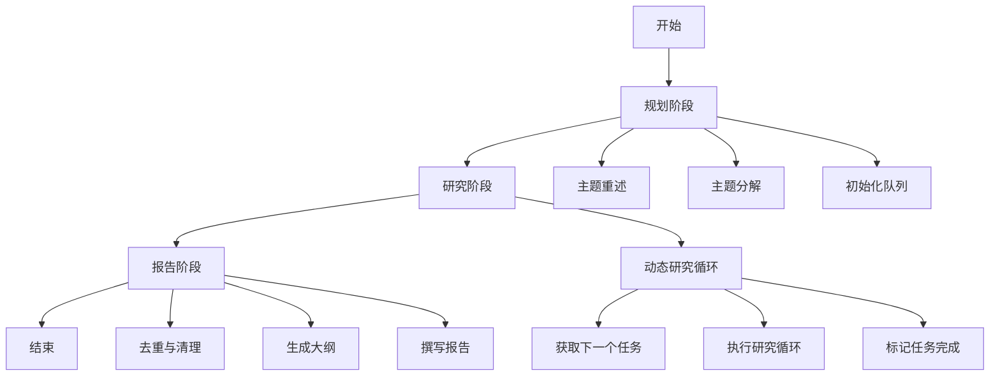
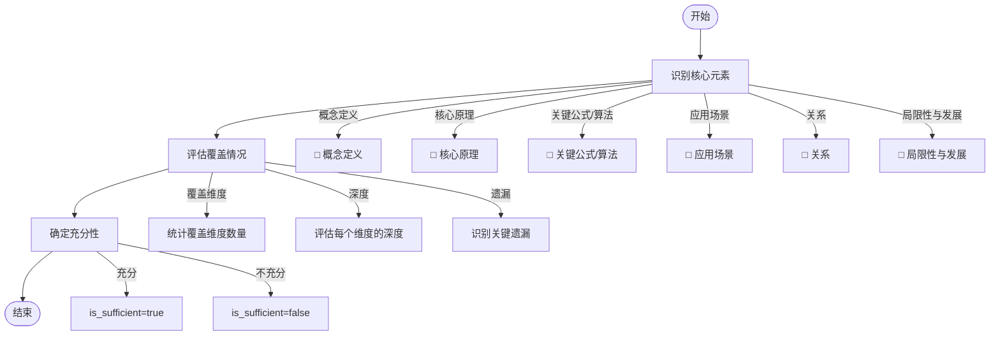
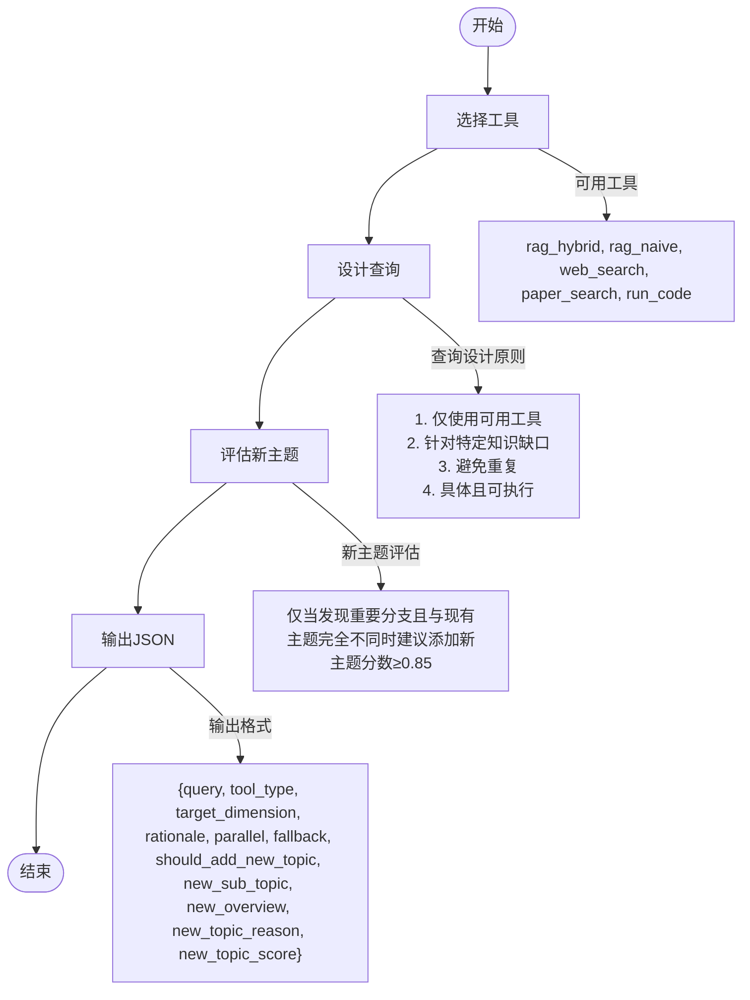
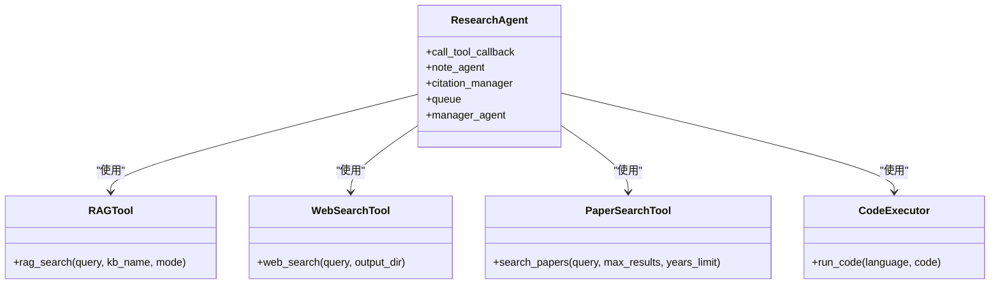
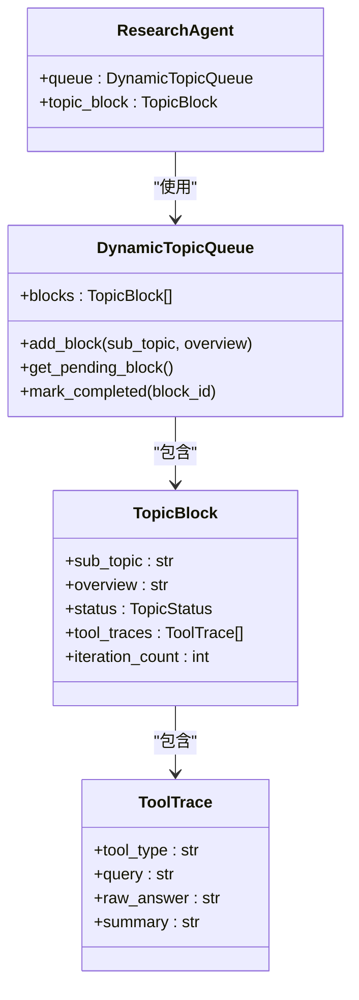

# 深度研究

<cite>
**本文档引用的文件**  
- [research_pipeline.py](file://src/agents/research/research_pipeline.py)
- [main.py](file://src/agents/research/main.py)
- [data_structures.py](file://src/agents/research/data_structures.py)
- [research_agent.py](file://src/agents/research/agents/research_agent.py)
- [reporting_agent.py](file://src/agents/research/agents/reporting_agent.py)
- [base_agent.py](file://src/agents/research/agents/base_agent.py)
- [citation_manager.py](file://src/agents/research/utils/citation_manager.py)
- [agents.yaml](file://config/agents.yaml)
- [main.yaml](file://config/main.yaml)
- [rag_tool.py](file://src/tools/rag_tool.py)
- [web_search.py](file://src/tools/web_search.py)
- [paper_search_tool.py](file://src/tools/paper_search_tool.py)
- [research_agent.yaml](file://src/agents/research/prompts/en/research_agent.yaml)
- [reporting_agent.yaml](file://src/agents/research/prompts/en/reporting_agent.yaml)
</cite>

## 目录
1. [引言](#引言)
2. [研究流程架构](#研究流程架构)
3. [核心组件分析](#核心组件分析)
4. [研究代理实现细节](#研究代理实现细节)
5. [报告代理实现细节](#报告代理实现细节)
6. [配置选项与参数](#配置选项与参数)
7. [与其他组件的关系](#与其他组件的关系)
8. [常见问题与解决方案](#常见问题与解决方案)
9. [结论](#结论)

## 引言
深度研究功能是DeepTutor系统的核心组件，实现了基于动态主题队列的三阶段研究工作流：规划、研究和报告。该系统通过多个智能代理协同工作，能够对复杂主题进行系统性、深度的探索和分析。本文档将详细解释该功能的实现细节，包括其架构设计、核心组件、配置选项以及常见问题的解决方案，旨在为开发者和用户提供全面的技术参考。

## 研究流程架构
深度研究功能的核心是`ResearchPipeline`类，它协调了整个研究工作流。该工作流分为三个主要阶段：规划阶段、研究阶段和报告阶段。每个阶段由专门的代理负责执行，确保了研究过程的系统性和完整性。



**图源**  
- [research_pipeline.py](file://src/agents/research/research_pipeline.py#L65-L803)

## 核心组件分析
深度研究功能由多个核心组件构成，包括`ResearchPipeline`、`ResearchAgent`、`ReportingAgent`、`DynamicTopicQueue`和`CitationManager`。这些组件共同协作，实现了从主题输入到最终报告输出的完整研究流程。

### ResearchPipeline
`ResearchPipeline`是整个研究流程的协调者，负责初始化所有代理、管理研究状态和协调各阶段的执行。它通过`run`方法启动整个研究流程，并在每个阶段完成后进行相应的处理。

**组件源**  
- [research_pipeline.py](file://src/agents/research/research_pipeline.py#L65-L803)

### ResearchAgent
`ResearchAgent`负责执行研究阶段的核心逻辑，包括知识充分性检查和查询计划生成。它通过与各种工具交互来获取信息，并将结果记录在队列中。

**组件源**  
- [research_agent.py](file://src/agents/research/agents/research_agent.py#L23-L700)

### ReportingAgent
`ReportingAgent`负责生成最终的研究报告，包括去重、生成大纲和撰写报告。它确保报告的结构清晰、内容完整。

**组件源**  
- [reporting_agent.py](file://src/agents/research/agents/reporting_agent.py#L28-L1320)

### DynamicTopicQueue
`DynamicTopicQueue`是系统的核心内存和调度中心，负责管理所有研究主题的状态和进度。它确保了研究过程的有序进行。

**组件源**  
- [data_structures.py](file://src/agents/research/data_structures.py#L225-L450)

### CitationManager
`CitationManager`负责管理引用信息，确保所有引用都有唯一的标识符，并在报告中正确引用。

**组件源**  
- [citation_manager.py](file://src/agents/research/utils/citation_manager.py#L18-L798)

## 研究代理实现细节
`ResearchAgent`是研究阶段的核心组件，它通过多轮迭代来深入挖掘主题信息。其主要功能包括知识充分性检查和查询计划生成。

### 知识充分性检查
`check_sufficiency`方法用于评估当前知识是否足够。它通过分析当前知识的覆盖维度来决定是否需要继续研究。



**图源**  
- [research_agent.yaml](file://src/agents/research/prompts/en/research_agent.yaml#L90-L134)

### 查询计划生成
`generate_query_plan`方法用于生成下一个查询计划。它根据当前知识和可用工具来决定下一步的研究方向。



**图源**  
- [research_agent.yaml](file://src/agents/research/prompts/en/research_agent.yaml#L136-L173)

## 报告代理实现细节
`ReportingAgent`负责生成最终的研究报告，其主要功能包括去重、生成大纲和撰写报告。

### 去重与清理
`_deduplicate_blocks`方法用于识别和去除重复或高度相似的主题，确保报告内容的唯一性和完整性。

**组件源**  
- [reporting_agent.py](file://src/agents/research/agents/reporting_agent.py#L162-L187)

### 生成大纲
`_generate_outline`方法用于生成报告的大纲，包括标题、引言、章节和结论。它确保报告结构清晰、逻辑连贯。

**组件源**  
- [reporting_agent.py](file://src/agents/research/agents/reporting_agent.py#L189-L257)

### 撰写报告
`_write_report`方法负责撰写报告的各个部分，包括引言、章节内容和结论。它确保报告内容详实、论证充分。

**组件源**  
- [reporting_agent.py](file://src/agents/research/agents/reporting_agent.py#L364-L539)

## 配置选项与参数
深度研究功能提供了丰富的配置选项，允许用户根据需要调整研究行为。

### agents.yaml 配置
`agents.yaml`文件定义了所有代理的统一参数，包括温度和最大令牌数。

```yaml
research:
  temperature: 0.5
  max_tokens: 12000
```

**配置源**  
- [agents.yaml](file://config/agents.yaml#L18-L20)

### main.yaml 配置
`main.yaml`文件包含了研究模块的具体配置，如规划、研究和报告阶段的参数。

```yaml
research:
  planning:
    rephrase:
      enabled: true
      max_iterations: 3
    decompose:
      enabled: true
      mode: auto
      initial_subtopics: 5
      auto_max_subtopics: 8
  researching:
    max_iterations: 5
    new_topic_min_score: 0.85
    execution_mode: parallel
    max_parallel_topics: 5
    enable_rag_naive: true
    enable_rag_hybrid: true
    enable_paper_search: true
    enable_web_search: true
    enable_run_code: true
    tool_timeout: 60
    tool_max_retries: 2
    paper_search_years_limit: 3
  reporting:
    min_section_length: 800
    enable_citation_list: true
    enable_inline_citations: false
  rag:
    kb_name: DE-all
    default_mode: hybrid
    fallback_mode: naive
  queue:
    max_length: 5
```

**配置源**  
- [main.yaml](file://config/main.yaml#L64-L141)

## 与其他组件的关系
深度研究功能与系统中的其他组件紧密协作，共同完成研究任务。

### 与工具组件的关系
研究代理通过调用各种工具来获取信息，包括RAG检索、网络搜索、论文搜索和代码执行。



**图源**  
- [research_pipeline.py](file://src/agents/research/research_pipeline.py#L47-L62)
- [rag_tool.py](file://src/tools/rag_tool.py#L31-L262)
- [web_search.py](file://src/tools/web_search.py#L19-L172)
- [paper_search_tool.py](file://src/tools/paper_search_tool.py#L28-L108)

### 与数据结构的关系
研究代理使用`DynamicTopicQueue`和`TopicBlock`等数据结构来管理研究状态和进度。



**图源**  
- [data_structures.py](file://src/agents/research/data_structures.py#L225-L450)
- [research_agent.py](file://src/agents/research/agents/research_agent.py#L427-L435)

## 常见问题与解决方案
在使用深度研究功能时，可能会遇到一些常见问题。以下是这些问题的解决方案。

### 问题1：研究过程卡住或无限循环
**现象**：研究过程在某个主题上反复迭代，无法进入下一个主题。
**原因**：知识充分性检查未能正确判断知识是否足够。
**解决方案**：
1. 检查`main.yaml`中的`max_iterations`配置，确保其值合理。
2. 检查`research_agent.yaml`中的充分性判断标准，确保其逻辑正确。
3. 如果问题持续存在，可以尝试降低`new_topic_min_score`的值，以减少新主题的生成。

### 问题2：报告生成失败
**现象**：报告生成阶段失败，无法生成最终报告。
**原因**：大纲生成或章节撰写过程中出现错误。
**解决方案**：
1. 检查`reporting_agent.yaml`中的提示模板，确保其格式正确。
2. 检查`main.yaml`中的`min_section_length`配置，确保其值合理。
3. 如果问题持续存在，可以尝试禁用内联引用（`enable_inline_citations: false`）。

### 问题3：引用信息丢失
**现象**：报告中的引用信息不完整或丢失。
**原因**：`CitationManager`未能正确记录引用信息。
**解决方案**：
1. 检查`citation_manager.py`中的引用提取逻辑，确保其能正确处理各种工具的响应。
2. 检查`main.yaml`中的`enable_citation_list`配置，确保其值为`true`。
3. 如果问题持续存在，可以尝试手动检查引用JSON文件，确保其内容完整。

## 结论
深度研究功能通过精心设计的架构和组件，实现了对复杂主题的系统性、深度探索。通过理解其核心组件、配置选项和常见问题的解决方案，用户可以更好地利用这一功能进行高效的研究工作。未来的工作可以进一步优化代理的决策逻辑，提高研究效率和报告质量。