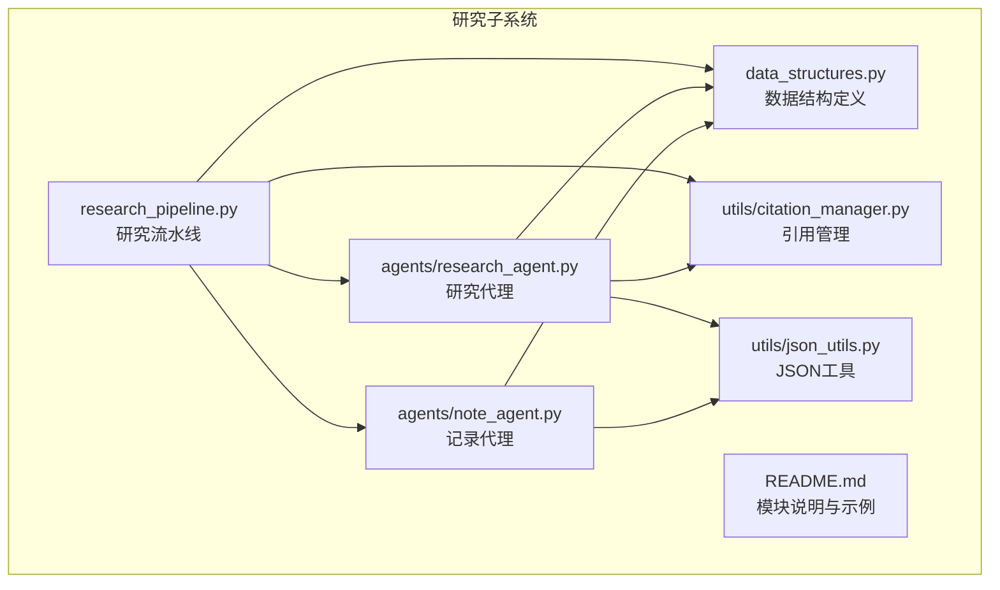
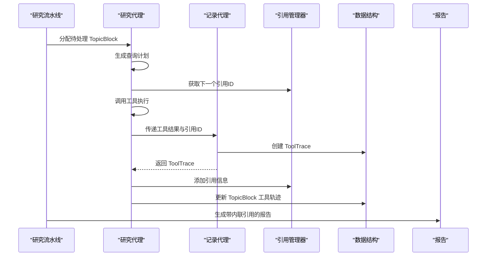
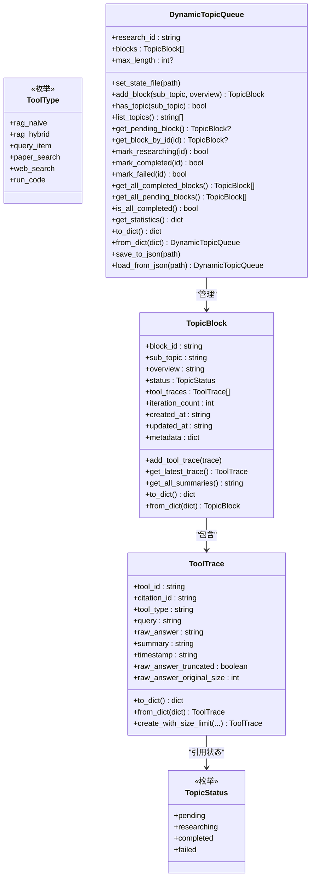
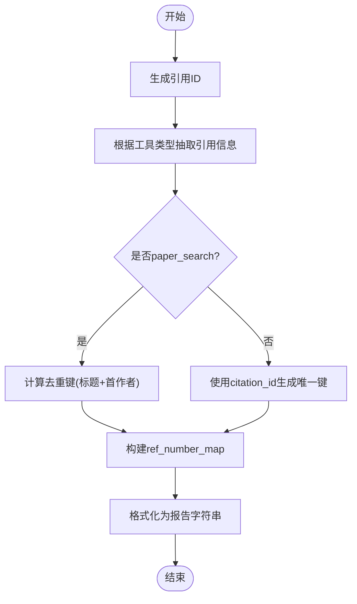
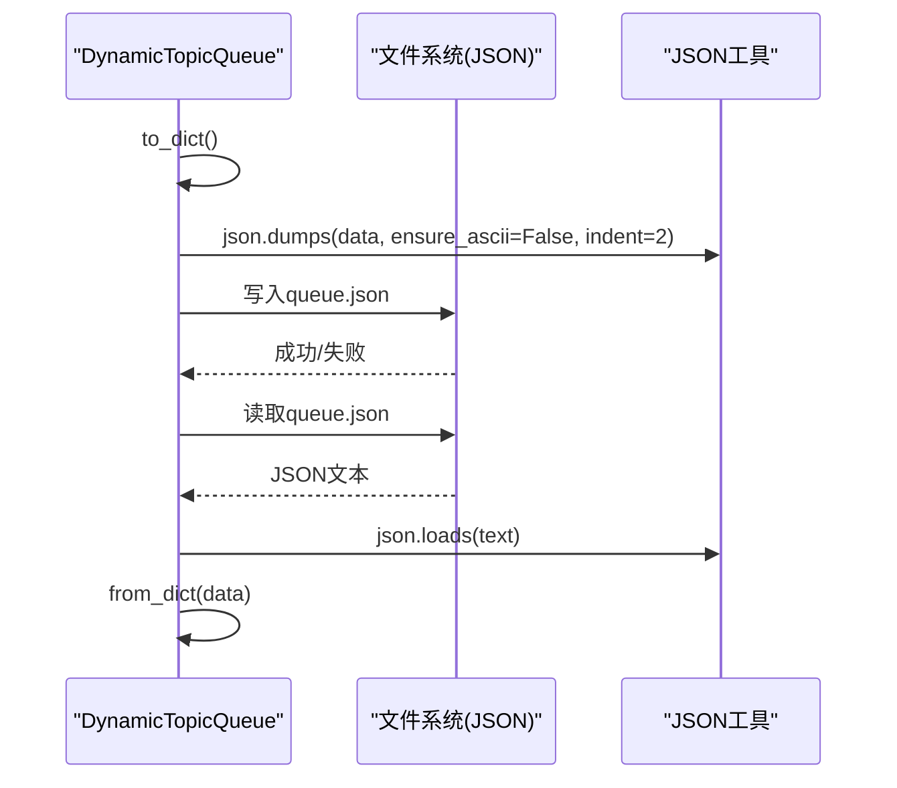
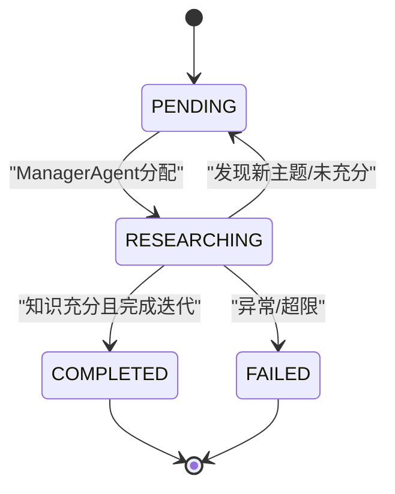
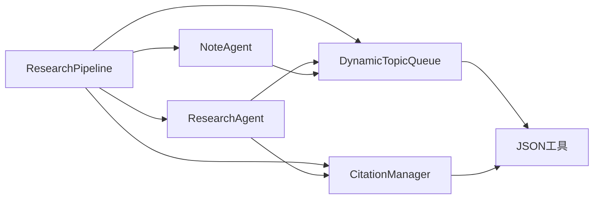

# 研究数据模型

<cite>
**本文引用的文件**
- [data_structures.py](file://src/agents/research/data_structures.py)
- [citation_manager.py](file://src/agents/research/utils/citation_manager.py)
- [json_utils.py](file://src/agents/research/utils/json_utils.py)
- [research_pipeline.py](file://src/agents/research/research_pipeline.py)
- [research_agent.py](file://src/agents/research/agents/research_agent.py)
- [note_agent.py](file://src/agents/research/agents/note_agent.py)
- [README.md](file://src/agents/research/README.md)
</cite>

## 目录
1. [引言](#引言)
2. [项目结构](#项目结构)
3. [核心组件](#核心组件)
4. [架构总览](#架构总览)
5. [详细组件分析](#详细组件分析)
6. [依赖关系分析](#依赖关系分析)
7. [性能与内存优化](#性能与内存优化)
8. [故障排查指南](#故障排查指南)
9. [结论](#结论)
10. [附录：数据结构与示例](#附录数据结构与示例)

## 引言
本文件聚焦于研究数据模型，围绕动态主题队列与引用管理两大核心模块，系统梳理 TopicBlock、ToolTrace、DynamicTopicQueue 等实体的字段语义、约束与生命周期；详解 CitationManager 的引用生成、去重与报告格式化机制；说明 JSON 序列化/反序列化在状态持久化中的作用；并以 UML 类图与流程图展示实体关系与数据演化路径。同时提供面向开发者的样本数据结构示例与最佳实践建议，帮助正确构造请求与解析响应。

## 项目结构
研究数据模型位于研究子系统中，核心文件包括：
- 数据结构定义：data_structures.py
- 引用管理：utils/citation_manager.py
- JSON 工具：utils/json_utils.py
- 研究流水线：research_pipeline.py
- 研究与记录代理：agents/research_agent.py、agents/note_agent.py
- 模块说明与示例：README.md

图表来源
- [data_structures.py](file://src/agents/research/data_structures.py#L1-L451)
- [citation_manager.py](file://src/agents/research/utils/citation_manager.py#L1-L799)
- [json_utils.py](file://src/agents/research/utils/json_utils.py#L1-L99)
- [research_pipeline.py](file://src/agents/research/research_pipeline.py#L1-L800)
- [research_agent.py](file://src/agents/research/agents/research_agent.py#L1-L701)
- [note_agent.py](file://src/agents/research/agents/note_agent.py#L1-L165)
- [README.md](file://src/agents/research/README.md#L1-L541)

章节来源
- [README.md](file://src/agents/research/README.md#L1-L120)

## 核心组件
- TopicBlock：动态队列的最小调度单元，承载单个子主题的状态、工具调用轨迹与元数据。
- ToolTrace：单次工具调用的完整记录，包含查询、原始回答、摘要、时间戳与引用标识。
- DynamicTopicQueue：动态主题队列，负责主题入队、状态流转、统计与自动持久化。
- CitationManager：统一的引用 ID 生成器与去重映射器，支持多工具类型的引用信息抽取与报告格式化。
- JSON 工具：提供稳健的 JSON 提取、严格校验与安全加载能力，保障 LLM 输出的结构化处理。

章节来源
- [data_structures.py](file://src/agents/research/data_structures.py#L15-L450)
- [citation_manager.py](file://src/agents/research/utils/citation_manager.py#L1-L799)
- [json_utils.py](file://src/agents/research/utils/json_utils.py#L1-L99)

## 架构总览
研究数据模型贯穿“规划—研究—报告”三阶段，形成如下数据流：
- 规划阶段：分解出多个 TopicBlock 并初始化队列。
- 研究阶段：ResearchAgent 基于 TopicBlock 生成查询计划，调用工具，NoteAgent 产出 ToolTrace，CitationManager 统一管理引用。
- 报告阶段：基于队列与引用信息生成带内联引用的 Markdown 报告。

图表来源
- [research_pipeline.py](file://src/agents/research/research_pipeline.py#L375-L479)
- [research_agent.py](file://src/agents/research/agents/research_agent.py#L426-L699)
- [note_agent.py](file://src/agents/research/agents/note_agent.py#L21-L81)
- [citation_manager.py](file://src/agents/research/utils/citation_manager.py#L234-L282)
- [data_structures.py](file://src/agents/research/data_structures.py#L173-L223)

## 详细组件分析

### 数据结构类图
下图展示核心数据结构之间的关系与职责边界。

图表来源
- [data_structures.py](file://src/agents/research/data_structures.py#L15-L450)

章节来源
- [data_structures.py](file://src/agents/research/data_structures.py#L15-L450)

### 引用管理器（CitationManager）
- 引用 ID 生成
  - 规划阶段：PLAN-XX 格式，自增计数器。
  - 研究阶段：CIT-{block}-{seq} 格式，按 block 编号分组自增。
- 引用信息抽取
  - 支持多种工具类型：RAG（含 naive/hybrid/query_item）、Web 搜索、论文搜索、代码执行。
  - 解析 raw_answer JSON，提取来源、URL、论文信息等，构建标准化引用条目。
- 去重与编号映射
  - paper_search 引用按“标题+第一作者”进行去重，相同论文共享同一参考编号。
  - 其他类型引用按 citation_id 生成唯一编号。
  - 提供 ref_number_map 构建与查询接口，保证报告内联引用与参考列表一致。
- 报告格式化
  - 将引用信息格式化为报告可用的字符串，支持不同工具类型的显示风格。
- 线程安全
  - 提供异步版本的 ID 生成与添加方法，内部使用锁确保并发安全。

图表来源
- [citation_manager.py](file://src/agents/research/utils/citation_manager.py#L573-L735)

章节来源
- [citation_manager.py](file://src/agents/research/utils/citation_manager.py#L1-L799)

### JSON 序列化/反序列化与持久化
- ToolTrace/TopicBlock/DynamicTopicQueue 均提供 to_dict/from_dict，用于对象到字典的转换。
- 动态主题队列支持 save_to_json/load_from_json，结合 state_file 实现自动持久化。
- JSON 工具提供稳健的提取与严格校验函数，确保 LLM 输出的结构化处理与错误兜底。

图表来源
- [data_structures.py](file://src/agents/research/data_structures.py#L396-L442)
- [json_utils.py](file://src/agents/research/utils/json_utils.py#L1-L99)

章节来源
- [data_structures.py](file://src/agents/research/data_structures.py#L396-L442)
- [json_utils.py](file://src/agents/research/utils/json_utils.py#L1-L99)

### 研究流程中的数据演化
- 规划阶段：分解生成 TopicBlock 列表，初始状态为 PENDING，加入队列。
- 研究阶段：ManagerAgent 取出 PENDING 主题并标记为 RESEARCHING；ResearchAgent 循环检查充分性、生成查询计划、调用工具、NoteAgent 生成 ToolTrace、CitationManager 记录引用；完成后标记为 COMPLETED 或因异常标记为 FAILED。
- 报告阶段：基于队列统计与引用映射生成带内联引用的 Markdown 报告。

图表来源
- [research_pipeline.py](file://src/agents/research/research_pipeline.py#L704-L800)
- [data_structures.py](file://src/agents/research/data_structures.py#L317-L369)

章节来源
- [research_pipeline.py](file://src/agents/research/research_pipeline.py#L375-L479)
- [data_structures.py](file://src/agents/research/data_structures.py#L225-L395)

## 依赖关系分析
- ResearchPipeline 依赖 DynamicTopicQueue、CitationManager 与各代理模块，协调三阶段执行。
- ResearchAgent 与 NoteAgent 通过 ToolTrace 串联工具调用与知识压缩。
- CitationManager 与 ToolTrace 强耦合，确保引用 ID 与工具调用一一对应。
- JSON 工具贯穿数据结构序列化与 LLM 输出解析。

图表来源
- [research_pipeline.py](file://src/agents/research/research_pipeline.py#L65-L179)
- [research_agent.py](file://src/agents/research/agents/research_agent.py#L1-L120)
- [note_agent.py](file://src/agents/research/agents/note_agent.py#L1-L81)
- [data_structures.py](file://src/agents/research/data_structures.py#L1-L120)
- [citation_manager.py](file://src/agents/research/utils/citation_manager.py#L1-L120)
- [json_utils.py](file://src/agents/research/utils/json_utils.py#L1-L99)

章节来源
- [research_pipeline.py](file://src/agents/research/research_pipeline.py#L65-L179)
- [research_agent.py](file://src/agents/research/agents/research_agent.py#L1-L120)
- [note_agent.py](file://src/agents/research/agents/note_agent.py#L1-L81)
- [data_structures.py](file://src/agents/research/data_structures.py#L1-L120)
- [citation_manager.py](file://src/agents/research/utils/citation_manager.py#L1-L120)
- [json_utils.py](file://src/agents/research/utils/json_utils.py#L1-L99)

## 性能与内存优化
- 原始回答截断：ToolTrace 在构造时对 raw_answer 进行大小限制与智能截断，避免内存膨胀与序列化开销过大。
- 队列容量控制：DynamicTopicQueue 支持最大长度限制，防止队列无限增长。
- 自动持久化：队列与引用信息定期保存至 JSON 文件，降低中断风险并便于恢复。
- 去重映射：CitationManager 的 ref_number_map 仅在需要时构建，避免重复计算。
- 异步与锁：CitationManager 的异步方法与内部锁确保并发安全，减少竞争带来的额外开销。

章节来源
- [data_structures.py](file://src/agents/research/data_structures.py#L39-L171)
- [data_structures.py](file://src/agents/research/data_structures.py#L225-L395)
- [citation_manager.py](file://src/agents/research/utils/citation_manager.py#L573-L735)

## 故障排查指南
- 引用 ID 冲突
  - 现象：报告中出现重复引用编号。
  - 排查：确认 CitationManager 是否正确加载 citations.json 并从文件恢复计数器；检查 build_ref_number_map 是否被调用。
- 引用无效
  - 现象：报告内联引用无法定位锚点。
  - 排查：使用 validate_citation_references 检测无效引用；使用 fix_invalid_citations 清理无效引用。
- JSON 解析失败
  - 现象：LLM 输出非标准 JSON 导致解析异常。
  - 排查：使用 extract_json_from_text 提取 JSON 片段；使用 ensure_json_dict/ensure_keys 进行严格校验。
- 队列持久化失败
  - 现象：queue.json 写入失败或损坏。
  - 排查：检查 state_file 路径权限；捕获异常后回退到内存状态；必要时手动 load_from_json 恢复。

章节来源
- [citation_manager.py](file://src/agents/research/utils/citation_manager.py#L175-L233)
- [json_utils.py](file://src/agents/research/utils/json_utils.py#L14-L98)
- [data_structures.py](file://src/agents/research/data_structures.py#L422-L442)

## 结论
本研究数据模型以 TopicBlock、ToolTrace、DynamicTopicQueue 为核心，辅以 CitationManager 的统一引用管理与 JSON 工具的稳健解析，实现了从规划到报告的全链路数据闭环。通过严格的序列化/反序列化、自动持久化与去重映射，系统在复杂研究任务中保持一致性与可追溯性。开发者应遵循字段约束、生命周期管理与内存优化策略，确保数据质量与运行效率。

## 附录：数据结构与示例

### 字段语义与约束
- TopicBlock
  - block_id：唯一标识，形如 block_1。
  - sub_topic：子主题标题，必填。
  - overview：主题概要，建议简洁明确。
  - status：TopicStatus 枚举，初始 PENDING。
  - tool_traces：ToolTrace 列表，按时间顺序累积。
  - iteration_count：当前迭代次数。
  - created_at/updated_at：ISO 时间字符串。
  - metadata：扩展元数据字典。
- ToolTrace
  - tool_id：工具调用唯一标识（时间戳前缀）。
  - citation_id：引用 ID，形如 PLAN-01 或 CIT-3-01。
  - tool_type：工具类型枚举之一。
  - query：查询语句，建议清晰具体。
  - raw_answer：工具返回的原始文本（可能被截断）。
  - summary：压缩后的摘要，建议覆盖关键要点。
  - timestamp：ISO 时间字符串。
  - raw_answer_truncated：是否发生截断。
  - raw_answer_original_size：原始大小（字节）。
- DynamicTopicQueue
  - research_id：研究任务标识。
  - blocks：TopicBlock 列表。
  - max_length：队列最大长度（None 表示无限制）。
  - state_file：自动持久化文件路径。
- CitationManager
  - 引用 ID：规划阶段 PLAN-XX；研究阶段 CIT-{block}-{seq}。
  - 去重键：paper_search 使用“标题+首作者”，其他类型使用 citation_id。
  - 引用信息：包含工具类型、查询、摘要、时间戳、来源/URL/论文等字段。

章节来源
- [data_structures.py](file://src/agents/research/data_structures.py#L15-L450)
- [citation_manager.py](file://src/agents/research/utils/citation_manager.py#L1-L799)

### 请求与响应示例（路径指引）
- 规划阶段输出（子主题列表）
  - 示例路径：[规划阶段输出示例](file://src/agents/research/README.md#L140-L172)
- 查询计划（ResearchAgent）
  - 示例路径：[查询计划示例](file://src/agents/research/README.md#L224-L233)
- 报告大纲（ReportingAgent）
  - 示例路径：[报告大纲示例](file://src/agents/research/README.md#L277-L293)
- 引用格式（内联与锚点）
  - 示例路径：[引用格式示例](file://src/agents/research/README.md#L300-L304)

### 开发者最佳实践
- 正确构造请求
  - 为每个 TopicBlock 提供清晰的 sub_topic 与 overview。
  - 在 ResearchAgent 中先生成查询计划再调用工具，确保 query 与 tool_type 匹配。
  - 使用 CitationManager 的 get_next_citation_id 获取引用 ID，再交由 NoteAgent 生成 ToolTrace。
- 正确解析响应
  - 使用 extract_json_from_text 从 LLM 输出中提取 JSON。
  - 使用 ensure_json_dict/ensure_keys 进行严格校验，避免字段缺失。
  - 对 ToolTrace 的 raw_answer 进行截断与校验，避免超长文本导致性能问题。
- 状态持久化
  - 启用 DynamicTopicQueue 的 state_file，定期保存 queue.json。
  - 使用 save_to_json 与 load_from_json 管理队列与引用状态。
- 引用一致性
  - 在报告生成前调用 build_ref_number_map，确保内联引用与参考列表一致。
  - 使用 validate_citation_references 检测并修复无效引用。

章节来源
- [research_agent.py](file://src/agents/research/agents/research_agent.py#L426-L699)
- [note_agent.py](file://src/agents/research/agents/note_agent.py#L21-L81)
- [data_structures.py](file://src/agents/research/data_structures.py#L396-L442)
- [citation_manager.py](file://src/agents/research/utils/citation_manager.py#L573-L735)
- [json_utils.py](file://src/agents/research/utils/json_utils.py#L14-L98)
- [README.md](file://src/agents/research/README.md#L296-L304)