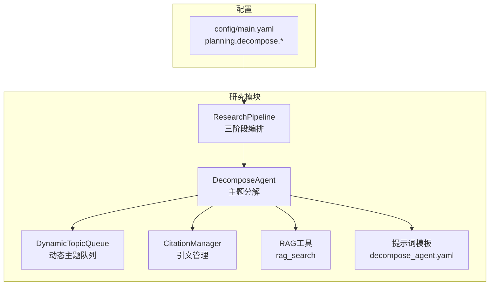
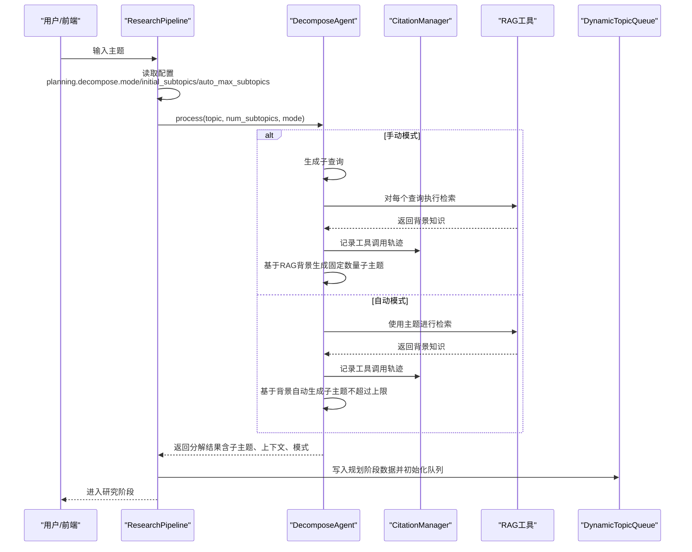
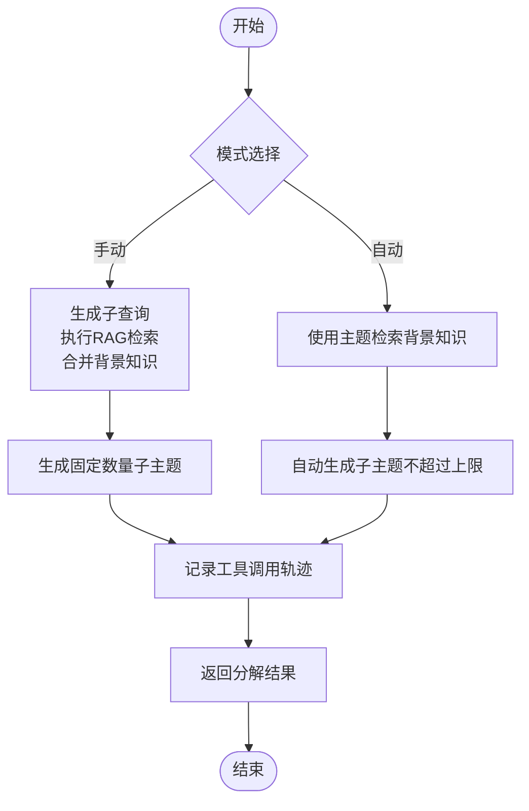
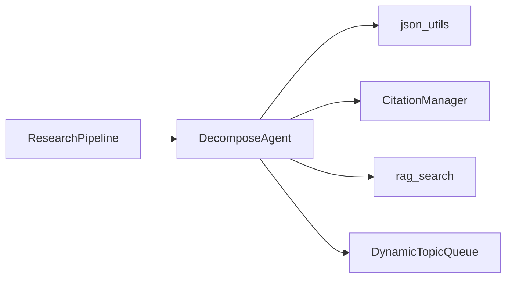

# 分解智能体

<cite>
**本文引用的文件**
- [src/agents/research/agents/decompose_agent.py](file://src/agents/research/agents/decompose_agent.py)
- [src/agents/research/prompts/cn/decompose_agent.yaml](file://src/agents/research/prompts/cn/decompose_agent.yaml)
- [src/agents/research/prompts/en/decompose_agent.yaml](file://src/agents/research/prompts/en/decompose_agent.yaml)
- [src/agents/research/research_pipeline.py](file://src/agents/research/research_pipeline.py)
- [config/main.yaml](file://config/main.yaml)
- [src/agents/research/data_structures.py](file://src/agents/research/data_structures.py)
- [src/agents/research/utils/json_utils.py](file://src/agents/research/utils/json_utils.py)
- [src/agents/research/utils/citation_manager.py](file://src/agents/research/utils/citation_manager.py)
- [src/agents/research/README.md](file://src/agents/research/README.md)
</cite>

## 目录
1. [简介](#简介)
2. [项目结构](#项目结构)
3. [核心组件](#核心组件)
4. [架构总览](#架构总览)
5. [详细组件分析](#详细组件分析)
6. [依赖分析](#依赖分析)
7. [性能考虑](#性能考虑)
8. [故障排查指南](#故障排查指南)
9. [结论](#结论)
10. [附录](#附录)

## 简介
本文件面向“分解智能体（DecomposeAgent）”的技术文档，系统阐述其在研究流程中将复杂主题拆分为子主题的能力。文档聚焦于两种工作模式（手动模式与自动模式）的输入输出、决策逻辑、与研究流程的集成方式，并给出配置参数说明、常见问题调试建议以及返回JSON结构如何驱动后续研究。

## 项目结构
分解智能体位于研究模块中，作为规划阶段的第一个关键节点，负责将用户输入的主题优化后进行子主题分解，并将结果注入动态主题队列，供后续研究阶段并行/串行执行。

图表来源
- [src/agents/research/agents/decompose_agent.py](file://src/agents/research/agents/decompose_agent.py#L1-L120)
- [src/agents/research/research_pipeline.py](file://src/agents/research/research_pipeline.py#L613-L647)
- [config/main.yaml](file://config/main.yaml#L65-L90)

章节来源
- [src/agents/research/README.md](file://src/agents/research/README.md#L146-L173)

## 核心组件
- 分解智能体（DecomposeAgent）
  - 负责根据配置选择“手动模式”或“自动模式”，生成子主题列表及其概览，并可选地在手动模式下通过RAG检索背景知识以增强分解质量。
  - 支持在RAG启用时记录工具调用轨迹（ToolTrace），并由引文管理器统一生成引文ID，用于报告内联引用与参考文献。
- 研究流水线（ResearchPipeline）
  - 在规划阶段调用分解智能体，读取配置决定模式与期望子主题数量；随后将分解结果写入缓存并初始化动态主题队列。
- 动态主题队列（DynamicTopicQueue）
  - 将每个子主题封装为TopicBlock，维护状态流转（PENDING → RESEARCHING → COMPLETED 或 FAILED），并支持统计与持久化。
- 引文管理器（CitationManager）
  - 统一生成规划与研究阶段的引文ID，记录工具调用摘要与原始答案，支持报告内联引用与参考文献生成。
- JSON解析工具（json_utils）
  - 从大模型输出中稳健提取JSON对象，严格校验键存在性，保证后续处理的健壮性。

章节来源
- [src/agents/research/agents/decompose_agent.py](file://src/agents/research/agents/decompose_agent.py#L1-L120)
- [src/agents/research/research_pipeline.py](file://src/agents/research/research_pipeline.py#L613-L647)
- [src/agents/research/data_structures.py](file://src/agents/research/data_structures.py#L173-L224)
- [src/agents/research/utils/citation_manager.py](file://src/agents/research/utils/citation_manager.py#L18-L120)
- [src/agents/research/utils/json_utils.py](file://src/agents/research/utils/json_utils.py#L1-L99)

## 架构总览
分解智能体在研究流程中的位置如下：

图表来源
- [src/agents/research/research_pipeline.py](file://src/agents/research/research_pipeline.py#L613-L647)
- [src/agents/research/agents/decompose_agent.py](file://src/agents/research/agents/decompose_agent.py#L189-L321)
- [src/agents/research/utils/citation_manager.py](file://src/agents/research/utils/citation_manager.py#L234-L279)

## 详细组件分析

### 分解智能体（DecomposeAgent）
- 工作模式
  - 手动模式（mode=manual）
    - 先生成指定数量的子查询，再对每个查询执行RAG检索，合并背景知识后生成固定数量的子主题。
    - 适合需要严格控制子主题数量的场景。
  - 自动模式（mode=auto）
    - 使用主题本身进行一次RAG检索，获取背景知识后，让LLM自主生成子主题，数量不超过上限。
    - 适合希望由智能体根据背景知识灵活拆分的场景。
- 输入输出
  - 输入：主题字符串、期望子主题数量（手动模式为固定数；自动模式为上限）、模式标识。
  - 输出：包含主主题、子主题数组、总数量、模式、RAG上下文摘要等字段的字典。
- 关键流程
  - 手动模式：生成子查询 → RAG检索背景 → 生成固定数量子主题 → 记录工具调用轨迹。
  - 自动模式：RAG检索背景 → 自主生成子主题（不超过上限）→ 记录工具调用轨迹。
- JSON结构
  - 字段说明（节选）
    - main_topic：主主题
    - sub_topics：子主题数组，每项包含title与overview
    - total_subtopics：子主题总数
    - mode：manual或auto
    - rag_context_summary：RAG背景摘要
    - sub_queries：手动模式下的子查询列表
    - rag_context：RAG检索得到的背景文本
  - 结构示例（路径）
    - [返回结构定义与示例](file://src/agents/research/README.md#L162-L172)
- 与研究流程集成
  - 规划阶段结束后，分解结果被保存到缓存文件，并将子主题写入动态主题队列，进入研究阶段的并行/串行执行。

图表来源
- [src/agents/research/agents/decompose_agent.py](file://src/agents/research/agents/decompose_agent.py#L189-L321)
- [src/agents/research/utils/citation_manager.py](file://src/agents/research/utils/citation_manager.py#L234-L279)

章节来源
- [src/agents/research/agents/decompose_agent.py](file://src/agents/research/agents/decompose_agent.py#L54-L188)
- [src/agents/research/agents/decompose_agent.py](file://src/agents/research/agents/decompose_agent.py#L189-L321)
- [src/agents/research/agents/decompose_agent.py](file://src/agents/research/agents/decompose_agent.py#L323-L496)
- [src/agents/research/research_pipeline.py](file://src/agents/research/research_pipeline.py#L613-L647)
- [src/agents/research/README.md](file://src/agents/research/README.md#L146-L173)

### 提示词与输出约束
- 提示词模板
  - 中文与英文模板分别定义了生成子查询与分解子主题的步骤、要求与输出格式。
  - 模板强制输出JSON对象，确保后续解析稳定。
- 输出解析
  - 使用JSON解析工具从LLM输出中提取JSON，严格校验键存在性，若失败则回退为空列表，保障鲁棒性。

章节来源
- [src/agents/research/prompts/cn/decompose_agent.yaml](file://src/agents/research/prompts/cn/decompose_agent.yaml#L1-L90)
- [src/agents/research/prompts/en/decompose_agent.yaml](file://src/agents/research/prompts/en/decompose_agent.yaml#L1-L90)
- [src/agents/research/utils/json_utils.py](file://src/agents/research/utils/json_utils.py#L1-L99)

### 引文与工具追踪
- 引文管理
  - 在手动模式与自动模式中，RAG检索成功后会创建工具调用轨迹（ToolTrace），并由引文管理器生成唯一引文ID，便于报告内联引用与参考文献。
- 数据结构
  - ToolTrace包含工具ID、引文ID、工具类型、查询语句、原始答案、摘要、时间戳等字段；支持大小限制与截断，防止过大JSON影响存储与传输。

章节来源
- [src/agents/research/utils/citation_manager.py](file://src/agents/research/utils/citation_manager.py#L18-L120)
- [src/agents/research/data_structures.py](file://src/agents/research/data_structures.py#L40-L120)

## 依赖分析
- 外部依赖
  - RAG工具：用于检索背景知识，支持混合与朴素两种模式。
  - JSON解析工具：从LLM输出中稳健提取JSON。
  - 引文管理器：统一生成引文ID并记录工具调用。
- 内部耦合
  - DecomposeAgent依赖ResearchPipeline在规划阶段调用；同时依赖CitationManager记录工具调用轨迹。
  - 动态主题队列接收分解结果，作为研究阶段的任务来源。

图表来源
- [src/agents/research/agents/decompose_agent.py](file://src/agents/research/agents/decompose_agent.py#L1-L120)
- [src/agents/research/research_pipeline.py](file://src/agents/research/research_pipeline.py#L613-L647)
- [src/agents/research/data_structures.py](file://src/agents/research/data_structures.py#L173-L224)
- [src/agents/research/utils/citation_manager.py](file://src/agents/research/utils/citation_manager.py#L18-L120)

## 性能考虑
- RAG检索成本
  - 手动模式需多次检索，建议合理设置最大子查询数量与超时重试策略，避免过多工具调用导致延迟。
- JSON解析开销
  - 使用稳健解析与严格校验，减少因LLM输出异常导致的重试与回退。
- 引文与日志
  - ToolTrace默认限制原始答案大小，避免过大JSON影响存储与传输；建议在高并发场景下开启异步安全接口。

[本节为通用指导，无需特定文件来源]

## 故障排查指南
- 提示词缺失
  - 现象：抛出缺少系统角色或分解提示词的错误。
  - 排查：确认提示词模板中包含system.role与process.decompose（或decompose_without_rag）。
  - 参考路径：[提示词模板](file://src/agents/research/prompts/cn/decompose_agent.yaml#L1-L90)
- JSON解析失败
  - 现象：子主题列表为空。
  - 排查：检查LLM输出是否符合JSON格式；必要时放宽输出格式要求或调整提示词。
  - 参考路径：[JSON解析工具](file://src/agents/research/utils/json_utils.py#L1-L99)
- RAG不可用或超时
  - 现象：手动模式无法生成背景知识或自动模式检索失败。
  - 排查：检查RAG配置（默认模式、回退模式、超时与重试次数）；确认知识库名称正确。
  - 参考路径：[配置项](file://config/main.yaml#L91-L95)
- 分解过度或不足
  - 过度：自动模式生成数量超过上限。
    - 处理：降低auto_max_subtopics或切换为手动模式并减少initial_subtopics。
  - 不足：手动模式未达到预期数量。
    - 处理：提高initial_subtopics或检查RAG检索是否返回足够背景知识。
  - 参考路径：[规划配置](file://config/main.yaml#L65-L90)、[流水线调用](file://src/agents/research/research_pipeline.py#L613-L647)

章节来源
- [src/agents/research/prompts/cn/decompose_agent.yaml](file://src/agents/research/prompts/cn/decompose_agent.yaml#L1-L90)
- [src/agents/research/utils/json_utils.py](file://src/agents/research/utils/json_utils.py#L1-L99)
- [config/main.yaml](file://config/main.yaml#L65-L95)
- [src/agents/research/research_pipeline.py](file://src/agents/research/research_pipeline.py#L613-L647)

## 结论
分解智能体通过“手动模式”与“自动模式”的双轨设计，在可控性与灵活性之间取得平衡。其返回的标准化JSON结构直接驱动后续动态主题队列与研究阶段的并行执行，配合严格的JSON解析与引文管理，确保研究流程的可追溯性与可复现性。通过合理配置planning.decompose.mode及相关参数，可在不同深度与速度需求之间灵活切换。

[本节为总结性内容，无需特定文件来源]

## 附录

### 配置参数说明（与planning.decompose.mode相关）
- planning.decompose.enabled
  - 是否启用主题分解
- planning.decompose.mode
  - “manual”或“auto”
- planning.decompose.initial_subtopics
  - 手动模式下的期望子主题数量
- planning.decompose.auto_max_subtopics
  - 自动模式下的最大子主题数量上限
- researching.enable_rag_hybrid / enable_rag_naive
  - 控制RAG工具开关
- researching.execution_mode
  - 研究阶段执行模式（series/parallel）

章节来源
- [config/main.yaml](file://config/main.yaml#L65-L90)
- [src/agents/research/research_pipeline.py](file://src/agents/research/research_pipeline.py#L613-L647)

### 实际执行示例（路径指引）
- 手动模式执行路径
  - [手动模式流程](file://src/agents/research/agents/decompose_agent.py#L189-L261)
  - [生成子查询](file://src/agents/research/agents/decompose_agent.py#L388-L434)
  - [生成子主题（手动）](file://src/agents/research/agents/decompose_agent.py#L435-L496)
- 自动模式执行路径
  - [自动模式流程](file://src/agents/research/agents/decompose_agent.py#L262-L321)
  - [生成子主题（自动）](file://src/agents/research/agents/decompose_agent.py#L323-L387)
- 流水线集成路径
  - [规划阶段调用分解智能体](file://src/agents/research/research_pipeline.py#L613-L647)