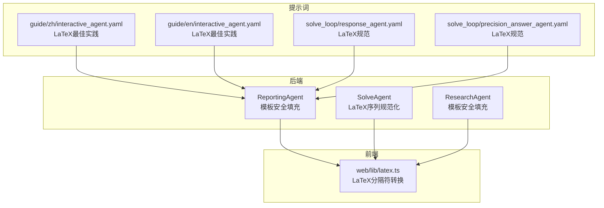
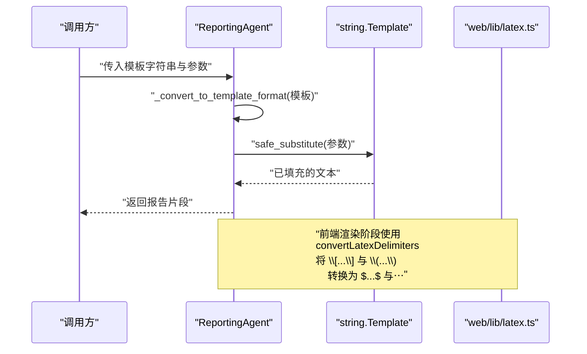
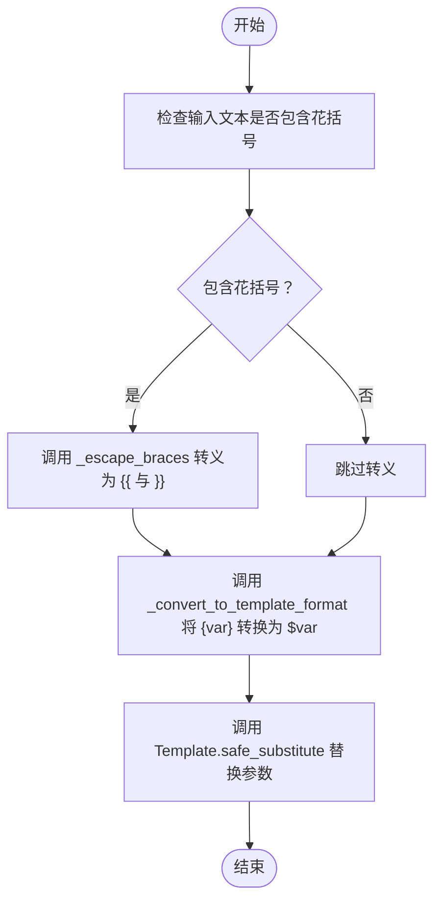
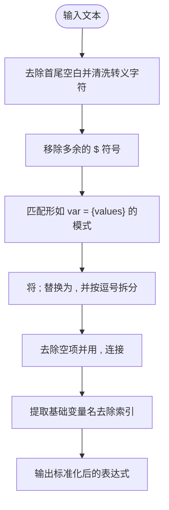
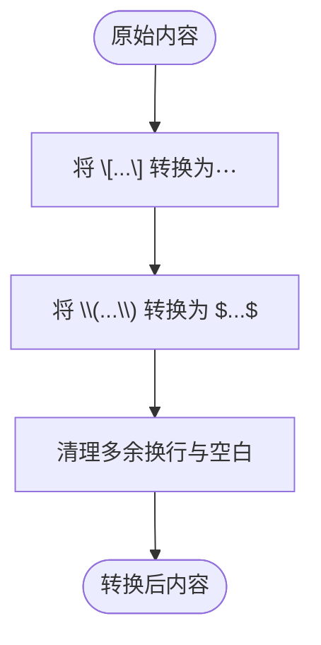
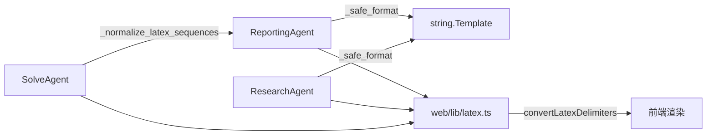

# LaTeX 兼容性处理

<cite>
**本文引用的文件**
- [src/agents/research/agents/reporting_agent.py](file://src/agents/research/agents/reporting_agent.py)
- [src/agents/solve/solve_loop/solve_agent.py](file://src/agents/solve/solve_loop/solve_agent.py)
- [src/agents/research/agents/research_agent.py](file://src/agents/research/agents/research_agent.py)
- [web/lib/latex.ts](file://web/lib/latex.ts)
- [src/agents/guide/prompts/zh/interactive_agent.yaml](file://src/agents/guide/prompts/zh/interactive_agent.yaml)
- [src/agents/guide/prompts/en/interactive_agent.yaml](file://src/agents/guide/prompts/en/interactive_agent.yaml)
- [src/agents/solve/prompts/zh/solve_loop/response_agent.yaml](file://src/agents/solve/prompts/zh/solve_loop/response_agent.yaml)
- [src/agents/solve/prompts/zh/solve_loop/precision_answer_agent.yaml](file://src/agents/solve/prompts/zh/solve_loop/precision_answer_agent.yaml)
</cite>

## 目录
1. [引言](#引言)
2. [项目结构](#项目结构)
3. [核心组件](#核心组件)
4. [架构总览](#架构总览)
5. [详细组件分析](#详细组件分析)
6. [依赖关系分析](#依赖关系分析)
7. [性能考量](#性能考量)
8. [故障排查指南](#故障排查指南)
9. [结论](#结论)
10. [附录](#附录)

## 引言
本文件聚焦于报告智能体为确保LaTeX公式在字符串模板填充过程中保持正确性的技术方案。重点阐述两个关键点：
- _escape_braces 与 _convert_to_template_format 如何协同工作，避免字符串格式化破坏LaTeX中的花括号（如{\rho}, {L}）。
- 为什么采用 string.Template 而非 str.format()，以及在复杂数学公式场景下的最佳实践与潜在限制。

## 项目结构
围绕LaTeX兼容性处理，涉及前后端与提示词工程的多处协作：
- 后端 Python：报告智能体与求解智能体在模板填充阶段采用安全的字符串模板策略，并对LaTeX序列进行规范化处理。
- 前端 JavaScript：对LaTeX分隔符进行转换，使其与remark-math/KaTeX渲染器兼容。
- 提示词工程：明确LaTeX格式要求，指导LLM输出符合前端渲染规范的公式。

图表来源
- [src/agents/research/agents/reporting_agent.py](file://src/agents/research/agents/reporting_agent.py#L40-L72)
- [src/agents/solve/solve_loop/solve_agent.py](file://src/agents/solve/solve_loop/solve_agent.py#L322-L340)
- [src/agents/research/agents/research_agent.py](file://src/agents/research/agents/research_agent.py#L53-L70)
- [web/lib/latex.ts](file://web/lib/latex.ts#L1-L55)
- [src/agents/guide/prompts/zh/interactive_agent.yaml](file://src/agents/guide/prompts/zh/interactive_agent.yaml#L404-L473)
- [src/agents/guide/prompts/en/interactive_agent.yaml](file://src/agents/guide/prompts/en/interactive_agent.yaml#L137-L171)
- [src/agents/solve/prompts/zh/solve_loop/response_agent.yaml](file://src/agents/solve/prompts/zh/solve_loop/response_agent.yaml#L37-L50)
- [src/agents/solve/prompts/zh/solve_loop/precision_answer_agent.yaml](file://src/agents/solve/prompts/zh/solve_loop/precision_answer_agent.yaml#L40-L62)

章节来源
- [src/agents/research/agents/reporting_agent.py](file://src/agents/research/agents/reporting_agent.py#L40-L72)
- [src/agents/solve/solve_loop/solve_agent.py](file://src/agents/solve/solve_loop/solve_agent.py#L322-L340)
- [web/lib/latex.ts](file://web/lib/latex.ts#L1-L55)

## 核心组件
- ReportingAgent 的安全模板填充
  - _escape_braces：将原始文本中的花括号转义为 {{ 与 }}，防止 str.format() 将其误认为占位符。
  - _convert_to_template_format：将 {var} 风格占位符转换为 $var 风格，以便 string.Template 使用。
  - _safe_format：先转换占位符，再用 Template.safe_substitute 完成替换，避免冲突。
- SolveAgent 的LaTeX序列规范化
  - _normalize_latex_sequences：清洗与标准化包含花括号的LaTeX表达式，移除转义字符与多余美元符号，统一集合赋值形式，便于后续处理。
- 前端工具
  - convertLatexDelimiters：将 \[...\] 与 \(...\) 分隔符转换为 $...$ 与 $$...$$，适配 remark-math/KaTeX。
- 提示词工程
  - 明确LaTeX格式要求与最佳实践，约束LLM输出，减少后端处理负担。

章节来源
- [src/agents/research/agents/reporting_agent.py](file://src/agents/research/agents/reporting_agent.py#L40-L72)
- [src/agents/solve/solve_loop/solve_agent.py](file://src/agents/solve/solve_loop/solve_agent.py#L322-L340)
- [web/lib/latex.ts](file://web/lib/latex.ts#L1-L55)
- [src/agents/guide/prompts/zh/interactive_agent.yaml](file://src/agents/guide/prompts/zh/interactive_agent.yaml#L404-L473)
- [src/agents/guide/prompts/en/interactive_agent.yaml](file://src/agents/guide/prompts/en/interactive_agent.yaml#L137-L171)
- [src/agents/solve/prompts/zh/solve_loop/response_agent.yaml](file://src/agents/solve/prompts/zh/solve_loop/response_agent.yaml#L37-L50)
- [src/agents/solve/prompts/zh/solve_loop/precision_answer_agent.yaml](file://src/agents/solve/prompts/zh/solve_loop/precision_answer_agent.yaml#L40-L62)

## 架构总览
下面的时序图展示了“报告生成”流程中，模板填充与LaTeX兼容性处理的关键交互。

图表来源
- [src/agents/research/agents/reporting_agent.py](file://src/agents/research/agents/reporting_agent.py#L40-L72)
- [web/lib/latex.ts](file://web/lib/latex.ts#L1-L55)

## 详细组件分析

### ReportingAgent 的模板安全填充
- _escape_braces 的作用
  - 防止 str.format() 将原始文本中的花括号识别为占位符，从而避免破坏LaTeX中的{\rho}、{L}等。
- _convert_to_template_format 的作用
  - 将 {var} 风格占位符转换为 $var 风格，使 string.Template 能够安全地进行替换。
- _safe_format 的执行流程
  - 先转换占位符，再用 Template.safe_substitute 完成替换；即使缺少某些键也不会抛出异常，保证稳定性。
- 与 SolveAgent 的互补
  - SolveAgent 在构建提示词时使用 str.format()，因此在传入前应先通过 _escape_braces 转义，避免破坏LaTeX花括号。

图表来源
- [src/agents/research/agents/reporting_agent.py](file://src/agents/research/agents/reporting_agent.py#L40-L72)

章节来源
- [src/agents/research/agents/reporting_agent.py](file://src/agents/research/agents/reporting_agent.py#L40-L72)

### SolveAgent 的LaTeX序列规范化
- _normalize_latex_sequences 的职责
  - 清洗输入文本中的转义字符与多余美元符号；
  - 统一集合赋值形式（如将 {x,y,z} 形式转换为 [x,y,z]），提升可读性与一致性；
  - 移除多余空白，保持紧凑格式。
- 与提示词工程的关系
  - 提示词明确要求数学表达式必须用 $...$ 包裹，避免裸露变量，从而减少后端清洗成本。

图表来源
- [src/agents/solve/solve_loop/solve_agent.py](file://src/agents/solve/solve_loop/solve_agent.py#L322-L340)
- [src/agents/solve/prompts/zh/solve_loop/response_agent.yaml](file://src/agents/solve/prompts/zh/solve_loop/response_agent.yaml#L37-L50)
- [src/agents/solve/prompts/zh/solve_loop/precision_answer_agent.yaml](file://src/agents/solve/prompts/zh/solve_loop/precision_answer_agent.yaml#L40-L62)

章节来源
- [src/agents/solve/solve_loop/solve_agent.py](file://src/agents/solve/solve_loop/solve_agent.py#L322-L340)
- [src/agents/solve/prompts/zh/solve_loop/response_agent.yaml](file://src/agents/solve/prompts/zh/solve_loop/response_agent.yaml#L37-L50)
- [src/agents/solve/prompts/zh/solve_loop/precision_answer_agent.yaml](file://src/agents/solve/prompts/zh/solve_loop/precision_answer_agent.yaml#L40-L62)

### 前端LaTeX分隔符转换
- convertLatexDelimiters 的职责
  - 将 \[...\] 转换为 $$...$$（块级公式），将 \(...\) 转换为 $...$（行内公式）；
  - 对多行内容进行处理，清理多余换行；
  - 与 remark-math/KaTeX 渲染器配合，确保公式正确渲染。
- 与后端模板填充的衔接
  - 后端模板填充完成后，前端再进行分隔符转换，保证最终渲染效果。

图表来源
- [web/lib/latex.ts](file://web/lib/latex.ts#L1-L55)

章节来源
- [web/lib/latex.ts](file://web/lib/latex.ts#L1-L55)

### 与 ResearchAgent 的对比
- ResearchAgent 同样实现了 _convert_to_template_format 与 _safe_format，用于提示词模板的安全填充，与 ReportingAgent 的策略一致。
- 两者共同保障了不同智能体在模板填充阶段的LaTeX兼容性。

章节来源
- [src/agents/research/agents/research_agent.py](file://src/agents/research/agents/research_agent.py#L53-L70)

## 依赖关系分析
- 后端组件之间的耦合
  - ReportingAgent 与 ResearchAgent 共享相同的模板安全填充策略，降低重复实现与维护成本。
  - SolveAgent 专注于输入文本的LaTeX序列规范化，与模板填充策略互补。
- 前后端集成
  - 前端工具 convertLatexDelimiters 与后端模板填充形成“后端占位符安全 + 前端分隔符兼容”的闭环。
- 提示词工程的作用
  - 通过明确的LaTeX规范与最佳实践，减少后端清洗与修复的工作量，提高整体稳定性。

图表来源
- [src/agents/research/agents/reporting_agent.py](file://src/agents/research/agents/reporting_agent.py#L40-L72)
- [src/agents/research/agents/research_agent.py](file://src/agents/research/agents/research_agent.py#L53-L70)
- [src/agents/solve/solve_loop/solve_agent.py](file://src/agents/solve/solve_loop/solve_agent.py#L322-L340)
- [web/lib/latex.ts](file://web/lib/latex.ts#L1-L55)

章节来源
- [src/agents/research/agents/reporting_agent.py](file://src/agents/research/agents/reporting_agent.py#L40-L72)
- [src/agents/research/agents/research_agent.py](file://src/agents/research/agents/research_agent.py#L53-L70)
- [src/agents/solve/solve_loop/solve_agent.py](file://src/agents/solve/solve_loop/solve_agent.py#L322-L340)
- [web/lib/latex.ts](file://web/lib/latex.ts#L1-L55)

## 性能考量
- 字符串模板替换的复杂度
  - _convert_to_template_format 与 _safe_format 的正则替换开销与模板长度线性相关，通常在可接受范围内。
- 正则清洗的代价
  - _normalize_latex_sequences 中的正则匹配与替换在长文本上会有额外开销，建议在必要时才调用。
- 前端转换的时机
  - 将 convertLatexDelimiters 放在渲染阶段执行，避免在后端重复转换，减少不必要的CPU消耗。

## 故障排查指南
- 症状：LaTeX公式在模板填充后被破坏（如{\rho}变成错误的占位符）
  - 排查：确认是否使用了 _escape_braces 与 _convert_to_template_format，以及是否调用了 _safe_format。
  - 参考路径
    - [src/agents/research/agents/reporting_agent.py](file://src/agents/research/agents/reporting_agent.py#L40-L72)
- 症状：集合赋值或花括号表达式格式不一致
  - 排查：调用 _normalize_latex_sequences 规范化输入，确保输出一致。
  - 参考路径
    - [src/agents/solve/solve_loop/solve_agent.py](file://src/agents/solve/solve_loop/solve_agent.py#L322-L340)
- 症状：前端无法正确渲染LaTeX
  - 排查：确认前端是否执行了 convertLatexDelimiters，将 \[...\] 与 \(...\) 转换为 $...$ 与 $$...$$。
  - 参考路径
    - [web/lib/latex.ts](file://web/lib/latex.ts#L1-L55)
- 症状：提示词中出现裸露的数学变量
  - 排查：检查提示词规范，确保所有数学表达式均用 $...$ 包裹。
  - 参考路径
    - [src/agents/solve/prompts/zh/solve_loop/response_agent.yaml](file://src/agents/solve/prompts/zh/solve_loop/response_agent.yaml#L37-L50)
    - [src/agents/solve/prompts/zh/solve_loop/precision_answer_agent.yaml](file://src/agents/solve/prompts/zh/solve_loop/precision_answer_agent.yaml#L40-L62)

章节来源
- [src/agents/research/agents/reporting_agent.py](file://src/agents/research/agents/reporting_agent.py#L40-L72)
- [src/agents/solve/solve_loop/solve_agent.py](file://src/agents/solve/solve_loop/solve_agent.py#L322-L340)
- [web/lib/latex.ts](file://web/lib/latex.ts#L1-L55)
- [src/agents/solve/prompts/zh/solve_loop/response_agent.yaml](file://src/agents/solve/prompts/zh/solve_loop/response_agent.yaml#L37-L50)
- [src/agents/solve/prompts/zh/solve_loop/precision_answer_agent.yaml](file://src/agents/solve/prompts/zh/solve_loop/precision_answer_agent.yaml#L40-L62)

## 结论
- 采用 string.Template 与 _convert_to_template_format 的组合，有效避免了 str.format() 对LaTeX花括号的误解析。
- _escape_braces 与 _safe_format 的协同，确保了模板填充阶段的稳定性与安全性。
- SolveAgent 的 _normalize_latex_sequences 与前端 convertLatexDelimiters 形成了从“输入清洗”到“渲染兼容”的完整链路。
- 提示词工程明确了LaTeX规范，降低了后端处理成本，提升了整体质量与一致性。

## 附录
- 最佳实践
  - 在模板填充前，优先使用 _escape_braces 转义原始文本中的花括号。
  - 使用 _convert_to_template_format 将占位符转换为 $var 风格，再用 Template.safe_substitute 完成替换。
  - 对来自LLM的数学表达式，遵循提示词规范，统一使用 $...$ 包裹。
  - 在前端渲染阶段，使用 convertLatexDelimiters 将 \[...\] 与 \(...\) 转换为 $...$ 与 $$...$$。
- 潜在限制
  - 正则替换无法覆盖所有边界情况，复杂嵌套的LaTeX表达式仍需谨慎处理。
  - 提示词规范依赖LLM严格遵守，若LLM输出不符合规范，仍需后端清洗与修复。
  - 前端转换仅能处理分隔符，无法修正语法错误或缺失的命令，需结合提示词与后端清洗共同解决。