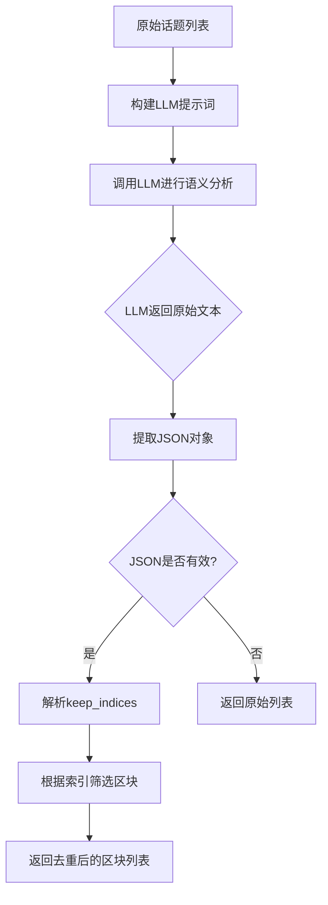
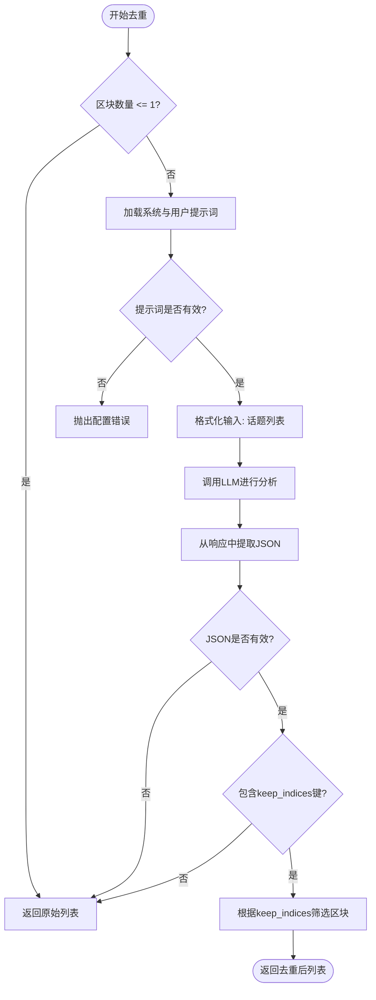

# 去重与清洗

<cite>
**本文档引用文件**   
- [reporting_agent.py](file://src/agents/research/agents/reporting_agent.py)
- [data_structures.py](file://src/agents/research/data_structures.py)
- [json_utils.py](file://src/agents/research/utils/json_utils.py)
- [reporting_agent.yaml](file://src/agents/research/prompts/cn/reporting_agent.yaml)
- [token_tracker.py](file://src/agents/research/utils/token_tracker.py)
- [citation_manager.py](file://src/agents/research/utils/citation_manager.py)
</cite>

## 目录
1. [引言](#引言)
2. [去重与清洗模块架构](#去重与清洗模块架构)
3. [基于LLM的JSON响应解析机制](#基于llm的json响应解析机制)
4. [去重算法流程图](#去重算法流程图)
5. [大规模数据处理性能优化](#大规模数据处理性能优化)
6. [常见去重失败场景与解决方案](#常见去重失败场景与解决方案)
7. [结论](#结论)

## 引言
去重与清洗模块是DeepTutor智能体中报告生成流程的关键环节，负责在生成最终报告前对研究区块（TopicBlock）进行内容去重和结构优化。该模块通过调用大语言模型（LLM）进行语义分析，识别并合并内容重复的研究区块，确保最终报告的逻辑连贯性和信息密度。本技术文档将深入剖析该模块的实现机制，涵盖其核心算法、数据结构、性能优化策略以及常见问题的应对方案。

## 去重与清洗模块架构

去重与清洗功能主要由`ReportingAgent`类实现，其核心方法为`_deduplicate_blocks`。该方法接收一个`TopicBlock`对象列表作为输入，经过LLM的语义分析后，输出一个经过筛选和去重的区块列表。

`TopicBlock`是系统中的核心数据结构，用于表示一个独立的研究主题单元。每个`TopicBlock`包含以下关键属性：
- `block_id`: 唯一标识符
- `sub_topic`: 子主题名称
- `overview`: 主题概述
- `tool_traces`: 工具调用追踪列表，记录了为该主题进行的所有信息检索和分析过程

去重流程作为报告生成流程的第一步，紧随研究阶段之后，为后续的报告大纲生成和内容撰写提供高质量的输入数据。

**Section sources**
- [reporting_agent.py](file://src/agents/research/agents/reporting_agent.py#L107-L113)
- [data_structures.py](file://src/agents/research/data_structures.py#L173-L188)

## 基于LLM的JSON响应解析机制

去重与清洗模块的核心在于利用LLM进行语义分析，并通过严格的JSON格式进行结构化通信，确保解析的可靠性和自动化。

### 1. LLM提示词（Prompt）设计
模块通过精心设计的提示词引导LLM进行去重决策。提示词明确要求LLM：
- 分析每个话题的核心内容和研究视角
- 识别语义重复或高度相似的话题（注意：视角不同的同一概念不算重复）
- 选择最具代表性、内容最丰富的话题保留
- **严格遵循JSON格式输出**



**Diagram sources**
- [reporting_agent.py](file://src/agents/research/agents/reporting_agent.py#L162-L187)

### 2. JSON响应解析与验证
为了确保LLM返回的JSON可以被程序直接解析，系统实现了一套鲁棒的解析和验证机制，由`json_utils.py`中的工具函数提供支持。

**解析流程**：
1.  **提取JSON**：`extract_json_from_text`函数能够从LLM返回的任意文本中提取JSON对象。它支持多种格式，包括：
    - 纯JSON文本
    - 用```json```代码块包裹的JSON
    - 文本中包含的第一个JSON片段（`{...}` 或 `[...]`）
2.  **类型验证**：`ensure_json_dict`和`ensure_json_list`函数确保提取出的数据是预期的字典或列表类型。
3.  **字段验证**：`ensure_keys`函数检查JSON对象是否包含所有必需的键（如`keep_indices`）。

如果在解析或验证的任何步骤中失败，系统将捕获异常并安全地返回原始的区块列表，避免因去重失败而导致整个报告生成流程中断。

**Section sources**
- [reporting_agent.py](file://src/agents/research/agents/reporting_agent.py#L180-L187)
- [json_utils.py](file://src/agents/research/utils/json_utils.py#L14-L77)

## 去重算法流程图



**Diagram sources**
- [reporting_agent.py](file://src/agents/research/agents/reporting_agent.py#L162-L187)

## 大规模数据处理性能优化

在处理大规模研究数据时，去重与清洗模块通过以下策略进行性能优化：

### 1. 输入数据截断
为防止输入文本过长导致LLM处理成本过高或超时，系统在构建提示词时对每个`TopicBlock`的`overview`字段进行了截断（取前200个字符）。这在保证核心信息可读性的同时，显著降低了输入的token数量。

### 2. 缓存与重试机制
虽然去重本身是一次性调用，但整个研究流程依赖于`TokenTracker`和`CitationManager`等组件的全局状态管理。`TokenTracker`会记录所有LLM调用的token消耗，为成本分析和性能监控提供依据。`CitationManager`则通过异步锁（`asyncio.Lock`）确保在并行模式下对引用数据的线程安全访问。

### 3. 容错与降级
系统设计了完善的容错机制。当LLM调用失败、JSON解析失败或配置缺失时，模块会优雅地降级，直接返回未经处理的原始区块列表。这种设计保证了系统的鲁棒性，即使在去重环节出现问题，也不会阻塞整个报告生成流程。

**Section sources**
- [reporting_agent.py](file://src/agents/research/agents/reporting_agent.py#L176-L177)
- [token_tracker.py](file://src/agents/research/utils/token_tracker.py#L120-L297)
- [citation_manager.py](file://src/agents/research/utils/citation_manager.py#L45-L46)

## 常见去重失败场景与解决方案

### 1. 场景：LLM返回非JSON格式文本
**原因**：LLM可能因提示词理解偏差、模型随机性或上下文过长而返回非结构化文本。
**解决方案**：
- **增强提示词**：在`reporting_agent.yaml`中强化“只输出JSON对象”的指令，并提供清晰的输出示例。
- **多轮重试**：在`ReportingAgent`中增加重试逻辑，对失败的LLM调用进行有限次数的重试。
- **降级处理**：如当前实现，当解析失败时返回原始列表，保证流程继续。

### 2. 场景：语义判断错误导致误删
**原因**：LLM可能错误地将视角不同但主题相关的区块判断为重复。
**解决方案**：
- **优化提示词**：在`process.deduplicate`提示词中更明确地强调“视角不同的同一概念不算重复”，并提供具体示例。
- **引入人工审核接口**：在前端系统中，允许用户在去重后对结果进行审核和手动调整。

### 3. 场景：配置文件缺失或错误
**原因**：`reporting_agent.yaml`文件中缺少`system.role`或`process.deduplicate`等关键配置项。
**解决方案**：
- **预检查**：在`_deduplicate_blocks`方法开始时，通过`get_prompt`检查关键提示词是否存在，若缺失则抛出明确的`ValueError`，提示用户检查配置文件。
- **提供默认配置**：在项目文档中提供完整的`reporting_agent.yaml`模板，减少配置错误。

### 4. 场景：输入数据量过大
**原因**：当研究主题分解出的子话题过多时，输入的`topics_text`可能超出LLM的上下文窗口。
**解决方案**：
- **分批处理**：将`TopicBlock`列表分批进行去重，例如每10个一组，然后对结果进行合并。
- **层次化去重**：先进行粗粒度去重（如基于关键词匹配），再对剩余的区块进行基于LLM的细粒度去重。

**Section sources**
- [reporting_agent.py](file://src/agents/research/agents/reporting_agent.py#L166-L174)
- [reporting_agent.yaml](file://src/agents/research/prompts/cn/reporting_agent.yaml#L42-L56)

## 结论
DeepTutor的去重与清洗模块通过一个简洁而强大的设计，有效地解决了多源信息整合中的内容重复问题。其核心在于利用LLM的语义理解能力，并通过严格的JSON通信协议和完善的错误处理机制，确保了自动化流程的可靠性和健壮性。该模块不仅实现了内容的去重，更通过选择“最具代表性、内容最丰富”的区块，实现了信息的主动清洗和优化，为生成高质量、高信息密度的深度研究报告奠定了坚实的基础。未来可通过引入分批处理等策略，进一步提升其在超大规模数据场景下的性能表现。