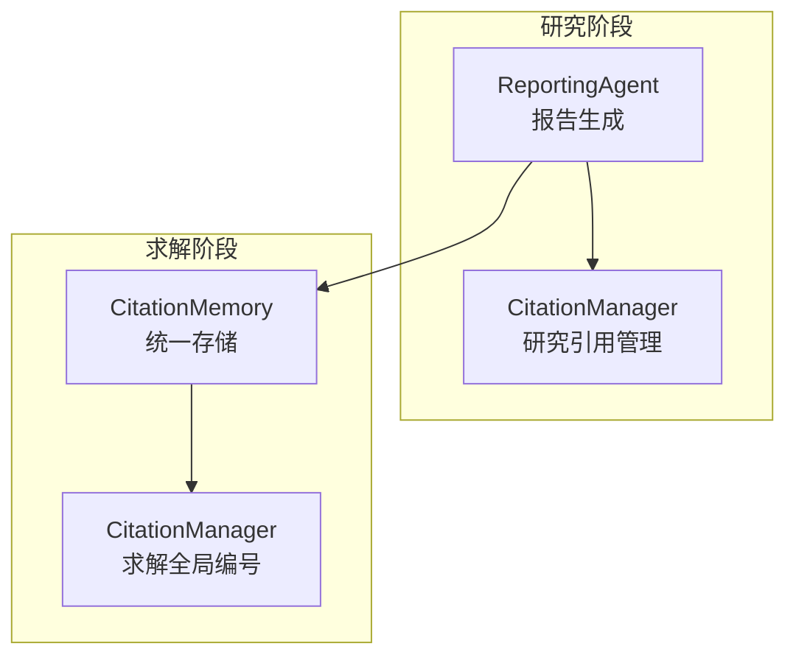
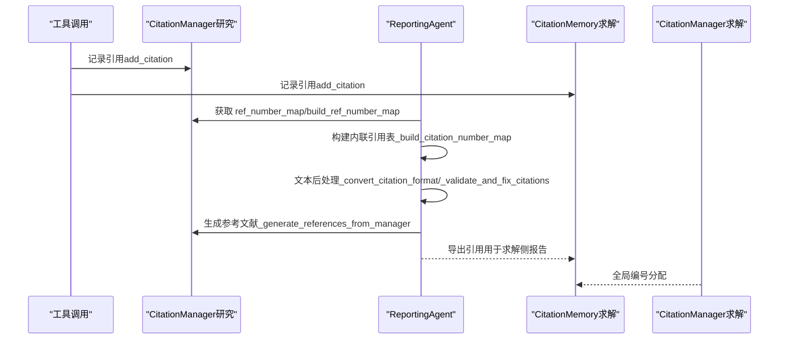
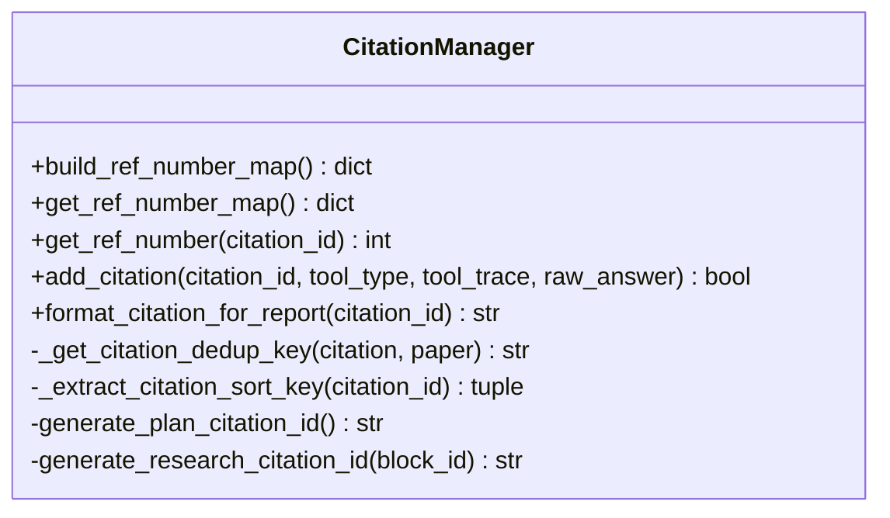
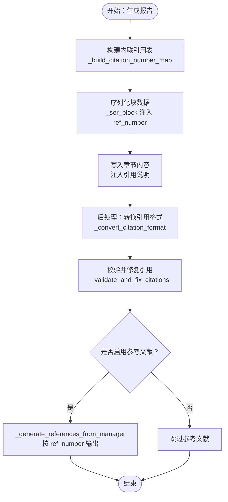
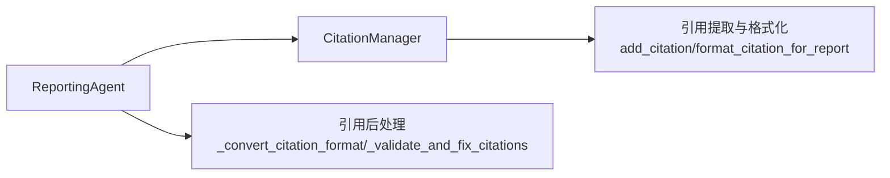

# 引用管理与参考文献

<cite>
**本文引用的文件**
- [src/agents/research/utils/citation_manager.py](file://src/agents/research/utils/citation_manager.py)
- [src/agents/research/agents/reporting_agent.py](file://src/agents/research/agents/reporting_agent.py)
- [src/agents/research/prompts/en/reporting_agent.yaml](file://src/agents/research/prompts/en/reporting_agent.yaml)
- [src/agents/solve/solve_loop/citation_manager.py](file://src/agents/solve/solve_loop/citation_manager.py)
- [src/agents/solve/memory/citation_memory.py](file://src/agents/solve/memory/citation_memory.py)
</cite>

## 目录
1. [引言](#引言)
2. [项目结构](#项目结构)
3. [核心组件](#核心组件)
4. [架构总览](#架构总览)
5. [详细组件分析](#详细组件分析)
6. [依赖关系分析](#依赖关系分析)
7. [性能考量](#性能考量)
8. [故障排查指南](#故障排查指南)
9. [结论](#结论)

## 引言
本文件系统性地文档化报告智能体的引用整合功能，重点覆盖：
- 内联引用（[N]）的生成与锚点链接转换（[[N]](#ref-N)）
- 参考文献列表的构建与排序
- _build_citation_number_map 方法与 CitationManager 的协同机制
- _generate_references 方法按工具类型（paper_search、web_search、RAG 等）生成符合学术规范的参考文献条目，并支持可折叠的链接展示

该能力贯穿“研究型报告”与“求解流程”的两条主线：前者由 ReportingAgent 负责，后者由 Solve 流程中的 CitationMemory/CitationManager 协同维护。两者在引用编号一致性、去重策略与输出格式上保持一致的设计理念。

## 项目结构
围绕引用管理的关键模块分布如下：
- 研究阶段引用管理：CitationManager（负责 ID 分配、计数器恢复、引用去重、编号映射、参考文献格式化）
- 报告生成：ReportingAgent（负责内联引用表构建、文本后处理、参考文献生成）
- 求解阶段引用管理：CitationMemory（统一存储与导出）、Solve 中 CitationManager（全局唯一连续编号）

图表来源
- [src/agents/research/utils/citation_manager.py](file://src/agents/research/utils/citation_manager.py#L1-L120)
- [src/agents/research/agents/reporting_agent.py](file://src/agents/research/agents/reporting_agent.py#L539-L720)
- [src/agents/solve/memory/citation_memory.py](file://src/agents/solve/memory/citation_memory.py#L1-L120)
- [src/agents/solve/solve_loop/citation_manager.py](file://src/agents/solve/solve_loop/citation_manager.py#L1-L75)

章节来源
- [src/agents/research/utils/citation_manager.py](file://src/agents/research/utils/citation_manager.py#L1-L120)
- [src/agents/research/agents/reporting_agent.py](file://src/agents/research/agents/reporting_agent.py#L539-L720)
- [src/agents/solve/memory/citation_memory.py](file://src/agents/solve/memory/citation_memory.py#L1-L120)
- [src/agents/solve/solve_loop/citation_manager.py](file://src/agents/solve/solve_loop/citation_manager.py#L1-L75)

## 核心组件
- CitationManager（研究阶段）
  - 负责：规划/研究阶段的引用 ID 生成、计数器恢复、引用 JSON 文件持久化、引用去重、引用编号映射、参考文献格式化
  - 关键方法：build_ref_number_map、get_ref_number_map、format_citation_for_report、add_citation 等
- ReportingAgent
  - 负责：内联引用表构建（_build_citation_number_map）、文本后处理（_convert_citation_format/_validate_and_fix_citations）、参考文献生成（_generate_references/_generate_references_from_manager）
- CitationMemory（求解阶段）
  - 负责：统一存储工具调用产生的引用条目，提供导出与格式化能力
- Solve 中 CitationManager（求解阶段）
  - 负责：全局唯一连续编号分配，保证跨步骤/跨工具的一致性

章节来源
- [src/agents/research/utils/citation_manager.py](file://src/agents/research/utils/citation_manager.py#L120-L220)
- [src/agents/research/agents/reporting_agent.py](file://src/agents/research/agents/reporting_agent.py#L539-L720)
- [src/agents/solve/memory/citation_memory.py](file://src/agents/solve/memory/citation_memory.py#L1-L120)
- [src/agents/solve/solve_loop/citation_manager.py](file://src/agents/solve/solve_loop/citation_manager.py#L1-L75)

## 架构总览
下图展示了从工具调用到报告输出的引用整合链路，强调内联引用与参考文献的双向一致性。

图表来源
- [src/agents/research/utils/citation_manager.py](file://src/agents/research/utils/citation_manager.py#L234-L338)
- [src/agents/research/agents/reporting_agent.py](file://src/agents/research/agents/reporting_agent.py#L539-L720)
- [src/agents/solve/memory/citation_memory.py](file://src/agents/solve/memory/citation_memory.py#L101-L175)
- [src/agents/solve/solve_loop/citation_manager.py](file://src/agents/solve/solve_loop/citation_manager.py#L31-L61)

## 详细组件分析

### 组件一：CitationManager（研究阶段）与引用编号映射
- 去重与编号映射
  - _get_citation_dedup_key：针对 paper_search 使用“标题+第一作者”进行去重；其他类型使用“工具类型+查询前缀”去重
  - build_ref_number_map：按 ID 排序（PLAN-XX 在前，CIT-X-XX 按块号与序列号），为每个去重键分配连续编号
  - get_ref_number/get_ref_number_map：懒加载构建映射，确保单源真值
- ID 生成与计数器
  - generate_plan_citation_id/generate_research_citation_id：规划阶段与研究阶段分别生成唯一 ID
  - 计数器恢复：优先从 JSON 文件恢复，否则回退到从现有引用中推断
- 引用提取与格式化
  - add_citation：根据工具类型解析 raw_answer，抽取论文、网页、RAG 来源等字段
  - format_citation_for_report：按工具类型输出报告级引用字符串

图表来源
- [src/agents/research/utils/citation_manager.py](file://src/agents/research/utils/citation_manager.py#L539-L738)

章节来源
- [src/agents/research/utils/citation_manager.py](file://src/agents/research/utils/citation_manager.py#L539-L738)

### 组件二：ReportingAgent 的内联引用与参考文献
- 内联引用表构建
  - _build_citation_number_map：若存在 CitationManager，则委托其构建映射；否则回退到基于 blocks 的排序与编号
  - _build_citation_table：为 LLM 提供清晰的“引用编号→来源”对照表，指导其在生成内容时正确标注 [N]
- 文本后处理
  - _convert_citation_format：将 [N] 或 [ref=N] 转换为可点击的 [[N]](#ref-N)，仅保留有效引用
  - _validate_and_fix_citations：校验并移除无效引用，统计有效/无效数量
- 参考文献生成
  - _generate_references：根据配置选择从 CitationManager 或 blocks 生成参考文献
  - _generate_references_from_manager：严格按 ref_number 排序，APA 风格论文、可折叠网页/RAG 来源
  - _format_web_search_citation/_format_rag_citation/_format_code_citation：按工具类型输出条目
  - _format_single_paper_apa/_format_paper_citation_apa：APA 格式论文条目

图表来源
- [src/agents/research/agents/reporting_agent.py](file://src/agents/research/agents/reporting_agent.py#L539-L720)
- [src/agents/research/agents/reporting_agent.py](file://src/agents/research/agents/reporting_agent.py#L1079-L1201)

章节来源
- [src/agents/research/agents/reporting_agent.py](file://src/agents/research/agents/reporting_agent.py#L539-L720)
- [src/agents/research/agents/reporting_agent.py](file://src/agents/research/agents/reporting_agent.py#L1079-L1201)

### 组件三：工具类型与参考文献条目生成
- paper_search
  - APA 格式：作者、年份、标题、会议/期刊、arXiv ID、DOI/URL
  - 支持多篇论文，首篇作为主条目，其余通过“更多论文”提示
- web_search
  - 工具名、查询、摘要
  - 可折叠“检索来源”，列出标题、URL、片段预览
- RAG/Query
  - 工具名、查询、摘要
  - 可折叠“来源文档”，列出标题、页码、片段预览
- run_code
  - 工具名、代码预览、结果摘要

章节来源
- [src/agents/research/agents/reporting_agent.py](file://src/agents/research/agents/reporting_agent.py#L723-L906)
- [src/agents/research/agents/reporting_agent.py](file://src/agents/research/agents/reporting_agent.py#L773-L852)

### 组件四：求解阶段引用管理（补充）
- CitationMemory：统一存储工具调用产生的引用条目，支持导出 Markdown 列表
- Solve 中 CitationManager：全局唯一连续编号，保证跨步骤/跨工具的一致性

章节来源
- [src/agents/solve/memory/citation_memory.py](file://src/agents/solve/memory/citation_memory.py#L1-L120)
- [src/agents/solve/solve_loop/citation_manager.py](file://src/agents/solve/solve_loop/citation_manager.py#L31-L61)

## 依赖关系分析
- ReportingAgent 对 CitationManager 的依赖
  - 通过 set_citation_manager 注入，优先使用其 ref_number_map 保证一致性
  - 回退逻辑：当未注入或无引用时，使用 blocks 构建本地映射
- 引用提取与格式化
  - CitationManager.add_citation 根据工具类型解析 raw_answer，抽取论文、网页、RAG 来源等字段
  - ReportingAgent._generate_references_from_manager 严格按 ref_number 排序输出
- 文本后处理
  - _convert_citation_format 与 _validate_and_fix_citations 保障输出的引用有效性与可点击性

图表来源
- [src/agents/research/agents/reporting_agent.py](file://src/agents/research/agents/reporting_agent.py#L539-L720)
- [src/agents/research/utils/citation_manager.py](file://src/agents/research/utils/citation_manager.py#L234-L338)

章节来源
- [src/agents/research/agents/reporting_agent.py](file://src/agents/research/agents/reporting_agent.py#L539-L720)
- [src/agents/research/utils/citation_manager.py](file://src/agents/research/utils/citation_manager.py#L234-L338)

## 性能考量
- 引用映射构建
  - build_ref_number_map 对所有引用 ID 进行排序与去重，时间复杂度近似 O(N log N)（排序主导），空间复杂度 O(N)
  - 建议在大规模引用场景下复用已保存的 JSON 文件以避免重复计算
- 文本后处理
  - 正则替换与验证在长文本中可能成为瓶颈，建议分段处理或限制扫描范围
- 并发安全
  - CitationManager 提供异步版本接口（async），在并行模式下可避免竞态

[本节为通用指导，不直接分析具体文件]

## 故障排查指南
- 内联引用无效或缺失
  - 检查 _validate_and_fix_citations 是否移除了无效引用
  - 确认 _convert_citation_format 是否正确识别并转换 [N]/[ref=N]
- 参考文献顺序错乱
  - 确认 CitationManager.get_ref_number_map 是否被正确调用
  - 检查 _generate_references_from_manager 是否按 ref_number 排序
- 引用去重异常
  - 检查 _get_citation_dedup_key 的键生成逻辑（paper_search 使用标题+第一作者）
- 引用 ID 冲突
  - 确认计数器恢复逻辑是否成功从 JSON 文件读取
  - 若未启用 JSON 持久化，注意 blocks 回退路径的排序规则

章节来源
- [src/agents/research/agents/reporting_agent.py](file://src/agents/research/agents/reporting_agent.py#L1021-L1077)
- [src/agents/research/agents/reporting_agent.py](file://src/agents/research/agents/reporting_agent.py#L1079-L1201)
- [src/agents/research/utils/citation_manager.py](file://src/agents/research/utils/citation_manager.py#L113-L174)

## 结论
本系统通过“研究阶段 CitationManager + 报告生成 ReportingAgent”的协作，实现了：
- 统一的引用编号映射（含去重与排序）
- 内联引用表构建与锚点链接转换
- 多工具类型的参考文献条目生成（APA/可折叠链接）
- 文本后处理与引用有效性校验

上述设计既满足研究型报告的学术规范，又兼顾了可扩展性与可维护性，适合在多工具、多来源的复杂场景中稳定运行。