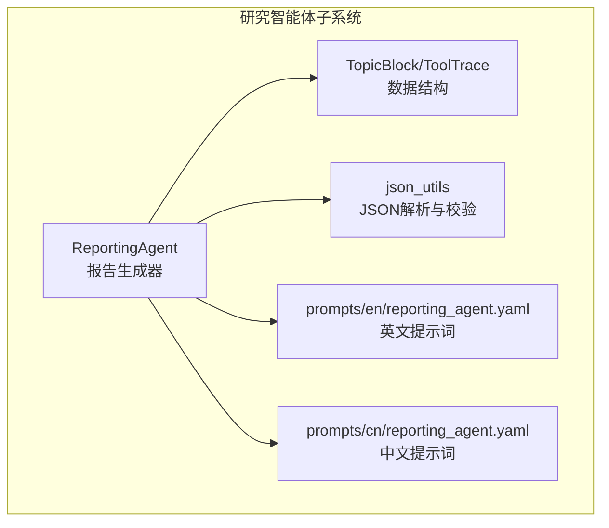
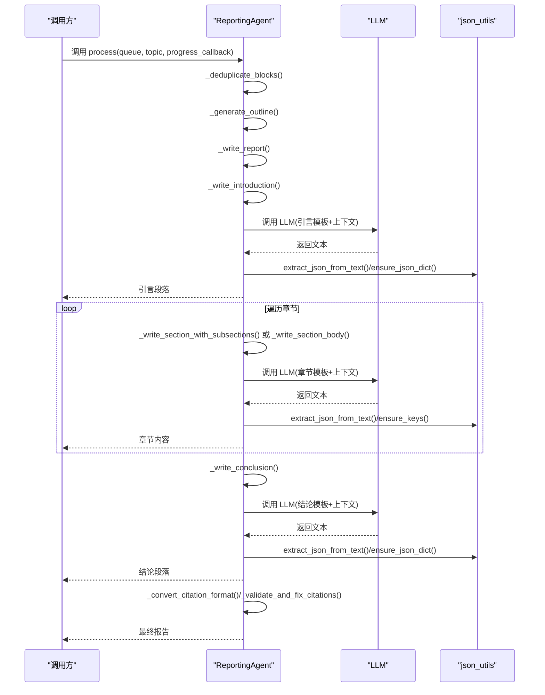
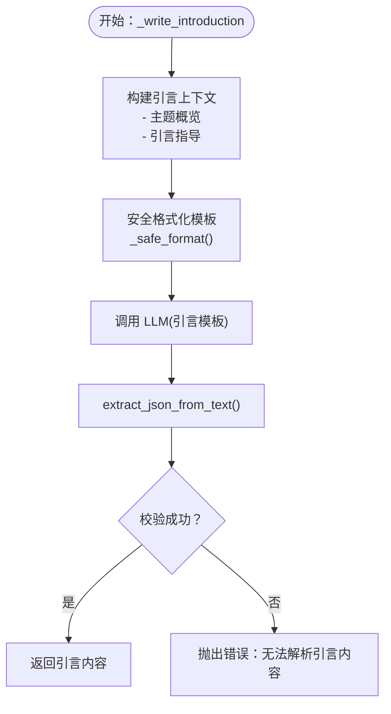
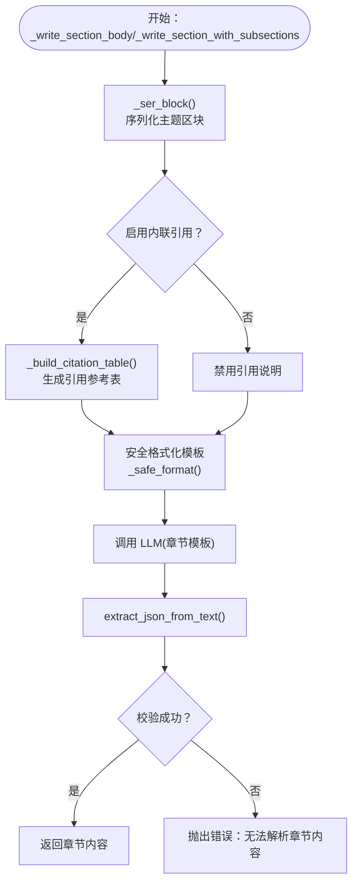
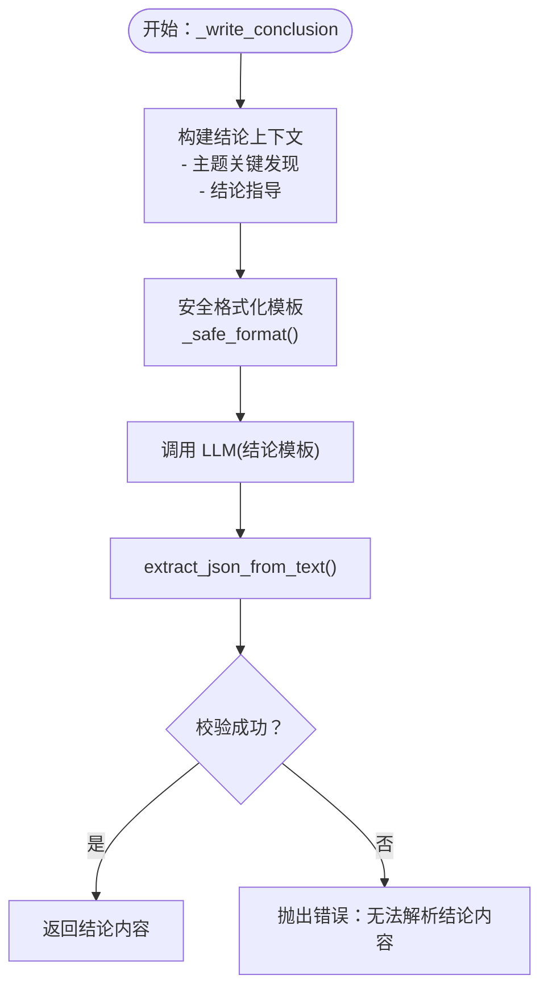
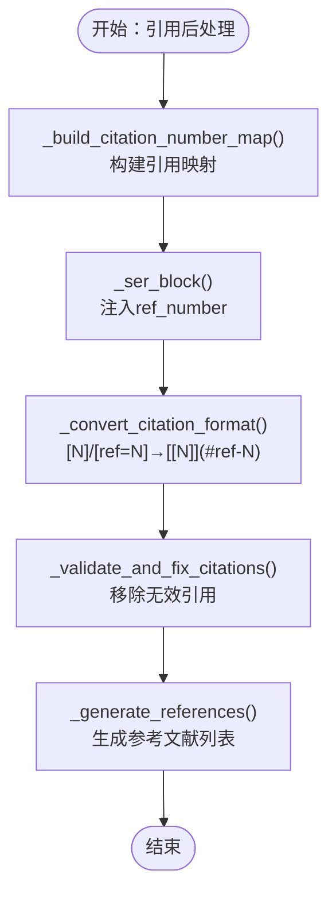
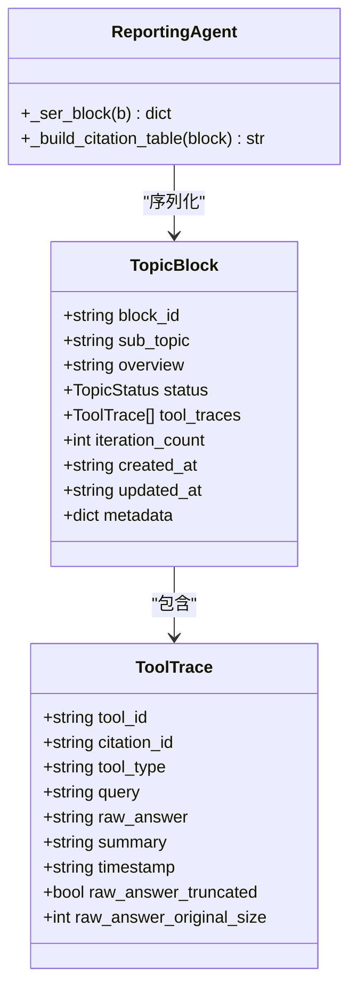
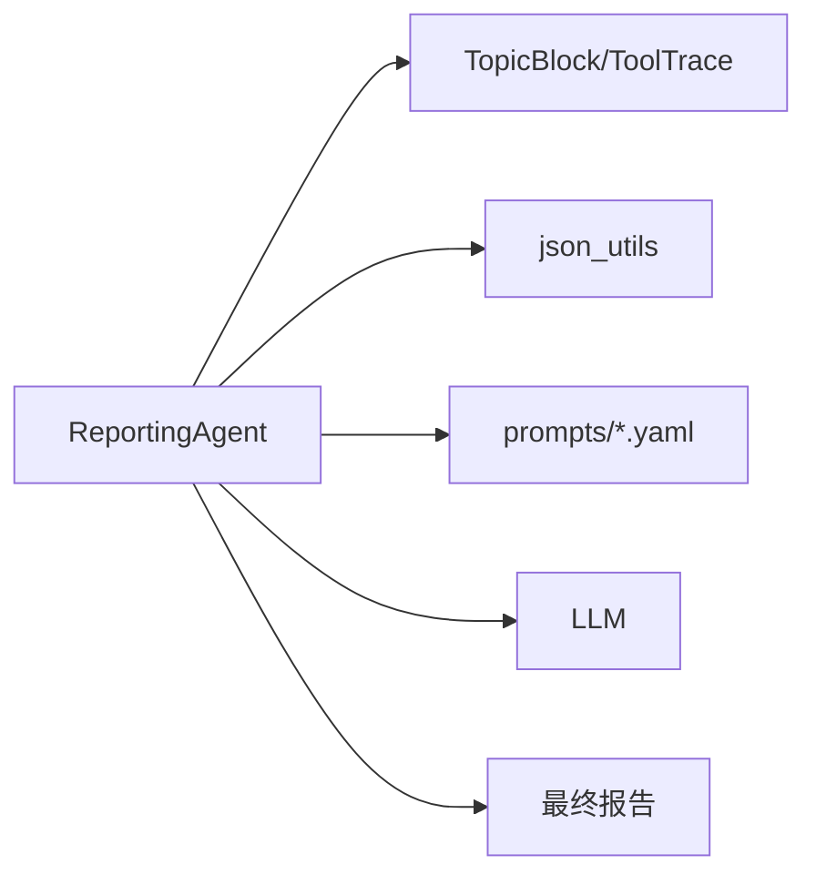

# 报告内容撰写

<cite>
**本文引用的文件**
- [src/agents/research/agents/reporting_agent.py](file://src/agents/research/agents/reporting_agent.py)
- [src/agents/research/prompts/en/reporting_agent.yaml](file://src/agents/research/prompts/en/reporting_agent.yaml)
- [src/agents/research/prompts/cn/reporting_agent.yaml](file://src/agents/research/prompts/cn/reporting_agent.yaml)
- [src/agents/research/data_structures.py](file://src/agents/research/data_structures.py)
- [src/agents/research/utils/json_utils.py](file://src/agents/research/utils/json_utils.py)
</cite>

## 目录
1. [简介](#简介)
2. [项目结构](#项目结构)
3. [核心组件](#核心组件)
4. [架构总览](#架构总览)
5. [详细组件分析](#详细组件分析)
6. [依赖关系分析](#依赖关系分析)
7. [性能考量](#性能考量)
8. [故障排查指南](#故障排查指南)
9. [结论](#结论)

## 简介
本文件面向“报告智能体”的内容撰写流程，系统性说明其如何分步生成报告的引言、主体章节与结论。重点覆盖以下方面：
- 引言、主体章节与结论的分步生成流程与调用关系
- 私有方法 _write_introduction、_write_section_body、_write_conclusion 的职责与实现要点
- 如何利用序列化的研究区块数据（包含工具追踪摘要）生成连贯的学术文本
- LLM 上下文构建策略（模板安全格式化、引用表与输出约束）
- 错误处理与 JSON 解析校验机制

## 项目结构
报告智能体位于研究智能体子系统中，围绕“主题区块”（TopicBlock）与“工具追踪”（ToolTrace）组织研究产出，通过提示词模板驱动 LLM 生成结构化报告内容。

图表来源
- [src/agents/research/agents/reporting_agent.py](file://src/agents/research/agents/reporting_agent.py#L1-L120)
- [src/agents/research/data_structures.py](file://src/agents/research/data_structures.py#L173-L221)
- [src/agents/research/utils/json_utils.py](file://src/agents/research/utils/json_utils.py#L1-L99)
- [src/agents/research/prompts/en/reporting_agent.yaml](file://src/agents/research/prompts/en/reporting_agent.yaml#L1-L120)
- [src/agents/research/prompts/cn/reporting_agent.yaml](file://src/agents/research/prompts/cn/reporting_agent.yaml#L1-L120)

章节来源
- [src/agents/research/agents/reporting_agent.py](file://src/agents/research/agents/reporting_agent.py#L1-L120)
- [src/agents/research/data_structures.py](file://src/agents/research/data_structures.py#L173-L221)

## 核心组件
- ReportingAgent：负责报告生成全流程，包括去重清洗、大纲生成、逐段撰写、引用整理与后处理。
- TopicBlock/ToolTrace：承载研究主题与工具调用轨迹，提供序列化数据以驱动 LLM 内容生成。
- json_utils：提供稳健的 JSON 提取与结构校验能力，保障 LLM 输出的可用性。
- 提示词模板：英文与中文两套模板，分别定义“引言/章节/结论”写作框架、引用要求与输出格式约束。

章节来源
- [src/agents/research/agents/reporting_agent.py](file://src/agents/research/agents/reporting_agent.py#L1-L120)
- [src/agents/research/data_structures.py](file://src/agents/research/data_structures.py#L173-L221)
- [src/agents/research/utils/json_utils.py](file://src/agents/research/utils/json_utils.py#L1-L99)
- [src/agents/research/prompts/en/reporting_agent.yaml](file://src/agents/research/prompts/en/reporting_agent.yaml#L1-L120)
- [src/agents/research/prompts/cn/reporting_agent.yaml](file://src/agents/research/prompts/cn/reporting_agent.yaml#L1-L120)

## 架构总览
报告智能体的撰写流程由“三步法”构成：先去重清洗，再生成大纲，最后按大纲逐段撰写。引言、章节与结论分别由对应私有方法生成，均通过统一的模板与上下文构建策略驱动 LLM，并以严格的 JSON 校验确保输出质量。

图表来源
- [src/agents/research/agents/reporting_agent.py](file://src/agents/research/agents/reporting_agent.py#L78-L160)
- [src/agents/research/agents/reporting_agent.py](file://src/agents/research/agents/reporting_agent.py#L1080-L1201)
- [src/agents/research/agents/reporting_agent.py](file://src/agents/research/agents/reporting_agent.py#L363-L415)
- [src/agents/research/agents/reporting_agent.py](file://src/agents/research/agents/reporting_agent.py#L417-L478)
- [src/agents/research/agents/reporting_agent.py](file://src/agents/research/agents/reporting_agent.py#L480-L537)
- [src/agents/research/utils/json_utils.py](file://src/agents/research/utils/json_utils.py#L1-L99)

## 详细组件分析

### 引言生成：_write_introduction
- 输入：研究主题、全部主题区块、报告大纲
- 上下文构建：
  - 汇总各主题的子主题、概述与工具追踪数量，形成“主题概览”
  - 从大纲中提取引言指导（优先使用“引言指导”，否则回退到“引言标题”）
  - 使用安全格式化模板，避免 LaTeX 大括号冲突
- LLM 调用：
  - 采用“引言”专用模板与系统角色
  - 输出严格为 JSON，包含“introduction”字段
- 后处理与校验：
  - 解析 JSON 并校验存在“introduction”键
  - 若为空或无效，抛出明确错误信息

图表来源
- [src/agents/research/agents/reporting_agent.py](file://src/agents/research/agents/reporting_agent.py#L363-L415)
- [src/agents/research/utils/json_utils.py](file://src/agents/research/utils/json_utils.py#L1-L99)

章节来源
- [src/agents/research/agents/reporting_agent.py](file://src/agents/research/agents/reporting_agent.py#L363-L415)
- [src/agents/research/prompts/en/reporting_agent.yaml](file://src/agents/research/prompts/en/reporting_agent.yaml#L134-L181)
- [src/agents/research/prompts/cn/reporting_agent.yaml](file://src/agents/research/prompts/cn/reporting_agent.yaml#L134-L181)

### 主体章节生成：_write_section_body 与 _write_section_with_subsections
- 输入：研究主题、单个主题区块、章节大纲（含标题与指导）
- 上下文构建：
  - 序列化主题区块（包含工具追踪），并根据配置决定是否附带引用映射
  - 动态构建引用说明（启用内联引用时，生成“引用参考表”；禁用时给出相应说明）
  - 使用最小字数约束与输出提示（如“包含引用”），确保内容深度
  - 使用安全格式化模板，避免 LaTeX 大括号冲突
- LLM 调用：
  - 采用“章节”专用模板与系统角色
  - 输出严格为 JSON，包含“section_content”字段
- 后处理与校验：
  - 解析 JSON 并校验存在“section_content”键
  - 若为空或无效，抛出明确错误信息

图表来源
- [src/agents/research/agents/reporting_agent.py](file://src/agents/research/agents/reporting_agent.py#L417-L478)
- [src/agents/research/agents/reporting_agent.py](file://src/agents/research/agents/reporting_agent.py#L1204-L1306)
- [src/agents/research/agents/reporting_agent.py](file://src/agents/research/agents/reporting_agent.py#L288-L315)
- [src/agents/research/agents/reporting_agent.py](file://src/agents/research/agents/reporting_agent.py#L317-L361)
- [src/agents/research/utils/json_utils.py](file://src/agents/research/utils/json_utils.py#L1-L99)

章节来源
- [src/agents/research/agents/reporting_agent.py](file://src/agents/research/agents/reporting_agent.py#L417-L478)
- [src/agents/research/agents/reporting_agent.py](file://src/agents/research/agents/reporting_agent.py#L1204-L1306)
- [src/agents/research/prompts/en/reporting_agent.yaml](file://src/agents/research/prompts/en/reporting_agent.yaml#L182-L290)
- [src/agents/research/prompts/cn/reporting_agent.yaml](file://src/agents/research/prompts/cn/reporting_agent.yaml#L182-L290)

### 结论生成：_write_conclusion
- 输入：研究主题、全部主题区块、报告大纲
- 上下文构建：
  - 汇总各主题的子主题、概述与前若干条关键发现（每主题取前三条）
  - 从大纲中提取结论指导（优先使用“结论指导”，否则回退到“结论标题”）
  - 使用安全格式化模板，避免 LaTeX 大括号冲突
- LLM 调用：
  - 采用“结论”专用模板与系统角色
  - 输出严格为 JSON，包含“conclusion”字段
- 后处理与校验：
  - 解析 JSON 并校验存在“conclusion”键
  - 若为空或无效，抛出明确错误信息

图表来源
- [src/agents/research/agents/reporting_agent.py](file://src/agents/research/agents/reporting_agent.py#L480-L537)
- [src/agents/research/utils/json_utils.py](file://src/agents/research/utils/json_utils.py#L1-L99)

章节来源
- [src/agents/research/agents/reporting_agent.py](file://src/agents/research/agents/reporting_agent.py#L480-L537)
- [src/agents/research/prompts/en/reporting_agent.yaml](file://src/agents/research/prompts/en/reporting_agent.yaml#L291-L339)
- [src/agents/research/prompts/cn/reporting_agent.yaml](file://src/agents/research/prompts/cn/reporting_agent.yaml#L291-L339)

### 引用与参考文献：内联引用与参考文献列表
- 引用映射与一致性：
  - 在撰写前构建“引用ID→编号”的映射，保证章节内联引用与参考文献一致
  - 将引用编号注入序列化后的主题区块，便于 LLM 在文本中标注引用
- 引用格式转换与校验：
  - 将“[N]”或“[ref=N]”转换为可点击锚点“[[N]](#ref-N)”格式
  - 校验并移除无效引用，统计有效/无效引用数量
- 参考文献列表：
  - 可基于引用管理器生成统一格式（APA 等），或回退到从区块提取的历史方式
  - 支持多种工具类型的引用格式（论文检索、RAG/KB 查询、网络检索、代码执行）

图表来源
- [src/agents/research/agents/reporting_agent.py](file://src/agents/research/agents/reporting_agent.py#L539-L624)
- [src/agents/research/agents/reporting_agent.py](file://src/agents/research/agents/reporting_agent.py#L973-L1021)
- [src/agents/research/agents/reporting_agent.py](file://src/agents/research/agents/reporting_agent.py#L1022-L1078)
- [src/agents/research/agents/reporting_agent.py](file://src/agents/research/agents/reporting_agent.py#L582-L721)

章节来源
- [src/agents/research/agents/reporting_agent.py](file://src/agents/research/agents/reporting_agent.py#L539-L624)
- [src/agents/research/agents/reporting_agent.py](file://src/agents/research/agents/reporting_agent.py#L973-L1021)
- [src/agents/research/agents/reporting_agent.py](file://src/agents/research/agents/reporting_agent.py#L1022-L1078)
- [src/agents/research/agents/reporting_agent.py](file://src/agents/research/agents/reporting_agent.py#L582-L721)

### 数据结构与序列化：TopicBlock 与 ToolTrace
- TopicBlock：承载子主题、概述、状态、工具追踪集合与元数据
- ToolTrace：记录单次工具调用的查询、原始回答、摘要、引用ID与时间戳
- 序列化策略：
  - _ser_block 将主题区块转换为字典，包含引用ID、工具类型、查询、原始回答、摘要，并在启用内联引用时附加“ref_number”

图表来源
- [src/agents/research/data_structures.py](file://src/agents/research/data_structures.py#L173-L221)
- [src/agents/research/data_structures.py](file://src/agents/research/data_structures.py#L40-L114)
- [src/agents/research/agents/reporting_agent.py](file://src/agents/research/agents/reporting_agent.py#L288-L315)
- [src/agents/research/agents/reporting_agent.py](file://src/agents/research/agents/reporting_agent.py#L317-L361)

章节来源
- [src/agents/research/data_structures.py](file://src/agents/research/data_structures.py#L173-L221)
- [src/agents/research/data_structures.py](file://src/agents/research/data_structures.py#L40-L114)
- [src/agents/research/agents/reporting_agent.py](file://src/agents/research/agents/reporting_agent.py#L288-L315)
- [src/agents/research/agents/reporting_agent.py](file://src/agents/research/agents/reporting_agent.py#L317-L361)

## 依赖关系分析
- ReportingAgent 依赖：
  - 数据结构：TopicBlock/ToolTrace
  - JSON 工具：extract_json_from_text、ensure_json_dict、ensure_keys
  - 提示词模板：英文/中文“引言/章节/结论”模板与“引用说明”模板
- LLM 调用链路：
  - 模板填充（_safe_format）→ 调用 LLM → 解析 JSON → 校验字段 → 返回文本
- 引用处理链路：
  - 构建映射 → 注入 ref_number → 文本转换 → 校验与修复 → 生成参考文献

图表来源
- [src/agents/research/agents/reporting_agent.py](file://src/agents/research/agents/reporting_agent.py#L1-L120)
- [src/agents/research/utils/json_utils.py](file://src/agents/research/utils/json_utils.py#L1-L99)
- [src/agents/research/prompts/en/reporting_agent.yaml](file://src/agents/research/prompts/en/reporting_agent.yaml#L1-L120)
- [src/agents/research/prompts/cn/reporting_agent.yaml](file://src/agents/research/prompts/cn/reporting_agent.yaml#L1-L120)

章节来源
- [src/agents/research/agents/reporting_agent.py](file://src/agents/research/agents/reporting_agent.py#L1-L120)
- [src/agents/research/utils/json_utils.py](file://src/agents/research/utils/json_utils.py#L1-L99)

## 性能考量
- 模板安全格式化：通过 string.Template 与占位符转换，避免 LaTeX 大括号冲突，减少二次替换成本
- JSON 解析与校验：优先尝试整段 JSON，其次匹配片段，最后回退为严格解析，兼顾鲁棒性与效率
- 引用映射与转换：一次性构建映射，后续仅做常量时间查找与替换，避免重复计算
- 字数与结构控制：章节模板提供最小字数与结构约束，有助于减少 LLM 重复与冗余输出

## 故障排查指南
- LLM 输出非 JSON 或结构缺失
  - 现象：解析失败或缺少必需字段
  - 排查：检查提示词模板是否完整、系统角色是否正确、上下文是否过大
  - 参考路径：[extract_json_from_text](file://src/agents/research/utils/json_utils.py#L14-L55)、[ensure_keys](file://src/agents/research/utils/json_utils.py#L73-L77)
- 引用格式异常或无效引用
  - 现象：内联引用未转换或存在无效编号
  - 排查：确认引用映射构建是否完成、模板中是否包含“引用参考表”、是否启用内联引用
  - 参考路径：[_convert_citation_format](file://src/agents/research/agents/reporting_agent.py#L973-L1021)、[_validate_and_fix_citations](file://src/agents/research/agents/reporting_agent.py#L1022-L1078)
- 引用参考表为空或未生成
  - 现象：章节中无引用标注或参考文献列表为空
  - 排查：确认主题区块是否包含工具追踪、引用ID是否生成、是否启用引用列表
  - 参考路径：[_build_citation_table](file://src/agents/research/agents/reporting_agent.py#L317-L361)、[_generate_references](file://src/agents/research/agents/reporting_agent.py#L582-L721)
- 引言/章节/结论生成失败
  - 现象：抛出“无法解析...内容”类错误
  - 排查：检查模板是否存在、系统角色是否配置、上下文是否过长导致截断
  - 参考路径：[_write_introduction](file://src/agents/research/agents/reporting_agent.py#L363-L415)、[_write_section_body](file://src/agents/research/agents/reporting_agent.py#L417-L478)、[_write_conclusion](file://src/agents/research/agents/reporting_agent.py#L480-L537)

章节来源
- [src/agents/research/utils/json_utils.py](file://src/agents/research/utils/json_utils.py#L1-L99)
- [src/agents/research/agents/reporting_agent.py](file://src/agents/research/agents/reporting_agent.py#L317-L361)
- [src/agents/research/agents/reporting_agent.py](file://src/agents/research/agents/reporting_agent.py#L582-L721)
- [src/agents/research/agents/reporting_agent.py](file://src/agents/research/agents/reporting_agent.py#L973-L1021)
- [src/agents/research/agents/reporting_agent.py](file://src/agents/research/agents/reporting_agent.py#L1022-L1078)
- [src/agents/research/agents/reporting_agent.py](file://src/agents/research/agents/reporting_agent.py#L363-L415)
- [src/agents/research/agents/reporting_agent.py](file://src/agents/research/agents/reporting_agent.py#L417-L478)
- [src/agents/research/agents/reporting_agent.py](file://src/agents/research/agents/reporting_agent.py#L480-L537)

## 结论
报告智能体通过“去重清洗—大纲生成—逐段撰写—引用后处理”的流水线，将序列化的研究区块数据（含工具追踪摘要）转化为结构化、可引用的学术报告。其关键优势在于：
- 统一的模板与上下文构建策略，确保 LLM 输出符合 JSON 与格式要求
- 严格的 JSON 解析与字段校验，降低下游处理风险
- 内联引用与参考文献的闭环管理，保证学术严谨性与可追溯性
- 清晰的错误处理与回退路径，提升系统稳定性