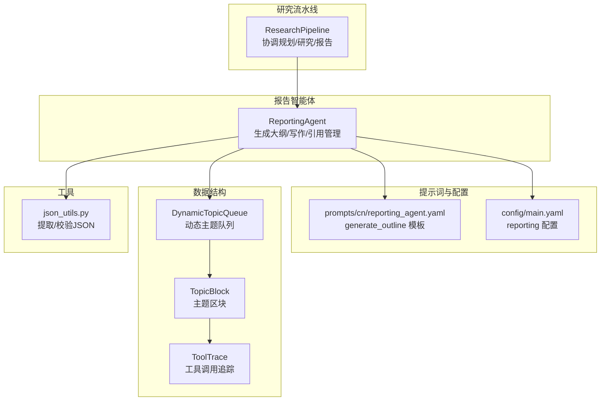
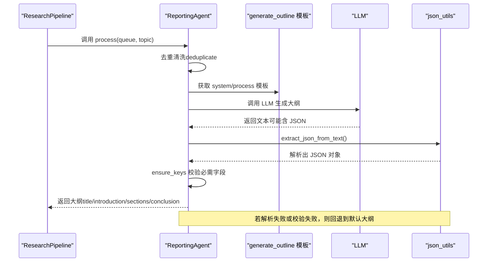
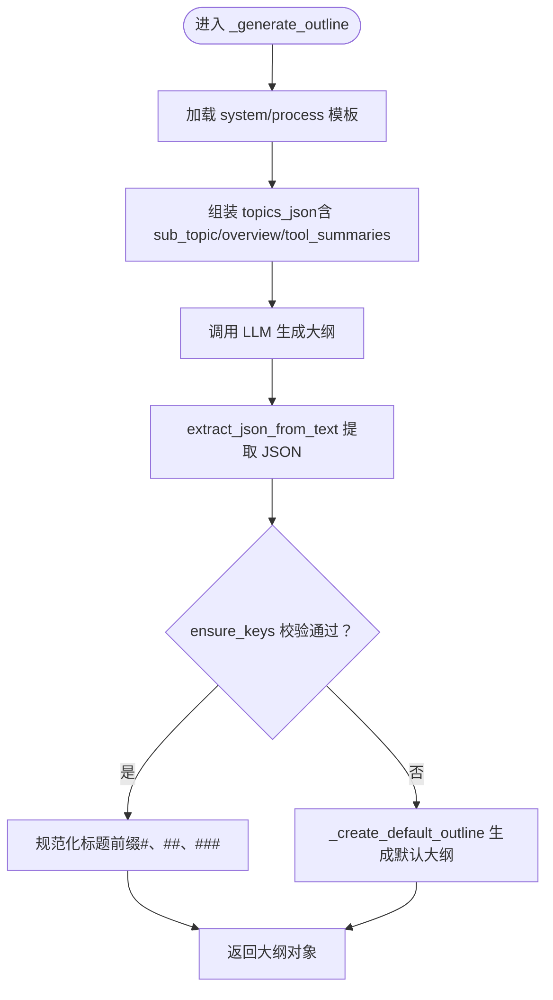
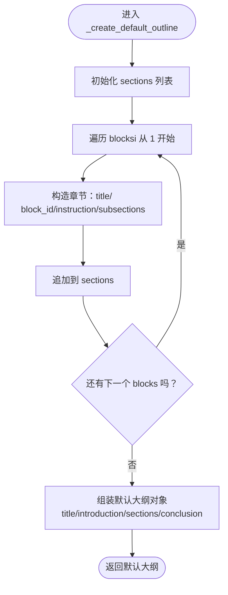
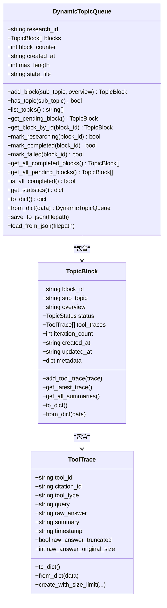
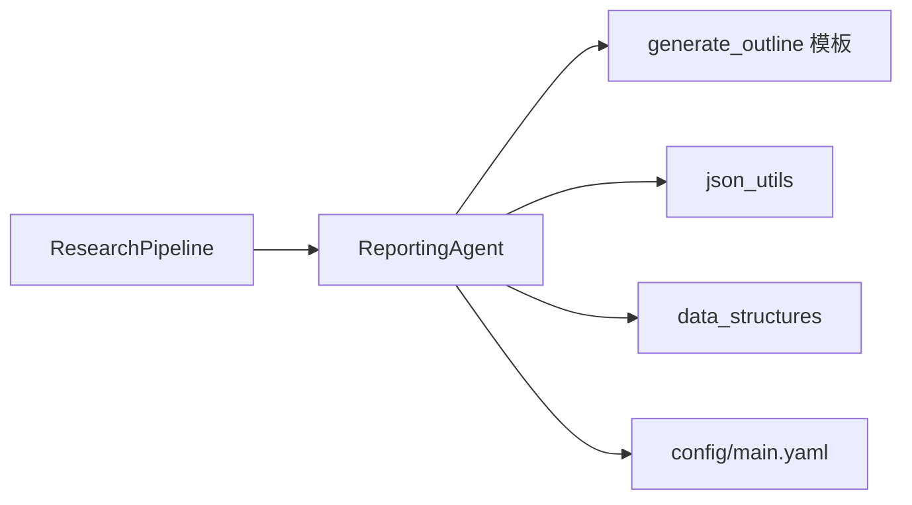

# 报告大纲生成

<cite>
**本文引用的文件**
- [src/agents/research/agents/reporting_agent.py](file://src/agents/research/agents/reporting_agent.py)
- [src/agents/research/prompts/cn/reporting_agent.yaml](file://src/agents/research/prompts/cn/reporting_agent.yaml)
- [src/agents/research/data_structures.py](file://src/agents/research/data_structures.py)
- [src/agents/research/utils/json_utils.py](file://src/agents/research/utils/json_utils.py)
- [config/main.yaml](file://config/main.yaml)
- [src/agents/research/research_pipeline.py](file://src/agents/research/research_pipeline.py)
</cite>

## 目录
1. [简介](#简介)
2. [项目结构](#项目结构)
3. [核心组件](#核心组件)
4. [架构总览](#架构总览)
5. [详细组件分析](#详细组件分析)
6. [依赖分析](#依赖分析)
7. [性能考虑](#性能考虑)
8. [故障排查指南](#故障排查指南)
9. [结论](#结论)
10. [附录](#附录)

## 简介
本文件系统性记录“报告智能体”的大纲生成机制，重点说明其如何基于研究主题与区块概览构建三级标题结构（主标题、章节、子章节），并详细解析主提示模板（generate_outline）的设计原理、JSON格式约束以及在解析失败时的回退策略。同时提供大纲结构示例与通过配置文件自定义大纲深度与逻辑结构的方法。

## 项目结构
围绕“报告大纲生成”的关键文件与职责如下：
- 报告智能体：负责生成报告大纲、清洗去重、按大纲写作正文与结论，并在失败时回退到默认大纲。
- 提示词模板：提供 generate_outline 的严格格式要求与结构设计原则。
- 数据结构：TopicBlock、ToolTrace、DynamicTopicQueue，承载研究主题、概览与工具调用摘要。
- JSON 工具：从大模型输出中稳健提取 JSON 并进行结构校验。
- 配置文件：控制报告阶段的最小章节长度、是否启用引用列表与内联引用等。
- 研究流水线：串联规划、研究、报告三个阶段，最终产出报告与大纲。



**图表来源**
- [src/agents/research/research_pipeline.py](file://src/agents/research/research_pipeline.py#L1-L120)
- [src/agents/research/agents/reporting_agent.py](file://src/agents/research/agents/reporting_agent.py#L1-L120)
- [src/agents/research/prompts/cn/reporting_agent.yaml](file://src/agents/research/prompts/cn/reporting_agent.yaml#L70-L133)
- [config/main.yaml](file://config/main.yaml#L86-L91)
- [src/agents/research/data_structures.py](file://src/agents/research/data_structures.py#L173-L223)
- [src/agents/research/utils/json_utils.py](file://src/agents/research/utils/json_utils.py#L1-L99)

**章节来源**
- [src/agents/research/research_pipeline.py](file://src/agents/research/research_pipeline.py#L1-L120)
- [src/agents/research/agents/reporting_agent.py](file://src/agents/research/agents/reporting_agent.py#L1-L120)
- [src/agents/research/prompts/cn/reporting_agent.yaml](file://src/agents/research/prompts/cn/reporting_agent.yaml#L70-L133)
- [config/main.yaml](file://config/main.yaml#L86-L91)
- [src/agents/research/data_structures.py](file://src/agents/research/data_structures.py#L173-L223)
- [src/agents/research/utils/json_utils.py](file://src/agents/research/utils/json_utils.py#L1-L99)

## 核心组件
- 报告智能体（ReportingAgent）
  - 负责：去重清洗、生成大纲、按大纲写作正文与结论、引用管理、保存大纲与报告。
  - 关键方法：_generate_outline、_create_default_outline、_write_report 等。
- 提示词模板（generate_outline）
  - 明确三级标题体系（#、##、###）、章节设计原则、输出格式要求（纯 JSON，不可含代码块包裹）。
- 数据结构（TopicBlock、ToolTrace、DynamicTopicQueue）
  - 以 TopicBlock 为基本单元，包含子主题、概览、工具调用追踪；DynamicTopicQueue 管理调度。
- JSON 工具（json_utils）
  - 从 LLM 输出中提取 JSON，支持代码块、片段与纯文本三种形式；提供严格结构校验。
- 配置（config/main.yaml）
  - reporting.min_section_length 控制章节最小字数；enable_citation_list、enable_inline_citations 控制引用策略。

**章节来源**
- [src/agents/research/agents/reporting_agent.py](file://src/agents/research/agents/reporting_agent.py#L162-L288)
- [src/agents/research/prompts/cn/reporting_agent.yaml](file://src/agents/research/prompts/cn/reporting_agent.yaml#L70-L133)
- [src/agents/research/data_structures.py](file://src/agents/research/data_structures.py#L173-L223)
- [src/agents/research/utils/json_utils.py](file://src/agents/research/utils/json_utils.py#L1-L99)
- [config/main.yaml](file://config/main.yaml#L86-L91)

## 架构总览
报告智能体在研究流水线的“报告”阶段被调用，接收清洗后的主题区块集合，基于提示词模板生成结构化大纲；随后按大纲逐节写作正文与结论，并在失败时回退到默认大纲。



**图表来源**
- [src/agents/research/research_pipeline.py](file://src/agents/research/research_pipeline.py#L407-L470)
- [src/agents/research/agents/reporting_agent.py](file://src/agents/research/agents/reporting_agent.py#L162-L288)
- [src/agents/research/utils/json_utils.py](file://src/agents/research/utils/json_utils.py#L1-L99)
- [src/agents/research/prompts/cn/reporting_agent.yaml](file://src/agents/research/prompts/cn/reporting_agent.yaml#L70-L133)

## 详细组件分析

### 大纲生成器（ReportingAgent._generate_outline）
- 输入：研究主题 topic 与清洗后的 TopicBlock 列表 blocks。
- 输出：结构化大纲对象，包含 title、introduction、sections、conclusion。
- 三级标题体系设计：
  - 主标题：# 报告总标题
  - 章节：## 主要章节（引言、核心章节、结论）
  - 子章节：### 子主题
- 提示词模板要求：
  - 严格输出 JSON 对象，不可使用代码块包裹。
  - 输出示例展示了字段结构与标题前缀约定。
- JSON 解析与校验：
  - 使用 extract_json_from_text 从 LLM 文本中提取 JSON。
  - 使用 ensure_json_dict 与 ensure_keys 校验对象与必需字段。
- 标题规范化：
  - 自动补全标题前缀（如 title 未以 # 开头则补上；introduction/conclusion 未以 ## 开头则补上；sections/subsections 未以 ##/### 开头则补上）。
- 回退策略：
  - 若解析失败或校验失败，回退到默认大纲（见下节）。



**图表来源**
- [src/agents/research/agents/reporting_agent.py](file://src/agents/research/agents/reporting_agent.py#L189-L288)
- [src/agents/research/utils/json_utils.py](file://src/agents/research/utils/json_utils.py#L1-L99)
- [src/agents/research/prompts/cn/reporting_agent.yaml](file://src/agents/research/prompts/cn/reporting_agent.yaml#L70-L133)

**章节来源**
- [src/agents/research/agents/reporting_agent.py](file://src/agents/research/agents/reporting_agent.py#L189-L288)
- [src/agents/research/utils/json_utils.py](file://src/agents/research/utils/json_utils.py#L1-L99)
- [src/agents/research/prompts/cn/reporting_agent.yaml](file://src/agents/research/prompts/cn/reporting_agent.yaml#L70-L133)

### 默认大纲生成（_create_default_outline）
- 当 LLM 输出无法解析或不符合要求时，回退到默认大纲。
- 默认结构：
  - title：主标题（自动补 # 前缀）
  - introduction：引言（自动补 ## 前缀）
  - sections：按 blocks 数量生成若干章节，每章包含 block_id、instruction 与两个固定子章节（Core Concepts and Definitions、Key Mechanisms and Principles）。
  - conclusion：结论（自动补 ## 前缀）



**图表来源**
- [src/agents/research/agents/reporting_agent.py](file://src/agents/research/agents/reporting_agent.py#L259-L288)

**章节来源**
- [src/agents/research/agents/reporting_agent.py](file://src/agents/research/agents/reporting_agent.py#L259-L288)

### 提示模板（generate_outline）设计要点
- 三级标题体系与章节设计原则：
  - 一级标题（#）：报告总标题
  - 二级标题（##）：主要章节（引言、核心章节、结论）
  - 三级标题（###）：章节内的子主题
  - 可选四级标题（####）：用于复杂章节的进一步细分
- 逻辑结构设计：
  - 识别话题间的逻辑关系（层次、依赖、并列、递进、对比）
  - 按认知规律排序（概念→原理→方法→应用→评估→展望）
  - 确保章节间有明确的过渡逻辑
- 章节设计指南：
  - 每个主章节应有明确的研究问题或目标
  - 子章节应覆盖该主题的核心维度
  - instruction 应指明需要涵盖的关键要素和呈现方式
- 输出格式要求：
  - 严格输出 JSON 对象，不可使用代码块包裹
  - 输出示例展示了字段结构与标题前缀约定

**章节来源**
- [src/agents/research/prompts/cn/reporting_agent.yaml](file://src/agents/research/prompts/cn/reporting_agent.yaml#L70-L133)

### JSON 解析与校验（json_utils）
- 提取策略：
  - 支持纯 JSON 文本、Markdown 代码块（```json ... ``` 或 ``` ... ```）、首个 JSON 片段匹配。
- 校验策略：
  - ensure_json_dict：确保为对象
  - ensure_keys：确保包含必需字段
- 容错能力：
  - 即使 LLM 输出包含注释或多余文本，也能尽量提取有效 JSON。

**章节来源**
- [src/agents/research/utils/json_utils.py](file://src/agents/research/utils/json_utils.py#L1-L99)

### 数据结构（TopicBlock、ToolTrace、DynamicTopicQueue）
- TopicBlock：包含 block_id、sub_topic、overview、tool_traces 等字段，提供序列化与反序列化。
- ToolTrace：记录单次工具调用的完整循环，包含 tool_id、citation_id、tool_type、query、raw_answer、summary 等。
- DynamicTopicQueue：动态主题队列，支持添加、查询、状态管理与持久化。



**图表来源**
- [src/agents/research/data_structures.py](file://src/agents/research/data_structures.py#L173-L223)
- [src/agents/research/data_structures.py](file://src/agents/research/data_structures.py#L40-L172)

**章节来源**
- [src/agents/research/data_structures.py](file://src/agents/research/data_structures.py#L40-L223)

### 配置文件与自定义大纲深度
- reporting 配置项：
  - min_section_length：控制章节最小字数（影响正文写作阶段）
  - enable_citation_list：是否生成参考文献列表
  - enable_inline_citations：是否在正文中使用内联引用
- preset 模式：
  - quick、medium、deep、auto：预设模式下会覆盖 reporting.min_section_length 等参数，从而间接影响大纲的深度与章节长度预期。
- 在流水线中继承配置：
  - 研究流水线会将 research.reporting 的默认值合并到运行配置中，确保报告阶段行为一致。

**章节来源**
- [config/main.yaml](file://config/main.yaml#L86-L142)
- [src/api/routers/research.py](file://src/api/routers/research.py#L159-L179)

## 依赖分析
- ReportingAgent 依赖：
  - 提示词模板（generate_outline）用于约束输出结构
  - JSON 工具用于稳健提取与校验
  - 数据结构用于承载主题与工具调用摘要
  - 配置用于控制引用与章节长度
- 研究流水线依赖：
  - 在报告阶段调用 ReportingAgent，并保存大纲与报告



**图表来源**
- [src/agents/research/agents/reporting_agent.py](file://src/agents/research/agents/reporting_agent.py#L1-L120)
- [src/agents/research/prompts/cn/reporting_agent.yaml](file://src/agents/research/prompts/cn/reporting_agent.yaml#L70-L133)
- [src/agents/research/utils/json_utils.py](file://src/agents/research/utils/json_utils.py#L1-L99)
- [src/agents/research/data_structures.py](file://src/agents/research/data_structures.py#L173-L223)
- [config/main.yaml](file://config/main.yaml#L86-L91)
- [src/agents/research/research_pipeline.py](file://src/agents/research/research_pipeline.py#L407-L470)

**章节来源**
- [src/agents/research/agents/reporting_agent.py](file://src/agents/research/agents/reporting_agent.py#L1-L120)
- [src/agents/research/research_pipeline.py](file://src/agents/research/research_pipeline.py#L407-L470)

## 性能考虑
- JSON 提取与校验：
  - 提示模板要求纯 JSON 输出，减少后处理成本；json_utils 的多策略提取提高鲁棒性。
- 标题规范化：
  - 在生成后统一补全前缀，避免后续渲染与引用处理的额外开销。
- 配置驱动：
  - 通过 min_section_length 等配置控制章节长度，平衡生成质量与性能。
- 回退策略：
  - 解析失败时快速回退默认大纲，保证流程稳定性。

[本节为通用性能讨论，无需特定文件分析]

## 故障排查指南
- LLM 输出非标准 JSON：
  - 现象：ensure_keys 抛出缺失键异常或 ensure_json_dict 抛出类型异常。
  - 排查：检查 generate_outline 模板是否被严格遵循（不可使用代码块包裹、必须输出纯 JSON 对象）。
  - 处理：触发回退到默认大纲。
- 标题前缀缺失：
  - 现象：生成的大纲标题未带 #/##/### 前缀。
  - 排查：确认 _generate_outline 中的规范化逻辑是否执行。
  - 处理：确保模板输出包含正确的标题前缀。
- 引用配置不一致：
  - 现象：内联引用未生效或参考文献列表缺失。
  - 排查：检查 config/main.yaml 中 enable_citation_list 与 enable_inline_citations 设置。
  - 处理：根据需求开启相应开关。

**章节来源**
- [src/agents/research/agents/reporting_agent.py](file://src/agents/research/agents/reporting_agent.py#L230-L288)
- [src/agents/research/utils/json_utils.py](file://src/agents/research/utils/json_utils.py#L1-L99)
- [config/main.yaml](file://config/main.yaml#L86-L91)

## 结论
报告智能体通过严格的提示模板与稳健的 JSON 解析/校验机制，确保大纲结构稳定可靠；当 LLM 输出不符合要求时，回退到默认大纲保障流程可用。结合配置文件，用户可灵活定制报告深度与引用策略，满足不同场景下的研究与写作需求。

[本节为总结性内容，无需特定文件分析]

## 附录

### 大纲结构示例（来自提示模板输出示例）
- title：主标题（例如 “# 报告总标题：精确表达研究主题”）
- introduction：引言（例如 “## 引言”）
- sections：主章节数组，每个章节包含：
  - title：章节标题（例如 “## 1. 第一主章节标题”）
  - instruction：写作指导（例如 “本章重点阐述...需要包含原理推导和关键公式”）
  - block_id：对应主题区块标识
  - subsections：子章节数组，每个子章节包含：
    - title：子章节标题（例如 “### 1.1 子章节标题”）
    - instruction：写作指导（例如 “详细说明...建议使用表格对比”）
- conclusion：结论（例如 “## 结论与展望”）

**章节来源**
- [src/agents/research/prompts/cn/reporting_agent.yaml](file://src/agents/research/prompts/cn/reporting_agent.yaml#L106-L131)

### 自定义大纲深度与逻辑结构
- 通过配置文件（config/main.yaml）：
  - reporting.min_section_length：调整章节最小字数，间接影响大纲的深度与内容密度。
  - reporting.enable_citation_list / reporting.enable_inline_citations：控制引用策略。
- 通过 preset 模式：
  - quick/medium/deep/auto：预设模式会覆盖部分 reporting 参数，从而改变大纲的深度与长度预期。
- 在流水线中继承：
  - 研究流水线会将 research.reporting 的默认值合并到运行配置中，确保报告阶段行为一致。

**章节来源**
- [config/main.yaml](file://config/main.yaml#L86-L142)
- [src/api/routers/research.py](file://src/api/routers/research.py#L159-L179)