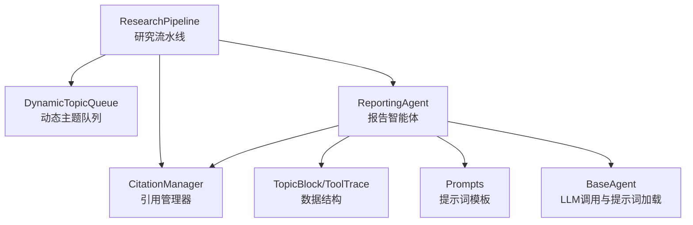
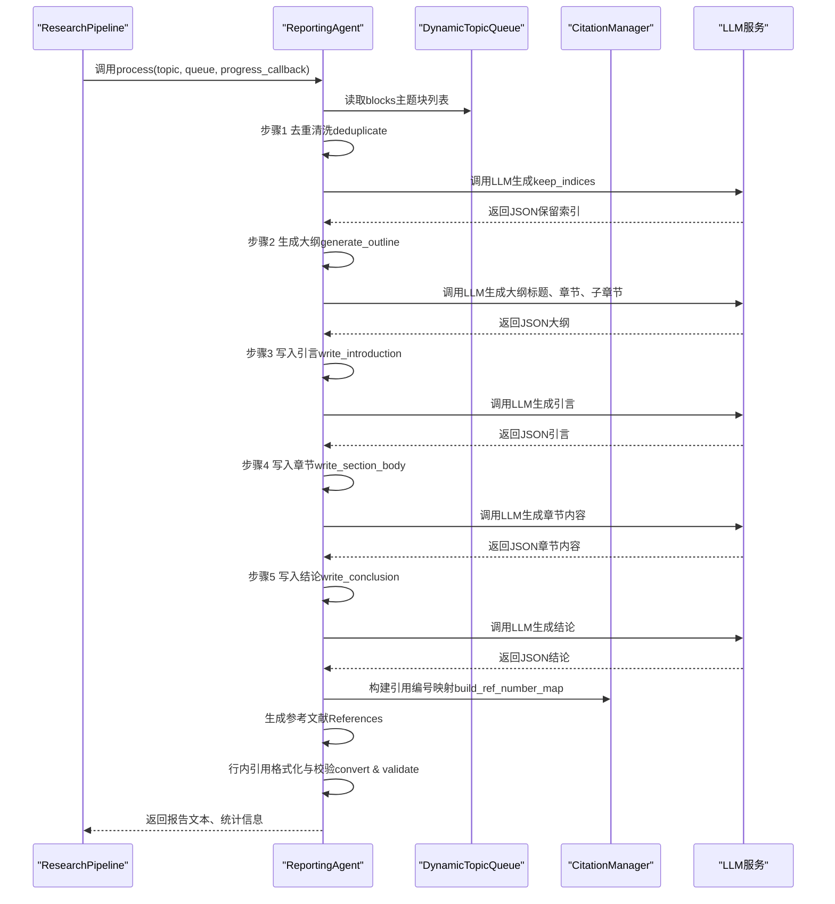
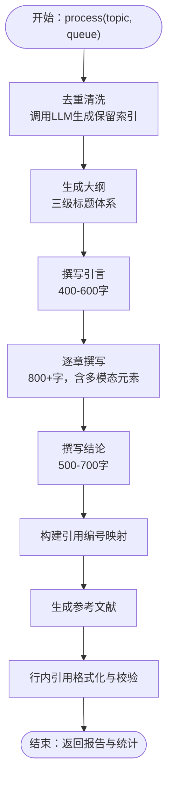
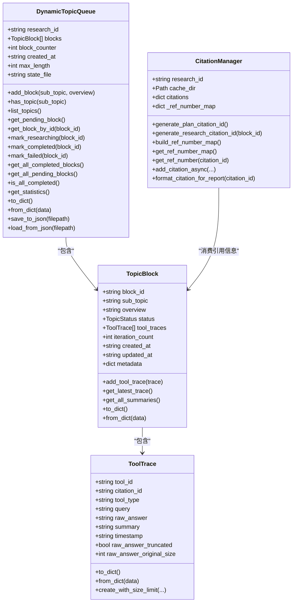
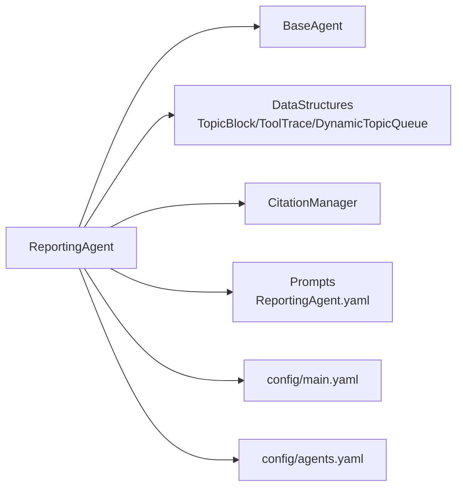

# 报告智能体

<cite>
**本文引用的文件**
- [src/agents/research/agents/reporting_agent.py](file://src/agents/research/agents/reporting_agent.py)
- [src/agents/research/research_pipeline.py](file://src/agents/research/research_pipeline.py)
- [src/agents/research/utils/citation_manager.py](file://src/agents/research/utils/citation_manager.py)
- [src/agents/research/data_structures.py](file://src/agents/research/data_structures.py)
- [src/agents/research/agents/base_agent.py](file://src/agents/research/agents/base_agent.py)
- [src/agents/research/prompts/cn/reporting_agent.yaml](file://src/agents/research/prompts/cn/reporting_agent.yaml)
- [src/agents/research/prompts/en/reporting_agent.yaml](file://src/agents/research/prompts/en/reporting_agent.yaml)
- [config/main.yaml](file://config/main.yaml)
- [config/agents.yaml](file://config/agents.yaml)
</cite>

## 目录
1. [简介](#简介)
2. [项目结构](#项目结构)
3. [核心组件](#核心组件)
4. [架构总览](#架构总览)
5. [详细组件分析](#详细组件分析)
6. [依赖关系分析](#依赖关系分析)
7. [性能考量](#性能考量)
8. [故障排查指南](#故障排查指南)
9. [结论](#结论)
10. [附录](#附录)

## 简介
本技术文档围绕“报告智能体（ReportingAgent）”展开，系统阐述其如何将分散的研究结果整合为结构化、高质量的学术级报告。报告智能体位于“研究流水线（ResearchPipeline）”的第三阶段，负责从动态主题队列中获取最终知识库，通过多阶段提示策略（去重清洗、大纲生成、内容填充、格式化与引用整合）构建完整报告；同时支持LaTeX公式渲染、行内引用与参考文献生成，确保报告的逻辑连贯性与学术严谨性。本文还提供报告生成流程的序列图、配置项说明与错误处理策略，为定制化报告生成提供技术指导。

## 项目结构
报告智能体属于“研究模块”，与提示词、数据结构、工具与流水线紧密协作：
- 研究流水线：协调规划、研究、报告三个阶段，向报告智能体提供动态主题队列与引用管理器。
- 数据结构：定义主题块、工具追踪与动态队列，承载研究过程中的知识与溯源信息。
- 引用管理：统一生成与维护引用ID、去重与编号映射，保证行内引用与参考文献一致性。
- 提示词：为报告智能体提供系统角色、流程提示（去重、大纲、引言、章节、结论）及引用说明。
- 基类：封装LLM调用、温度与最大token、提示词加载与缓存、进度回调等通用能力。

图表来源
- [src/agents/research/research_pipeline.py](file://src/agents/research/research_pipeline.py#L1-L120)
- [src/agents/research/agents/reporting_agent.py](file://src/agents/research/agents/reporting_agent.py#L1-L120)
- [src/agents/research/data_structures.py](file://src/agents/research/data_structures.py#L1-L120)
- [src/agents/research/utils/citation_manager.py](file://src/agents/research/utils/citation_manager.py#L1-L60)
- [src/agents/research/agents/base_agent.py](file://src/agents/research/agents/base_agent.py#L1-L120)

章节来源
- [src/agents/research/research_pipeline.py](file://src/agents/research/research_pipeline.py#L1-L120)
- [src/agents/research/agents/reporting_agent.py](file://src/agents/research/agents/reporting_agent.py#L1-L120)
- [src/agents/research/data_structures.py](file://src/agents/research/data_structures.py#L1-L120)
- [src/agents/research/utils/citation_manager.py](file://src/agents/research/utils/citation_manager.py#L1-L60)
- [src/agents/research/agents/base_agent.py](file://src/agents/research/agents/base_agent.py#L1-L120)

## 核心组件
- 报告智能体（ReportingAgent）
  - 负责：去重清洗、大纲生成、引言/章节/结论撰写、引用整合与参考文献生成、LaTeX兼容处理、行内引用格式化与校验。
  - 关键方法：process、_deduplicate_blocks、_generate_outline、_write_introduction、_write_section_body、_write_conclusion、_write_report、_generate_references、_convert_citation_format、_validate_and_fix_citations。
- 动态主题队列（DynamicTopicQueue）与主题块（TopicBlock）、工具追踪（ToolTrace）
  - 主题块记录子主题、概述、状态与工具追踪列表；工具追踪记录查询、原始答案、摘要、引用ID等，是报告引用锚点的基础。
- 引用管理器（CitationManager）
  - 统一生成引用ID、构建引用编号映射、去重、APA格式化、异步安全接口，确保报告引用与参考文献一致。
- 研究流水线（ResearchPipeline）
  - 初始化各Agent、管理队列、执行研究循环、调用报告智能体生成最终报告。
- 基类（BaseAgent）
  - 统一LLM调用、提示词加载、温度与token限制、进度回调。
- 提示词（Prompts）
  - 为报告智能体提供系统角色与流程提示，包括去重、大纲、引言、章节、结论、子章节、引用说明等。

章节来源
- [src/agents/research/agents/reporting_agent.py](file://src/agents/research/agents/reporting_agent.py#L1-L200)
- [src/agents/research/data_structures.py](file://src/agents/research/data_structures.py#L1-L220)
- [src/agents/research/utils/citation_manager.py](file://src/agents/research/utils/citation_manager.py#L1-L120)
- [src/agents/research/research_pipeline.py](file://src/agents/research/research_pipeline.py#L1-L120)
- [src/agents/research/agents/base_agent.py](file://src/agents/research/agents/base_agent.py#L1-L120)
- [src/agents/research/prompts/cn/reporting_agent.yaml](file://src/agents/research/prompts/cn/reporting_agent.yaml#L1-L120)
- [src/agents/research/prompts/en/reporting_agent.yaml](file://src/agents/research/prompts/en/reporting_agent.yaml#L1-L120)

## 架构总览
报告智能体在研究流水线的第三阶段被调用，接收来自动态主题队列的最终知识库，按多阶段提示策略生成报告，并通过引用管理器确保引用一致性与参考文献格式化。

图表来源
- [src/agents/research/research_pipeline.py](file://src/agents/research/research_pipeline.py#L375-L479)
- [src/agents/research/agents/reporting_agent.py](file://src/agents/research/agents/reporting_agent.py#L78-L200)
- [src/agents/research/utils/citation_manager.py](file://src/agents/research/utils/citation_manager.py#L639-L735)

章节来源
- [src/agents/research/research_pipeline.py](file://src/agents/research/research_pipeline.py#L375-L479)
- [src/agents/research/agents/reporting_agent.py](file://src/agents/research/agents/reporting_agent.py#L78-L200)
- [src/agents/research/utils/citation_manager.py](file://src/agents/research/utils/citation_manager.py#L639-L735)

## 详细组件分析

### 报告智能体（ReportingAgent）
- 多阶段提示策略
  - 去重清洗：基于主题列表与概览，调用LLM识别重复或高度相似话题，返回保留索引，减少冗余。
  - 大纲生成：综合子主题、概述与工具摘要，生成三级标题体系（主标题、章节、子章节），支持默认大纲回退。
  - 引言撰写：基于所有主题概览与指导，生成400-600字引言，强调背景、问题、范围与结构导引。
  - 章节撰写：针对单个主题块，结合工具追踪与引用说明，生成800字以上章节内容，支持LaTeX公式、表格、流程图、代码块等多模态元素。
  - 结论撰写：基于各主题关键发现，生成500-700字结论，涵盖研究回顾、贡献、局限与展望。
- LaTeX与多模态支持
  - 提示词模板明确支持LaTeX公式、Mermaid流程图、表格与代码块，报告智能体在撰写过程中直接采用这些元素，确保表达力与严谨性。
  - 在提示词中，行内引用与参考文献部分由引用说明模板控制，避免与LaTeX大括号冲突，通过安全格式化与模板转换保障渲染正确。
- 引用整合与参考文献
  - 引用管理：通过引用管理器构建引用ID到参考编号的一致映射，支持论文搜索、RAG检索、网络搜索、代码执行等多来源去重与编号。
  - 行内引用：将简单引用格式（如[N]）转换为可点击的[[N]](#ref-N)格式，并进行有效性校验，移除无效引用。
  - 参考文献：按APA风格（论文）与工具类型（RAG/网页/代码）生成参考文献条目，支持折叠显示来源摘要。
- 进度回调与统计
  - 报告智能体在各阶段通过进度回调通知外部系统，包含“去重完成”、“大纲完成”、“写作中”、“报告完成”等事件，便于前端或日志系统跟踪。
  - 返回结果包含字数、章节数量、引用数量等统计信息，便于质量评估与成本统计。

图表来源
- [src/agents/research/agents/reporting_agent.py](file://src/agents/research/agents/reporting_agent.py#L78-L200)
- [src/agents/research/agents/reporting_agent.py](file://src/agents/research/agents/reporting_agent.py#L1080-L1321)
- [src/agents/research/utils/citation_manager.py](file://src/agents/research/utils/citation_manager.py#L639-L735)

章节来源
- [src/agents/research/agents/reporting_agent.py](file://src/agents/research/agents/reporting_agent.py#L78-L200)
- [src/agents/research/agents/reporting_agent.py](file://src/agents/research/agents/reporting_agent.py#L1080-L1321)
- [src/agents/research/utils/citation_manager.py](file://src/agents/research/utils/citation_manager.py#L639-L735)

### 数据结构与引用管理
- 主题块（TopicBlock）与工具追踪（ToolTrace）
  - 主题块包含子主题、概述、状态、工具追踪列表等；工具追踪记录查询、原始答案、摘要、引用ID等，是报告引用锚点与溯源的基础。
  - 工具追踪支持大小限制与截断，避免过大响应影响LLM输入长度。
- 引用管理器（CitationManager）
  - 统一生成引用ID（规划阶段PLAN-XX、研究阶段CIT-X-XX），构建引用编号映射，支持论文搜索的去重（同论文仅一次编号）。
  - 提供APA格式化、异步安全接口、验证与修复引用、保存/恢复引用状态等能力。

图表来源
- [src/agents/research/data_structures.py](file://src/agents/research/data_structures.py#L1-L220)
- [src/agents/research/utils/citation_manager.py](file://src/agents/research/utils/citation_manager.py#L1-L120)

章节来源
- [src/agents/research/data_structures.py](file://src/agents/research/data_structures.py#L1-L220)
- [src/agents/research/utils/citation_manager.py](file://src/agents/research/utils/citation_manager.py#L1-L120)

### 研究流水线与报告生成
- 研究流水线在第三阶段调用报告智能体，传入动态主题队列与进度回调；报告完成后保存报告、队列与元数据，并输出统计信息。
- 报告智能体内部通过LLM调用与提示词模板驱动各阶段任务，确保输出符合JSON格式与Markdown结构。

章节来源
- [src/agents/research/research_pipeline.py](file://src/agents/research/research_pipeline.py#L375-L479)
- [src/agents/research/agents/base_agent.py](file://src/agents/research/agents/base_agent.py#L170-L260)

## 依赖关系分析
- 报告智能体依赖
  - BaseAgent：统一LLM调用、提示词加载与缓存、温度与token限制。
  - 动态主题队列与数据结构：提供最终知识库与溯源信息。
  - 引用管理器：统一引用ID与编号映射，APA格式化与异步安全接口。
  - 提示词：系统角色与流程提示，确保输出结构化与学术规范。
- 配置依赖
  - config/main.yaml：报告深度、引用开关、最小章节字数、RAG知识库名称等。
  - config/agents.yaml：研究模块温度与最大token，决定LLM行为与输入长度上限。

图表来源
- [src/agents/research/agents/reporting_agent.py](file://src/agents/research/agents/reporting_agent.py#L1-L120)
- [src/agents/research/agents/base_agent.py](file://src/agents/research/agents/base_agent.py#L1-L120)
- [src/agents/research/data_structures.py](file://src/agents/research/data_structures.py#L1-L120)
- [src/agents/research/utils/citation_manager.py](file://src/agents/research/utils/citation_manager.py#L1-L60)
- [src/agents/research/prompts/cn/reporting_agent.yaml](file://src/agents/research/prompts/cn/reporting_agent.yaml#L1-L120)
- [config/main.yaml](file://config/main.yaml#L65-L97)
- [config/agents.yaml](file://config/agents.yaml#L16-L21)

章节来源
- [src/agents/research/agents/reporting_agent.py](file://src/agents/research/agents/reporting_agent.py#L1-L120)
- [src/agents/research/agents/base_agent.py](file://src/agents/research/agents/base_agent.py#L1-L120)
- [src/agents/research/data_structures.py](file://src/agents/research/data_structures.py#L1-L120)
- [src/agents/research/utils/citation_manager.py](file://src/agents/research/utils/citation_manager.py#L1-L60)
- [src/agents/research/prompts/cn/reporting_agent.yaml](file://src/agents/research/prompts/cn/reporting_agent.yaml#L1-L120)
- [config/main.yaml](file://config/main.yaml#L65-L97)
- [config/agents.yaml](file://config/agents.yaml#L16-L21)

## 性能考量
- 输入长度控制
  - ToolTrace对原始答案进行大小限制与截断，避免超长响应导致LLM输入超限。
  - BaseAgent统一设置最大token，研究模块默认较大token上限以支持长文本生成。
- 并发与稳定性
  - 引用管理器提供异步安全接口，支持并行模式下的引用ID生成与引用添加。
  - 研究流水线支持并行执行模式，报告阶段仍可保持稳定顺序输出。
- 成本与统计
  - BaseAgent记录LLM调用耗时与token使用，研究流水线保存token成本统计，便于成本控制与优化。

章节来源
- [src/agents/research/data_structures.py](file://src/agents/research/data_structures.py#L60-L120)
- [src/agents/research/agents/base_agent.py](file://src/agents/research/agents/base_agent.py#L170-L260)
- [src/agents/research/utils/citation_manager.py](file://src/agents/research/utils/citation_manager.py#L737-L799)
- [src/agents/research/research_pipeline.py](file://src/agents/research/research_pipeline.py#L450-L470)

## 故障排查指南
- 提示词缺失
  - 报告智能体在缺少系统角色或流程提示时会抛出异常，需检查提示词文件是否存在且字段完整。
- LLM输出解析失败
  - 报告智能体期望LLM输出严格JSON对象，若解析失败会抛出异常；检查提示词是否要求严格JSON输出、是否包含额外文本或代码块标记。
- 引用ID冲突或编号不一致
  - 引用管理器负责统一ID生成与编号映射；若出现冲突，检查引用ID生成逻辑与去重键（论文标题+首作者）是否合理。
- 行内引用格式错误
  - 报告智能体会将[N]转换为[[N]](#ref-N)，并对无效引用进行移除；若出现格式异常，检查提示词中的引用说明模板与引用表生成逻辑。
- 进度回调异常
  - 报告智能体通过进度回调通知外部系统；若回调异常，不影响主流程，但会导致前端无法实时更新进度。

章节来源
- [src/agents/research/agents/reporting_agent.py](file://src/agents/research/agents/reporting_agent.py#L162-L188)
- [src/agents/research/agents/reporting_agent.py](file://src/agents/research/agents/reporting_agent.py#L364-L417)
- [src/agents/research/agents/reporting_agent.py](file://src/agents/research/agents/reporting_agent.py#L418-L479)
- [src/agents/research/agents/reporting_agent.py](file://src/agents/research/agents/reporting_agent.py#L481-L538)
- [src/agents/research/utils/citation_manager.py](file://src/agents/research/utils/citation_manager.py#L573-L735)

## 结论
报告智能体通过严格的多阶段提示策略、完善的引用管理与LaTeX兼容处理，将分散的研究结果整合为结构化、逻辑连贯且学术严谨的高质量报告。其与研究流水线、数据结构、引用管理器与提示词协同工作，既保证生成质量，又兼顾性能与可扩展性。通过合理的配置与错误处理策略，用户可轻松定制报告深度、格式要求与引用策略，满足不同场景需求。

## 附录

### 配置选项说明（与报告生成相关）
- 报告深度与格式
  - reporting.min_section_length：章节最小字数，默认800（可在配置中调整）。
  - reporting.enable_citation_list：是否生成参考文献列表，默认开启。
  - reporting.enable_inline_citations：是否启用行内引用，默认关闭（可切换）。
- LLM参数
  - agents.research.temperature：研究模块温度，默认0.5。
  - agents.research.max_tokens：研究模块最大token，默认12000。
- 其他
  - rag.kb_name：RAG知识库名称，默认“DE-all”。

章节来源
- [config/main.yaml](file://config/main.yaml#L65-L97)
- [config/agents.yaml](file://config/agents.yaml#L16-L21)

### 提示词要点（与报告生成相关）
- 系统角色：强调深度、论证、结构化呈现与学术严谨性，要求严格JSON输出。
- 流程提示：去重、大纲、引言、章节、结论、子章节、引用说明等。
- 多模态支持：LaTeX公式、Mermaid流程图、表格、代码块等。

章节来源
- [src/agents/research/prompts/cn/reporting_agent.yaml](file://src/agents/research/prompts/cn/reporting_agent.yaml#L1-L120)
- [src/agents/research/prompts/en/reporting_agent.yaml](file://src/agents/research/prompts/en/reporting_agent.yaml#L1-L120)