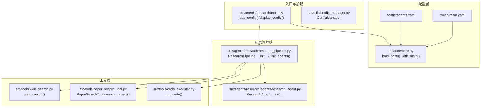
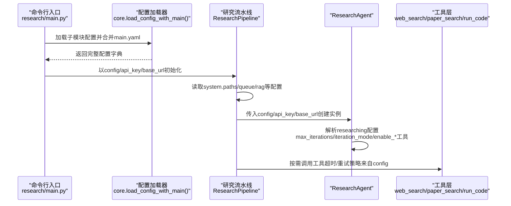
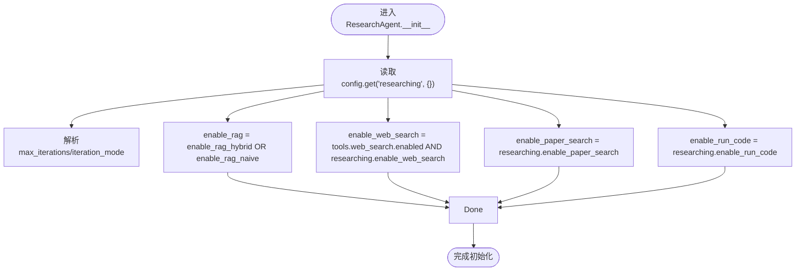
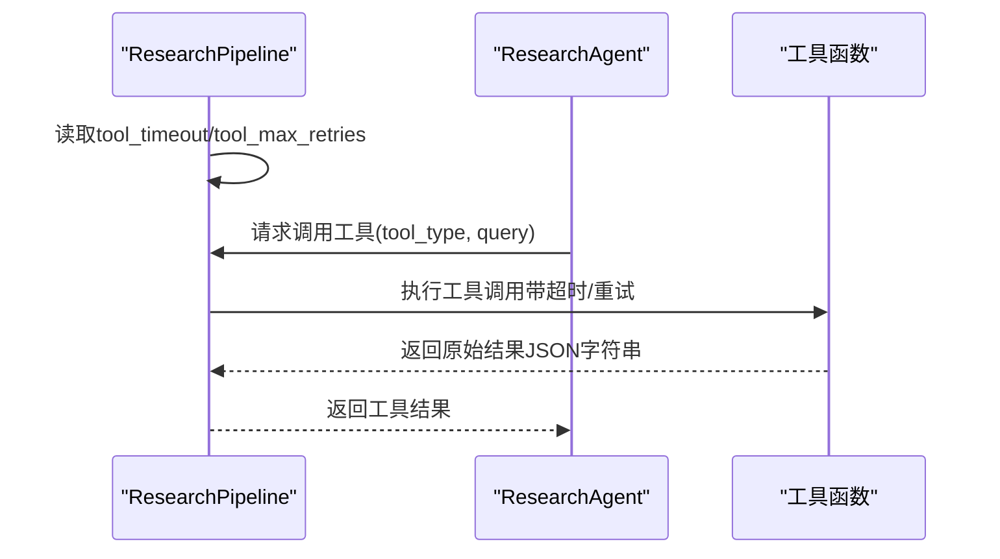
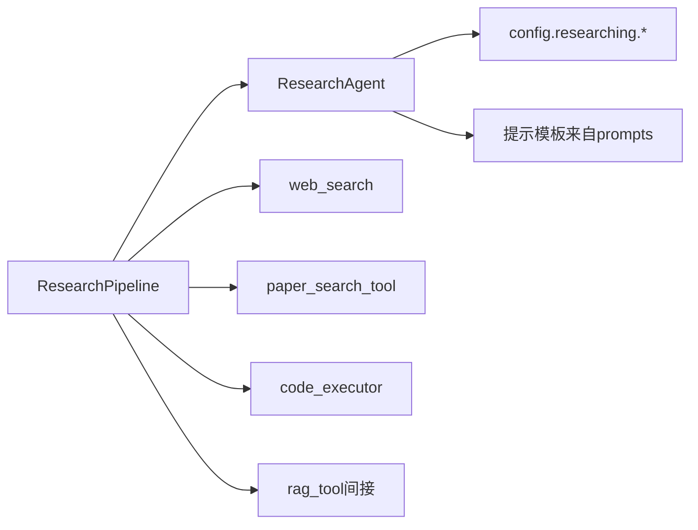

# 初始化配置

<cite>
**本文引用的文件**
- [config/main.yaml](file://config/main.yaml)
- [config/agents.yaml](file://config/agents.yaml)
- [src/agents/research/main.py](file://src/agents/research/main.py)
- [src/agents/research/research_pipeline.py](file://src/agents/research/research_pipeline.py)
- [src/agents/research/agents/research_agent.py](file://src/agents/research/agents/research_agent.py)
- [src/core/core.py](file://src/core/core.py)
- [src/utils/config_manager.py](file://src/utils/config_manager.py)
- [src/tools/web_search.py](file://src/tools/web_search.py)
- [src/tools/paper_search_tool.py](file://src/tools/paper_search_tool.py)
- [src/tools/code_executor.py](file://src/tools/code_executor.py)
</cite>

## 目录
1. [引言](#引言)
2. [项目结构](#项目结构)
3. [核心组件](#核心组件)
4. [架构总览](#架构总览)
5. [详细组件分析](#详细组件分析)
6. [依赖分析](#依赖分析)
7. [性能考虑](#性能考虑)
8. [故障排查指南](#故障排查指南)
9. [结论](#结论)
10. [附录](#附录)

## 引言
本节聚焦于ResearchAgent的初始化流程，系统性解析其从配置字典中提取“researching”配置模块的方式，重点覆盖以下核心参数：
- max_iterations（最大迭代次数）
- iteration_mode（迭代模式：fixed/flexible）
- enable_rag（RAG检索开关）
- enable_web_search（网络搜索开关）
- enable_paper_search（论文搜索开关）
- enable_run_code（代码执行开关）

同时阐明全局工具开关与模块级开关的优先级关系（尤其是web_search的双重启用机制），并给出实际配置示例与常见配置错误的排查方法，帮助读者在不同场景下正确配置与调优。

## 项目结构
ResearchAgent位于研究模块中，其初始化流程贯穿配置加载、管道构建与代理实例化三个阶段。关键路径如下：
- 配置加载：通过统一的配置合并机制读取主配置与子模块配置
- 管道构建：ResearchPipeline根据配置初始化各代理与工具
- 代理初始化：ResearchAgent从配置中读取并计算最终可用工具集与行为策略

图表来源
- [config/main.yaml](file://config/main.yaml#L64-L90)
- [config/agents.yaml](file://config/agents.yaml#L16-L21)
- [src/core/core.py](file://src/core/core.py#L220-L262)
- [src/agents/research/main.py](file://src/agents/research/main.py#L22-L55)
- [src/agents/research/research_pipeline.py](file://src/agents/research/research_pipeline.py#L65-L179)
- [src/agents/research/agents/research_agent.py](file://src/agents/research/agents/research_agent.py#L23-L51)
- [src/tools/web_search.py](file://src/tools/web_search.py#L19-L155)
- [src/tools/paper_search_tool.py](file://src/tools/paper_search_tool.py#L21-L109)
- [src/tools/code_executor.py](file://src/tools/code_executor.py#L30-L83)

章节来源
- [config/main.yaml](file://config/main.yaml#L64-L90)
- [src/agents/research/main.py](file://src/agents/research/main.py#L22-L55)
- [src/agents/research/research_pipeline.py](file://src/agents/research/research_pipeline.py#L65-L179)
- [src/agents/research/agents/research_agent.py](file://src/agents/research/agents/research_agent.py#L23-L51)

## 核心组件
本节从配置加载到代理初始化，逐层剖析ResearchAgent的初始化流程与关键参数加载逻辑。

- 配置加载与合并
  - 统一加载入口：通过“子模块配置文件 + main.yaml”的深度合并策略，确保模块配置覆盖主配置中的同名键值。
  - 入口函数：ResearchPipeline在初始化时接收完整配置字典；入口脚本在命令行模式下可直接加载子模块配置并与main.yaml合并。
  - 关键点：合并顺序为“以主配置为基底，子模块配置覆盖”，保证模块特定设置优先级高于通用设置。

- 研究流水线初始化
  - ResearchPipeline在构造函数中读取“system.paths”、“queue”、“rag”等配置，用于目录创建、队列长度与知识库名称等。
  - 代理初始化：在_init_agents中创建ResearchAgent实例，并传入完整的配置字典、API密钥与基础URL。

- ResearchAgent初始化
  - 从config字典中读取“researching”模块配置，解析max_iterations与iteration_mode。
  - 计算工具可用性：enable_rag、enable_web_search、enable_paper_search、enable_run_code。
  - 工具可用性计算规则：
    - enable_rag：当enable_rag_hybrid或enable_rag_naive任一为真时即启用。
    - enable_web_search：需同时满足“tools.web_search.enabled为真”且“researching.enable_web_search为真”。
    - enable_paper_search：直接取自researching.enable_paper_search。
    - enable_run_code：直接取自researching.enable_run_code。
  - enabled_tools：保留模块配置中的enabled_tools列表，用于提示生成。

- 运行期工具调用
  - ResearchPipeline在_call_tool中根据配置读取tool_timeout与tool_max_retries，并按tool_type路由到对应工具（RAG、web_search、paper_search、run_code）。
  - RAG工具支持hybrid/naive两种模式，若默认失败则回退到fallback_mode。

章节来源
- [src/core/core.py](file://src/core/core.py#L220-L262)
- [src/agents/research/main.py](file://src/agents/research/main.py#L22-L55)
- [src/agents/research/research_pipeline.py](file://src/agents/research/research_pipeline.py#L65-L179)
- [src/agents/research/research_pipeline.py](file://src/agents/research/research_pipeline.py#L263-L374)
- [src/agents/research/agents/research_agent.py](file://src/agents/research/agents/research_agent.py#L23-L51)

## 架构总览
下面的序列图展示了从入口到代理初始化的关键调用链，以及配置如何在各组件间传递。

图表来源
- [src/agents/research/main.py](file://src/agents/research/main.py#L22-L55)
- [src/core/core.py](file://src/core/core.py#L220-L262)
- [src/agents/research/research_pipeline.py](file://src/agents/research/research_pipeline.py#L65-L179)
- [src/agents/research/agents/research_agent.py](file://src/agents/research/agents/research_agent.py#L23-L51)

## 详细组件分析

### ResearchAgent初始化与配置解析
- 参数来源与默认值
  - max_iterations：来自config.get("researching", {}).get("max_iterations", 5)
  - iteration_mode：来自config.get("researching", {}).get("iteration_mode", "fixed")
  - enable_rag：来自enable_rag_hybrid或enable_rag_naive任一为真
  - enable_web_search：仅当tools.web_search.enabled为真且researching.enable_web_search为真时才启用
  - enable_paper_search：来自researching.enable_paper_search
  - enable_run_code：来自researching.enable_run_code
  - enabled_tools：来自researching.enabled_tools（默认["RAG"]）

- 行为策略影响
  - max_iterations决定单个主题块的研究轮次上限，影响迭代循环次数与进度统计。
  - iteration_mode控制“充足性判断”的保守程度：fixed模式更保守，flexible模式允许更早结束。
  - 工具可用性直接影响提示工程与查询计划生成，例如在不同阶段建议使用不同工具组合。

- 双重启用机制（web_search）
  - 全局工具开关：tools.web_search.enabled（来自main.yaml tools.web_search）
  - 模块级开关：researching.enable_web_search（来自researching配置）
  - 实际启用条件：两者同时为真才会在ResearchAgent中启用web_search。该设计确保即使模块配置允许使用网络搜索，若全局关闭也会被屏蔽。

- 优先级关系总结
  - 工具启用优先级：全局工具开关（tools.*.enabled）> 模块级开关（researching.*）
  - RAG启用：enable_rag_hybrid或enable_rag_naive任一为真即可启用RAG
  - 其他工具：paper_search与run_code直接由模块级开关控制

图表来源
- [src/agents/research/agents/research_agent.py](file://src/agents/research/agents/research_agent.py#L23-L51)

章节来源
- [src/agents/research/agents/research_agent.py](file://src/agents/research/agents/research_agent.py#L23-L51)

### 研究流水线中的工具调用与超时/重试
- 超时与重试参数
  - 来源：config.get("researching", {})中的tool_timeout与tool_max_retries
  - 默认值：tool_timeout=60，tool_max_retries=2
- 工具类型与路由
  - rag_hybrid/rag_naive/rag：根据config.rag.default_mode与fallback_mode进行调用与回退
  - web_search：调用web_search()，返回结果包含答案与引用信息
  - paper_search：调用PaperSearchTool.search_papers()，支持年份限制
  - run_code：调用run_code()，内部有工作区与导入白名单校验
- 调用封装
  - _call_tool_with_retry：统一处理超时与重试，记录日志并抛出最后一次异常
  - _call_tool_with_timeout：对单次调用设置超时

图表来源
- [src/agents/research/research_pipeline.py](file://src/agents/research/research_pipeline.py#L263-L374)
- [src/tools/web_search.py](file://src/tools/web_search.py#L19-L155)
- [src/tools/paper_search_tool.py](file://src/tools/paper_search_tool.py#L21-L109)
- [src/tools/code_executor.py](file://src/tools/code_executor.py#L320-L429)

章节来源
- [src/agents/research/research_pipeline.py](file://src/agents/research/research_pipeline.py#L263-L374)
- [src/tools/web_search.py](file://src/tools/web_search.py#L19-L155)
- [src/tools/paper_search_tool.py](file://src/tools/paper_search_tool.py#L21-L109)
- [src/tools/code_executor.py](file://src/tools/code_executor.py#L320-L429)

### 配置示例与最佳实践
- 基础配置要点
  - 在config/main.yaml中设置tools.web_search.enabled、tools.run_code、tools.query_item等全局工具开关
  - 在config/main.yaml的researching段落设置max_iterations、iteration_mode、enable_*工具、tool_timeout、tool_max_retries等
  - 若需要快速模式，可在preset中覆盖researching的max_iterations与iteration_mode
- 示例片段路径
  - 全局工具开关与研究配置参考：[config/main.yaml](file://config/main.yaml#L16-L30), [config/main.yaml](file://config/main.yaml#L64-L90)
  - 预设模式覆盖：[config/main.yaml](file://config/main.yaml#L98-L142)
  - 子模块配置合并：[src/core/core.py](file://src/core/core.py#L220-L262)
  - 入口加载与显示：[src/agents/research/main.py](file://src/agents/research/main.py#L22-L55), [src/agents/research/main.py](file://src/agents/research/main.py#L57-L84)

章节来源
- [config/main.yaml](file://config/main.yaml#L16-L30)
- [config/main.yaml](file://config/main.yaml#L64-L90)
- [config/main.yaml](file://config/main.yaml#L98-L142)
- [src/core/core.py](file://src/core/core.py#L220-L262)
- [src/agents/research/main.py](file://src/agents/research/main.py#L22-L55)

## 依赖分析
- 组件耦合
  - ResearchAgent依赖config字典中的“researching”模块配置，耦合度低，便于测试与替换
  - ResearchPipeline作为编排者，依赖多个工具与代理，但通过回调接口解耦具体实现
- 外部依赖
  - 网络搜索依赖perplexity客户端与API密钥
  - 论文搜索依赖arxiv客户端
  - 代码执行依赖隔离工作区与导入白名单校验
- 循环依赖
  - 未发现直接循环依赖；工具层与代理层通过函数调用与回调解耦

图表来源
- [src/agents/research/agents/research_agent.py](file://src/agents/research/agents/research_agent.py#L23-L51)
- [src/agents/research/research_pipeline.py](file://src/agents/research/research_pipeline.py#L65-L179)
- [src/tools/web_search.py](file://src/tools/web_search.py#L19-L155)
- [src/tools/paper_search_tool.py](file://src/tools/paper_search_tool.py#L21-L109)
- [src/tools/code_executor.py](file://src/tools/code_executor.py#L320-L429)

章节来源
- [src/agents/research/agents/research_agent.py](file://src/agents/research/agents/research_agent.py#L23-L51)
- [src/agents/research/research_pipeline.py](file://src/agents/research/research_pipeline.py#L65-L179)

## 性能考虑
- 工具超时与重试
  - 合理设置tool_timeout与tool_max_retries，避免长时间阻塞导致整体研究耗时增加
  - 对网络搜索与论文搜索这类外部服务，适当降低tool_timeout并启用重试
- RAG回退策略
  - 当默认模式失败时自动回退到fallback_mode，减少失败重试成本
- 并行执行
  - execution_mode可选择并行或串行，合理设置max_parallel_topics与queue.max_length，避免资源争用

## 故障排查指南
- 常见问题与定位
  - 网络搜索不可用：检查tools.web_search.enabled是否为true，且PERPLEXITY_API_KEY环境变量已配置
    - 参考：[src/tools/web_search.py](file://src/tools/web_search.py#L19-L52)
  - 论文搜索不可用：确认arxiv库安装与网络连通性
    - 参考：[src/tools/paper_search_tool.py](file://src/tools/paper_search_tool.py#L18-L27)
  - 代码执行失败：检查RUN_CODE_WORKSPACE与RUN_CODE_ALLOWED_ROOTS环境变量，确认工作区权限与导入白名单
    - 参考：[src/tools/code_executor.py](file://src/tools/code_executor.py#L120-L178), [src/tools/code_executor.py](file://src/tools/code_executor.py#L320-L429)
  - 配置未生效：确认子模块配置与main.yaml合并后是否覆盖了预期键值
    - 参考：[src/core/core.py](file://src/core/core.py#L220-L262)
- 错误处理与日志
  - ResearchPipeline对工具调用统一捕获异常并记录，便于定位失败原因
    - 参考：[src/agents/research/research_pipeline.py](file://src/agents/research/research_pipeline.py#L203-L262)

章节来源
- [src/tools/web_search.py](file://src/tools/web_search.py#L19-L52)
- [src/tools/paper_search_tool.py](file://src/tools/paper_search_tool.py#L18-L27)
- [src/tools/code_executor.py](file://src/tools/code_executor.py#L120-L178)
- [src/core/core.py](file://src/core/core.py#L220-L262)
- [src/agents/research/research_pipeline.py](file://src/agents/research/research_pipeline.py#L203-L262)

## 结论
ResearchAgent的初始化流程清晰地体现了“模块配置 + 主配置合并”的设计思想。通过在ResearchAgent中对工具启用进行双重校验（全局工具开关与模块级开关），系统实现了灵活而安全的工具启用策略。结合合理的max_iterations与iteration_mode设置，研究智能体能够在不同场景下平衡深度与效率。配合统一的超时与重试机制，整体研究流程具备良好的鲁棒性与可观测性。

## 附录
- 关键配置键位速查
  - researching.max_iterations：最大迭代次数
  - researching.iteration_mode：迭代模式（fixed/flexible）
  - researching.enable_rag_hybrid / enable_rag_naive：RAG检索开关
  - researching.enable_web_search：网络搜索开关
  - researching.enable_paper_search：论文搜索开关
  - researching.enable_run_code：代码执行开关
  - tools.web_search.enabled：全局网络搜索开关
  - researching.tool_timeout / researching.tool_max_retries：工具调用超时与重试
- 相关文件路径
  - [config/main.yaml](file://config/main.yaml#L64-L90)
  - [src/agents/research/agents/research_agent.py](file://src/agents/research/agents/research_agent.py#L23-L51)
  - [src/agents/research/research_pipeline.py](file://src/agents/research/research_pipeline.py#L263-L374)
  - [src/core/core.py](file://src/core/core.py#L220-L262)