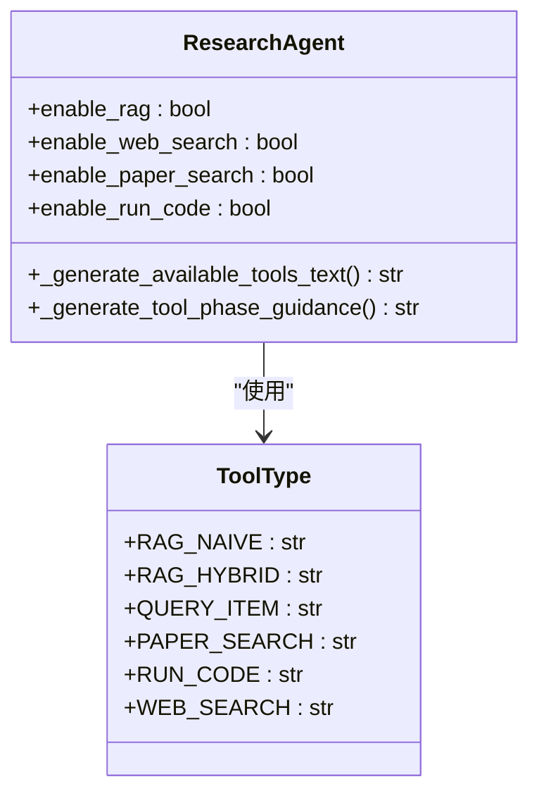
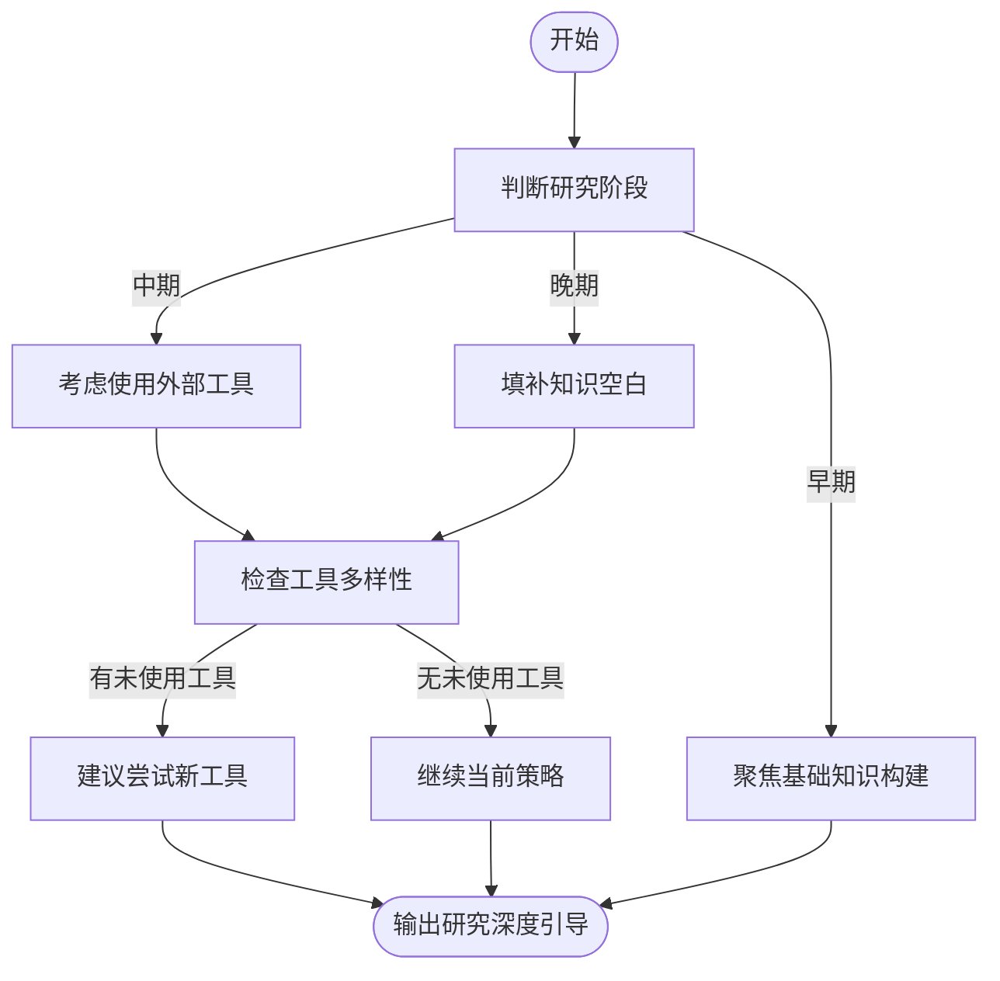
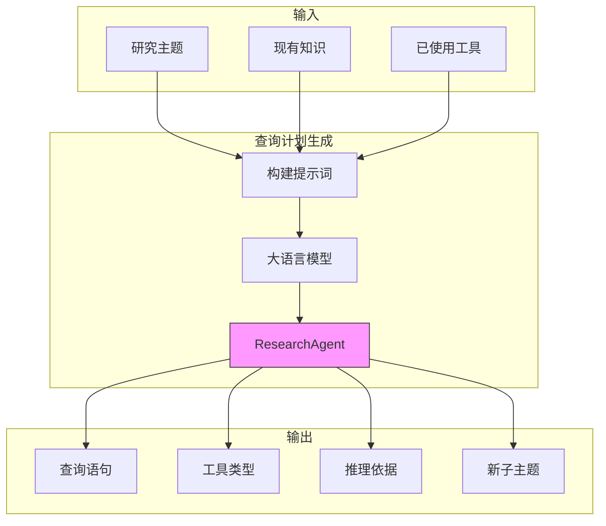

# 查询计划生成

<cite>
**本文档引用的文件**   
- [research_agent.py](file://src/agents/research/agents/research_agent.py)
- [research_agent.yaml](file://src/agents/research/prompts/cn/research_agent.yaml)
- [data_structures.py](file://src/agents/research/data_structures.py)
- [manager_agent.py](file://src/agents/research/agents/manager_agent.py)
- [main.yaml](file://config/main.yaml)
</cite>

## 目录
1. [引言](#引言)
2. [核心功能分析](#核心功能分析)
3. [可用工具与阶段指导](#可用工具与阶段指导)
4. [研究深度引导机制](#研究深度引导机制)
5. [动态主题拆分机制](#动态主题拆分机制)
6. [系统架构与数据流](#系统架构与数据流)
7. [配置与参数管理](#配置与参数管理)

## 引言
查询计划生成功能是DeepTutor研究系统中的核心组件，负责规划下一轮研究的具体行动。该功能通过分析当前知识状态、已探索主题和已使用工具，生成最优的查询策略。系统会综合考虑多种因素，包括研究阶段、工具可用性、知识覆盖度等，以确保研究过程的系统性和深度。

## 核心功能分析

`generate_query_plan` 方法是查询计划生成的核心实现，负责制定下一轮研究的具体行动方案。该方法接收当前研究主题、概览、现有知识、迭代次数等参数，通过调用大语言模型（LLM）生成包含查询语句、工具类型和推理依据的完整计划。

该方法首先从配置中获取系统提示和用户提示模板，然后构建包含多种上下文信息的提示词。关键的上下文信息包括：可用工具列表、工具使用阶段指导、研究深度引导等。这些信息共同构成了LLM决策的基础，确保生成的查询计划既符合系统约束，又能有效推进研究进程。

在生成最终提示后，系统调用LLM进行推理，并对返回结果进行严格的JSON格式验证，确保输出包含必需的`query`、`tool_type`和`rationale`字段。这种结构化的输出设计使得后续处理更加可靠和可预测。

**Section sources**
- [research_agent.py](file://src/agents/research/agents/research_agent.py#L366-L424)

## 可用工具与阶段指导

### 可用工具列表生成
`_generate_available_tools_text` 方法负责生成当前可用的工具列表。该方法根据系统配置动态构建工具清单，确保LLM只能选择实际启用的工具。工具列表以清晰的格式呈现，包含工具名称、功能描述和查询格式要求。

**Diagram sources **
- [research_agent.py](file://src/agents/research/agents/research_agent.py#L68-L103)
- [data_structures.py](file://src/agents/research/data_structures.py#L24-L32)

### 工具阶段指导
`_generate_tool_phase_guidance` 方法实现了基于研究阶段的工具使用指导。该方法根据启用的工具类型，动态生成分阶段的使用建议，引导LLM在不同研究阶段采用合适的工具组合。

指导分为三个阶段：
- **第一阶段（基础探索）**：主要使用知识库工具（RAG）构建基础知识
- **第二阶段（深度挖掘）**：引入外部工具进行知识扩展
- **第三阶段（完善补充）**：综合使用所有可用工具填补知识空白

这种分阶段的指导策略确保了研究过程的系统性和渐进性，避免了工具使用的随意性。

**Section sources**
- [research_agent.py](file://src/agents/research/agents/research_agent.py#L106-L181)

## 研究深度引导机制

`_generate_research_depth_guidance` 方法负责生成研究深度引导信息，帮助LLM判断当前研究状态并制定相应策略。该方法综合考虑多个因素，包括当前迭代次数、已使用工具、研究模式等。

引导信息包含以下关键要素：
- **研究阶段判断**：根据最大迭代次数将研究过程划分为早期、中期和晚期阶段
- **工具多样性建议**：分析已使用工具，建议尝试未使用的工具类型
- **迭代模式指导**：根据"固定"或"灵活"模式提供不同的决策标准

**Diagram sources **
- [research_agent.py](file://src/agents/research/agents/research_agent.py#L184-L257)

## 动态主题拆分机制

查询计划生成不仅负责单个主题的研究规划，还具备发现和添加新子主题的能力。当LLM在生成查询计划时识别到重要且相关的分支主题，系统会自动将其添加到研究队列中。

该机制通过以下步骤实现：
1. LLM在生成查询计划时，可选择性地输出`new_sub_topic`、`new_overview`等字段
2. 系统检查新主题是否已存在，避免重复添加
3. 根据配置的最小分数阈值（`new_topic_min_score`）过滤低质量建议
4. 通过`ManagerAgent`将新主题添加到队列末尾

这种动态拆分机制使得研究过程具有自适应性，能够根据研究进展不断扩展和深化主题覆盖范围。

**Section sources**
- [research_agent.py](file://src/agents/research/agents/research_agent.py#L533-L571)
- [manager_agent.py](file://src/agents/research/agents/manager_agent.py#L150-L175)

## 系统架构与数据流

查询计划生成功能是整个研究管道的关键环节，与其他组件紧密协作。系统采用模块化设计，各组件职责分明，通过清晰的接口进行交互。

**Diagram sources **
- [research_agent.py](file://src/agents/research/agents/research_agent.py#L366-L424)
- [research_pipeline.py](file://src/agents/research/research_pipeline.py#L758-L767)

## 配置与参数管理

系统的查询计划生成行为受到多个配置参数的控制，这些参数定义在`main.yaml`配置文件中。关键配置包括：

| 配置项 | 默认值 | 说明 |
|-------|-------|------|
| `max_iterations` | 5 | 最大迭代次数 |
| `new_topic_min_score` | 0.85 | 新主题添加的最小分数阈值 |
| `enable_rag_hybrid` | true | 是否启用混合RAG检索 |
| `enable_web_search` | true | 是否启用网络搜索 |
| `enable_paper_search` | true | 是否启用论文搜索 |
| `enable_run_code` | true | 是否启用代码执行 |

这些配置使得系统具有高度的可定制性，可以根据不同研究需求调整行为策略。

**Section sources**
- [main.yaml](file://config/main.yaml#L75-L83)
- [research_agent.py](file://src/agents/research/agents/research_agent.py#L30-L50)