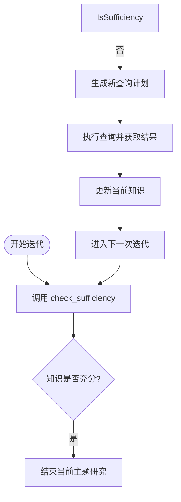

# 知识充分性检查

<cite>
**本文档引用的文件**  
- [research_agent.py](file://src/agents/research/agents/research_agent.py)
- [research_agent.yaml](file://src/agents/research/prompts/cn/research_agent.yaml)
- [json_utils.py](file://src/agents/research/utils/json_utils.py)
- [data_structures.py](file://src/agents/research/data_structures.py)
- [main.py](file://src/agents/research/main.py)
</cite>

## 目录
1. [简介](#简介)
2. [核心功能机制](#核心功能机制)
3. [输入参数解析](#输入参数解析)
4. [复合提示词生成机制](#复合提示词生成机制)
5. [返回结构与研究循环控制](#返回结构与研究循环控制)
6. [调试策略](#调试策略)
7. [典型输出示例](#典型输出示例)
8. [配置与执行模式](#配置与执行模式)

## 简介

知识充分性检查（check_sufficiency）是DeepTutor系统中研究代理（ResearchAgent）的核心决策功能，用于判断当前对特定主题的研究是否足够深入，从而决定是否继续迭代研究。该功能通过综合分析研究主题、概述、已积累知识和当前迭代进度，结合外部工具使用情况和系统配置，动态生成评估提示词，并由大语言模型（LLM）做出是否充分的判断。此机制确保了研究过程的深度和完整性，避免了过早终止或无效的重复探索。

**Section sources**
- [research_agent.py](file://src/agents/research/agents/research_agent.py#L310-L364)
- [research_agent.yaml](file://src/agents/research/prompts/cn/research_agent.yaml#L90-L134)

## 核心功能机制

知识充分性检查功能由`ResearchAgent`类中的`check_sufficiency`方法实现。该方法是一个异步函数，接收研究主题、概述、当前知识和迭代次数等参数，通过调用大语言模型（LLM）来判断知识是否充分。其核心机制是动态构建一个结构化的提示词（prompt），该提示词不仅包含当前的研究状态，还整合了关于研究深度、在线搜索指导和迭代模式的动态生成准则。LLM根据这个复合提示词进行系统性评估，并仅返回一个JSON格式的判断结果。

该功能是研究循环（research loop）的关键控制点。在每次迭代开始时，系统都会调用此方法。如果判断为“充分”（is_sufficient=true），则当前主题的研究结束；否则，系统将继续生成新的查询计划，进行下一轮知识获取。



**Diagram sources**
- [research_agent.py](file://src/agents/research/agents/research_agent.py#L496-L518)
- [research_agent.yaml](file://src/agents/research/prompts/cn/research_agent.yaml#L90-L134)

**Section sources**
- [research_agent.py](file://src/agents/research/agents/research_agent.py#L310-L364)

## 输入参数解析

`check_sufficiency`方法的输入参数是其决策过程的基础，每个参数都承载着关键的上下文信息。

- **topic (话题)**: 这是当前正在研究的核心主题。它为评估提供了明确的范围和焦点。例如，如果主题是“量子纠缠”，那么评估将围绕与此概念相关的知识是否充分展开。
- **overview (话题概览)**: 提供了对该主题的背景介绍和高层次理解。它帮助LLM建立上下文，理解该主题在更广泛知识体系中的位置，从而进行更准确的评估。
- **current_knowledge (当前知识)**: 这是迄今为止通过多轮查询和工具调用（如RAG、网络搜索）所积累的所有知识的摘要。它是评估“充分性”的直接依据。该参数的内容是动态增长的，随着研究的深入而不断丰富。
- **iteration (迭代次数)**: 记录了当前是第几次进行知识充分性检查。这个参数至关重要，因为它直接影响评估的严格程度。系统会根据迭代次数和预设的最大迭代次数，将研究过程划分为早期、中期和后期阶段，并应用不同的评估标准。

这些参数共同构成了LLM进行判断的完整上下文，确保了评估的全面性和准确性。

**Section sources**
- [research_agent.py](file://src/agents/research/agents/research_agent.py#L311-L318)
- [research_agent.yaml](file://src/agents/research/prompts/cn/research_agent.yaml#L93-L96)

## 复合提示词生成机制

`check_sufficiency`方法的精妙之处在于它并非使用一个静态的提示词，而是动态生成一个包含多个维度指导信息的复合提示词。这个过程由几个私有方法协同完成。

首先，`_generate_online_search_instruction`方法会根据配置（如是否启用了`web_search`或`paper_search`）从YAML配置文件中提取相应的在线搜索评估指导。这确保了LLM在判断时会考虑知识的时效性和前沿性。

其次，`_generate_research_depth_guidance`方法根据当前的迭代次数和已使用的工具，生成研究深度指导。该方法会计算早期和中期迭代的阈值，并结合`iteration_mode`（迭代模式）来决定评估的保守程度。例如，在“固定模式”（fixed）下，LLM被要求在早期迭代中非常保守，很少得出知识充分的结论。

最后，`_generate_iteration_mode_criteria`方法会根据`iteration_mode`（`fixed`或`flexible`）从配置中获取具体的判断标准。在`flexible`模式下，LLM有更多自主权可以提前结束研究；而在`fixed`模式下，则必须进行更彻底的探索。

这些动态生成的文本片段（`online_search_instruction`, `research_depth_guidance`, `iteration_mode_criteria`）与`topic`, `overview`, `current_knowledge`, `iteration`等基础参数一起，通过安全的字符串格式化方法（`_safe_format`）组合成最终的用户提示词（`user_prompt`），发送给LLM进行处理。

```mermaid
classDiagram
class ResearchAgent {
+max_iterations : int
+iteration_mode : str
+enable_web_search : bool
+enable_rag : bool
-_generate_online_search_instruction() str
-_generate_research_depth_guidance(iteration, used_tools) str
-_generate_iteration_mode_criteria(iteration) str
-_safe_format(template, **kwargs) str
+check_sufficiency(topic, overview, current_knowledge, iteration) dict
}
class PromptTemplate {
+system_prompt : str
+user_prompt_template : str
}
ResearchAgent --> PromptTemplate : "使用"
ResearchAgent ..> "online_search_instruction" : "包含"
ResearchAgent ..> "research_depth_guidance" : "包含"
ResearchAgent ..> "iteration_mode_criteria" : "包含"
```

**Diagram sources**
- [research_agent.py](file://src/agents/research/agents/research_agent.py#L260-L309)
- [research_agent.yaml](file://src/agents/research/prompts/cn/research_agent.yaml#L10-L87)

**Section sources**
- [research_agent.py](file://src/agents/research/agents/research_agent.py#L330-L352)

## 返回结构与研究循环控制

`check_sufficiency`方法的返回值是一个严格的JSON对象，其结构由`json_utils.py`中的`ensure_keys`函数强制保证。该JSON对象必须包含两个核心字段：

- **is_sufficient**: 一个布尔值（true/false），是整个评估的最终结论。如果为`true`，表示当前知识足够，研究循环将中断；如果为`false`，则循环继续。
- **reason**: 一个字符串，详细解释做出此判断的理由。它会具体说明知识覆盖了哪些核心维度，缺失了哪些维度，以及为何在当前迭代次数下做出此决定。

在`ResearchAgent`的`process`方法中，`check_sufficiency`的返回值直接控制着`while`循环的执行。如果`is_sufficient`为`true`，则通过`break`语句跳出循环，结束对该主题的研究。这种基于JSON的标准化输出确保了系统逻辑的清晰和可靠，使得LLM的判断可以被程序精确地解析和执行，从而实现了智能的、基于反馈的研究流程控制。

**Section sources**
- [research_agent.py](file://src/agents/research/agents/research_agent.py#L361-L363)
- [research_agent.py](file://src/agents/research/agents/research_agent.py#L508-L518)
- [json_utils.py](file://src/agents/research/utils/json_utils.py#L73-L77)

## 调试策略

调试`check_sufficiency`功能的关键在于理解其输入和输出。由于该功能依赖于LLM的判断，其内部逻辑是“黑盒”的，因此调试应侧重于验证输入的正确性和输出的合理性。

1.  **日志检查**: 系统在执行`check_sufficiency`前后会打印日志（如`【Iteration X/Y】`和`✓ Current topic is sufficient`）。通过检查这些日志，可以确认该方法是否被正确调用，以及循环是否按预期开始或结束。
2.  **输入验证**: 检查传递给`check_sufficiency`的`current_knowledge`参数是否包含了之前迭代的正确摘要。这可以通过查看`NoteAgent`生成的记录来验证。
3.  **输出分析**: 重点关注返回的`reason`字段。一个合理的`reason`应该清晰地列出已覆盖和缺失的维度（如“概念定义、核心原理、应用场景”等），并解释迭代次数的影响。如果`reason`含糊不清或与`current_knowledge`内容矛盾，则表明提示词或LLM本身可能存在问题。
4.  **配置调整**: 通过修改`config.yaml`中的`max_iterations`和`iteration_mode`，可以观察不同配置下`check_sufficiency`的行为变化，从而验证其逻辑是否符合预期。

**Section sources**
- [research_agent.py](file://src/agents/research/agents/research_agent.py#L488-L518)
- [research_agent.yaml](file://src/agents/research/prompts/cn/research_agent.yaml#L120-L126)

## 典型输出示例

一个典型的`check_sufficiency`调用返回的JSON对象如下所示：

```json
{
  "is_sufficient": false,
  "covered_dimensions": ["概念定义", "核心原理", "关键公式/算法"],
  "missing_dimensions": ["应用场景", "局限与发展"],
  "coverage_score": 0.6,
  "reason": "当前知识已覆盖概念定义、核心原理和关键公式/算法三个维度，内容较为深入。但缺少具体的应用场景实例分析，也未讨论该技术的局限性和前沿发展。根据评估标准，至少需要覆盖5个核心维度，且当前迭代次数为2，处于早期阶段，应继续探索。"
}
```

在这个例子中，`is_sufficient`为`false`，明确指示研究需要继续。`reason`字段提供了详尽的解释，指出了已覆盖和缺失的维度，并引用了评估标准（至少5个维度）和当前迭代阶段，为系统的下一步行动提供了清晰的依据。

**Section sources**
- [research_agent.yaml](file://src/agents/research/prompts/cn/research_agent.yaml#L127-L134)

## 配置与执行模式

`check_sufficiency`功能的行为深受系统配置的影响，这些配置主要来源于`config.yaml`文件和`research_agent.yaml`提示词模板。

- **最大迭代次数 (max_iterations)**: 由`researching.max_iterations`配置项定义，它决定了研究循环的上限，直接影响`early_threshold`的计算。
- **迭代模式 (iteration_mode)**: 由`researching.iteration_mode`配置，可以是`fixed`（固定）或`flexible`（灵活）。`fixed`模式更为保守，鼓励彻底探索；`flexible`模式则允许LLM在知识真正全面时提前结束。
- **工具启用状态**: `enable_web_search`, `enable_paper_search`, `enable_rag`等配置决定了哪些工具可用，进而影响`_generate_online_search_instruction`生成的指导内容。
- **预设模式 (preset)**: 用户可以通过`quick`, `standard`, `deep`等预设快速应用一组配置，例如`quick`模式会将`max_iterations`设置为2，从而加快研究速度。

这些配置项共同塑造了`check_sufficiency`的评估策略，使其能够适应不同的研究需求和场景。

**Section sources**
- [main.py](file://src/agents/research/main.py#L46-L53)
- [research_agent.py](file://src/agents/research/agents/research_agent.py#L31-L35)
- [data_structures.py](file://src/agents/research/data_structures.py#L225-L450)