# 研究执行循环

<cite>
**本文档引用的文件**  
- [research_agent.py](file://src/agents/research/agents/research_agent.py)
- [research_pipeline.py](file://src/agents/research/research_pipeline.py)
- [citation_manager.py](file://src/agents/research/utils/citation_manager.py)
- [note_agent.py](file://src/agents/research/agents/note_agent.py)
- [data_structures.py](file://src/agents/research/data_structures.py)
- [manager_agent.py](file://src/agents/research/agents/manager_agent.py)
</cite>

## 目录
1. [引言](#引言)
2. [研究执行循环概述](#研究执行循环概述)
3. [核心组件分析](#核心组件分析)
4. [执行循环详细解析](#执行循环详细解析)
5. [输入输出数据结构](#输入输出数据结构)
6. [异常处理机制](#异常处理机制)
7. [结论](#结论)

## 引言
研究执行循环是DeepTutor系统中实现多轮研究流程的核心方法。该方法驱动从初始化到迭代终止的完整生命周期，通过与多个外部组件的协作，实现动态主题扩展和知识积累。本技术文档将详细解析该核心方法的实现机制。

## 研究执行循环概述
研究执行循环由ResearchAgent类的process方法实现，负责执行单个主题块的完整多轮检索循环。该方法通过与工具调用、笔记生成、引用管理和队列交互等组件协作，实现动态研究流程。

**Section sources**
- [research_agent.py](file://src/agents/research/agents/research_agent.py#L426-L696)

## 核心组件分析

### ResearchAgent
ResearchAgent是研究执行的核心组件，负责执行研究逻辑和工具调用决策。它通过process方法驱动整个研究流程。

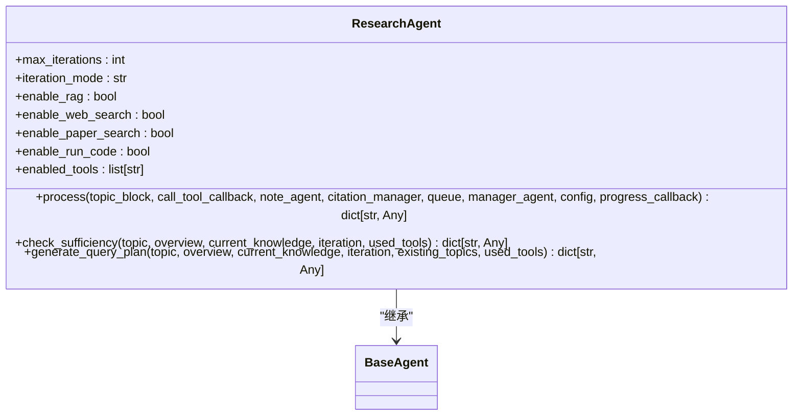

**Diagram sources **
- [research_agent.py](file://src/agents/research/agents/research_agent.py#L22-L696)

### 外部组件协作关系
研究执行循环与多个外部组件协作，形成完整的研究生态系统。

```mermaid
graph TD
ResearchAgent --> call_tool_callback : "调用工具"
ResearchAgent --> note_agent : "生成知识摘要"
ResearchAgent --> citation_manager : "管理引用ID"
ResearchAgent --> manager_agent : "动态主题扩展"
ResearchAgent --> queue : "获取现有主题列表"
ResearchAgent --> progress_callback : "实时反馈"
subgraph "工具调用"
call_tool_callback --> rag_search : "RAG检索"
call_tool_callback --> web_search : "网络搜索"
call_tool_callback --> paper_search : "论文搜索"
call_tool_callback --> run_code : "代码执行"
end
subgraph "知识管理"
note_agent --> ToolTrace : "生成摘要"
citation_manager --> citations.json : "存储引用信息"
end
```

**Diagram sources **
- [research_agent.py](file://src/agents/research/agents/research_agent.py#L426-L696)
- [research_pipeline.py](file://src/agents/research/research_pipeline.py#L263-L368)
- [citation_manager.py](file://src/agents/research/utils/citation_manager.py#L18-L798)
- [note_agent.py](file://src/agents/research/agents/note_agent.py#L20-L164)

**Section sources**
- [research_agent.py](file://src/agents/research/agents/research_agent.py#L426-L696)
- [research_pipeline.py](file://src/agents/research/research_pipeline.py#L263-L368)
- [citation_manager.py](file://src/agents/research/utils/citation_manager.py#L18-L798)
- [note_agent.py](file://src/agents/research/agents/note_agent.py#L20-L164)

## 执行循环详细解析
研究执行循环的process方法包含一个while循环，执行七个关键步骤。

### while循环内的七个步骤

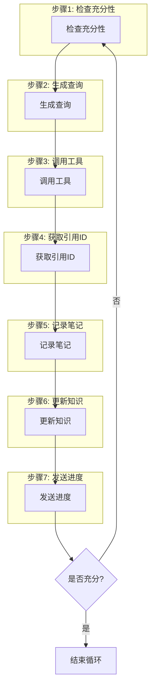

**Diagram sources **
- [research_agent.py](file://src/agents/research/agents/research_agent.py#L484-L689)

#### 步骤1: 检查充分性
在每次迭代开始时，系统检查当前知识是否充分。通过调用check_sufficiency方法，评估是否需要继续研究。

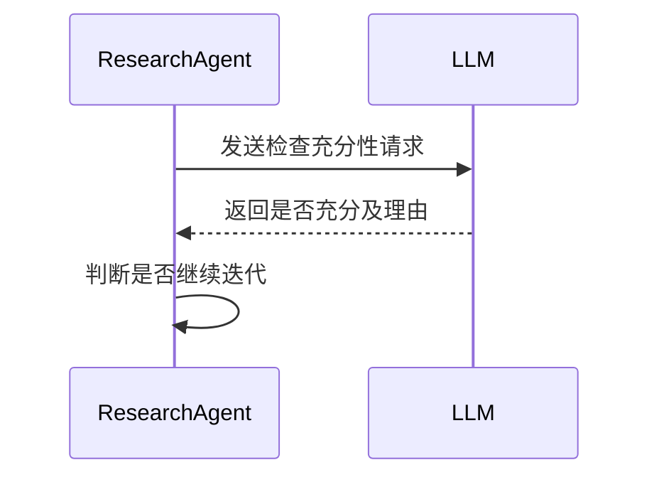

**Diagram sources **
- [research_agent.py](file://src/agents/research/agents/research_agent.py#L310-L363)

#### 步骤2: 生成查询
如果知识不充分，系统生成查询计划。通过调用generate_query_plan方法，确定下一个查询的内容和工具类型。

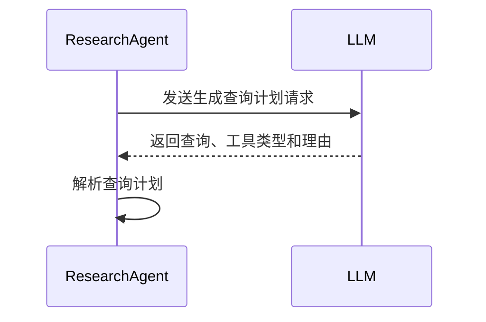

**Diagram sources **
- [research_agent.py](file://src/agents/research/agents/research_agent.py#L365-L423)

#### 步骤3: 调用工具
根据生成的查询计划，调用相应的工具。通过call_tool_callback回调函数执行工具调用。

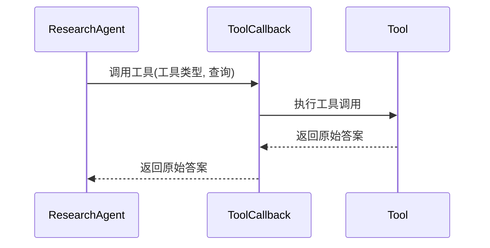

**Diagram sources **
- [research_agent.py](file://src/agents/research/agents/research_agent.py#L603-L612)
- [research_pipeline.py](file://src/agents/research/research_pipeline.py#L263-L368)

#### 步骤4: 获取引用ID
从引用管理器获取唯一的引用ID，用于后续的引用追踪。

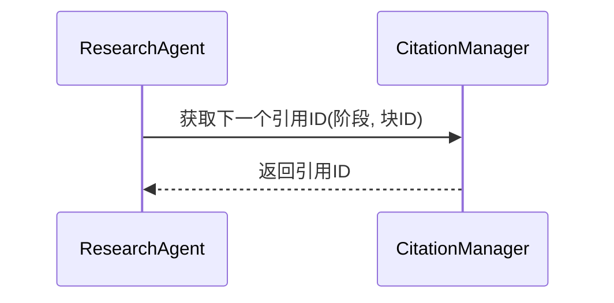

**Diagram sources **
- [research_agent.py](file://src/agents/research/agents/research_agent.py#L619-L633)
- [citation_manager.py](file://src/agents/research/utils/citation_manager.py#L86-L99)

#### 步骤5: 记录笔记
通过note_agent处理原始答案，生成知识摘要并创建工具追踪记录。

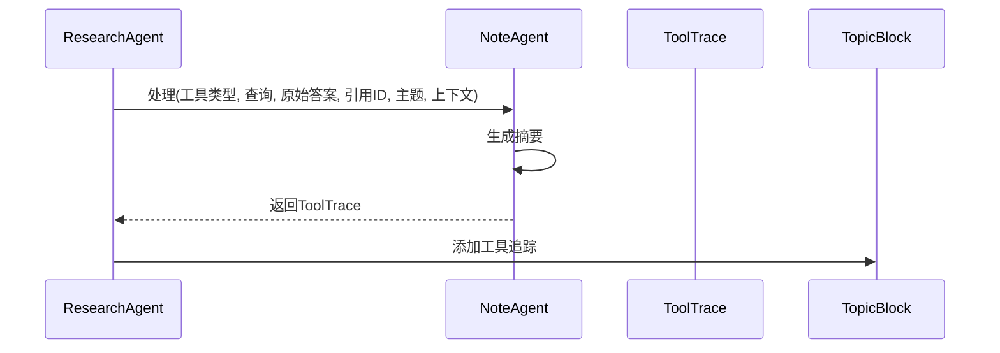

**Diagram sources **
- [research_agent.py](file://src/agents/research/agents/research_agent.py#L636-L644)
- [note_agent.py](file://src/agents/research/agents/note_agent.py#L27-L80)

#### 步骤6: 更新知识
将新生成的摘要添加到当前知识中，更新主题块的迭代计数和已使用工具列表。

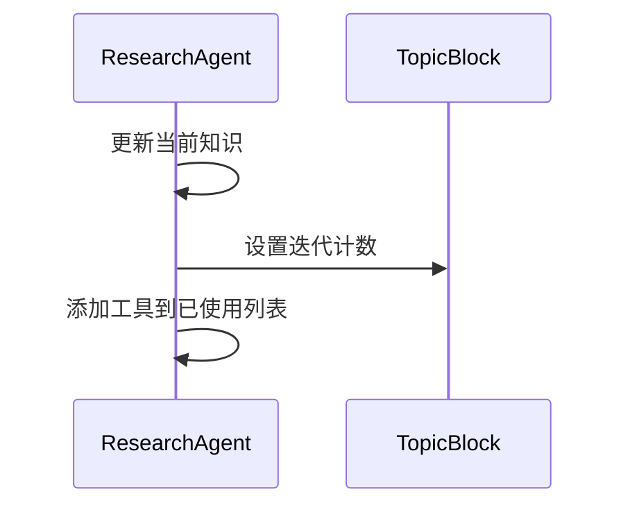

**Diagram sources **
- [research_agent.py](file://src/agents/research/agents/research_agent.py#L675-L678)

#### 步骤7: 发送进度
通过progress_callback发送迭代完成的进度更新，实现实时反馈。

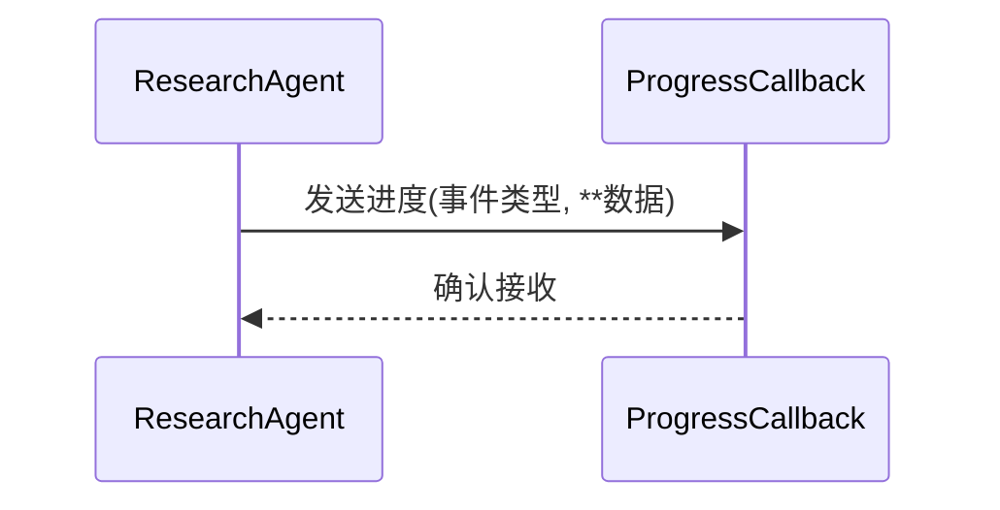

**Diagram sources **
- [research_agent.py](file://src/agents/research/agents/research_agent.py#L477-L482)
- [research_pipeline.py](file://src/agents/research/research_pipeline.py#L1110-L1122)

### progress_callback在实时反馈中的作用
progress_callback用于在研究过程中提供实时反馈，通过发送不同类型的事件来通知进度。

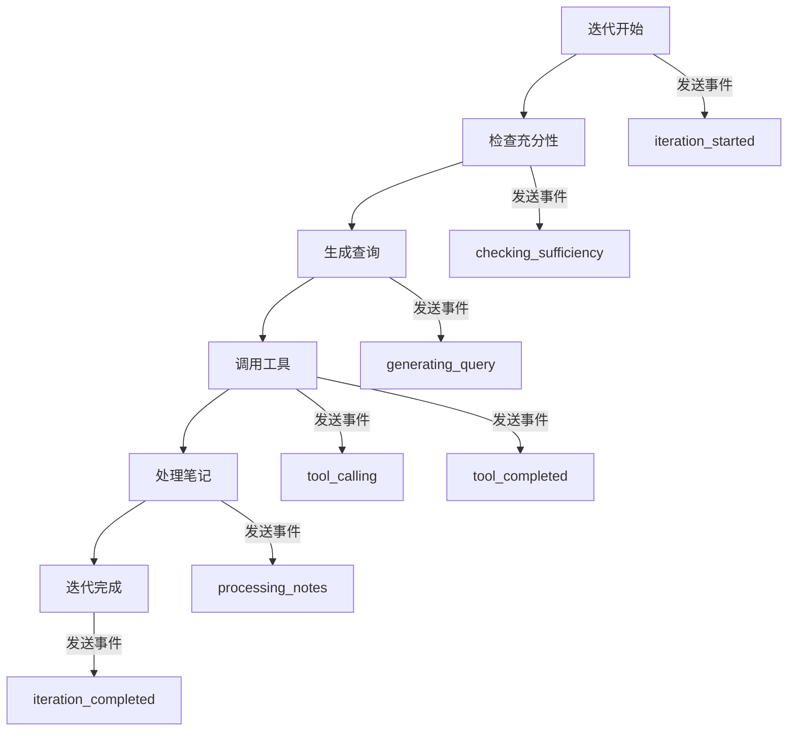

**Diagram sources **
- [research_agent.py](file://src/agents/research/agents/research_agent.py#L477-L482)
- [research_pipeline.py](file://src/agents/research/research_pipeline.py#L1110-L1122)

**Section sources**
- [research_agent.py](file://src/agents/research/agents/research_agent.py#L484-L689)

## 输入输出数据结构
研究执行循环的输入输出数据结构定义了方法的接口契约。

### 输入参数
| 参数 | 类型 | 描述 |
|------|------|------|
| topic_block | TopicBlock | 要研究的主题块 |
| call_tool_callback | Callable[[str, str], Awaitable[str]] | 工具调用回调函数 |
| note_agent | NoteAgent | 笔记生成代理实例 |
| citation_manager | CitationManager | 引用管理器实例 |
| queue | DynamicTopicQueue | 动态主题队列实例 |
| manager_agent | ManagerAgent | 管理代理实例 |
| config | dict[str, Any] | 配置字典 |
| progress_callback | Callable[[str, Any], None] | 进度回调函数 |

### 输出结果
```json
{
    "block_id": "string",
    "iterations": "int",
    "final_knowledge": "string",
    "tools_used": ["string"],
    "queries_used": [
        {
            "query": "string",
            "tool_type": "string",
            "rationale": "string",
            "iteration": "int"
        }
    ],
    "status": "string"
}
```

**Section sources**
- [research_agent.py](file://src/agents/research/agents/research_agent.py#L440-L459)

## 异常处理机制
研究执行循环实现了完善的异常处理机制，确保系统的稳定运行。

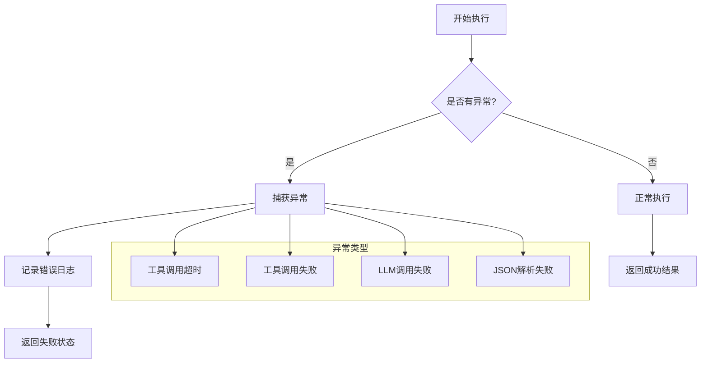

**Diagram sources **
- [research_agent.py](file://src/agents/research/agents/research_agent.py#L353-L363)
- [research_pipeline.py](file://src/agents/research/research_pipeline.py#L197-L261)

**Section sources**
- [research_agent.py](file://src/agents/research/agents/research_agent.py#L353-L363)
- [research_pipeline.py](file://src/agents/research/research_pipeline.py#L197-L261)

## 结论
研究执行循环是DeepTutor系统的核心组件，通过精心设计的七个步骤实现了高效的多轮研究流程。该方法与多个外部组件紧密协作，形成了一个完整的知识研究生态系统。通过progress_callback机制，系统能够提供实时反馈，增强了用户体验。完善的输入输出数据结构和异常处理机制确保了系统的稳定性和可靠性。