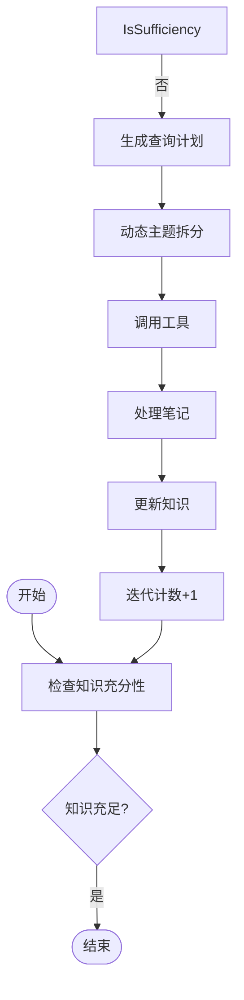
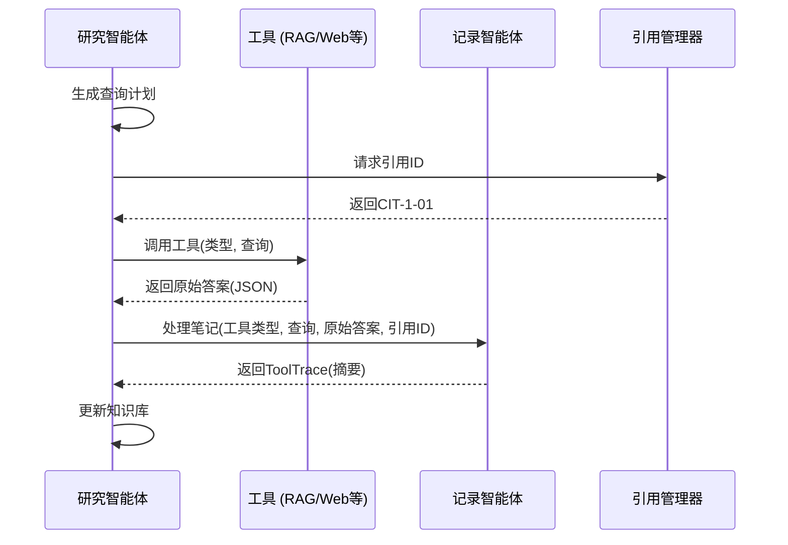

# 研究智能体

<cite>
**本文档引用文件**   
- [research_agent.py](file://src/agents/research/agents/research_agent.py)
- [note_agent.py](file://src/agents/research/agents/note_agent.py)
- [citation_manager.py](file://src/agents/research/utils/citation_manager.py)
- [data_structures.py](file://src/agents/research/data_structures.py)
- [research_pipeline.py](file://src/agents/research/research_pipeline.py)
- [research_agent.yaml](file://src/agents/research/prompts/cn/research_agent.yaml)
- [note_agent.yaml](file://src/agents/research/prompts/cn/note_agent.yaml)
- [main.yaml](file://config/main.yaml)
- [agents.yaml](file://config/agents.yaml)
</cite>

## 目录
1. [引言](#引言)
2. [核心执行流程](#核心执行流程)
3. [知识充分性检查](#知识充分性检查)
4. [查询计划生成](#查询计划生成)
5. [工具执行协调](#工具执行协调)
6. [迭代模式与研究策略](#迭代模式与研究策略)
7. [多阶段工具使用指导](#多阶段工具使用指导)
8. [动态主题拆分](#动态主题拆分)
9. [组件协作机制](#组件协作机制)
10. [输入输出数据结构](#输入输出数据结构)
11. [配置参数](#配置参数)
12. [异常处理](#异常处理)

## 引言
研究智能体（ResearchAgent）是深度研究系统中的核心组件，负责执行完整的迭代研究循环。该智能体通过三个核心阶段——知识充分性检查、查询计划生成和工具执行协调——来系统性地探索和挖掘与研究主题相关的信息。本技术文档将深入解析其完整执行流程，详细阐述其如何根据迭代模式动态调整研究策略，如何生成多阶段工具使用指导，以及如何实现动态主题拆分。同时，文档还将详细描述其与NoteAgent、CitationManager等组件的协作机制，并提供输入输出数据结构、配置参数及异常处理的完整说明。

## 核心执行流程
研究智能体的核心执行流程是一个闭环的迭代过程，由`process`方法驱动。该流程从接收一个`TopicBlock`开始，通过循环执行知识检查、查询生成和工具调用，直到满足终止条件。整个流程由`max_iterations`参数控制最大迭代次数，并根据`iteration_mode`参数决定是采用固定模式还是灵活模式。

**流程图来源**
- [research_agent.py](file://src/agents/research/agents/research_agent.py#L426-L697)

## 知识充分性检查
知识充分性检查是研究循环的决策点，由`check_sufficiency`方法实现。该方法通过调用大语言模型（LLM）来评估当前已积累的知识是否足以全面覆盖研究主题。评估过程遵循严格的系统性原则，确保研究达到“深度研究”的标准，而非仅仅“表面覆盖”。

### 评估步骤
1.  **明确核心要素**：评估当前知识是否覆盖了至少6个核心维度：
    -   概念定义
    -   核心原理
    -   关键公式/算法
    -   应用场景
    -   关联关系
    -   局限与发展
2.  **严格评估覆盖情况**：统计已覆盖的维度数量，并评估每个维度的深度。
3.  **判断充足性标准**：
    -   **充足**：满足以下全部条件
        ① 至少覆盖5个核心维度
        ② 每个已覆盖维度都有实质内容（非仅提及）
        ③ 迭代次数 ≥ 3
    -   **不充足**：任一条件不满足

### 迭代模式的影响
该检查的严格程度受`iteration_mode`配置的影响。在`fixed`模式下，智能体在早期迭代中会非常保守，很少得出知识充足的结论；而在`flexible`模式下，智能体有自主权在知识确实全面时提前结束研究。

**流程图来源**
- [research_agent.py](file://src/agents/research/agents/research_agent.py#L311-L364)
- [research_agent.yaml](file://src/agents/research/prompts/cn/research_agent.yaml#L89-L134)

## 查询计划生成
当知识被判定为不充足时，研究智能体进入查询计划生成阶段，由`generate_query_plan`方法负责。该方法的核心任务是决定下一步使用哪种工具以及查询什么内容，以填补知识缺口。

### 决策依据
1.  **可用工具列表**：根据配置文件（如`main.yaml`）动态生成可用工具列表，包括`rag_hybrid`、`rag_naive`、`web_search`、`paper_search`等。
2.  **多阶段工具使用指导**：生成分阶段的工具使用策略：
    -   **基础探索**：早期迭代优先使用RAG工具从知识库获取核心概念和定义。
    -   **深度挖掘**：中期迭代引入`paper_search`和`web_search`，以补充前沿学术研究和实时应用案例。
    -   **补充完善**：后期迭代使用`run_code`进行算法验证或数值计算，确保知识的完整性。
3.  **新话题评估**：在生成查询计划时，智能体会评估是否发现了与主话题高度相关且全新的重要分支。如果发现，它会建议添加新话题。

**流程图来源**
- [research_agent.py](file://src/agents/research/agents/research_agent.py#L366-L424)
- [research_agent.yaml](file://src/agents/research/prompts/cn/research_agent.yaml#L136-L173)

## 工具执行协调
工具执行协调是研究智能体与外部世界交互的环节。一旦查询计划生成，智能体将协调调用相应的工具，并将结果传递给`NoteAgent`进行处理。

### 协调流程
1.  **调用工具**：通过`call_tool_callback`回调函数调用指定的工具（如`rag_search`、`web_search`），并获取原始的JSON响应。
2.  **生成引用ID**：向`CitationManager`请求一个唯一的引用ID（如`CIT-1-01`），用于追踪本次工具调用。
3.  **处理笔记**：将工具的原始响应、查询语句、引用ID等信息传递给`NoteAgent`，由其生成结构化的摘要。
4.  **记录与更新**：将`NoteAgent`返回的`ToolTrace`对象添加到`TopicBlock`的追踪列表中，并更新当前知识库。

**序列图来源**
- [research_agent.py](file://src/agents/research/agents/research_agent.py#L602-L674)
- [note_agent.py](file://src/agents/research/agents/note_agent.py#L27-L80)

## 迭代模式与研究策略
研究智能体的行为受`iteration_mode`配置的显著影响，该配置决定了智能体在判断知识充足性时的策略。

### 固定模式 (fixed)
-   **策略**：保守且彻底。智能体被要求进行彻底的探索，目标是完成预设的最大迭代次数。
-   **行为**：在早期和中期迭代中，即使知识已相当丰富，智能体也会倾向于继续探索，以确保没有遗漏。只有在后期迭代且证据确凿时，才会判定知识充足。
-   **适用场景**：需要确保研究全面性和深度的场景。

### 灵活模式 (flexible)
-   **策略**：自主且高效。智能体拥有自主权来决定何时知识已足够。
-   **行为**：如果经过几轮探索后，核心维度已被充分覆盖，智能体可以提前结束研究，避免不必要的迭代。
-   **适用场景**：追求效率，且对研究深度有合理预期的场景。

**流程图来源**
- [research_agent.py](file://src/agents/research/agents/research_agent.py#L32-L35)
- [research_agent.yaml](file://src/agents/research/prompts/cn/research_agent.yaml#L74-L87)

## 多阶段工具使用指导
研究智能体内置了智能的多阶段工具使用策略，旨在引导研究过程从基础到深入再到完善。

### 阶段划分
1.  **基础探索 (早期迭代)**：
    -   **目标**：建立知识基础。
    -   **工具**：`rag_hybrid`（获取全面信息）、`rag_naive`（查询精确定义和公式）。
2.  **深度挖掘 (中期迭代)**：
    -   **目标**：扩展知识广度和深度。
    -   **工具**：`paper_search`（获取前沿学术研究）、`web_search`（获取实时应用案例和行业趋势）。
3.  **补充完善 (后期迭代)**：
    -   **目标**：填补知识空白，进行验证。
    -   **工具**：`run_code`（执行代码进行算法验证、数值计算或数据可视化）。

该指导策略是动态生成的，仅在相关工具被启用时才会包含在提示词中。

**流程图来源**
- [research_agent.py](file://src/agents/research/agents/research_agent.py#L106-L182)
- [research_agent.yaml](file://src/agents/research/prompts/cn/research_agent.yaml#L149-L155)

## 动态主题拆分
动态主题拆分是研究智能体的一项高级功能，使其能够发现并探索研究主题的全新分支。

### 实现机制
1.  **识别**：在生成查询计划时，`generate_query_plan`方法会分析当前知识库，判断是否发现了与主话题相关但全新的重要子话题。
2.  **评估**：智能体会为新话题生成一个`new_topic_score`，并将其与配置中的`new_topic_min_score`（默认0.85）进行比较。
3.  **决策**：如果`new_topic_score`高于阈值且`should_add_new_topic`为`true`，则触发添加新话题。
4.  **执行**：通过`manager_agent`的`add_new_topic`方法，将新话题（`new_sub_topic`）和概述（`new_overview`）作为新的`TopicBlock`添加到`DynamicTopicQueue`的末尾。

此机制使得研究过程具有了动态扩展和自我发现的能力。

**流程图来源**
- [research_agent.py](file://src/agents/research/agents/research_agent.py#L533-L571)
- [data_structures.py](file://src/agents/research/data_structures.py#L225-L450)

## 组件协作机制
研究智能体并非孤立工作，而是与多个关键组件紧密协作，形成一个高效的研究系统。

### 与NoteAgent的协作
-   **职责**：`ResearchAgent`负责决策“查询什么”，而`NoteAgent`负责“如何总结”。
-   **流程**：`ResearchAgent`将工具的原始输出传递给`NoteAgent`，`NoteAgent`利用其专门的提示词（`note_agent.yaml`）提取关键信息，生成结构化的摘要，并保留公式、表格等重要元素。

### 与CitationManager的协作
-   **职责**：`CitationManager`是引用信息的中央管理器。
-   **流程**：`ResearchAgent`在每次工具调用前，向`CitationManager`请求一个唯一的引用ID。随后，`ResearchAgent`会将工具调用的详细信息（包括原始响应和`ToolTrace`）回传给`CitationManager`，由其负责持久化存储和格式化引用。

### 与ManagerAgent和DynamicTopicQueue的协作
-   **职责**：`ManagerAgent`和`DynamicTopicQueue`共同管理研究任务的调度。
-   **流程**：`ResearchAgent`通过`ManagerAgent`访问`DynamicTopicQueue`，以获取现有话题列表，并在发现新话题时请求添加。

**类图来源**
- [research_agent.py](file://src/agents/research/agents/research_agent.py#L23-L701)
- [note_agent.py](file://src/agents/research/agents/note_agent.py#L21-L165)
- [citation_manager.py](file://src/agents/research/utils/citation_manager.py#L18-L799)
- [data_structures.py](file://src/agents/research/data_structures.py#L173-L451)

## 输入输出数据结构
研究智能体的输入和输出都基于明确定义的数据结构。

### 输入
-   **TopicBlock**：研究的基本单元，包含`sub_topic`（子话题）、`overview`（概述）、`tool_traces`（工具调用追踪列表）和`iteration_count`（迭代计数）。
-   **回调函数**：`call_tool_callback`用于调用外部工具，`progress_callback`用于报告进度。

### 输出
-   **研究结果**：一个字典，包含`iterations`（实际迭代次数）、`final_knowledge`（最终知识摘要）、`tools_used`（使用过的工具列表）和`queries_used`（使用过的查询列表）。

**数据结构来源**
- [data_structures.py](file://src/agents/research/data_structures.py#L173-L223)
- [research_agent.py](file://src/agents/research/agents/research_agent.py#L451-L460)

## 配置参数
研究智能体的行为由`config`字典中的多个参数控制。

### 核心参数
-   **max_iterations**：最大迭代次数，控制研究循环的上限。
-   **iteration_mode**：迭代模式，可选`fixed`或`flexible`，决定研究策略。
-   **enable_web_search**：布尔值，启用或禁用网络搜索功能。

### 工具启用参数
-   **enable_rag**：启用RAG检索。
-   **enable_paper_search**：启用学术论文搜索。
-   **enable_run_code**：启用代码执行。

这些参数主要在`config/main.yaml`文件中定义，并在`ResearchAgent`初始化时读取。

**配置来源**
- [main.yaml](file://config/main.yaml#L74-L87)
- [research_agent.py](file://src/agents/research/agents/research_agent.py#L30-L51)

## 异常处理
研究智能体具备完善的异常处理机制，以应对各种潜在的错误。

### 处理范围
-   **工具调用超时**：通过`_call_tool_with_retry`方法实现，支持重试和超时控制。
-   **LLM调用失败**：在`call_llm`方法中捕获异常，并提供有意义的错误信息。
-   **无效的JSON响应**：在`extract_json_from_text`和`ensure_json_dict`等工具函数中处理，确保程序不会因格式错误而崩溃。
-   **引用ID冲突**：`CitationManager`使用计数器和锁机制来保证引用ID的唯一性。

这些机制共同确保了研究流程的健壮性和稳定性。

**异常处理来源**
- [research_pipeline.py](file://src/agents/research/research_pipeline.py#L180-L261)
- [research_agent.py](file://src/agents/research/agents/research_agent.py#L359-L373)
- [citation_manager.py](file://src/agents/research/utils/citation_manager.py#L279-L281)