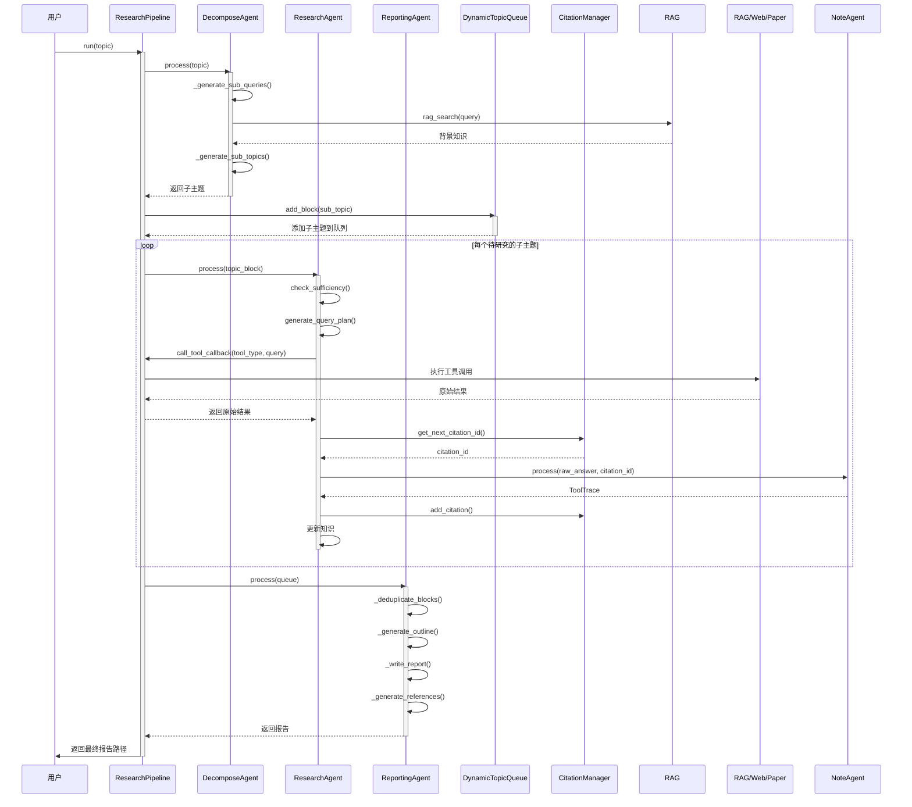

# 研究智能体组件

<cite>
**本文档引用的文件**  
- [decompose_agent.py](file://src/agents/research/agents/decompose_agent.py)
- [research_agent.py](file://src/agents/research/agents/research_agent.py)
- [reporting_agent.py](file://src/agents/research/agents/reporting_agent.py)
- [decompose_agent.yaml](file://src/agents/research/prompts/cn/decompose_agent.yaml)
- [research_agent.yaml](file://src/agents/research/prompts/cn/research_agent.yaml)
- [reporting_agent.yaml](file://src/agents/research/prompts/cn/reporting_agent.yaml)
- [data_structures.py](file://src/agents/research/data_structures.py)
- [base_agent.py](file://src/agents/research/agents/base_agent.py)
- [citation_manager.py](file://src/agents/research/utils/citation_manager.py)
- [research_pipeline.py](file://src/agents/research/research_pipeline.py)
</cite>

## 目录
1. [引言](#引言)
2. [核心智能体职责](#核心智能体职责)
3. [智能体协作流程](#智能体协作流程)
4. [decompose_agent 详解](#decompose_agent-详解)
5. [research_agent 详解](#research_agent-详解)
6. [reporting_agent 详解](#reporting_agent-详解)
7. [提示工程设计](#提示工程设计)
8. [输入输出格式与配置](#输入输出格式与配置)
9. [异常处理机制](#异常处理机制)
10. [调试指南](#调试指南)

## 引言
本技术文档深入研究了DeepTutor项目中的智能体组件，重点分析了`research_agent`、`reporting_agent`和`decompose_agent`三个核心智能体的实现细节。这些智能体协同工作，构成了一个完整的深度研究系统（DR-in-KG 2.0），能够将一个复杂的研究主题分解为子问题，执行信息检索与分析，并最终生成结构化的研究报告。本文档将详细阐述每个智能体的内部逻辑、它们之间的协作机制以及相关的配置和调试方法。

## 核心智能体职责
在DeepTutor的研究工作流中，三个核心智能体各司其职，共同完成从问题分解到报告生成的全过程。

- **`decompose_agent` (分解智能体)**: 作为工作流的起点，负责将用户输入的复杂研究主题（topic）分解为一系列逻辑清晰、互不重复的子主题（subtopics）。它通过生成子查询并利用RAG（检索增强生成）技术从知识库中获取背景信息，从而确保分解出的子主题具有深度和广度。
- **`research_agent` (研究智能体)**: 负责执行深度研究逻辑。它针对`decompose_agent`生成的每一个子主题，通过多轮迭代调用各种工具（如RAG、网络搜索、代码执行等）来收集信息，并利用`note_agent`生成摘要，逐步构建对该子主题的全面理解。
- **`reporting_agent` (报告智能体)**: 作为工作流的终点，负责整合所有研究结果，生成最终的深度研究报告。它执行去重、生成大纲、撰写报告正文，并处理引用和参考文献，确保报告内容翔实、结构清晰、学术严谨。

**Section sources**
- [research_pipeline.py](file://src/agents/research/research_pipeline.py#L392-L410)

## 智能体协作流程
智能体间的协作遵循一个清晰的序列，由`ResearchPipeline`类协调。整个流程分为三个阶段：规划（Planning）、研究（Researching）和报告（Reporting）。

**Diagram sources**
- [research_pipeline.py](file://src/agents/research/research_pipeline.py#L392-L410)
- [decompose_agent.py](file://src/agents/research/agents/decompose_agent.py#L54-L100)
- [research_agent.py](file://src/agents/research/agents/research_agent.py#L426-L698)
- [reporting_agent.py](file://src/agents/research/agents/reporting_agent.py#L78-L160)

## decompose_agent 详解
`decompose_agent`是研究流程的启动者，其主要职责是将一个宏观的研究主题分解为可管理的子任务。

### 实现细节
`decompose_agent`继承自`BaseAgent`，其核心方法是`process`。该方法支持两种模式：
- **手动模式 (manual)**: 用户指定期望的子主题数量。智能体首先生成一系列子查询，然后使用这些查询通过RAG从知识库中检索背景知识，最后基于这些背景知识生成指定数量的子主题。
- **自动模式 (auto)**: 智能体自主决定子主题的数量。它直接使用主话题进行RAG检索以获取背景知识，然后基于这些知识动态生成不超过上限的子主题。

在`process`方法内部，`_generate_sub_queries`负责生成用于RAG检索的查询语句，而`_generate_sub_topics`则利用这些检索到的背景知识来生成最终的子主题列表。

### 输入输出格式
- **输入**: `topic` (主话题), `num_subtopics` (期望/最大子主题数), `mode` (模式: "manual" 或 "auto")
- **输出**: 一个包含`main_topic`, `sub_topics` (子主题列表), `total_subtopics` (总数)等字段的字典。

**Section sources**
- [decompose_agent.py](file://src/agents/research/agents/decompose_agent.py#L54-L100)
- [decompose_agent.py](file://src/agents/research/agents/decompose_agent.py#L190-L321)

## research_agent 详解
`research_agent`是研究流程的核心执行者，它对`decompose_agent`生成的每一个子主题进行深度探索。

### 实现细节
`research_agent`的核心是`process`方法，它在一个循环中执行多轮研究，直到知识被认为足够充分或达到最大迭代次数。该循环包含以下关键步骤：
1.  **检查充分性 (`check_sufficiency`)**: 评估当前已收集的知识是否足够覆盖该子主题的核心维度（如概念、原理、应用等）。
2.  **生成查询计划 (`generate_query_plan`)**: 如果知识不充分，决定下一步使用哪种工具（如`rag_hybrid`, `web_search`）以及查询什么内容。
3.  **调用工具**: 通过`call_tool_callback`执行查询计划中的工具调用。
4.  **记录笔记**: 将工具返回的原始答案传递给`note_agent`，由`note_agent`生成简洁的摘要（`summary`），并创建一个`ToolTrace`对象来记录整个过程。
5.  **更新知识**: 将新生成的摘要添加到当前知识库中，为下一次迭代做准备。

该智能体还实现了复杂的工具选择策略，根据迭代阶段（早期、中期、晚期）和已启用的工具（RAG、论文搜索、网络搜索等）来指导查询计划的生成。

### 输入输出格式
- **输入**: `topic_block` (包含子主题和概览的TopicBlock对象), `call_tool_callback` (工具调用回调函数), `note_agent`, `citation_manager`, `queue`, `manager_agent`等。
- **输出**: 一个包含`block_id`, `iterations`, `final_knowledge`, `tools_used`等字段的字典，表示该子主题的研究结果。

**Section sources**
- [research_agent.py](file://src/agents/research/agents/research_agent.py#L426-L698)
- [research_agent.py](file://src/agents/research/agents/research_agent.py#L311-L364)

## reporting_agent 详解
`reporting_agent`负责将分散的研究成果整合成一份连贯、专业的报告。

### 实现细节
`reporting_agent`的`process`方法遵循一个三步流程：
1.  **去重与清洗 (`_deduplicate_blocks`)**: 分析所有子主题，识别并移除语义上重复或高度相似的主题，确保报告内容的多样性。
2.  **生成大纲 (`_generate_outline`)**: 基于所有子主题的完整信息（包括概览和所有工具调用的摘要），生成一个包含引言、主体章节和结论的三级标题体系大纲。
3.  **撰写报告 (`_write_report`)**: 这是核心步骤，它会：
    -   调用`_write_introduction`撰写引言。
    -   为大纲中的每个章节调用`_write_section_body`撰写主体内容。
    -   调用`_write_conclusion`撰写结论。
    -   最后，调用`_generate_references`生成参考文献部分。

在撰写过程中，`reporting_agent`会利用`CitationManager`来管理引用，支持行内引用（如`[1]`）和参考文献列表的生成。

### 输入输出格式
- **输入**: `queue` (包含所有研究结果的DynamicTopicQueue对象), `topic` (主话题)。
- **输出**: 一个包含`report` (报告的Markdown字符串), `word_count`, `sections`, `citations`等字段的字典。

**Section sources**
- [reporting_agent.py](file://src/agents/research/agents/reporting_agent.py#L78-L160)
- [reporting_agent.py](file://src/agents/research/agents/reporting_agent.py#L107-L129)

## 提示工程设计
每个智能体的行为都由其对应的YAML提示模板精确控制，这些模板定义了智能体的角色、任务和输出格式。

### decompose_agent.yaml
该模板定义了`decompose_agent`如何分解话题。它要求智能体：
- 分析背景知识，识别核心概念和研究维度。
- 生成逻辑关联但不重复的子话题。
- 为每个子话题提供简洁的标题和详细的概览。
- 严格输出JSON格式，包含`sub_topics`数组。

### research_agent.yaml
该模板为`research_agent`提供了复杂的决策框架：
- **`check_sufficiency`**: 定义了评估知识充分性的严格标准，要求覆盖至少5个核心维度（如概念、原理、应用等），并根据迭代模式（灵活或固定）给出不同的判断准则。
- **`generate_query_plan`**: 指导智能体如何制定查询计划，包括可用工具列表、分阶段工具使用建议（早期用RAG，后期用外部搜索）和新话题发现的评估标准。

### reporting_agent.yaml
该模板旨在生成学术级的深度报告：
- **`deduplicate`**: 指示智能体如何识别和处理重复话题。
- **`generate_outline`**: 要求生成一个结构化的三级标题大纲，并定义了逻辑结构设计原则（如按认知规律排序）。
- **`write_section_body`**: 提供了“深度写作框架”，鼓励使用多模态元素（公式、表格、流程图、代码块）来增强表达力，并强调论证的完整性。

**Section sources**
- [decompose_agent.yaml](file://src/agents/research/prompts/cn/decompose_agent.yaml)
- [research_agent.yaml](file://src/agents/research/prompts/cn/research_agent.yaml)
- [reporting_agent.yaml](file://src/agents/research/prompts/cn/reporting_agent.yaml)

## 输入输出格式与配置
### 核心数据结构
- **`TopicBlock`**: 代表一个待研究的子主题单元，包含`block_id`, `sub_topic`, `overview`, `tool_traces` (工具调用记录列表)等字段。
- **`ToolTrace`**: 记录一次工具调用的完整信息，包括`tool_id`, `citation_id`, `tool_type`, `query`, `raw_answer` (原始结果)和`summary` (摘要)。
- **`DynamicTopicQueue`**: 动态主题队列，是系统的核心调度中心，管理着所有`TopicBlock`的生命周期（待处理、研究中、已完成）。

### 配置参数
智能体的行为由`config`目录下的YAML文件配置，关键参数包括：
- **`planning.decompose.initial_subtopics`**: `decompose_agent`在手动模式下期望生成的子主题数量。
- **`researching.max_iterations`**: `research_agent`对每个子主题的最大迭代次数。
- **`researching.enable_web_search`**: 是否启用网络搜索工具。
- **`reporting.enable_citation_list`**: `reporting_agent`是否在报告末尾生成参考文献列表。

**Section sources**
- [data_structures.py](file://src/agents/research/data_structures.py)
- [main.py](file://src/agents/research/main.py#L57-L83)

## 异常处理机制
系统在多个层面实现了健壮的异常处理：
- **工具调用**: `research_pipeline.py`中的`_call_tool_with_retry`方法为所有工具调用提供了重试和超时机制，确保单个工具的失败不会导致整个流程中断。
- **JSON解析**: `json_utils.py`中的`extract_json_from_text`和`ensure_json_dict`等工具函数能够从LLM可能返回的非纯JSON文本中提取JSON，并进行严格的结构验证。
- **引用管理**: `CitationManager`在添加引用时会捕获异常，并在`add_citation`方法中返回布尔值以指示操作是否成功。
- **数据持久化**: `DynamicTopicQueue`在保存进度时使用了try-except块，防止因文件写入失败而中断研究流程。

**Section sources**
- [research_pipeline.py](file://src/agents/research/research_pipeline.py#L203-L262)
- [json_utils.py](file://src/agents/research/utils/json_utils.py)
- [citation_manager.py](file://src/agents/research/utils/citation_manager.py#L234-L282)

## 调试指南
### 信息遗漏
**现象**: 生成的报告在某些关键维度（如“局限性”或“最新发展”）上内容不足。
**排查步骤**:
1.  检查`research_agent.yaml`中的`check_sufficiency`提示词，确认其评估标准是否足够严格。
2.  查看`research_pipeline`的日志，确认`research_agent`是否过早地判断知识已充分。
3.  检查`researching.max_iterations`配置，确保迭代次数足够。
4.  确认`enable_web_search`或`enable_paper_search`等外部工具是否已启用，以补充知识库的不足。

### 报告冗余
**现象**: 报告中存在大量重复或高度相似的内容。
**排查步骤**:
1.  检查`reporting_agent.yaml`中的`deduplicate`提示词，确认其去重逻辑是否清晰。
2.  查看`decompose_agent`的输出，确认其生成的子主题是否本身就存在语义重复。
3.  检查`reporting_agent`的`enable_deduplication`配置是否已开启。
4.  检查`CitationManager`的去重逻辑，确保相同的论文或来源不会被多次引用。

**Section sources**
- [research_agent.yaml](file://src/agents/research/prompts/cn/research_agent.yaml#L90-L134)
- [reporting_agent.yaml](file://src/agents/research/prompts/cn/reporting_agent.yaml#L43-L70)
- [reporting_agent.py](file://src/agents/research/agents/reporting_agent.py#L108-L110)