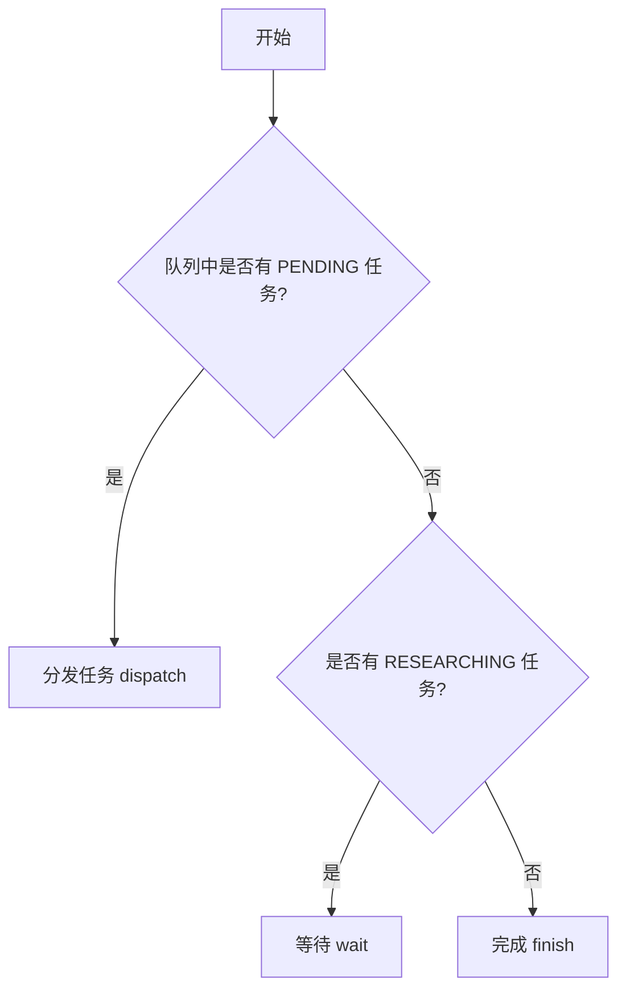
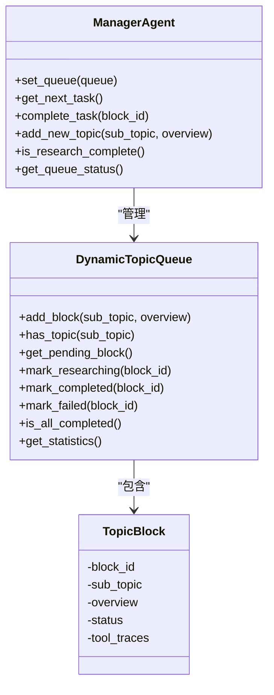
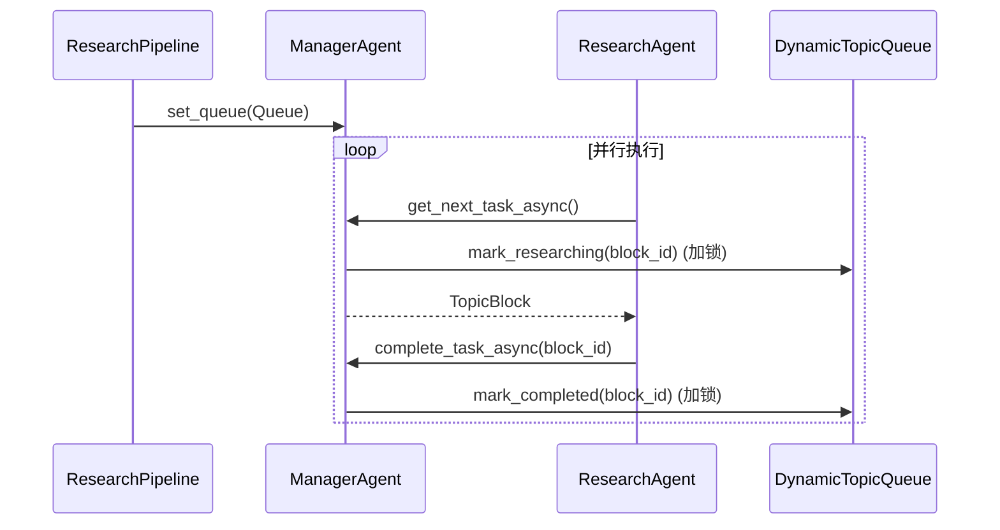

# 管理智能体

<cite>
**本文档引用的文件**   
- [manager_agent.py](file://src/agents/research/agents/manager_agent.py)
- [data_structures.py](file://src/agents/research/data_structures.py)
- [research_pipeline.py](file://src/agents/research/research_pipeline.py)
- [research_agent.py](file://src/agents/research/agents/research_agent.py)
- [decompose_agent.py](file://src/agents/research/agents/decompose_agent.py)
- [manager_agent.yaml](file://src/agents/research/prompts/cn/manager_agent.yaml)
</cite>

## 目录
1. [简介](#简介)
2. [核心职责与队列管理](#核心职责与队列管理)
3. [核心方法实现](#核心方法实现)
4. [并行与串行模式下的行为](#并行与串行模式下的行为)
5. [与DecomposeAgent和ResearchAgent的交互](#与decomposeagent和researchagent的交互)
6. [异步操作支持](#异步操作支持)
7. [集成与扩展指导](#集成与扩展指导)

## 简介

管理智能体（ManagerAgent）是DeepTutor研究系统中的核心调度器，负责维护和管理动态研究主题队列（DynamicTopicQueue）。它作为研究流程的中枢，协调任务的分配、状态跟踪和执行调度，确保研究过程高效、有序地进行。该智能体通过与DecomposeAgent和ResearchAgent等组件的紧密协作，实现了从主题分解到深入研究的自动化工作流。

**Section sources**
- [manager_agent.py](file://src/agents/research/agents/manager_agent.py#L1-L216)

## 核心职责与队列管理

管理智能体的核心职责是作为队列调度器，管理`DynamicTopicQueue`的生命周期和状态。它通过`set_queue`方法将自身与一个队列实例绑定，从而获得对该队列的完全控制权。队列中的每个研究主题被封装为一个`TopicBlock`对象，该对象包含主题名称、概述、状态和工具调用记录等信息。

`TopicBlock`的状态由`TopicStatus`枚举定义，包括`PENDING`（待处理）、`RESEARCHING`（研究中）、`COMPLETED`（已完成）和`FAILED`（失败）四种。管理智能体通过监控这些状态来决定下一步的操作。其核心调度逻辑遵循以下规则：
1.  **分发任务 (dispatch)**：当队列中存在`PENDING`状态的主题时，管理智能体将获取下一个待处理的任务，并将其状态标记为`RESEARCHING`。
2.  **等待 (wait)**：当有任务正在`RESEARCHING`但没有新的`PENDING`任务时，管理智能体将等待当前任务完成。
3.  **完成 (finish)**：当所有任务都已完成（即没有`PENDING`或`RESEARCHING`的任务）时，研究流程结束。

这一决策逻辑在`manager_agent.yaml`提示文件中被明确定义，确保了调度行为的可预测性和一致性。

**Diagram sources**
- [manager_agent.py](file://src/agents/research/agents/manager_agent.py#L39-L56)
- [data_structures.py](file://src/agents/research/data_structures.py#L15-L21)
- [manager_agent.yaml](file://src/agents/research/prompts/cn/manager_agent.yaml#L14-L17)

**Section sources**
- [manager_agent.py](file://src/agents/research/agents/manager_agent.py#L31-L56)
- [data_structures.py](file://src/agents/research/data_structures.py#L15-L21)
- [manager_agent.yaml](file://src/agents/research/prompts/cn/manager_agent.yaml#L14-L17)

## 核心方法实现

管理智能体提供了多个关键方法来实现其调度功能，其中`add_new_topic`是处理新主题添加的核心方法。

### add_new_topic 方法

该方法负责将新的研究主题安全地添加到队列中。其主要逻辑包括：
1.  **输入验证**：检查新主题的标题是否为空。如果为空，将抛出`ValueError`。
2.  **冲突处理**：通过调用`queue.has_topic()`方法检查队列中是否已存在同名主题（不区分大小写和前后空格）。如果存在，将打印警告信息并返回`None`，避免重复添加。
3.  **主题创建**：如果通过验证且无冲突，则调用`queue.add_block()`创建一个新的`TopicBlock`并将其添加到队列末尾。

此方法确保了队列的完整性和数据的唯一性，是动态扩展研究范围的关键入口。

### 任务调度与状态管理方法

-   **`get_next_task`**: 获取下一个待处理的任务。它会从队列中找到第一个`PENDING`状态的`TopicBlock`，并立即将其状态更新为`RESEARCHING`，以防止其他进程重复获取。
-   **`complete_task`**: 标记一个任务为已完成。它会将指定`block_id`的任务状态更新为`COMPLETED`。
-   **`fail_task`**: 标记一个任务为失败。它会将指定`block_id`的任务状态更新为`FAILED`。
-   **`is_research_complete`**: 检查所有研究任务是否都已完成。它通过调用`queue.is_all_completed()`来判断队列中是否还有未完成的任务。

这些方法共同构成了管理智能体对队列状态进行精确控制的基础。

**Diagram sources**
- [manager_agent.py](file://src/agents/research/agents/manager_agent.py#L150-L175)
- [data_structures.py](file://src/agents/research/data_structures.py#L225-L384)

**Section sources**
- [manager_agent.py](file://src/agents/research/agents/manager_agent.py#L150-L175)
- [data_structures.py](file://src/agents/research/data_structures.py#L258-L384)

## 并行与串行模式下的行为

管理智能体的行为会根据研究流程的执行模式（串行或并行）而有所不同。

### 串行模式

在串行模式下，`ResearchPipeline`会循环调用管理智能体的同步方法`get_next_task`和`complete_task`。整个流程是线性的：获取一个任务 -> 研究该任务 -> 完成该任务 -> 获取下一个任务。这种方式简单直接，易于调试，但效率较低。

### 并行模式

在并行模式下，为了支持多个`ResearchAgent`同时处理不同的`TopicBlock`，管理智能体必须提供线程安全的操作。为此，它引入了`asyncio.Lock`（`_lock`）来保护对共享队列的访问。

-   **异步方法**：管理智能体提供了`get_next_task_async`、`complete_task_async`和`add_new_topic_async`等异步方法。这些方法内部使用`async with self._lock:`来确保同一时间只有一个协程可以修改队列状态。
-   **AsyncManagerAgentWrapper**：在`research_pipeline.py`中，为了在并行环境中安全地使用管理智能体，系统创建了一个`AsyncManagerAgentWrapper`包装器。这个包装器将同步的`add_new_topic`方法包装成一个异步的`add_new_topic`方法，使其可以在`ResearchAgent`的异步`process`方法中被安全调用。

这种设计模式使得管理智能体既能满足串行模式下的简单调用需求，又能适应并行模式下的高并发和线程安全要求。

**Diagram sources**
- [manager_agent.py](file://src/agents/research/agents/manager_agent.py#L77-L127)
- [research_pipeline.py](file://src/agents/research/research_pipeline.py#L853-L864)

**Section sources**
- [manager_agent.py](file://src/agents/research/agents/manager_agent.py#L77-L127)
- [research_pipeline.py](file://src/agents/research/research_pipeline.py#L801-L888)

## 与DecomposeAgent和ResearchAgent的交互

管理智能体与系统中的其他智能体有着明确的交互关系。

### 与DecomposeAgent的交互

`DecomposeAgent`负责将一个大的研究主题分解成多个子主题。在研究流程的规划阶段（Planning Phase），`ResearchPipeline`首先调用`DecomposeAgent`来生成初始的子主题列表。然后，`ResearchPipeline`会遍历这些子主题，并通过管理智能体的`add_new_topic`方法将它们逐一添加到`DynamicTopicQueue`中。此时，管理智能体扮演着“接收者”的角色，为后续的研究阶段准备任务。

### 与ResearchAgent的交互

`ResearchAgent`是执行具体研究任务的智能体。在研究阶段（Researching Phase），`ResearchAgent`在执行其多轮研究循环时，可能会发现需要研究的新主题。此时，它会通过`manager_agent`参数调用`add_new_topic`方法（在并行模式下通过`AsyncManagerAgentWrapper`调用`add_new_topic_async`）。

这种“动态分裂”机制是系统灵活性的关键。它允许研究过程在进行中自我扩展，发现并探索新的相关领域。管理智能体在此过程中扮演着“协调者”和“守门人”的角色，确保新主题被正确地纳入队列，并遵循队列的规则（如去重）。

**Section sources**
- [research_pipeline.py](file://src/agents/research/research_pipeline.py#L670-L693)
- [research_agent.py](file://src/agents/research/agents/research_agent.py#L533-L571)

## 异步操作支持

为了支持并行模式，管理智能体通过提供异步方法和利用包装器模式来实现异步操作支持。

-   **原生异步方法**：管理智能体直接实现了`get_next_task_async`、`complete_task_async`和`fail_task_async`等异步方法。这些方法通过`asyncio.Lock`确保了对`queue`对象的线程安全访问。
-   **包装器模式**：对于`add_new_topic`方法，由于它是一个同步方法，无法直接在异步上下文中被`await`。因此，系统在`research_pipeline.py`中定义了`AsyncManagerAgentWrapper`类。这个包装器类的`add_new_topic`方法是一个异步函数，它内部调用原始管理智能体的同步`add_new_topic`方法。在`ResearchAgent`中，通过检查`add_topic_method`是否为协程函数（`iscoroutinefunction`）来决定是直接调用还是通过包装器调用，从而实现了无缝的兼容性。

这种设计既保持了核心逻辑的简洁性，又满足了复杂并发场景下的需求。

**Section sources**
- [manager_agent.py](file://src/agents/research/agents/manager_agent.py#L77-L127)
- [research_pipeline.py](file://src/agents/research/research_pipeline.py#L853-L864)

## 集成与扩展指导

开发者在集成或扩展管理智能体时，应遵循以下指导原则：

1.  **初始化**：在使用管理智能体前，必须先调用`set_queue`方法将其与一个`DynamicTopicQueue`实例绑定。
2.  **模式适配**：在编写与管理智能体交互的代码时，应检查方法是否为异步（`iscoroutinefunction`），并相应地使用`await`关键字或同步调用。
3.  **状态监听**：可以通过调用`get_queue_status`方法来获取队列的实时统计信息，用于监控研究进度。
4.  **扩展调度策略**：虽然核心调度逻辑在提示文件中定义，但可以通过修改`manager_agent.yaml`中的`decide_next`提示来调整调度策略，例如引入优先级或依赖关系。
5.  **错误处理**：在调用`add_new_topic`等方法时，应处理可能返回的`None`值（表示主题已存在）或抛出的异常（如队列已满）。

通过理解其核心职责、方法实现和交互模式，开发者可以有效地利用管理智能体来构建更复杂、更智能的研究自动化系统。

**Section sources**
- [manager_agent.py](file://src/agents/research/agents/manager_agent.py#L150-L175)
- [research_pipeline.py](file://src/agents/research/research_pipeline.py#L734-L770)
- [manager_agent.yaml](file://src/agents/research/prompts/cn/manager_agent.yaml#L8-L24)