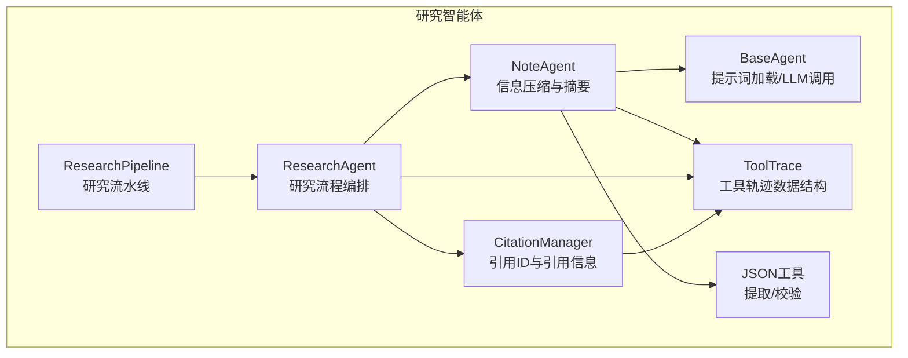
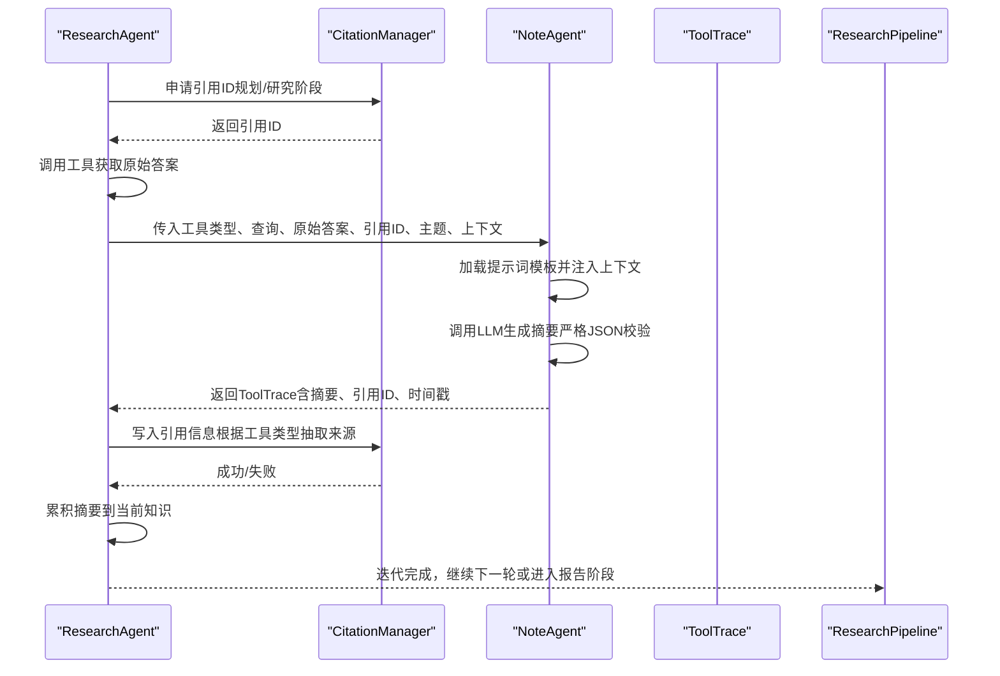
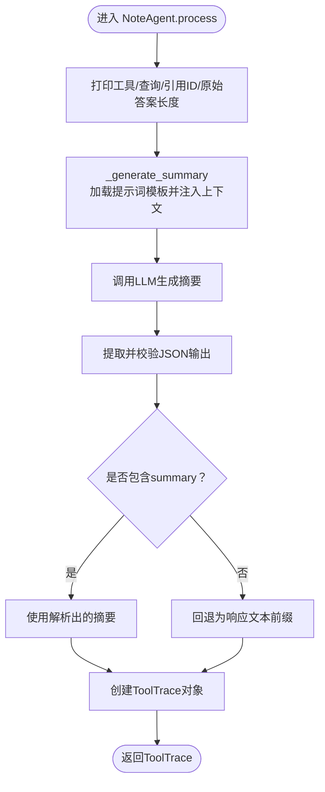
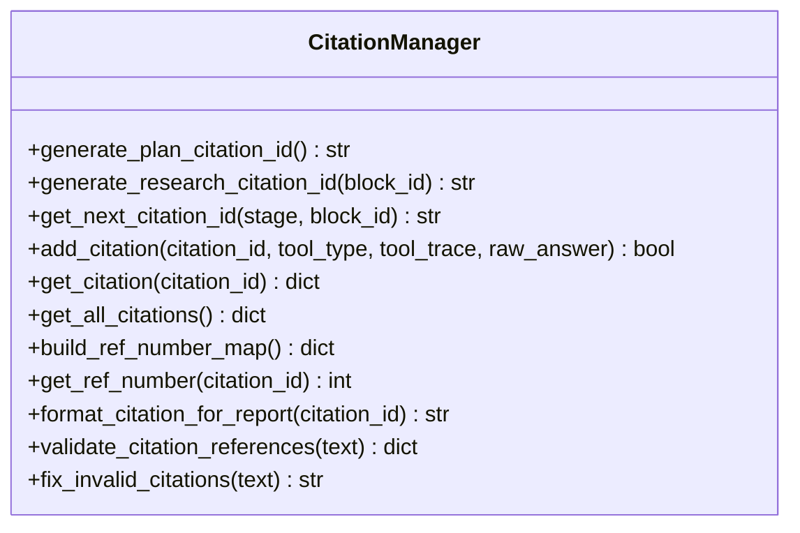
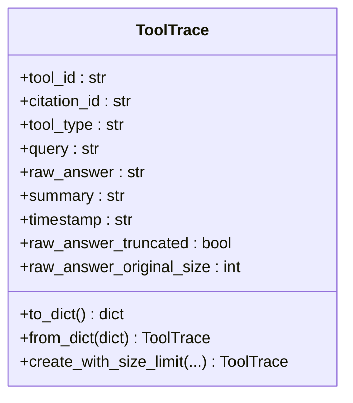
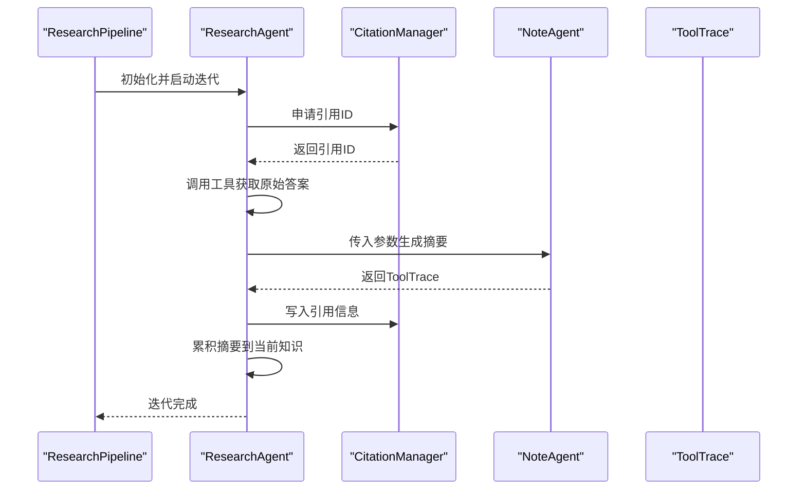
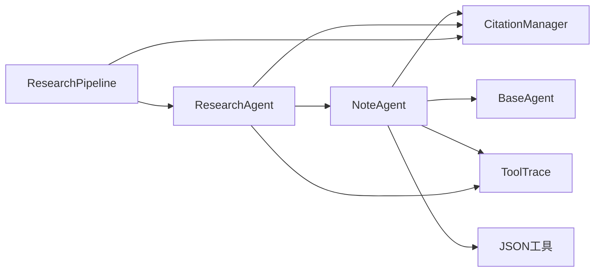

# 记录智能体

<cite>
**本文引用的文件**
- [note_agent.py](file://src/agents/research/agents/note_agent.py)
- [citation_manager.py](file://src/agents/research/utils/citation_manager.py)
- [data_structures.py](file://src/agents/research/data_structures.py)
- [json_utils.py](file://src/agents/research/utils/json_utils.py)
- [base_agent.py](file://src/agents/research/agents/base_agent.py)
- [research_agent.py](file://src/agents/research/agents/research_agent.py)
- [research_pipeline.py](file://src/agents/research/research_pipeline.py)
- [note_agent.yaml](file://src/agents/research/prompts/cn/note_agent.yaml)
- [citation_memory.py](file://src/agents/solve/memory/citation_memory.py)
</cite>

## 目录
1. [简介](#简介)
2. [项目结构](#项目结构)
3. [核心组件](#核心组件)
4. [架构总览](#架构总览)
5. [详细组件分析](#详细组件分析)
6. [依赖关系分析](#依赖关系分析)
7. [性能考量](#性能考量)
8. [故障排查指南](#故障排查指南)
9. [结论](#结论)
10. [附录](#附录)

## 简介
本文件面向“记录智能体”（NoteAgent），系统性阐述其在研究循环中的职责与实现细节，重点覆盖以下方面：
- 信息压缩与摘要生成：如何接收原始工具输出（如RAG检索结果、网页搜索内容），结合查询上下文与主题信息，生成结构化、去冗余的知识摘要。
- 与引用管理器（CitationManager）的协作：如何基于统一的引用ID生成策略，确保引用一致性与可追溯性。
- 摘要累积与知识沉淀：如何将摘要写入当前知识库（通过ResearchAgent的迭代累积），并在最终报告中体现。
- 输入参数与输出格式：明确NoteAgent的输入（tool_type, query, raw_answer, citation_id, topic, context）与输出（ToolTrace）。
- 在研究循环中的作用：作为知识沉淀的关键环节，贯穿规划、研究、报告阶段。

## 项目结构
NoteAgent位于研究智能体子系统中，与工具调用、引用管理、数据结构、提示词加载等模块协同工作。其主要依赖如下：
- 基类：继承自研究智能体基类，统一加载提示词、模型参数与LLM调用接口。
- 数据结构：使用ToolTrace承载一次工具调用的完整轨迹（含引用ID、工具类型、查询、原始答案、摘要、时间戳等）。
- JSON工具：从LLM输出中稳健提取JSON对象，保证摘要结构化。
- 引用管理器：提供统一的引用ID生成与持久化能力，支持多工具类型的引用信息抽取与格式化。

图表来源
- [research_pipeline.py](file://src/agents/research/research_pipeline.py#L160-L179)
- [research_agent.py](file://src/agents/research/agents/research_agent.py#L619-L674)
- [note_agent.py](file://src/agents/research/agents/note_agent.py#L27-L81)
- [data_structures.py](file://src/agents/research/data_structures.py#L40-L70)
- [json_utils.py](file://src/agents/research/utils/json_utils.py#L14-L56)
- [citation_manager.py](file://src/agents/research/utils/citation_manager.py#L86-L119)

章节来源
- [research_pipeline.py](file://src/agents/research/research_pipeline.py#L160-L179)
- [research_agent.py](file://src/agents/research/agents/research_agent.py#L619-L674)
- [note_agent.py](file://src/agents/research/agents/note_agent.py#L27-L81)
- [data_structures.py](file://src/agents/research/data_structures.py#L40-L70)
- [json_utils.py](file://src/agents/research/utils/json_utils.py#L14-L56)
- [citation_manager.py](file://src/agents/research/utils/citation_manager.py#L86-L119)

## 核心组件
- 记录智能体（NoteAgent）
  - 职责：将工具返回的原始输出压缩为结构化摘要；创建ToolTrace对象，携带引用ID、工具类型、查询、原始答案、摘要与时间戳。
  - 关键点：使用提示词模板注入上下文（工具类型、查询、主题、上下文），调用LLM生成摘要；严格校验JSON输出，缺失时回退为前缀文本。
- 引用管理器（CitationManager）
  - 职责：统一生成引用ID（规划阶段PLAN-XX、研究阶段CIT-X-XX），持久化引用信息，支持多工具类型（RAG、网页搜索、论文搜索、代码执行）的引用抽取与格式化。
  - 关键点：异步安全的ID生成与引用添加；构建引用编号映射，支持去重与排序。
- 数据结构（ToolTrace）
  - 职责：标准化一次工具调用的完整轨迹，包含原始答案大小限制与截断策略，便于后续报告与引用展示。
- JSON工具（json_utils）
  - 职责：从LLM输出中提取JSON对象，提供严格校验与错误处理，保障摘要结构化。
- 基类（BaseAgent）
  - 职责：统一加载提示词、模型参数与LLM调用接口，提供日志与令牌追踪能力。

章节来源
- [note_agent.py](file://src/agents/research/agents/note_agent.py#L27-L164)
- [citation_manager.py](file://src/agents/research/utils/citation_manager.py#L86-L119)
- [data_structures.py](file://src/agents/research/data_structures.py#L40-L171)
- [json_utils.py](file://src/agents/research/utils/json_utils.py#L14-L98)
- [base_agent.py](file://src/agents/research/agents/base_agent.py#L142-L260)

## 架构总览
NoteAgent在研究循环中的位置与交互如下：
- ResearchAgent在每次迭代中先调用工具获取原始答案，再向CitationManager申请引用ID，随后调用NoteAgent生成摘要并创建ToolTrace，最后将引用信息写入CitationManager。
- ResearchAgent将最新摘要累积到当前知识中，供后续迭代使用，形成“检索—记录—累积”的闭环。

图表来源
- [research_agent.py](file://src/agents/research/agents/research_agent.py#L619-L674)
- [note_agent.py](file://src/agents/research/agents/note_agent.py#L27-L81)
- [citation_manager.py](file://src/agents/research/utils/citation_manager.py#L234-L282)
- [data_structures.py](file://src/agents/research/data_structures.py#L40-L70)

章节来源
- [research_agent.py](file://src/agents/research/agents/research_agent.py#L619-L674)
- [note_agent.py](file://src/agents/research/agents/note_agent.py#L27-L81)
- [citation_manager.py](file://src/agents/research/utils/citation_manager.py#L234-L282)
- [data_structures.py](file://src/agents/research/data_structures.py#L40-L70)

## 详细组件分析

### 组件A：记录智能体（NoteAgent）
- 输入参数
  - tool_type：工具类型（如 rag_naive、rag_hybrid、web_search、paper_search、run_code、query_item）
  - query：查询语句
  - raw_answer：工具返回的原始答案（字符串，可能为JSON）
  - citation_id：引用ID（必须由CitationManager生成）
  - topic：主题（用于上下文）
  - context：额外上下文（用于知识累积）
- 处理流程
  - 打印调试信息，显示工具类型、查询、引用ID与原始答案长度。
  - 调用内部摘要生成函数，加载系统提示与用户提示模板，注入上下文变量，调用LLM生成摘要。
  - 严格解析JSON输出，确保包含“summary”字段；若失败则回退为响应文本前缀。
  - 创建ToolTrace对象，填充工具ID、引用ID、工具类型、查询、原始答案、摘要与时间戳。
- 输出格式
  - ToolTrace对象，包含字段：tool_id、citation_id、tool_type、query、raw_answer、summary、timestamp、raw_answer_truncated、raw_answer_original_size。

图表来源
- [note_agent.py](file://src/agents/research/agents/note_agent.py#L27-L164)
- [json_utils.py](file://src/agents/research/utils/json_utils.py#L14-L56)

章节来源
- [note_agent.py](file://src/agents/research/agents/note_agent.py#L27-L164)
- [json_utils.py](file://src/agents/research/utils/json_utils.py#L14-L56)

### 组件B：引用管理器（CitationManager）
- 引用ID生成
  - 规划阶段：PLAN-XX格式（递增计数器）
  - 研究阶段：CIT-X-XX格式（基于块ID的块号与序列号）
- 引用信息抽取
  - 支持多种工具类型：RAG检索（源文档）、网页搜索（URL）、论文搜索（多篇）、代码执行（查询即代码内容）、未知工具（通用格式）。
- 引用编号映射
  - 构建引用ID到参考编号的映射，支持去重（论文搜索以标题+首作者为去重键），并按ID排序输出。
- 异步安全
  - 提供异步版本的ID生成、引用添加与计数器操作，保证并发安全。

图表来源
- [citation_manager.py](file://src/agents/research/utils/citation_manager.py#L86-L119)
- [citation_manager.py](file://src/agents/research/utils/citation_manager.py#L234-L282)
- [citation_manager.py](file://src/agents/research/utils/citation_manager.py#L639-L708)

章节来源
- [citation_manager.py](file://src/agents/research/utils/citation_manager.py#L86-L119)
- [citation_manager.py](file://src/agents/research/utils/citation_manager.py#L234-L282)
- [citation_manager.py](file://src/agents/research/utils/citation_manager.py#L639-L708)

### 组件C：数据结构（ToolTrace）
- 字段
  - tool_id：工具调用唯一ID
  - citation_id：引用ID
  - tool_type：工具类型
  - query：查询语句
  - raw_answer：原始答案（可能截断）
  - summary：摘要
  - timestamp：时间戳
  - raw_answer_truncated：是否截断
  - raw_answer_original_size：原始大小
- 截断策略
  - 默认最大大小约50KB；优先尝试解析JSON并截断长字段，否则简单截断并附加标记。

图表来源
- [data_structures.py](file://src/agents/research/data_structures.py#L40-L171)

章节来源
- [data_structures.py](file://src/agents/research/data_structures.py#L40-L171)

### 组件D：提示词与基类（BaseAgent、提示词）
- 提示词
  - NoteAgent提示词包含系统角色与摘要生成流程，强调结构化输出（JSON），保留公式、表格、代码、列表等元素，要求摘要长度与完整性。
- 基类能力
  - 统一加载提示词（支持zh/cn/en多语言回退）、模型参数、LLM调用接口与令牌追踪。

章节来源
- [note_agent.yaml](file://src/agents/research/prompts/cn/note_agent.yaml#L1-L122)
- [base_agent.py](file://src/agents/research/agents/base_agent.py#L74-L141)
- [base_agent.py](file://src/agents/research/agents/base_agent.py#L170-L260)

### 组件E：研究循环中的协作（ResearchAgent、ResearchPipeline）
- ResearchAgent在每次迭代中：
  - 获取引用ID（支持同步/异步）
  - 调用工具获取原始答案
  - 调用NoteAgent生成摘要并创建ToolTrace
  - 将引用信息写入CitationManager
  - 累积摘要到当前知识
- ResearchPipeline初始化各Agent与工具实例，建立统一的日志与缓存目录。

图表来源
- [research_pipeline.py](file://src/agents/research/research_pipeline.py#L160-L179)
- [research_agent.py](file://src/agents/research/agents/research_agent.py#L619-L674)
- [note_agent.py](file://src/agents/research/agents/note_agent.py#L27-L81)
- [data_structures.py](file://src/agents/research/data_structures.py#L40-L70)

章节来源
- [research_pipeline.py](file://src/agents/research/research_pipeline.py#L160-L179)
- [research_agent.py](file://src/agents/research/agents/research_agent.py#L619-L674)
- [note_agent.py](file://src/agents/research/agents/note_agent.py#L27-L81)
- [data_structures.py](file://src/agents/research/data_structures.py#L40-L70)

## 依赖关系分析
- NoteAgent依赖
  - BaseAgent：提示词加载、LLM调用、日志与令牌追踪
  - ToolTrace：标准化输出
  - JSON工具：稳健提取与校验
  - CitationManager：引用ID生成（外部依赖，NoteAgent不直接生成）
- CitationManager依赖
  - 文件系统：持久化引用信息至JSON
  - 正则表达式：校验与修复引用
  - 异步锁：并发安全
- ResearchAgent与ResearchPipeline
  - 协调工具调用、引用ID申请、摘要生成、引用信息写入与知识累积

图表来源
- [note_agent.py](file://src/agents/research/agents/note_agent.py#L27-L81)
- [base_agent.py](file://src/agents/research/agents/base_agent.py#L170-L260)
- [data_structures.py](file://src/agents/research/data_structures.py#L40-L70)
- [json_utils.py](file://src/agents/research/utils/json_utils.py#L14-L56)
- [citation_manager.py](file://src/agents/research/utils/citation_manager.py#L86-L119)
- [research_agent.py](file://src/agents/research/agents/research_agent.py#L619-L674)
- [research_pipeline.py](file://src/agents/research/research_pipeline.py#L160-L179)

章节来源
- [note_agent.py](file://src/agents/research/agents/note_agent.py#L27-L81)
- [base_agent.py](file://src/agents/research/agents/base_agent.py#L170-L260)
- [data_structures.py](file://src/agents/research/data_structures.py#L40-L70)
- [json_utils.py](file://src/agents/research/utils/json_utils.py#L14-L56)
- [citation_manager.py](file://src/agents/research/utils/citation_manager.py#L86-L119)
- [research_agent.py](file://src/agents/research/agents/research_agent.py#L619-L674)
- [research_pipeline.py](file://src/agents/research/research_pipeline.py#L160-L179)

## 性能考量
- 原始答案截断：ToolTrace默认限制约50KB，优先解析JSON并截断长字段，避免LLM上下文溢出与内存压力。
- JSON稳健提取：从LLM输出中提取JSON，减少格式错误导致的重试成本。
- 并发安全：CitationManager提供异步版本的ID生成与引用添加，适合并行模式运行。
- 日志与令牌追踪：BaseAgent统一记录LLM调用耗时与令牌用量，便于性能监控与优化。

章节来源
- [data_structures.py](file://src/agents/research/data_structures.py#L61-L114)
- [json_utils.py](file://src/agents/research/utils/json_utils.py#L14-L56)
- [citation_manager.py](file://src/agents/research/utils/citation_manager.py#L737-L797)
- [base_agent.py](file://src/agents/research/agents/base_agent.py#L210-L249)

## 故障排查指南
- 提示词缺失
  - 现象：NoteAgent抛出缺少系统角色或摘要生成提示词的异常。
  - 处理：检查提示词文件路径与语言配置，确保存在对应提示词。
- JSON解析失败
  - 现象：摘要未包含summary字段或JSON格式不合法。
  - 处理：查看LLM输出是否符合JSON格式要求；必要时放宽输出约束或修正提示词。
- 引用ID冲突
  - 现象：重复引用ID或引用编号不一致。
  - 处理：确认CitationManager的计数器状态已从持久化文件恢复；检查异步并发下的锁机制。
- 引用信息不完整
  - 现象：引用信息抽取失败（如RAG源文档字段名不一致）。
  - 处理：检查工具返回的原始答案字段命名；必要时扩展抽取逻辑。

章节来源
- [note_agent.py](file://src/agents/research/agents/note_agent.py#L109-L155)
- [note_agent.yaml](file://src/agents/research/prompts/cn/note_agent.yaml#L1-L122)
- [json_utils.py](file://src/agents/research/utils/json_utils.py#L14-L56)
- [citation_manager.py](file://src/agents/research/utils/citation_manager.py#L113-L169)
- [citation_manager.py](file://src/agents/research/utils/citation_manager.py#L283-L472)

## 结论
NoteAgent在研究循环中承担“信息压缩与摘要生成”的关键职责，通过严格的提示词设计与JSON输出校验，确保摘要结构化、可复用。配合CitationManager的统一引用ID生成与引用信息抽取，实现了从工具调用到知识沉淀的闭环。ResearchAgent在每次迭代中有序地完成引用ID申请、摘要生成、引用信息写入与知识累积，最终推动研究任务向报告阶段推进。

## 附录
- 输入参数与输出格式
  - 输入：tool_type、query、raw_answer、citation_id、topic、context
  - 输出：ToolTrace（包含tool_id、citation_id、tool_type、query、raw_answer、summary、timestamp、raw_answer_truncated、raw_answer_original_size）
- 在研究循环中的作用
  - 作为知识沉淀的关键环节，每轮迭代后将摘要累积到当前知识，为后续检索与总结提供基础。

章节来源
- [note_agent.py](file://src/agents/research/agents/note_agent.py#L27-L81)
- [data_structures.py](file://src/agents/research/data_structures.py#L40-L70)
- [research_agent.py](file://src/agents/research/agents/research_agent.py#L675-L697)