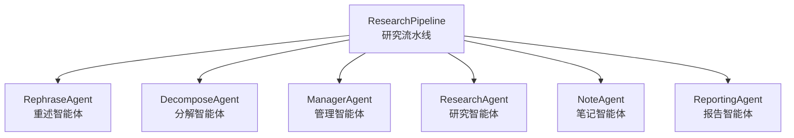
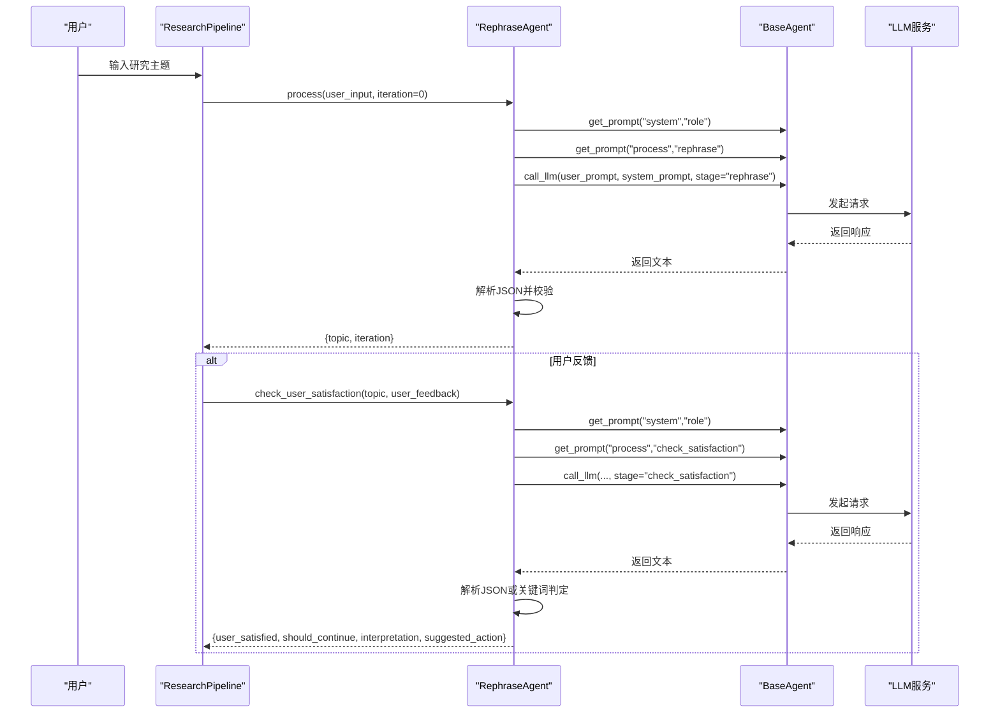
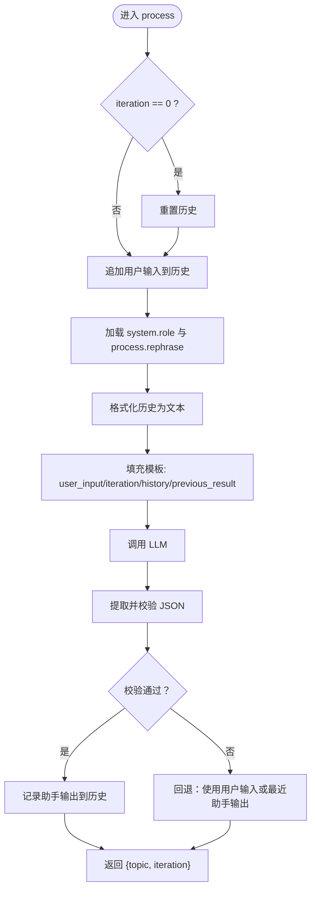
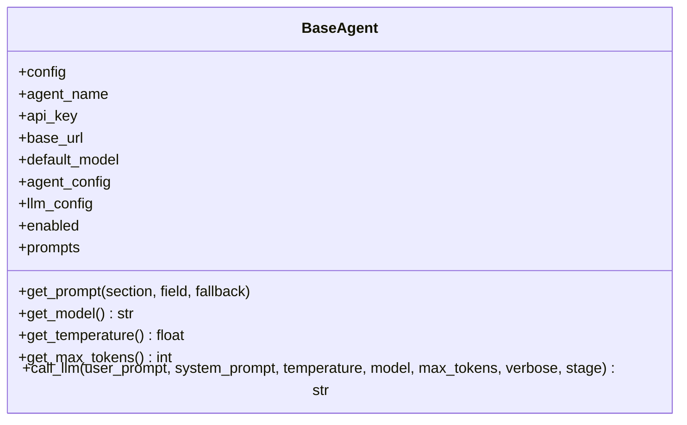
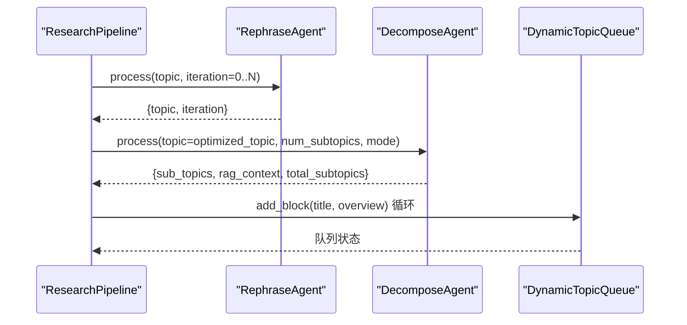
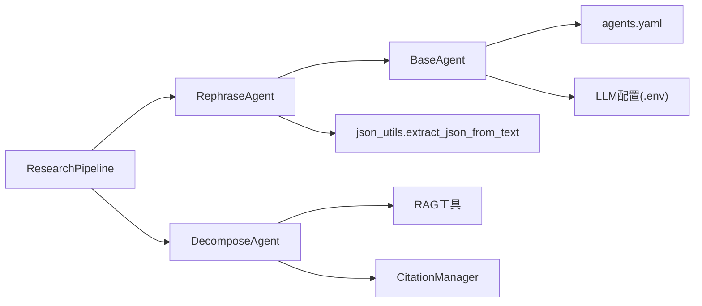

# 重述智能体

<cite>
**本文引用的文件列表**
- [rephrase_agent.py](file://src/agents/research/agents/rephrase_agent.py)
- [rephrase_agent.yaml（中文）](file://src/agents/research/prompts/cn/rephrase_agent.yaml)
- [rephrase_agent.yaml（英文）](file://src/agents/research/prompts/en/rephrase_agent.yaml)
- [base_agent.py](file://src/agents/research/agents/base_agent.py)
- [research_pipeline.py](file://src/agents/research/research_pipeline.py)
- [decompose_agent.py](file://src/agents/research/agents/decompose_agent.py)
- [agents.yaml](file://config/agents.yaml)
- [json_utils.py](file://src/agents/research/utils/json_utils.py)
- [data_structures.py](file://src/agents/research/data_structures.py)
</cite>

## 目录
1. [引言](#引言)
2. [项目结构与定位](#项目结构与定位)
3. [核心组件](#核心组件)
4. [架构总览](#架构总览)
5. [详细组件分析](#详细组件分析)
6. [依赖关系分析](#依赖关系分析)
7. [性能与稳定性考量](#性能与稳定性考量)
8. [故障排查指南](#故障排查指南)
9. [结论](#结论)
10. [附录：输入输出与提示模板规范](#附录输入输出与提示模板规范)

## 引言
本文件面向开发者与产品人员，系统化阐述“重述智能体（RephraseAgent）”在DeepTutor研究流程中的关键作用与实现细节。重述智能体位于研究流程前端，负责将用户的原始查询转化为清晰、具体、可执行的研究主题，并支持多轮交互式优化，从而显著提升后续规划与研究阶段的质量与效率。本文将从系统架构、数据流、处理逻辑、错误处理、性能与稳定性、集成方式等方面进行深入解析，并提供可视化图示帮助理解。

## 项目结构与定位
- 重述智能体属于研究模块（research），与分解智能体（DecomposeAgent）、管理智能体（ManagerAgent）、研究智能体（ResearchAgent）、笔记智能体（NoteAgent）、报告智能体（ReportingAgent）共同构成完整的DR-in-KG研究流水线。
- 研究流水线在规划阶段首先调用重述智能体进行主题优化，再由分解智能体生成子主题并入队，随后进入动态研究循环。

图表来源
- [research_pipeline.py](file://src/agents/research/research_pipeline.py#L160-L176)
- [decompose_agent.py](file://src/agents/research/agents/decompose_agent.py#L1-L40)

章节来源
- [research_pipeline.py](file://src/agents/research/research_pipeline.py#L490-L702)

## 核心组件
- 重述智能体（RephraseAgent）
  - 职责：接收用户输入或用户反馈，基于提示工程生成优化后的研究主题；支持多轮迭代；提供用户满意度判定能力。
  - 关键特性：会话历史记录、多语言提示加载、统一LLM调用封装、严格JSON输出解析与回退策略。
- 基类（BaseAgent）
  - 职责：统一加载提示词、模型参数、温度与最大token、LLM调用封装、日志与令牌统计。
- 研究流水线（ResearchPipeline）
  - 职责：编排规划、研究、报告三阶段；在规划阶段协调重述与分解；在CLI模式下与用户交互确认优化结果。
- 分解智能体（DecomposeAgent）
  - 职责：将优化后的主主题分解为若干子主题，并生成概览；支持手动/自动两种模式及RAG背景检索。
- 配置中心（agents.yaml）
  - 职责：统一管理各模块的温度与最大token等全局参数，确保一致性与可调性。

章节来源
- [rephrase_agent.py](file://src/agents/research/agents/rephrase_agent.py#L18-L156)
- [base_agent.py](file://src/agents/research/agents/base_agent.py#L27-L120)
- [research_pipeline.py](file://src/agents/research/research_pipeline.py#L490-L702)
- [decompose_agent.py](file://src/agents/research/agents/decompose_agent.py#L23-L79)
- [agents.yaml](file://config/agents.yaml#L16-L21)

## 架构总览
重述智能体在研究流水线中的位置如下：

图表来源
- [research_pipeline.py](file://src/agents/research/research_pipeline.py#L506-L591)
- [rephrase_agent.py](file://src/agents/research/agents/rephrase_agent.py#L54-L156)
- [base_agent.py](file://src/agents/research/agents/base_agent.py#L170-L259)

章节来源
- [research_pipeline.py](file://src/agents/research/research_pipeline.py#L490-L702)
- [rephrase_agent.py](file://src/agents/research/agents/rephrase_agent.py#L18-L156)
- [base_agent.py](file://src/agents/research/agents/base_agent.py#L142-L259)

## 详细组件分析

### 重述智能体（RephraseAgent）
- 多轮对话历史
  - 维护会话历史，按轮次记录用户输入与助手输出，用于上下文增强与一致性保证。
- 主要方法
  - process(user_input, iteration, previous_result)
    - 根据迭代轮次与历史，构造用户提示模板，调用LLM生成优化主题；解析JSON并校验必要字段；记录历史。
  - check_user_satisfaction(rephrase_result, user_feedback)
    - 解析用户反馈，判断是否满意、是否需要继续优化；若JSON解析失败则采用关键词规则回退。
- 错误处理与回退
  - 提示缺失：抛出明确错误，指导配置路径。
  - JSON解析失败：回退到使用用户输入或最近一次助手输出作为topic。
  - 关键词回退：当无法解析JSON时，基于关键词集合判断用户意图。
- 与流水线的交互
  - 在规划阶段被调用，支持CLI模式下的用户确认与前端模式下的单轮优化。

图表来源
- [rephrase_agent.py](file://src/agents/research/agents/rephrase_agent.py#L54-L156)
- [json_utils.py](file://src/agents/research/utils/json_utils.py#L14-L56)

章节来源
- [rephrase_agent.py](file://src/agents/research/agents/rephrase_agent.py#L18-L156)
- [json_utils.py](file://src/agents/research/utils/json_utils.py#L14-L56)

### 基类（BaseAgent）
- 统一提示加载
  - 自动选择语言目录（zh/cn/en），并带回退策略；缓存已加载提示，避免重复IO。
- 统一LLM调用
  - 读取统一配置（agents.yaml）中的温度与最大token；封装openai风格接口；记录耗时与令牌使用；支持verbose输出。
- 工具函数
  - get_prompt(section, field)：安全获取模板；get_model()/get_temperature()/get_max_tokens()：统一参数来源。

图表来源
- [base_agent.py](file://src/agents/research/agents/base_agent.py#L27-L259)
- [agents.yaml](file://config/agents.yaml#L16-L21)

章节来源
- [base_agent.py](file://src/agents/research/agents/base_agent.py#L27-L259)
- [agents.yaml](file://config/agents.yaml#L16-L21)

### 研究流水线（ResearchPipeline）
- 规划阶段
  - 调用重述智能体进行主题优化，支持多轮迭代与用户确认；CLI模式下交互式确认，前端模式下单轮优化。
  - 将优化后主题交由分解智能体生成子主题并入队。
- 研究阶段
  - 由管理智能体调度队列，研究智能体逐块执行工具调用与知识检索，笔记智能体汇总摘要，最终由报告智能体生成报告。

图表来源
- [research_pipeline.py](file://src/agents/research/research_pipeline.py#L490-L702)
- [decompose_agent.py](file://src/agents/research/agents/decompose_agent.py#L54-L120)
- [data_structures.py](file://src/agents/research/data_structures.py#L225-L320)

章节来源
- [research_pipeline.py](file://src/agents/research/research_pipeline.py#L490-L702)
- [decompose_agent.py](file://src/agents/research/agents/decompose_agent.py#L54-L120)
- [data_structures.py](file://src/agents/research/data_structures.py#L225-L320)

### 分解智能体（DecomposeAgent）
- 功能要点
  - 支持手动/自动两种模式；在自动模式下先做RAG检索以获得背景知识，再生成子主题。
  - 在手动模式下先生成子查询，再执行RAG检索，最后生成子主题。
  - 可禁用RAG直接由LLM生成子主题。
- 与重述智能体的关系
  - 接收来自重述智能体优化后的主主题，作为分解输入，确保后续研究主题明确、可执行。

章节来源
- [decompose_agent.py](file://src/agents/research/agents/decompose_agent.py#L23-L120)

## 依赖关系分析
- 内部依赖
  - RephraseAgent 依赖 BaseAgent 的提示加载与LLM调用封装；依赖 JSON 工具进行稳健解析；依赖研究流水线的规划阶段控制。
  - BaseAgent 依赖 agents.yaml 的统一参数配置；依赖环境变量中的LLM配置；依赖统一的日志与令牌追踪。
  - DecomposeAgent 依赖 RAG工具与引用管理器；在规划阶段被研究流水线调用。
- 外部依赖
  - LLM服务（OpenAI兼容接口）；工具链（RAG、网络搜索、论文搜索、代码执行等）。

图表来源
- [rephrase_agent.py](file://src/agents/research/agents/rephrase_agent.py#L14-L20)
- [base_agent.py](file://src/agents/research/agents/base_agent.py#L27-L120)
- [research_pipeline.py](file://src/agents/research/research_pipeline.py#L490-L702)
- [decompose_agent.py](file://src/agents/research/agents/decompose_agent.py#L14-L50)
- [agents.yaml](file://config/agents.yaml#L16-L21)

章节来源
- [rephrase_agent.py](file://src/agents/research/agents/rephrase_agent.py#L14-L20)
- [base_agent.py](file://src/agents/research/agents/base_agent.py#L27-L120)
- [research_pipeline.py](file://src/agents/research/research_pipeline.py#L490-L702)
- [decompose_agent.py](file://src/agents/research/agents/decompose_agent.py#L14-L50)
- [agents.yaml](file://config/agents.yaml#L16-L21)

## 性能与稳定性考量
- 温度与最大token
  - 研究模块统一温度为0.5，最大token为12000，兼顾创造性与稳定性；可在agents.yaml中调整。
- JSON解析稳健性
  - 使用正则提取、代码块剥离、片段匹配等策略，提高对LLM输出的容错能力；解析失败时回退策略保障流程不中断。
- LLM调用封装
  - 统一超时与重试机制（在工具层体现），避免单次调用失败导致整条流水线阻塞。
- 日志与统计
  - 记录每次LLM调用耗时与令牌消耗，便于成本与性能分析。

章节来源
- [agents.yaml](file://config/agents.yaml#L16-L21)
- [json_utils.py](file://src/agents/research/utils/json_utils.py#L14-L56)
- [base_agent.py](file://src/agents/research/agents/base_agent.py#L170-L259)

## 故障排查指南
- 缺少提示文件
  - 现象：启动时报错提示缺少system.role或process.rephrase。
  - 处理：检查提示文件是否存在，语言目录应为zh/cn/en之一；若zh不存在则回退至cn，否则回退至en。
- JSON解析失败
  - 现象：重述结果未包含topic或结构异常。
  - 处理：重述智能体会回退到使用用户输入或最近一次助手输出；建议修正提示模板，确保输出严格为JSON对象。
- 用户反馈无法解析
  - 现象：check_user_satisfaction无法解析JSON。
  - 处理：采用关键词规则回退；建议引导用户提供明确的“满意/修改”语义。
- LLM调用异常
  - 现象：调用失败或超时。
  - 处理：查看日志中的错误信息；检查环境变量中的LLM配置；适当增加超时与重试次数。

章节来源
- [rephrase_agent.py](file://src/agents/research/agents/rephrase_agent.py#L94-L117)
- [rephrase_agent.py](file://src/agents/research/agents/rephrase_agent.py#L124-L156)
- [rephrase_agent.py](file://src/agents/research/agents/rephrase_agent.py#L182-L203)
- [base_agent.py](file://src/agents/research/agents/base_agent.py#L170-L259)

## 结论
重述智能体通过多轮提示工程与稳健的JSON解析策略，将用户的模糊输入转化为高质量的研究主题，显著提升了研究流程的起点质量。它与分解智能体、管理智能体、研究智能体、笔记智能体、报告智能体协同工作，形成从“主题优化—子题分解—动态研究—报告产出”的闭环。开发者可通过agents.yaml统一调节参数，利用统一的LLM调用封装与日志统计体系，持续优化系统的稳定性与性能。

## 附录：输入输出与提示模板规范

### 输入输出规范
- process(user_input, iteration, previous_result)
  - 输入：用户输入（首次为原始主题，后续为用户反馈）；迭代轮次；上一轮结果（兼容字段）。
  - 输出：字典，包含“topic”（优化后的研究主题）与“iteration”（当前轮次）。
- check_user_satisfaction(rephrase_result, user_feedback)
  - 输入：当前重述结果与用户反馈。
  - 输出：字典，包含“user_satisfied”“should_continue”“interpretation”“suggested_action”。

章节来源
- [rephrase_agent.py](file://src/agents/research/agents/rephrase_agent.py#L54-L156)
- [rephrase_agent.py](file://src/agents/research/agents/rephrase_agent.py#L158-L246)

### 提示模板设计
- system.role
  - 定义角色职责：将用户研究需求转化为清晰、具体、可执行的研究主题。
- process.rephrase
  - 优化维度：研究主题、研究重点、研究范围、优化理由。
  - 输出要求：仅输出JSON对象，包含“topic”字段；长度不超过用户输入的两倍；迭代0聚焦优化，迭代>0基于反馈调整。
- process.check_satisfaction
  - 判断维度：是否明确表达满意/不满意、是否提出具体修改要求、反馈是肯定性还是否定性。
  - 判定标准：明确满意/同意/好等为满意；要求修改或提出意见为需继续；模糊反馈倾向继续优化。

章节来源
- [rephrase_agent.yaml（中文）](file://src/agents/research/prompts/cn/rephrase_agent.yaml#L1-L59)
- [rephrase_agent.yaml（英文）](file://src/agents/research/prompts/en/rephrase_agent.yaml#L1-L59)

### 与分解智能体的集成方式
- 流程顺序
  - 先由重述智能体优化主题，再由分解智能体将优化后的主题分解为若干子主题并入队。
- 参数传递
  - 优化后的主主题作为分解输入；分解模式（手动/自动）与期望子题数量由配置决定。
- 引用与溯源
  - 分解阶段可能使用RAG检索背景知识，引用管理器会记录工具调用轨迹，便于后续报告引用。

章节来源
- [research_pipeline.py](file://src/agents/research/research_pipeline.py#L615-L699)
- [decompose_agent.py](file://src/agents/research/agents/decompose_agent.py#L190-L321)
- [data_structures.py](file://src/agents/research/data_structures.py#L225-L320)