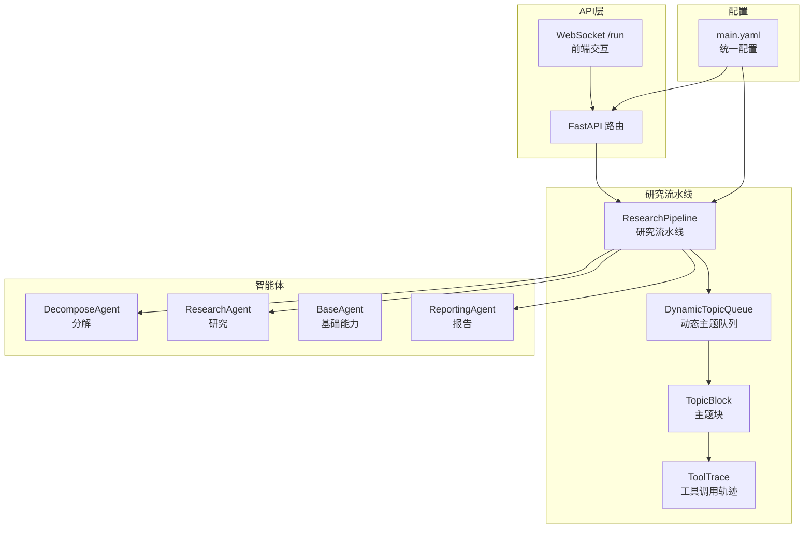
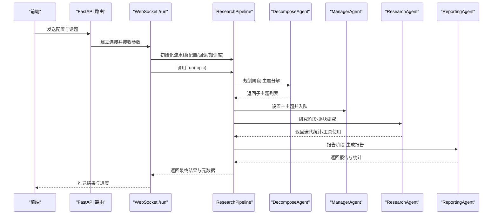
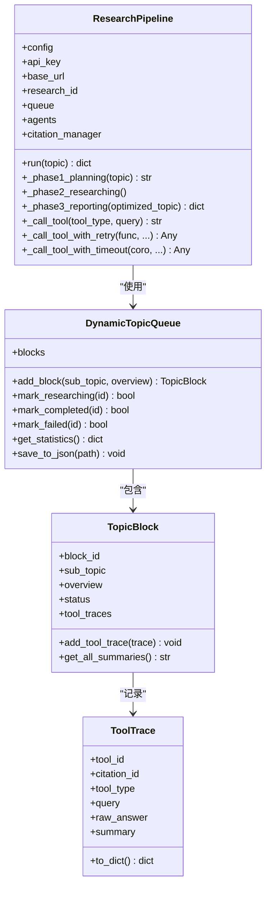
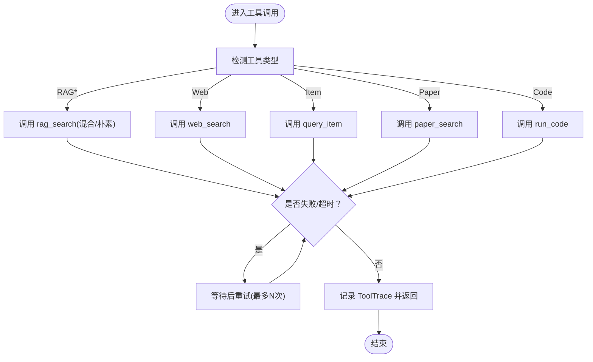
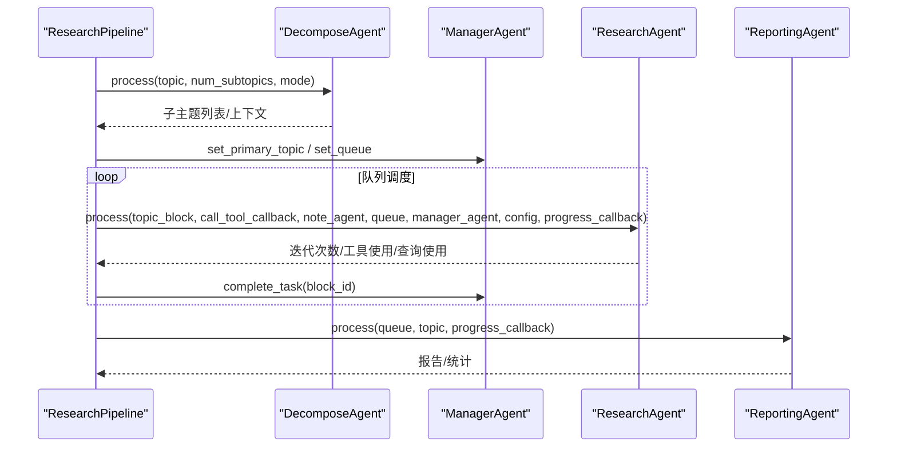
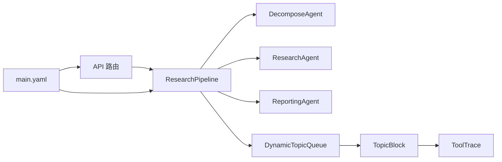
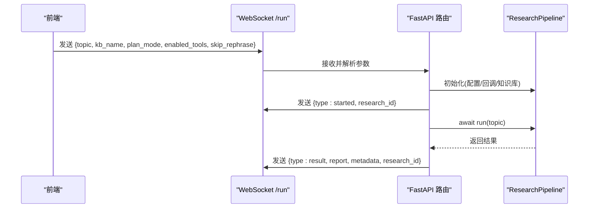

# 研究流程管理

<cite>
**本文引用的文件**
- [research_pipeline.py](file://src/agents/research/research_pipeline.py)
- [main.py](file://src/agents/research/main.py)
- [data_structures.py](file://src/agents/research/data_structures.py)
- [research.py](file://src/api/routers/research.py)
- [main.py](file://src/api/main.py)
- [main.yaml](file://config/main.yaml)
- [decompose_agent.py](file://src/agents/research/agents/decompose_agent.py)
- [research_agent.py](file://src/agents/research/agents/research_agent.py)
- [reporting_agent.py](file://src/agents/research/agents/reporting_agent.py)
</cite>

## 目录
1. [简介](#简介)
2. [项目结构](#项目结构)
3. [核心组件](#核心组件)
4. [架构总览](#架构总览)
5. [详细组件分析](#详细组件分析)
6. [依赖关系分析](#依赖关系分析)
7. [性能考量](#性能考量)
8. [故障排查指南](#故障排查指南)
9. [结论](#结论)
10. [附录：API与调用示例](#附录api与调用示例)

## 简介
本文件围绕研究流程管理展开，重点解析研究任务在 DR-in-KG 2.0 中的生命周期：从任务初始化、阶段调度到状态追踪；详解 ResearchPipeline 如何协调多个智能体（分解、研究、报告）完成端到端研究；梳理工具调用与超时重试机制；结合数据结构 ResearchTask/ResearchState 的设计说明数据流转；并提供面向初学者的流程图与面向高级用户的性能优化建议。

## 项目结构
研究流程管理主要由以下模块构成：
- 研究流水线与入口：ResearchPipeline、CLI 入口 main.py
- 数据结构：动态主题队列与块、工具调用轨迹
- 智能体：分解、研究、报告等 Agent
- API 层：WebSocket 接口，支持前端实时进度推送
- 配置：统一配置 main.yaml，包含规划、研究、报告、队列、工具等参数

图表来源
- [research_pipeline.py](file://src/agents/research/research_pipeline.py#L65-L120)
- [data_structures.py](file://src/agents/research/data_structures.py#L225-L451)
- [research.py](file://src/api/routers/research.py#L81-L120)
- [main.py](file://src/api/main.py#L69-L81)
- [main.yaml](file://config/main.yaml#L65-L142)

章节来源
- [research_pipeline.py](file://src/agents/research/research_pipeline.py#L65-L120)
- [data_structures.py](file://src/agents/research/data_structures.py#L225-L451)
- [research.py](file://src/api/routers/research.py#L81-L120)
- [main.py](file://src/api/main.py#L69-L81)
- [main.yaml](file://config/main.yaml#L65-L142)

## 核心组件
- ResearchPipeline：研究流水线核心，负责三阶段编排、工具调用、超时与重试、日志与进度回调、结果持久化。
- 动态主题队列 DynamicTopicQueue：承载研究主题块 TopicBlock，维护状态、统计与自动持久化。
- 工具调用轨迹 ToolTrace：记录单次工具调用的输入、输出、摘要与截断信息。
- 智能体：
  - DecomposeAgent：主题分解，生成子主题与概览，并可结合 RAG 上下文。
  - ResearchAgent：研究循环，基于迭代模式与可用工具进行探索与决策。
  - ReportingAgent：报告生成，去重清洗、大纲生成、正文撰写与引用标注。
- API 路由：WebSocket /run 提供前端交互与进度推送，支持统一配置注入与任务状态管理。

章节来源
- [research_pipeline.py](file://src/agents/research/research_pipeline.py#L65-L120)
- [data_structures.py](file://src/agents/research/data_structures.py#L15-L120)
- [data_structures.py](file://src/agents/research/data_structures.py#L173-L224)
- [data_structures.py](file://src/agents/research/data_structures.py#L225-L451)
- [decompose_agent.py](file://src/agents/research/agents/decompose_agent.py#L23-L120)
- [research_agent.py](file://src/agents/research/agents/research_agent.py#L23-L120)
- [reporting_agent.py](file://src/agents/research/agents/reporting_agent.py#L28-L120)
- [research.py](file://src/api/routers/research.py#L81-L120)

## 架构总览
研究流程分为三个阶段：规划（Planning）、研究（Researching）、报告（Reporting）。ResearchPipeline 在每个阶段内协调智能体与工具，使用 DynamicTopicQueue 进行任务调度与状态追踪，并通过 progress_callback 与日志系统向前端或终端反馈进度。

图表来源
- [research.py](file://src/api/routers/research.py#L81-L120)
- [research_pipeline.py](file://src/agents/research/research_pipeline.py#L375-L479)
- [decompose_agent.py](file://src/agents/research/agents/decompose_agent.py#L54-L120)
- [research_agent.py](file://src/agents/research/agents/research_agent.py#L23-L120)
- [reporting_agent.py](file://src/agents/research/agents/reporting_agent.py#L78-L160)

## 详细组件分析

### ResearchPipeline 类
- 初始化与配置注入：根据传入配置与 kb_name 注入知识库名称，设置缓存目录与报告目录，初始化日志器、智能体集合、引用管理器与进度锁。
- 工具调用封装：统一的 _call_tool 将不同工具类型路由到 rag_search、web_search、query_item、paper_search、run_code，并内置超时与重试逻辑；失败时返回结构化错误信息。
- 三阶段执行：
  - 规划阶段：可选的 rephrase 优化主题；分解主题生成子主题；将子主题加入队列；保存规划中间产物。
  - 研究阶段：串行或并行执行，按队列调度；每块研究循环由 ResearchAgent 统一处理；记录工具调用轨迹与迭代统计。
  - 报告阶段：ReportingAgent 去重清洗、生成大纲、撰写报告；保存报告、队列与元数据；汇总 token 成本统计。
- 进度与事件：为规划、研究、报告阶段维护事件列表，支持前端 progress_callback 回调；同时写入本地进度文件以支持断点续跑。

图表来源
- [research_pipeline.py](file://src/agents/research/research_pipeline.py#L65-L120)
- [research_pipeline.py](file://src/agents/research/research_pipeline.py#L375-L479)
- [data_structures.py](file://src/agents/research/data_structures.py#L225-L451)

章节来源
- [research_pipeline.py](file://src/agents/research/research_pipeline.py#L65-L120)
- [research_pipeline.py](file://src/agents/research/research_pipeline.py#L180-L262)
- [research_pipeline.py](file://src/agents/research/research_pipeline.py#L263-L374)
- [research_pipeline.py](file://src/agents/research/research_pipeline.py#L375-L479)
- [data_structures.py](file://src/agents/research/data_structures.py#L225-L451)

### 数据结构：ResearchTask 与 ResearchState
- TopicStatus：主题块状态枚举（待定、研究中、已完成、失败），用于队列状态管理。
- ToolType：工具类型枚举（RAG_naive、RAG_hybrid、query_item、paper_search、run_code、web_search）。
- ToolTrace：记录一次工具调用的完整轨迹，含原始答案、摘要、时间戳与截断标记；支持大小限制与智能截断。
- TopicBlock：最小调度单元，包含标题、概览、状态、工具轨迹、迭代计数与元数据；提供添加轨迹、获取最新轨迹、汇总摘要等方法。
- DynamicTopicQueue：动态队列，支持添加、去重判断、状态变更、统计查询与自动持久化；最大长度限制与容量到达保护。

图表来源
- [research_pipeline.py](file://src/agents/research/research_pipeline.py#L263-L374)
- [data_structures.py](file://src/agents/research/data_structures.py#L40-L171)

章节来源
- [data_structures.py](file://src/agents/research/data_structures.py#L15-L120)
- [data_structures.py](file://src/agents/research/data_structures.py#L173-L224)
- [data_structures.py](file://src/agents/research/data_structures.py#L225-L451)

### 智能体协作：分解、研究、报告
- 分解智能体（DecomposeAgent）：根据配置决定是否启用 RAG；手动/自动两种模式生成子主题与概览；可设置引用管理器以便后续报告引用。
- 研究智能体（ResearchAgent）：依据迭代模式（固定/灵活）与可用工具集，生成阶段指引与工具选择建议；在每轮迭代中决定是否新增子主题、何时停止；与 NoteAgent 协作生成摘要并记录 ToolTrace。
- 报告智能体（ReportingAgent）：对所有 TopicBlock 做去重清洗，生成线性大纲，撰写报告并统计字数、段落数与引用数；可开启内联引用与参考文献列表。

图表来源
- [decompose_agent.py](file://src/agents/research/agents/decompose_agent.py#L54-L120)
- [research_agent.py](file://src/agents/research/agents/research_agent.py#L23-L120)
- [reporting_agent.py](file://src/agents/research/agents/reporting_agent.py#L78-L160)
- [research_pipeline.py](file://src/agents/research/research_pipeline.py#L490-L703)
- [research_pipeline.py](file://src/agents/research/research_pipeline.py#L704-L800)

章节来源
- [decompose_agent.py](file://src/agents/research/agents/decompose_agent.py#L54-L200)
- [research_agent.py](file://src/agents/research/agents/research_agent.py#L23-L200)
- [reporting_agent.py](file://src/agents/research/agents/reporting_agent.py#L78-L200)
- [research_pipeline.py](file://src/agents/research/research_pipeline.py#L490-L800)

### 错误处理、超时与中断恢复
- 超时与重试：_call_tool_with_timeout 与 _call_tool_with_retry 对协程与同步函数分别处理；默认最大重试次数与超时可配置；失败时记录详细错误并抛出。
- 工具降级：RAG 失败时自动回退到备用模式；PaperSearchTool 懒加载；run_code 有内部超时包装。
- 中断与异常：捕获 KeyboardInterrupt 并优雅退出；其他异常记录堆栈并向上抛出；API 层在异常时发送错误消息并更新任务状态。
- 断点续跑：队列与进度文件自动持久化；前端可通过 progress_callback 获取阶段性事件，便于恢复。

章节来源
- [research_pipeline.py](file://src/agents/research/research_pipeline.py#L180-L262)
- [research_pipeline.py](file://src/agents/research/research_pipeline.py#L263-L374)
- [research.py](file://src/api/routers/research.py#L380-L407)

## 依赖关系分析
- 组件耦合：
  - ResearchPipeline 依赖智能体集合与工具；通过统一的 call_tool 回调解耦具体工具实现。
  - DynamicTopicQueue 作为共享状态中心，被 ManagerAgent、ResearchAgent 与 Pipeline 共同读写。
  - ToolTrace 与 TopicBlock 为不可变数据载体，便于序列化与持久化。
- 外部依赖：
  - 配置来自 main.yaml，覆盖默认值与预设模式（quick/standard/deep/auto）。
  - API 层通过 WebSocket 与前端交互，使用队列推送日志与进度事件。
- 循环依赖风险：当前实现未见直接循环导入；注意避免在智能体中反向依赖 Pipeline。

图表来源
- [research_pipeline.py](file://src/agents/research/research_pipeline.py#L65-L120)
- [data_structures.py](file://src/agents/research/data_structures.py#L225-L451)
- [research.py](file://src/api/routers/research.py#L81-L120)
- [main.yaml](file://config/main.yaml#L65-L142)

章节来源
- [research_pipeline.py](file://src/agents/research/research_pipeline.py#L65-L120)
- [data_structures.py](file://src/agents/research/data_structures.py#L225-L451)
- [research.py](file://src/api/routers/research.py#L81-L120)
- [main.yaml](file://config/main.yaml#L65-L142)

## 性能考量
- 并行执行：researching.execution_mode 支持并行模式，max_parallel_topics 控制并发上限；需评估 LLM 与外部工具的并发开销。
- 工具调用成本：RAG 混合检索通常更耗 token；合理设置 tool_timeout 与 tool_max_retries，避免长尾阻塞。
- 截断与存储：ToolTrace 默认限制原始答案大小，避免大文本影响 IO；队列与进度文件定期持久化，减少崩溃损失。
- 日志与回调：前端进度推送采用异步队列，注意队列满载时的丢弃策略；必要时增加缓冲或降低推送频率。
- 扩展点：
  - 新增工具：在 _call_tool 中注册新工具类型与降级策略。
  - 自定义迭代策略：在 ResearchAgent 中扩展“知识充分”判定与新增主题评分阈值。
  - 引用管理：增强 CitationManager 以支持多格式引用与跨语言标注。

[本节为通用指导，不直接分析具体文件]

## 故障排查指南
- LLM 配置缺失：CLI 或 API 启动前需确保环境变量中存在 LLM_MODEL、LLM_BINDING_API_KEY、LLM_BINDING_HOST。
- 工具调用失败：
  - 检查 RAG 知识库是否可用与 kb_name 是否正确。
  - 查看工具超时与重试配置，适当增大 tool_timeout 或减少 tool_max_retries。
- 队列容量限制：当达到 max_length 时会抛出运行时错误，需调整配置或清理历史任务。
- 前端无进度：确认 WebSocket 连接正常、log_queue/progress_queue 未被阻塞；检查 API 层日志推送任务是否仍在运行。
- 报告生成异常：检查 ReportingAgent 的提示词模板是否存在；确认已启用必要的工具与引用配置。

章节来源
- [main.py](file://src/agents/research/main.py#L128-L150)
- [research.py](file://src/api/routers/research.py#L258-L268)
- [data_structures.py](file://src/agents/research/data_structures.py#L257-L277)
- [research.py](file://src/api/routers/research.py#L380-L407)

## 结论
本研究流程管理以 ResearchPipeline 为核心，通过 DynamicTopicQueue 实现任务调度与状态追踪，借助多智能体协同完成从主题优化、动态研究到报告生成的全链路闭环。统一的工具调用封装、超时与重试机制、日志与进度回调，以及可配置的执行模式，使得系统既适合 CLI 快速验证，也适合前端交互与生产部署。建议在高并发场景下谨慎配置并监控资源占用，在需要时扩展工具与迭代策略以满足复杂研究需求。

[本节为总结性内容，不直接分析具体文件]

## 附录：API与调用示例

### CLI 启动研究任务
- 使用命令行入口，加载统一配置与预设模式，创建 ResearchPipeline 并执行 run(topic)。
- 输出包含研究 ID、最终报告路径与元数据。

章节来源
- [main.py](file://src/agents/research/main.py#L86-L188)

### WebSocket API 启动研究任务（前端）
- 建立 WebSocket 连接至 /api/v1/research/run，发送包含 topic、kb_name、plan_mode、enabled_tools、skip_rephrase 等参数的消息。
- 后端合并 main.yaml 的 research.* 配置，注入 LLM 凭据，初始化 ResearchPipeline 并启动流水线。
- 通过 log 与 progress 两类事件流向前端推送日志与进度；完成后推送 result 包含报告内容与元数据。

图表来源
- [research.py](file://src/api/routers/research.py#L81-L120)
- [research.py](file://src/api/routers/research.py#L131-L240)
- [research.py](file://src/api/routers/research.py#L342-L370)

章节来源
- [research.py](file://src/api/routers/research.py#L81-L120)
- [research.py](file://src/api/routers/research.py#L131-L240)
- [research.py](file://src/api/routers/research.py#L342-L370)

### 关键配置项（main.yaml）
- planning.rephrase：是否启用主题重写与最大迭代次数。
- planning.decompose：分解模式（manual/auto）、初始/最大子主题数量。
- researching：最大迭代次数、执行模式（series/parallel）、并行上限、工具开关与超时重试。
- reporting：最小段落长度、引用列表与内联引用开关。
- rag：默认/回退检索模式与知识库名称。
- queue：队列最大长度。

章节来源
- [main.yaml](file://config/main.yaml#L65-L142)