# RAG服务

<cite>
**本文档中引用的文件**  
- [service.py](file://src/services/rag/service.py)
- [pipeline.py](file://src/services/rag/pipeline.py)
- [factory.py](file://src/services/rag/factory.py)
- [types.py](file://src/services/rag/types.py)
- [base.py](file://src/services/rag/components/base.py)
- [raganything.py](file://src/services/rag/pipelines/raganything.py)
- [academic.py](file://src/services/rag/pipelines/academic.py)
- [lightrag.py](file://src/services/rag/pipelines/lightrag.py)
- [llamaindex.py](file://src/services/rag/pipelines/llamaindex.py)
- [knowledge.py](file://src/api/routers/knowledge.py)
- [rag_tool.py](file://src/tools/rag_tool.py)
- [kb.py](file://src/knowledge/kb.py)
- [manager.py](file://src/knowledge/manager.py)
</cite>

## 目录
1. [简介](#简介)
2. [项目结构](#项目结构)
3. [核心组件](#核心组件)
4. [架构概述](#架构概述)
5. [详细组件分析](#详细组件分析)
6. [依赖分析](#依赖分析)
7. [性能考虑](#性能考虑)
8. [故障排除指南](#故障排除指南)
9. [结论](#结论)

## 简介
RAG（检索增强生成）服务是DeepTutor项目的核心功能之一，提供统一的接口用于知识库的创建、搜索和管理。该服务支持多种RAG管道实现，包括RAG-Anything、LightRAG、LlamaIndex和学术文档专用管道，能够处理学术文档中的图像、表格、公式等多模态内容。

## 项目结构
RAG服务的代码主要位于`src/services/rag/`目录下，采用模块化设计，各组件职责分明。服务通过工厂模式提供统一入口，支持多种管道实现。

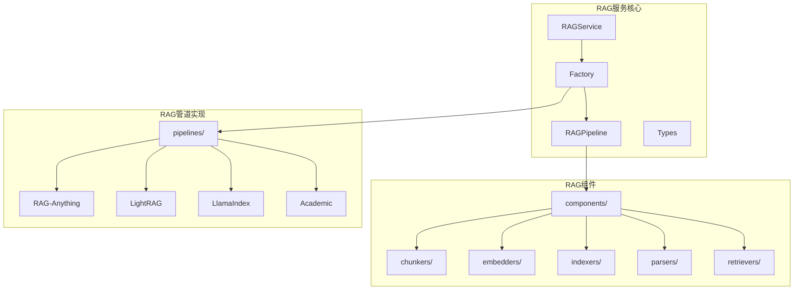

**图示来源**
- [service.py](file://src/services/rag/service.py)
- [pipeline.py](file://src/services/rag/pipeline.py)
- [factory.py](file://src/services/rag/factory.py)

**章节来源**
- [service.py](file://src/services/rag/service.py#L1-L202)
- [pipeline.py](file://src/services/rag/pipeline.py#L1-L170)
- [factory.py](file://src/services/rag/factory.py#L1-L160)

## 核心组件
RAG服务的核心组件包括服务入口、管道、工厂、类型定义和基础组件。这些组件共同构成了灵活可扩展的RAG系统，支持多种文档处理和检索模式。

**章节来源**
- [service.py](file://src/services/rag/service.py#L20-L202)
- [pipeline.py](file://src/services/rag/pipeline.py#L23-L170)
- [types.py](file://src/services/rag/types.py#L12-L74)

## 架构概述
RAG服务采用分层架构设计，从上到下分为服务层、工厂层、管道层和组件层。这种设计实现了高内聚低耦合，便于扩展和维护。

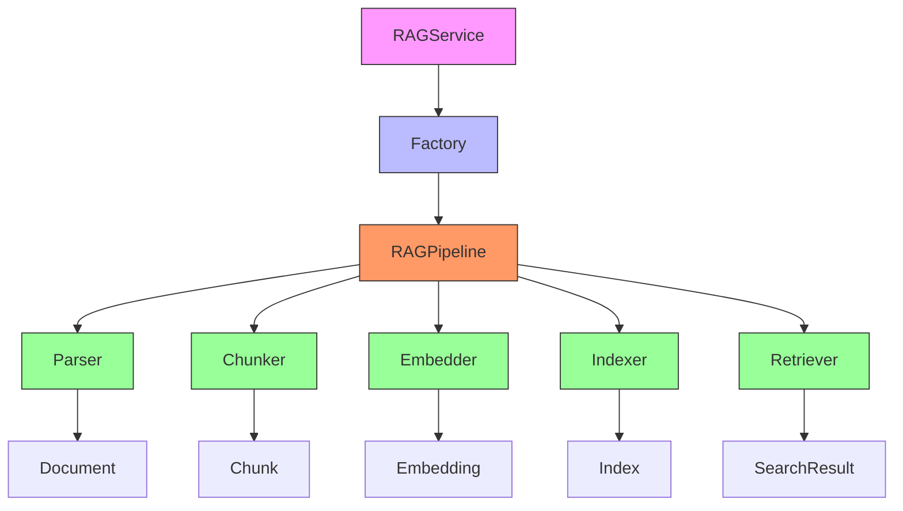

**图示来源**
- [service.py](file://src/services/rag/service.py)
- [pipeline.py](file://src/services/rag/pipeline.py)
- [types.py](file://src/services/rag/types.py)

**章节来源**
- [service.py](file://src/services/rag/service.py#L20-L202)
- [pipeline.py](file://src/services/rag/pipeline.py#L23-L170)

## 详细组件分析

### RAG服务入口分析
RAGService类作为统一的服务入口，提供知识库初始化、搜索和删除等操作的接口。它通过工厂模式获取具体的管道实现，屏蔽了底层复杂性。

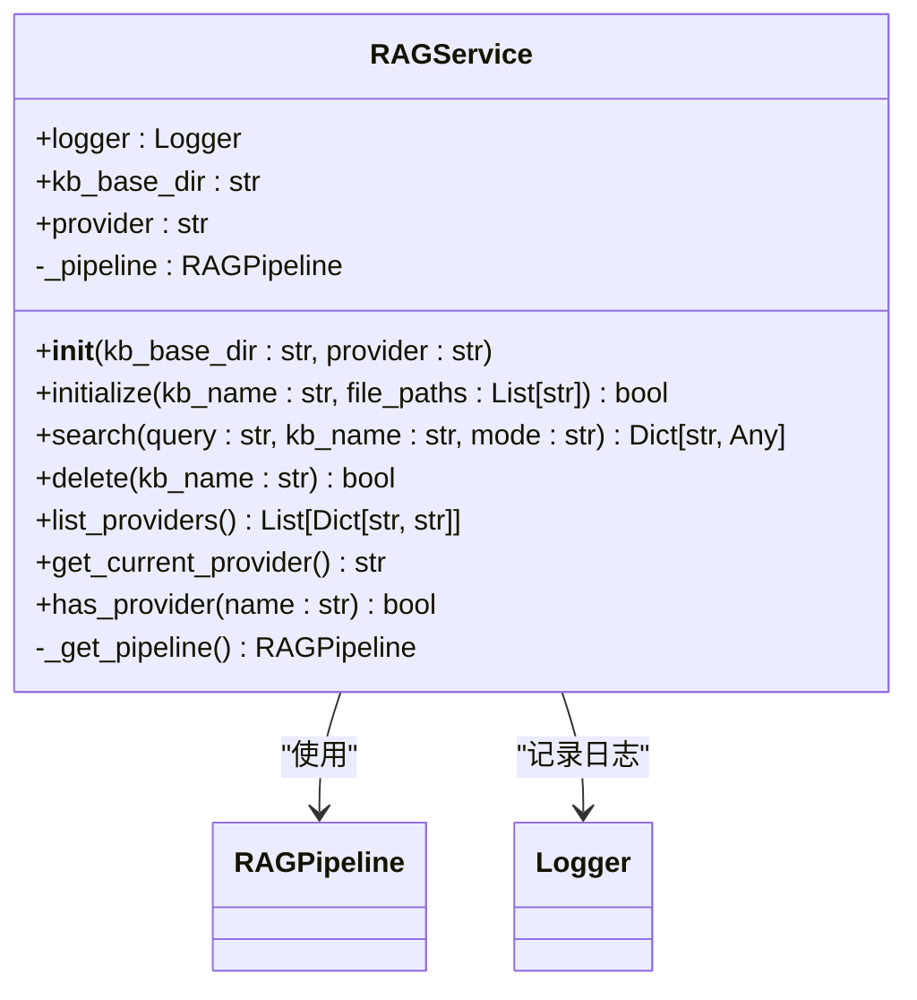

**图示来源**
- [service.py](file://src/services/rag/service.py#L20-L202)

**章节来源**
- [service.py](file://src/services/rag/service.py#L20-L202)

### RAG管道分析
RAGPipeline类提供了一个流畅的API，允许通过链式调用配置文档处理管道。管道包含解析、分块、嵌入、索引和检索等阶段，支持组件的灵活组合。

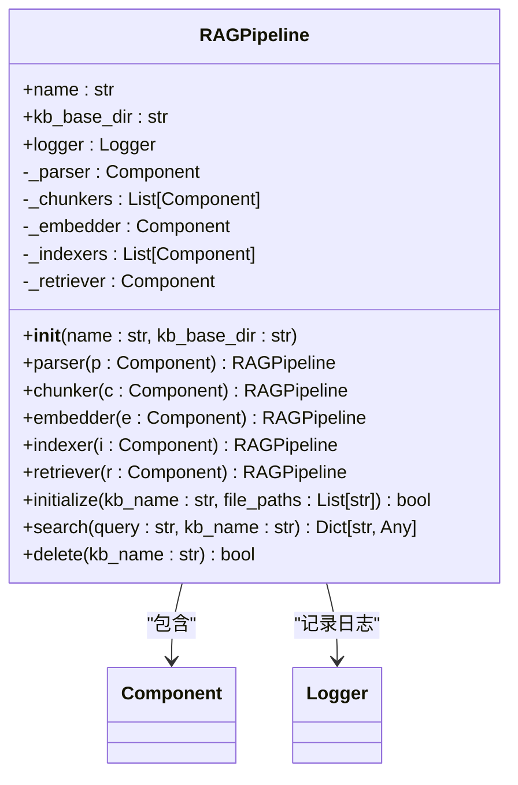

**图示来源**
- [pipeline.py](file://src/services/rag/pipeline.py#L23-L170)

**章节来源**
- [pipeline.py](file://src/services/rag/pipeline.py#L23-L170)

### RAG工厂分析
工厂模式用于创建和管理RAG管道实例，支持多种管道类型（raganything、lightrag、llamaindex、academic），并提供注册和查询接口。

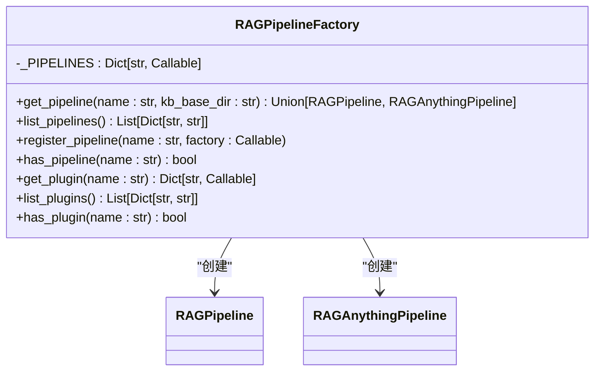

**图示来源**
- [factory.py](file://src/services/rag/factory.py#L23-L160)

**章节来源**
- [factory.py](file://src/services/rag/factory.py#L23-L160)

### RAG类型定义分析
类型模块定义了RAG系统中使用的核心数据结构，包括文档、块和搜索结果，为组件间的数据传递提供了类型安全。

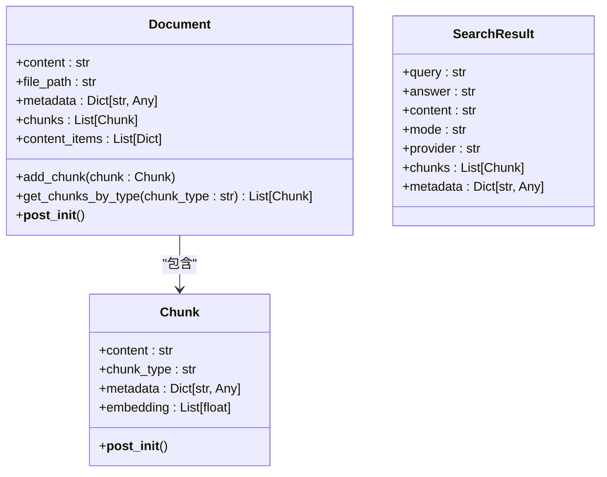

**图示来源**
- [types.py](file://src/services/rag/types.py#L12-L74)

**章节来源**
- [types.py](file://src/services/rag/types.py#L12-L74)

### RAG组件基础分析
基础组件模块定义了所有RAG组件的协议和基类，确保组件的一致性和可替换性。

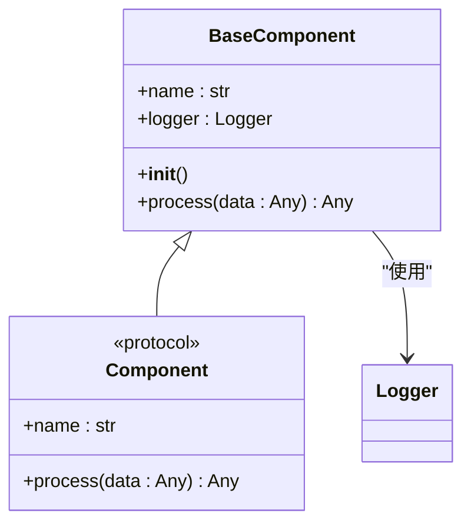

**图示来源**
- [base.py](file://src/services/rag/components/base.py#L11-L60)

**章节来源**
- [base.py](file://src/services/rag/components/base.py#L11-L60)

### RAG-Anything管道分析
RAG-Anything管道是一个端到端的解决方案，专为学术文档处理设计，集成了MinerU PDF解析和LightRAG知识图谱构建功能。

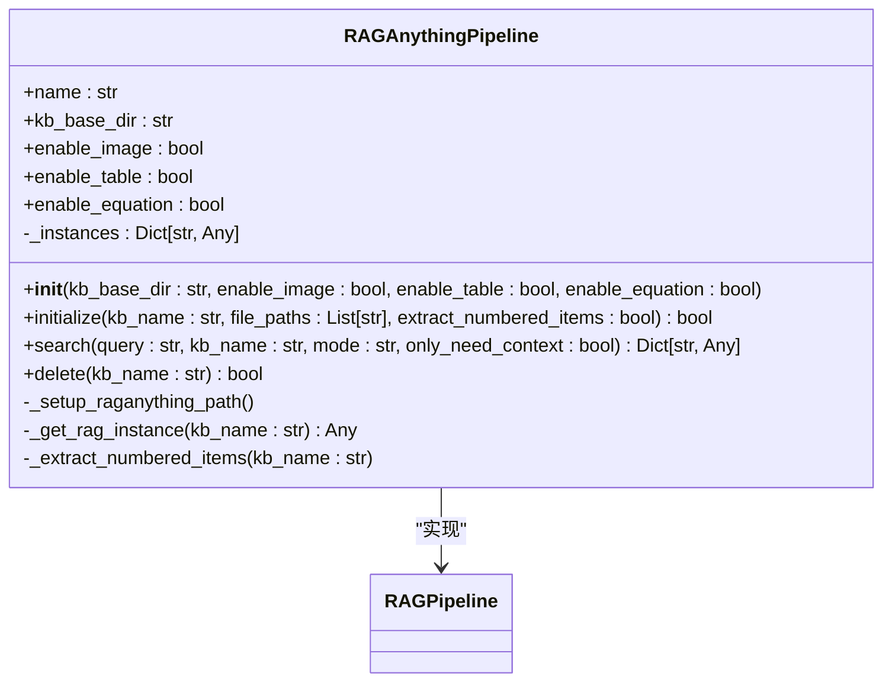

**图示来源**
- [raganything.py](file://src/services/rag/pipelines/raganything.py#L16-L310)

**章节来源**
- [raganything.py](file://src/services/rag/pipelines/raganything.py#L16-L310)

### 学术管道分析
学术管道专为学术文档优化，包含编号项提取器，能够识别和处理定义、定理、方程等内容。

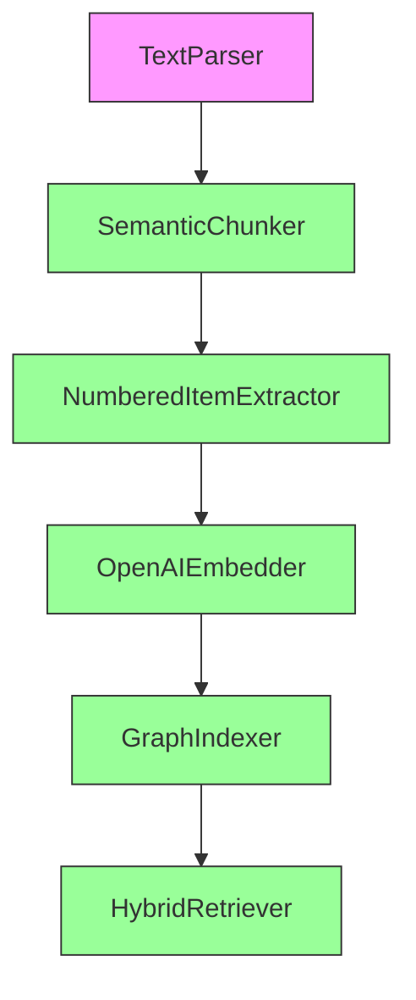

**图示来源**
- [academic.py](file://src/services/rag/pipelines/academic.py#L18-L45)

**章节来源**
- [academic.py](file://src/services/rag/pipelines/academic.py#L18-L45)

### LightRAG管道分析
LightRAG管道基于知识图谱索引，提供图结构的检索能力。

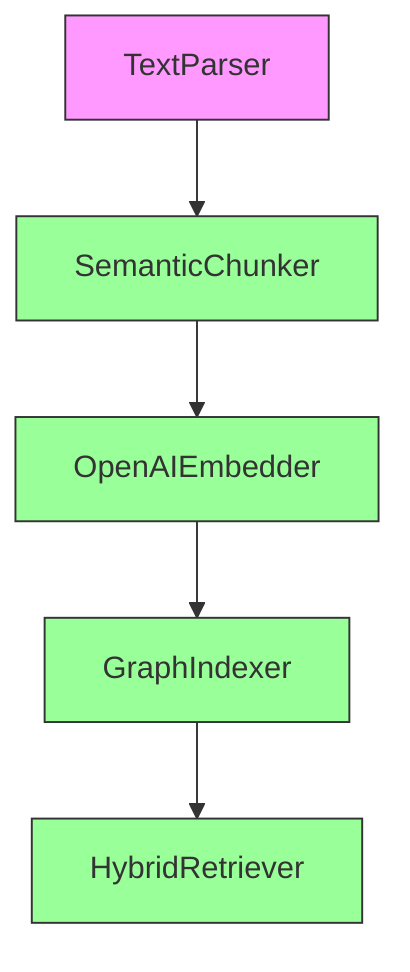

**图示来源**
- [lightrag.py](file://src/services/rag/pipelines/lightrag.py#L18-L43)

**章节来源**
- [lightrag.py](file://src/services/rag/pipelines/lightrag.py#L18-L43)

### LlamaIndex管道分析
LlamaIndex管道使用向量索引实现快速检索。

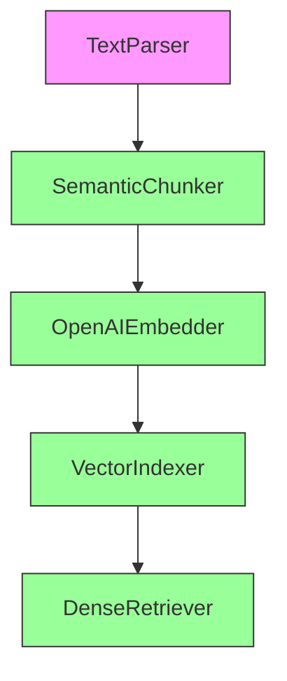

**图示来源**
- [llamaindex.py](file://src/services/rag/pipelines/llamaindex.py#L18-L43)

**章节来源**
- [llamaindex.py](file://src/services/rag/pipelines/llamaindex.py#L18-L43)

### 知识库API分析
知识库API提供REST接口，支持知识库的创建、删除、文件上传和进度查询等操作。

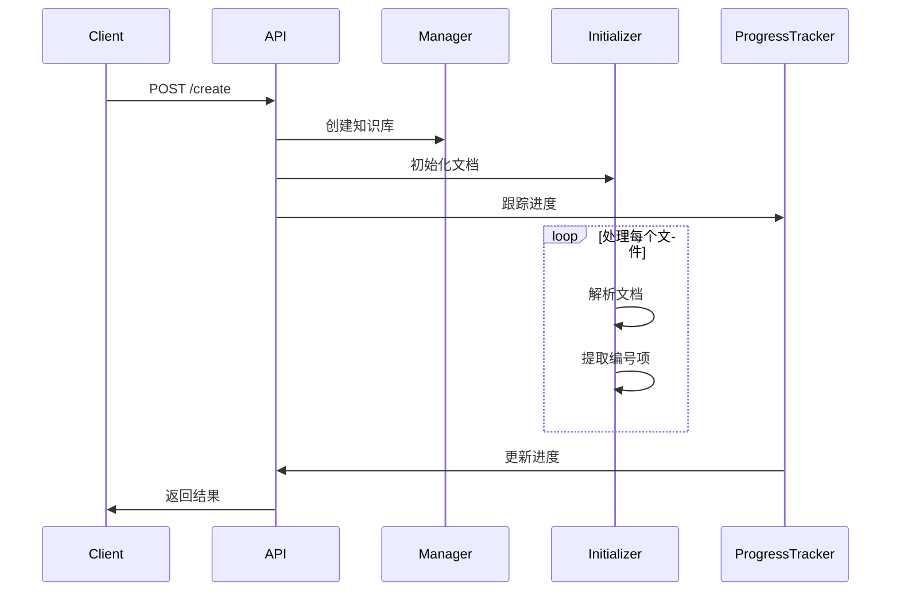

**图示来源**
- [knowledge.py](file://src/api/routers/knowledge.py#L1-L511)

**章节来源**
- [knowledge.py](file://src/api/routers/knowledge.py#L1-L511)

### RAG工具分析
RAG工具模块提供简单的函数包装器，方便在其他模块中调用RAG功能。

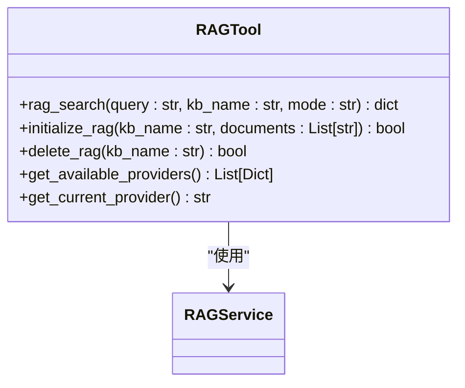

**图示来源**
- [rag_tool.py](file://src/tools/rag_tool.py#L24-L174)

**章节来源**
- [rag_tool.py](file://src/tools/rag_tool.py#L24-L174)

## 依赖分析
RAG服务的依赖关系清晰，各组件通过接口或基类进行交互，降低了耦合度。

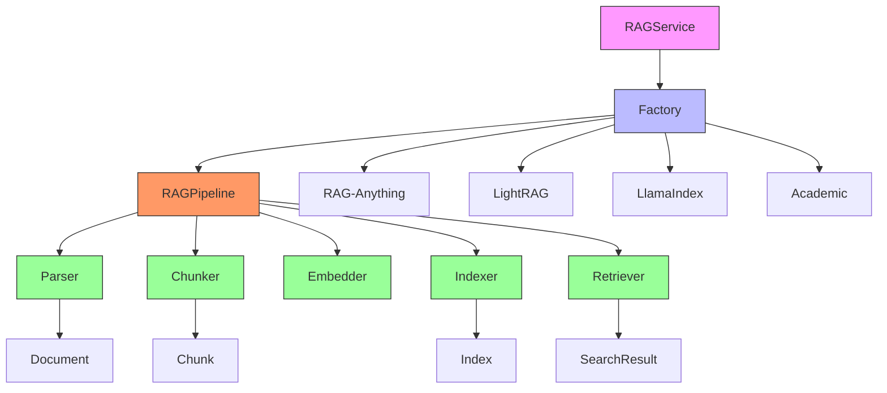

**图示来源**
- [service.py](file://src/services/rag/service.py)
- [factory.py](file://src/services/rag/factory.py)
- [pipeline.py](file://src/services/rag/pipeline.py)

**章节来源**
- [service.py](file://src/services/rag/service.py#L20-L202)
- [factory.py](file://src/services/rag/factory.py#L23-L160)
- [pipeline.py](file://src/services/rag/pipeline.py#L23-L170)

## 性能考虑
RAG服务在设计时考虑了性能因素，如在索引阶段使用asyncio.gather实现并行处理，在检索时提供多种模式（hybrid、local、global、naive）以平衡准确性和速度。

## 故障排除指南
当RAG服务出现问题时，可以检查以下方面：
- 确认知识库目录存在且有读写权限
- 检查RAG_PROVIDER环境变量是否正确设置
- 查看日志文件获取详细错误信息
- 使用clean-rag命令清理可能损坏的RAG存储

**章节来源**
- [manager.py](file://src/knowledge/manager.py#L305-L338)
- [service.py](file://src/services/rag/service.py#L131-L159)

## 结论
RAG服务是DeepTutor项目的核心组件，提供了灵活可扩展的检索增强生成能力。通过模块化设计和工厂模式，服务支持多种管道实现，能够满足不同场景的需求。建议在使用时根据具体需求选择合适的管道类型，并注意配置正确的环境变量。