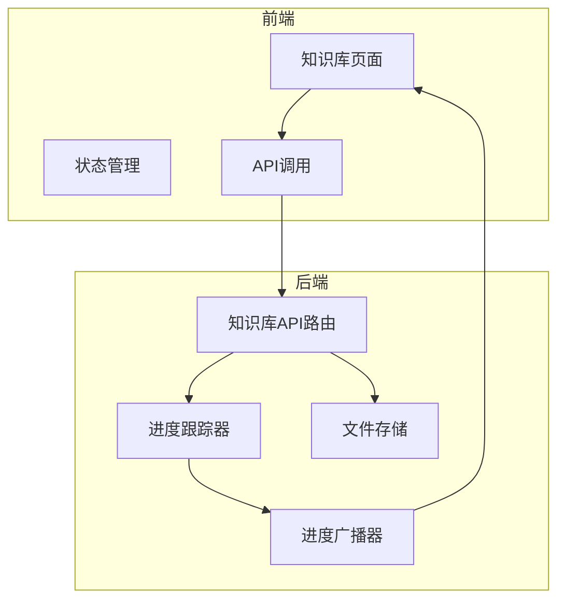
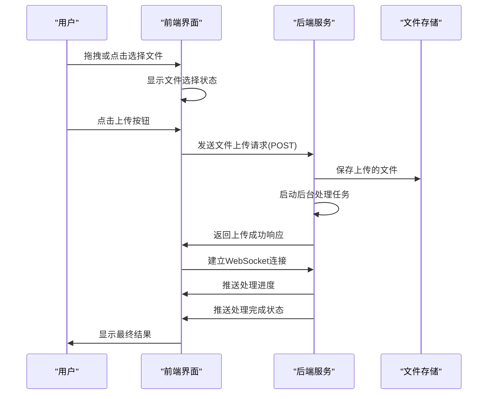
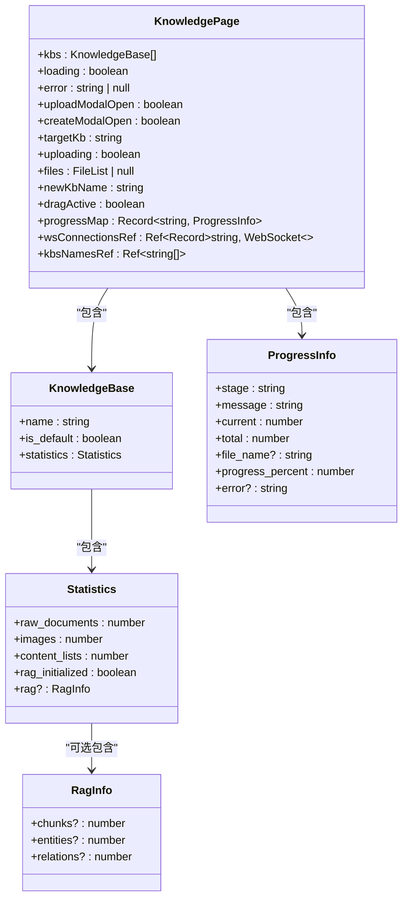
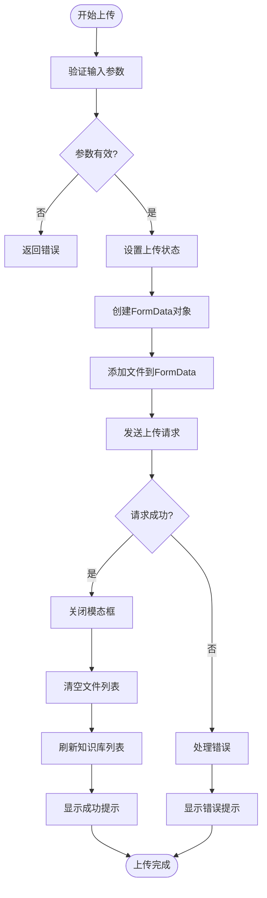
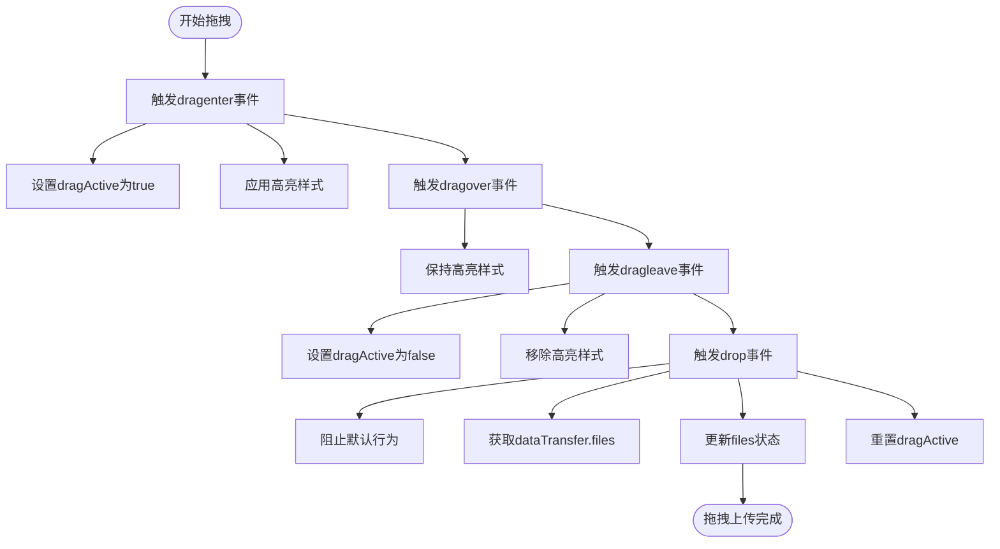
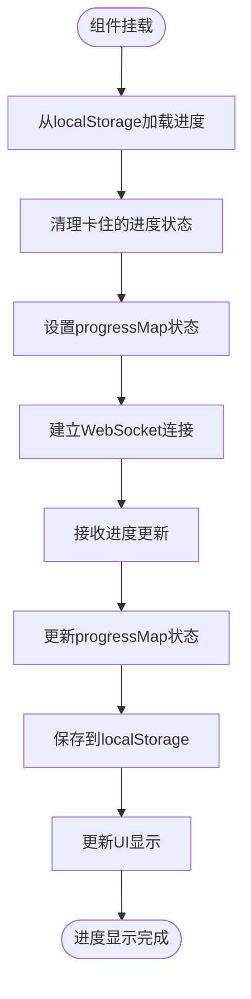
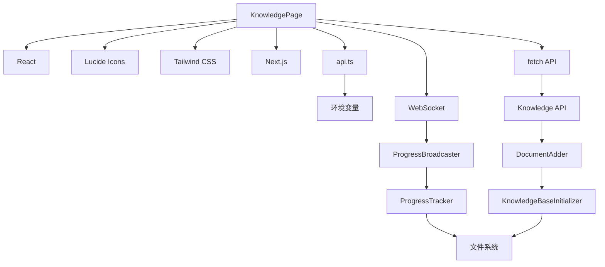

# 前端上传界面

<cite>
**本文档引用的文件**   
- [page.tsx](file://web/app/knowledge/page.tsx)
- [api.ts](file://web/lib/api.ts)
- [knowledge.py](file://src/api/routers/knowledge.py)
- [progress_tracker.py](file://src/knowledge/progress_tracker.py)
- [progress_broadcaster.py](file://src/api/utils/progress_broadcaster.py)
- [globals.css](file://web/app/globals.css)
</cite>

## 目录
1. [简介](#简介)
2. [项目结构](#项目结构)
3. [核心组件](#核心组件)
4. [架构概述](#架构概述)
5. [详细组件分析](#详细组件分析)
6. [依赖分析](#依赖分析)
7. [性能考虑](#性能考虑)
8. [故障排除指南](#故障排除指南)
9. [结论](#结论)
10. [附录](#附录)（如有必要）

## 简介
本文档深入解析了DeepTutor项目中知识库上传界面的实现。重点分析了`web/app/knowledge/page.tsx`文件中的`KnowledgePage`组件，详细说明了如何通过拖拽或点击方式上传文件。文档涵盖了文件上传表单的构建、拖拽区域的交互逻辑、上传进度的实时显示，以及前端如何与后端API通信并处理上传反馈。通过React的状态管理和事件处理机制，展示了完整的上传流程和用户体验优化。

## 项目结构
知识库上传功能主要由前端React组件和后端FastAPI路由共同实现。前端组件位于`web/app/knowledge/page.tsx`，负责用户界面和交互逻辑。后端API路由位于`src/api/routers/knowledge.py`，处理文件上传和知识库初始化。进度跟踪器`src/knowledge/progress_tracker.py`和进度广播器`src/api/utils/progress_broadcaster.py`实现了实时进度更新功能。

**图表来源**
- [page.tsx](file://web/app/knowledge/page.tsx)
- [knowledge.py](file://src/api/routers/knowledge.py)
- [progress_tracker.py](file://src/knowledge/progress_tracker.py)
- [progress_broadcaster.py](file://src/api/utils/progress_broadcaster.py)

## 核心组件
`KnowledgePage`组件是知识库管理的核心界面，实现了知识库的列表展示、创建、删除和文件上传功能。组件使用React的`useState`和`useEffect`钩子进行状态管理和生命周期控制，通过`fetch`和WebSocket与后端进行通信。上传功能通过模态框实现，支持拖拽和点击两种文件选择方式。

**章节来源**
- [page.tsx](file://web/app/knowledge/page.tsx#L47-L1018)

## 架构概述
知识库上传功能采用前后端分离架构，前端使用React构建用户界面，后端使用FastAPI提供RESTful API和WebSocket服务。文件上传采用分步处理模式：前端收集文件后通过HTTP POST请求发送到后端，后端在后台异步处理文件并初始化知识库，同时通过WebSocket向前端推送实时进度更新。

**图表来源**
- [page.tsx](file://web/app/knowledge/page.tsx#L444-L471)
- [knowledge.py](file://src/api/routers/knowledge.py#L296-L340)

## 详细组件分析

### 知识库页面分析
`KnowledgePage`组件实现了完整的知识库管理功能，包括列表展示、创建、删除和文件上传。组件使用TypeScript定义了`KnowledgeBase`和`ProgressInfo`接口，确保类型安全。状态管理使用`useState`钩子，包含了知识库列表、加载状态、错误信息、上传模态框状态、文件列表、拖拽状态和进度映射等。

#### 状态管理分析

**图表来源**
- [page.tsx](file://web/app/knowledge/page.tsx#L21-L45)

#### 上传流程分析

**图表来源**
- [page.tsx](file://web/app/knowledge/page.tsx#L444-L471)

### 拖拽上传交互分析
拖拽上传功能通过`handleDrag`和`handleDrop`两个事件处理函数实现。`handleDrag`函数处理`dragenter`、`dragover`和`dragleave`事件，用于更新拖拽状态和视觉反馈。`handleDrop`函数处理`drop`事件，获取拖拽的文件并更新状态。

**图表来源**
- [page.tsx](file://web/app/knowledge/page.tsx#L551-L569)

### 进度显示分析
进度显示功能通过`progressMap`状态和WebSocket连接实现。前端从`localStorage`恢复进度状态，通过WebSocket接收实时进度更新，并将进度信息持久化到`localStorage`。进度条根据`progress_percent`值动态更新，不同状态显示不同的颜色和图标。

**图表来源**
- [page.tsx](file://web/app/knowledge/page.tsx#L66-L358)

## 依赖分析
知识库上传功能依赖多个前端和后端组件。前端依赖React、Lucide图标库、Tailwind CSS和Next.js框架。后端依赖FastAPI、WebSocket和文件系统操作。前后端通过API和WebSocket进行通信，形成完整的上传处理链。

**图表来源**
- [page.tsx](file://web/app/knowledge/page.tsx)
- [api.ts](file://web/lib/api.ts)
- [knowledge.py](file://src/api/routers/knowledge.py)
- [progress_tracker.py](file://src/knowledge/progress_tracker.py)
- [progress_broadcaster.py](file://src/api/utils/progress_broadcaster.py)

## 性能考虑
上传功能在设计时考虑了多个性能因素。前端使用`useCallback`优化事件处理函数，避免不必要的重新渲染。进度状态通过`localStorage`持久化，避免页面刷新后丢失。WebSocket连接在知识库列表变化时才重新建立，减少不必要的连接开销。后端采用异步处理模式，避免阻塞主线程。

## 故障排除指南
上传功能可能遇到的常见问题包括：后端连接失败、文件类型不支持、上传超时和进度卡住。对于后端连接失败，检查`config/main.yaml`中的端口配置和`.env.local`文件的生成。对于文件类型问题，确保上传的文件扩展名为`.pdf`、`.txt`或`.md`。对于进度卡住，可以使用"Clear"按钮清除卡住的进度状态。

**章节来源**
- [page.tsx](file://web/app/knowledge/page.tsx#L190-L197)
- [page.tsx](file://web/app/knowledge/page.tsx#L897-L898)
- [page.tsx](file://web/app/knowledge/page.tsx#L784-L797)

## 结论
DeepTutor的知识库上传界面实现了完整的文件上传和处理功能，通过React的状态管理和事件处理机制，提供了良好的用户体验。拖拽上传、实时进度显示和错误处理等功能使得文件上传过程直观易用。前后端分离的架构设计使得系统具有良好的可维护性和扩展性。

## 附录

### 支持的文件类型
上传功能支持以下文件类型：
- PDF文档（.pdf）
- 文本文件（.txt）
- Markdown文件（.md）

### 进度状态说明
| 状态 | 描述 | 颜色 |
|------|------|------|
| initializing | 初始化知识库 | 蓝色 |
| processing_documents | 处理文档 | 蓝色 |
| processing_file | 处理单个文件 | 蓝色 |
| extracting_items | 提取编号项目 | 蓝色 |
| completed | 处理完成 | 绿色 |
| error | 处理错误 | 红色 |

### API端点
| 端点 | 方法 | 描述 |
|------|------|------|
| /api/v1/knowledge/list | GET | 获取知识库列表 |
| /api/v1/knowledge/{kb_name}/upload | POST | 上传文件到知识库 |
| /api/v1/knowledge/create | POST | 创建新知识库 |
| /api/v1/knowledge/{kb_name}/progress/ws | WebSocket | 获取实时进度 |